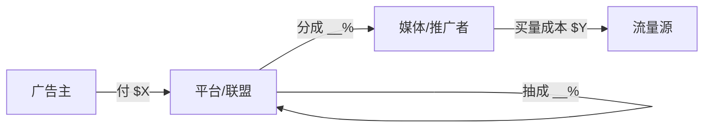

# 案例拆解模板

> 用于 `15_案例与实战复盘/` 及各业务目录下的案例子目录。
> 文件命名：`YYYYMMDD_案例名.md`

---

## 一、通用案例拆解模板（商业模式 / 玩法类）

```markdown
# 案例拆解：<案例名>

**拆解日期**：YYYY-MM-DD
**案例来源**：<链接 / 截图 / 内部观察 / 他人转述>
**案例类型**：Affiliate / Arbitrage / 媒体变现 / 平台产品 / 投放策略 / 反作弊事件 / 其他
**市场**：国内 / 海外（国家、Tier）
**端**：Web / Mobile Web / iOS / Android / CTV
**可信度**：一手观察 / 二手转述 / 公开资料 / 推演

---

## 1. 案例概述
3~5 句话说清：谁、在哪个市场、做什么、量级大概多少、为什么值得研究。

## 2. 角色与资金流

| 角色 | 是谁 | 付出什么 | 得到什么 |
|---|---|---|---|
| 广告主 | | 钱 | |
| 平台/联盟 | | | 抽成 __% |
| 媒体/流量方 | | 流量 | |
| 用户 | | 注意力/数据 | |



**关键问题**：钱在哪一环被抽走最多？谁承担了风险？

## 3. 产品链路拆解（用户视角全流程）
```
曝光 → 点击 → 落地页 → 中间页 → 转化 → 回传 → 结算
```
逐步写：每一步用户看到什么、系统在做什么、流失大概在哪。

## 4. 技术实现推演
| 环节 | 推测用了什么 | 依据 | 可信度 |
|---|---|---|---|
| 追踪 | | | [推断] |
| 归因 | | | [推断] |
| 变现 | | | [推断] |
| 反作弊 | | | [推断] |

## 5. 单位经济与毛利测算

```
收入侧：
  流量规模      = ___ UV/day
  变现 eCPM     = $___
  日收入        = ___

成本侧：
  买量成本      = CPC $___ × CTR ___% × UV = ___
  基础设施      = ___
  支付通道费    = ___%
  人力/其他     = ___

毛利 Δ = ___，毛利率 = ___%
盈亏平衡点：需要 CTR ≥ ___% 或 CVR ≥ ___%
```

**敏感性**：哪个变量变动 10% 会让毛利归零？→ ___

## 6. 风险与可持续性

| 风险类型 | 具体风险 | 概率 | 影响 | 缓解方式 |
|---|---|---|---|---|
| 平台政策 | 封号/降权 | | | |
| 合规 | GDPR/CCPA/广告法 | | | |
| 竞争 | 出价被抬高 | | | |
| 技术 | Cookie/ID 失效 | | | |
| 资金 | 联盟不结算/扣量 | | | |

**可持续性判断**：短期红利 / 中期可做 / 长期壁垒　　**理由**：___

## 7. 可复用 vs 不可复用

| 可复用（原理/方法） | 不可复用（时机/资源/灰色） |
|---|---|
| | |

## 8. 我的结论与行动
- 认知更新：这个案例纠正/补充了我对 ___ 的理解
- 待验证：
- 后续研究：

## 9. 相关文档
- 术语：`02_核心术语与知识库/___`
- 原理：`___`
```

---

## 二、业务现象诊断模板（指标异动类）

```markdown
# 现象诊断：<一句话现象>

**日期**：YYYY-MM-DD　**产品/业务**：___　**严重度**：P0 / P1 / P2

## 1. 现象复述（只写事实，不写结论）
| 指标 | 基线 | 当前 | 变化 | 时间窗 |
|---|---|---|---|---|
| | | | | |

## 2. 链路定位
```
请求 → 填充 → 展示 → 点击 → 转化 → 回传 → 结算
         ↑ 掉在这一环（示例）
```
每一环的漏斗数据：
| 环节 | 昨日 | 今日 | 变化 |
|---|---|---|---|

## 3. 原因假设表（按概率排序）
| # | 假设原因 | 概率 | 验证手段 | 排除条件 | 结论 |
|---|---|---|---|---|---|
| 1 | | 高 | 查 ___ | 若 ___ 则排除 | 待定/证实/排除 |
| 2 | | 中 | | | |

## 4. 最可能的原因与验证步骤
1. 先看 ___（命令/查询/后台路径）
2. 再看 ___
3. 交叉验证 ___

## 5. 修复动作
| 动作 | 负责 | 预期效果 | 风险 |
|---|---|---|---|

## 6. 复盘
- 根因（Root Cause）：
- 为什么没早发现（监控缺口）：
- 长期改进：
```

---

## 三、竞品/产品拆解模板

```markdown
# 竞品拆解：<产品名>

**日期**：YYYY-MM-DD　**类别**：DSP / SSP / ADX / 聚合平台 / MMP / 联盟网络 / 广告平台

## 1. 一句话定位
它替谁、解决什么问题、怎么赚钱。

## 2. 基本盘
| 项 | 内容 |
|---|---|
| 成立/上线 | |
| 归属 | 独立 / 被谁收购 |
| 主要市场 | |
| 流量/客户规模 | |
| 计费模式 | |
| Take Rate | |
| 接入门槛 | 最低流量要求 / 审批 |

## 3. 产品能力矩阵
| 能力 | 有无 | 说明 |
|---|---|---|
| 竞价方式 | Waterfall / Bidding / 混合 | |
| 支持的广告样式 | | |
| 定向能力 | | |
| 报表与数据出口 | | |
| 反作弊 | | |
| 合规（TCF/CMP） | | |

## 4. 技术架构推测
（标 [推断]，写清依据）

## 5. 优势 / 劣势 / 适用场景
| 优势 | 劣势 |
|---|---|

**适合谁**：___　**不适合谁**：___

## 6. 与同类对比
| 维度 | 本品 | 竞品A | 竞品B |
|---|---|---|---|

## 7. 结论
```

---

## 四、日志分析模板

```markdown
# 日志分析：<协议/来源> - <问题>

**日期**：YYYY-MM-DD　**日志类型**：Bid Request / Bid Response / Postback / 服务端日志 / SDK 日志

## 1. 协议识别
- 协议与版本：OpenRTB ___ / VAST ___ / 私有
- 判断依据：字段特征 ___

## 2. 原始日志
```
<脱敏后原文>
```

## 3. 字段释义
| 字段路径 | 类型 | 含义 | 本次取值 | 解读 | 异常 |
|---|---|---|---|---|---|
| `imp[0].banner.w` | int | 广告位宽 | 320 | | |
| `device.ifa` | string | 设备广告标识 | | 空/未授权？ | ⚠️ |

## 4. 异常点清单
| # | 异常 | 严重度 | 影响 | 可能原因 |
|---|---|---|---|---|

## 5. 排查顺序
1. ___
2. ___

## 6. 背景知识补充
（本条日志涉及的机制，链接到对应原理文档）

## 7. 结论
```
