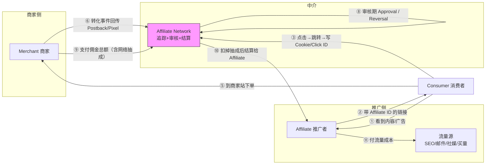
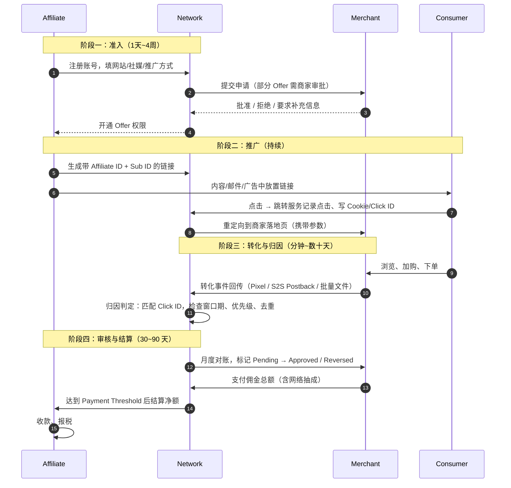

# Affiliate 体系总览

> **一句话定位**：Affiliate Marketing 是一套**去中心化、按效果结算**的分销体系——商家把销售风险外包给成千上万个独立推广者，推广者用自己的流量资产换佣金，网络在中间做撮合、追踪与结算担保。
>
> **本文解决的问题**：搞清"谁在赚谁的钱、凭什么赚、和程序化广告有什么本质不同"，并把中文里被混译为"联盟"的三样东西彻底分开。
>
> **可信度标签**：`[标准]` 官方标准/文档明文　`[政策]` 平台公开政策（标时点）　`[惯例]` 行业共识做法　`[推断]` 待验证推导
>
> 最后更新：2026-09-09

---

## 1. 定义与本质

### 1.1 准确定义

**联盟营销**（Affiliate Marketing，又称 Partner Marketing / Performance Partnership）
指广告主（Merchant）与独立推广者（Affiliate）之间，以**可追踪的效果事件**（成交、线索、安装、注册）为唯一结算依据的分销合作关系。

关键限定词有三个，缺一个就不是 Affiliate：

| 限定 | 含义 | 缺了会变成什么 |
|---|---|---|
| **独立推广者** | Affiliate 是外部第三方，不是商家员工、不是商家自己的渠道 | 变成直营投放或渠道销售 |
| **效果结算** | 只有约定事件发生才付钱，展示与点击不付费 | 变成 CPM/CPC 广告采买（Ad Network） |
| **可追踪** | 必须能技术上判定"这个转化来自哪个 Affiliate" | 变成无法结算的品牌合作/赞助 |

### 1.2 一句话本质

> **商家把"卖不掉货"的风险，转嫁给"有流量但没货"的人；网络负责让这场转嫁可被计量、可被信任。**

这句话里包含三个判断：

1. **风险转移方向**：Affiliate 是**买方风险最低**的广告形式之一。广告主在 CPM/CPC 下要承担"花了钱没效果"的风险，在 CPS 下这个风险几乎完全转移给了 Affiliate。这是商家愿意让出 10%~40% 毛利的根本原因。
2. **参与者的资产形态**：Affiliate 手里的核心资产是**流量获取能力**（SEO 排名、邮件列表、社媒粉丝、投放技术），不是商品、不是资金。
3. **网络的价值来源**：Network 存在的意义不是"技术"，而是**信任中介**——商家不认识成千上万的推广者，推广者也不相信商家会如实报数。网络提供统一的追踪、审核、争议仲裁与结算担保。`[惯例]`

### 1.3 它在 Performance Marketing 里的位置

```
Performance Marketing（效果营销）
├── 平台直投 Self-Serve Ads        Google / Meta / TikTok 后台自己投
│   └── 计费：CPC / CPM / oCPX      风险：广告主承担（花了可能没转化）
├── 程序化采买 Programmatic         通过 DSP 买开放互联网流量
│   └── 计费：CPM（RTB）            风险：广告主承担
├── Affiliate Marketing ★本文       通过联盟网络找推广者
│   └── 计费：CPS / CPA / CPL       风险：推广者承担（没转化就没收入）
└── Arbitrage 套利                  买量 + 变现出口的差价生意
    └── 计费：买入 CPC/CPM，卖出 CPA/展示收入
```

**判断口诀**：谁承担"没转化"的损失，谁就是这条链路里的弱势方。Affiliate 里弱势方是推广者，所以推广者最需要的是**转化率与追踪准确性**，而不是曝光量。

---

## 2. 四方模型：钱与人怎么流动

### 2.1 角色定义与核心诉求

| 角色 | English | 是谁 | 付出什么 | 得到什么 | 核心诉求 | 最怕什么 |
|---|---|---|---|---|---|---|
| **商家** | Merchant / Advertiser / Brand | 有商品或服务要卖的公司 | 佣金 + 网络费 | 增量销售、新客 | ROI、增量性（Incrementality）、品牌安全 | 付了佣金但订单本来就会发生（**非增量**）、被作弊联盟骗佣 |
| **推广者** | Affiliate / Publisher / Partner | 有流量、想变现的个人或公司 | 流量成本 + 内容/投放人力 | 佣金 | EPC 高、审核通过率高、结算准时 | 被扣量（Shaving）、转化被拒（Reversal）、Offer 突然下架 |
| **网络** | Affiliate Network / Platform | 撮合与结算中介 | 追踪系统 + 审核 + 商务 | 抽成 / 差价 / 接入费 | 双边规模、留存率、坏账控制 | 商家跑路不付钱、大规模作弊导致信任崩塌 |
| **消费者** | Consumer / User | 最终买东西的人 | 注意力、数据、钱 | 商品、折扣信息、内容 | 别被骗、别被过度追踪 | 误导性 Advertorial、Cookie Stuffing |

### 2.2 资金流与数据流



**两条流必须分开看**：

- **数据流**（②③⑥⑦）：Click ID 从链接 → Cookie/参数 → 商家 → Postback 回网络 → 归因匹配。这条链任何一跳断了，佣金就没了。这是 `联盟追踪技术与Postback.md` 的主题。
- **资金流**（⑨⑩）：商家付的是**含网络抽成的总额**，Affiliate 拿到的是**扣完之后的净额**。网络抽成结构见 `联盟角色与佣金模型.md` §6。

### 2.3 三方 vs 四方：有没有网络

| | 三方模型（In-house） | 四方模型（Network） |
|---|---|---|
| 结构 | Merchant – Affiliate – Consumer | Merchant – **Network** – Affiliate – Consumer |
| 代表 | Amazon Associates（自建）、Shopify 商家的自建计划、SaaS 公司自研 Partner 系统 | CJ、Impact、Awin、ShareASale |
| 商家成本 | 省掉网络抽成（通常 20%~30%） | 付网络抽成 + 常有一次性接入费与月费 |
| 商家负担 | 要自己做招募、审核、追踪、防作弊、结算、客服 | 网络代劳大部分 |
| 推广者体验 | 只能拿到这一家的 Offer，报表口径单一 | 一个后台看几十上百个 Offer，可横向比 EPC |
| 典型选择者 | 流量规模巨大、有技术团队的品牌（Amazon、Uber、Airbnb 早期） | 绝大多数中大型品牌 |
| 趋势 | SaaS 领域转向**自建 + 平台工具**（如 Impact/Rewardful 提供 SaaS 而非网络） | 传统零售仍以网络为主 |

`[惯例]` 一个常见误解是"网络只是技术供应商"。实际上网络的核心资产是**双边关系数据库**：哪些 Affiliate 能带哪些品类的量、历史表现如何、有没有作弊前科。这个数据新玩家很难短期复制，也是行业集中度较高的原因。

### 2.4 风险分配全景

```
                        风险承担方
  曝光风险(看到了没点)  ────────────────────►  Affiliate 承担
  点击风险(点了没转化)  ────────────────────►  Affiliate 承担
  转化风险(转化了没付款)────────────────────►  商家承担（退货/拒付）
  追踪风险(转化了没记上)────────────────────►  Affiliate 承担（丢单）
  结算风险(记上了没付钱)────────────────────►  Affiliate 承担（网络/商家违约）
  合规风险(内容违规被罚)────────────────────►  双方，视合同
```

**关键洞察**：Affiliate 承担了 5 类风险中的 4 类。所以 Affiliate 侧的核心竞争力不是"能搞到流量"，而是**能把这 4 类风险压到多低**——尤其是追踪丢单率与结算违约率。这也解释了为什么资深 Affiliate 极度重视网络口碑（是否扣量、是否按时结算）胜过佣金比例。`[惯例]`

---

## 3. 红线：三种"联盟"必须分清

中文把 **Affiliate Network / CPA Network / Ad Network** 都译作"联盟"或"广告联盟"，这是本领域最大的混淆源，直接导致提问和检索都失准。

### 3.1 三者对照

| 维度 | **Affiliate Network** | **CPA Network** | **Ad Network** |
|---|---|---|---|
| 英文 | Affiliate Network / Partner Network | CPA Network / Offer Network | Ad Network |
| 中文正名 | **联盟网络 / 合作伙伴网络** | **CPA 网络 / Offer 网络** | **广告网络** |
| 我是谁 | 推广者（卖流量给商家） | 推广者（卖转化给广告主） | **流量方**（把广告位卖出去）或**中间商**（低买高卖流量） |
| 结算依据 | 多为 CPS（成交分成） | CPA / CPL / CPI（动作付费） | CPM / CPC（展示、点击） |
| 主要推广者 | 内容站、博主、KOL、比价站、优惠券站 | 买量投放者（Media Buyer）、漏斗玩家 | 媒体、App 开发者 |
| 典型代表 | CJ、Impact、Awin、ShareASale、Rakuten、PartnerStack | ClickDealer、MaxBounty、AdWork Media、CPAGrip、MyLead | Google AdSense（展示侧）、穿山甲、优量汇、Adsterra |
| 核心资产 | 内容 + SEO + 邮件列表 + 品牌信任 | 投放能力 + 漏斗优化 + 素材产能 | 流量池规模 + 定价与填充能力 |
| 收入来源 | 商家佣金 | 广告主派款（Payout） | 买卖流量的**差价** |
| 转化归属 | 需要归因，窗口期长（7~90 天） | 需要归因，窗口期短（多为 Click 当天~7 天） | 不需要归因，按展示/点击直接计费 |
| 商品是否存在 | 有真实商品/服务，商家有品牌 | 有 Offer，但商家常匿名（尤其 Nutra/Sweeps） | 有广告主，但媒体不关心是谁 |
| 内容质量要求 | 高（内容即资产） | 低~中（漏斗即资产） | 由流量方决定 |
| 主要风险 | SEO 算法更新、佣金下调 | Offer 下架、扣量、账号封禁 | eCPM 波动、政策封禁 |

### 3.2 还有第四个容易混进来的：Referral Program

**推荐计划**（Referral Program）与 Affiliate 高度相似但不同：

| | Affiliate Program | Referral Program |
|---|---|---|
| 推广者是谁 | 陌生第三方，以盈利为目的 | 现有用户，常被给予非现金奖励 |
| 奖励形式 | 现金佣金 | 现金、积分、额度、折扣、免费月份 |
| 关系 | 商业合作，需签约 | 产品内建功能，用户即推广者 |
| 例子 | CJ 上的博主推 Nike | Dropbox 送空间、Uber 送车费 |
| 追踪技术 | 几乎相同（链接 + Cookie + Postback） | 几乎相同 |

`[惯例]` 技术上二者可以共用同一套系统（Impact、PartnerStack 都同时支持），商业上是两件事。写文档或提问时应明确用哪个词。

### 3.3 为什么中文翻译会乱

根源有三个：

1. **早期进入中国的只有 Ad Network**（Google AdSense、百度联盟、淘宝客），"联盟"这个词被它们先占了。
2. **淘宝客体系**把"帮商家带货抽佣"这件事叫"淘宝联盟"，实际上它是 Affiliate Network 的形态，却用了 Ad Network 的名字。
3. **CPA Network 在国内几乎没有对应物**，因为它依赖的买量套利生态在海外更成熟，国内买量走的是巨量引擎/腾讯广告的平台直投路径。

**结论**：看到中文"联盟"两个字，必须先问一句"是 Affiliate、CPA 还是 Ad Network"，否则后面的讨论全废。

### 3.4 快速判断流程

```
这个"联盟"里，我（或玩家）拿到的钱是按什么算的？
├─ 按展示/点击 → Ad Network（广告网络）
│   例：AdSense 收入 = 展示 × eCPM / 1000
├─ 按成交金额百分比 → Affiliate Network（联盟网络）
│   例：推一双鞋，成交 $100，佣金 8% = $8
├─ 按固定动作派款 → CPA Network（Offer 网络）
│   例：一个邮箱注册 $2.5，一个 App 安装 $12
└─ 按买量与变现的差额 → Arbitrage（套利，见 10_广告套利Arbitrage）
    例：CPC $0.3 买量，落地页 AdSense RPM $15，赚差价
```

---

## 4. Affiliate 与程序化广告的本质区别

很多人以为 Affiliate 是"程序化广告的一种"，这是错的。二者在五个根本维度上不同：

| 维度 | 程序化广告（RTB） | Affiliate Marketing |
|---|---|---|
| **交易标的** | 单次曝光机会（Impression） | 一次效果事件（Sale/Lead/Install） |
| **决策时延** | ~100ms，实时拍卖 | 数天到数月，用户自己看内容后转化 |
| **谁做定向** | 买方（DSP）实时决定 | 推广者用自己的内容/列表**预先筛选**了受众 |
| **风险归属** | 广告主承担转化风险 | 推广者承担转化风险 |
| **技术核心** | 拍卖引擎、预估模型、时延工程 | 追踪链路、归因判定、结算对账 |
| **规模经济来源** | 算力 + 数据 + 流量覆盖 | 内容资产 + 流量成本套利 + 关系 |
| **进入门槛** | 极高（DSP 建设成本千万级） | 极低（一个站 + 一个联盟账号即可起步） |
| **可自动化程度** | 极高（算法全托管） | 中（内容与人脉仍需人力） |

### 4.1 最关键的一条：受众筛选发生在投放之前

程序化广告是"我有 1 亿次曝光机会，帮我找到对的人"；
Affiliate 是"我已经聚集了对的人（他们主动来读我的测评/订阅我的邮件），现在帮我找到对的商品"。

**这个方向的反转**决定了：

- Affiliate 的**流量意图质量天然更高**（用户是带着购买意图来搜索"best X for Y"的），所以转化率通常显著高于展示广告；`[惯例]`
- Affiliate 的**规模上限天然更低**（内容产能与受众规模有限），所以超级 Affiliate 靠的是"高单价 Offer × 高转化率"而非"海量曝光"；
- 商家愿意给 Affiliate 的**佣金比例远高于程序化广告的等效成本**，因为买到的是"临门一脚"的流量。

### 4.2 为什么 Affiliate 不需要 RTB

因为**没有实时拍卖的必要**。拍卖解决的是"稀缺资源（一次曝光）如何分配给出价最高者"的问题；
Affiliate 场景下推广者是**主动选择**推哪个 Offer（看 EPC、看佣金、看转化率），商家也是**主动审批**接受哪个 Affiliate（看历史表现、看推广方式是否合规）。这是**双边匹配 + 人工/规则审核**，不是拍卖。`[推断]`

不过近年出现了混合形态：部分网络（如 Impact 的一些实现、以及 Criteo 的 Affiliate 业务）把程序化购买与联盟结算结合，用 RTB 买量但按 CPA 与广告主结算。这类"程序化联盟"在技术上跨了两个体系，理解时要拆开看。

---

## 5. 生态规模与结构

### 5.1 市场规模与口径警告

Affiliate 市场规模**没有权威统一口径**，不同机构差异极大，原因有三：

1. **归因口径不同**：按 Last Click 算，Affiliate 占比会被高估；按增量实验算会大幅缩水。见 `../07_追踪Cookie与归因/归因模型总览.md`。
2. **统计范围不同**：是否含 Influencer Marketing？是否含 Referral？是否含 B2B Partner？是否含 CPS 型的比价/优惠券站？
3. **数据可得性差**：Affiliate 收入分散在数十万长尾主体，多数不公开报税细节。

`[惯例]` 常见引用口径是"Affiliate Marketing 占美国电商销售额的 15%~20% 左右"，这个数字被大量二手文章互相引用，**原始出处难以追溯，应视为量级参考而非事实**。任何具体数字请标 `[推断]` 并给区间。

> 数据时点：该说法在 2015~2025 年的行业文章中反复出现，未见一手调研支撑。使用时务必注明来源与年份。

### 5.2 参与者分层

| 层级 | 名称 | 规模特征 | 收入结构 | 打法 |
|---|---|---|---|---|
| 顶层 | **Super Affiliate** | 单人/小团队月入 $50k~$1M+ | 多 Offer 组合 + 独家谈判 + 自建工具 | 买量漏斗、站群、邮件大列表；与网络有专属 Affiliate Manager，可谈 Bump（额外佣金加成） |
| 中层 | 专业 Affiliate / 小团队 | 月入 $5k~$50k | 垂直品类深耕 | Niche 站 + SEO + 邮件；或单一渠道买量投放 |
| 长尾 | 兼职 / 新人 | 月入 $0~$5k | 单站单渠道 | 内容站、社媒账号、YouTube 频道 |
| 机构化 | Affiliate Agency / Media Company | 团队 10~100 人 | 规模化投放 + 素材工厂 + 数据分析 | 多账户、多渠道、专职合规与风控 |

`[惯例]` 分层的关键不是收入绝对值，而是**是否具备"可复制的流量获取能力"**。长尾靠运气与单次爆款，顶层靠系统性方法论与工具链。

### 5.3 主要形态分类（六大流派）

| 流派 | 核心资产 | 启动成本 | 规模化上限 | 见效周期 | 主要风险 | 详见 |
|---|---|---|---|---|---|---|
| **内容/SEO 站** | 搜索排名、内容库、域名权重 | 低（$100~$2k） | 中（受 Google 算法压制） | 慢（6~18 个月） | 算法更新（HCU）、AI 摘要抢流量 | `Niche站与内容站变现.md` |
| **比价 / 优惠券站** | 交易意图流量、数据抓取能力 | 中（技术投入） | 高 | 中（3~9 个月） | 商家视为"劫持最后一公里"，纷纷排除 | `电商Affiliate与亚马逊联盟.md` |
| **邮件列表** | 订阅者名单（**唯一真正自有的资产**） | 低~中 | 高 | 中（需先建列表） | 送达率衰减、ESP 封号、合规 | `邮件营销与私域List.md` |
| **买量投放（Media Buying）** | 投放技术、素材产能、数据模型 | 高（需垫资 $5k+） | 很高 | 快（数天） | 账户封禁、素材衰减、现金流断裂 | `Affiliate单位经济与规模化.md` |
| **社媒 / KOL / UGC** | 粉丝关系、人设信任 | 低 | 中（依赖个人） | 中 | 平台算法与政策、人设风险 | 本节 |
| **工具 / 插件 / 应用** | 产品本身嵌入推荐位 | 高（开发成本） | 很高 | 慢 | 平台商店政策（如 Chrome 扩展、iOS 审核） | 本节 |

**社媒/KOL 形态的特殊性** `[惯例]`：
它与 Affiliate 的边界正在模糊。传统 KOL 收的是**固定坑位费**（属于 sponsorship，不是 Affiliate），
现代做法是**坑位费 + CPS 分成**混合（Hybrid），部分平台（TikTok Shop、Instagram Shopping、Amazon Influencer Program）
已经把 Affiliate 链接内建进社媒产品，使 KOL 与 Affiliate 在技术上合流。判断标准仍然是：**有没有按效果结算的部分**。

**工具/插件形态的特殊性** `[惯例]`：
浏览器扩展、比价插件、返利插件（如 Honey——2020 年被 PayPal 以约 $40 亿美元收购）本质是
"把 Affiliate 链接自动化注入用户购物流程"。这类产品争议极大：商家既爱它带来的成交，
又恨它在**最后一跳**覆盖掉别人的归因（Last Click 劫持）。见 `联盟反作弊与扣量.md`。

---

## 6. 完整业务链路：从签约到收款



### 6.1 各阶段关键事实

| 阶段 | 耗时 | 关键风险点 | 应对 |
|---|---|---|---|
| 准入 | 1 天~4 周 | 新站被拒（商家要求流量证明）；某些品类（金融、健康）审核极严 | 先做出内容再申请；从审核宽松的网络起步 |
| 推广 | 持续 | 链接被平台屏蔽（社媒对联盟链接限流）；被 Cloaking 检测误伤 | 用自有域名做中转（Landing Page），不裸放联盟链接 |
| 转化归因 | 分钟~90 天 | **丢单**：Cookie 被拦、跨设备、窗口期过期、参数丢失 | 见 `联盟追踪技术与Postback.md` §丢单排查 |
| 审核结算 | 30~90 天 | Reversal（退货/拒付）；商家拖欠；网络倒闭 | 分散网络、看口碑、保留原始数据对账 |

`[惯例]` **现金流是新手最大的隐形杀手**：从点击到收款可能间隔 60~120 天（转化窗口 30 天 + 审核 30 天 + Net-30 结算 + 达到起付额）。
若同时在买量投放（流量成本是**当天现金支出**），账期错配会导致现金流断裂。这是 `Affiliate单位经济与规模化.md` 的核心议题之一。

---

## 7. 关键指标体系

Affiliate 侧与商家侧看的指标不同，混淆会导致沟通失效。

### 7.1 推广者侧（Affiliate 视角）

| 指标 | English | 公式 | 用途 | 典型量级 `[惯例]` |
|---|---|---|---|---|
| 每点击收益 | EPC（Earnings Per Click） | 佣金收入 / 点击数 | **选 Offer 的第一指标** | 内容站 $0.1~$3；高价 B2B SaaS 可达 $10+ |
| 每千点击收益 | EPK / eEPC | EPC × 1000 | 便于与买量 CPC 直接比较 | $100~$3000 |
| 点击转化率 | CR / CVR | 转化数 / 点击数 | 判断漏斗与流量匹配度 | 电商 1%~5%；Lead Gen 5%~20% |
| 平均订单额 | AOV（Average Order Value） | GMV / 订单数 | 决定 CPS 佣金的绝对值 | 视品类 |
| 单转化收益 | Payout / Commission per Conversion | AOV × 佣金率，或固定派款 | 与流量成本对比 | — |
| 投资回报率 | ROI / ROAS | 收入 / 流量成本 | 买量型必看 | 盈亏平衡 = 1.0 |
| 通过率 | Approval Rate | Approved / (Approved + Reversed) | **识别扣量的关键指标** | 健康 >85%；<70% 需警惕 |
| 退款率 | Reversal / Refund Rate | Reversed / Approved | 判断流量质量与 Offer 靠谱度 | 电商 5%~15% |
| 每千次展示收益 | RPM | 收入 / 展示 × 1000 | 内容站与广告位组合时用 | — |

> **注意 EPC 口径陷阱** `[政策]`：多数联盟网络后台显示的 "EPC" 实际是**每 100 次点击的收益**（Earnings Per Hundred Clicks），
> 不是每 1 次点击。CJ、ShareASale 历史上都用过"per 100 clicks"口径。看到 EPC 数字先确认分母，否则会高估 100 倍。
> 同时，网络显示的 EPC 是**全体推广者的平均值**，含超级 Affiliate 的优质流量，新人实际能拿到的通常显著更低。`[惯例]`

### 7.2 商家侧（Merchant 视角）

| 指标 | English | 公式 | 用途 |
|---|---|---|---|
| 联盟渠道收入占比 | Affiliate Revenue Share | 联盟 GMV / 总 GMV | 判断渠道依赖度 |
| 有效佣金率 | Effective Commission Rate | 实付佣金 / 联盟 GMV | 扣除 Reversal 后的真实成本 |
| 增量比 | Incrementality Ratio | 增量销售 / 归因销售 | **最关键也最少被测量** |
| 新客占比 | New Customer Rate | 新客订单 / 联盟订单 | 判断是否只在给老客发折扣 |
| 联盟渠道 ROAS | Affiliate ROAS | 联盟 GMV / (佣金 + 网络费 + 人力) | 与其他渠道横比 |
| 作弊率 | Fraud Rate | 判定作弊转化 / 总归因转化 | 风控健康度 |

`[推断]` **增量比是商家最该关心但最不常测量的指标**。Affiliate 渠道中，优惠券站与返利站在 Last Click 归因下会"截胡"本来就会发生的成交，
使归因收入远高于真实增量。用 Geo Holdout 或 PSA 实验测增量，通常会发现联盟渠道的真实增量只有归因数字的 40%~70%。
这也是为什么大量品牌在合约里**排除 Coupon / Cashback 类推广者**或给它们更低佣金率。验证方法见 `../07_追踪Cookie与归因/增量实验与因果归因.md`。

---

## 8. 国内 vs 海外

### 8.1 系统性对照

| 维度 | 海外 | 国内 |
|---|---|---|
| 主流形态 | Affiliate Network 生态成熟，长尾内容站 + 买量型并重 | **淘客体系**（淘宝联盟 / 京东联盟 / 多多进宝 / 抖音精选联盟）为主，本质是平台自建 Affiliate |
| 独立第三方网络 | CJ / Impact / Awin / ShareASale / Rakuten 等数十家，竞争激烈 | 几乎没有独立第三方网络；平台自营联盟垄断 |
| 主力推广者 | 独立站长、博主、Media Buyer、邮件营销者 | 淘客站长、返利 App（一淘/返利网/花生日记）、导购群主、直播带货达人 |
| 结算依据 | CPS 为主，也有大量 CPA/CPL | 几乎全是 CPS |
| 追踪技术 | Cookie（Web）+ 设备 ID + S2S Postback + MMP | 平台内闭环（淘宝客 PID / 淘口令）、跨平台追踪弱 |
| 归因窗口 | 7~90 天常见 | 平台内点击后 15 天左右（各平台不同）`[政策]` |
| 二级分销 | 存在但受合规约束（多层分销在美国部分州与 FTC 视野下敏感） | 曾爆发（花生日记、云集），后因**传销认定风险**被监管收紧 |
| 内容站生态 | Niche 站 + SEO 是主流打法之一 | SEO 生态被平台内容闭环（百家号、知乎、小红书）挤压，独立站少 |
| 邮件营销 | 核心渠道，List 是可估值资产 | **几乎不存在**（邮件使用率低、送达率低、合规与垃圾邮件问题） |
| CPA Network | 成熟，Offer 市场活跃（Nutra/Sweeps/Lead Gen） | 基本没有对应物；效果广告走平台直投 |
| 买量套利 | 活跃（Native/Push/Pop 流量 + Offer） | 受平台风控与版号/资质限制，形态不同（更多是信息流代投） |
| 合规重点 | FTC 披露义务、GDPR Cookie 同意、Nutra 宣称红线 | 广告法（绝对化用语、代言责任）、电商法、二选一与返利合规 |
| 数据透明度 | 网络后台给 EPC/CR 等聚合数据 | 平台联盟后台数据更封闭 |

### 8.2 为什么国内 Affiliate 生态"弱"

不是需求弱，而是**结构不同**，四个原因 `[推断]`：

1. **平台闭环吃掉了独立生态**。淘宝/京东/拼多多自建联盟，把商家、推广者、追踪、结算全锁在自己体系内。
   独立第三方网络没有生存空间——因为商家不需要它，推广者也只认平台流量。
2. **搜索流量不独立**。海外 Niche 站的命脉是 Google SEO；国内搜索份额低且被内容平台分流，
   独立站获取自然流量的路径基本不存在，只能依附于平台内容生态（小红书、知乎、抖音）。
3. **邮件渠道缺失**。海外 Affiliate 的"自有资产"是邮件列表；国内没有这个渠道，
   推广者的流量都是**租来的**（平台账号随时可能被封），资产沉淀能力弱。
4. **支付与合规环境**。国内对多级分销的传销认定、对返利模式的监管态度，
   使海外常见的 Sub-affiliate / 二级分销打法难以规模化。

### 8.3 跨境场景：两边的交叠点

`[惯例]` 实际业务中两边会交叉：

- **中国卖家出海**：在 Amazon / Shopify 独立站卖货，通过 Impact / Awin / ShareASale 找海外 Affiliate 推广，
  或用 Amazon Associates 让海外博主带货。这是国内团队接触 Affiliate 最常见的入口。
- **中国团队做海外 Affiliate**：建站/买量面向欧美流量，推海外商家的 Offer，赚美元佣金。
  集中在深圳、厦门、杭州等地，形态包括 Niche 站群、买量漏斗、工具类插件。
- **TikTok Shop 联盟**：把海外 Affiliate 模式与短视频带货结合，达人通过联盟链接分佣，
  是 2023 年后增长最快的形态之一。

### 8.4 术语对照（提问时用得上）

| 海外叫法 | 国内对应物 | 备注 |
|---|---|---|
| Affiliate | 淘客 / 推广者 / 达人 | 国内"达人"更接近 Influencer |
| Merchant | 商家 / 品牌方 | — |
| Affiliate Network | 淘宝联盟 / 京东联盟 / 精选联盟 | 国内是平台自营，非第三方 |
| Offer | 推广计划 / 商品佣金计划 | — |
| Payout / Commission | 佣金 / 技术服务费分成 | 国内平台会额外抽"技术服务费" |
| Sub ID | PID / 推广位 ID / 淘口令 | 国内用 PID 三级结构（mm_xxx_yyy_zzz） |
| Cookie Duration | 点击有效期 / 佣金保护期 | — |
| Cashback Site | 返利网 / 一淘 | 形态一致 |
| Coupon Site | 优惠券站 / 什么值得买 | 部分重合 |

---

## 9. 常见误解

**❌ 误解 1：Affiliate 就是"帮人打广告拿钱"，和广告投放一样。**
✅ 正确：核心区别是**风险归属**。广告投放是"先花钱买曝光，效果自负"；Affiliate 是"先做推广，有效果才拿钱"。
这决定了二者的能力模型完全不同：投放拼的是出价与素材效率，Affiliate 拼的是流量资产与转化率。

**❌ 误解 2：佣金比例越高，Offer 越好。**
✅ 正确：应该看 **EPC = 佣金 × 转化率**，而不是单看佣金率。50% 佣金但转化率 0.1% 的 Offer，
远不如 8% 佣金但转化率 5% 的 Offer。高佣金往往意味着商家转化链路差、退货率高或产品口碑弱。`[惯例]`

**❌ 误解 3：网络后台的 EPC 是我能拿到的收益。**
✅ 正确：那是**全体推广者的平均值**，且分母口径可能是"每 100 次点击"。
新人实际 EPC 通常显著低于展示值，因为缺少优质流量与成熟的漏斗优化。

**❌ 误解 4：Affiliate 是被动收入，做一次躺着赚。**
✅ 正确：内容站需要持续更新（Google 算法与竞争对手都在动）、买量需要每天盯素材衰减、
邮件列表需要持续供内容。真正的"被动"只存在于已经建立强品牌信任的头部站点，且仍需维护。`[惯例]`

**❌ 误解 5：Affiliate 和 Influencer Marketing 是一回事。**
✅ 正确：Influencer 通常收**固定坑位费**（sponsorship），不按效果结算；Affiliate 按效果结算。
现实中二者常混合（坑位费 + CPS），但商业逻辑与风险分配不同：坑位费模式下品牌承担效果风险，CPS 模式下推广者承担。

**❌ 误解 6：Last Click 归因说明 Affiliate 创造了这些销售。**
✅ 正确：Last Click 只说明"转化前最后一次点击是它"，不说明"没有它就不会成交"。
优惠券站、返利站、浏览器插件大量截胡本来就会发生的订单。商家应用增量实验测量真实贡献。
见 §7.2 与 `../07_追踪Cookie与归因/增量实验与因果归因.md`。

**❌ 误解 7：Cookie 被淘汰了，Affiliate 就完了。**
✅ 正确：影响存在但被夸大。Affiliate 的主力场景（内容站点击 → 同浏览器同设备 → 商家站下单）
用的是**第一方跳转记录 + Click ID + 服务端 Postback**，不完全依赖第三方 Cookie。
真正受冲击的是跨站重定向归因与展示类联盟。应对方式见 `../07_追踪Cookie与归因/第三方Cookie消亡与替代方案.md`。`[推断]`

**❌ 误解 8：淘宝联盟就是中国的 CJ。**
✅ 正确：形态相似（都是 CPS 撮合），但结构根本不同——淘宝联盟是**平台自营闭环**，
商家、流量、追踪、结算都在阿里体系内；CJ 是**跨商家的第三方开放网络**，推广者可以同时接几百家品牌。
这个差异决定了国内独立推广者无法沉淀跨平台资产。

---

## 10. 延伸阅读路径

按依赖顺序读：

```
本文（体系总览）
  ↓ 搞清了角色与钱的流向
联盟角色与佣金模型.md          ← 佣金怎么算、Cookie Duration 怎么影响收益、结算怎么运作
  ↓ 搞清了钱的规则
联盟追踪技术与Postback.md      ← 钱能不能被正确记上（最容易丢钱的一环）
  ↓ 搞清了技术
主流联盟网络盘点.md            ← 去哪找 Offer
CPA网络与Offer市场.md          ← 另一条 Offer 来源
电商Affiliate与亚马逊联盟.md   ← 最大单一生态
  ↓ 搞清了供给
落地页与转化漏斗设计.md        ← 怎么把点击变成转化
Niche站与内容站变现.md         ← 免费流量打法
邮件营销与私域List.md          ← 自有资产打法
  ↓ 搞清了打法
联盟反作弊与扣量.md            ← 怎么不被割
Affiliate单位经济与规模化.md   ← 怎么算账、怎么做大
```

---

## 11. 延伸追问

1. **网络抽成的三种模式（Margin / Override / Access Fee）分别怎么运作，为什么商家越来越倾向 SaaS 化自建？**
   → 见 `联盟角色与佣金模型.md` §6
2. **同一批流量，Cookie Duration 从 30 天缩到 7 天，EPC 会掉多少？商家为什么在做这件事？**
   → 见 `联盟角色与佣金模型.md` §4
3. **点击之后到佣金入账，中间有哪些环节会丢单？各自怎么验证？**
   → 见 `联盟追踪技术与Postback.md`
4. **优惠券站与返利站到底是不是"劫持"？商家应该怎么在合约里处理？**
   → 见 `联盟反作弊与扣量.md` 与 §7.2 增量比
5. **国内团队出海做 Affiliate，最容易踩的三个坑是什么？**
   → 见 `Affiliate单位经济与规模化.md` §11.4 跨境场景

---

## 12. 相关文档

- 佣金与结算细则 → [`联盟角色与佣金模型.md`](./联盟角色与佣金模型.md)
- 追踪链路技术 → [`联盟追踪技术与Postback.md`](./联盟追踪技术与Postback.md)
- 网络盘点 → [`主流联盟网络盘点.md`](./主流联盟网络盘点.md)
- 反作弊与扣量 → [`联盟反作弊与扣量.md`](./联盟反作弊与扣量.md)
- 买量做联盟（套利视角）→ [`../10_广告套利Arbitrage/联盟套利漏斗.md`](../10_广告套利Arbitrage/)
- 追踪技术原理 → [`../07_追踪Cookie与归因/服务端追踪与S2S回传.md`](../07_追踪Cookie与归因/)
- 归因口径与增量 → [`../07_追踪Cookie与归因/归因模型总览.md`](../07_追踪Cookie与归因/)
- 术语卡片 → [`../02_核心术语与知识库/联盟与套利术语.md`](../02_核心术语与知识库/)

> **政策时点声明**：本文涉及的具体平台政策、佣金比例、归因窗口均为写作时点的认知，
> 联盟行业条款变动频繁（尤其 Amazon Associates 与各大网络的佣金表）。
> 引用前请核对各平台当期 Operating Agreement / Terms。
> 最后复核：2026-09-09
