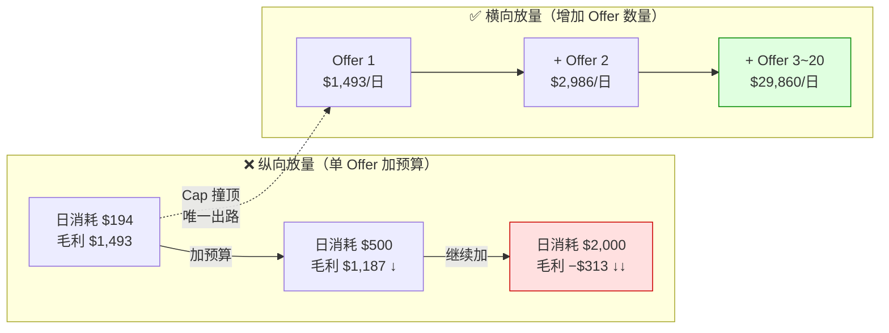
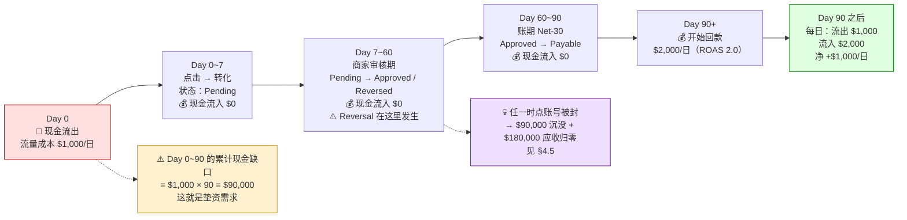
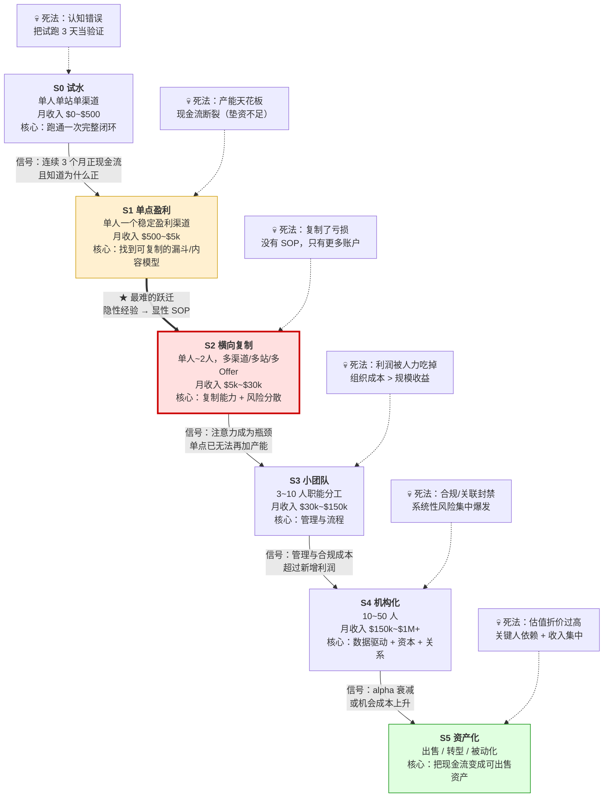

# Affiliate 单位经济与规模化

> **一句话定位**：本文回答两个问题——**这门生意在数学上什么时候赚钱、什么时候必然亏钱，以及"做大"这件事的真实成本结构与失败模式**。它是 [`联盟角色与佣金模型.md`](./联盟角色与佣金模型.md) §8（单位经济）的延伸与放大：那篇给出公式与三个基准算例，本文把公式推到**规模维度**、**时间维度（现金流）**和**组织维度**。
>
> **核心结论先行**：
> 1. **单位经济决定"能不能赚"，现金流决定"能不能活"，规模不经济决定"能做多"。** 三者是三个独立约束，多数失败者只算了第一个。
> 2. **利润 = 收入 − 成本 是权责发生制口径；买量型 Affiliate 的真实约束是 `可动用资金 ≥ 日均流量成本 × 平均回款天数 × 缓冲系数`**——这是收付实现制口径。50~150 天的账期让两者可以差出一个数量级。
> 3. **规模化的本质是"复制能力"，不是"复制资产"。** 没有 SOP 的复制只会把亏损复制 N 份。
> 4. **纵向放量在买量型里通常不可能**（Cap 锁死、自有出价抬高自有成本），**规模化只能是横向的**（更多 Offer / 更多渠道 / 更多品类）。
> 5. **最致命的风险是不可观测的那一类**——账号封禁、Offer 下架、商家改条款、算法更新没有前兆指标，无法靠盯数据预防，只能靠分散化控制敞口。这与 [`联盟反作弊与扣量.md`](./联盟反作弊与扣量.md) §3.3"扣量在数学上对单一推广者不可证明"是**同构结论**。
>
> **可信度标签**：`[标准]` 官方明文　`[政策]` 平台公开政策（标时点）　`[惯例]` 行业共识　`[推断]` 待验证推导
>
> 最后更新：2026-09-11

---

## 1. 单位经济的完整框架

### 1.1 骨架：佣金漏损五乘数（不重画，只深化）

本文所有算例都挂在 [`联盟角色与佣金模型.md`](./联盟角色与佣金模型.md) **§8.0 的佣金漏损瀑布图**上，那五个乘数是：

```
实际到手 = 归因成功率 × 佣金基数 × 佣金率 × 通过率 × (1 − 网络抽成) − 账期资金成本
```

前置闸门两个（在链路之外、在报表里不可见）：**Cookie Duration** 与 **Last Click Override**。

[`联盟角色与佣金模型.md`](./联盟角色与佣金模型.md)（下文简称"佣金模型"）§8.0 回答的是"每个乘数是多少"。本文要回答的是**规模化的三个新问题**：

| 问题 | 佣金模型 §8.0 的答案 | 本文的深化 |
|---|---|---|
| 每个乘数能不能优化？ | 给了量级 | §1.2：给**可优化空间 × 优化成本 × 优化速度**三维排序 |
| 优化后能不能放量？ | 未涉及 | §3、§7：Cap 与竞价反馈会锁死放量 |
| 赚到的是利润还是现金？ | §6.5 给了垫资公式 | §4：垫资矩阵 + 封禁敞口 + 现金循环时间轴 |

**五个乘数的可优化空间与优化成本** `[推断]`：

| 乘数 | 典型量级 | 可优化空间 | 优化成本 | 见效速度 | 优先级 |
|---|---|---|---|---|---|
| **归因成功率** | 70%~95%（[`落地页与转化漏斗设计.md`](./落地页与转化漏斗设计.md) §1.1） | +5~15pp | 中（自建点击日志、S2S Postback、Click ID 透传） | 数周 | ★★★★ |
| **佣金基数系数** | 0.70~0.92 | +0~10pp | 低（**换商家/换计划**，不是谈判） | 立即 | ★★★ |
| **佣金率** | 1%~50% | 数量级（换品类） | 中（选品与内容重建） | 3~12 个月 | ★★★★★ |
| **通过率 Approval Rate** | 40%~95% | +5~20pp | 中（表单字段设计、流量质量、防作弊自查） | 30~60 天才能观测 | ★★★★★ |
| **(1 − 网络抽成)** | 0.70~0.80 | +5~15pp | **高**（需量级门槛 + AM 关系，见 [`主流联盟网络盘点.md`](./主流联盟网络盘点.md) §6.2） | 数月 | ★★ |
| **账期资金成本** | 年化 5%~15% | 只能换网络 | 低（选周结/日结，代价是派款低 5%~15%） | 立即 | ★★★（现金流紧张时★★★★★） |

`[推断]` **一条反直觉的排序结论**：新手把精力放在**佣金率**（唯一写在台面上的数字），老手放在**通过率与归因成功率**（乘数效应大、且别人不会告诉你）。但**真正的最高杠杆是"换品类"**——佣金率与客单价是唯一能带来**数量级**差异的两个变量，其余四个乘数的可优化空间都在 5%~20% 量级。这条与 [`Niche站与内容站变现.md`](./Niche站与内容站变现.md) §2.6 的算例一结论完全一致。

### 1.2 两条主线公式（与佣金模型 §8.1 对齐）

**【免费流量型（内容站 / SEO / 社媒 / 邮件）】**

```
月利润 = 月流量(UV) × 外链点击率 × 商家转化率 × 客单价 × 基数系数 × 佣金率 × 通过率 × (1 − 网络抽成)
        − 内容生产成本 − 工具订阅 − 主机/CDN − 人力

单 UV 毛收入 R_uv = 外链点击率 × CR × 单笔净佣金
```

**【买量型（Media Buying）】**

```
每点击毛利 = EPC_有效 − CPC
EPC_有效   = Payout × CR_total × Approval Rate × (1 − 网络抽成)
CR_total   = CR_prelander × CR_lander × CR_offer        （三页漏斗，见落地页文档 §6.1）
日利润     = 日点击 × (EPC_有效 − CPC) − 固定成本
盈亏平衡   = EPC_有效 ≥ CPC
ROAS       = EPC_有效 / CPC
资金占用峰值 ≈ 日均流量成本 × 平均回款天数 × 缓冲系数
```

### 1.3 口径声明：本文与兄弟文档的两处口径差异

这两处**不是矛盾，是口径不同**，必须显式说明，否则算例会被读成互相打架：

| 公式 | CPA 口径 | CPS 口径 | 差异来源 |
|---|---|---|---|
| **盈亏平衡 CR** | `CPC / (Payout × Approval)`（[`CPA网络与Offer市场.md`](./CPA网络与Offer市场.md) §7.1） | `CPC / (AOV × 基数系数 × 佣金率 × Approval × (1−网络抽成))`（[`落地页与转化漏斗设计.md`](./落地页与转化漏斗设计.md) §6.1） | CPA 的 Payout **已经是净额**（网络抽成在上游剥离，见 CPA §6.2）；CPS 的佣金率是名义值，要再扣网络抽成 |
| **整体 CR** | 1%~8%（多数 CPA 品类） | 0.3%~3%（电商 + 三页漏斗） | 品类不同，**不可混用** |
| **EPC 分母** | 本文一律 = **每 1 次点击、你自己流量的预期值** | 同 | 网络后台的 "EPC" 常是**每 100 次点击**且是**全体推广者均值**（[`联盟角色与佣金模型.md`](./联盟角色与佣金模型.md) §7.1 的口径陷阱） |

### 1.4 固定成本 vs 边际成本：规模化的第一张地图

**边际成本**（Marginal Cost）
- 定义：多生产一个单位产出所增加的成本。
- 通俗解释：多做 1,000 个 UV、多跑 1,000 次点击，账上多出多少钱。
- 易混提示：与**平均成本**不同。平均成本下降不代表边际成本下降——固定成本被摊薄也会让平均成本下降。

Affiliate 的成本按"随规模怎么变"分四类，这四类的行为完全不同 `[推断]`：

| 成本类型 | 数学形态 | 买量型的例子 | 内容型的例子 | 规模化含义 |
|---|---|---|---|---|
| **纯变动成本** | 与规模严格线性 | 流量成本（CPC × Clicks）、支付通道费 | 按篇计酬的外包稿费 | 不产生规模经济，也不产生不经济 |
| **阶梯固定成本** | 平台期不变，到阈值**跳变** | Tracker 按点击量分档、CDN 按流量分档、ESP 按订阅者分档 | SEO 工具档位、第一名编辑/PM 的工资 | **跳变点是规模化的真实门槛**，跨过前利润被吃掉 |
| **半变动成本（含溢价）** | 线性 + 递增斜率 | 放量后 CPC 上涨（§7.1）、优质流量枯竭 | 优质关键词耗尽后单篇成本上升（§2） | **这是规模不经济的数学来源** |
| **准固定成本** | 与规模几乎无关 | 域名、公司主体、记账、合规顾问 | 同 | 规模越大越划算，是**唯一真正的规模经济来源** |

`[推断]` **由此得到一条判据**：**一个模式能不能规模化，取决于它的"准固定成本占比"够不够大。**
- 买量型的成本结构里 80%+ 是纯变动成本（流量），所以它**几乎没有规模经济**——它的规模化是"复制漏斗"，不是"摊薄成本"。
- 内容型的成本结构里有大量准固定成本（域名权重、内容库存、SOP、品牌搜索量），所以它**有真实的规模经济**，但要 12~24 个月才能建起来，且被 §7.2 的算法风险对冲掉。
- 这解释了一个行业现象：**买量型团队的人数与收入近似线性，内容型团队的人数与收入近似对数**。

### 1.5 现金流 ≠ 利润：50~150 天账期下有多致命

**权责发生制**（Accrual Basis）
- 定义：收入在**赚取时**确认，费用在**发生时**确认，与现金实际收付时点无关。
- 通俗解释：转化被 Approved 的那一刻，利润表上就有这笔收入了——哪怕钱还在网络账上。

**收付实现制**（Cash Basis）
- 定义：收入在**收到现金时**确认，费用在**付出现金时**确认。
- 通俗解释：钱到账才算数。买量的钱当天就出去了，佣金的钱 90 天后才回来。

**垫资 / 资金占用**（Working Capital / Float）
- 定义：为支撑"先付后收"的时间差而必须长期占用的自有资金。
- 通俗解释：你替商家和网络垫了三个月的广告费。
- 易混提示：与**亏损**完全不同。一个 ROAS 3.0 的漏斗可以在毛利率 60% 的同时因为垫资不足而倒闭。

```
两套账的分叉（示意，日投 $1,000、回款 75 天、ROAS 2.0）：

  权责发生制利润表（每月）：
    收入 $60,000 − 流量成本 $30,000 − 固定成本 $3,000 = 利润 $27,000   ✅ 看起来很好

  收付实现制现金流量表（第 1~3 个月）：
    月现金流出 $33,000；月现金流入 ≈ $0（回款要到第 75 天才开始）
    → 累计现金 −$99,000                                                ❌ 已经死了

  分叉的持续时间 = 回款天数；分叉的深度 = 日投 × 回款天数
```

`[惯例]` **这是买量型 Affiliate 的第一死因**（[`联盟角色与佣金模型.md`](./联盟角色与佣金模型.md) §6.5、[`CPA网络与Offer市场.md`](./CPA网络与Offer市场.md) §7.3 已确立）。本文 §4 把它做成可查表的矩阵。

**现金循环周期**（Cash Conversion Cycle，CCC）
- 定义：从"付出现金采购投入"到"收回销售现金"之间的天数，标准式为 `CCC = 存货周转天数 + 应收账款周转天数 − 应付账款周转天数`。
- 通俗解释：你的钱在外面转一圈要多久才回到账上。
- 易混提示：与**账期**（Payment Terms，Net-30 之类）不同——账期只是 CCC 的一个组成部分。

Affiliate 的 CCC = 转化窗口 + 审核期 + 网络账期 − 应付账款期 ≈ **50~150 天**，且**应付账款期为 0**（流量源要预付或实时扣款，没有任何应付缓冲）。CCC 长达 150 天且无应付缓冲，是这门生意结构性脆弱的根源。

**三条推论** `[推断]`：

1. **毛利率与资金效率是两个独立维度。** 高毛利 + 长账期（Trial Offer、CPS 电商）比低毛利 + 短账期（日结 CPA）更容易死。这正是 CPA §7.3 那句"对现金流紧张的玩家，快回款的低派款 Offer 优于慢回款的高派款 Offer"的数学依据。
2. **利润表看不出问题，必须看 CCC。** 上面那个"月赚 $27,000 却累计现金 −$99,000"的例子，本质是 CCC = 75 天而应付账款期 = 0。
3. **规模会放大现金流风险，而不是分散它。** 日投从 $100 提到 $1,000，垫资需求同步 10 倍，但一次封禁的敞口也 10 倍。**规模化在利润表上是加法，在现金流风险上是乘法。**

---

## 2. 算例 A：内容站从 5 万 UV 到 50 万 UV 的规模曲线

### 2.1 基准点复核（必须与佣金模型 §8.2 完全一致）

```
假设（沿用 联盟角色与佣金模型.md §8.2）：
  月自然流量        50,000 UV
  外链点击率        12%          → 6,000 clicks
  商家转化率        3%           → 180 orders
  客单价            $60
  佣金基数扣除      8%           → 合格基数 $55.20
  佣金率            8%           → $4.416/order
  通过率            88%          → $3.886/order
  网络抽成          25%          → $2.915/order ≈ $2.92

月收入 = 180 × $2.92 = $525      （精确 180 × 2.9146 = $524.6）
月成本 = 内容外包 $300 + 工具 $80 + 主机 $20 = $400
月利润 = $125                    ✅ 与佣金模型 §8.2 一致
单 UV 毛收入 R_uv = $525 / 50,000 = $0.0105
```

**这个基准点的三个隐含前提**（放大规模时会全部失效）：

| 前提 | 在 5 万 UV 时成立的原因 | 在 50 万 UV 时为什么不成立 |
|---|---|---|
| 外链点击率恒为 12% | 流量集中在高意图 Commercial Investigation 页 | 必须大量补 Informational 长尾页，这类页的外链 CTR 通常只有一半 |
| 商家 CR 恒为 3% | 来的人都在"选品对比"阶段 | 长尾词带来的是"了解问题"的人，购买意图弱 |
| 成本 = $400 且无人力 | 120 篇存量、单人可管 | 700 篇存量 + 多写手 + 多品类，**必须有编辑与 PM** |

### 2.2 规模弹性假设表

`[推断]`　弹性方向由 §2.1 的三个前提推出，量级为经验区间，**非实测数据**。所有数字为假设值，用于展示计算结构。

| 参数 | 5 万 UV | 10 万 UV | 25 万 UV | 50 万 UV | 变化机制 | 标签 |
|---|---|---|---|---|---|---|
| 外链点击率 | 12.0% | 10%~11.5% | 9%~10.5% | 8%~10% | 低意图长尾页占比上升 | `[推断]` |
| 商家转化率 CR | 3.0% | 2.7%~3.0% | 2.4%~2.8% | 2.2%~2.7% | 意图稀释 | `[推断]` |
| 单笔净佣金 | $2.92 | $2.92 | $2.92 | $2.92 | 品类不变 → 五个乘数不变 | 基准 |
| 内容存量（有效篇数） | ~120 | ~200 | ~400 | ~700 | 低 KD 长尾词耗尽 → 被迫攻中高 KD 头部词（读法见表下注） | `[推断]` |
| **月内容现金支出** | $300 | $450~$550 | $850~$1,050 | $1,600~$1,900 | 两股力量对冲（见 §2.3） | `[惯例]`+`[推断]` |
| SEO 工具 | $80 | $100~$130 | $160~$200 | $250~$300 | **阶梯跳变**：需加排名追踪 + 站点审计 | `[惯例]` |
| 主机 / CDN | $20 | $25~$35 | $50~$70 | $90~$120 | 近线性 | `[惯例]` |
| 编辑 / PM 人力 | $0 | $0 | $0~$800 | $1,500~$3,000 | **阶梯跳变**：存量 >200 篇后无法单人管理 | `[推断]` |

**内容单价参考**（[`Niche站与内容站变现.md`](./Niche站与内容站变现.md) §3.1，`[惯例]` 2026-09）：汇编长文 $30~$120/篇；带原创结构的深度文 $100~$400/篇；一手实测评 $300~$800/篇 **+ 商品成本**；专家署名 $250~$1,000+/篇。[`电商Affiliate与亚马逊联盟.md`](./电商Affiliate与亚马逊联盟.md) §8.2 给同一量级（"一篇 3,000 字深度测评 ≈ $150~$500 外包，可持续产生流量 2~5 年"）。上表的月度内容支出按"每月新增 4~8 篇 + 旧内容更新（约为新内容预算的 **30%~50%**）"折算，与这些单价自洽。

**关于"内容存量"那一行的读法** `[推断]`：篇数从 ~120 增到 ~700（5.8 倍）而 UV 增 10 倍，意味着**单篇平均流量是上升的**（417 → 714 UV/篇）。这不是效率提升，而是**关键词结构被迫上移**：低 KD 长尾词耗尽后，只能去攻中高 KD 的头部词——头部词单页流量大，但单页成本也大得多（必须一手实测、必须建外链、YMYL 品类还必须专家署名）。**所以"单篇覆盖的 UV 上升"与"单篇成本上升"同时发生，这正是 §2.3 那两股对冲力量里向上的那一股。**

### 2.3 边际成本递减与边际收益递减的交叉点

**两股方向相反的力量作用在"单篇内容成本"上** `[推断]`：

| 力量 | 方向 | 机制 | 什么时候占优 |
|---|---|---|---|
| **单篇边际成本下降** | ↓ | SOP 与模板成熟、写手池议价、批量下单、选题流程工业化、内链结构复用 | 0 → 20 万 UV |
| **单篇内容溢价上升** | ↑ | 低 KD 长尾词耗尽 → 必须攻中高 KD 词 → 需要一手实测（$300~$800 + 商品）、专家署名（$250~$1,000+）、外链建设、旧文更新 | 20 万 UV 之后 |

**每 1,000 UV 的月内容成本（中性情形）**：

```
 5 万 UV：$300 / 50  = $6.00
10 万 UV：$500 / 100 = $5.00    ← 递减
25 万 UV：$950 / 250 = $3.80    ← 递减，最低点
50 万 UV：$1,750 / 500 = $3.50  ← 仍在递减，但斜率已明显变平

若把高 KD 溢价计入（悲观情形，$1,900 / 500 = $3.80）→ 曲线在 25 万 UV 处见底后回升
```

→ **交叉点约在 25 万~35 万 UV** `[推断]`：在此之前 SOP 效应主导，单 UV 内容成本下降；在此之后关键词枯竭与高 KD 内容溢价主导，单 UV 内容成本回升。**这个交叉点就是"内容站的最优规模区间"的左边界。**

**收益侧 meanwhile 单调递减**（中性情形）：

```
单 UV 毛收入 R_uv：
 5 万 UV：$0.01050
10 万 UV：100,000 × 10.75% × 2.85% × $2.92 / 100,000 = $0.00894   （−15%）
25 万 UV：250,000 ×  9.75% × 2.60% × $2.92 / 250,000 = $0.00740   （−30%）
50 万 UV：500,000 ×  9.00% × 2.45% × $2.92 / 500,000 = $0.00644   （−39%）
```

### 2.4 四档测算（中性情形 + 区间）

**口径一：现金成本（不含自有劳动）——这是 [`Niche站与内容站变现.md`](./Niche站与内容站变现.md) §2.6 的口径**

| 项目 | 5 万 UV | 10 万 UV | 25 万 UV | 50 万 UV |
|---|---|---|---|---|
| 订单数 | 180 | 306 | 634 | 1,103 |
| 佣金收入 | $525 | $894 | $1,851 | $3,221 |
| 内容成本 | $300 | $500 | $950 | $1,750 |
| 工具 | $80 | $115 | $180 | $275 |
| 主机 / CDN | $20 | $30 | $60 | $105 |
| **现金成本合计** | **$400** | **$645** | **$1,190** | **$2,130** |
| **现金利润** | **$125** | **$249** | **$661** | **$1,091** |
| 现金利润率 | 23.8% | 27.9% | 35.7% | 33.9% |
| 单 UV 现金利润 | $0.0025 | $0.0025 | $0.0026 | $0.0022 |

**口径二：完全成本（含编辑 / PM 人力）——25 万 UV 以上无法回避**

| 项目 | 5 万 UV | 10 万 UV | 25 万 UV | 50 万 UV |
|---|---|---|---|---|
| 佣金收入 | $525 | $894 | $1,851 | $3,221 |
| 现金成本 | $400 | $645 | $1,190 | $2,130 |
| 编辑 / PM 人力 | $0 | $0 | $400 | $2,250 |
| **完全成本** | **$400** | **$645** | **$1,590** | **$4,380** |
| **完全利润** | **$125** | **$249** | **$261** | **−$1,159** |
| 隐含月工时（假设 30~80 h） | 时薪 $1.6~$4.2 | — | — | **负值** |

**区间（悲观 / 中性 / 乐观）**：

| UV | 现金利润区间 | 完全利润区间 |
|---|---|---|
| 5 万 | $100~$160 | $100~$160 |
| 10 万 | $200~$380 | $200~$380 |
| 25 万 | $400~$1,000 | −$100~$700 |
| **50 万** | **$250~$2,000（中位 $1,091）** | **−$2,750~+$500（中位 −$1,159）** |

> **一致性核对**：`Niche站与内容站变现.md` §2.6 与 §10 误解 2 给出的线性外推是"把流量从 5 万做到 50 万，利润从 $125 到约 $1,250"。本文的**现金口径**区间 $250~$2,000 把这个 $1,250 完整包住（中位 $1,091，偏差 −13%，来源是本文对 CTR/CR 稀释做了显式建模）。**两者同量级、同结论，不矛盾。**

### 2.5 盈利门槛 UV：四个不同的门槛

`[推断]`　"盈利门槛"不是一个数，是**四个**，取决于你把哪些成本计入：

| 门槛口径 | 计入什么 | 需要的月 UV | 推导 |
|---|---|---|---|
| **① 现金盈亏平衡** | 内容 + 工具 + 主机 | **约 3 万 UV** | 3 万 UV 时收入 ≈ $315，现金成本 ≈ $320 |
| **② 含沉没成本的经济盈亏平衡** | ① + 建站期投入的摊销 | **约 5 万~6 万 UV** | 建站期 12~18 个月累计投入 $3,600~$5,400；要求 24 个月回收 → 月利润需 ≥ $150~$225 |
| **③ 完全成本盈亏平衡（雇 1 名兼职编辑）** | ① + $400~$800 人力 | **约 20 万~25 万 UV** | 见 §2.4 口径二 |
| **④ 值得全职做的门槛** | ① + 1 个全职岗位机会成本（$3,000~$5,000/月） | **低客单品类：达不到（需 100 万+ UV）<br>高客单品类：约 20 万~30 万 UV** | 低客单：R_uv $0.0064 × 1,000,000 = $6,400 收入，扣完全成本后仍不足；高客单见 Niche §2.6（AOV $600 / 佣金率 10% → 5 万 UV 已可 $986~$3,172） |

**门槛 ④ 是真正重要的那一个**，它给出一个尖锐结论：

> **在低客单品类（AOV ~$60）里，靠"把流量做大"永远达不到全职门槛。** 50 万 UV 的现金利润中位数只有约 $1,091，而这个规模需要 700 篇内容存量、12~24 个月、以及承担全部算法风险。
> **换品类（AOV $60 → $600、佣金率 8% → 10%）在 5 万 UV 就能做到 $986~$3,172**（Niche §2.6）。
> **两条路的投入产出比差一个数量级。** 这不是本文的新结论，本文只是用规模曲线证明了它。

### 2.6 为什么 5 万 UV 的站是失败案例而不是成功案例

四条独立的判据，任一条都足以定性 `[推断]`：

| # | 判据 | 5 万 UV 站的实际值 | 结论 |
|---|---|---|---|
| 1 | **隐含时薪** | 月利润 $125；若每月投入 20~40 小时（内容审校、选题、外链、数据），隐含时薪 **$3~$6** | 低于绝大多数地区的最低工资 |
| 2 | **抗风险余量** | 一次 Google 核心更新的典型冲击是流量 −30%~−50%（Niche §4.1）→ 收入 $525 → $263~$368，成本刚性 $400 | **一次更新即转亏** |
| 3 | **能否负担抗风险投入** | 渠道多元化、邮件列表建设（ESP $50/月起）、内容审计都需要现金 | 利润 $125 无法覆盖任何一项，**风险敞口无法收窄** |
| 4 | **资产估值** | 纯一次性佣金站 20~30 倍月利润（Niche §7.1）→ $2,500~$3,750；扣尽调折价（流量集中度 >70% 折 −20%~−30%）后约 $1,800~$3,000 | 低于多数策展型经纪的最低挂牌门槛，**只能私洽，且买方要承担同样的算法风险** |

`[惯例]` **行业口径**：一个"月入 5 万 UV 的 Niche 站"在从业者语境里是**失败案例**，因为它的**利润绝对值**低于维持它所必需的再投入。真正被当作成功案例的是"**5 万 UV + 高客单品类 + 多条变现腿**"——同样流量，利润可以是 $1,184~$3,272（Niche §5.5 算例二）。

> **本算例的最重要一句话**：**内容站的规模曲线不是"越做越赚"，而是"先变好、后变差"，且变差的转折点（25 万~35 万 UV）远低于多数人想象的规模。低客单品类甚至没有转折点——它从一开始就在盈亏线附近震荡。**

---

## 3. 算例 B：买量型漏斗的单日盈亏平衡与 Cap 约束

### 3.1 基准设定（沿用佣金模型 §8.3）

```
Offer Payout      $45（CPA，Lead Gen）
流量源 CPC        $0.35（Native Ads，T2 地区）
落地页整体 CR     9%（Pre-lander 40% → Lander 22.5%）
Approval Rate     75%
日 Cap            50 个转化
网络抽成          0（CPA 口径下 Payout 已是净额，见 §1.3）

EPC_有效 = $45 × 9% × 75% = $3.0375 ≈ $3.04      ✅ 与佣金模型 §8.3 一致
每点击毛利 = $3.04 − $0.35 = $2.6875 ≈ $2.69      ✅ 与佣金模型 §8.3 一致
ROAS     = $3.04 / $0.35 = 8.68
毛利率 g = $2.6875 / $3.0375 = 88.5%
```

⚠️ **佣金模型 §8.3 已经指出"这个结果好得不真实"**。本文接着往下算，会证明这句话是对的——而且能证明**为什么不真实**。

### 3.2 盈亏平衡：三个方向

| 求解目标 | 公式 | 数值 | 含义 |
|---|---|---|---|
| **盈亏平衡 CPC** | `CPC_be = EPC_有效` | **$3.04** | CPC 要涨到 $3.04（当前的 8.7 倍）才开始亏 |
| **盈亏平衡 CR** | `CR_be = CPC / (Payout × Approval)` | **1.04%** | CR 从 9% 掉到 1.04%（−88%）才亏 |
| **盈亏平衡 Approval Rate** | `App_be = CPC / (Payout × CR)` | **8.6%** | 通过率掉到 8.6% 才亏——**低于此值必然已在扣量**（健康区间见 [`联盟角色与佣金模型.md`](./联盟角色与佣金模型.md) §6.3） |

`[推断]` **这三条平衡线全部远离基准点，本身就是最强的警告信号。**
在一个竞价市场里，**长期存在 ROAS 8.7 的公开 Offer 是不可能的**——如果它存在，其他买家会把 CPC 竞价推到接近 $3.04。所以正确的读法不是"这个 Offer 很赚"，而是"**报价里一定有你没看到的东西**"：

| 可能的隐藏坑 | 表现 | 怎么查 |
|---|---|---|
| Cap（§3.3） | 放量后超量转化不计酬 | 问 AM 日/月/分 Geo Cap + 撞顶后是丢弃还是顺延 |
| Approval Rate 虚高 | AM 说 80%，实测 40%（CPA §4.4 算例） | 小预算跑 7~14 天，**等第一批 Reversal 回来** |
| Geo 限制 / 白名单 | 你的流量源不在白名单 → 全部拒付 | 读 Offer 的 Geo Targeting 与 Traffic Whitelist |
| 扣量 | 通过率随时间单调下降 | 按 Sub ID 分组对账（[`联盟反作弊与扣量.md`](./联盟反作弊与扣量.md) §3.2） |
| 派款层级 | 你拿的是 Tier-2/Tier-3 转手价 | 直客 $45 → Tier-3 只剩 $24~$30（CPA §6.2） |
| 素材已进入衰减期 | 你看到的是别人跑剩的尾巴 | 素材情报库查该 Offer 的素材变体数量与投放时长（CPA §8.2） |

### 3.3 Cap 约束下的日投放上限（本算例的核心结论）

```
日 Cap = 50 个转化
CR_total = 9%
→ 达到 Cap 所需点击数 = 50 / 0.09 = 555.6 ≈ 556 clicks
→ 日消耗上限 = 556 × $0.35 = $194.4
→ 日收入（Approved）= 50 × $45 × 75% = $1,687.5
→ 日毛利上限 = $1,687.5 − $194.4 = $1,493
→ 月毛利上限 ≈ $1,493 × 30 = $44,800
```

**超过 556 次点击之后发生了什么**：

| 日消耗 | 日点击 | 转化数 | **计酬转化** | 日收入 | 日毛利 | 边际毛利（每多 1,000 次点击） |
|---|---|---|---|---|---|---|
| $194 | 556 | 50 | 50 | $1,687 | **$1,493** | — |
| $500 | 1,429 | 129 | 50 | $1,687 | $1,187 | **−$350** |
| $1,000 | 2,857 | 257 | 50 | $1,687 | $687 | −$350 |
| $2,000 | 5,714 | 514 | 50 | $1,687 | **−$313** | −$350 |

→ **第 557 次点击的边际收入是 0，边际成本是 $0.35。日消耗上限被硬锁在 $194。**



**要月毛利 $30,000 需要多少 Offer**：

```
$30,000 / $1,493 ≈ 20 个「Cap=50、EPC=$3.04」的 Offer 同时在跑
或  5 个「Cap=200」的 Offer
或  2 个 Exclusive（无竞争、Cap 可谈、Payout 可 Bump 20%~50%）

考虑测试损耗（CPA §4.3：必须小预算试跑 7~14 天，且多数 Offer 跑不通）：
  → 实际需要持续维护的 Offer 池 = 在跑数量的 2~3 倍 = 40~60 个
  → 这就是为什么 CPA §5.2 说"CPA 生意的持续性不来自某个 Offer，
     而来自『能持续拿到早期 Offer 的关系网络』"
```

> **算例 B 的核心结论**：**在 Cap 约束下，买量型 Affiliate 的"规模化"在数学上不可能是纵向的。**
> 收入 = Σ（每个 Offer 的日毛利上限）× 天数，是一个**加法结构**，不是乘法结构。
> 所以规模化的真正能力不是"把某个漏斗放大 10 倍"，而是"**同时维护 20~60 个跑通的漏斗，并持续用新的替换衰减的**"——这是一个**运营与关系问题**，不是投放问题。

### 3.4 放量后的 CPC 上涨：+30% 的影响

`[惯例]` 放量必然推高 CPC，三个机制：① 你在同一竞价池里提高自己的出价；② 优质版位/受众库存有限，扩量必然买到更差的量；③ 竞对看到你的素材起量后跟进（CPA §8.2 的素材情报是双向的）。

| 情形 | CPC | 每点击毛利 | 变化 | 日消耗（Cap 内 556 clicks） | 日毛利 |
|---|---|---|---|---|---|
| 基准 | $0.350 | $2.688 | — | $194 | $1,493 |
| CPC +20% | $0.420 | $2.618 | **−2.6%** | $233 | $1,454 |
| CPC +30% | $0.455 | $2.583 | **−3.9%** | $253 | $1,434 |
| CPC +100% | $0.700 | $2.338 | −13.0% | $389 | $1,299 |
| CPC 涨到平衡线 | $3.038 | $0.000 | −100% | $1,688 | $0 |

→ **与佣金模型 §8.4 的"CPC ±20% → 毛利 −3%"完全一致**（本文精确值 −2.6%，原文取整为 −3%）。§5.1 会证明这个"不敏感"是**毛利率的函数**，不是普适规律。

### 3.5 素材衰减：CR −30% 后是否还盈利

**素材衰减曲线**（本文给出量化模型，兑现 [`CPA网络与Offer市场.md`](./CPA网络与Offer市场.md) §4.3 ③ 的预约：「第一周的高 CR 通常 1~3 周后掉一半」）：

`[推断]`　用指数衰减拟合行业经验值，半衰期 **7~21 天**（品类与流量源决定）：

```
CR(t) = CR_0 × 0.5^(t / T_half)

T_half = 7 天（快衰减：Sweepstakes / Nutra / Push 流量）
T_half = 14 天（中位：多数 Native + Lead Gen）
T_half = 21 天（慢衰减：Brand Search / 高意图品类 / 邮件）

按 T_half = 14 天：
  Day 0   CR = 9.0%   EPC = $3.04   每点击毛利 $2.69
  Day 7   CR = 6.4%   EPC = $2.15   每点击毛利 $1.80   （−33%）
  Day 14  CR = 4.5%   EPC = $1.52   每点击毛利 $1.17   （−56%，即"掉一半"）
  Day 30  CR = 2.1%   EPC = $0.70   每点击毛利 $0.35   （−87%）
  Day 44  CR = 1.04%  EPC = $0.35   每点击毛利 ≈ $0    ← 自然死亡点（= 盈亏平衡 CR）
  Day 45  CR = 0.97%  EPC = $0.33   每点击毛利 −$0.02  （已亏）
```

**校核**：CPA §4.4 算例给"Day 10 后 CR 从 12% 掉到 7%"（−42%）。本模型 T_half=14 天时 Day 10 的 CR = 12% × 0.5^(10/14) = 7.3%（−39%）。**自洽。** ✅
**自然死亡点**：解 `9% × 0.5^(t/14) = 1.04%`（§3.2 的盈亏平衡 CR）得 **t ≈ 44 天**——即一套素材从上线到无利可图的自然寿命约 **6 周**，这与 CPA §5.1 的 Offer 生命周期观察一致。

**素材衰减下的 CR −30% 情形**：

| 情形 | CR | EPC_有效 | 每点击毛利 | 日毛利（556 clicks，CPC 不变） | 是否盈利 |
|---|---|---|---|---|---|
| 基准 | 9.0% | $3.038 | $2.688 | $1,493 | ✅ |
| **CR −30%** | 6.3% | $2.126 | $1.776 | $987 | ✅ **仍盈利（−33.9%）** |
| CR −30% **且** CPC +30%（放量时的真实组合） | 6.3% | $2.126 | $1.671 | $929 | ✅ 仍盈利 |
| CR −50%（半衰期到点） | 4.5% | $1.519 | $1.169 | $650 | ✅ 仍盈利 |
| CR −85%（衰减到平衡线） | 1.35% | $0.456 | $0.106 | $59 | ⚠️ 名义盈利，扣固定成本后亏 |
| CR −88.5%（盈亏平衡） | 1.04% | $0.351 | $0.001 | ≈$0 | ❌ |

→ **在这个基准 Offer 上，CR −30% 甚至 −50% 都还赚钱。这恰恰证明基准的 ROAS 8.68 是异常值，不是常态。**

### 3.6 现实校准：当 ROAS 接近 1 时（这才是常态）

`[推断]`　把基准换成**真实世界的 T1 优质流量场景**（CPC 与 CR 的组合来自 [`落地页与转化漏斗设计.md`](./落地页与转化漏斗设计.md) §6.3 的口径）：

```
Payout $45｜CPC $1.80（T1 优质流量）｜CR 6.4%｜Approval 75%
EPC_有效 = 45 × 6.4% × 75% = $2.16
每点击毛利 = $2.16 − $1.80 = $0.36
ROAS = 1.20    毛利率 g = 16.7%      ← 买量型 Affiliate 的真实常态区间
```

| 扰动 | 新值 | EPC_有效 | 每点击毛利 | 结果 |
|---|---|---|---|---|
| 基准 | — | $2.160 | **+$0.360** | ✅ ROAS 1.20 |
| CR −30% | 4.48% | $1.512 | **−$0.288** | ❌ 亏损 |
| Approval −20% | 60% | $1.728 | **−$0.072** | ❌ 亏损 |
| CPC +20% | $2.16 | $2.160 | **$0.000** | ❌ 归零 |
| CPC +30% | $2.34 | $2.160 | **−$0.180** | ❌ 亏损 |
| Payout −20%（商家降派款） | $36 | $1.728 | **−$0.072** | ❌ 亏损 |

> **算例 B 的第二个核心结论**：**在 ROAS 1.2 的现实场景里，任何一个变量的 −20%~−30% 扰动都足以把毛利打成负数。**
> 所以买量型 Affiliate 的日常不是"优化"，是"**在四个变量同时随机游走的环境里，把敞口控制在单次扰动打不死你的水平**"。这就是 §5 脆弱性排序与 §10 风险矩阵存在的理由。

---

## 4. 算例 C：现金流错配模型

### 4.1 基准复核（沿用佣金模型 §6.5）

```
日投 $500，平均回款 90 天
→ 资金占用峰值 ≈ $500 × 90 = $45,000      ✅ 与佣金模型 §6.5 一致
```

**回款天数怎么来的**（[`联盟角色与佣金模型.md`](./联盟角色与佣金模型.md) §6.1、[`主流联盟网络盘点.md`](./主流联盟网络盘点.md) §7.1）：

| 环节 | 典型时长 | 买量型能否压缩 |
|---|---|---|
| 点击 → 转化 | 0~7 天（CPA 多为当天~7 天） | 否 |
| 转化 → Approved | 7~60 天（Trial/COD 类 21~60 天） | 否（商家侧） |
| Approved → Payable | Net-7 / Net-15 / Net-30 | **能**（选周结/日结网络，代价派款低 5%~15%） |
| Payable → Paid | 数天（需达起付额 $50~$500） | **能**（选低门槛网络） |
| **合计** | **30~120 天**（行业全域 50~150 天） | 下限约 30 天 |

### 4.2 垫资需求矩阵

`[推断]`　`垫资峰值 = 日均流量成本 × 回款天数`。加 **1.33 倍缓冲系数**（≈4/3）的理由：① 消耗不会完全平滑（爆款日会翻倍）；② Reversal 会让实际回款低于账面应收；③ 必须留出测试预算（新 Offer 试跑 7~14 天是纯支出）。

| 日投放 \ 回款周期 | 30 天 | 60 天 | 90 天 | 120 天 |
|---|---|---|---|---|
| **$100/日** | $4,000 | $8,000 | $12,000 | $16,000 |
| **$500/日** | $20,000 | $40,000 | **$60,000** | $80,000 |
| **$2,000/日** | $80,000 | $160,000 | $240,000 | $320,000 |

（表内为**含 1.33 缓冲**的建议可动用资金；不含缓冲的裸垫资为 $3,000/$6,000/$9,000/$12,000 等，佣金模型 §6.5 的 $45,000 = $500 × 90 即裸值。）

> **与已确立数据的一致性**：[`Affiliate体系总览.md`](./Affiliate体系总览.md) §5.3 给买量投放的启动成本是"高（需垫资 $5k+）"。本表显示 $5,000 在 90 天账期下只支撑 **$42/日** 的投放（见 §4.3），在 30 天账期下支撑 $125/日。**"$5k+ 起步"是下限中的下限，且必须配快回款网络。**

### 4.3 反解：给定自有资金能支撑多大日投放

```
日投放上限 = 可动用资金 / (回款天数 × 缓冲系数 1.33)
```

| 可动用资金 \ 回款周期 | 30 天 | 60 天 | 90 天 | 120 天 |
|---|---|---|---|---|
| **$5,000** | $125/日 | $62/日 | $42/日 | $31/日 |
| **$20,000** | $500/日 | $250/日 | $167/日 | $125/日 |
| **$50,000** | $1,250/日 | $625/日 | $417/日 | $313/日 |
| **$200,000** | $5,000/日 | $2,500/日 | $1,667/日 | $1,250/日 |

**三条推论** `[推断]`：

1. **账期是买量型的真实准入门槛，比投放技术高得多。** 同样的 $20,000，选周结网络可以日投 $500，选 Net-60 网络只能日投 $125——**差 4 倍规模**。这解释了 CPA §7.3 那条"快回款的低派款 Offer 优于慢回款的高派款 Offer"。
2. **利润再投资的复利速度被账期锁死。** 若把所有利润再投入，规模增长速度上限 = 每 (回款天数) 天翻 (ROAS−1) 倍。回款 90 天、ROAS 1.3 → 年增速约 3.4 倍；回款 30 天、同 ROAS → 年增速约 20 倍。**账期是复利的分母。**
3. **不要用杠杆垫资。** 借贷资金成本年化 8%~25% 会直接吃掉 16.7% 毛利率场景（§3.6）的大部分利润，且封禁风险下债务不会消失。

### 4.4 现金循环时间轴



### 4.5 一次账号封禁的现金损失敞口

**现金损失敞口**（Cash Exposure at Ban）
- 定义：某个渠道/账号/网络被终止时，一次性无法收回的现金与应收账款总额。
- 通俗解释：封号那天，你账上"已经花出去但还没赚回来"的钱，加上"已经赚到但还没打给你"的钱，一起归零。
- 易混提示：与**利润损失**不同。利润损失是流量；敞口是存量，是一次性的资产负债表冲击。

`[推断]`　示例：日投 $1,000、回款 75 天、ROAS 2.0（稳态运行）：

| 敞口项 | 计算 | 金额 | 性质 |
|---|---|---|---|
| **被冻结的应收余额** | 75 天 × $1,000 × 2.0 | **$150,000** | 应收账款核销 |
| 　其中：已付的流量成本 | 75 天 × $1,000 | $75,000 | **现金已流出，不可收回** |
| 　其中：本应到手的利润 | $150,000 − $75,000 | $75,000 | 预期利润蒸发 |
| **预付固定成本** | 域名年费 + 服务器 + Tracker 年付 + 素材外包预付 | $2,000~$8,000 | 沉没 |
| **在途库存 / 承诺** | Exclusive 保底量赔付、已签的内容合同 | $0~$20,000 | 或有负债 |
| **合计敞口** | — | **$152,000~$178,000** | — |

**能拿回多少，取决于封禁的性质** `[惯例]`：

| 封禁情形 | 未结余额处理 | 实际损失比例 | 依据 |
|---|---|---|---|
| **判定违规**（Brand Bidding / Cloaking / 激励流量 / 虚假宣称） | **全额没收** | **~100%** | 多数网络 Terms 明文；[`主流联盟网络盘点.md`](./主流联盟网络盘点.md) §7.1、[`电商Affiliate与亚马逊联盟.md`](./电商Affiliate与亚马逊联盟.md) §2.7 |
| **风控误伤 / 账户关联封禁** | 可申诉，部分网络会付 Approved 部分 | 30%~100%（中位约 50%~70%） | `[惯例]`，申诉成功率与量级、历史记录正相关 |
| **网络倒闭 / 被并购 / 退出某市场** | 视清算与条款 | 50%~100% | [`主流联盟网络盘点.md`](./主流联盟网络盘点.md) §8.3 |
| **未达起付额的余额** | 通常不予支付 | 100%（金额小） | [`联盟角色与佣金模型.md`](./联盟角色与佣金模型.md) §6.2 |

**分散化把敞口从"全部"降到"1/N"**：

| 分散度 | 单次封禁敞口 | 占总资金比例 |
|---|---|---|
| 全部押在 1 个网络 / 1 个账户 | $152,000 | 100% → **当场资金链断裂** |
| 分散到 3 个网络 | $51,000 | 34% → 重伤但可恢复 |
| 分散到 5 个网络 + 主体隔离 | $30,000 | 20% → 可承受 |

> **算例 C 的核心结论**：
> ① **垫资需求 = 日投 × 回款天数 × 1.33**，这是一个可查表的硬约束，决定了你的规模上限，与投放能力无关。
> ② **封禁敞口 = 日投 × 回款天数 × ROAS**，注意它比垫资需求**多乘了一个 ROAS**——所以 ROAS 越高、账期越长，单次封禁的绝对损失越大。**高 ROAS 不是安全的标志，是敞口放大的标志。**
> ③ 因此**"账户余额不是存款，是应收账款"**（主流网络盘点 §8.3 的硬规则）在买量型场景下要加一条：**达到起付额立即提现，且提现速度应该匹配你的日投放规模。**

---

## 5. 敏感性分析与脆弱性排序

### 5.1 深化佣金模型 §8.4：结论的方法论与适用边界

**已确立的结论**（[`联盟角色与佣金模型.md`](./联盟角色与佣金模型.md) §8.4，被 CPA §7.4、落地页 §6.5 复述）：

| 变量 | ±20% 对毛利的影响 | 脆弱度 |
|---|---|---|
| Approval Rate | −23% | ★★★ |
| 落地页转化率 CR | −23% | ★★★ |
| Payout | −23% | ★★★ |
| CPC | **−3%** | ★ |

**方法论**：单变量扰动（One-at-a-time Sensitivity Analysis）。设收入侧 EPC = R、成本 CPC = C、毛利 M = R − C、毛利率 g = M/R。对 ±20% 扰动做一阶展开：

```
【收入侧变量】（Payout、CR、Approval Rate 三者都只进 R）
  R → 0.8R  ⟹  M' = 0.8R − C = R(g − 0.2)
  |ΔM / M| = 0.2 / g

【成本侧变量】（CPC 只进 C）
  C → 1.2C = 1.2R(1−g)  ⟹  M' = R(1.2g − 0.2)
  |ΔM / M| = 0.2 × (1 − g) / g

【敏感度比】
  收入侧敏感度 / 成本侧敏感度 = 1 / (1 − g)
```

**用这个通式反算佣金模型 §8.3 的基准（g = 88.5%）**：

```
收入侧：0.2 / 0.885 = 22.6%        → 原文写 "−23%"  ✅ 完全复现
成本侧：0.2 × 0.115 / 0.885 = 2.6% → 原文写 "−3%"   ✅ 完全复现（取整）
敏感度比：1 / 0.115 = 8.7 倍
```

**适用边界（这是佣金模型 §8.4 没说、但决定这条建议能不能用的部分）** `[推断]`：

| 基准毛利率 g | 典型场景 | CPC ±20% → 毛利 | CR/Approval/Payout ±20% → 毛利 | 敏感度比 | "盯 CR 不盯 CPC"是否成立 |
|---|---|---|---|---|---|
| **88.5%** | §3.1 基准：低 CPC 的 Native/Push + 高派款 Offer | ∓2.6% | ∓22.6% | 8.7× | ✅ 强烈成立 |
| **60%** | 中等 CPC + 中高派款 | ∓13.3% | ∓33.3% | 2.5× | ✅ 成立 |
| **40%** | T2 优质流量 + 中派款 | ∓30% | ∓50% | 1.7× | ⚠️ 仍成立但差距收窄 |
| **25%** | T1 流量 + 中派款 | ∓60% | ∓80% | 1.3× | ⚠️ 几乎失效 |
| **16.7%** | §3.6 现实校准场景（ROAS 1.20） | ∓**100%** | ∓**120%** | 1.2× | ❌ **失效——CPC 单独就能让你归零** |
| **10%** | ROAS 1.11 | ∓180% | ∓200% | 1.1× | ❌ 这个漏斗本身不该跑 |

> **§5.1 的结论**：**"CPC 是最不敏感的变量"是一个高毛利场景下的结论，不是普适规律。**
> 敏感度比 = 1/(1−g)，随毛利率下降单调收敛到 1。当 g < 30% 时，四个变量的敏感度全部超过 40%，**排序失去意义，此时唯一正确的动作是修漏斗或换流量源，而不是优化任何一个变量。**
>
> **实操判据**：先算自己的 g，再决定盯什么。
> - **g > 60%** → 盯 CR 与 Approval Rate（CPC 的扰动被高毛利吸收）
> - **30% < g < 60%** → 四个都盯，但优先 CR
> - **g < 30%** → **停止优化，重做漏斗**（换更便宜的流量源、加深漏斗、换 Offer）。落地页文档 §6.3 已证明"漏斗深度的选择本质是你能买到多便宜的流量的选择"，这正是把 g 从 17% 拉回 60% 的主要手段。

### 5.2 双变量敏感性矩阵（CR × Approval Rate → ROAS）

**盈亏平衡等高线的解析式** `[推断]`：

```
ROAS = Payout × CR × Approval / CPC = 1
⟹  CR × Approval = CPC / Payout

这是一条双曲线。CPC/Payout 就是它的"等轴常数"。
CPS 场景要再乘 (1 − 网络抽成)：CR × Approval × (1−m) = CPC / (AOV × 基数系数 × 佣金率)
```

**矩阵一：低 CPC 场景**（Payout $45，CPC $0.35 → 等高线 CR×App = 0.78%，远低于网格，全部盈利）

| CR \ Approval | 50% | 62.5% | 75% | 87.5% | 100% |
|---|---|---|---|---|---|
| **5%** | 3.21 | 4.02 | 4.82 | 5.62 | 6.43 |
| **7%** | 4.50 | 5.63 | 6.75 | 7.88 | 9.00 |
| **9%** | 5.79 | 7.23 | **8.68** ←基准 | 10.12 | 11.57 |
| **11%** | 7.07 | 8.84 | 10.61 | 12.38 | 14.14 |
| **13%** | 8.36 | 10.45 | 12.54 | 14.63 | 16.71 |

**矩阵二：高 CPC 场景（现实校准，Payout $45，CPC $1.80 → 等高线 CR×App = 4.0%）**

| CR \ Approval | 50% | 62.5% | 75% | 87.5% | 100% |
|---|---|---|---|---|---|
| **3%** | 0.38 ❌ | 0.47 ❌ | 0.56 ❌ | 0.66 ❌ | 0.75 ❌ |
| **5%** | 0.63 ❌ | 0.78 ❌ | 0.94 ❌ | **1.09** ✅ | 1.25 ✅ |
| **7%** | 0.88 ❌ | **1.09** ✅ | 1.31 ✅ | 1.53 ✅ | 1.75 ✅ |
| **9%** | **1.12** ✅ | 1.41 ✅ | 1.69 ✅ | 1.97 ✅ | 2.25 ✅ |
| **11%** | 1.38 ✅ | 1.72 ✅ | 2.06 ✅ | 2.41 ✅ | 2.75 ✅ |

**盈亏平衡等高线（矩阵二）经过的点**：`(CR 8.0%, App 50%)`、`(CR 6.4%, App 62.5%)`、`(CR 5.33%, App 75%)`、`(CR 4.57%, App 87.5%)`、`(CR 4.0%, App 100%)`。

`[推断]` **读这张矩阵的四条结论**：

1. **等高线是双曲线，不是直线**——意味着两个变量之间存在**替代关系**：Approval Rate 从 75% 降到 50%（−33%），可以用 CR 从 5.33% 提到 8.0%（+50%）来补偿。这就是"加深漏斗换 Approval Rate"的数学依据（落地页 §6.3：直链 Approval 55%~65% vs 三页漏斗 85%）。
2. **矩阵二里 25 个格子有 9 个亏损（36%）**——现实场景下"随便跑一个组合"亏钱的概率超过三分之一。这解释了为什么 CPA §4.3 坚持"必须小预算试跑 7~14 天"。
3. **左上角（低 CR + 低 Approval）是死亡区**，而这两个变量恰好是**最难同时改善**的（CR 靠素材与漏斗，Approval 靠流量质量与商家审核标准，后者你几乎无法控制）。
4. **右下角（高 CR + 高 Approval）在现实中不存在**——CR 13% + Approval 100% 的组合意味着"任何点进来的人都会转化，且商家一个都不拒"，这只会出现在 Trial Offer 的**账面**上（其 Reversal 率 50%~80%，即实际 Approval 仅 **20%~50%**，见 [`联盟角色与佣金模型.md`](./联盟角色与佣金模型.md) §6.3、§7.5）。

### 5.3 脆弱性排序表

`[推断]` + `[惯例]`　**波动幅度**为行业经验量级；**可观测性**是本文引入的关键维度（见 §5.4）。

| # | 变量 / 风险 | 典型波动幅度 | 对毛利的影响 | **可观测性** | 提前发现的手段 | 应对手段 |
|---|---|---|---|---|---|---|
| 1 | **CPC 上涨** | ±10%~50%（放量时） | g=88% 时 −3%~−13%；g=25% 时 −60%~−150% | ✅ **高**（实时） | Tracker 日内 ROAS 看板 | 降预算、换流量源、加深漏斗 |
| 2 | **素材衰减（CR 下降）** | 半衰期 7~21 天，−30%~−60% | −23%~−50%（g=88%）；**直接转亏**（g<30%） | ✅ **高**（实时） | CR 按日趋势 + 素材上线日期标记 | 素材产能储备（§9.4）、轮换 |
| 3 | **Approval Rate 下降** | −10pp~−40pp | −13%~−53% | ⚠️ **中**（滞后 30~60 天） | 按 Sub ID / 时间 / 金额分组的时间序列 | 提高流量质量、换商家、申诉 |
| 4 | **Payout 下调 / 降佣** | −10%~−50%（Amazon 2020-04 多品类 −40%~−50%） | 等比例 | ❌ **低**（通常提前 0~30 天通知，Amazon 2020 仅数十天） | Compliance 邮件监控、AM 关系 | **Offer 组合分散**（3~5 家同品类） |
| 5 | **Cap 突降 / 未告知** | 从 Uncapped 到日 Cap N | 收入**硬截断** | ⚠️ **中**（撞顶才暴露） | Tracker 转化计数告警（达 Cap 80% 暂停） | 事前问 AM 三个问题（CPA §3.2） |
| 6 | **归因成功率下降（丢单）** | 5%~30% | −5%~−30% | ⚠️ **中**（需自建点击日志才能算） | 点击日志 vs 网络后台对账 | S2S Postback、Click ID 透传 |
| 7 | **Cookie Duration 缩短 / Override 规则变更** | 收益 −14%~−86%（视品类 μ） | 大 | ❌ **低**（条款变更，报表只表现为"没转化"） | 定期重读合约、AM 通知 | 长窗口 Offer 组合、邮件列表 |
| 8 | **账号封禁** | **−100%**（该渠道） | 断崖 | ❌ **极低（无前兆）** | 几乎无法预警 | **分散化 + 余额低位 + 合规** |
| 9 | **Offer 突然下架** | −100%（该 Offer） | 断崖 | ❌ **低**（Tier-3 可能当天才知道） | 直客/Tier-1 关系（信息时效） | Offer 池 40~60 个 |
| 10 | **网络倒闭 / 被并购** | 未结余额 −50%~−100% | 一次性 | ⚠️ **中**（付款延迟、社区传言是弱信号） | 网络口碑监控、余额低位 | **网络分散，且不要全在同一母公司旗下** |
| 11 | **Google 算法更新（内容型）** | 流量 −30%~−90% | 断崖~渐进 | ⚠️ **中**（GSC 与流量曲线可见，但**无法预警**） | 每次核心更新后对齐流量曲线 | 渠道多元化、E-E-A-T、混合变现腿 |
| 12 | **支付通道冻结 / 收款中断** | 现金流入 −100% | 现金流断裂 | ⚠️ **中** | 多渠道收款、余额分散 | Payoneer + Wise + 电汇并行 |
| 13 | **汇率波动** | ±5%~15%/年 | −5%~−15%（本币计价） | ✅ **高**（公开数据） | — | 及时结汇、多币种账户 |
| 14 | **扣量（Shaving）** | 0%~30%+ | −0%~−30%+ | ❌ **极低（数学上不可证明）** | 只能间接推断（§5.4） | **分散化 + 唯一码 + 选口碑网络** |
| 15 | **关键人离职** | 产能 −30%~−100% | 大 | ⚠️ **中** | SOP 覆盖率、单点依赖清单 | 文档化、交叉培训、竞业与交接条款 |

### 5.4 核心论点：不可观测的风险比可观测的风险更致命

上表的**可观测性**列比**影响**列更重要，原因是决策论的：

```
可观测的风险 → 你能建立监控 → 你能在损失扩大前干预 → 期望损失 ≈ 影响 × 检测延迟
不可观测的风险 → 无前兆指标 → 干预窗口 = 0 → 期望损失 ≈ 影响 × 100%
```

**四类不可观测风险**（第 8、9、11、14 行）：

| 风险 | 为什么不可观测 | 唯一的对冲手段 |
|---|---|---|
| **账号封禁** | 平台风控模型不公开，且**申诉时才第一次知道原因**；账户关联识别基于你看不到的信号 | 分散化 + 主体隔离 + 严守 ToS（**不是**规避检测） |
| **Offer 下架** | 广告主的预算与合规决定不下传给你；层级越多信息延迟越大（CPA §6.2） | Offer 池深度 + 直客/Tier-1 关系 |
| **商家改条款 / 降佣** | 属于**买方垄断定价**，"降佣通常发生在平台已确认你不会离开之后"（Amazon §2.5 教训 ③） | 收入来源分散 + 自有资产（列表、域名） |
| **扣量** | **数学上不可证明**：你观测到 O = T(1−p)，无法独立观测真值 T | 分散化 + 唯一码 + Approval Rate 时间序列监控 |

**同构性**：[`联盟反作弊与扣量.md`](./联盟反作弊与扣量.md) §3.3 的原文结论是「**一个诚实的结论：均匀随机扣量对单一推广者在数学上是不可证明的**」，其建议是「**因此对推广者的实际建议不是"如何证明扣量"，而是"如何选择不会扣量的合作方"**」。

`[推断]` **本文把这个结论推广为一条通用原则**：

> **凡是"你无法观测真实值、只能观测到被对方处理过的值"的风险，都不能通过提高监控能力来管理，只能通过控制敞口来管理。**
>
> 在 Affiliate 里有四个这样的量：
> ① **真实转化数 T**（对方决定报给你多少）→ 扣量
> ② **平台的真实风控判定**（对方决定什么时候封你）→ 封禁
> ③ **广告主的真实预算与合规状态**（对方决定什么时候下架/降派款）→ Offer 风险
> ④ **搜索引擎的真实排名函数**（对方决定给你多少流量）→ 算法风险
>
> 这四个量的共同点是：**判定权在你之外，且判定过程不透明。**
> 追踪文档 §7.4 的"丢单点可见性分布"表已经指出：17 个丢单点里 **9 个几乎不可观测**。本文的结论是——**不可观测的那 9 个，恰恰是决定生死的。**
>
> **由此推出唯一有效的策略：分散化（§10.2）。** 这不是"稳健经营的优良传统"，是**在信息不对称环境下的数学最优解**：当单次事件的损失是 100% 且概率不可估时，把敞口切成 N 份是唯一能降低期望损失的动作。

**反过来说，可观测的风险不该占用管理注意力**：CPC 与素材衰减是**实时可见**的，Tracker 一开就能看到，它们的正确处理方式不是"开会讨论"，而是**设自动规则**（ROAS < 阈值自动降预算、CR 跌破 X 自动停素材、转化数达 Cap 80% 自动暂停）。把人的注意力留给不可观测的那四类。

---

## 6. 规模化路径：S0 → S5

### 6.1 阶段演进图



### 6.2 阶段总表

`[惯例]`　**时点：2026-09。收入区间为量级参考，不是统计数据**——联盟行业没有公开的收入分布调研，以下区间来自从业者社区的自述与观察，且严重受幸存者偏差影响（亏钱的人不发帖）。

| 阶段 | 形态 | 核心能力 | 典型月收入区间 | 瓶颈 | 突破方式 | 现金流特征 |
|---|---|---|---|---|---|---|
| **S0 试水** | 单人单站单渠道 | 跑通一次完整闭环 | $0~$500 | **认知** | 复制成熟模型，别自创 | 净流出（学费） |
| **S1 单点盈利** | 单人一个稳定盈利渠道 | 找到可复制的漏斗/内容模型 | $500~$5k | **产能** | 工具化、模板化 | 微正，垫资吃紧 |
| **S2 横向复制** | 单人~2 人，多渠道/多站/多 Offer | 复制能力与风险分散 | $5k~$30k | **注意力** | SOP、自动化 | 正，但**波动大** |
| **S3 小团队** | 3~10 人职能分工 | 管理与流程 | $30k~$150k | **组织** | 专职化（投放/素材/数据/合规） | 正且稳定，**人力成本刚性** |
| **S4 机构化** | 10~50 人 | 数据驱动 + 资本 + 关系 | $150k~$1M+ | **增长天花板与合规** | 直客关系、自建技术、多品类 | 正，**垫资需求达六位数** |
| **S5 资产化** | 出售或转型 | 把现金流变成可出售资产 | — | **估值与尽调** | 收入多元化、降低关键人依赖 | 一次性大额流入 |

### 6.3 逐阶段拆解（每阶段四件事）

#### S0 试水（$0~$500/月）

| 维度 | 内容 |
|---|---|
| **需要新增什么能力** | ① 跑通一次完整闭环：注册网络 → 申请 Offer → 生成带 Sub ID 的链接 → 产生点击 → 看到转化被记录 → 达到起付额 → **真的收到钱**；② 看懂网络后台的口径（EPC 分母、Pending/Approved、Reversal 理由）；③ 基本的落地页搭建与 FTC 披露 |
| **什么信号说明该进下一阶段** | **连续 3 个月正现金流，且你能说清楚为什么正**（能指出是哪个流量源 × 哪个 Offer × 哪个素材组合贡献的）。只是"这个月赚了 $200"不算——可能是运气 |
| **最常见的死法** | ① **把试跑 3 天当成验证**（CPA §4.3：Approval 数据要 30~60 天才回来，你看到的"赚钱"是未扣 Reversal 的假账）；② 一开始就上全套付费工具，工具费超过收入；③ 追高派款 Trial Offer，被 **20%~50%** 的 Approval Rate 打穿（Reversal 50%~80%）；④ 选了自己完全不理解的品类 |
| **现金流特征** | **净流出**。这个阶段的正确预算是"学费"，量级 $500~$5,000（买量型）或 12~18 个月时间（内容型）。**必须用亏得起的钱。** |

#### S1 单点盈利（$500~$5k/月）

| 维度 | 内容 |
|---|---|
| **需要新增什么能力** | ① **归因到组合级别**：用 Sub ID 拆出"哪个流量源 × Geo × 素材 × 落地页"是真正赚钱的那一格（落地页 §5.2：任何"行业平均 CR"都无意义，只能在自己拆出的格子里比较）；② 建立自己的基准线（CR / EPC / Approval Rate 按四维拆分）；③ 现金管理：知道垫资上限（§4.3 表）；④ 第一次系统性地读合约（四个必读段落：Commission Base、Cookie Duration & Override、Reversal 认定、禁止的推广方式） |
| **什么信号说明该进下一阶段** | ① 单点已接近产能上限（内容型：你的选题清单见底；买量型：撞 Cap 或加预算就掉 ROAS）；② 你**已经把事情做对过两次以上**（说明不是运气）；③ 你能把"怎么做"写成 3 页纸让别人看懂 |
| **最常见的死法** | ① **现金流断裂**（利润表赚钱，账上没钱——垫资被 §1.5 的分叉吃掉）；② 单点依赖：一个 Offer / 一个流量源 / 一个账号占收入 >70%，一次封禁或下架直接归零；③ 过早招人（人力成本刚性，收入波动）；④ 把利润全部再投入而不留缓冲（CPA §7.3：保留 3 个月现金缓冲） |
| **现金流特征** | **微正但极脆弱**。垫资需求随投放同步增长，且利润的绝对值还不足以形成缓冲。这个阶段**回款速度比派款率重要**（§4.3 推论 1） |

#### S2 横向复制（$5k~$30k/月）—— ★ 最难的跃迁

| 维度 | 内容 |
|---|---|
| **需要新增什么能力** | ① **把隐性经验显性化为 SOP**（选品清单、试跑流程、素材规格、投放启停规则、对账模板、合规自查表）；② 工具化：Tracker + 自动化告警 + 报表看板（§8）；③ 多主体 / 多账户的合规管理；④ **风险分散的执行力**（§10.2 的六项分散不是口号，是需要日常维护的组合） |
| **什么信号说明该进下一阶段** | ① **你自己的注意力成为瓶颈**：新 Offer 的测试排不上队、素材审核积压、对账拖延超过一周；② 复制第 3~4 个渠道时边际成功率明显下降（说明可复制的"低垂果实"已摘完，需要专职人去啃硬骨头）；③ 单点收入已足以覆盖 1~2 名专职人员的成本 3 倍以上 |
| **最常见的死法** | ① **复制了亏损**：没有 SOP，只是"多开了几个站/几个账户"，把同一个错误放大 N 倍（§12 误解 1）；② 分散变成"稀释"：5 个渠道每个都做到 60 分，没有一个能到 90 分（§10.2 分散化的真实代价）；③ 关联封禁：多账户但主体/支付/设备指纹不隔离，一次风控带走全部；④ 现金池混用，一个渠道的亏损吃掉另一个的利润而不自知 |
| **现金流特征** | **正且开始有缓冲，但波动大**。多渠道叠加会平滑季节性，但也会叠加账期——不同网络的回款日不同，需要做**现金日历**（每周的流入/流出预测） |

#### S3 小团队（$30k~$150k/月）

| 维度 | 内容 |
|---|---|
| **需要新增什么能力** | ① **职能专职化**（投放 / 素材 / 数据 / 内容 / 合规 / 财务，见 §9.1）；② 管理与绩效体系（提成结构、目标设定、复盘节奏）；③ 流程与权限分离（谁能动预算、谁能改落地页、谁能提现）；④ **数据分析从"看板"升级为"实验体系"**（A/B 测试排期、显著性判据——落地页 §7.2 的最小样本量在团队规模下才第一次可执行） |
| **什么信号说明该进下一阶段** | ① 团队人数超过 8~10 人，你已无法直接管理每个人；② 增长来自"加人"而不是"加效率"（人效开始下降）；③ 有机会拿直客 / Exclusive，但需要专职 BD 与更厚的垫资；④ 合规复杂度超过兼职能力（多主体、多国税、多平台政策） |
| **最常见的死法** | ① **利润被人力吃掉**：招了 5 个人，人力成本 $25k/月，而新增毛利只有 $20k；② 关键人依赖没有降低反而升高（核心投放手一走，账户全废）；③ 权限与资金风控缺失（内部挪用、账户泄露）；④ 组织惯性：SOP 变成官僚流程，测试速度反而变慢 |
| **现金流特征** | **正且稳定，但人力成本是刚性的**——收入下降 30% 时人力成本不会同步下降，所以缓冲要从"3 个月"提到"6 个月" |

#### S4 机构化（$150k~$1M+/月）

| 维度 | 内容 |
|---|---|
| **需要新增什么能力** | ① **直客关系**（跳过网络层级，派款提升 15%~50%，CPA §6.2）；② **自建技术**（自有追踪、自有归因层、自动化投放与素材生产管线）；③ **资本能力**（垫资需求达六位数，需要融资或利润滚存的纪律）；④ **多品类 / 多地域组合管理**；⑤ 专职合规与法务（FTC、GDPR、各国广告法、税务） |
| **什么信号说明该进下一阶段** | ① 增长天花板：所有品类的 alpha 都被行业充分挖掘，ROAS 系统性向 1 收敛；② 合规成本与政策风险的边际上升超过收入增长；③ 创始人的机会成本上升（同样的精力做别的事回报更高）；④ 有买家出到你算得过来的价 |
| **最常见的死法** | ① **系统性合规/关联封禁**：规模越大越容易被盯上（§7.3），一次跨平台的风控行动带走主要收入；② 增长依赖单一品类，品类政策性消失（如某类 Offer 被监管禁止）；③ 组织臃肿，决策链变长，测试速度输给小团队；④ 用杠杆扩规模，一次黑天鹅直接资不抵债 |
| **现金流特征** | **大额正现金流，但垫资与应收账款规模同步膨胀**（§4.5：日投 $10k、回款 75 天 → 敞口 $1.5M+）。财务管理从"记账"升级为"营运资本管理" |

#### S5 资产化（出售 / 转型 / 被动化）

| 维度 | 内容 |
|---|---|
| **需要新增什么能力** | ① **降低关键人依赖**（这是估值折价的单一最大项之一，−10%~−20%，Niche §7.3）；② **收入多元化**（单一变现腿 <50%、单一商家 <30%）；③ 财务规范化（24~36 个月可审计的利润表 + 银行流水）；④ 尽调应对与交易结构（escrow、Seller Note、交接期） |
| **什么信号说明该退出** | 见 §10.4 的五条信号 |
| **最常见的死法** | ① **出售前美化期**（削减内容投入、加重广告负载冲利润）→ 成熟买家用 24~36 个月趋势线定价，短期冲高只降低"利润可信度"，反而拉低倍数（Niche §7.4 已证明这是负和游戏）；② 隐瞒已知风险（收到过 Manual Action、某商家已通知降佣）→ 合同纠纷、退款、声誉损失；③ 被动化后发现团队离不开你，"被动"变成"随时待命" |
| **现金流特征** | **一次性大额流入**（站点按月利润 12~45 倍计价，见 §10.3），或转为稳定的分红型现金流（被动化） |

### 6.4 S1 → S2 为什么是最难的跃迁

**SOP**（Standard Operating Procedure，标准作业程序）
- 定义：把一项重复性工作的步骤、判据、阈值与例外处理写成任何人照着做都能得到相近结果的文档。
- 通俗解释：把"老手的直觉"翻译成"新手能执行的检查表"。
- 易混提示：与**模板**（Template）不同——模板是产出物的骨架，SOP 是决策过程的骨架；与**自动化规则**也不同，SOP 允许人在环，规则不允许。

`[推断]`　这一跃的本质是**从"我能做"到"这件事可被复制"**，它要求完成一次知识形态的转换：

| | S1（隐性知识） | S2（显性知识） |
|---|---|---|
| 知识存在哪 | 创始人脑子里、肌肉记忆里 | 文档、模板、检查表、自动化规则里 |
| 决策方式 | 直觉 + 每次重新判断 | 规则 + 例外才人工介入 |
| 可传承性 | **0**（人走了就没了） | 高（新人 2~4 周上手） |
| 规模上限 | 一个人的注意力 | 组织的产能 |
| 估值影响 | **关键人依赖折价 −10%~−20%** | 折价消失 |

**为什么多数人卡在这里**（四个真实原因）：

1. **写 SOP 的边际收益在当下看不见。** 花 40 小时写一份"新 Offer 试跑 SOP"，这个月不产生任何收入；不写，这个月还能多测 2 个 Offer。**这是一个典型的"投资 vs 消费"跨期选择，而现金流紧张的人永远选消费。**
2. **隐性知识里有大量"说不清的部分"。** 你能一眼看出某个素材会跑，但写成规则时只能写出"画面要有对比、前 3 秒要有钩子"——这些是**必要非充分**条件。真正的判据要靠**大量标注样本 + 事后归因**才能提炼，这需要数据分析能力（§9.4），而 S1 阶段通常没有。
3. **复制会暴露原模型的脆弱性。** 一个渠道赚钱时，你以为自己理解了它；复制到第二个渠道失败时，才发现你利用的是某个**未被识别的特殊条件**（某个流量源的库存红利、某个 Offer 的早期窗口、某个 Geo 的季节性）。**S2 的第一次失败往往是对 S1 认知的证伪。**
4. **注意力是最后的瓶颈，但它是隐形的。** S1 到 S2 的过渡期，你会同时做"执行 + 管理 + 战略"三件事，而这三件事对注意力的需求是**互斥的**（执行要专注，管理要打断，战略要留白）。多数人在这个过渡期被耗竭（burnout）打败，而不是被市场打败。

**突破的具体动作清单**：

| 动作 | 产出 | 时间投入 |
|---|---|---|
| 把最近 5 次成功与 5 次失败逐一复盘，写成一页纸 | 判据清单（什么条件下做/不做） | 8~16 h |
| 录制自己完整做一次投放/选题的全过程 | 视频 SOP + 检查表 | 4~8 h |
| 把所有"每天/每周必做"的事列成日历 | 运营节奏表 | 2 h |
| 给每个决策点写"阈值 + 动作"（如 ROAS < 1.0 连续 2 天 → 降预算 50%） | 自动化规则集 | 8~16 h |
| 找一个完全不懂的人按你的 SOP 做一次，记录他卡在哪 | **SOP 的真实质量检验** | 4 h + 对方时间 |
| 把 3 个月的对账、启停、素材审核记录归档 | 可交接的证据链（也是卖站时的尽调材料） | 持续 |

> **一句话总结 S1→S2**：**你不是在"多做几个站"，你是在把自己变成一个可以被复制的系统。** 如果 6 个月后你仍然只有"更多账户"而没有"更少亲自决策"，你就是在复制亏损。

---

## 7. 规模不经济：为什么做大反而变难

**规模不经济**（Diseconomies of Scale）
- 定义：规模扩大后，单位产出的平均成本不降反升。
- 通俗解释：做到某个点之后，每多赚一块钱要花掉比之前更多的钱。
- 易混提示：与**边际收益递减**不同。边际收益递减说的是"每多一单位投入带来的产出增量下降"（可以是成本不变）；规模不经济说的是"单位成本上升"。本文两者都会出现，且互相叠加。

### 7.1 买量侧的四条规模不经济

| # | 机制 | 数学形态 | 量级 | 能不能对冲 |
|---|---|---|---|---|
| **1** | **自己的出价抬高自己的成本** | 同一竞价池里，你的预算增加 → 你需要买到更深处的库存 → 平均 CPC 上升；且你的出价本身参与竞价均衡 | 放量 3~10 倍，CPC 通常上升 **10%~50%** `[惯例]` | 部分（换流量源、换 Geo、加深漏斗提高可承受 CPC） |
| **2** | **优质流量总量有限** | 高意图受众是有限存量；扩量必然买到意图更弱的量 → CR 下降 | CR 随放量下降 **20%~50%** `[推断]` | 弱（这是硬约束） |
| **3** | **账户数量增加 → 风控关联识别 → 批量封禁** | 平台用支付、主体、设备、IP、素材指纹、落地页域名等信号做关联；账户越多，被关联的概率越高 | **单次事件损失可达 100%** | 只能靠合规，**不能靠规避**（规避本身是最强的负面信号，见 [`邮件营销与私域List.md`](./邮件营销与私域List.md) §4.8 的同构论证） |
| **4** | **素材产能成为瓶颈** | 素材半衰期 7~21 天（§3.5）→ 维持 N 个在跑 Offer 需要 `N × (1/T_half)` 的素材产出速率 | 10 个 Offer、T_half=14 天 → **每 1.4 天需要一套新素材** | 需专职创意团队 + 外包产能（§9.4） |

**机制 1 与 2 的联合效应** `[推断]`：放量时 CPC 上升与 CR 下降**同时发生**，两者对毛利是乘法打击。以 §3.6 的 g=16.7% 场景为例：CPC +30% 且 CR −30% → EPC $2.16→$1.51，毛利 $0.36 → **−$0.83**。**这就是"放量即亏损"的数学。**

### 7.2 内容侧的四条规模不经济

| # | 机制 | 量级 | 依据 |
|---|---|---|---|
| **1** | **内容边际质量下降** | 存量 >200 篇后，新内容的原创性、一手经验密度必然下降（写手池水平参差、选题重复） | `[推断]`；HCU 用**站点级分类器**评估"全站有多大比例的内容无附加价值"，一篇垃圾能拖累全站（Niche §4.1.1、§10 误解 3） |
| **2** | **优质关键词耗尽 → 单 UV 内容成本回升** | 交叉点约 **25 万~35 万 UV**（§2.3） | `[推断]` |
| **3** | **管理成本上升** | 需要编辑、PM、写手池管理、事实核查、旧内容更新（每年约需新内容预算的 **30%~50%**） | `[惯例]` Niche §3.1 |
| **4** | **Google 对规模化内容滥用的打击** | 命中判定的站点是**全站性**降权，且恢复需数月且不确定 | `[政策]` 见下 |

> **`[政策]` Scaled Content Abuse（规模化内容滥用）** —— 时点：**2024 年 3 月**，Google **2024 年 3 月核心更新**与**垃圾内容政策修订**中新增/重写的三条政策之一（另两条为 Site Reputation Abuse 站点声誉滥用、Expired Domain Abuse 过期域名劫持）。
> **定义要点**：**为提高排名而非为用户，生成许多页面**；且 Google 明确说明"**无论内容是否原创、是否 AI 生成、是否高质量**"都可能构成滥用；判定关注的是**是否有原创价值、是否为用户而做、是否只是把多个来源拼在一起而无附加价值**。Google 当时公开表示目标是**减少搜索中的低质、无原创性内容约 40%**。
> **对规模化的直接含义**：**"多建页面"这条规模化路径在 2024 年 3 月之后被政策性地关闭了。** 内容站的规模化只能靠"每页更有价值"，不能靠"页数更多"。详见 [`Niche站与内容站变现.md`](./Niche站与内容站变现.md) §3.4、§4.4。
> **政策时点：2026-09，需以当期 Google Search Central 文档复核。**

### 7.3 组织侧的四条规模不经济

**关键人依赖**（Key-person Dependency / Founder Dependency）
- 定义：业务的产能、关系或判断力集中在某个不可替代的个人身上，该人离开即造成重大损失。
- 通俗解释：这个人一请假，公司就停摆。
- 易混提示：它既是**经营风险**（产能断崖），也是**估值折价项**（买方会砍价 −10%~−20%，Niche §7.3）；两个语境下含义相同，但缓解手段的紧迫度不同——卖站前必须解，长期经营可以容忍一段时间。

| # | 机制 | 表现 | 量级 |
|---|---|---|---|
| **1** | **关键人依赖** | 核心投放手/核心写手离职，产能断崖 | 单点依赖可导致产能 −30%~−100%；估值折价 **−10%~−20%**（Niche §7.3） |
| **2** | **利润被人力吃掉** | 人力成本刚性，收入波动 | S3 阶段典型：人力占毛利 **40%~70%** `[推断]`；一旦超过 70%，规模扩张的边际利润趋零 |
| **3** | **合规风险随规模放大** | 规模越大越容易被盯上：平台风控、监管、竞对举报、商家法务 | 处罚金额与收入规模正相关；FTC 对 BizOpp 收入宣称有明确执法依据（16 CFR Part 437，落地页 §8.2） |
| **4** | **决策链变长** | 测试速度下降，输给小团队 | 从"想法到上线"的时间：单人 1 天 → 5 人团队 3~5 天 → 20 人团队 2~4 周 `[推断]` |

### 7.4 "最优规模区间"的判断框架

`[推断]`　**不是无脑鼓励做大。** 正确的问法是：**你的模式在哪个规模达到单位成本最低点，之后开始劣化？**

**判断清单（逐项打分，任一项为"是"即接近上限）**：

| # | 检查项 | 是 → 说明 |
|---|---|---|
| 1 | 加预算 20% 时，ROAS 下降超过 10%？ | 竞价反馈已生效（§7.1 机制 1） |
| 2 | 新拓的流量源/Geo，CR 比现有低 30% 以上？ | 优质库存已耗尽（机制 2） |
| 3 | 撞 Cap 的 Offer 数量超过在跑 Offer 的 1/3？ | 纵向放量空间已封死（§3.3） |
| 4 | 素材产出速度跟不上衰减速度（有 Offer 因素材老化而 ROAS 跌破 1）？ | 创意产能瓶颈（机制 4） |
| 5 | 新增一个渠道的边际成功率低于 30%？ | 可复制的低垂果实已摘完 |
| 6 | 你自己的决策延迟超过 3 天（测试排队、审核积压）？ | 注意力瓶颈（S2 → S3 的信号） |
| 7 | 人力成本占毛利超过 60%？ | 组织侧规模不经济已启动 |
| 8 | 单一渠道/Offer/商家占收入超过 50%？ | 不是规模问题，是**分散度问题**，先解决这个再谈扩张 |
| 9 | 垫资需求超过可动用资金的 75%？ | 现金流约束已到顶（§4.3） |
| 10 | 内容站：新增页面的平均流量低于存量页面均值的 50%？ | 关键词枯竭（§7.2 机制 2） |

**三条判读规则**：

1. **命中 0~2 项** → 仍有扩张空间，优先纵向优化。
2. **命中 3~5 项** → **已在最优规模区间**。此时的正确动作不是继续放量，而是：① 横向增加 Offer/渠道数量；② 提高单点毛利（换更高层级的派款、优化漏斗、谈判 Bump）；③ 把利润转为抗风险投入（分散化、自有资产）。
3. **命中 6 项以上** → **已过最优规模**，边际利润为负或接近零。应该**主动收缩到高毛利部分**，或进入 S5（资产化退出）。

> **本节的核心论点**：**Affiliate 不是一个"规模越大越好"的行业，而是一个"存在明确最优规模区间"的行业。**
> 买量型的最优区间由**Cap × Offer 数量 × 垫资能力**共同决定；内容型的最优区间由**品类客单价 × 关键词库存 × 算法风险承受度**决定。
> **识别自己已经越过最优点，是比"如何做大"更稀缺的能力。**

---

## 8. 工具链与成本结构

> **本节只讲工具的类别、用途与成本量级，不推荐具体产品，也不提供任何用于规避审核、伪装身份或伪造流量的用法。** 立场与 [`../00_研究方法与协作规范/协作规则.md`](../00_研究方法与协作规范/协作规则.md) §5.1 一致。

### 8.1 为什么买量型必须自建追踪

`[惯例]`　这条已被 [`联盟追踪技术与Postback.md`](./联盟追踪技术与Postback.md) §9 与 §11 误解 10 确立：**买量型 Affiliate 必须用第三方追踪平台（Tracker），不能依赖网络后台。** 三个理由，前两个是技术性的，第三个是经济性的：

| # | 理由 | 机制 | 后果 |
|---|---|---|---|
| 1 | **数据延迟** | 多数网络的转化数据延迟 **24~72 小时**，Pending 状态还会变动 | 买量需要**日内** ROAS 决策；用 T+2 的数据出价，等于用两天前的市场状态做今天的决策 |
| 2 | **粒度不足** | 网络后台按 Affiliate ID 聚合，看不到你的 `流量源 × Geo × 素材 × 落地页 × 时段` 五维交叉 | 无法回答"哪一半流量在亏钱"（追踪文档 §11 误解 4） |
| 3 | **归因口径不是你的** | 网络的 Last Click 判定、窗口期、去重规则都由它决定，且看不见跨网络的点击 | 你无法做增量分析，也无法在被扣量时举证 |

**Postback 双向对接怎么工作**（兑现追踪文档 §12 追问 3 的预约）：

```
① 出向（你的 Tracker → 网络）
   Tracker 生成 click_id，把它作为 Sub ID（u1 / aff_sub / s1）拼进联盟链接
   用户点击 → 网络记下"Affiliate ID + 你的 click_id"

② 入向（网络 → 你的 Tracker）
   转化发生 → 网络向你在后台填的 Postback URL 发一个 S2S 请求，
   携带 click_id（回填 Sub ID）+ 事件类型 + 金额 + 状态（Pending/Approved/Reversed）
   → Tracker 用 click_id 关联回原始点击，实时算出该 流量源×素材×落地页 的 ROAS

③ 状态更新（关键，多数新手漏配）
   网络在审核期结束时会再发一次 Postback 更新状态（Approved → Reversed）
   → 若不接收这类"更新型 Postback"，你的 ROAS 永远是未扣 Reversal 的假账
   → 这正是 CPA §4.3 那条"跑 3 天就放量是致命错误"的技术根源
```

`[推断]` **一条工程要求**：**自有 funnel_id 必须与联盟 Sub ID 同值或一一映射**（落地页 §9 的硬要求），否则两套系统的数据无法 join，Tracker 就退化成一个昂贵的点击计数器。

### 8.2 工具类别与月度成本量级

`[惯例]`　**时点：2026-09。以下为量级区间，非报价单**；同一档内因计费方式（按点击量 / 按订阅者数 / 按席位 / 按 GMV）差异可达 3~5 倍。

| 类别 | 用途 | 月度量级 | 计费方式 | 什么时候必须有 |
|---|---|---|---|---|
| **追踪平台 Tracker** | 实时 ROAS、多维拆分、Postback 双向、Cap 告警 | 入门 **$50~$150**；专业 **$300~$1,000**；企业 **$1,000~$3,000+** | 按点击量分档（超量涨价）或自托管（服务器成本） | **买量型：第一次真金投放之前**；内容型：可长期不用 |
| **落地页 / 建站** | Lander 搭建、A/B 分流、CMS | **$0~$30**（WordPress/自建）；**$30~$300**（SaaS builder） | 席位或页面数 | S0 起 |
| **主机 / CDN / 域名** | 加载速度（直接影响到达率与 CR）、抗流量峰值 | **$5~$50**（VPS）；**$50~$500**（CDN + 高可用） | 流量/带宽 | S0 起；**弱网 Geo 下 CDN 是必需品**（落地页 §4.3：>5 秒首屏跳出率极高） |
| **素材情报 / 广告库** | 判断 Offer 生命周期阶段、理解竞对漏斗结构 | **$80~$400** | 席位 | S1 末~S2 |
| **关键词 / SEO 工具** | 选词、KD 评估、排名追踪、站点审计 | **$100~$500**（与 Niche §3.1 口径一致） | 席位 + 追踪关键词数 | 内容型 S0 起 |
| **邮件 ESP** | List Building、自动化、行为分群 | <1k 订阅者 **$0~$30**；约 1 万 **$50 量级**；约 10 万 **$400~$800**；更大规模 **$1,000~$2,000+** | **按订阅者数分档**（阶梯跳变典型） | 量级与 [`邮件营销与私域List.md`](./邮件营销与私域List.md) §5.3、§8.2~§8.4 的算例一致 |
| **数据分析 / BI** | 报表自动化、异常告警、跨源 join | **$0**（电子表格）→ **$50~$300**（BI SaaS）→ 自建（工程师人力） | 席位或查询量 | S2 末（数据源超过 3 个时） |
| **支付与收款** | 跨境收款、结汇、多币种 | 单笔 **$0~$40** + 汇损 **0.3%~1.5%** | 按笔 + 汇率点差 | S0 起 |
| **财务与税务** | 记账、跨境税务、主体合规、VAT/W-8BEN | 记账 **$50~$300/月**；跨境税务顾问 **$500~$3,000/年** | 月费/年费 | S2 起（多主体后必须） |
| **多账户 / 多环境管理** | **合规用途**：团队协作权限隔离、测试环境与生产环境分离、跨地区落地页 QA | **$30~$300** | 席位 | S3 起 |

> **红线声明**：上表最后一类工具在市场上常被用于**规避平台风控与封禁**。**这属于违反平台 ToS 的行为，本文不提供任何此类用法、配置或选型建议。** 且从本文 §5.4 的框架看，这类用法在数学上是**自败的**：它把"账号封禁"从一个**低概率、可分散**的风险，转化为一个**高概率、且一旦被判定为故意规避则损失 100% 余额**的确定性风险（§4.5 表：判定违规 → 全额没收）。[`邮件营销与私域List.md`](./邮件营销与私域List.md) §4.8 对邮件场景的同构论证已给出结论：**"检测到信誉受损后立刻启用新域名"这个行为模式本身就是最强的负面信号**——它把"信誉差"升级为"故意逃避"，通常导致更严厉的实体级处置。

### 8.3 阶段 × 工具层级 × 工具成本占收入比

`[推断]`　**核心论点：工具支出应该是收入的一个固定比例区间，而不是"越先进越好"。**

| 阶段 | 月收入 | 建议工具月支出 | **工具占收入比** | 该引入的层级 | 典型错误 |
|---|---|---|---|---|---|
| **S0** | $0~$500 | **$0~$50** | 可 >100%（这是学费，不是运营比例） | 免费档：网络后台 + 电子表格 + 免费建站 | 一上来就买 $300/月 的 Tracker 与 SEO 套件 |
| **S1** | $500~$5k | **$50~$400** | **8%~20%** | Tracker 入门档 + 主机 + 一项 SEO/素材情报 | 继续用网络后台做买量决策（延迟致命） |
| **S2** | $5k~$30k | **$400~$2,000** | **5%~12%** | Tracker 专业档 + BI + ESP + 记账外包 | 工具买了一堆但不做数据打通（Sub ID 不映射） |
| **S3** | $30k~$150k | **$2,000~$8,000** | **4%~8%** | 企业档 Tracker + 自建看板 + 多账户管理 + 税务顾问 | 用 SaaS 堆人力问题（该招人了还在加工具） |
| **S4** | $150k~$1M+ | **$8,000~$40,000** | **3%~5%** | 自建追踪与归因层 + 自有数据仓 + 自动化管线 | 仍依赖网络口径数据，无法做增量分析 |

**一致性校核**：[`主流联盟网络盘点.md`](./主流联盟网络盘点.md) §5.2 的迁移模型用 `F = $30,000/年 SaaS 费`（= $2,500/月）与 `H = 1 个全职运营 ≈ $80,000/年`（= $6,667/月）作为品牌侧自建的临界成本。这两个数字落在本文 S3 档（工具 $2,000~$8,000/月）与 §9.2 的薪酬区间内。✅

**两种对称的错误** `[推断]`：

| 错误 | 表现 | 数学后果 | 为什么发生 |
|---|---|---|---|
| **过早引入高级工具** | S0/S1 就配齐 $800+/月 的工具栈 | 工具占比 30%~100%+ → **吃掉全部利润甚至转亏**；且此时数据量太小，高级功能（多维拆分、自动化规则）根本没有足够样本发挥作用 | 工具是**可见的进步感**，而写 SOP、做对账是**不可见的进步感** |
| **过晚引入必要工具** | S2 还靠网络后台 T+1/T+2 数据做买量决策 | 决策延迟 24~72 小时 → 在素材半衰期 7~21 天的环境里，**延迟本身就是 5%~30% 的利润损失**；且无法按五维拆分 → 无法识别亏损的那一半流量 | 工具支出是**确定的现金流出**，收益是**不确定的** |

> **判据**：**工具支出占比应该在 4%~15% 区间内。低于 4% 说明规模已到但工具没跟上（瓶颈）；高于 20% 说明工具超前于业务（烧钱）。** S0 是唯一的例外期，此时的工具支出本质是学费。

---

## 9. 团队与组织设计

### 9.1 各阶段职能配置表

`[推断]` + `[惯例]`　FTE = 全职当量；◐ = 兼职/外包；● = 专职自雇。

| 职能 | S0 | S1 | S2 | S3 | S4 |
|---|---|---|---|---|---|
| **投放执行 / Media Buying** | 创始人 | 创始人 | 创始人 + 1 FTE | ● 2~4 FTE | ● 4~10 FTE |
| **落地页 / 前端工程** | 创始人 | 创始人 ◐ | ◐ 外包 0.5 FTE | ● **1~2 FTE** | ● 2~5 FTE |
| **素材 / 创意（设计 + 文案）** | 创始人 | 创始人 + ◐ | ◐ 1~2 FTE | ● **2~4 FTE** + 外包池 | ● 5~15 FTE（素材工厂） |
| **数据分析 / BI** | — | 创始人 | ◐ 0.5 FTE | ● **1~2 FTE** | ● 2~5 FTE |
| **内容生产（内容型）** | 创始人 | 创始人 + 写手池 | 编辑 ◐ + 写手池 | ● 编辑 1~2 + 写手池 | ● 3~8 FTE + 大写手池 |
| **SEO / 外链** | 创始人 | ◐ | ◐ 1 FTE | ● 1~2 FTE | ● 2~4 FTE |
| **合规 / 风控** | — | — | ◐（顾问） | ◐~● 1 FTE | ● 1~3 FTE + 外部法务 |
| **财务 / 税务** | — | ◐ 外包 | ◐ 外包 | ◐~● 1 FTE | ● 1~2 FTE |
| **BD / AM 关系 / 直客谈判** | 创始人 | 创始人 | 创始人 | ◐~● 1 FTE | ● **2~4 FTE** |
| **运营 / 客服 / 杂务** | — | — | ◐ | ● 1~2 FTE | ● 2~5 FTE |
| **合计 FTE（约）** | 0~0.5 | 0.5~1.5 | 2~5 | **6~15** | **20~50** |

**编制配比的核心结论**（承接 [`落地页与转化漏斗设计.md`](./落地页与转化漏斗设计.md) §6.5 的预约）：

> 落地页文档 §6.5 推出「**一个落地页工程师对利润的贡献，数量级上高于一个出价优化师**」，并指出「**多数新手把 80% 时间花在盯 CPC，这是资源错配**」。
>
> **本文用 §5.1 的通式给这个结论一个精确边界**：收入侧变量（含 CR）与成本侧变量（CPC）的敏感度比 = `1/(1−g)`。
> - g = 88.5% → 比值 8.7：CR 优化的价值是 CPC 优化的 **8.7 倍** → **落地页/素材编制应显著重于投放编制**
> - g = 50% → 比值 2.0：仍是 2 倍，结论方向不变
> - g = 17% → 比值 1.2：接近对等，但此时**两者都不值得优化**（§5.1：应重做漏斗）
>
> **所以编制建议是**：**创意 + 落地页工程 : 投放执行 ≈ 2:1 到 3:1**（买量型），而多数新团队的实际配比是反过来的（投放 3 : 创意 1）。这是本文能给出的、对利润影响最大的单条组织建议。

### 9.2 关键岗位能力画像与薪酬结构

`[惯例]`　**时点：2026-09。以下为月度总现金（底薪 + 提成中位）量级区间，非报价**。地区差异极大，同岗位 T1 与 T3 可差 **3~6 倍**。

| 岗位 | 核心能力画像 | 北美/西欧 | 东欧/拉美 | 东南亚/南亚 | 常见提成结构 |
|---|---|---|---|---|---|
| **投放优化师 Media Buyer** | 竞价直觉、平台政策熟悉度、抗压（每天烧钱）、能读数据但不依赖数据 | $4,000~$9,000 | $1,500~$4,000 | $800~$2,500 | 底薪 + **净利润的 3%~10%**；少数给亏损分担 |
| **落地页 / 前端工程师** | CRO 知识、加载性能优化、A/B 测试实现、能快速出多版本 | $5,000~$12,000 | $2,000~$5,000 | $1,000~$3,000 | 底薪为主 + **项目奖金**（与 CR 提升挂钩） |
| **数据分析师** | SQL、实验设计与显著性判据、跨源数据打通、能建自动化看板 | $5,000~$11,000 | $1,800~$4,500 | $900~$2,800 | 底薪 + **0%~5%** 利润分成 |
| **素材 / 创意（设计 + 文案）** | Hook 能力、跨文化语感、**高产出稳定性**（不是灵感型）、能按 brief 量产 | $3,500~$8,000 | $1,200~$3,000 | $600~$2,000 | 底薪 + **件数计酬** 或 小额提成（1%~3%） |
| **内容编辑 / 写手池管理** | E-E-A-T 判据、选题能力、事实核查、外包质量管控 | $3,000~$7,000 | $1,000~$2,800 | $500~$1,800 | 底薪 + **篇数/流量** 计酬 |
| **合规 / 风控** | FTC/GDPR/各国广告法、平台 ToS、能读合约、能与法务对接 | $4,000~$9,000 | $1,500~$3,500 | $800~$2,200 | 底薪（**不应与业绩挂钩**，否则失去制衡） |
| **BD / AM 关系** | 谈判、行业人脉、能拿到 Bump 与早期 Offer、英文沟通 | $4,000~$10,000 | $1,500~$4,000 | $800~$2,500 | 底薪 + **新增 Offer 毛利的 2%~5%** |
| **财务 / 税务** | 跨境结汇、多主体记账、VAT/1099/W-8BEN | 外包 $200~$1,000/月 | 同 | 同 | 月费 |

**薪酬结构的三条设计原则** `[推断]`：

1. **提成基数必须是净利润，不是收入或消耗。** 按消耗提成会激励无脑放量（正好撞上 §7.1 的机制 1）；按收入提成会激励忽视 Reversal（正好撞上 CPA §4.3 的假账陷阱）。
2. **提成必须有延迟结算与追索条款。** 因为 Approval Rate 要 30~60 天才知道（§4.1）。当月结清提成 = 按未扣 Reversal 的假账发钱。建议**提成按 Approved 后的收入结算，滞后 1~2 个月**。
3. **合规岗不应有业绩提成。** 它是唯一对业务扩张说"不"的职能，一旦与利润挂钩就失去制衡作用（§7.3 机制 3：合规风险随规模放大）。

### 9.3 外包 vs 自雇

| 职能 | 建议 | 理由 |
|---|---|---|
| **投放执行（账户与预算权限）** | **必须自雇** | 资金权限 + 账户主体绑定；外包的代理问题不可控，且账户历史与信誉跟人走 |
| **落地页工程** | **自雇** | §5.1 证明 CR 是最高敏感度变量；且落地页是竞对最难复制的部分（素材能被抄，工程能力不能） |
| **数据分析** | **自雇** | 决定迭代速度；数据外发有泄露、合规（GDPR 处理者协议）与利益冲突风险 |
| **素材创意** | **混合**（内部定方向 + 外包扩产能） | 产能瓶颈（§7.1 机制 4）必须靠外包解，但**方向判据必须留在内部**——外包能生产，不能判断 |
| **内容：Informational 支撑页** | **外包** | 可 SOP 化，无核心壁垒 |
| **内容：一手实测 Commercial 页** | **自雇 / 创始人** | E-E-A-T 的 **Experience 维度不可外包**（写手没碰过产品，Niche §3.2）；这也是关键人依赖的来源，需靠 SOP 文档化部分补偿 |
| **SEO / 外链** | 混合 | 技术审计可外包；**买链是违规行为且易被识别**，不做 |
| **财务 / 税务 / 法务** | **外包** | 非核心、专业性强、量小；但**主体结构与税务规划要有内部人懂** |
| **客服 / 运营杂务** | 外包 | 可 SOP 化 |

### 9.4 为什么"素材产能"与"数据分析"最先成为瓶颈

`[推断]`　这两个职能在 S2→S3 阶段几乎同时爆掉，原因是它们分别决定了**收入的时间维度**与**收入的学习速度**：

**① 素材产能决定产能下限**

```
素材需求速率 = 在跑 Offer 数 / 素材半衰期
  10 个 Offer、T_half = 14 天 → 每 1.4 天需要一套新素材
  20 个 Offer、T_half =  7 天 → 每天需要 ~3 套新素材

一套"素材"= 3~8 个创意变体 × 2~4 种文案角度 = 6~32 个资产
→ 20 个 Offer 的场景下，日产出需求 = 2.86 套 × (6~32) ≈ 17~92 个资产

单人创意的稳定产出 ≈ 3~8 个资产/天
→ 需要约 3~30 人的创意团队，或等量的外包池
```

**关键不对称**：**素材衰减是确定的、连续的、不可谈判的**（半衰期由用户疲劳决定）；**素材产出是可变的、有产能上限的**。当衰减速度超过产出速度，Offer 池会**单调收缩**——这不是"业绩下滑"，是**结构性死亡**。这就是为什么 S4 阶段的头部团队会建立"素材工厂"，以及为什么 §9.1 的编制建议里创意人数最多。

**② 数据分析决定迭代速度**

```
迭代周期 = 提出假设 + 上线实验 + 积累样本 + 读出结论

样本积累是硬约束（落地页 §7.2 的最小样本量）：
  基准 CR 5%、想检出 20% 相对提升 → 每组需 8,300 转化 ≈ 16.6 万点击
  两组合计 ≈ 33 万点击；单人日点击 100~5,000 → 跑完一个实验要 66 天 ~ 9 年

数据分析能力的作用不是"变出样本"，而是：
  ① 用 EPC 而非 CR 做判据（落地页 §7.4），避免选出短期好看长期有害的版本
  ② 只测能带来 50%+ 相对提升的改动，把样本需求降低 4 倍
  ③ 用 4~8 周趋势验证替代显著性检验（样本不足时的次优解）
  ④ 把五维交叉（流量源 × Geo × 素材 × 落地页 × 时段）自动拆分，
     在总样本不足时找到**样本充足的子格**
```

**为什么其他职能不会先爆**：投放执行可以靠加预算解决（直到撞 Cap 与竞价反馈）；内容可以靠写手池线性扩；财务合规是低频的。**只有素材（时间维度）与数据（学习维度）是"每多做一件事都必须多做一份"的。**

### 9.5 远程与跨时区管理

`[惯例]`　这个行业**高度分布式**：投放手在东欧、创意在东南亚、BD 在西欧、主体在新加坡/美国、客户在全球。四个特点与应对：

| 特点 | 带来的问题 | 应对 |
|---|---|---|
| **跨时区覆盖是优势而非成本** | 广告投放与风控事件 24 小时发生 | 有意识地把值守岗位分布在不同时区，形成"日不落"监控（比集中办公更有效） |
| **产出难以直接观察** | 无法用"在岗时间"衡量 | 只考核**可验证的产出指标**（素材交付数与命中率、实验吞吐、ROAS 变化），不考核工时 |
| **异步沟通是默认** | 决策延迟 | 强制**书面化决策**（每个决策留一条记录：背景/选项/结论/复盘点）——这同时是 SOP 的原材料（§6.4） |
| **合规与劳动法复杂** | 多国雇佣、代扣代缴、竞业条款执行力弱 | 用 EOR（Employer of Record）或合规的承包商结构；**核心岗位（账户权限、资金权限）优先自雇并做权限分离** |

---

## 10. 风险管理与退出

> 本节兑现 [`联盟反作弊与扣量.md`](./联盟反作弊与扣量.md) §9 追问 6（「规模做大后怎么系统性管理这些风险？」）与 §10（风险矩阵与分散化）的预约。

### 10.1 风险矩阵

`[惯例]` + `[推断]`　概率与影响为主观量级判断（高/中/低），**非统计值**。**可缓解性**是本文引入的关键列——它区分了"能防的风险"与"只能分散的风险"（§5.4）。

| # | 风险 | 概率 | 影响 | **可缓解性** | 缓解手段 | 剩余敞口 |
|---|---|---|---|---|---|---|
| 1 | **账号封禁**（流量平台 / 联盟网络） | 中~高（买量型）；中（内容型） | **极高**（该渠道 −100% + 余额没收） | **低**（无前兆，§5.4） | 分散化、余额低位、严守 ToS、主体隔离 | **只能分散，不能消除** |
| 2 | **Offer 突然下架** | **高**（CPA 常态，CPA §10.1） | 高（该 Offer −100%） | 中 | Offer 池 40~60 个、直客/Tier-1 关系（信息时效）、事前问清生命周期 | 中 |
| 3 | **商家改条款 / 降佣** | 中（**Amazon 2020-04 多品类 −40%~−50%**，已确立事实） | **极高**（内容站收入腰斩） | **低**（买方垄断定价，无议价对象） | 同品类接 **3~5 个商家**、优先品牌自营计划（可谈，5%~20%）、叠加非联盟变现腿 | **只能分散** |
| 4 | **网络倒闭 / 被并购 / 退出市场** | 低~中 | 高（未结余额 −50%~−100%） | 中 | 分散到**不同母公司**旗下、余额低位、每季度登录保持活跃（防 Dormant 条款） | 低~中 |
| 5 | **支付通道冻结 / 收款中断** | 低 | **极高**（现金流入 −100%） | 中 | Payoneer + Wise + 电汇**并行**、多币种账户、不囤大额余额 | 低 |
| 6 | **流量源涨价 / 政策变更** | **高** | 中~高 | 中 | 多流量源、加深漏斗提高可承受 CPC（§5.2 结论 1） | 中 |
| 7 | **Google 算法更新**（内容型） | **极高**（一年 4~6 次重排，Niche §8.1） | **极高**（流量 −30%~−90%，可归零） | **低**（无法预警，只能降暴露） | 渠道多元化（Google 占比 <50%~60%）、E-E-A-T 一手经验、混合变现腿、邮件列表 | **只能分散** |
| 8 | **合规处罚**（FTC / GDPR / 各国广告法） | 低~中（随规模上升） | 高（罚款 + 账号终止 + 声誉） | **高**（这是少数**可防**的风险） | FTC 披露、GDPR 同意、宣称合规自查（落地页 §8.5 上线前清单）、专职合规岗 | 低 |
| 9 | **汇率波动** | **高**（确定发生） | 低~中（±5%~15%/年） | **高** | 及时结汇、多币种账户、成本与收入币种匹配 | 低 |
| 10 | **关键人离职** | 中 | 高（产能 −30%~−100%） | **高** | SOP 覆盖率、交叉培训、权限分离、竞业与交接条款、**降低单点依赖本身就是估值项** | 低~中 |
| 11 | **扣量（Shaving）** | 中（0%~30%+） | 中（收入 −0%~−30%） | **极低（数学上不可证明）** | 唯一码、多网络横向对比、Approval Rate 分维度时间序列、**把不可验证的 Offer 当高风险资产**（不做专属内容/列表） | **只能分散** |
| 12 | **现金流断裂** | 中（买量型第一死因） | **极高**（业务终止） | **高** | §4.3 的垫资表、3~6 个月缓冲、快回款网络、不用杠杆 | 低 |
| 13 | **Cap 突降 / 未告知** | **高** | 中~高（收入硬截断） | **高** | 事前问 AM 三个问题、Tracker 转化计数达 Cap 80% 自动暂停 | 低 |
| 14 | **素材衰减快于产能** | **高**（确定发生） | 中~高 | 中 | 创意团队扩编、外包池、素材命中率复盘（§9.4） | 中 |

**读表结论** `[推断]`：**14 项风险里，只有 5 项（#8、#9、#10、#12、#13）是"可缓解性高"的**——它们的共同点是**判定权在你自己手里**（合规、结汇、SOP、现金纪律、告警配置）。剩下 9 项的判定权在对方手里，**只能通过分散化控制敞口，不能通过提高能力消除**。这就是 §5.4 的组织级版本。

### 10.2 分散化原则：六项，各有建议数量、理由与代价

**分散化**（Diversification）
- 定义：把暴露于同一风险源的收入、资产或依赖关系切分到多个**互不相关**的载体上，使任一载体的损失不致命。
- 通俗解释：不要把鸡蛋放在一个篮子里——**但重点是"篮子之间不能是同一个货架"**。
- 易混提示：与**多元化**（做不同业务）不同，分散化可以发生在同一业务内（同一品类接 5 个商家）；与**数量增加**也不同——同一流量源上的 5 个 Offer 是数量，不是分散（相关性 = 1，见 §12 误解 4）。

| # | 分散维度 | 建议至少分散到 | 理由 | **代价（真实的取舍）** |
|---|---|---|---|---|
| **1** | **Offer / 商家** | 同品类 **3~5 个商家**；总在跑 Offer **≥5 个**（买量型），池 **40~60 个** | 对冲 #2 #3。Amazon 2020-04 事件已证明单一商家依赖的后果 | 无法在任何单一 Offer 上积累到"拿 Bump / 拿 Exclusive"的量级（`[惯例]` AM 关系有量级门槛，主流网络盘点 §6.2） |
| **2** | **网络** | **≥3 个**，且**不在同一母公司旗下**（`[政策]`/`[惯例]` 归属见 [`主流联盟网络盘点.md`](./主流联盟网络盘点.md) §3.1：Awin 与 ShareASale 同属 Awin，2017；Impact 与 Pepperjam 同属 Impact，2021；CJ 与 Epsilon 同属 Publicis Groupe，2019） | 对冲 #4 #11。同母公司的风控、结算政策与技术后台会同时变（ShareASale 品牌保留但后台已逐步并入 Awin） | 每个网络一份申请、一套链接、一套报表口径 → **对账成本线性上升**（主流网络盘点 §7.1） |
| **3** | **流量源** | **≥3 个独立来源**；单一来源占比 **<50%~60%**（内容型），Google 自然 **<60%** | 对冲 #6 #7。这是 Niche §7.3 尽调表里**单一最大的折价项**（>70% 折 −20%~−30%） | 每个流量源都要独立的素材规格、投放逻辑与经验曲线 → **注意力稀释**，且新源的初期 ROAS 必然低于成熟源 |
| **4** | **品类** | **≥2 个不相关品类** | 对冲品类的政策性消失（如某类 Offer 被监管禁止）与季节性 | 品类知识不可迁移 → 每个品类都要重新学一遍选品、合规红线、竞对格局 |
| **5** | **主体 / 账户** | 按业务线**法人隔离**，资金账户分离 | 对冲 #1 #5 #12：一个主体出事不牵连全部；同时是财务清晰与可出售性的前提 | 记账、税务、合规成本翻倍；**且必须真实隔离经营**——只为规避风控而做的"空壳分散"既违反 ToS 又无效（§8.2 红线） |
| **6** | **变现腿** | 联盟佣金 **+ 展示广告 + 邮件列表 + 自有产品/服务** 至少 **2~3 条** | 对冲所有收入侧风险；Niche §5.5 算例二已证明五腿组合利润是纯 Affiliate 的 **9.5~26 倍** | 页面空间与用户注意力是**零和**的：广告负载会压低外链 CTR（Niche §5.2），最优负载由品类客单价决定 |

**分散化的真实代价（必须诚实说明）** `[推断]`：

> **分散化不是免费的午餐。** 它的代价是**注意力的稀释**与**无法在任何单点做到极致**：
>
> 1. **量级门槛的悖论**：网络抽成、Payout Bump、Exclusive、直客关系都有**量级门槛**（主流网络盘点 §6.2、CPA §6.3）。分散意味着每个单点的量级都变小，**可能永远达不到谈判门槛**。这是分散化与单位经济优化之间的真实冲突。
> 2. **学习曲线的重复支付**：每个新流量源、新品类、新网络都要重新交一遍学费（S0 的成本 × N）。
> 3. **管理复杂度是超线性的**：3 个渠道不是 1 个渠道的 3 倍管理量，而是接近 3² = 9 倍（两两之间的对账、口径统一、现金调度）。
> 4. **单点极致的收益被放弃**：行业里最赚钱的往往是"**在一个极窄的品类里做到无人能及**"的人，而不是分散的人。
>
> **正确的处理不是"要不要分散"，而是"分散到什么程度"**：
> - **收入侧要分散**（Offer / 网络 / 流量源 / 变现腿）——因为这些风险不可观测、不可缓解（§5.4）。
> - **能力侧要集中**（品类知识、素材方法论、数据体系）——因为能力有规模经济，分散会摧毁它。
> - **一句话**：**在同一个能力圈内做多个收入点，而不是在多个能力圈里各做一个收入点。**

### 10.3 退出路径

| 路径 | 机制 | 估值 / 回报量级 | 尽调要点 | 适用谁 |
|---|---|---|---|---|
| **① 出售站点 / 列表 / 品牌** | 按月净利润倍数一次性变现 | **一次性佣金站 20~30 倍**；**循环佣金站 30~45 倍**；**混合站 32~45 倍**；**有付费会员/订阅 35~50 倍**；**邮件列表占收入 >30% 额外 +10%~20% 溢价**——完整分型与依据以 [`Niche站与内容站变现.md`](./Niche站与内容站变现.md) §7.1 为**本目录唯一口径**（[`联盟角色与佣金模型.md`](./联盟角色与佣金模型.md) §3.3 已对齐并回指该表）。倍数与月利润**非线性**：$500/月的小站倍数显著低于 $20,000/月的站 | 见 Niche §7.3 的九项清单：流量集中度（>70% 折 −20%~−30%）、收入集中度、算法风险敞口、收入历史长度、**关键人依赖（−10%~−20%）**、外链质量、合规状况、技术债、季节性。**折价项是乘法叠加的**（Niche §7.5：五项各 −5%~−25% 合起来吃掉近一半估值） | 内容型、有可沉淀资产的 |
| **② 转型 SaaS / 工具** | 把自己的方法论产品化卖给同行（"卖水人"，[`联盟角色与佣金模型.md`](./联盟角色与佣金模型.md) §1.2） | 估值逻辑完全改变：**从"利润倍数"变成"ARR 倍数"**，量级通常高 3~10 倍 | 需要产品能力、客户成功、销售——与联盟能力几乎不重叠 | 有独特方法论 + 有工程能力的 |
| **③ 转型品牌方（自己成为 Merchant）** | 掌控供给侧：把佣金支出变成自己的毛利，把推广者变成自己的渠道 | 毛利结构改变，但要承担**库存、退货、客服、产品风险** | 需要供应链、品牌、客服能力；同时要处理"你原来的同行现在成了你的渠道" | 已有稳定流量与受众理解的 |
| **④ 被动化（交给团队运营）** | 保留所有权，退出日常运营 | 现金流折价：**关键人依赖会导致估值/现金流折价 −10%~−20%**；且"被动"常常变成"随时待命" | 必须先完成 §6.4 的 SOP 化与 §9.1 的职能专职化，否则不可行 | S3/S4 且已完成组织建设的 |

`[惯例]` **市场类型**（详见 Niche §7.2，本文不推荐具体平台）：策展型经纪（有尽调与 escrow，佣金通常为成交额的 **10%~15%**）／开放型市场（尽调责任全在买方，数据造假风险高）／私洽（无佣金、可谈 Seller Note 分期，但无托管）／私募收购方（Aggregator，2021—2022 活跃，**算法更新后收购意愿显著下降**）。

### 10.4 什么信号说明该退出

`[推断]`　五条信号，**命中任意两条就应该认真启动 §10.3 的评估**：

| # | 信号 | 可量化的判据 | 为什么它是退出信号而不是"再优化一下" |
|---|---|---|---|
| **1** | **连续 N 个月毛利下滑** | 连续 **6 个月**毛利率下行，且 §7.4 清单命中 ≥6 项 | 说明是**结构性**的（规模不经济已启动），不是周期性的 |
| **2** | **单一依赖度过高且无法降低** | 单一 Offer/商家/流量源占收入 **>60%**，且分散化尝试连续 2 个季度失败 | 风险敞口已不可管理（§5.4）；这本身也是估值的最大折价项 |
| **3** | **平台政策结构性转向** | 例：2024-03 Scaled Content Abuse 之后，量产内容路径被政策性关闭；某品类被监管禁止 | **政策转向不会逆转**，适应能力再强也无法对抗规则消失 |
| **4** | **个人机会成本上升** | 你的时间投入到其他事（新产品、新行业、职业机会）的预期回报 > 当前业务的边际利润增长 | 这是唯一**与业务好坏无关**的退出理由，也最常被忽略 |
| **5** | **alpha 衰减：模式已被行业充分挖掘** | 素材情报库里同类素材变体数百条、跨多地区、持续投放 >3 个月（CPA §8.2 的判据）；新进入者的 ROAS 系统性向 1 收敛 | 超额利润来自信息差与先发优势，**两者都会消失**。留在一个 ROAS→1 的市场里，等于用同样的努力赚正常利润，却承担全部尾部风险 |

> **§10 的核心结论**：**风险管理的目标不是"消灭风险"（做不到），而是"让任何单一风险的实现都不致命"。**
> 判据很简单：**把 §10.1 里影响为"极高"的 5 项风险逐一假设为"明天发生"，如果任何一项会让你停止运营，你的敞口就还没管理好。**
> 退出不是失败。**在一个 alpha 会衰减的行业里，"知道什么时候走"是与"知道怎么赚钱"同等重要的能力。**

---

## 11. 国内 vs 海外

### 11.1 单位经济差异：制度决定议价能力，议价能力决定利润天花板

**已确立的制度性结论**（[`联盟角色与佣金模型.md`](./联盟角色与佣金模型.md) §9、[`Affiliate体系总览.md`](./Affiliate体系总览.md) §8.2）：

> 海外是**跨商家的开放网络**——推广者可以在几十个品牌间比价选 Offer，网络之间也有竞争，所以佣金率与条款是市场化博弈的结果，推广者有议价空间（Bump、Exclusive）。
> 国内是**平台自营闭环**——商家在平台内设定佣金，平台既当撮合方又当规则制定方，推广者几乎没有议价对象，只能被动接受费率调整。**这是国内淘客生态利润率长期承压的制度性原因。**

**这个制度差异如何决定单位经济** `[推断]`：

| 单位经济要素 | 海外（跨商家开放网络） | 国内（平台自营闭环） | 差异根源 |
|---|---|---|---|
| **佣金率议价** | **可谈**：量级达标后可谈 Bump（高出标准派款 **20%~50%**）、可谈 Exclusive、可谈网络抽成下调 | **不可谈**：商家在平台内自设，平台抽技术服务费（历史上约 **10%** 量级）`[政策]`，推广者是规则接受者 | 有无**替代选项**（海外可切走到别的商家/网络，国内切不出去） |
| **横向比价能力** | 强：同一商家常在 3 个网络上架，可比 EPC 与条款 | 弱：平台后台数据封闭，**跨店对比困难** | 数据可得性 |
| **利润天花板** | 由**自身能力**决定（关系层级、漏斗效率、品类选择） | 由**平台政策**决定（费率调整、流量分配规则、二选一） | 谁掌握定价权 |
| **典型佣金率** | 电商 **1%~15%**，SaaS **20%~50%**（含循环） | 淘宝客 **0.5%~50%**（商家自设，多数 **3%~20%**）`[政策]` | — |
| **循环佣金** | SaaS 常见，是核心卖点，可积累为**资产**（估值 30~45 倍月利） | **几乎没有**（电商为主，无订阅制基础） | 商业模式差异 |
| **额外抽成** | 网络 Margin/Override **20%~30%**（可谈） | 平台技术服务费（**不可谈**）+ 内容渠道分成 | 同上 |
| **风险特征** | 商家/网络违约、扣量、封号——**分散化可对冲** | 平台政策一次性调整——**分散化几乎无效**（没有第二个平台可切） | 分散化的可行性 |

`[推断]` **一句话总结**：**海外的单位经济是"能力问题"，国内的是"政策问题"。** 这决定了两个完全不同的经营策略——海外应该投资于**能力与关系**（漏斗、素材、AM 关系、直客），国内应该投资于**平台内规则的理解与流量位的卡位**（达人矩阵、私域、平台活动节奏）。

### 11.2 规模化路径差异：可沉淀资产 vs 平台内位置

| 维度 | 海外 | 国内 |
|---|---|---|
| **规模化的载体** | **独立可沉淀资产**：站点与域名权重、**邮件列表**、投放账户与历史、自建追踪与数据仓、公司主体与合约 | **平台内位置**：达人矩阵（抖音精选联盟 + 直播带货）、导购群与私域、平台账号权重、MCN 合约 |
| **资产是否可带走** | ✅ 域名、列表（CSV 可导出）、数据、SOP 都能带走；**站点可出售**（§10.3） | ⚠️ 账号是**租来的**，随时可能被封；粉丝关系归平台；**几乎无出售市场** |
| **规模化的数学结构** | **横向加法**（§3.3）：更多 Offer / 更多站 / 更多流量源 | **矩阵乘法**：达人数 × 单达人 GMV，受平台流量分配规则约束 |
| **规模化的主要瓶颈** | Cap、垫资、素材产能、关键词枯竭、算法风险 | 平台流量分配、达人管理、供应链与选品、平台合规（广告法绝对化用语、代言责任） |
| **组织形态** | 分布式远程小团队（§9.5）；S4 才机构化 | MCN / 代运营 / 直播基地；**重人力、重场地** |
| **邮件渠道** | **核心自有资产**——`[惯例]` [`联盟追踪技术与Postback.md`](./联盟追踪技术与Postback.md) §9 已确立：**邮件列表是唯一完全不依赖归因链路的变现方式** | **几乎不存在**（邮件使用率低、送达率低、合规与垃圾邮件问题）→ 缺少海外那条最重要的"自有资产腿" |
| **买量套利** | 活跃（Native/Push/Pop + CPA Offer） | 形态不同：受平台风控与资质限制，更多是信息流代投 |
| **CPA Network** | 成熟，Offer 市场活跃 | **基本没有对应物**；效果广告走平台直投 |

`[推断]` **这条差异的深层含义**：**海外推广者的规模化会积累"资产负债表"，国内推广者的规模化只积累"损益表"。**
海外的域名权重、邮件列表、SOP、直客关系都是**可估值、可出售、可传承**的资产（§10.3）；国内的达人矩阵与账号权重在**离开平台的那一刻归零**。
这解释了一个现象：海外有大量"卖站退出"的案例（Niche §7 整章在讲估值与尽调），国内几乎没有对应的一级市场。

### 11.3 现金流差异：账期决定资金门槛

| 维度 | 海外 | 国内 | 对买量型的影响 |
|---|---|---|---|
| **结算周期** | Net-20 / Net-30 / Net-60 + 30~60 天审核期 | **通常月结，次月确认收货后结算** `[政策]` | 国内资金周转快 **2~3 倍** |
| **点击到收款总时长** | **50~150 天** | **约 30~60 天** `[推断]`（含确认收货期） | — |
| **起付额** | $10~$500 | **较低（¥10 量级）** | 国内小额也能拿到钱，试错成本低 |
| **快回款选项** | 部分 CPA 网络周结/日结，**代价派款低 5%~15%** | 平台统一，无选项 | 海外可以在"派款率"与"回款速度"之间做选择，国内不行 |
| **§4.3 表的含义** | $20,000 资金 → 日投 **$100~$300**（账期 50~150 天） | $20,000 资金 → 日投约 **$250~$500**（账期 30~60 天） | **同样资金，国内的投放规模上限高约 2 倍** |
| **垫资来源** | 自有资金为主（借贷成本 8%~25% 会吃掉低毛利场景的全部利润） | 平台/供应链账期、部分可赊销 | 国内有更多的"类应付账款"缓冲 |

`[推断]` **结论**：**现金流是国内体系被低估的一个结构性优势。** 海外 Affiliate 的"第一死因是账期错配"（佣金模型 §6.5、CPA §7.3）这个论断，在国内语境下要弱得多。反过来，海外体系给了推广者**议价权与资产沉淀能力**——两边是不同的取舍，不是"先进 vs 落后"。

### 11.4 跨境场景

#### 11.4.1 中国团队做海外 Affiliate：三个最常见的坑

`[惯例]` + `[推断]`　这三个坑与 [`落地页与转化漏斗设计.md`](./落地页与转化漏斗设计.md) §10.3 的三坑（合规意识错位、披露缺失、速度优化不足）互补——那三个是**产品层**的，这三个是**经营层**的：

| # | 坑 | 具体表现 | 后果 | 正确做法 |
|---|---|---|---|---|
| **1** | **收款与税务合规** | 用个人账户长期收大额美元佣金；未填 W-8BEN/W-8BEN-E 被预扣 **30%** 美国税；未做增值税与个税申报；结汇路径不合规 | 资金被冻结、被追缴、无法规模化（银行风控对持续性大额跨境入账敏感） | 见 [`联盟角色与佣金模型.md`](./联盟角色与佣金模型.md) §6.4：非美主体填 W-8BEN/W-8BEN-E；用 Payoneer/Wise 收款；**大额持续收入必须做主体合规规划**（境外实体 + 转让定价 + 本地申报）。**本文不提供税务建议，需咨询专业人士** |
| **2** | **支付通道与账号主体** | 用同一主体/同一支付方式/同一联系人注册多个网络与多个流量平台账号；主体信息与站点 whois 不一致；用免费邮箱申请 | **关联识别 → 批量封禁**（§7.1 机制 3）；申请阶段就被拒（主流网络盘点 §8.1 被拒原因 #6） | 主体信息一致、企业邮箱、法人隔离；**且必须真实隔离经营**——空壳分散既违反 ToS 又无效（§8.2 红线） |
| **3** | **内容与语言的本地化能力** | 用机器翻译做英文/德文/日文内容；用中文的说服逻辑写 Advertorial；不理解目标市场的合规红线（FTC 披露、健康类宣称、GDPR 同意） | ① CR 显著低于本地竞争者（语言质感直接影响信任）；② E-E-A-T 的 Experience/Trust 维度拿不到分（Niche §3.2）；③ **合规处罚与账号终止**（§10.1 #8） | 本地母语写手 + 本地合规审查；**一手实测必须真的在当地买、当地用**（这是不可外包的部分，§9.3）；FTC 披露与 GDPR 同意按当地标准做齐 |

#### 11.4.2 中国卖家出海用海外 Affiliate 分销：五个注意事项

| # | 事项 | 要点 | 依据 |
|---|---|---|---|
| **1** | **选网络：三条路径的成本临界点** | ① 上传统网络（ShareASale/Awin/CJ）：接入费 + 月费 + 抽成 **20%~30%**；② 混合型平台（Impact/PartnerStack/Pepperjam）：月费 **$500~$3,000+**，**不抽佣金**；③ 纯 SaaS 自建（Refersion/Rewardful 等）：月费数十至数百美元，佣金 **100%** 归推广者，但**零撮合能力**。**判据**：年联盟 GMV **< 数十万美元** → 上网络；已过**百万美元量级** → 混合型平台 | [`电商Affiliate与亚马逊联盟.md`](./电商Affiliate与亚马逊联盟.md) §7.1、§7.3；[`主流联盟网络盘点.md`](./主流联盟网络盘点.md) §5.2（临界点约年 GMV $5.5M 时自建成本占优） |
| **2** | **设佣金结构：区分新老客与推广者类型** | 必须做 **New Customer Only** 或差异化费率（新客 15% / 老客 5%），并给 Coupon 类 **1%~2%**、内容类 **10%~15%**。不区分新老客的计划"几乎必然被返利/优惠券站侵蚀，最终要么大幅降佣，要么整体排除这类推广者" | [`联盟角色与佣金模型.md`](./联盟角色与佣金模型.md) §3.5；Amazon §5.3 |
| **3** | **防截胡：归因优先级与唯一码** | Last Click 下内容站创造的需求会被优惠券站/浏览器插件在最后一跳收割（Honey 2020 年被 PayPal 以约 **$40 亿**收购即此类）。对策：给内容型推广者**不可被覆盖的归因优先级**、发放**未公开的唯一码**、排除插件类推广者 | Amazon §5.2、§5.3；[`联盟反作弊与扣量.md`](./联盟反作弊与扣量.md) §2.3 |
| **4** | **数据可得性：自建归因层** | 多网络并行时"两个网络互相看不见对方的点击"，会被双重计佣（长期多付 **5%~15%** 佣金）。**成熟大品牌的标志是自建统一归因层**（server-side tracking + 统一 click_id），否则也无法做增量实验 | 主流网络盘点 §8.2、§5.3；[`../07_追踪Cookie与归因/增量实验与因果归因.md`](../07_追踪Cookie与归因/) |
| **5** | **增量性：别把归因收入当增量** | 用 Geo Holdout / PSA 实验测量，"通常会发现联盟渠道的真实增量只有归因数字的 **40%~70%**"。**不测增量的联盟 ROI 报表会系统性高估该渠道，导致营销资源错配**（反作弊 §6.1 的"决策成本"） | [`Affiliate体系总览.md`](./Affiliate体系总览.md) §7.2；反作弊 §6.1 |

---

## 12. 常见误解

**❌ 误解 1：规模化就是多建几个站 / 多开几个账户。**
✅ 正确：规模化是**复制能力**，不是复制资产。§6.4 已证明：没有 SOP 的复制只会把同一个错误放大 N 倍——你得到的不是 N 倍利润，是 N 倍亏损加 N 倍的关联封禁风险（§7.1 机制 3）。**判据很简单：6 个月后，如果"更多账户"没有伴随"更少亲自决策"，你就是在复制亏损。**

**❌ 误解 2：毛利率高就能做大。**
✅ 正确：**毛利率与资金效率是两个独立维度**（§1.5）。毛利 80% + 账期 90 天的业务，垫资需求 = 日投 × 90 × 1.33（§4.2）；账上没钱照样资金链断裂。更反直觉的是 §4.5 的结论：**封禁敞口 = 日投 × 回款天数 × ROAS**，所以 ROAS 越高、账期越长，单次事故的绝对损失越大——**高毛利是敞口放大的标志，不是安全的标志**。

**❌ 误解 3：收入越高越赚钱。**
✅ 正确：§2.4 的口径二证明：同一个站，收入从 $894（10 万 UV）涨到 $3,221（50 万 UV），**完全成本利润从 +$249 变成 −$1,159**。因为收入增长必须靠内容与人力，而人力是**阶梯跳变成本**（§1.4），且 §7.3 指出 S3 阶段人力常占毛利 40%~70%。**看利润要看完全成本口径，且必须扣掉自己的无薪劳动**（Niche §7.3 买方最容易犯的错）。

**❌ 误解 4：分散就是多做几个 Offer。**
✅ 正确：**真正的分散是"不相关性"，不是数量。** 同一个流量源上的 5 个 Offer 不是分散——流量源涨价或封号，5 个一起死。§10.2 的六个维度（Offer / 网络 / 流量源 / 品类 / 主体 / 变现腿）里，**只有跨维度的分散才降低相关性**。同时要承认代价：分散会稀释量级，可能永远达不到 Bump / Exclusive 的谈判门槛——**收入侧要分散，能力侧要集中**。

**❌ 误解 5：内容站与邮件列表是被动收入。**
✅ 正确：两者都是**折旧资产**。内容站需要持续投入：旧内容更新每年约需新内容预算的 **30%~50%**（Niche §3.1），且 Google 一年 4~6 次重排（Niche §8.1）。循环佣金受三个衰减因子影响：用户流失、商家改条款（历史上大量 SaaS 把终身循环改为 12 个月）、停止带新客导致存量池萎缩（佣金模型 §10 误解 4）。**邮件列表同样折旧**：送达率衰减、ESP 封号、收件方信誉模型收紧（[`邮件营销与私域List.md`](./邮件营销与私域List.md) §1.3「为什么'自有'是相对的」、§8.5 列表衰减模型）。**"被动"只存在于已经完成组织化（S4/S5）的业务里，而那需要最重的前期投入。**

**❌ 误解 6：买量比内容站安全，因为数据看得见。**
✅ 正确：**两者的风险形状不同，而买量的更危险。** 内容站的风险是**渐进式**的（算法更新有流量曲线可见，可以逐月观察、逐步调整、有机会转型）；买量的风险是**断崖式**的（账号封禁、Offer 下架在生效前**零前兆**，§5.3 #8 #9）。§5.4 的核心论点：**断崖式 + 不可观测的风险无法通过盯数据预防，干预窗口为 0**。买量"数据看得见"的那部分（CPC、CR）恰恰是**最不敏感、最不需要人管**的（§5.1、§5.4 末段）。

**❌ 误解 7：工具越多越好，先配齐再开工。**
✅ 正确：工具支出应该是收入的固定比例，**建议区间 4%~15%**（§8.3）。S0/S1 就配齐 $800+/月 的工具栈 → 占比 30%~100%+ → 吃掉全部利润，且此时数据量太小，多维拆分与自动化规则**根本没有足够样本发挥作用**。反向错误同样致命：S2 还靠网络后台 T+1/T+2 数据做买量决策，在素材半衰期 7~21 天的环境里，**延迟本身就是 5%~30% 的利润损失**。

**❌ 误解 8：估值看收入倍数。**
✅ 正确：**收入来源集中度与关键人依赖才是尽调核心**（Niche §7.3）。折价项是**乘法叠加**的：Google 自然流量占 85%（×0.75）、单一广告网络（×0.93）、关键人依赖（×0.88）、收入历史 14 个月（×0.90）、低客单无复购（×0.95）→ 累计系数 **0.525，折价 47.5%**（Niche §7.5 算例三）。**流量集中度是单一最大的折价项。** 而且 Niche §7.4 已证明：出售前"美化期"冲利润是**负和游戏**——成熟买家用 24~36 个月趋势线定价。

**❌ 误解 9：Offer 的 Cap 不影响规模化，跑得好再去谈。**
✅ 正确：**Cap 会锁死纵向放量空间**（§3.3）。以基准 Offer 为例：日 Cap 50 + CR 9% → 日点击上限 556 → **日消耗上限被硬锁在 $194**。第 557 次点击的边际收入是 0、边际成本是 $0.35。要月毛利 $30k，需要 **20 个这样的 Offer 同时在跑**，考虑测试损耗则需维护 **40~60 个的池子**。而且 Cap 常在放量后才暴露（CPA §10.2「Cap 不告知是这个行业最高频的坑」），所以**必须在试跑前问 AM 三个问题**：当前 Cap 多少、撞顶后是丢弃还是顺延、能否提前申请提 Cap 及审批时长。

**❌ 误解 10：亏钱是因为 CPC 太贵，降出价就能救。**
✅ 正确：**敏感性分析显示 CPC 通常是最不敏感的变量**（佣金模型 §8.4：CPC ±20% → 毛利 −3%；Approval Rate / CR / Payout 各 ±20% → −23%）。问题通常在 **CR 与 Approval Rate**。但本文 §5.1 补上了适用边界：**敏感度比 = 1/(1−g)**，所以这条建议只在 **g > 30%** 时成立；当 g < 30%（如 §3.6 的 ROAS 1.20 场景），四个变量的敏感度全部超过 40%，**CPC +20% 就能让毛利归零**——此时正确动作不是优化任何变量，而是**重做漏斗或换流量源**。

**❌ 误解 11（附加）：Approval Rate 低说明我流量质量差。**
✅ 正确：也可能是**扣量**。区分方法：按 Sub ID 拆维度看分布——若所有流量源通过率**均匀偏低**，疑似系统性扣量；若只有某一两个源偏低，是你的流量问题（佣金模型 §10 误解 3、反作弊 §3.2 方法三）。健康区间：电商 CPS **>85%**，Lead Gen **70%~90%**，Trial 类 **20%~50%**（Reversal 50%~80%）；**<60% 且商家不给具体 Reversal 理由 = 高度疑似扣量**——但此判据**不适用于 Trial 类**（其健康区间本就在 60% 以下，应改用「<20% 或显著低于 AM 承诺值」）。

**❌ 误解 12（附加）：利润表赚钱就说明业务健康。**
✅ 正确：**利润表是权责发生制，现金循环周期（CCC）才是生存约束。** Affiliate 的 CCC = 转化窗口 + 审核期 + 账期 ≈ **50~150 天**，且**应付账款期为 0**（流量源要预付或实时扣款）——没有任何应付缓冲。§1.5 的示意：利润表月赚 $27,000 的同时，前 3 个月累计现金 **−$99,000**。**必须同时看两张表，且现金流量表优先。**

---

## 13. 延伸追问

1. **循环佣金站的估值倍数为什么比一次性佣金站高？高多少？**
   → 因为循环佣金把"流量生意"变成"资产生意"（[`联盟角色与佣金模型.md`](./联盟角色与佣金模型.md) §3.3），存量用户持续产生佣金。倍数：一次性 **20~30 倍**月利，循环 **30~45 倍**（§10.3，完整分型见 Niche §7.1）。但要注意三个衰减因子（用户流失、条款变更、停止带新客），所以它仍是**折旧资产**而非永续年金（§12 误解 5）。

2. **同一批流量，接 CPS 还是接 CPA 更划算？等价点怎么算？**
   → 佣金模型 §11 追问 3 已给等价条件：`Payout_CPA = AOV × 佣金率 × 通过率_CPS / 通过率_CPA`。本文补充**两个必须同时比较的维度**：① **现金流**——CPA 通常回款快得多（§4.1），同样利润下资金效率高数倍；② **可规模化性**——CPA 有 Cap（§3.3，纵向封死），CPS 无 Cap 但有归因窗口与 Override 风险。

3. **落地页优化到什么程度就该停止，转去做规模化？**
   → 兑现 [`落地页与转化漏斗设计.md`](./落地页与转化漏斗设计.md) §12 追问 4。**停止判据三条**：① **样本量判据**——继续 A/B 测试所需的最小样本量已超过你的月点击量能支撑的范围（落地页 §7.2：基准 CR 5%、检出 20% 提升需每组 16.6 万点击；单人日点击 100~5,000 → 需 33 天~4.5 年）；② **边际收益判据**——最近 3 次成功优化带来的 EPC 提升合计 <5%，而同等时间用于新开一个 Offer/渠道的期望收益更高；③ **毛利率判据**——§5.1：当 g > 60% 时，继续优化 CR 的边际价值已经很低（因为此时约束不再是漏斗效率，而是 Cap 与流量成本），应转向横向扩张。

4. **买量做联盟的规模化路径、素材衰减曲线、团队与工具成本结构怎么算？**
   → 兑现 [`CPA网络与Offer市场.md`](./CPA网络与Offer市场.md) §13 追问 4。**规模化路径** = §6（S0~S5）+ §3.3（Cap 决定的横向加法结构）；**素材衰减曲线** = §3.5（`CR(t) = CR₀ × 0.5^(t/T_half)`，T_half 7~21 天）；**团队与工具成本** = §8.2、§8.3、§9.1、§9.2。

5. **规模做大后怎么系统性管理作弊、扣量与封禁风险？**
   → 兑现 [`联盟反作弊与扣量.md`](./联盟反作弊与扣量.md) §9 追问 6。答案是 §5.4 + §10：**14 项风险里只有 5 项可缓解（判定权在自己手里），其余 9 项只能通过分散化控制敞口**。规模化的风险治理不是"加更多风控"，而是"让任何单一风险的实现都不致命"。

---

## 14. 相关文档

**同目录**

- 体系与角色全景、生态规模、参与者分层 → [`Affiliate体系总览.md`](./Affiliate体系总览.md)
- **佣金漏损五乘数与 §8.0 瀑布图（本文的骨架）**、结算时间线、§6.5 现金流模型、§8.2/§8.3/§8.4 三个基准算例 → [`联盟角色与佣金模型.md`](./联盟角色与佣金模型.md)
- 网络抽成结构、结算周期与起付额、AM 关系的量级门槛、隐性成本清单、网络倒闭的余额风险 → [`主流联盟网络盘点.md`](./主流联盟网络盘点.md)
- Offer 条款与 Cap、Payout 层级剥离、试跑方法、Offer 生命周期、信息源类别 → [`CPA网络与Offer市场.md`](./CPA网络与Offer市场.md)
- Amazon 佣金史（2017-03 / **2020-04**）、佣金基数折损、比价与优惠券站的最后一公里战争、独立站三条路径的成本临界点、内容成本与高客单价论证 → [`电商Affiliate与亚马逊联盟.md`](./电商Affiliate与亚马逊联盟.md)
- 丢单点全清单与可见性分布、Tracker 选型、自建点击日志、邮件列表作为不依赖归因的资产 → [`联盟追踪技术与Postback.md`](./联盟追踪技术与Postback.md)
- 漏斗各步转化率基准、漏斗数学与三档漏斗算例、A/B 测试最小样本量、合规红线 → [`落地页与转化漏斗设计.md`](./落地页与转化漏斗设计.md)
- 站点生命周期、选品与关键词、内容成本结构、Google 算法冲击（HCU / **2024-03 Scaled Content Abuse**）、多条变现腿组合、**站点估值与尽调** → [`Niche站与内容站变现.md`](./Niche站与内容站变现.md)
- List Building、ESP 选择与成本、送达率工程、列表的资产属性 → [`邮件营销与私域List.md`](./邮件营销与私域List.md)
- 扣量的数学不可证明性（§3.3，与本文 §5.4 同构）、合约设计、作弊对单位经济的影响 → [`联盟反作弊与扣量.md`](./联盟反作弊与扣量.md)

**其他目录**

- 预算在广告主→代理→平台→媒体之间怎么分 → [`../03_业务逻辑与商业模式/预算流转与分成链路.md`](../03_业务逻辑与商业模式/)
- 增量实验与因果归因（测联盟渠道的真实贡献） → [`../07_追踪Cookie与归因/增量实验与因果归因.md`](../07_追踪Cookie与归因/)
- 流量 Tier 分层与地域特征（CPC 与 CR 的 Geo 差异来源） → [`../08_海外广告生态/海外流量Tier分层与地域特征.md`](../08_海外广告生态/)
- 出海广告投放与结算（跨境主体、支付与税务） → [`../08_海外广告生态/出海广告投放与结算.md`](../08_海外广告生态/)
- 套利的单位经济与毛利模型（买量做联盟 = 套利的一个特例） → [`../10_广告套利Arbitrage/套利单位经济与毛利模型.md`](../10_广告套利Arbitrage/)
- 套利的封禁与合规风险 → [`../10_广告套利Arbitrage/套利风险-平台封禁与合规.md`](../10_广告套利Arbitrage/)
- 投放方法论总览（预算分配、出价策略、素材迭代） → [`../11_广告投放实操/投放方法论总览.md`](../11_广告投放实操/)
- 扣量与联盟作弊博弈（防守方视角） → [`../13_反作弊与流量质量/扣量与联盟作弊博弈.md`](../13_反作弊与流量质量/)
- 国内联盟与变现生态（淘客体系、达人矩阵、私域） → [`../14_国内市场与生态/国内联盟与变现生态.md`](../14_国内市场与生态/)

> **政策时点声明**：本文所有具体数字——佣金率与派款区间、Cap、账期与起付额、网络抽成比例、工具与人力成本区间、站点估值倍数、Google 政策（**2024 年 3 月**核心更新与 Scaled Content Abuse）、Amazon **2020 年 4 月**降佣、FTC 与 GDPR 要求——**均为量级参考与时点认知，不是精确统计值**。
> 三个算例（§2 内容站规模曲线、§3 买量型盈亏平衡与 Cap、§4 现金流错配）中的**全部数字为假设值**，用于展示计算结构、杠杆关系与约束形式，**不构成任何收益预测或投资建议**。
> §2 的基准点、§3 的基准 Offer、§4 的垫资公式严格沿用 [`联盟角色与佣金模型.md`](./联盟角色与佣金模型.md) §8.2 / §8.3 / §6.5，可直接对账。
> 联盟行业条款变动频繁，任何决策必须以当期官方文档、合约条款与自己的实测数据为准。
> **最后复核：2026-09-11**
