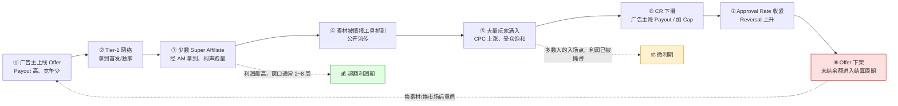
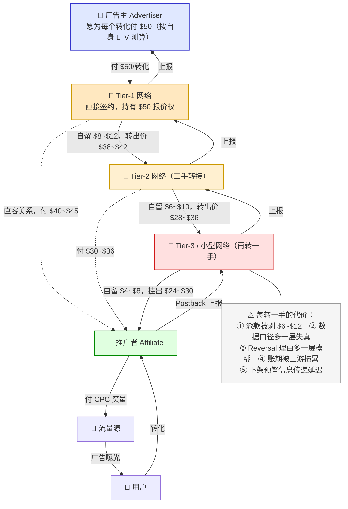

# CPA 网络与 Offer 市场

> **一句话定位**：本文讲的是联盟世界的**另一半**——不是内容站推商品拿佣金分成，而是**买量玩家推 Offer 拿固定派款**的生意：CPA Network 怎么运作、Offer 怎么分类、条款怎么读、质量怎么评估、钱在层层转手中怎么被剥掉。
>
> **核心结论先行**：CPA 生意的第一性原理是 **`EPC = Payout × CR × Approval Rate`** 与 **`CPC`** 的比较，盈亏平衡条件是 `Payout × CR × Approval Rate > CPC / 落地页转化率`。
> 四个变量里 **Payout 是唯一写在台面上的**，另外三个都要靠"问 AM + 小预算试跑"去实测。
> 这就是为什么这个行业的核心资产不是流量，而是**信息差与关系层级**：同一个 Offer，新人拿标准 Payout、不知道 Cap、不知道真实 Approval Rate；Super Affiliate 拿 Bump、拿直客、提前知道下架。
> 派款在"广告主 → Tier-1 网络 → Tier-2 网络 → 推广者"链路上会被剥掉 30%~50%（§6），**所以"往上走一层"比"把转化率优化 10%"的收益大得多**。
>
> **可信度标签**：`[标准]` 官方明文　`[政策]` 平台公开政策（标时点）　`[惯例]` 行业共识　`[推断]` 待验证推导
>
> 最后更新：2026-09-10

---

## 1. CPA Network 到底不一样在哪

[`Affiliate体系总览.md`](./Affiliate体系总览.md) §3.1 已经给出三种"联盟"的辨析表（Affiliate / CPA / Ad Network）。
本文不重复那张表，只深化**运作机制层面**的六个差异——这六点决定了你需要完全不同的能力模型。

### 1.1 六个机制差异

| 维度 | Affiliate Network | **CPA Network** | 为什么这个差异重要 |
|---|---|---|---|
| **推广者需要拥有什么** | 流量资产（SEO 排名、邮件列表、粉丝） | **投放能力 + 漏斗工程 + 垫资现金** | 内容站的资产会增值（域名权重、列表增长），买量者的资产会衰减（素材疲劳、账户封禁） |
| **Offer 从哪来** | 商家公开上架，Marketplace 里自己找 | **多数要靠 AM 分配或申请**，好 Offer 不公开 | 信息不对称是结构性的，不是网络"藏私" |
| **竞争形态** | 长尾关键词竞争，慢，可积累 | **同一 Offer 上的实时出价竞争**，快，赢家通吃 | CPA 里"晚一周入场"可能意味着 Offer 已饱和 |
| **收入的时间结构** | 内容资产带来长期尾流（写一次赚数年） | **停投即停收**，无尾流 | 决定了 CPA 玩家必须持续做素材与测新 Offer |
| **失败模式** | 流量不够、佣金降了、算法更新 | **一次账户封禁 / 一次 Offer 下架 / 一次 Reversal 潮**即可能全损 | CPA 的风险是**离散跳变**的，不是渐变的 |
| **合规压力落点** | FTC 披露、Cookie 同意、内容真实性 | **广告主与流量平台双向政策**（Meta/Google/TikTok 对 Offer 品类的限制 + 广告主的宣传红线） | CPA 玩家被"两头夹"：流量平台封账户，广告主拒转化 |

### 1.2 CPA 网络的三种商业形态

`[惯例]` 中文说"CPA 网络"，实际混着三种：

| 形态 | English | 收入来源 | 对推广者意味着什么 | 代表类型 |
|---|---|---|---|---|
| **纯中介型** | Broker / Marketplace Network | 广告主派款与付给推广者的 Payout 之间的**差价** | 派款被剥一层；Offer 多但质量参差 | 大多数中型 CPA 网络 |
| **直客型** | Direct Advertiser Network | 自己就是广告主（或独家代理） | **派款最高**，但 Offer 数量少 | 少数垂直领域的大广告主自建网络 |
| **技术平台型** | CPA Platform / Tracking-as-a-Service | 卖追踪系统给广告主与网络 | 不提供 Offer，只提供工具 | HasOffers/Tune、Everflow 类 |

**判断方法** `[推断]`：
问 AM 三个问题——①这个 Offer 你们是从广告主直接拿的吗？②Cap 是你们设的还是广告主设的？③Reversal 的判定标准谁定？
如果三个答案都指向"上游还有一家"，那你面对的就是二手 Offer（§6）。

### 1.3 谁在做这门生意

| 角色 | English | 干什么 | 核心能力 |
|---|---|---|---|
| **买量者** | Media Buyer / Affiliate | 买流量 → Pre-lander → Lander → Offer 转化 | 出价、素材、漏斗、数据分析 |
| **广告主** | Advertiser / Direct Client | 出 Offer、定 Payout、审核转化 | 产品、后端变现（LTV 要能撑住 Payout） |
| **网络 / AM** | CPA Network / Affiliate Manager | 撮合、追踪、审核、结算、垫资；分配 Offer、谈 Bump、预警下架 | 双边关系 + 风控 + 现金流 |
| **流量源** | Traffic Source | 卖点击（Native / Push / Pop / Social / Search / Display） | 流量规模与定向能力 |
| **工具层** | Spy Tool / Tracker | 素材情报（类别见 §8，不推荐具体产品）；点击转化记录与 ROI 计算 | 爬虫与数据整理 / SaaS 或自建 |

---

## 2. Offer 类型全景表

### 2.1 十二大品类对照

> **所有 Payout 与 CR 均为量级区间，标 `[惯例]` + 时点 2026-09。** CPA 派款波动极大（同一 Offer 在不同 Geo、不同季节可差 3~5 倍），
> 任何具体数字必须以 AM 当期报价为准。**下表用于建立"量级直觉"，不用于决策。**

| # | 品类 | English | 转化事件定义 | Payout 量级 `[惯例]`（2026-09） | 典型 CR 量级 `[惯例]` | 主要 Geo | 合规风险 | Reversal 风险 |
|---|---|---|---|---|---|---|---|---|
| 1 | **保健品/减肥** | Nutra | 下单（COD 货到付款 或 卡支付）、Trial 注册 | COD 单：$15~$60；卡支付单：$25~$90；Trial：$8~$40 | COD 5%~20%；卡支付 1%~5% | 东南亚、拉美、东欧、中东（COD）；美欧（卡） | **极高** | **极高**（COD 拒收率可达 30%~60%） |
| 2 | **抽奖/邮箱收集** | Sweepstakes / Email Submit | 提交邮箱 + 完成确认（Single Opt-in / Double Opt-in） | SOI：$0.3~$2.5；DOI：$1~$5 | 10%~40% | T2/T3 为主，T1 派款高但量少 | **高**（易涉误导性中奖宣称） | 中（无效邮箱、退订） |
| 3 | **金融** | Finance（贷款/信用卡/保险/开户） | 有效申请（Lead）、获批（Approved Lead）、开户并存入 | 线索 $5~$80；获批 $30~$300；开户 $50~$500+ | 1%~8% | T1 为主（美/英/加/澳） | **极高**（需牌照与披露） | **高**（无效线索、欺诈申请） |
| 4 | **应用安装** | App Install / CPI | 安装 + 激活（部分要求注册或首日留存） | T1 $1.5~$8；T2 $0.5~$2；T3 $0.1~$0.6；**游戏类首充可达 $20~$100+** | 视流量质量 5%~30% | 全球分层明显 | 中~高（隐私合规、MMP 归因） | 中（作弊判定、留存不达标） |
| 5 | **线索生成** | Lead Gen（家装/教育/太阳能/医美/搬家） | 提交合格表单（姓名+电话+地址+意向字段） | 家装 $10~$50；太阳能 $20~$100+；教育 $5~$60；医美 $15~$80 | 5%~25% | 美/英/澳/加（T1 为主） | **高**（TCPA 电话营销合规、Do-Not-Call） | **高**（字段不合格、重复线索、无法联系） |
| 6 | **订阅制** | Subscription（会员/内容/服务） | 首次付费订阅（部分含续费分成） | 首单 $10~$60，或 Rev Share 20%~50% | 1%~6% | T1/T2 | 中 | **高**（退订、拒付） |
| 7 | **试用类** | Trial Offer | 用户仅付运费/领试用即算转化（后端自动转订阅） | $15~$50 | **10%~30%（虚高）** | T1 为主 | **高**（自动续费披露义务） | **极高**（50%~80%，见 §5.3） |
| 8 | **加密货币** | Crypto（交易所开户/钱包/交易） | 注册 + KYC 完成 + 首次入金/交易 | 注册 $2~$15；KYC+入金 $30~$300；部分 Rev Share | 2%~10% | 全球，T2/T3 增长快 | **极高**（多国监管禁止或限制推广） | **高**（入金后 withdraw、欺诈账户） |
| 9 | **成人** | Adult | 注册、付费订阅、Cam 消费 | 注册 $1~$10；付费 $25~$100；Rev Share 20%~50% | 1%~8% | 全球 | **极高**（主流流量平台全面禁止） | 中~高 |
| 10 | **交友** | Dating（主流/成人向/Casual） | 注册（Free Lead）、付费会员（SOI/DOI/PPA） | 注册 $0.5~$5；付费 $20~$80 | 注册 10%~40%；付费 0.5%~4% | 全球，T2/T3 量大 | **高**（流量平台限制、虚假资料风险） | 中（付费退款） |
| 11 | **游戏** | Game（网页/手游/端游） | 注册、达到指定等级、首充（FTD） | 注册 $1~$8；FTD $20~$150；Rev Share 20%~50% | 注册 5%~25%；FTD 1%~6% | 全球，亚洲与欧洲量大 | 中~高（博彩类极高） | 中~高 |
| 12 | **电商实物（CPA 化）** | E-commerce CPA | 下单（固定派款而非比例分成） | $5~$40/单 | 1%~5% | 全球 | 低~中 | 中（退货） |

### 2.2 品类选择的三层判断

`[推断]` 选品类不是选"派款最高的"，而是三个问题的交集：

| 问题 | 内容 | 不匹配的后果 |
|---|---|---|
| **① 我的流量源允许这个品类吗？** | Meta / Google / TikTok 对 Nutra、Crypto、Adult、Dating 有明确限制或全面禁止；Native / Push / Pop 宽松但质量低 | 账户被封，一切归零 |
| **② 我能承受这个品类的 Reversal 与账期吗？** | Trial / Nutra / Finance 的 Reversal 率高且延迟 30~60 天到账 | 现金流断裂，见 §7.3 |
| **③ 合规责任我能承担吗？** | Nutra 健康宣称、Finance 收益承诺、Lead Gen 电话营销合规（TCPA）、Crypto 监管禁令 | 不只是丢佣金，可能涉及法律责任，见 §9 |

**新手的合理起点** `[惯例]`：
Sweepstakes（Email Submit）与 Dating 注册类——派款低但**转化率极高、Reversal 极低、合规风险相对可控**，
适合用来练漏斗与投放基本功。不建议新手一上来就做 Nutra 或 Finance：
派款诱人，但 Reversal 与封号会让"看起来赚钱"的账实际亏损。

### 2.3 Geo 分层与派款的关系

`[惯例]` 与 [`../08_海外广告生态/海外流量Tier分层与地域特征.md`](../08_海外广告生态/海外流量Tier分层与地域特征.md) 一致：

| Tier | 代表地区 | Payout 特征 | CPC 特征 | 净毛利特征 | 主要风险 |
|---|---|---|---|---|---|
| **T1** | 美、英、加、澳、德、日 | 最高 | 最高 | 竞争最激烈，**边际利润薄** | 合规最严、素材衰减最快 |
| **T2** | 西/意/波兰、巴西、墨西哥、部分中东 | 中 | 中 | **性价比常最好** | 支付与结算基础设施不稳 |
| **T3** | 印度、印尼、越南、菲律宾、尼日利亚、埃及 | 最低 | 最低 | 量大利薄，靠规模 | 作弊流量比例高、Reversal 高 |

`[推断]` **一个反直觉的结论**：T1 派款高不等于 T1 好赚——T1 的 CPC 可能是 T3 的 5~20 倍，而派款通常只有 3~8 倍，**毛利率反而是 T2 更优**。
这也是为什么大量买量玩家长期深耕 T2 市场（拉美、南欧、东欧、中东）而非 T1。

---

## 3. Offer 关键条款全解

[`联盟角色与佣金模型.md`](./联盟角色与佣金模型.md) §7.4 给出了条款清单表。本节展开**实操向**的细节：每一条怎么读、怎么问、怎么被坑。

### 3.1 Payout（派款）

| 子类型 | English | 说明 | 陷阱 |
|---|---|---|---|
| 标准派款 | Base Payout | 每个合格转化的固定金额 | 只是"标价"，实际到手要乘 Approval Rate |
| 分层派款 | Tiered Payout | 按量级分档（月 100 单以下 $20，以上 $25） | **档位是否全额累进**（见 [`联盟角色与佣金模型.md`](./联盟角色与佣金模型.md) §3.2） |
| 加成派款 | Payout Bump | AM 私下给标准派款之上的加成 | 口头承诺不落系统 = 不存在（§3.5） |
| 混合派款 | Hybrid | 固定 + Rev Share（如 CPI $3 + 玩家首充 10%） | 后端分成部分的口径与到账周期常不透明 |
| **净派款** | Effective Payout | `Base × Approval Rate`，才是决策依据 | **绝大多数人只看 Base** |

`[推断]` **算例**：Offer A 报价 Payout $50、历史 Approval Rate 45% → 有效 $22.5；
Offer B 报价 $30、Approval Rate 90% → 有效 $27.0。**B 更好，但 Marketplace 上 A 排在前面**（按名义 Payout 排序）。

### 3.2 Cap（转化上限）—— 规模化前必须问的第一条

| 类型 | English | 机制 | 被坑的方式 |
|---|---|---|---|
| 日上限 | Daily Cap | 每天最多计 N 个转化 | 素材爆了 → 当天超量部分**不计酬** → 白买流量 |
| 月上限 | Monthly Cap | 每月最多计 N 个 | 月中就撞顶，下半月投放全亏 |
| 分地区上限 | Geo Cap | 某国每日 N 个 | 你的流量结构一变就撞顶 |
| 计划总上限 | Program-wide Cap | 广告主月度预算封顶 | **推广者通常不会被告知**（见 [`联盟角色与佣金模型.md`](./联盟角色与佣金模型.md) §3.8） |
| 无上限 | Uncapped | 名义上不限 | 实际会在你放量后**临时加 Cap 或降 Payout** |

**必须问 AM 的三个问题**：① 当前 Cap 是多少（日/月/分 Geo）？② 撞 Cap 后超量转化是**丢弃**还是**顺延到次日**（差别巨大）？③ 我要放量到 X/天，能提前申请提 Cap 吗、审批要多久？

`[惯例]` **Cap 不告知是这个行业最高频的坑**（§10.2）。
成熟做法：在自己的 Tracker 里设置转化计数告警，达到 Cap 的 80% 自动暂停投放——不要依赖网络的通知。

### 3.3 Exclusive（独家）

**独家推广权**（Exclusive / Exclusive Deal）
- 定义：广告主只允许你（或极少数几家）推广该 Offer，其他推广者被移除。
- 通俗解释：一条街上只有你一家店在卖这个东西。
- 易混提示：与 **Whitelist**（白名单，指"允许某些推广方式"）不同，Exclusive 是"排除其他推广者"。

| 维度 | 说明 |
|---|---|
| **好处** | 竞争归零 → 可承受更高 CPC；派款通常更高；素材不会立刻被别人抄 |
| **代价** | 几乎总要**保底量承诺**（Minimum Commitment）：承诺月投 X 美元或带 Y 个转化 |
| **陷阱** | 达不到保底 → 赔付或失去独家 + 被扣款；见 §10.4 |
| **适用** | 已有稳定跑通的漏斗、现金流充足、对该品类有把握的成熟玩家 |
| **不适用** | 新人、素材未验证、需要测试期的阶段 |

`[推断]` **判断一个 Exclusive 值不值得签**：
独家带来的增量毛利 ≈（可承受 CPC 提升幅度 × 点击量）− 保底量赔付风险敞口，
其中 `风险敞口 = P(达不到保底) × 保底差额`。
关键是 **P(达不到保底) 必须用你自己的历史数据估，不能用 AM 的乐观预测**——
如果你的漏斗还没在这个 Offer 上跑过，不要签独家。

### 3.4 Geo Targeting（地域限制）与流量白名单

| 条款 | English | 含义 | 违反后果 |
|---|---|---|---|
| 地域白名单 | Geo Whitelist / Allowed Geo | 只有列出国家的转化计酬 | 其他地区的转化**全部 Reversal**，且流量成本已花掉 |
| 地域黑名单 | Geo Blacklist | 明确排除的国家（常因合规或欺诈高发） | 同上 |
| 分地域派款 | Geo-differentiated Payout | 同一 Offer 在不同国家不同派款 | 不算违反，但**混流量投放会算不清账** |
| 流量源白名单 | Traffic Source Whitelist | 只允许某些流量类型（如禁止 Incentivized、禁止 Adult 流量、禁止某些 Native 网络） | 转化被拒 + 可能封号 |
| 推广方式白名单 | Method Whitelist | 是否允许 SEM / Social / Email / SMS / Push / Native / Display | 同上 |
| 落地页要求 | Pre-lander Requirement | 必须先过 Pre-lander，禁止直链（Direct Linking） | 转化被拒 |

`[惯例]` **必须按 Geo 拆 Sub ID 投放**。把所有国家混在一个 Campaign 里的后果：① T3 流量拉高点击量但不产生计酬转化，EPC 被稀释；② 无法定位是哪个地区撞了 Cap 或 Approval Rate 低；③ 广告主收紧某地区时你不知道该关哪个。Sub ID 结构见 [`联盟追踪技术与Postback.md`](./联盟追踪技术与Postback.md)。

### 3.5 Vertical / Horizontal（垂直 vs 水平派款）

这是**新人最容易误解**的一对术语。

| | **Vertical** | **Horizontal** |
|---|---|---|
| 定义 | 每个动作/层级都**分别**派款 | 只在**最终**动作派款一次 |
| 例子（漏斗：注册 → 试用 → 付费） | 注册给 $2，试用给 $15，付费给 $40，**三级都拿** | 只有付费给 $50，前两级 $0 |
| 推广者现金流 | **好**（早期动作就有收入） | 差（要等到漏斗末端） |
| 对广告主 | 成本高，但能买到更多上层数据 | 成本低，只为真实价值付费 |
| 常见于 | Lead Gen、Trial、订阅类 | 电商、金融开户、游戏 FTD |
| 陷阱 | 上层动作派款容易 → **Approval Rate 低**（广告主会砍无效上层转化） | 漏斗长 → 现金流占用极大 |

**必须问清楚的问题** `[惯例]`：① 这个 Offer 是 Vertical 还是 Horizontal？② 若是 Vertical，每一级的派款与 Approval Rate 分别是多少？
③ 上层派款的转化，如果用户最终没走到下层，会被追回吗？（**Clawback 条款**）

### 3.6 Pre-lander 与 Direct Linking

| 做法 | English | 说明 | 合规边界 |
|---|---|---|---|
| **直链** | Direct Linking | 广告 → 直接到 Offer 页 | 多数网络**禁止**（转化率差 + 广告平台审核不过） |
| **前置落地页** | Pre-lander / Bridge Page | 广告 → Pre-lander（内容/测验/advertorial）→ Offer 页 | 主流做法；**内容真实性是红线** |
| **多级漏斗** | Multi-step Funnel | 广告 → Pre-lander → Quiz → Email 收集 → Offer | 可同时做 List Building，见 [`邮件营销与私域List.md`](./邮件营销与私域List.md) |

漏斗设计与各步转化率基准见 [`落地页与转化漏斗设计.md`](./落地页与转化漏斗设计.md)。**本文只强调合规红线**：Pre-lander 上的健康宣称、收益承诺、"中奖"暗示、名人代言，都是广告主与流量平台的双重审核重点，也是 Reversal 与封号的主要触发点（§9）。

---

## 4. Offer 质量评估方法：一套可执行清单

### 4.1 核心公式与三个乘数

```
有效 EPC = Payout × CR × Approval Rate
盈亏平衡：有效 EPC > CPC / 落地页转化率_点击到转化

  Payout        —— 台面上唯一可见的，也最不重要
  CR            —— 点击到转化的比率，取决于「流量 × 漏斗 × Offer 匹配度」
  Approval Rate —— 转化被广告主认可的比例，取决于「流量质量 × 条款严格度 × 是否扣量」
```

与 [`联盟角色与佣金模型.md`](./联盟角色与佣金模型.md) §8.4 的敏感性结论一致：**CPC ±20% 只影响毛利约 3%，而 Approval Rate / CR / Payout 各 ±20% 影响约 23%。**
所以评估 Offer 的精力应该 80% 花在 CR 与 Approval Rate 上，而不是比价 Payout。

### 4.2 十项评估清单

| # | 检查项 | 怎么查 | 不合格信号 |
|---|---|---|---|
| 1 | **Approval Rate 历史值** | 直接问 AM 要该 Offer 近 90 天的平均通过率 | AM 含糊、只说"很高"、拒绝给数字 |
| 2 | **Offer 上线时长** | 问 AM / 看 Marketplace 的新旧标记 / 搜社区讨论 | **上线超过 6~12 个月的老 Offer 通常已饱和**（素材被抄烂、受众被打过） |
| 3 | **是否 Vertical / Horizontal** | 问 AM | 说法前后不一致 |
| 4 | **Cap（日/月/Geo）** | 问 AM + 自己设告警 | "Uncapped" 的口头承诺 |
| 5 | **是否直签** | 问"你们从广告主直接拿的吗"（§1.2） | 上游还有一家 → 派款已剥一层 |
| 6 | **Reversal 延迟** | 问"转化后多久判定 Approved/Reversed" | 超过 60 天 → 现金流风险高 |
| 7 | **流量源白名单** | 问清允许/禁止的流量类型 | 与你的投放渠道不匹配 |
| 8 | **Pre-lander 要求与素材授权** | 是否提供官方素材、是否允许改编、有无禁用宣称清单 | 无素材支持 + 无禁用清单 = 合规责任全在你 |
| 9 | **广告主的历史稳定性** | 搜社区/论坛对该广告主的评价、是否长期拖欠 | 有扣量或拖欠历史 |
| 10 | **小预算实测** | 跑 $100~$500/天 × 7~14 天 | 见 §4.3 |

### 4.3 为什么必须"小预算试跑 7~14 天"

`[惯例]` 这是这个行业**唯一可靠**的评估方法，四个理由：
① **AM 给的数据是全体推广者的均值**（含头部玩家的优质流量与已谈成的 Bump），和你的实际情况可能差 2~5 倍；
② **Approval Rate 有延迟**——转化当天显示 Pending，30~60 天后才知道被拒多少，**跑 3 天就放量是新手最常见的致命错误**（你看到的"赚钱"是未扣 Reversal 的假账）；
③ **CR 会随素材衰减**，第一周的高 CR 通常 1~3 周后掉一半（见 [`Affiliate单位经济与规模化.md`](./Affiliate单位经济与规模化.md)）；
④ **Cap 只有在放量后才暴露**，小量跑不撞顶，你永远不知道真实上限。

**试跑的正确姿势**：

| 阶段 | 预算与动作 | 目标 | 注意 |
|---|---|---|---|
| **Day 1~3** | 小预算（$100~$300/天），单一流量源、单一 Geo | 验证技术链路（Postback 是否回传、转化是否被记录） | ⚠️ 此阶段数据**不要用来做决策** |
| **Day 4~7** | 略提预算，按 Geo / 素材 / 版位拆 Sub ID | 找到 CR 最高的组合 | — |
| **Day 8~14** | **维持预算不加量**，等第一批 Reversal | 算出真实 Approval Rate，得到有效 EPC | 这是最容易被跳过的一步 |
| **Day 15+** | 若有效 EPC > CPC 且有余量 → 逐步加量（每次 +20%~30%，**不要翻倍**），同时向 AM 申请提 Cap | 规模化 | 加量前必须已确认 Cap（§10.2） |

### 4.4 一个完整的评估算例

`[推断]` **示意算例，数字为假设值，用于展示方法**：

```
Offer：某 T2 国家 Nutra COD 单
  AM 报价：Payout $32、CR 12%、Approval "很高，大概 80%"

实测（14 天，日预算 $200，CPC $0.28）：
  点击 10,000 → 转化 1,050（实测 CR 10.5%，接近 AM 说法）
              → Approved 420（实测 Approval 40%，远低于 AM 说的 80%）
              → Reversed 630（拒收 / 无效地址 / 重复下单）

有效 EPC = $32 × 10.5% × 40% = $1.34，CPC $0.28 → 账面 ROAS 4.8

⚠️ 但还要扣三项：
  ① Cap：Day 9 起撞到日 Cap 60 单，超量 210 单不计酬 → 收入 −20%
  ② 现金流：COD 审核周期 21~35 天，14 天已垫 $2,800，全部回款要到 Day 50
  ③ 素材衰减：Day 10 后 CR 从 12% 掉到 7% → 后半月有效 EPC 仅 $0.90

结论：不是"好 Offer"，是「AM 报价乐观 + COD 品类天然高 Reversal」。
     前 14 天账面盈利，考虑 Cap 与衰减后第 3~6 周极可能转亏。
```

**这个算例的价值** `[推断]`：它展示了为什么"AM 声称的数据"与"实测数据"之间必然有差距，
以及为什么差距主要出现在 **Approval Rate** 而不是 CR——
因为 CR 是你能自己测的，Approval Rate 是**对方判定的**，存在结构性信息不对称（也是扣量的空间，见 [`联盟反作弊与扣量.md`](./联盟反作弊与扣量.md)）。

---

## 5. Offer 生命周期与市场动态

### 5.1 一个 Offer 的典型生命周期



### 5.2 生命周期各阶段的判断信号

| 阶段 | 可观测信号 | 该做什么 |
|---|---|---|
| **①~③ 早期** | AM 主动私聊推荐；Marketplace 上看不到；派款明显高于同品类均值 | **立即小额测试，跑通就放量**；不要到处分享 |
| **④~⑤ 扩散期** | 素材情报工具里能搜到大量同类素材；社区开始讨论这个 Offer | 要么已有优势继续跑，要么放弃；**此时入场等于接盘** |
| **⑥ 衰退期** | AM 通知降 Payout / 加 Cap；CPC 上涨而 CR 下降 | 降预算、换 Geo、换素材角度；准备下一个 Offer |
| **⑦~⑧ 末期** | Approval Rate 骤降、频繁 Reversal、突然下架 | **停止投放，立刻提现余额**，不要等新 Offer 通知 |

`[惯例]` **一条核心经验**：CPA 生意的持续性不来自某个 Offer，而来自**"能持续拿到早期 Offer 的关系网络"**。
这就是 §6 讲"往上走一层"的原因。

### 5.3 季节性与 Trial Offer 陷阱

`[惯例]` **季节性**：Q4（10~12 月）电商类 Offer 派款与 CR 双高但 CPC 也暴涨；
**1 月是 Nutra / 健身 / 减肥类峰值**（新年决心效应），同时金融类（报税、债务整合）走高；
Q1 后半~Q2 广告主预算收紧、派款普遍下调（传统淡季）；7~8 月欧美流量因假期下降（旅游类反而走高）；
9 月教育类与 B2B 类回升（开学季与财年节奏）。

**Trial Offer 的经济学陷阱**（与 §2.1 呼应）——见 [`联盟角色与佣金模型.md`](./联盟角色与佣金模型.md) §7.5 的完整演算。核心结论：

```
表面：Payout $40，CR 15%  → EPC $6.00（极诱人）
实际：Reversal 率 50%~80% → 有效 EPC $1.20~$3.00
      且 Reversal 发生在 30~60 天后 → 期间已垫付全部流量成本
```

`[惯例]` Trial Offer 是"看起来最好赚、实际最容易亏"的品类。
判断三招：① 问 AM 要历史 Approval Rate；② 小预算跑满一个完整 Reversal 周期（≥45 天）再决定放量；
③ 检查 Trial 转 Full Purchase 是否有额外派款（好 Offer 会给，这是广告主诚实度的信号）。

---

## 6. 网络层级与直客：钱在哪一层被剥掉

### 6.1 派款剥离链路



### 6.2 各层的量级与代价

| 层级 | English | 派款剥离量级 `[惯例]` | 你额外承担什么 | 适合谁 |
|---|---|---|---|---|
| **直客** | Direct Advertiser | **0（最高派款）** | 需自己谈合约、自己做追踪对账、无网络垫付与仲裁 | Super Affiliate、机构化团队 |
| **Tier-1 网络** | Tier-1 Network | 广告主派款的 15%~25% | 通常有量级门槛（月消耗/月转化） | 成熟玩家 |
| **Tier-2 网络** | Tier-2 / Sub-network | 累计 30%~40% | 数据失真、Reversal 理由模糊、账期被拖累 | 新人起步（**别无选择时**） |
| **Tier-3+** | Reseller | 累计 40%~50%+ | 全部上述问题 + 跑路风险 | 不推荐 |

`[推断]` **剥离不只是钱的问题**。每多一层，你失去的是：① **信息时效**（Offer 要下架，直客提前两周知道，Tier-3 可能当天才知道）；② **争议能力**（Reversal 申诉要穿过两层，成功率骤降）；③ **条款可控性**（Cap、Whitelist 都是上游定的，你只能接受）。

### 6.3 怎么才能拿到直客 / Tier-1

`[惯例]` 按可行性排序：

| 路径 | 需要什么 | 现实性 |
|---|---|---|
| **在 Tier-2 网络上跑出可见的量** | 稳定月转化量（通常数千级）+ 干净的 Approval Rate 记录 | ★★★★ **最主流路径**：Tier-1 的 AM 会主动挖表现好的推广者 |
| **垂直深耕成为品类专家** | 长期只做 1~2 个品类，积累受众数据与素材库 | ★★★★ **最可持续**：广告主需要的是"懂这个品类的人"，不是"能买量的人" |
| **通过 AM 介绍 / 行业会议** | 与现有 AM 关系好且品类匹配；线下见面建立信任的效率远高于邮件 | ★★★ 关系是这个行业最硬的通货 |
| **直接联系广告主** | 有可证明的流量能力与合规记录；广告主有 Affiliate 部门 | ★★ 成功率低但一旦成功收益最大 |
| **换体量换独家** | 承诺保底量（有风险，§10.4） | ★★ 双刃剑 |

**开口的正确方式**（与 [`主流联盟网络盘点.md`](./主流联盟网络盘点.md) §6.2 的逻辑一致）：

```
✗ "你们的 Offer 派款太低，能不能给我直客价？"
✓ "过去 6 个月我在你们网络上跑了 X 品类，累计 Y 个转化，Approval Rate Z%（高于网络均值），
    全部来自 [具体流量源] 的白名单流量，无一次合规投诉。
    基于这个记录，我希望讨论：① 直客或 Tier-1 定价；② Cap 提升至 N/日；③ 某 Offer 的独家。"
```

### 6.4 直客的风险面（不要只看到好处）

`[推断]` 直客并非纯正面，四个代价：① **失去网络的信用担保**——广告主拖欠时没人替你垫资或仲裁，跨国法律程序几乎不可行；
② **失去 Offer 组合的广度**——单一广告主 Offer 少，一旦下架收入断崖；③ **追踪与对账责任在自己**——要自建 Tracker 与对账流程；
④ **合规责任更直接**——网络会替你过滤明显违规的做法，直客关系下广告主直接追责到你。

**结论**：正确结构是**"直客/Tier-1 为主 + 2~3 家 Tier-2 作为备选与新品测试渠道"**，而不是全押一边。

---

## 7. 单位经济：CPA 买量的账怎么算

### 7.1 基础公式

```
【单次点击口径】
毛利/click = Payout × CR × Approval Rate − CPC
ROAS       = (Payout × CR × Approval Rate) / CPC
盈亏平衡 CR = CPC / (Payout × Approval Rate)

【日口径】
日利润 = 日点击 × (有效 EPC − CPC) − Tracker 成本 − 落地页/服务器 − 人力
资金占用峰值 ≈ 日消耗 × 平均回款天数
```

### 7.2 漏斗各层的转化率量级

`[惯例]` 典型 Pre-lander 漏斗（**量级参考，随品类与 Geo 差异极大**；详见 [`落地页与转化漏斗设计.md`](./落地页与转化漏斗设计.md)）：

| 漏斗层 | 转化率量级 | 决定因素 |
|---|---|---|
| 广告曝光 → 点击（CTR） | 0.5%~3%（Native）；1%~5%（Push）；0.3%~1.5%（Display） | 素材 |
| 点击 → Pre-lander → Offer 页 | 30%~60% | Pre-lander 质量 |
| Offer 页 → 转化 | 2%~15%（品类差异极大，见 §2.1） | Offer 与流量匹配度 |
| **点击 → 转化（总 CR）** | **1%~8%**（多数品类）；Email Submit 可达 10%~30% | ← 这才是算 EPC 用的 CR |
| 转化 → Approved | 40%~95%（品类差异极大） | 见 §3.1 |

### 7.3 现金流模型（CPA 玩家的第一死因）

```
现金流出（当天）：CPC × Clicks
现金流入（T+N 天）：Payout × CR × Approval Rate × Clicks
  N = 转化判定延迟（Pending→Approved，7~60 天）+ 网络账期（Net-7/15/30）+ 达到起付额所需时间

示例：日消耗 $1,000、平均回款 45 天 → 需垫资 ≈ $45,000
     若毛利率 25%，单轮周期利润 ≈ $11,250，年化周转 8 次 ≈ $90,000（理论值）

⚠️ 这个理论值假设了四件现实中都不成立的事：
   ① 素材不衰减（实际 1~3 周衰减一半）　② Offer 不下架（实际随时发生）
   ③ 账户不被封（实际高频）　　　　　　　④ Approval Rate 稳定（实际会突然收紧）
   → 任一事件发生，垫资变成沉没成本。
```

`[惯例]` **应对三条**：
① 日投放规模 ≤ 可垫资额 / 平均回款天数；
② 保留 3 个月现金缓冲；
③ 优先选**回款快的网络**（部分 CPA 网络支持周结甚至日结，代价是派款率低 5%~15%）——
**对现金流紧张的玩家，快回款的低派款 Offer 优于慢回款的高派款 Offer**。

### 7.4 敏感性：什么变量最脆弱

与 [`联盟角色与佣金模型.md`](./联盟角色与佣金模型.md) §8.4 完全一致（同一结论，不同语境）：

| 变量 | ±20% 对毛利的影响 | 脆弱度 |
|---|---|---|
| Approval Rate | ~23% | ★★★ |
| 落地页/漏斗转化率 | ~23% | ★★★ |
| Payout | ~23% | ★★★ |
| CPC | **~3%** | ★ |

→ **新手每天盯 CPC 出价，老手每天盯 CR 与 Approval Rate。**
→ 更进一步：老手盯的是**"下一个 Offer 在哪"**，因为 Offer 生命周期（§5.1）的影响大于任何单变量优化。

---

## 8. Offer 市场信息源：类别与用途

> **本节只讲信息源的类别、用途与局限，不推荐具体产品，也不提供任何用于规避审核或伪装流量的用法。**
> 立场与 [`../00_研究方法与协作规范/协作规则.md`](../00_研究方法与协作规范/协作规则.md) §5.1 一致：研究认知与防守，不提供可被直接执行的越线方案。

### 8.1 四类信息源

| 类别 | English | 提供什么 | 局限 | 合规注意 |
|---|---|---|---|---|
| **社区与论坛** | Affiliate Forums / Communities | Offer 口碑、网络是否扣量/拖欠、广告主评价、品类趋势、AM 推荐 | 信息滞后；有利益相关（发帖人可能在推自己手上的 Offer）；水军与假评 | 只作为"负面信号"来源可信度较高，"正面推荐"要打折 |
| **素材情报 / 广告库** | Ad Spy / Ad Intelligence Tools | 抓取**公开投放**的广告素材与落地页，按品类/地区/时间检索，看竞对在跑什么 | ① 只能看到公开素材，看不到出价与真实 ROI；② 你看到的可能是已经衰减的旧素材；③ **看到 ≠ 能复制**（对方可能有独家 Offer 或更低成本流量） | 抓取范围须限于公开内容；直接复制素材涉及版权与平台政策 |
| **官方广告库** | Platform Ad Libraries | 部分主流平台提供**公开的广告透明度库**（可按广告主/地区检索在投广告） | 覆盖面与检索能力有限 | 官方提供，合规 |
| **网络自身的 Marketplace 数据** | Network Marketplace Analytics | EPC、CR、Gravity 类热度指标、新上架 Offer | 是**全体推广者均值**（见 §4.3）；热度高的往往已饱和 | 官方数据，可信但需正确解读 |

### 8.2 竞品监控的三种类型

| 类型 | 监控什么 | 用途 | 边界 |
|---|---|---|---|
| **Offer 层监控** | 哪些网络新上了什么 Offer、派款变化、Cap 变化 | 抢早期窗口（§5.1） | 正常商业情报 |
| **素材层监控** | 竞对的广告素材、Pre-lander 结构、Hook 角度 | 理解市场已被教育到什么程度、找差异化角度 | **理解思路可以，直接抄袭不行**（版权 + 平台重复内容政策） |
| **落地页/漏斗层监控** | 竞对漏斗有几步、每步的说服结构、是否收集邮箱 | 优化自己的漏斗设计 | 同上 |

`[惯例]` **一条重要的认知纠偏**：素材情报工具最大的价值**不是"找到能抄的素材"，而是"判断一个 Offer 处于生命周期的哪个阶段"**。
如果某 Offer 的素材在情报库里已有几百条变体、跨多个地区、持续投放超过 3 个月——说明它已过早期红利期，此时入场是在给别人抬 CPC。
反过来，如果搜不到任何素材，可能是①刚上线（机会）或②根本跑不通（陷阱），**必须靠小额实测区分**。

### 8.3 信息源的优先级

`[推断]` 按可靠性从高到低排序：
**① 自己的实测数据**（唯一 100% 可靠，但慢且贵）＞ **② AM 给的历史数据**（有信息优势但立场不中立）＞
**③ 网络 Marketplace 的聚合指标**（客观但是均值，且口径有陷阱）＞ **④ 社区口碑**（负面信息可信度高、正面信息可信度低）＞
**⑤ 素材情报**（只能看表象，看不到经济账）＞ **⑥ 二手文章/博客/课程**（大量互相引用未经一手验证的数字，最低）。

---

## 9. 合规红线

`[政策]`/`[惯例]` 本节只讲**红线在哪、为什么存在、越线的后果**，不提供任何规避方法。

| 领域 | 红线 | 为什么 | 后果 |
|---|---|---|---|
| **健康宣称（Nutra）** | 不得声称"治愈""替代药物""X 天瘦 Y 斤"等疗效承诺 | 多国药监与消费者保护法规明确禁止；FTC 对健康类产品有专门的广告实质要求（Substantiation） | 广告主拒付全部转化、封号、流量平台永久封户、**可能涉及法律责任** |
| **金融宣称** | 不得承诺收益率、不得隐瞒费用与风险、不得误导资质要求 | 金融广告在多国受专门监管（如英国 FCA、美国 CFPB/SEC 视野） | 同上，且金融广告主合规审查最严 |
| **抽奖/中奖暗示（Sweepstakes）** | 不得暗示用户"已中奖"、不得使用伪造的奖项/倒计时/名额 | 误导性商业行为，FTC 与各国消费者保护法明确禁止 | 转化被拒 + 封号；此类素材是流量平台审核的重点打击对象 |
| **自动续费披露（Trial/Subscription）** | 必须在转化前清晰披露续费金额、周期、取消方式 | 多国"点击取消法"（Click-to-Cancel 类规则）与消费者保护要求 | Reversal 率飙升（用户拒付）、广告主追责 |
| **电话/短信营销（Lead Gen）** | 线索必须在用户明确授权下才可被电话/短信联系；需遵守 Do-Not-Call 与 TCPA 类法规 | 未经同意的营销通讯有明确罚则 | **单条违规可达数百至数千美元罚款**，是 Lead Gen 品类最大的法律风险 |
| **FTC 披露义务** | 联盟关系必须清晰披露（如 `#ad`、affiliate disclosure） | FTC Endorsement Guides | 罚款 + 品牌方终止合作 |
| **Cookie 与同意（欧盟/英国/加州）** | 追踪前需获得有效同意（GDPR + ePrivacy；CCPA 的退出权） | 见 [`../08_海外广告生态/海外隐私法规-GDPR-CCPA-TCF.md`](../08_海外广告生态/海外隐私法规-GDPR-CCPA-TCF.md) | 转化不计酬 + 罚款风险 |
| **虚假身份/伪造证言** | 不得使用伪造的用户评价、伪造的媒体报道、虚构的"专家" | FTC 对虚假证言有明确执法先例 | 封号 + 法律责任 |
| **禁止的流量类型** | Incentivized Traffic（激励流量）、Click Fraud、Bot 流量、Cookie Stuffing | 广告主只为真实意向付费 | 全部 Reversal + 永久封号 + 扣留余额；见 [`联盟反作弊与扣量.md`](./联盟反作弊与扣量.md) |

> **本项目的立场**：以上红线的**动机**是可以研究的（为什么有人越线：短期 EPC 高、素材点击率高、审核有延迟），
> 但**方法**不在本文范围内。任何"如何让违规素材通过审核""如何伪装落地页"的内容都超出红线，
> 参见 [`../00_研究方法与协作规范/协作规则.md`](../00_研究方法与协作规范/协作规则.md) §5.1 的判定标准。

---

## 10. 常见坑清单

### 10.1 Offer 突然下架

| 表现 | 原因 `[惯例]` | 应对 |
|---|---|---|
| 无预警下架，正在投放 | 广告主预算用尽 / 产品出问题 / 合规事件 / 被竞品收购 | ① 立即停投；② 向 AM 询问已产生转化的结算安排；③ 保留所有数据用于对账 |
| 只下架部分 Geo | 某地区 Reversal 率过高或监管变化 | 按 Geo 拆 Sub ID 的玩家能立刻定位并调整 |
| "暂停"但没说多久 | 通常是永久下架的委婉说法 | 不要等，直接找替代 Offer |
| 下架后余额被冻结 | 网络在等广告主对账 | 关注结算周期；小额网络有跑路风险 |

**预防** `[惯例]`：任何时候手上至少有 **3~5 个在跑或待测的 Offer**，且分属 2~3 个不同品类。
单一 Offer 依赖是 CPA 玩家最常见的结构性脆弱点。

### 10.2 Cap 不告知

典型剧情：Day 1~7 小量测试 ROAS 3.5 → Day 8 加预算 3 倍 → Day 9~14 转化数不涨、CPC 涨、ROAS 掉到 0.6 →
Day 15 问 AM 才得知"日 Cap 60，你从 Day 8 起每天撞顶，超量 400+ 个转化不计酬"。
**结果：白烧 6 天流量，且这批受众已被消耗（重复触达成本上升）。**

**预防**：① 放量前**书面确认 Cap**（邮件留痕）；② 在自己的 Tracker 里设转化计数告警（达到 80% Cap 自动暂停）；
③ 加量永远**渐进**（每次 +20%~30%），观察转化数是否同步线性增长——**预算加了 50% 而转化只加了 5%，几乎可以确定撞 Cap 了**。

### 10.3 AM 承诺的 Approval Rate 与实际不符

| 情况 | 判断 | 应对 |
|---|---|---|
| AM 说 80%，实测 40% | ① AM 说的是头部玩家的数据；② 广告主收紧了审核；③ **网络在扣量** | 拆 Sub ID 看分布：若所有流量源均匀偏低 → 疑似系统性扣量；若只有某源低 → 你的流量问题。见 [`联盟反作弊与扣量.md`](./联盟反作弊与扣量.md) |
| AM 说 80%，实测 75% | 正常波动 | 继续 |
| Approval Rate 随时间单调下降 | 广告主在收紧或开始扣量 | 降预算，问 AM 要 Reversal 理由明细 |
| 拒绝提供 Reversal 理由 | **强负面信号** | 考虑撤出，把余额提走 |

`[惯例]` **健康区间**（与 [`联盟角色与佣金模型.md`](./联盟角色与佣金模型.md) §6.3 一致）：电商 CPS >85%；Lead Gen 70%~90%；Trial Offer 40%~70%；**<60% 且对方不说明理由 = 高度疑似扣量。**

### 10.4 独家 Offer 的保底量陷阱

典型条款：给你 Exclusive + Payout Bump 20%，条件是承诺月投放 $50,000 或月转化 2,000 个。

| 风险 | 说明 |
|---|---|
| **漏斗未验证就签** | 实际只能跑到 900 个，而条款写明"未达保底按差额 × Payout 赔付"或"追回已享受的 Bump" → **不仅没多赚还要倒赔** |
| **保底计量口径陷阱** | 保底量以"广告主 Approved"计而非"你提交的转化数" → Approval Rate 若只有 50%，你要跑 4,000 个提交量才够保底 |
| **单向条款** | 保底期内广告主可单方面降 Payout 或加 Cap，你的保底义务却不变 |

**签独家前必须确认的五条** `[惯例]`：① 保底的计量口径（提交量 or Approved 量）；② 未达保底的赔付公式与上限；
③ 保底期内广告主能否单方面改条款（Payout/Cap/Whitelist）；④ 独家范围（是否含所有 Geo 与流量类型）；⑤ 退出条款。

`[推断]` **一般原则**：**在你的漏斗已在该 Offer 上稳定跑通至少 30 天之前，不要签任何保底量条款。**

### 10.5 其他高频坑

| 坑 | 说明 | 应对 |
|---|---|---|
| **Postback 配置错误导致转化不记录** | 花了流量但网络侧看不到转化，误判为"Offer 不行" | 投放前用测试转化验证全链路，见 [`联盟追踪技术与Postback.md`](./联盟追踪技术与Postback.md) |
| **Sub ID 未透传** | 无法定位哪个素材/版位/Geo 有效，优化变成瞎猜 | 从第一天就建立 Sub ID 命名规范 |
| **流量源账户封禁** | 素材违规、品类违规、账户关联判定 | 素材合规优先；账户与主体隔离管理；**不要依赖单一流量源** |
| **多网络跑同一广告主的 Offer** | 可能被判定为"重复归因"或违反排他条款 | 先问 AM 是否允许 |
| **汇率与结算币种错配** | 派款以美元计但流量成本以本地币计 | 大额做汇率对冲或在报价时留出缓冲 |
| **税务文件未提前准备 / 把账面 ROAS 当真实利润** | 达到起付额才发现 W-8BEN 未提交；未扣 Reversal、Cap 损失、工具与人力 | 注册当天提交完整税务文件；用 §4.4 的修正算法 |

---

## 11. 国内 vs 海外

| 维度 | 海外 | 国内 |
|---|---|---|
| **CPA 网络是否存在** | **成熟且活跃**，Offer 市场是完整的产业（Nutra/Sweeps/Finance/Lead Gen/Crypto/Dating/Game 全品类） | **基本没有对应物**。效果广告走巨量引擎/腾讯广告/百度营销的**平台直投**路径，广告主自己承担转化风险 |
| **为什么国内没有** | — | `[推断]` 四个原因：① 平台直投的 oCPX 机制已经把"按转化付费"内化进平台，不需要中间网络；② 广告主资质与内容审核由平台统一管控，第三方转接的合规责任难界定；③ 支付与结算基础设施（跨境派款、COD）不同；④ 买量套利的流量供给（Native/Push/Pop）在国内被平台生态吸收 |
| **国内的近似形态** | — | ① **CPA 类拉新/注册任务**（App 拉新、金融开户地推、教育线索）通过渠道代理与"任务平台"分发，形态接近但规模与透明度低得多；② **游戏联运**（按充值分成，本质是 Rev Share）；③ **网赚/激励类 App**（用户完成任务领现金，本质是 Incentivized Traffic，在海外属禁止流量类型） |
| **Offer 品类结构** | Nutra、Sweeps、Finance、Lead Gen（太阳能/家装/医美）、Crypto、Dating、Game、Adult 都很活跃 | 主要是**游戏联运、金融开户（受强监管）、App 拉新、教育线索（双减后大幅萎缩）**；Nutra 与 Sweepstakes 在国内几乎不存在（合规不允许） |
| **派款水平** | Finance 单条线索可达数十至数百美元；Nutra COD 单 $15~$60 | 单价通常显著更低，且以人民币境内结算 |
| **合规压力** | 分散在多国监管 + 流量平台政策 + 广告主条款 | 集中在**广告法、金融监管、个人信息保护法、未成年人保护**；违规成本高且执法集中 |
| **COD 模式** | 东南亚、拉美、中东、东欧的 Nutra 主力交付方式 | 国内电商 COD 已边缘化（移动支付普及），不存在对应的联盟 COD 生态 |
| **信息源生态** | 论坛、素材情报工具、行业会议形成完整情报网络 | 情报主要在私域微信群与代投圈子，公开信息极少 |
| **结算与账期** | Net-7~Net-30，部分支持日结/周结 | 多为月结，境内转账快 |
| **跨境通道** | — | 国内团队做海外 CPA 需解决收款（Payoneer/Wise/加密货币）、主体、税务三重问题，见 [`联盟角色与佣金模型.md`](./联盟角色与佣金模型.md) §6.4 |

**结构性结论** `[推断]`：海外 CPA 生态存在的根本前提是**"广告主愿意把转化风险外包，且存在大量分散的买量执行者"**。
国内这两个前提都不成立——平台直投把风险外包变成了"平台代投 + oCPX 赔付"，买量执行者变成了平台的代理商与优化师，**中间层被压平**。
所以国内的"CPA"更多是**渠道代理与地推**形态，而不是海外意义上的 Offer 市场。

---

## 12. 常见误解

**❌ 误解 1：Payout 高的 Offer 就是好 Offer。**
✅ 正确：`有效 EPC = Payout × CR × Approval Rate`。Payout 是三个乘数里唯一可见的，
也是**最不重要**的。$50 Payout + 40% Approval 的 Offer，不如 $30 + 90% Approval 的（§3.1、§4.4）。

**❌ 误解 2：AM 给的数据就是我能拿到的数据。**
✅ 正确：那是**头部玩家的均值**，含他们的优质流量与已谈成的 Bump。
你的实测值通常显著更低。唯一可靠的方法是小预算跑满一个完整 Reversal 周期（§4.3）。

**❌ 误解 3：ROAS 为正就可以放量。**
✅ 正确：放量前必须确认三件事——① Cap 够不够（§10.2）；② Approval Rate 数据回来了没有（Pending 期的 ROAS 是假账）；
③ 素材衰减曲线。三者任一没确认就放量，是新手最常见的亏损方式。

**❌ 误解 4：Uncapped 就是真的没上限。**
✅ 正确：`[惯例]` "Uncapped" 通常是**当前**没上限。一旦你的量对广告主后端造成压力（LTV 撑不住、客服爆量、欺诈率上升），
Cap 会临时加上且**往往不提前通知**。自己设告警，不要依赖承诺。

**❌ 误解 5：拿到 Exclusive 就稳赚了。**
✅ 正确：Exclusive 几乎总伴随**保底量承诺**，达不到要赔付或追回 Bump。在漏斗未验证前签独家，是把不确定性换成确定性的负债（§10.4）。

**❌ 误解 6：二手网络的 Offer 和直客的一样，只是派款低一点。**
✅ 正确：差的不只是钱。每多一层，你失去**信息时效**（下架预警）、**争议能力**（Reversal 申诉）、**条款可控性**（Cap/Whitelist 由上游定）和**数据准确性**（§6.2）。

**❌ 误解 7：素材情报工具能告诉我什么 Offer 赚钱。**
✅ 正确：它只能告诉你**什么素材在公开投放**，看不到出价、Approval Rate、对方的流量成本与独家条款。
它最大的价值是**判断 Offer 处于生命周期哪个阶段**（§8.2），不是找到能复制的赢家。

**❌ 误解 8：Trial Offer 转化率 20%+，肯定是最好的品类；T1 派款最高所以该主投 T1。**
✅ 正确：Trial 的 Reversal 率可达 50%~80% 且延迟 30~60 天，有效 EPC 常为负（§5.3）。
T1 的 CPC 是 T3 的 5~20 倍而派款只有 3~8 倍，**毛利率反而 T2 更优**（§2.3）。

**❌ 误解 9：CPA 和 Affiliate 是同一件事的两种叫法。**
✅ 正确：结算依据（CPA/CPL vs CPS）、推广者画像（买量者 vs 内容站）、资产形态（会衰减的漏斗 vs 会增值的内容）、
失败模式（离散跳变 vs 渐变）全都不同。**能力模型不可互换**。辨析见 [`Affiliate体系总览.md`](./Affiliate体系总览.md) §3.1。

---

## 13. 延伸追问

1. **点击到转化之间，Postback 是怎么把转化匹配回我的 Sub ID 的？丢单怎么排查？**
   → [`联盟追踪技术与Postback.md`](./联盟追踪技术与Postback.md)
2. **Pre-lander / Lander / Advertorial 各自的作用、各步转化率基准、合规边界在哪？**
   → [`落地页与转化漏斗设计.md`](./落地页与转化漏斗设计.md)
3. **怎么系统性识别一个网络/广告主是否在扣量（Shaving）？**
   → [`联盟反作弊与扣量.md`](./联盟反作弊与扣量.md)
4. **买量做联盟的规模化路径、素材衰减曲线、团队与工具成本结构怎么算？**
   → [`Affiliate单位经济与规模化.md`](./Affiliate单位经济与规模化.md)
5. **我不买量，只做内容站，应该去哪类网络找 Offer？买量推 Offer 与"广告套利"的边界又在哪？**
   → [`主流联盟网络盘点.md`](./主流联盟网络盘点.md) §4（选型决策树）；[`../10_广告套利Arbitrage/联盟套利漏斗.md`](../10_广告套利Arbitrage/联盟套利漏斗.md)

---

## 14. 相关文档

- 三种"联盟"辨析与生态全景 → [`Affiliate体系总览.md`](./Affiliate体系总览.md)
- 佣金模式、Offer 条款清单、Trial 陷阱演算 → [`联盟角色与佣金模型.md`](./联盟角色与佣金模型.md)
- Affiliate Network 选型与网络对照 → [`主流联盟网络盘点.md`](./主流联盟网络盘点.md)
- 电商类 Offer 与 Amazon → [`电商Affiliate与亚马逊联盟.md`](./电商Affiliate与亚马逊联盟.md)
- Postback、Click ID、Sub ID、丢单排查 → [`联盟追踪技术与Postback.md`](./联盟追踪技术与Postback.md)
- Pre-lander 与漏斗各步转化率 → [`落地页与转化漏斗设计.md`](./落地页与转化漏斗设计.md)
- 扣量、作弊形态与检测 → [`联盟反作弊与扣量.md`](./联盟反作弊与扣量.md) ／ [`../13_反作弊与流量质量/扣量与联盟作弊博弈.md`](../13_反作弊与流量质量/扣量与联盟作弊博弈.md)
- 买量型毛利模型与规模化 → [`Affiliate单位经济与规模化.md`](./Affiliate单位经济与规模化.md)
- 邮件列表作为二次变现出口 → [`邮件营销与私域List.md`](./邮件营销与私域List.md)
- 买量套利的完整漏斗 → [`../10_广告套利Arbitrage/联盟套利漏斗.md`](../10_广告套利Arbitrage/联盟套利漏斗.md)
- 流量地域与 Tier 分层 → [`../08_海外广告生态/海外流量Tier分层与地域特征.md`](../08_海外广告生态/海外流量Tier分层与地域特征.md)
- 隐私合规（GDPR/CCPA/TCF）→ [`../08_海外广告生态/海外隐私法规-GDPR-CCPA-TCF.md`](../08_海外广告生态/海外隐私法规-GDPR-CCPA-TCF.md)
- 归因与追踪原理 → [`../07_追踪Cookie与归因/归因模型总览.md`](../07_追踪Cookie与归因/归因模型总览.md) ／ [`../07_追踪Cookie与归因/服务端追踪与S2S回传.md`](../07_追踪Cookie与归因/服务端追踪与S2S回传.md) ／ [`../07_追踪Cookie与归因/MMP移动归因平台.md`](../07_追踪Cookie与归因/MMP移动归因平台.md)
- 国内联盟与变现生态 → [`../14_国内市场与生态/国内联盟与变现生态.md`](../14_国内市场与生态/国内联盟与变现生态.md)
- 术语卡片 → [`../02_核心术语与知识库/联盟与套利术语.md`](../02_核心术语与知识库/联盟与套利术语.md)

> **政策时点声明**：本文所有 Payout 区间、转化率区间、Approval Rate 区间、Cap 与账期描述均为 **2026-09 时点的行业量级认知**，
> 标注 `[惯例]` 处尤需注意——CPA 派款受品类周期、地区监管变化、广告主预算节奏影响，**波动幅度远大于 CPS 佣金率**，同一 Offer 在不同月份可差 3~5 倍。
> 涉及具体品类的合规红线（Nutra 宣称、金融广告、Trial 自动续费披露、Lead Gen 电话营销合规、GDPR/CCPA 同意要求）必须以当期各国监管文件与流量平台政策为准。
> **本文不提供任何规避审核、伪装流量或伪造宣称的方法**，相关动机与检测视角见 [`联盟反作弊与扣量.md`](./联盟反作弊与扣量.md)。
> 最后复核：2026-09-10
