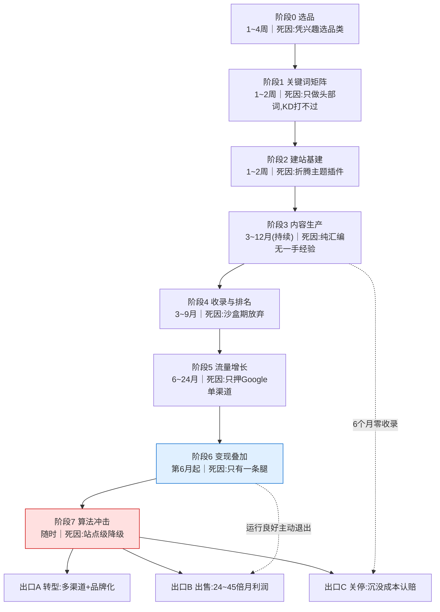
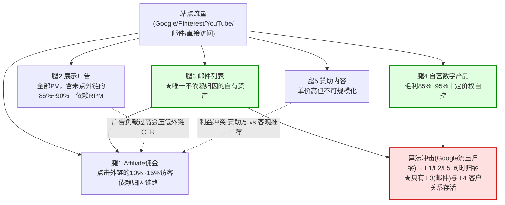

# Niche 站与内容站变现

> **一句话定位**：Niche 站（垂直内容站）是**用免费搜索流量换佣金与广告收入**的生意——它把「内容资产 → 搜索排名 → 高购买意图访客 → 多条变现腿」串成一条链路，是 Affiliate 六大流派里门槛最低、周期最长、**算法风险最集中**的一种。
>
> **核心结论先行**：内容站赚钱靠的**不是流量规模，而是品类选择 × 变现腿数量**。
> 同样 5 万月 UV，低客单品类月利润只有 **$125**（[`联盟角色与佣金模型.md`](./联盟角色与佣金模型.md) §8.2 的基准站），换成床垫类高客单品类是 **$986~$3,172**（本文**算例一** §2.6，**8~25 倍**）；
> 在同一个低客单站上叠加展示广告 + 邮件列表 + 自营数字产品 + 赞助内容，月利润可达 **$1,184~$3,272**（本文**算例二** §5.5，**约为纯 Affiliate 的 9.5~26 倍**）。
> 倍数之所以这么大，是因为**内容成本是五条腿共享的固定成本，而纯 Affiliate 基线本身已接近盈亏平衡**——新增变现腿的边际利润率接近 80%~95%。
> 而 2022 年起的 **HCU（Helpful Content Update）** 与 2024 年起的 **AI Overviews** 已经把"量产内容抢排名"这条老路基本堵死——
> 现在的可行打法是：**垂直深耕 + 一手经验 + 多渠道分发 + 多条变现腿 + 把站点当折旧资产经营**。
>
> **可信度标签**：`[标准]` 官方明文　`[政策]` 平台公开政策（标时点）　`[惯例]` 行业共识　`[推断]` 待验证推导
>
> 最后更新：2026-09-11

---

## 1. Niche 站完整生命周期

### 1.1 九个阶段的时间轴



### 1.2 各阶段：耗时、核心动作、失败率与主要死因

`[惯例]` + `[推断]`　失败率为**从业者共识的量级估计**，无权威调研支撑，只用于判断风险优先级，不可当数据引用。

| 阶段 | 典型耗时 | 核心动作 | 阶段失败率（量级） | 主要死因 | 可观测信号 |
|---|---|---|---|---|---|
| **0 选品** | 1~4 周 | 四维评分（§2.1）筛出 3~5 个候选，验证佣金计划是否存在 | **约 50%~70% 的站死于此处（事后归因）** | 凭个人兴趣选品类；品类无联盟计划；客单价过低 | 佣金率 <3% 且客单 <$50 → 直接淘汰 |
| **1 关键词** | 1~2 周 | 建 Commercial Investigation 词库（§2.2）、算 KD、排优先级 | 约 20%~30% | 只做头部大词（KD>60），新站根本排不上 | 词库里 Transactional/Informational 占比 >70% |
| **2 建站** | 1~2 周 | 域名、主机、CMS、站内链接结构（§2.3）、Schema、基础法务页 | <10% | 在主题与插件上耗掉两个月 | — |
| **3 内容生产** | 3~12 个月，且**永久持续** | 一手实测 + 深度长文 + 对比页 + 资源页 | 约 30%~50% | 产能不足（月更 1~2 篇撑不起词库）；纯汇编无 Experience | 发布 30 篇后仍零自然流量 |
| **4 收录与排名** | 3~9 个月（与 3 重叠） | 等 Google 建立站点信任、进沙盒期后爬升 | 约 40%~60%（**最大的单一淘汰点**） | 新域名信任期太长，人在第 5 个月放弃 | GSC 展示量长期 <1k/天 |
| **5 流量增长** | 6~24 个月 | 长尾扩张、内链优化、外链自然积累、Pinterest/YouTube/邮件分发 | 约 20%~30% | 只押 Google；流量到了但停留极短 | 自然流量占总流量 >90% |
| **6 变现叠加** | 第 6 个月起 | 广告网络准入、Offer 组合、Lead Magnet 建列表、自营产品 | 约 10%~20% | 只有 Affiliate 一条腿（算例二证明这条腿最薄） | Affiliate 占收入 >70% |
| **7 算法冲击** | **不可预测，几乎必然发生** | 内容审计、删/并/改低质页、补一手证据、分散渠道 | 约 40%~70% 的纯 SEO 站在某一轮更新中受显著影响 | **站点级**降级（§4.1），一篇垃圾内容拖累全站 | 更新日后 3~7 天流量断崖 |
| **8 出口** | — | 转型 / 出售 / 关停 | — | 想卖时才发现流量集中度是折价项（§7.3） | — |

### 1.3 三个被低估的时间事实

**① 回本周期以年计** `[惯例]`：阶段 0~5 是纯投入期，6~18 个月现金流通常为负或近零；用买量思维（当天投当天回）做内容站必然中途放弃。**② 内容资产有折旧** `[推断]`：流量曲线是"爬升 6~18 个月 → 平台期 1~3 年 → 衰减"（产品迭代、竞品更新、算法变化），它是**折旧资产**而非永续年金，与 [`联盟角色与佣金模型.md`](./联盟角色与佣金模型.md) §10 误解 4 对 Recurring Commission 的判断同构。**③ 阶段 7 不是意外，是常态** `[政策]`：Google 每年多次核心更新，2022—2024 另有 HCU / Reviews / Spam 专项更新；正确建模是"**流量是一个带周期性向下跳变风险的随机过程**"，而不是"排名会稳定"。

---

## 2. 选品与选关键词方法论（本篇核心之一）

### 2.1 Niche 四维评分：客单价 × 佣金率 × 搜索量 × 竞争度

`[推断]`　与 [`电商Affiliate与亚马逊联盟.md`](./电商Affiliate与亚马逊联盟.md) §8.1 的四维模型一致，本文给出**可打分的模板**（每维 1~5 分，加权求和，满分 5.0）：

| 维度 | 量化口径 | 1 分 | 3 分 | 5 分 | 权重 | 依据来源 |
|---|---|---|---|---|---|---|
| **① 客单价 AOV** | 品类均价 | <$50 | $150~$500 | >$500 | **30%** | 商家站商品页 |
| **② 有效佣金率** | 名义率 × 基数系数（佣金模型 §3.7） | <3% | 5%~10% | >15% 或含循环佣金 | **25%** | 联盟计划条款页 |
| **③ 搜索量** | 词库月总搜索量（仅 Commercial Investigation 部分） | <5k | 20k~80k | >80k | **20%** | 关键词工具 |
| **④ 竞争度（反向）** | KD 中位数 + SERP 构成 | KD>60 且首页全是 DR80+ | KD 30~50 | KD<30 且首页有论坛/小站 | **25%** | SERP 人工核查 |

**判读规则与一票否决** `[推断]`：

```
加权分 ≥4.0 → 优先做 ｜ 3.0~4.0 → 可做，但须"细分再细分"降 KD（mattress → mattress for RV
→ mattress for RV bunk bed）｜ <3.0 → 放弃，或只作已有站点的补充栏目

⚠️ 一票否决（命中即淘汰，不参与加权）：□ 找不到任何联盟计划，或佣金率 <2%
□ 属 YMYL 且你无任何资质与一手证据来源（§2.5）  □ 商品生命周期 <6 个月（内容还没排上去产品就换代）
□ SERP 首页被官方站 + 3 家以上大媒体 + Amazon 占据，无论坛/小站痕迹
```

**为什么客单价权重最高**：见算例一（§2.6）——客单价是唯一能带来**数量级**差异的变量，搜索量与 KD 的差异通常只在 2~5 倍量级。

### 2.2 关键词商业意图分层：为什么 Commercial Investigation 是命脉

**搜索意图**（Search Intent / Query Intent）：用户输入某个查询时**真正想完成的任务**。标准四分法：

| 层级 | English | 典型句式 | 用户心智状态 | CR 量级 `[惯例]` | 竞争度 | 对 Affiliate 的价值 |
|---|---|---|---|---|---|---|
| **信息型** | Informational | `how to` / `what is` / `why does` | **还不知道自己有需求** | 极低 | 中~高 | 只贡献流量与广告展示；**正被 AI 摘要大规模抽走**（§4.3） |
| **商业调查型** ★ | Commercial Investigation | `best X for Y` / `X vs Y` / `X review` / `is X worth it` / `X alternatives` | **已知需求，正在做选择** | 高（1%~8%） | **中**（低于 Transactional） | **命脉**：Affiliate 收入主来源 |
| **交易型** | Transactional | `buy X` / `X coupon` / `X discount code` | **已决定买**，在找价格入口 | 最高 | **极高**（品牌 SEM + 优惠券站 + Amazon 霸屏） | 抢不到；抢到也常被 Override（佣金模型 §4.4） |
| **导航型** | Navigational | `X login` / `X 官网` | 找特定站点 | — | 极高（品牌词） | 无价值；**投品牌词属违规**（Brand Bidding，见 [`联盟反作弊与扣量.md`](./联盟反作弊与扣量.md)） |

**为什么 Commercial Investigation 是命脉——三层论证** `[推断]`：**① 意图与竞争度错配（核心）**——Transactional 词转化最高，但 SERP 挤满品牌方 SEM、Amazon、优惠券站，新站没有胜算；Informational 词竞争低但转化为零；只有 Commercial Investigation 落在"**转化意图已形成、竞争尚未饱和**"的窗口里（品牌方通常不投 `best X for Y`，那是内容站地盘；优惠券站也看不上，用户还没到结账页）。**② 与内容站的价值主张天然匹配**——用户搜 `best X for Y` 的真实需求是"**帮我把选择成本降下来**"，这正是深度测评存在的理由；搜 `X coupon` 的用户只要折扣码，任何内容都无价值。**③ AI 摘要时代的差异化抗跌性**（2024 年后的新论证）——`how to` 类问题 AI 能直接给完整答案、用户不再点击，而 `best X for Y` 需要**真实使用体验与横向对比背书**，AI 给不出可信的一手结论（详见 §4.3.2）。

**词库推荐配比** `[惯例]`：**Commercial Investigation 50%~60%**（收入主力）＋ **Informational 30%~40%**（建主题权威、喂内链）＋ **Transactional 5%~10%**（只做自己已建立信任的品牌的 deals 页，不碰裸 coupon 词）。
**不要反过来**：先堆 100 篇 `how to` 再想变现是最常见的顺序错误——Informational 流量在 AI 摘要时代**折旧最快**。

### 2.3 主题集群与站内链接结构

**主题集群**（Topic Cluster / Pillar-Cluster Model）：以一篇覆盖面广的**支柱页**（Pillar Page，3,000~6,000 字，如 `best espresso machines` 完整选购指南）为中心，一组**子话题页**（Cluster Content，各 1,500~3,000 字：`best X under $500`、`X vs Y` 对比页、单品 review、`how to clean X`）通过**双向内链**与之互联，子话题之间也互相链接；再挂一层 Informational **支撑内容**（如"研磨度入门""常见萃取问题"）链向相关子话题页。整体向搜索引擎声明"本站在这个主题上有完整覆盖"。


**结构与规则** `[惯例]` + `[推断]`：**支柱页只做一篇**——每个集群一篇 Pillar，不写三篇 `best X` 互打，避免**关键词自相残杀**（Keyword Cannibalization：同站多页争一词，Google 只选一个且权重被稀释）；**锚文本要描述性**——用 `under-$500 espresso machines`，不用 `click here`（锚文本是站内相关性信号的主要载体）；**双向 + 横向链接**——Pillar↔Cluster、Cluster↔Cluster 都要有，单向链接会让 Cluster 页成为权重孤岛；**深度 ≤3 层**——首页→分类→文章，三次点击可达任意页（爬取预算 Crawl Budget 与权重传递）；**处理孤儿页**——定期清理无内链指向的页（补链/合并/删除），孤儿页在 HCU 内容审计里是**典型低价值信号**（§4.1.2）；**一个集群 20~60 篇**——<15 篇撑不起权威，>80 篇维护失控。

### 2.4 为什么"高客单价低频"品类更适合内容站

`[惯例]`　适合内容站的品类共性：**高客单 + 低频 + 高决策成本 + 需要横向对比**。（[`电商Affiliate与亚马逊联盟.md`](./电商Affiliate与亚马逊联盟.md) §8.2 已从"内容成本回收"角度论证过；§2.6 从"同流量不同品类"再推一遍。）

| 品类 | AOV 量级 | 有效佣金率量级 | 决策周期 | 为什么适合 | 主要风险 |
|---|---|---|---|---|---|
| **床垫 / 寝具** | $500~$3,000 | 5%~15%（部分品牌历史给固定 $100~$300/单） | 数周~数月 | 极高客单 + 高毛利品牌愿付高佣 + `best mattress for X` 词库极深 | 耐用品无复购；品牌 DTC 政策变动 |
| **家电 / 厨房设备** | $200~$3,000 | 2%~8% | 数天~数周 | 客单高、有明确对比需求 | Amazon 类目费率低（1%~4.5%） |
| **乐器 / 音频设备** | $150~$5,000 | 3%~10% | 数周 | 高客单 + 强爱好者社区 + 长尾词丰富 | 受众规模有天花板 |
| **办公设备 / 人体工学椅** | $200~$2,000 | 4%~12% | 数天~数周 | B2B/B2C 混合，客单高，流量稳定 | 复购弱 |
| **B2B 软件 / SaaS** | 订阅制 | **20%~50%，常含循环佣金** | 数周~数月 | **循环佣金 → 资产型收入**，估值倍数高（§7.1） | 付费转化才是真收益，试用注册虚高 |
| **旅游** | $200~$2,000 | 3%~8% | 数周~数月 | 客单高、词库巨大、季节性可做内容日历 | **Cookie 窗口是命门**（μ≈20 天时 30 天窗口只捕获约 78%，佣金模型 §4.3） |
| **金融 / 保险** | 线索 $5~$500/条 | CPL/CPA | 数周~数月 | 派款极高 | **YMYL 门槛最高 + 合规最严**（§2.5） |

**反面（不适合）** `[惯例]`：低价快消（AOV <$30）、时尚快消（退货率高 + 尺码 + 强季节性）、纯 Amazon 独占的低率标品、生命周期 <6 个月的消费电子。

### 2.5 YMYL 品类的特殊门槛

**YMYL**（Your Money or Your Life，直译"你的钱或你的命"）：Google《搜索质量评估指南》（*Search Quality Rater Guidelines*，公开的评估员手册，**非排名算法文档**）中的分类，指**内容出错可能对读者的健康、财务安全、人身安全造成实质伤害**的主题——医疗健康、金融投资、保险、法律、房产、就业、新闻时事、重大购物决策等。

| 维度 | 普通品类 | YMYL 品类 |
|---|---|---|
| 质量门槛 | 内容有用即可 | **需 E-E-A-T 的强证据**（§3.2），尤其 Authoritativeness 与 Trust |
| 作者要求 | 可匿名/笔名 | 通常需**真实署名 + 可核查资质**（医生、持证理财规划师、律师） |
| 证据要求 | 二手汇编可接受 | 需**一手证据**：实测数据、原始文献、官方文件链接 |
| 外链要求 / 排名波动 | 少量即可 / 中 | 需**权威站点引用/背书** / **核心更新时波动显著更大** `[惯例]` |
| 违规后果 | 排名下降 | 可能触发**站点级**质量降级，恢复极慢 |

`[政策]`　**时点：2026-09。** Google 在 *Search Quality Rater Guidelines* 与 *Creating helpful, reliable, people-first content* 帮助文档中明确 YMYL 适用更高信任标准；同时反复声明**评估员手册不是排名算法**，其作用是"标定质量方向"。引用时不要把 SQEG 当成算法规则原文。

**实操结论** `[推断]`：没有真实资质的团队**不要碰健康与金融类 Niche 站**——这不是"努力就能补上"的差距，而是结构性劣势。可做的是"金融工具类"（记账 App、信用卡信息比较）而非"投资建议类"。

### 2.6 算例一：品类杠杆——同流量、不同客单价

`[推断]`　**基准**：完全沿用 [`联盟角色与佣金模型.md`](./联盟角色与佣金模型.md) §8.2 的那个站（5 万月 UV、AOV $60、佣金率 8% → **月利润 $125**）。现在**只改品类**，其余假设不动。

**假设表（床垫类）**：

| 参数 | §8.2 基准 | 床垫品类 | 变化来源 | 参数 | §8.2 基准 | 床垫品类 | 变化来源 |
|---|---|---|---|---|---|---|---|
| 月 UV | 50,000 | 50,000 | **不变**（关键控制变量） | 客单价 AOV | $60 | **$600** | 品类 |
| 外链点击率 / 点击数 | 12% / 6,000 | 12% / 6,000 | 不变 | 佣金基数扣除 | 8% | 8% | 不变 |
| 商家转化率 CR | 3% | **1.5%** | **下调**：高客单决策周期长、30 天窗口捕获率下降 | 佣金率 | 8% | **10%** | 床垫类品牌自营计划量级 |
| 通过率 / 网络抽成 | 88% / 25% | 88% / 25% | 不变 | 月成本 | $400 | **$1,200** | **上调**：一手实测样品摊销 $600 + 摄影图表 $200 |

**逐步计算**：

```
① 订单数     = 6,000 clicks × 1.5% = 90 orders
② 佣金基数   = $600 × (1 − 8%) = $552.00      ③ 应付佣金 = $552.00 × 10% = $55.20
④ 通过审核后 = $55.20 × 88% = $48.58          ⑤ 扣网络抽成 = $48.58 × 75% = $36.43/order
⑥ 月收入 = 90 × $36.43 = $3,279  ⑦ 月成本 = $1,200  ⑧ 月利润 = $2,079 → 基准 $125 的 16.6 倍
单笔有效佣金率 = $36.43 / $600 = 6.07% of GMV（标称 10%，五道漏损吃掉 3.93 个百分点
                                              —— 与佣金模型 §8.0 瀑布完全一致）
```

**敏感性（只动 CR，其余不变）**：CR 1.0% → 60 单 → 收入 $2,186 → **利润 $986（7.9 倍）**；**CR 1.5%（主算例）→ 90 单 → $3,279 → 利润 $2,079（16.6 倍）**；CR 2.0% → 120 单 → $4,372 → **利润 $3,172（25.4 倍）**；CR 3.0%（机械沿用 §8.2 全部假设、成本也沿用 $400）→ 180 单 → $6,558 → **利润 $6,158（49.3 倍）**。

**结论**：

> **在流量规模完全相同的前提下，只把客单价从 $60 换到 $600、佣金率从 8% 换到 10%，月利润从 $125 变成 $986~$3,172（保守区间），即 8~25 倍**——即使把成本提高 3 倍（$400 → $1,200，因为一手实测更贵），杠杆依然是数量级的。
> **所以"品类选择比流量规模更重要"不是口号，是算出来的**：把流量从 5 万做到 50 万（10 倍投入 + 12~24 个月 + 承担全部算法风险），利润从 $125 到约 $1,250；而换一个品类（0 额外流量投入），利润已到 $986~$3,172。**后者的投入产出比高一个数量级。**

⚠️ **必须说清的两个前提**（否则这个算例会被误用）：
① 高客单品类的 **CR 一定低于低客单**，上表已用 1.5% 而非 3% 反映这一点；若沿用 3% 会严重高估。
② 高客单品类的**内容成本更高**（必须真买真用），已在成本里加了 $800；如果省掉这笔钱去做汇编，就会撞上 §4 的算法风险。

---

## 3. 内容生产与规模化

### 3.1 内容成本结构

`[惯例]`　**时点：2026-09。以下为量级区间，非报价单。** 英文内容外包单价受语言、品类专业度、字数、是否含一手素材影响极大，同档内部差 3~5 倍是常态。

| 内容类型 | 字数 | 外包单价（英文） | 自产耗时 | 质量风险 | 适用 |
|---|---|---|---|---|---|
| **纯汇编长文**（无一手素材） | 1,500~2,500 | **$30~$120/篇** | 4~8 h | **高**：HCU 主要打击对象 | 已基本不建议 |
| **带原创结构与图表的深度文** | 2,500~4,000 | **$100~$400/篇** | 8~20 h | 中 | Informational 支柱页 |
| **专家撰写（署名 + 资质）** | 2,000~3,500 | **$250~$1,000+/篇** | — | 低 | **YMYL 必需** |
| **一手实测评**（真买真用 + 实拍） | 2,000~4,000 | **$300~$800/篇 + 商品成本** | 20~60 h（含使用周期） | **最低** | Commercial Investigation 主力 |
| **对比页（X vs Y）** / **非英语本地化**（德/法/西/日） | 1,500~3,000 | **$150~$500/篇**；本地化为英文价的 **1.2~2.5 倍** | 6~15 h | 中 | 对比页是转化最高的页型之一；本地化用于多语言扩张 |

**隐性成本（新手最常漏算）** `[惯例]`：商品采购与仓储、摄影与图表、事实核查、**旧内容更新（每年约需新内容预算的 30%~50%** `[推断]`**）**、SEO 工具订阅（关键词 + 排名追踪 + 站点审计，月费量级 $100~$500）、CMS/主机/CDN、编辑与项目管理人力。

**自产 vs 外包** `[推断]`：

| 维度 | 自产 | 外包 |
|---|---|---|
| 一手经验（Experience） | **可以有** | 通常没有（写手没碰过产品）→ 只能汇编 |
| 观点与判断 | 有立场，敢下结论 | 倾向"各有优劣"的和稀泥写法 |
| 单位成本 / 月产能 | 高 / **差（2~6 篇，受个人时间硬约束）** | 低 / 好（20~60 篇） |
| HCU 与 AI 摘要抗性 | **强** | **弱** |
| 可迁移性（卖站时） | 弱（关键人依赖，§7.3） | 强（有 SOP 就能换人） |

**结论**：最优解是**混合模式**——核心 Commercial Investigation 页自产（含一手实测），Informational 支撑页外包。它与"关键人依赖"的估值折价冲突，需靠 SOP 文档化补偿。

### 3.2 E-E-A-T 四要素怎么落地

**E-E-A-T**（Experience, Expertise, Authoritativeness, Trustworthiness；中文常译"经验、专业、权威、可信"）：Google《搜索质量评估指南》中判断内容质量的四个维度。**2022 年 12 月 Google 在原有 E-A-T 前新增了第一个 E（Experience）**——这是理解近年内容站打法变化的关键信号。

`[政策]`　**时点：2026-09。** 出自 Google *Search Quality Rater Guidelines* 与 *Creating helpful, reliable, people-first content*。Google 明确它是**质量评估框架而非某个具体排名因子**——不存在"E-E-A-T 分数"，它通过一系列可观测信号间接影响排名。

| 要素 | English | 含义 | 落地信号（可核查） | 常见假动作 |
|---|---|---|---|---|
| **经验** ★ | Experience | 作者**是否真的用过/做过** | 实拍照片视频（含环境细节）、自测数据表、使用时长声明、失败案例与缺点、自购声明 | 图库图冒充实拍；写"经我们测试"但无数据 |
| **专业** | Expertise | 领域知识与技能 | 真实署名 + 作者页（资质、履历、外部可核查身份）、术语准确、方法论说明 | 编造头衔；作者页只有头像 |
| **权威** | Authoritativeness | **站点与作者被外部认可**的程度 | 高质量外链与引用、行业媒体/论坛提及、作者在其他平台的可见身份、**品牌搜索量** | 买链接（违规且易识别）；站群互链 |
| **可信** ★ | Trustworthiness | **最核心的一项**，Google 明确 Trust 是 E-E-A-T 的中心 | 联系方式与实体信息、隐私政策、**明确的联盟关系披露**（FTC，见 [`落地页与转化漏斗设计.md`](./落地页与转化漏斗设计.md) §8.1）、可核查引用、无夸大宣称、HTTPS | 隐藏联盟关系；"科学证明"但无出处 |

**为什么 Experience 在 2022 年后权重上升** `[推断]` + `[政策]`：**① 它是 AI/汇编内容最难伪造的维度**——流畅度、结构、事实覆盖度都能规模化生产，但"照片里的桌面划痕""连用 30 天后塑料件的味道""第 3 周固件更新后噪音变大"只能来自真实使用；Google 加这个维度，客观上把**可自动化的内容**与**需要真实投入的内容**分开了。**② 它对应 Reviews System 的判定逻辑**——`[政策]` Google 的**评论系统**（Reviews System，2021 年 9 月上线，2023 年 2/4/9 月多轮更新，**2024 年 3 月并入核心系统**）公开要求评论包含：从使用中获得的见解、产品实际外观的原创图片、可验证的性能数据、与竞品的量化对比、优缺点说明、多个购买渠道选项。**③ 它与用户满意度信号闭环**——有一手经验的内容，跳出率与"返回 SERP 重新搜索"（pogo-sticking）比例更低。

### 3.3 原创实测 vs 汇编：成本结构与收益差异

`[推断]`　同一篇 `best X for Y` 的两种做法：

| 维度 | 汇编型 | 一手实测型 | 维度 | 汇编型 | 一手实测型 |
|---|---|---|---|---|---|
| 单篇现金成本 | $30~$120 | $300~$800 + 商品 | HCU 抗性 | **弱**（站点级降级高风险） | **强** |
| 单篇时间成本 | 4~10 h | 20~60 h（含使用周期，不可压缩） | AI 摘要抗性 | **弱** | **强** |
| 月产能上限 | 20~60 篇 | **2~6 篇** | 外链获取 | 难 | **易**（数据与图片可被引用） |
| 短期流量 | 可能很快起量 | 慢 | 品牌搜索量 | 近零 | 会积累 |
| 转化率 | 低（感觉不到判断力） | **高**（敢下结论、有数据、披露缺点） | 3 年后资产价值 | 接近零（可能已死） | 可出售（§7） |

**结论** `[推断]`：**汇编型在 2022 年前是主流，2024 年后基本失效。** 它的问题不只是"质量低"，而是**成本结构错了**——它把内容站当成"低成本换大规模覆盖"的买量生意，而内容站的护城河恰恰是**不可规模化的那部分投入**。

### 3.4 AI 生成内容：官方口径、政策边界与死亡机制

这是 2023 年后最被误读的问题。**Google 的立场不是"反对 AI 内容"，而是"反对为搜索引擎规模化生产的低质内容"**——两句话必须同时成立。

`[政策]`　**时点：2026-09。** 均为 Google 官方公开发布，需以当期文档复核：

| 时间 | 官方动作 | 核心表述 |
|---|---|---|
| **2023 年 2 月** | *Google Search's guidance about AI-generated content* | **"奖励高质量内容，不论它是如何生产的"**（rewards high-quality content, however it is produced）；同时明确**用自动化生成内容以操纵搜索排名**违反垃圾内容政策 |
| **2024 年 3 月** | **2024 年 3 月核心更新** + **垃圾内容政策修订** | 新增/重写三条政策：**规模化内容滥用（Scaled Content Abuse）**、**站点声誉滥用（Site Reputation Abuse）**、**过期域名劫持（Expired Domain Abuse）**；Google 当时公开表示目标是**减少搜索中的低质、无原创性内容约 40%**（该目标数字为 Google 官方博客表述） |
| 2024—2026 | 多轮核心更新与垃圾内容更新 | 继续针对上述三类滥用；HCU 的站点级信号**并入核心排名系统**（§4.1） |

**边界在哪** `[政策]` + `[推断]`：Google 对 Scaled Content Abuse 的定义要点是——**为提高排名而非为用户，生成许多页面**，且明确说明"**无论内容是否原创、是否 AI 生成、是否高质量**"都可能构成滥用；判定关注的是**是否有原创价值、是否为用户而做、是否只是把多个来源拼在一起而无附加价值**。由此推出可操作的边界（`[推断]`，非官方清单）：

**通常安全**：AI 起草 + 人工补一手数据/实测/观点、逐篇把关、服务真实用户需求——**生产方式不是判据，目的与附加价值才是**。
**高风险**：AI 批量生成数百篇覆盖长尾词的页面且无人工实质增补（直接命中定义）；重新组合多来源信息、无新增判断、量产（官方明示"拼接多来源而无附加价值"属滥用）；单篇尚可但站点存在大量重复/模板化页面（**站点级**判定看全站分布，§4.1.1）；AI 生成 + 虚假作者身份 + 编造 Testimonial（同时触碰 FTC 披露与 Testimonial 真实性，见 [`落地页与转化漏斗设计.md`](./落地页与转化漏斗设计.md) §8.4）。

**纯 AI 量产站为什么大批死亡——四条机制** `[惯例]` + `[推断]`：**① 站点级判定的放大效应**——低质内容在页面级惩罚下只损失自己，在站点级分类器下会**拉低全站评分**（§4.1.1），而量产站低质比例天然高，受损是全站性的。**② 同质化 → 相对排序必然失败**——核心更新本质是**零和重排**；几千个站用同一批模型、同一批 SERP 数据、相似 prompt 结构生产内容时**彼此没有区分度**，Google 只能靠外部信号（外链、品牌搜索、行为数据）裁决，而这恰是量产站最弱的。**③ 零 E-E-A-T 信号**——无真实作者、无一手经验、无外部背书、无品牌搜索量，YMYL 上几乎不可能排名。**④ 经济学上本来就不成立**——这类站的典型变现是展示广告，而 RPM 依赖**停留时长与浏览深度**；低质内容跳出率高 → RPM 低 → 收入覆盖不了域名/主机/代理/内容成本，与 [`../10_广告套利Arbitrage/`](../10_广告套利Arbitrage/) 中 MFA（Made For AdSense）站的困境同类。

> **红线声明**：本文不提供任何提高 AI 量产站存活率的方法、规避 Google 检测的技巧，或站群/寄生 SEO 的操作方案。上述内容仅用于**识别风险与理解机制**。

---

## 4. Google 算法更新的冲击（本篇最重要的一章）

> **Niche 站的收入 = f(Google 的排序决定)**，而这个函数在 2022—2025 年间发生了三次结构性变化。不理解这三次变化，任何"选品方法论""内容 SOP"都是在一个已经消失的前提下做优化。

### 4.1 HCU：Helpful Content Update 的机制

**HCU**（Helpful Content Update，中文常译"有用内容更新"）：Google 于 **2022 年 8 月**首次推出的专项更新，核心是引入一个**机器学习分类器**，识别"看起来是为了搜索引擎而不是为了人做的内容"并在排名中降权。

`[政策]`　**时点：2026-09。** 时间线与官方口径：

| 时间 | 事件 | 官方口径要点 |
|---|---|---|
| **2022 年 8 月** | 首次 HCU 上线（先英语、后全球） | 引入新的**站点级信号**（site-wide signal）；配套文档 *Google Search's guidance about helpful content* |
| **2022 年 12 月** | 第二次 HCU，扩展至全球所有语言，调整模型并新增信号 | 明确该信号"对站点整体评估"，且**改进是渐进的，可能需要数月** |
| **2023 年 9 月** | Helpful Content Update（与同期核心更新叠加） | 进一步收紧；同期 Google 修改文档，**弱化"people-first vs for search engines"的二元表述** |
| **2024 年 3 月** | **2024 年 3 月核心更新** | 宣布 **helpful content system 的信号并入核心排名系统**，不再作为独立分类器运行；帮助文档改写为 *Creating helpful, reliable, people-first content* |

#### 4.1.1 为什么它是**站点级**而不是页面级——全章最关键的一点

`[政策]`　Google 在 2022—2023 年官方文档中明确说明：该分类器对**整个站点**做评估，而不是逐页独立打分。

```
【页面级惩罚】（HCU 不是这个）低质页 A → 只有 A 掉排名；高质页 B 不受影响
   → 站长最优策略：多产页面，赌其中有几篇能排上去（"撒网式"）
【站点级分类器】（HCU 是这个）分类器观察全站内容分布 → 判定"多大比例的内容对用户无附加价值"
   → 超阈值则站点被打上负向标签 → 作用于全站所有页面，包括真正高质量的页面
   → 站长最优策略：删除/合并低质页，提高全站平均质量
```

**三条推论** `[推断]`：**① 一篇垃圾内容能拖累全站**——这在页面级体系下不成立，在站点级体系下成立，所以"多写总是好的"这个直觉**从 2022 年 8 月起就错了**，多写的边际收益可能为负。**② 删除是有正收益的动作**——Google 官方文档曾明确写道"移除无帮助的内容可能有助于其余内容的表现"，因此**内容审计（Content Pruning）从可选动作变成必需动作**，建议每季度一次 `[惯例]`。**③ 恢复缓慢且不确定**——Google 说明该信号"改进需要数月才能显现"，**不存在快速修复**；很多站长在等待 6~12 个月后放弃，这是 §1.1 出口 C 的主要成因。

#### 4.1.2 被判定为"为搜索引擎而做"的可观测特征

`[政策]` + `[惯例]`　源自 Google 官方自问清单与从业者观察，可观测的负向特征及其自查方法：**大量页面覆盖极窄长尾词且内容彼此高度雷同**（典型"为关键词而写"→ 抽 10 篇同集群文章做去重比对）；**汇编他人内容、无自己的判断/数据/结论**（2024 spam policy 明示的"无原创价值"→ 自问"删掉我的站，用户的信息会少什么？"）；**写自己并不了解的领域**（缺 Expertise，YMYL 上致命 → 作者页能否通过外部核查）；**大量页面答非所问、绕圈不解决实际问题**（直接的用户不满意信号 → 看 GSC 里高展示低点击/高跳出页）；**为追热点批量生产、与本站主题无关**（主题漂移削弱权威性）；**AI 批量生成无实质人工增补**（命中 Scaled Content Abuse §3.4 → 抽样检查一手素材）；**明确的字数目标驱动**（"每篇必须 2,000 字"，Google 文档点名批评 → 检查内容 SOP）；**大量孤儿页 / 无内链页**（内容不被使用的信号 → 站点审计工具）。

> **重要澄清** `[政策]`：Google 明确说过，**存在联盟链接本身不是负面信号**。被判定的原因是"内容质量与目的"，不是"有没有赚钱"。所以"做 Affiliate 就一定被 HCU 打"是错的——真正被打的是"**没有为用户创造独立价值的 Affiliate 内容**"。

#### 4.1.3 恢复路径（认知向，非操作技巧）

`[惯例]` + `[推断]`　按有效性排序，**都是内容层面的实质动作，不存在技术层面的"修复"**：**① 内容审计 + 删除/合并**——把无流量、无外链、无附加价值的页删掉或 301 合并到支柱页（3~9 个月见效；Google 官方指向的方向，**删掉 50%~70% 页面是常见幅度**）；**② 给保留的核心页补一手证据**——实测数据、原创图片、作者资质、失败案例（3~12 个月；直接对应 Experience §3.2）；**③ 补真实作者身份与实体信息**（1~6 个月，对应 Trust）；**④ 停止新页面量产，转为更新旧页**（持续，提高全站平均质量的分母）；**⑤ 降低对 Google 的依赖**（6~18 个月，**唯一真正治本的一条**，见 §4.5）。

**不要做的事** `[惯例]`：不要指望"提交重新审核请求"（Reconsideration Request）——那是**人工处罚**（Manual Action）才有的通道，算法降级不适用，GSC 里也不会显示任何通知。这是站长最常见的认知错误（§10 误解 8）。

### 4.2 2023—2024 多轮更新与纯 Affiliate 站的大规模流量归零

`[政策]` + `[惯例]`　**时点：2026-09。** **这是行业事实，但本文不列具体站点名与具体流量数字**——原因：① 站点收入数据基本不可核实，流传数字多为自述或截图；② 站点买卖频繁，同一域名前后是不同运营者；③ 引用二手案例会传播无法验证的精确数字。下面只讲**机制与量级**。

**更新密度（理解冲击规模的前提）**：**2023 年**——2 月 Product Reviews Update、3 月核心更新、**4 月 Reviews Update + Helpful Content Update**、8 月核心更新、**9 月 Helpful Content Update**、10 月核心更新 + Spam Update、11 月核心更新。**2024 年**——**3 月核心更新（历时约 45 天，异常长）**+ Spam Update、**8 月核心更新**、11 月核心更新、12 月核心更新。**2025—2026 年**——多轮核心更新与垃圾内容更新（**清单需查当期 Google Search Status Dashboard**）。

`[政策]`　Google 自 2023 年起把更新公告集中在 **Search Status Dashboard**，且**不再为每次核心更新单独发博客长文**——这本身就是信号：更新已从"事件"变成"常态运维"。从业者直接感受 `[惯例]`：**一年 4~6 次排名重排，其中 1~2 次幅度足以改变一个站的盈亏**。

#### 4.2.1 为什么"纯 Affiliate 站"受损最重——五条机制

`[推断]`（机制推演，不引用具体案例）：**① 商业模式与 HCU 判定标准正面冲突**——纯 Affiliate 站的内容目的就是"引导用户点击外链"，这需要**独立于联盟关系的用户价值**来证明合法性，而它恰恰缺这个。**② 站点级判定 + 高量产 = 最坏组合**——典型打法是"最低成本覆盖最多长尾词"（§3.3），低质页占比天然高，站点级分类器下**全站一起沉**。**③ Reviews System 叠加打击**——`[政策]` 其要求（一手见解、原创图片、可验证数据、量化对比、优缺点、多购买渠道）几乎是一份**"汇编型测评不合格清单"**。**④ 竞争格局变化：大媒体与品牌方入场**——核心更新是零和重排，提高 E-E-A-T 门槛后受益方是**已有权威度的大媒体**（Wirecutter 模式）与**品牌自营内容**，受损方是无权威积累的小站；这不是"惩罚"，是**相对排序的自然结果**。**⑤ AI 摘要的第二重打击**（§4.3）——即使排名没掉，点击也没了。

#### 4.2.2 受损量级（只给量级，不给精确值）

`[惯例]` + `[推断]`　**以下为从业者社区共识的量级描述，无一手调研支撑，仅作方向性参考：**

| 站点类型 | 单轮重大更新中的自然流量变化量级 | 恢复概率 |
|---|---|---|
| **纯汇编型 Affiliate 站 / AI 量产站** | 大幅下降，**常见"归零级"**（跌去 80%~100%） | **低**（多数不恢复） |
| 有少量一手内容但比例不高的站 | 中度下降（30%~70%） | 中（需 §4.1.3 的实质动作） |
| 垂直深耕 + 一手实测 + 真实作者的站 | 小幅波动，部分反而上升（10%~30%） | 高 |
| 品牌站 / 有稳定品牌搜索量的站 | 波动小 | 高 |
| YMYL 品类的小站 | **波动显著大于非 YMYL** | 低~中 |

> **方法论提醒**：这类"受损比例"数据被广泛引用但**几乎全部无一手来源**——来自站长论坛自述与 SEO 工具的样本监测（样本偏差极大：工具监测的站点集合本身就是 SEO 从业者，不代表全站分布）。**不要把区间中值当事实。**
> **行业的真实反应** `[惯例]`（趋势判断，非统计数据）：① 站点交易市场供给增加、价格分化；② **"多站点组合"取代"单站做大"**；③ 流量来源多元化从"建议"变成"必需"；④ **变现腿从"联盟为主"转向"广告 + 自有产品为主"**——因为联盟收入对排名的敏感度最高（§5）。

### 4.3 AI Overviews / AI Mode：信息类查询流量被抽走

**AI Overviews**（AI 概览，曾名 SGE / Search Generative Experience）：Google 在搜索结果页顶部生成的 AI 摘要区块，直接给出综合答案并附来源链接。
**AI Mode**（AI 模式）：搜索中的对话式检索入口，用户可多轮追问，**部分场景下全程不访问任何外部网站**。

`[政策]`　**时点：2026-09。** AI Overviews 于 **2024 年 5 月**（Google I/O）面向美国全量推出，随后扩展至更多国家与语言，Google 公开披露过用户规模已达十亿量级；**AI Mode** 于 2025 年在美国等地逐步开放。**覆盖范围、触发比例与产品形态变动频繁，务必以当期官方页面为准。**

#### 4.3.1 冲击机制：为什么它比核心更新更难应对

`[推断]`　核心更新改变的是"**你排在第几**"，AI Overviews 改变的是"**用户还需不需要点进来**"。后者更根本。

```
【2023 年以前】用户搜 "how to X" → SERP 10 条蓝色链接 → 点击 1~3 个站点
                → 站点获得 PV → 广告展示 + 内链导流 + 邮件订阅        ✅ 可变现
【AI Overviews / AI Mode 之后】用户搜 "how to X" → SERP 顶部 AI 摘要直接给完整答案
   ├─ 多数：不需要点进去 → ❌ 站点零 PV，流量被"零点击"吸收
   └─ 少数：需要细节/证据 → ✅ 点击 AI 摘要引用的来源（CTR 远低于过去的自然位）
```

**四条结论** `[推断]`：**① 零点击搜索（Zero-click Search）比例上升是结构性的**，不是周期性的，不会因为"下一轮更新"回退。**② Informational 关键词的资产价值系统性下降**——还能建立主题权威，但**很难再产生可变现的 PV**。**③ "被 AI 摘要引用"成了新入口**，但引用规则不透明、不稳定，且 CTR 远低于过去的自然排名位，属**不可控变量**，不应作为商业计划基础。**④ 信息型流量的 RPM 也在下降**——即使有点击，AI 摘要已满足大部分需求 → 停留更短、PV 更少 → 展示广告收入下降，这是 §5.2 广告腿的隐性风险。

#### 4.3.2 为什么 Commercial Investigation 类相对抗跌

`[推断]`　§2.2 结论在 AI 时代的强化版：

**① 购买决策需要"人的背书"**——`best X for Y` 的用户要的不是信息汇总，而是"**有人真的用过并且敢推荐**"；AI 能列产品与参数，给不出可信的个人判断与责任承担。**② 需要视觉证据**——尺寸、质感、实拍对比、安装过程、长期使用磨损，必须点进页面看图/视频。**③ 需要结构化横向对比**——对比表格、评分卡、"什么人该买 A / 什么人该买 B"，在摘要里被压缩后失去决策价值。**④ 合规责任**——AI 摘要在给出具体购买建议上更保守（尤其 YMYL），倾向把用户导向来源站点。

**抗跌的边界（必须说清）** `[推断]`：抗跌 ≠ 免疫。**AI Mode 的多轮对话能力正向"帮我选一个"扩展**，长期会侵蚀一部分 Commercial Investigation 查询；抗跌的前提是**你的内容真有 AI 给不出的东西**（一手数据、原创图片、明确立场）；且**转化路径在变**——用户可能先在 AI 摘要初筛，再直接搜"品牌名 + review"，这意味着**品牌词长尾价值上升、泛品类词价值下降**。

#### 4.3.3 量级参考（务必谨慎引用）

`[惯例]`　**明确声明：以下区间无一手来源，仅作量级参考。** 2024—2026 年间多家第三方 SEO 工具厂商与出版商协会发布过相关研究，**结论差异极大**（触发率、查询类型、地区、行业各不相同），且多数方法论不透明（样本来自工具自身监测的站点集合）。

可稳妥表述的方向性结论：① 触发 AI Overviews 的查询，**自然点击率下降幅度为两位数百分比量级**，且**信息型下降显著大于商业型**；② 部分信息型为主的站点，流量下降幅度**超过其排名位变化所能解释的程度**——这是"零点击"效应的直接证据；③ 行业差异极大，**健康、教育、百科类受冲击最明显；本地服务、电商、评测类相对较轻**。**不要引用任何精确百分比**，除非能指向一份可核查的一手研究（含样本量、时间窗、查询分类方法）；行业流传的"-40%""-60%"这类数字，**绝大多数无法追溯到原始研究**。

### 4.4 2024 年 3 月新政：三条与内容站直接相关的垃圾内容政策

`[政策]`　**时点：2026-09。** 只做认知描述，不提供任何规避方法。

| 政策 | English | 官方定义要点 | 对内容站的含义 | 执法时点 |
|---|---|---|---|---|
| **规模化内容滥用** | Scaled Content Abuse | 为操纵排名而非帮助用户，生成许多页面；**不论是否原创、是否 AI 生成**；含把多来源拼接而无附加价值 | 直接终结"量产长尾页"打法（§3.4） | 2024 年 3 月公布 |
| **站点声誉滥用** | Site Reputation Abuse（俗称寄生 SEO） | 第三方内容**借用宿主站点的排名信号**发布，宿主缺乏密切监督，目的是利用宿主声誉获利 | 影响"在大媒体上发 sponsored 内容蹭排名"；也影响大媒体的 coupon/deals 子目录 | 2024 年 5 月起 |
| **过期域名劫持** | Expired Domain Abuse | 购买过期域名并重新利用其搜索信号，发布低质内容以获取排名优势 | **直接影响买老站的尽调**（§7.3、§10 误解 7）：域名的历史外链可能因前任内容**变成负债而非资产** | 2024 年 5 月起 |

### 4.5 结论性判断与转型路径

> **Niche 站的打法已经从「量产内容抢排名」转向「垂直深耕 + 一手经验 + 多渠道分发 + 多条变现腿」。** `[推断]`
> 这不是一个"更好的策略"，而是**旧策略的前提条件（Google 愿意为长尾汇编内容分配排名）已经不存在**。

#### 4.5.1 旧范式 vs 新范式

| 维度 | 旧范式（~2022 前） | 新范式（2024 后） | 维度 | 旧范式 | 新范式 |
|---|---|---|---|---|---|
| 核心资产 | 域名 + 页面数量 + 外链 | **一手经验库 + 真实作者身份 + 邮件列表 + 多平台账号** | 变现 | Affiliate 为主 | **广告 + 自有产品 + Affiliate + 邮件**（§5） |
| 内容策略 | 覆盖尽可能多的长尾词 | **深耕一个窄主题，做到第一手权威** | 关键词重心 | Informational 铺量 | **Commercial Investigation 为主**（§2.2） |
| 产量 | 越高越好（月产 30~100 篇） | **少而重**（月产 2~8 篇，每篇有一手素材） | 内容维护 | 只写新文 | **每年 30%~50% 预算更新旧文** `[推断]` |
| 流量来源 | Google 自然搜索 >90% | **Google 占比目标 <50%~60%** `[惯例]` | 站点数量 | 单站做大 | 组合分散（但每站都要达标） |
| 时间预期 | 6~12 个月见效 | **12~24 个月见效，且需持续投入** | 退出 | 长期持有 | **当折旧资产，规划退出**（§7） |

#### 4.5.2 具体转型路径（六步，按顺序做）

`[惯例]` + `[推断]`

| 步骤 | 动作 | 周期 | 判据（做完了的标准） |
|---|---|---|---|
| **① 内容审计** | 用 GSC + 审计工具把全站页面分四类：核心资产 / 可改进 / 可合并 / 应删除 | 2~4 周 | 每页都有归类；"应删除"占比通常 30%~60% |
| **② 收缩加固** | 删除或 301 合并"应删除"页；给"可改进"页补一手素材与作者信息 | 1~3 个月 | 页面总数下降但**主题密度上升**；保留页都有原创图片或数据 |
| **③ 收窄主题** | 从"N 个不相关品类"收到"1 个品类 + 2~3 个强相关子主题" | 1~2 个月 | 站点主题能被一句话说清 |
| **④ 建不可复制的资产** | 真实作者身份与作者页；**自建测试方法论并公开**；积累实测数据库；注册品牌/商标 | 3~12 个月 | 有人开始**直接搜你的站名**（品牌搜索量 >0） |
| **⑤ 多渠道分发** | 邮件列表、Pinterest（视觉品类）、YouTube（测评视频，**素材可与站内复用**）、行业社群 | 6~18 个月 | Google 自然流量占比 <60% |
| **⑥ 叠加变现腿** | 广告网络准入（§5.2）→ 自营数字产品（§5.3）→ 赞助内容（§5.4） | 与 ⑤ 并行 | 单一变现腿占收入 <50% |

> **对"新站"的含义** `[推断]`：从零开始则**跳过 ①②，直接从 ③ 开始**。2026 年新建 Niche 站的关键决策是"**主题够不够窄、你能不能提供一手经验**"——一个"你做不到的品类"即使 KD 很低也不该做，因为 E-E-A-T 的 Experience 维度补不上。

### 4.6 算法波动下的经营决策规则

`[推断]` + `[惯例]`　既然更新是常态（一年 4~6 次重排），经营上必须**预设为常态而设计**，而不是"出事再应对"：

**① 先分清是哪一类下降**——排查顺序必须是：**技术问题**（服务器宕机、robots.txt 误配、canonical 错误、站点被黑、Core Web Vitals 崩了 → 这类可修且应立刻修）→ **季节性**（与去年同期曲线对齐）→ **人工处罚**（GSC 有明确通知 → 可申诉）→ **算法降级**（无任何通知、下降日与更新日对齐、同行普遍波动 → 不可申诉，只能靠 §4.1.3 的实质动作）。**把前三类误判为第四类，会浪费 6~12 个月；把第四类误判为前三类，会做大量无效技术动作。**

**② 现金流按"随时腰斩"设计**——保留 **3~6 个月固定成本的现金缓冲**；内容预算不做年度一次性承诺，按季度滚动；**不要在流量高点加杠杆**（买站、扩团队、签长期外包合约），因为高点很可能就是更新前夜。

**③ 监控指标要能提前预警**——除 GA4/GSC 的流量外，重点看：**品牌搜索量**（下降说明信任在流失，通常早于排名下降）、**核心页的平均排名分布**（不是单页排名，而是全站排名中位数的漂移）、**外链新增速率**、**收录率**（已发布页面中被索引的比例突然下降是站点级降级的早期信号）。

**④ 每季度做一次内容审计**（§4.1.3 动作 1），而不是等出事再做——**站点级分类器看的是全站分布，日常维护比事后抢救便宜得多。**

---

## 5. 多条变现腿组合（本篇第二大核心）

**核心判断** `[推断]`：**单靠 Affiliate 佣金，内容站在绝大多数品类下无法覆盖内容成本**——算例一（换品类）与算例二（叠加变现腿）都会证明。原因不是 Affiliate 不好，而是它**对"排名 × 转化率 × 佣金政策"三个外部变量同时敏感**，且**每个访客只有一次变现机会**（点了外链就走了）。展示广告把"没点外链的 88% 访客"变现，自有产品把毛利与定价权收回自己手里。

### 5.1 收益结构：五条腿的角色分工



**读图要点** `[推断]`：① 腿 1 与腿 2 在"页面空间"上是**竞争关系**（广告位越多外链 CTR 越低），必须实测平衡点（§5.2）；② 腿 3 是**唯一在算法冲击下存活的资产**——与 [`联盟追踪技术与Postback.md`](./联盟追踪技术与Postback.md) §9 一致：**邮件列表是唯一完全不依赖归因链路的自有资产**，它同时是腿 1/腿 4 的放大器（列表内用户 CR 通常是冷流量的 2~5 倍，[`落地页与转化漏斗设计.md`](./落地页与转化漏斗设计.md) §5.2）；③ 腿 5 与腿 1 有结构性利益冲突（§5.4）。

### 5.2 腿 2：展示广告——按准入门槛分层的网络类型

`[政策]` + `[惯例]`　**时点：2026-09。门槛与 RPM 变动频繁，RPM 受地域/品类/季节/广告负载影响极大，下表全部为量级区间，引用前必须核当期官方要求。**

| 层级 | 网络类型（代表） | 月访问量门槛 `[政策]`（需核当期） | RPM 区间 T1 `[惯例]` | RPM 区间 T3 | 广告负载与体验影响 | 允许 Affiliate 链接共存 | 结算 |
|---|---|---|---|---|---|---|---|
| **入门级** | Google AdSense | **无流量门槛**（内容政策审核） | **$3~$15** | $0.5~$4 | 中~高（自动广告可能插入过多单元，需手动限制） | **允许**（但禁止引导点击广告、禁止把联盟链接伪装成广告） | 月结，起付额 $100 量级 |
| **入门级** | Ezoic / 同类聚合优化平台 | 早期有门槛，**现已基本取消** | **$5~$20** | $1~$5 | **高**（大量 A/B 布局测试，历史上对 Core Web Vitals 有负面影响） | 允许 | 月结 |
| **中级** | Journey（原 Monumetric） | **约 10,000 PV/月** | **$10~$25** | $2~$8 | 中 | 允许 | 月结；低流量档有接入费 |
| **中级** | Mediavine（Create） | **约 50,000 sessions/月** + 内容质量与流量真实性审核 | **$18~$45** | $3~$12 | 中（布局规范严格，反而较克制） | **允许**（对联盟链接密度有自己规范） | 月结，Net-30 量级 |
| **中级** | Raptive（原 AdThrive） | **约 100,000 PV/月** + 严格审核 | **$20~$50** | $4~$14 | 中 | 允许 | 月结 |
| **高级** | SOVRN（Commerce / 程序化） | 无硬性公开门槛，**邀请与审核制** | 视流量质量 | — | 中 | 允许（其 Commerce 产品本身就是联盟变现） | 月结 |
| **高级** | **直客广告**（Direct-sold） | 需垂直权威 + 稳定流量 + 媒体资料包 | **可达程序化的 2~5 倍** | — | **低**（自主控制数量与位置） | 自主决定 | 按合约 |

**三个必须理解的口径与陷阱** `[惯例]`：**① RPM 的分母口径不统一（本节最重要的提醒）**——AdSense 的 RPM 分母是**页面浏览量**（Page RPM），部分报表用 **Impression RPM**（分母是广告展示数），Mediavine / Raptive 类通常按 **sessions** 报告；同一个站用 PV 口径与 session 口径算出的 RPM 可能差 **1.5~2.5 倍**，所以**对比不同网络前必须先统一分母**，否则迁移决策会完全错误（与 [`Affiliate体系总览.md`](./Affiliate体系总览.md) §7.1 的 EPC "每 100 次点击"口径陷阱同类）。**② 地域差异是数量级的**——T1（US/CA/UK/AU/NZ/北欧/DE）与 T3（南亚/东南亚/非洲/拉美）的 RPM **相差 5~20 倍**是常态（广告主竞价密度不同），所以"RPM $25"在没有地域分布前提下**没有意义**（见 [`../08_海外广告生态/海外流量Tier分层与地域特征.md`](../08_海外广告生态/海外流量Tier分层与地域特征.md)）。**③ 准入门槛的隐性要求比数字更硬**——中级网络真正卡人的往往不是流量数字，而是**内容原创性审核**（AI 量产站直接被拒）、**流量真实性**（付费流量占比过高会被拒）、**内容政策合规**（YMYL、成人、盗版、下载站被排除）与**站点历史**；这解释了为什么"买到 5 万 sessions 就能上 Mediavine"是误解。

**广告负载（Ad Load）的取舍** `[推断]` + `[惯例]`（边际收益递减、边际体验成本递增）：**轻负载**（首屏 0~1 单元、正文每 800~1,200 字 1 单元）→ 相对 RPM ×0.6~0.8，外链 CTR 几乎无影响，Core Web Vitals 影响小，**适用于高客单 Affiliate 为主的站（推荐）**；**中负载**（首屏 1 单元、正文每 500~800 字 1 单元 + 侧栏）→ RPM ×1.0，外链 CTR 下降 5%~15%；**重负载**（Sticky 锚定 + 每 300~400 字 1 单元 + 弹窗）→ RPM ×1.3~1.8，但**外链 CTR 下降 15%~35%**、**CLS/LCP 显著恶化**，只适用于纯广告变现站。

> **决策规则** `[推断]`：比较 `ΔRPM 的增量收入` 与 `Δ外链 CTR 的 Affiliate 损失 + 自然流量长期损失`。
> **高客单品类**（算例一）单次转化价值 $36+ → **广告负载必须轻**；**低客单品类**（算例二）Affiliate 单 UV 价值仅约 $0.01 → **广告腿才是主力，负载可适当加重**。**最优负载由品类决定，不存在通用答案。** 完整框架见 [`../12_流量变现与商业化/eCPM优化方法论.md`](../12_流量变现与商业化/eCPM优化方法论.md) 与 [`../12_流量变现与商业化/聚合变现平台盘点-MAX-AdMob-TopOn.md`](../12_流量变现与商业化/聚合变现平台盘点-MAX-AdMob-TopOn.md)。

### 5.3 腿 4：自营数字产品——毛利与可控性最高

**自营数字产品**（Own Digital Product）：电子书、在线课程、模板（Notion/Excel/Figma）、可打印资料、付费工具/计算器、会员社群。

| 维度 | Affiliate | 自营数字产品 | 维度 | Affiliate | 自营数字产品 |
|---|---|---|---|---|---|
| 毛利率 | 有效 3%~15%（实物）/ 20%~50%（SaaS），**且过五道漏损**（佣金模型 §8.0） | **85%~95%**（只扣支付通道费 2.9%+$0.30 量级） | 转化率 | 1%~8%（依赖商家落地页） | 0.3%~3%（依赖自己的定价与信任） |
| 定价权 | **完全没有**（商家单方面改费率，见 §8.1 风险 #4） | **完全自有** | 客单价 | 由商家决定 | **自己定**（$9~$499） |
| 归因风险 | 高（Cookie 拦截、跨设备、Override、窗口期过期，见 [`联盟追踪技术与Postback.md`](./联盟追踪技术与Postback.md) §7） | **几乎为零**（自有支付） | 供给风险 | 商家可下架 Offer / 改条款 | 无 |
| 账期 | **50~150 天**（佣金模型 §6.1） | **T+1~T+7** | 主要成本 | 零 | **一次性开发**（$500~$20,000，课程最高） |

**适合内容站的四类产品** `[惯例]`：

**关键设计原则** `[推断]`：自营产品**不应是"内容的付费墙"**（把免费内容锁起来卖），而应是"**内容的执行工具**"——用户读完免费测评后想要一个能直接用的东西。前者损害 SEO 与信任，后者是自然延伸。**四类产品** `[惯例]`：**电子书/指南**（$9~$49，开发 $200~$2,000，自写近零，**最容易起步**但易盗版）；**模板/工具包**（$19~$99，$300~$3,000，转化率高因为"立刻能用"）；**在线课程**（$99~$499，$2,000~$20,000，**单价最高、对 E-E-A-T 要求也最高**）；**付费社群/会员**（$10~$50/月，$500~$3,000 + 持续运营，循环收入、**估值倍数高**，但 churn 是命门）。

### 5.4 腿 5：赞助内容与腿 3：邮件列表

**赞助内容**（Sponsored Post / Brand Partnership）：品牌方付费，让站点发布带其品牌信息的文章或测评。

`[惯例]`　**定价逻辑**（无公开标准，量级区间，时点 2026-09）：按**月自然流量**每 10,000 UV 约 **$100~$500**；按**CPM 等效**约 **$10~$40**（高于程序化展示，因含内容制作与信任背书）；**垂直权威溢价** 2~5 倍；**打包**（内容 + 社媒 + 邮件）单包 **$500~$10,000+**；**Hybrid**（坑位费打 5~7 折 + CPS 分成）对双方都更优，见 [`Affiliate体系总览.md`](./Affiliate体系总览.md) §5.3。

**与 Affiliate 的三个冲突** `[推断]`：① **客观性冲突（最严重）**——Affiliate 收入依赖"用户相信推荐中立"，一旦读者发现榜单第一是付费的，**全站转化率下降**（这是**站点级信任折旧**，不是单篇损失）；② **排名位冲突**——品牌方要求排第一，可能与真实结论不一致；③ **算法冲突**——大量 sponsored 内容稀释主题密度与原创比例，在站点级评估下是负向的（§4.1.2）。

**处理原则** `[惯例]`：数量上限 ≤5%~10% 全站占比；只接自己真用过且愿意独立推荐的产品；**合约里写死"品牌方不得影响排名顺序与结论措辞"**；明确显著前置披露；加 `sponsored` rel（§6）；优先选 Hybrid（把品牌方利益与真实转化绑定）。

**FTC 披露要求** `[政策]`（**时点：2026-09**，与 [`落地页与转化漏斗设计.md`](./落地页与转化漏斗设计.md) §8.1 同源）：法律依据为 **FTC Act §5 + 16 CFR Part 255**（Endorsement Guides，2023 年 6 月修订、7 月生效、9 月发布配套 FAQ）；必须披露**任何形式的物质联系**（现金、**免费产品**、免费旅行、股份、佣金）；须 **Clear and Conspicuous**——读者做判断**之前**能看到，不能藏在页脚/折叠区/Terms 链接里；措辞要说人话；视频需口播或持续显示；`#ad` 放开头且不被"更多"折叠。**2023 修订三重点**：① 虚假评论与刷评纳入执法；② **平台与品牌方对第三方推广者的披露负监督责任**；③ 任何物质联系都适用。英国 ASA/CAP Code、欧盟 UCPD 有类似要求。

**邮件列表**：机制、Lead Magnet、ESP 选择与送达率、CAN-SPAM/GDPR 合规、List 的资产属性与估值，全部见 [`邮件营销与私域List.md`](./邮件营销与私域List.md)。本文只给组合模型用的量级假设 `[惯例]`：访客→订阅转化率 **1%~4%**（有 Lead Magnet）/ 0.3%~1%（无）；列表月流失率 **1%~3%**；打开率 **20%~40%**；**每订阅者月价值（Revenue Per Subscriber, RPS）$0.10~$1.50**（视品类与变现成熟度，差异极大）；ESP 月费 **$0~$300**。
**为什么它的战略权重高于收入占比** `[推断]`：它是**唯一在 Google 流量归零时仍然有效的资产**（§5.1 图），也是**唯一不受浏览器隐私政策与归因链路影响的变现方式**。估值时应享受溢价（§7.1）。

### 5.5 算例二：组合收益模型（必做）

`[推断]`　**基准站沿用 [`联盟角色与佣金模型.md`](./联盟角色与佣金模型.md) §8.2 那个"几乎不赚钱"的站**，以便直接对比。所有数字为假设值，用于说明结构而非预测收益。

**假设表**：

| 参数 | 取值 | 依据 | 参数 | 取值 | 依据 |
|---|---|---|---|---|---|
| 月自然流量 | 50,000 UV | 沿用 §8.2 | 广告 RPM | $8~$18 | §5.2（低客单垂直、入门~中级网络） |
| PV/UV | 2.0 → **100,000 PV/月** | `[惯例]` 内容站 1.5~3.0 | 邮件列表规模 | 2,500 订阅者 | 2% 转化 × 12 月累计 − 流失 |
| 品类 | 低客单（AOV $60、佣金率 8%） | 沿用 §8.2 | 每订阅者月价值 RPS | $0.10~$0.25 | §5.4 保守端 |
| 地域分布 | T1 60% / T2 25% / T3 15% | 假设值 | 自营数字产品 | $29，月销 8~20 份 | §5.3 |
| 赞助内容 | 每月 0~1 篇，$150~$300 | §5.4 低流量档 | — | — | — |

**第一步：五条腿的月收入**

```
腿1 Affiliate（沿用 §8.2 未变）50,000 UV × 12% 外链CTR = 6,000 clicks × 3% CR = 180 orders
    × $60 × (1−8% 基数扣除) = $55.20 × 8% = $4.42 × 88% 通过率 = $3.89 × (1−25% 抽成) = $2.92
    → 180 × $2.92 = $525
腿2 展示广告  100,000 PV ÷ 1,000 × RPM：  $8 → $800 ｜ $13(中位) → $1,300 ｜ $18 → $1,800
腿3 邮件列表  2,500 订阅者 × RPS：        $0.10 → $250 ｜ $0.175(中位) → $438 ｜ $0.25 → $625
腿4 自营产品  $29 × 份数 × 90% 毛利：      8 份 → $209 ｜ 14 份(中位) → $365 ｜ 20 份 → $522
腿5 赞助内容                              $0（下限） ｜ $150（中位） ｜ $300（上限）
```

**第二步：成本——关键洞察在这里**

```
原有成本（§8.2 不变）$400 = 内容外包 $300 + 工具 $80 + 主机 $20
新增成本：ESP（2,500 订阅者）$30~$60 ｜ 支付通道费（2.9%+$0.30）$7~$17
         数字产品制作摊销 $30~$80 ｜ 广告位管理与额外工具 $20~$40 → 小计 $87~$197（取 $100~$200）
总成本 = $500 ~ $600（中位 $550）
```

> **★ 全篇最重要的一个观察** `[推断]`：**内容成本（$300）是五条腿共享的固定成本，而每新增一条变现腿的边际成本极低（$20~$80）。**
> 纯 Affiliate 站的处境是"$525 收入 vs $400 成本"——**利润率仅 24%，且接近盈亏平衡**；
> 叠加变现腿后，**新增收入的边际利润率接近 80%~95%**。
> 所以**利润的倍数远大于收入的倍数**：不是因为多赚了很多钱，而是因为**原来的基线本来就快亏钱了**。

**第三步：结果与占比**

| 情形 | 腿1 Affiliate | 腿2 广告 | 腿3 邮件 | 腿4 自营 | 腿5 赞助 | 总收入 | 总成本 | **月利润** | vs 纯 Affiliate（$125） |
|---|---|---|---|---|---|---|---|---|---|
| **下限** | $525 | $800 | $250 | $209 | $0 | $1,784 | $600 | **$1,184** | **9.5 倍** |
| **中位** | $525 | $1,300 | $438 | $365 | $150 | $2,778 | $550 | **$2,228** | **17.8 倍** |
| **上限** | $525 | $1,800 | $625 | $522 | $300 | $3,772 | $500 | **$3,272** | **26.2 倍** |

**中位情形的收入结构与风险属性**：**腿 2 展示广告 $1,300（46.8%）**——对 Google 排名敏感度极高、无归因依赖、账期 T+30；**腿 1 Affiliate $525（18.9%）**——敏感度极高、**归因链路依赖高（五道漏损）**、账期 **50~150 天**；**腿 3 邮件 $438（15.8%）**——敏感度**低**（列表自有）、无归因依赖、T+7；**腿 4 自营产品 $365（13.1%）**——敏感度**低**、无归因依赖、**T+1~T+7**；**腿 5 赞助 $150（5.4%）**——敏感度中、无归因依赖、按合约。

**四条结论**：**①** 同一个站，利润是纯 Affiliate 的 **9.5~26.2 倍（中位约 18 倍）**，机制见第二步的观察。**② 广告腿成了第一大收入来源（47%），Affiliate 退居第二（19%）**——这在低客单品类里是普遍结构，在高客单品类（算例一场景）里比例会反过来。**③ 抗风险结构变了**——腿 3 + 腿 4 合计占 **29%**，且这两条腿**在 Google 流量归零时仍然存活**，即**组合后约三成收入具备算法免疫力**。**④ 现金流显著改善**——腿 1 的 50~150 天账期 vs 腿 4 的 T+1~T+7，加权回款周期大幅缩短（见佣金模型 §6.5）。

**敏感性** `[推断]`（对中位情形 $2,228 做单变量 −30%）：**自然流量 UV** 50,000→35,000 → 腿 1/2/5 同步 −30%、腿 3/4 因列表与客户存量只 −15% → **利润 $1,515，−32%**（★★★★★）；**广告 RPM** $13→$9.1 → $1,838，−18%（★★★）；**Affiliate 佣金率** 8%→5.6% → $2,071，−7%（★★）；**邮件列表规模** 2,500→1,750 → $2,097，−6%（★）；**自营产品销量** 14→10 份 → $2,124，−5%（★）。

→ **流量是唯一能造成系统性打击的变量**，这正是 §4（算法）与 §8（风险矩阵）存在的理由；也是"多渠道分发"（§4.5.2 步骤 ⑤）优先级高于任何单点优化的原因。

---

## 6. Affiliate 链接布局与页面收益优化

`[惯例]`　**时点：2026-09。以下为从业者共识的量级方向，非受控实验数据；同站内部差异可达数倍，必须自己 A/B 测。**

| 链接位置 / 形态 | 相对外链 CTR | 备注 |
|---|---|---|
| **正文首段的推荐框**（"我们的选择：X"） | **最高（基准 ×2~4）** | 决策型用户第一屏就看到；放得太前会损害内容信任 |
| **对比表格中的 CTA 按钮** | **高（×2~3）** | 横向比较后直接行动，路径最短；表格在移动端易挤压 |
| **文末"最终推荐"区块** | 中高（×1.5~2.5） | 读完全文者意图最强，但触达率低 |
| **正文中段内联文字链接** | 中（基准 ×1） | 自然、不打断阅读，但易被忽略 |
| **侧栏 / 悬浮条** | **低（×0.3~0.7）** | 广告盲（Banner Blindness），移动端几乎无效 |
| **页脚** | 极低 | 不应放联盟链接（触达率与意图双低） |

**结论** `[推断]`：**把链接放在"用户已经完成判断"的位置，而不是"最显眼"的位置**——这是对比表格 + 分场景推荐（"预算有限选 A、专业用途选 B"）转化率显著高于按钮轰炸的原因。漏斗设计见 [`落地页与转化漏斗设计.md`](./落地页与转化漏斗设计.md) §2、§4。

**rel 属性** `[政策]`（时点 2026-09）：Google 自 **2019 年 9 月**起引入 `sponsored` 与 `ugc`，并把 `nofollow` 从"指令"改为"**提示**（hint）"，2020 年 3 月起在索引与排名中也作提示处理。**联盟链接的标准做法是 `rel="sponsored"`**（该值的定义用途即"因获取报酬而放置的链接"）；`ugc` 用于评论区用户自发链接；**付费/联盟链接不加任何属性，可能被判为链接方案（Link Scheme）违规**。这是**少数几个"合规动作与商业利益一致"的场景**：加 `sponsored` 不会降低佣金，因为联盟追踪依赖 URL 参数与跳转、**不依赖权重传递**（网络识别你靠 Affiliate ID 与 Sub ID，见 [`联盟追踪技术与Postback.md`](./联盟追踪技术与Postback.md) §2）。

**链接密度与披露** `[惯例]` + `[推断]`：单页联盟链接 **3~15 个**（对比榜单页可到 20~30），过多会稀释点击并显得像链接农场；**首屏 0~1 个联盟元素 + 显著披露**（首屏全是 CTA 是典型"为搜索引擎而做"信号）；同一商家的重复链接用**自有域名下的 `/go/brand` 中转页**集中管理便于批量更换（这是内部链接管理，**不是 cloaking**——对爬虫与用户展示不同内容属违规，见 [`联盟反作弊与扣量.md`](./联盟反作弊与扣量.md)）；披露须首屏可见 + 每个推荐区块附近（FTC 要求见 §5.4）。

**页面级收益优化：按每页收益排序，而不是按流量排序** `[推断]`

```
Revenue_page = PV × 广告RPM/1000 + PV × 外链CTR × CR × 单笔有效佣金 + PV × 订阅转化率 × RPS_摊销
其中 单笔有效佣金 = 客单价 × 基数系数 × 佣金率 × 通过率 × (1 − 网络抽成)   ← 佣金模型 §8.0 五乘数
优先级 Priority = (∂Revenue_page / ∂动作) ÷ 动作成本
```

优化优先级：**① 提高已有高流量页的外链 CTR**（改推荐框位置、加对比表、改锚文本——分母 PV 已有，改一次见效快、成本最低）→ **② 换 Offer**（同品类换佣金率或 CR 更高的商家，直接改变"单笔有效佣金"乘数，无需新内容）→ **③ 给高流量页加订阅入口**（Lead Magnet，把一次性流量转成可重复变现的自有资产）→ **④ 写新内容**（成本最高、周期最长、算法风险最大）。

> **反直觉结论**：成熟内容站的增长主要来自**优化存量**而不是**生产增量**。这与 §4.5.2 的转型路径、§3.1 的"每年 30%~50% 预算更新旧文"是同一条逻辑。

---

## 7. 站点资产的估值与出售

### 7.1 估值倍数：收入类型决定倍数

`[惯例]`　**时点：2026-09。倍数波动极大**（受利率环境、买家资金成本、算法风险认知影响），**无公开统一口径**。通常按**月净利润倍数**计，部分交易按 SDE（Seller's Discretionary Earnings，卖家可支配收益）年化倍数计。

| 收入类型 | 倍数区间（月利润倍数） | 为什么是这个区间 |
|---|---|---|
| **纯一次性佣金站**（Affiliate，无循环） | **20~30 倍** | 需持续拉新，停止投入即衰减；商家政策风险高 |
| **循环佣金站**（SaaS Recurring） | **30~45 倍** | 存量用户持续产生佣金，具备资产属性（佣金模型 §3.3） |
| **纯广告收入站** | **28~40 倍** | 收入与流量线性相关，可预测性中等；受 RPM 与算法波动影响 |
| **混合站**（广告 + Affiliate + 自有产品 + 邮件） | **32~45 倍** | **多元变现降低单一风险，买家最偏好的结构** |
| **有付费会员/订阅的站** | **35~50 倍** | 循环收入 + 自有客户关系，最接近 SaaS 估值逻辑 |
| **邮件列表占收入 >30% 的站** | **+10%~20% 溢价** | 列表是**不依赖 Google 的自有资产**（§5.4） |

**倍数与月利润不是线性关系** `[惯例]`：月利润 $500 的小站倍数通常显著低于月利润 $20,000 的站——小站的**关键人依赖度**与**收入波动率**更高，且尽调成本占比大。

### 7.2 主要交易市场类型

`[惯例]`　**只给市场类型，不推荐具体平台**（平台归属、费率与规则变动频繁，且不构成投资建议）：**策展型经纪**（Curated Brokerage，中~大额，有尽调与 escrow 托管，佣金通常为成交额的 10%~15% 量级）；**开放型市场**（Open Marketplace，小额~中额，挂牌量大，**尽调责任全在买方**，数据造假风险高）；**私洽/圈内交易**（无佣金，可谈分期付款 Seller Note，但无托管、违约风险高）；**私募收购方**（Aggregator / HoldCo，大额批量收购，2021—2022 年活跃，**算法更新后收购意愿显著下降**）。

### 7.3 尽调看什么（买卖双方都该用的清单）

`[惯例]` + `[推断]`　按折价权重排序：

| 尽调项 | 健康标准 | 折价幅度 | 核查方法 |
|---|---|---|---|
| **流量来源集中度** | 单一来源 <70%；Google 自然 <60% | **>70% 是重大折价项，−20%~−30%** | GA4 / 服务器日志交叉验证（**不要只看卖家截图**） |
| **收入来源集中度** | 单一变现腿 <50%；单一商家 <30% | −10%~−20% | 联盟 + 广告 + 支付三后台对账 |
| **算法风险敞口** | 经历过 ≥1 轮核心更新且收入未断崖 | −15%~−40%（纯汇编/AI 量产） | 拉 24~36 个月流量曲线，与更新日对齐 |
| **收入历史长度与波动** | ≥24 个月，月度变异系数 <30% | <12 个月 −10%~−15% | 逐月利润表 + 银行流水 |
| **内容可维护性 / 关键人依赖** | 有 SOP、外包写手池、非单人依赖 | −10%~−20% | 访谈、试用交接 |
| **域名与外链质量** | 外链来自真实相关站点，无 PBN/买链痕迹 | 有垃圾外链 −10%~−30%（**可能是负债**，见 §4.4 Expired Domain Abuse） | 外链工具 + 人工抽样 |
| **合规状况 / 技术债 / 季节性** | FTC 披露到位、无 Manual Action、隐私政策齐全；Core Web Vitals 达标；收入不集中在单一季度 | 有处罚记录 −30%+；技术债 −5%~−10%；Q4 占比 >50% 需年化调整 | GSC 处罚记录、页面抽查、PageSpeed、12 个月分布 |

> **买方最容易犯的错** `[惯例]`：只看"月利润 × 倍数"，不看**利润是否包含卖家自己的无薪劳动**——若卖家每月投入 80 小时，接手方要么自己干、要么雇人，**这部分成本必须先从利润里扣掉再算倍数**。

### 7.4 出售前的"美化期"：风险与道德边界

`[惯例]` + `[推断]`　行业普遍存在"**出售前 3~6 个月冲利润**"的做法，使近期利润高于可持续水平：

**越线的做法**：**削减内容更新与审计**（利润上升，但买家接手后 3~9 个月流量下滑——内容折旧显现）；**加重广告负载 / 集中接赞助**（RPM 与单月利润冲高，但 Core Web Vitals 恶化、外链 CTR 下降、客观性受损）。以上若在成交时**未披露**，可能构成误导陈述。**明确越线**：隐瞒已知风险（收到过 Manual Action、某商家已通知降佣）→ 合同纠纷、退款、声誉损失。
**正确做法**：如实披露 + 提供 24~36 个月完整数据 + 交接期支持——成交价可能略低，但**成交更快、纠纷更少、可能拿到更高倍数**。

**结论** `[推断]`：**美化期是负和游戏**。成熟买家用 24~36 个月趋势线（而非近 3 个月）定价，短期冲高只会拉低"利润的可信度"，反而降低倍数。

### 7.5 算例三：站点估值与"卖 vs 留"决策

`[推断]`　**以算例二的中位站为标的**（月利润 $2,228）。倍数为 `[惯例]` 区间，其余数字为假设值。
**标的画像**：收入结构 广告 47% + Affiliate 19% + 邮件 16% + 自营 13% + 赞助 5%；**Google 自然流量占 85%**；广告收入 100% 来自单一网络；核心测评页由创始人自产；站龄 14 个月；低客单耐用品（无复购）。

```
【① 基础估值】月利润 $2,228｜年化 $26,736｜混合站（§7.1）→ 倍数 32~45，取中位 35 倍
   基础估值 = $2,228 × 35 = $77,980        （区间 $71,296 ~ $100,260）
【② 折价项 —— 乘法叠加，不是加法】
   Google 自然流量占 85%（>70%）× 0.75 ｜ 单一广告网络依赖 × 0.93 ｜ 关键人依赖（核心页自产）× 0.88
   收入历史仅 14 个月（<24）× 0.90     ｜ 低客单无复购品类 × 0.95
   累计系数 = 0.75×0.93×0.88×0.90×0.95 = 0.525  → 折价 47.5%
【③ 调整后估值】$77,980 × 0.525 = $40,940    （区间 $37,400 ~ $52,600）
【④ 卖 vs 留】持有 24 个月的风险调整现值：假设每年 40% 概率遭遇重大算法冲击、冲击使利润 −50%
   → 风险调整年利润 = $26,736 × (1 − 0.4×0.5) = $21,389 → 月 $1,782
   → 按 15% 年化折现 24 期（年金现值系数 ≈ 20.8）→ PV ≈ $37,100
   现在出售 $40,940（现金立即到手、无算法风险）> $37,100  → **现在卖略优（约 +10%）**
【⑤ 更好的路径】先做 §4.5.2 步骤 ⑤（多渠道分发 6~12 个月）把 Google 占比降到 <60%：
   该项折价 ×0.75 → ×0.92，累计系数 0.644 → 估值 = $77,980 × 0.644 = $50,220（比现在卖 +23%）
   期间 6~12 个月仍有正现金流（约 $13,000~$27,000） → **最优路径：先做 9~12 个月渠道多元化，再出售。**
```

**三条结论**：① **折价项是乘法叠加的**——五个"看起来不严重"的问题（各 −5%~−25%）合起来吃掉近一半估值，**流量集中度是单一最大的折价项**；② **"卖 vs 留"不是情绪问题，是可算的**——把持有期的算法风险显式建模（冲击概率 × 冲击幅度）再与当下报价比较；③ **提升估值的最高杠杆动作与提升抗风险能力的动作是同一个**（渠道多元化），所以"为卖而优化"和"为长期经营而优化"方向一致，不存在取舍。

---

## 8. 风险清单与抗风险设计

### 8.1 风险矩阵

`[惯例]` + `[推断]`　概率与影响为主观量级判断（高/中/低），非统计值。

| # | 风险类型 | 概率 | 影响 | 可缓解性 | 缓解手段 |
|---|---|---|---|---|---|
| 1 | **算法更新导致站点级降级**（HCU / 核心更新，§4.1） | **高**（几乎必然发生，一年 4~6 次重排） | **极高**（利润可归零） | **中**（只能降暴露，不能消除） | 一手经验 + E-E-A-T；季度内容审计；**渠道多元化**（原则①） |
| 2 | **AI 摘要抽走信息类流量**（§4.3） | **高**（已在发生且不可逆） | 中~高（Informational 流量与 RPM 双降） | **中** | 词库重心移到 Commercial Investigation；提供 AI 给不出的一手证据与视觉素材 |
| 3 | **单一流量源依赖（Google）** | **高**（多数站 >80%） | **极高** | **高**（可主动改善） | Pinterest / YouTube / 邮件 / 社群；目标 Google 占比 <60% |
| 4 | **单一商家依赖**——**Amazon 2020 年 4 月大幅降佣是已确立的行业事件**：多品类降幅 40%~50%，直接导致大量内容站收入腰斩、转型或关停（详见 [`电商Affiliate与亚马逊联盟.md`](./电商Affiliate与亚马逊联盟.md) §2.5） | **高** | **高** | **高** | 同品类接 3~5 个商家；优先品牌自营计划；**任何单一商家收入占比 <30%** |
| 5 | **单一变现腿依赖** | 中~高 | 高 | **高** | §5 的五腿组合；目标单一腿 <50% |
| 6 | **域名与主机风险**（注册商封禁、域名争议、主机宕机、被挂马） | **低~中** | **极高**（域名丢失＝资产归零） | **高** | 域名多年注册 + 自动续费 + 独立邮箱；**每日异地备份**；WHOIS 隐私但信息真实；商标检索避免侵权 |
| 7 | **内容团队流失 / 关键人依赖** | 中 | 中~高 | 中 | SOP 文档化；写手池冗余；**把测试方法论沉淀成文档而非个人经验** |
| 8 | **合规处罚**（FTC 未披露、虚假宣称、GDPR 同意缺失） | 中 | 中~高（罚款 + 联盟账号封禁 + 佣金没收） | **高** | [`落地页与转化漏斗设计.md`](./落地页与转化漏斗设计.md) §8 的上线前自查清单；`sponsored` rel；CMP 部署 |
| 9 | **广告网络封号 / 联盟网络扣量拒付**（Shaving） | 中 | 中~高 | 中 | 不点自己广告、不用激励流量、遵守当期计划政策；**多网络分散（广告侧至少保留 AdSense 作后备）**；监控 Approval Rate 的分 Sub ID 分布（[`联盟反作弊与扣量.md`](./联盟反作弊与扣量.md) §3） |
| 11 | **季节性/品类周期 + 竞品与大媒体入场** | **高**（确定发生） | 低~中 | 中~高 | 12 个月现金流规划；选非强季节品类或做品类组合；收窄到"大媒体看不上、但受众真实存在"的细分，用一手数据建壁垒 |

### 8.2 抗风险设计的四条原则

`[推断]`　这四条是本文所有结论的收敛点：

| 原则 | 具体要求 | 为什么 | 对应章节 |
|---|---|---|---|
| **① 渠道分散** | Google 自然流量占比 **<50%~60%**；至少 3 个独立流量来源 | 风险 1/2/3 是**唯一能造成系统性归零**的类别（算例二敏感性：UV −30% → 利润 −32%） | §4.5.2 ⑤ |
| **② 变现腿分散** | 单一变现腿占收入 **<50%**；至少含 1 条**不依赖归因链路**的腿（邮件 / 自营产品） | 每条腿的失效原因不同：佣金政策、RPM 波动、算法、平台封号互不相关 | §5 |
| **③ 商家分散** | 单一商家收入占比 **<30%**；同品类接 3~5 家；优先品牌自营计划 | Amazon 2020 年 4 月降佣证明**单一商家的政策变动可以在一个月内腰斩收入** | §8.1 #4 |
| **④ 自有资产优先** | 邮件列表、品牌/商标、自营产品、自有域名与内容库、多平台账号——**这些在任何算法变动下都不归零** | 租来的流量（Google/平台）随时可被收回；**只有自有资产能穿越周期** | §5.4、§7.1 |

> **一句话总结** `[推断]`：**Niche 站的风险管理不是"避免风险"，而是"确保任何单一风险发生时，站点不会归零"。**
> 这四条原则的共同点是：**它们都在降低"单点失效"的概率，而不是提高平均收益。**

---

## 9. 国内 vs 海外

### 9.1 为什么国内几乎没有对应的独立 Niche 站生态

`[推断]`　与 [`Affiliate体系总览.md`](./Affiliate体系总览.md) §8.2、[`电商Affiliate与亚马逊联盟.md`](./电商Affiliate与亚马逊联盟.md) §9.2 的判断一致，三个结构性原因：

1. **搜索流量被内容平台闭环分流。** 海外 Niche 站的命脉是"独立站 → Google 自然搜索"这条通路。国内的搜索需求被**百家号、知乎、小红书、抖音、微信搜一搜**在平台内闭环满足——用户搜"XX 值得买吗"，得到的是小红书笔记与知乎回答，**不会跳到一个独立网站**。独立站获取自然流量的路径**基本不存在**。
2. **广告变现基础设施不同。** 海外有 AdSense → Journey → Mediavine → Raptive → 直客这样一条**按流量规模分层的展示广告通路**（§5.2），小站也能变现。国内的对应物是平台内的分成计划（如流量主、创作分成），**变现能力与平台绑定，无法迁移**。
3. **支付与联盟结算基础设施差异。** 海外有成熟的跨商家第三方联盟网络 + PayPal/Wire/Payoneer 结算；国内是平台自营联盟 + 境内支付闭环，**独立站无法接入跨商家 Offer 池**。

### 9.2 国内的对应物是什么

`[惯例]`　**不是"没有 Niche 站"，而是"Niche 站的功能被平台内账号承担了"**：

| 海外形态 | 国内对应物 | 承载平台 | 变现方式 |
|---|---|---|---|
| 垂直测评 Niche 站 | **小红书种草号 / 测评号** | 小红书 | 品牌合作（坑位费）+ 平台内带货佣金 + 蒲公英 |
| 深度长文测评站 | **知乎好物 / 知乎专栏** | 知乎 | 好物推荐佣金（京东/淘宝联盟）+ 盐选 + 品牌合作 |
| 图文/视频测评站 | **抖音图文带货 / B 站测评 UP** | 抖音、B站 | 精选联盟佣金 + 星图/花火商单 + 直播 |
| 邮件列表 | **公众号 + 微信私域（社群/企微）** | 微信 | 流量主 + 广告 + 社群带货 + 自营产品 |
| 自营数字产品 | **知识星球 / 小报童 / 小鹅通课程** | 独立 SaaS + 微信生态 | 订阅费、课程费 |
| 工具类 Niche 站 | **小程序 / 独立 App** | 微信、应用商店 | 广告 + IAP |

### 9.3 系统性对照

| 维度 | 海外（独立 Niche 站） | 国内（平台内内容账号） |
|---|---|---|
| **流量获取方式** | Google SEO（自然搜索）为主，可叠加 Pinterest/YouTube | **平台推荐算法**为主（信息流分发），搜索为辅且限于平台内 |
| **流量可控性 / 变现腿可选性** | 中（排名可长期持有但有算法风险）/ **多**：Affiliate + 展示广告分层网络 + 自营产品 + 赞助 + 邮件（§5） | **低**（单条内容生命周期以天计，账号权重可随时调整）/ **少**：平台商单 + 带货佣金 + 平台分成，**展示广告通路受平台控制** |
| **资产可迁移性** | **高**：域名 + 内容库 + 邮件列表可整体迁移/出售 | **极低**：粉丝与内容锁在平台，**无法导出，无法迁移** |
| **算法风险来源** | Google（单一但可预期，有官方公告与文档） | **多个平台各自的黑盒推荐算法**（无公告、无文档、无申诉通道） |
| **合规要求** | FTC 披露、GDPR/CCPA 同意、Google 内容政策 | 广告法（绝对化用语、代言责任）、电商法、平台社区规范、**内容资质审核** |
| **退出/出售市场** | **存在**（策展经纪 + 开放市场 + 私募收购方，§7.2），可按 20~50 倍月利润成交 | **基本不存在**（账号转让受平台规则限制，多数平台禁止；私下交易有封号风险） |
| **启动成本 / 见效周期** | 低（$100~$2,000）/ 慢（6~24 个月） | 低 / **快**（单条爆款可能数天起量） |
| **收入天花板 / 现金流账期** | 中~高（可规模化到月利润数万美元）/ Affiliate 50~150 天 | 头部高但**长尾变现能力显著更弱** / **通常更短**（平台月结，次月结算） |

### 9.4 跨境场景：中国团队做英文 Niche 站

`[惯例]` + `[推断]`　这是国内团队接触 Affiliate 内容站的常见路径（深圳、厦门、杭州等地有成熟产业集群）。

| 维度 | 优势 | 劣势 |
|---|---|---|
| **成本** | **内容生产成本优势显著**（团队自建产能，单位成本远低于欧美外包价，§3.1） | 一手实测的**商品采购与物流成本更高**（跨境购样、退换货困难） |
| **产能** | 可规模化多站点组合运营 | **量产恰恰是 2024 年后失效的打法**（§3.4、§4.4 Scaled Content Abuse） |
| **语言** | 基础英文写作可用 AI 辅助达标 | **母语级语感、文化梗、本地消费习惯理解不足** → 内容"读起来像翻译"，是 Experience/Trust 的硬伤 |
| **一手经验** | — | **最难补的一项**：真实使用场景、本地零售渠道体验、售后体验都缺失 |
| **E-E-A-T** | — | 真实作者身份与本地权威性建立困难；YMYL 品类几乎无法进入 |
| **合规** | 熟悉国内监管 | **FTC 披露、GDPR 同意、税务（W-8BEN/结汇）是常见盲区**（见佣金模型 §6.4） |
| **收款** | Payoneer/Wise 路径成熟 | 大额持续收入的**主体合规与外汇结汇**需规划 |

**结论** `[推断]`：**中国团队的"内容生产成本优势"在 2024 年后已大幅贬值**——因为新范式的核心恰恰是**不可规模化的一手经验与本地信任**（§3.3、§4.5）。可行的路径是：① 选**不需要本地生活经验的品类**（工具、软件、标准化设备）；② **雇母语编辑与真实测评者**，把成本优势让渡一部分给 Experience；③ 走"**多渠道 + 自有产品**"而非"纯 SEO + 纯 Affiliate"。

---

## 10. 常见误解

**❌ 误解 1：流量越大越赚钱。** ✅ 正确：**品类与客单价的杠杆远大于流量规模。** 算例一：同样 5 万 UV，AOV $60 / 佣金率 8% → 月利润 **$125**；AOV $600 / 佣金率 10% → **$986~$3,172**（8~25 倍）。而把流量从 5 万做到 50 万（10 倍投入 + 12~24 个月 + 全部算法风险）只把利润从 $125 提到约 $1,250。**换品类的投入产出比高一个数量级。**

**❌ 误解 2：AI 量产内容可以规模化赚钱。** ✅ 正确：2024 年 3 月的 **Scaled Content Abuse** 政策明确规定"**为操纵排名而非帮助用户生成许多页面**"属滥用，且**不论内容是否原创、是否 AI 生成、是否高质量**（§3.4）。叠加**站点级**判定，量产站的受损是全站性的。多数纯 AI 量产站在 2024 年后的更新中流量归零（§4.2.2）。**Google 的口径是"奖励高质量内容，不论如何生产"——判据是目的与附加价值，不是生产工具。**

**❌ 误解 3：HCU 惩罚的是单个页面。** ✅ 正确：HCU 用的是**站点级分类器**（§4.1.1）——它评估"全站有多大比例的内容无附加价值"，超阈值则**全站页面一起降权，包括高质量页面**。三条推论：一篇垃圾内容能拖累全站；删除低质页有正收益；恢复需要数月且不确定。

**❌ 误解 4：先做流量再考虑变现。** ✅ 正确：**变现方式应该反向决定选品与关键词。** 展示广告变现 → 需要高 PV/UV 与长停留 → 选信息密度高的品类；Affiliate 变现 → 需要 Commercial Investigation 词与高客单 → 选床垫/SaaS/旅游（§2.4）；自营产品变现 → 需要可交付的方法论。**先做流量再想变现，通常会发现自己攒了一堆无法变现的 Informational 流量——而这恰是 AI 摘要抽走最多的部分（§4.3）。**

**❌ 误解 5：AdSense（展示广告）和 Affiliate 二选一。** ✅ 正确：**组合才是正解。** 算例二：纯 Affiliate 月利润 $125 → 五腿组合 $1,184~$3,272（9.5~26 倍）。机制是**内容成本是共享固定成本，新增变现腿的边际成本极低**（$20~$80），而基线本身接近盈亏平衡，所以**新增收入的边际利润率接近 80%~95%**。唯一的取舍是**页面空间**：广告负载会压低外链 CTR（§5.2），最优负载由品类决定。

**❌ 误解 6：站点是永久资产。** ✅ 正确：**站点是折旧资产，需要持续投入。** 内容流量曲线是"爬升 6~18 个月 → 平台期 1~3 年 → 衰减"；产品会迭代、竞品会更新、算法会重排、AI 摘要会抽量。每年需投入**新内容预算的 30%~50%** 用于更新旧文（§3.1），否则资产逐年贬值。这与 Recurring Commission 不是永续年金是同一个道理（佣金模型 §10 误解 4）。

**❌ 误解 7：买老站比新建站安全。** ✅ 正确：**历史内容质量与外链可能是负债。** 三个具体风险：① 前任运营者的低质/AI 量产内容仍在站上，会触发**站点级**判定（§4.1.1）；② 历史外链若来自 PBN 或买链，是负向信号；③ **2024 年 5 月起的 Expired Domain Abuse 政策**明确打击"购买过期域名并重新利用其搜索信号发布低质内容"（§4.4）。买老站的尽调必须查：24~36 个月流量曲线与更新日对齐、外链质量抽样、GSC 人工处罚记录、内容原创性抽样。

**❌ 误解 8：排名掉了就是被惩罚。** ✅ 正确：**多数是核心更新的相对排序变化，不是人工处罚。** 区分方法：① **人工处罚（Manual Action）会在 GSC 里有明确通知**，且可提交 Reconsideration Request；算法降级**没有任何通知**，也不存在申诉通道。② 核心更新是**零和重排**——你掉，往往是因为别人相对变强了，而不是你做错了什么。③ 判断依据是"更新日前后 3~7 天的流量断崖 + 同期同行普遍波动"。**把算法降级误判为人工处罚，会导致大量无效动作**（§4.1.3）。

**❌ 误解 9：Google 反对 AI 内容 / 有 Affiliate 链接就会被降权。** ✅ 正确：两条都是错的。Google 官方口径是"**奖励高质量内容，不论它是如何生产的**"（2023 年 2 月，§3.4），它反对的是**目的**（为排名而非为用户）与**结果**（无附加价值的规模化拼接），不是工具——用 AI 起草 + 人工补一手数据/实测/观点 + 逐篇把关，与手写内容在政策上没有区别。Google 也明确表示**存在联盟链接本身不是负面信号**（§4.1.2），真正被打的是"**没有为用户创造独立价值的 Affiliate 内容**"；合规要求是加 `sponsored` rel 与做 FTC 披露，这两件事**都不会降低你的佣金**（§6）。

---

## 11. 延伸追问

1. **同样 5 万 UV，切到 SaaS 循环佣金品类（20%~50% + 12 个月循环），月利润与估值倍数各是多少？** → 用 §2.6 算例一框架替换佣金结构（循环系数见 [`联盟角色与佣金模型.md`](./联盟角色与佣金模型.md) §3.3），倍数按 §7.1"循环佣金站 30~45 倍"重算。
2. **多渠道分发里，Pinterest / YouTube / 邮件对同一内容资产的复用效率各是多少？先做哪条？** → [`邮件营销与私域List.md`](./邮件营销与私域List.md)；判断框架见 §8.2 原则①与算例二敏感性（流量是唯一系统性风险）。
3. **站点被 HCU 打了之后，"删内容"和"补内容"哪个先做？删到什么程度算够？** → §4.1.3 的优先级排序；判据是"全站页面的原创比例与主题密度"，而不是绝对页面数。
4. **AI Overviews 时代，Informational 内容还值不值得写？写多少比例合适？** → §2.2 词库配比（30%~40%）与 §4.3.1 四条结论；它现在的价值主要是**建主题权威 + 喂内链**，不是直接变现。
5. **国内团队做英文 Niche 站，该选什么品类才能绕开"本地一手经验缺失"这个硬伤？** → §9.4 结论：软件/工具类、标准化设备类；以及"雇母语测评者"的成本让渡测算。

---

## 12. 相关文档

**同目录**：[`Affiliate体系总览.md`](./Affiliate体系总览.md)（体系与角色全景）｜[`联盟角色与佣金模型.md`](./联盟角色与佣金模型.md)（佣金结构、Cookie Duration、结算与单位经济，**算例一/二的基准来源 §8.2**）｜[`主流联盟网络盘点.md`](./主流联盟网络盘点.md)（网络选型与准入）｜[`CPA网络与Offer市场.md`](./CPA网络与Offer市场.md)（另一种变现腿）｜[`电商Affiliate与亚马逊联盟.md`](./电商Affiliate与亚马逊联盟.md)（Amazon 佣金史与选品四维模型）｜[`联盟追踪技术与Postback.md`](./联盟追踪技术与Postback.md)（丢单点、**邮件列表为何是唯一自有资产 §9**）｜[`落地页与转化漏斗设计.md`](./落地页与转化漏斗设计.md)（转化率基准、**FTC/GDPR 合规红线 §8**）｜[`邮件营销与私域List.md`](./邮件营销与私域List.md)（List Building 与 List 估值）｜[`联盟反作弊与扣量.md`](./联盟反作弊与扣量.md)（扣量识别）｜[`Affiliate单位经济与规模化.md`](./Affiliate单位经济与规模化.md)（规模化路径）

**其他目录**：[`../07_追踪Cookie与归因/归因模型总览.md`](../07_追踪Cookie与归因/归因模型总览.md)（归因口径与增量）｜[`../08_海外广告生态/海外流量Tier分层与地域特征.md`](../08_海外广告生态/海外流量Tier分层与地域特征.md)（地域与 RPM 差异）｜[`../12_流量变现与商业化/eCPM优化方法论.md`](../12_流量变现与商业化/eCPM优化方法论.md) 与 [`../12_流量变现与商业化/聚合变现平台盘点-MAX-AdMob-TopOn.md`](../12_流量变现与商业化/聚合变现平台盘点-MAX-AdMob-TopOn.md)（展示广告变现方法论）｜[`../10_广告套利Arbitrage/`](../10_广告套利Arbitrage/)（MFA 站与 AdSense 套利，AI 量产站的同类困境）｜[`../16_前沿趋势与专题/生成式AI与广告创意.md`](../16_前沿趋势与专题/生成式AI与广告创意.md)（AI 内容的更宏观视角）｜[`../14_国内市场与生态/国内联盟与变现生态.md`](../14_国内市场与生态/国内联盟与变现生态.md)（国内平台内内容生态）｜[`../02_核心术语与知识库/联盟与套利术语.md`](../02_核心术语与知识库/联盟与套利术语.md)（术语卡片）

> **政策时点声明**：本文涉及的 Google 算法更新（HCU、Reviews System、2024 年 3 月核心更新与垃圾内容政策、AI Overviews / AI Mode）、FTC 披露要求、各展示广告网络的准入门槛与 RPM、内容外包单价、站点估值倍数，**均为写作时点（2026-09）的认知**。
> Google 的搜索系统与产品形态变动极频繁，展示广告网络的门槛与分成也随时调整；所有标注 `[政策]` 处**必须以当期官方文档复核**，所有标注 `[惯例]` 的数字均为**量级区间而非精确值**。
> 本文三个算例中的全部数字为**假设值**，用于说明计算结构与杠杆关系，不构成任何收益预测或投资建议。
> 最后复核：2026-09-11
