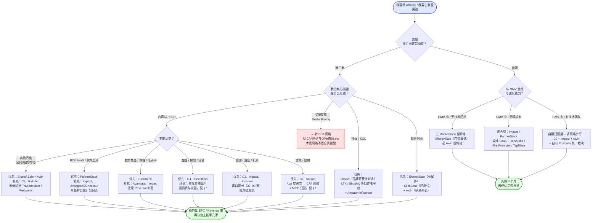

# 主流联盟网络盘点

> **一句话定位**：本文回答"**去哪找 Offer**"——把海外主流 Affiliate Network 按归属、品类、准入门槛、抽成模式、账期、报表能力六个维度横向对照，并给出按业务场景的选型决策树。
>
> **核心结论先行**：网络选择的第一原则**不是看佣金率，而是看"商家侧覆盖度"**——推广者真正的资产是"能接到哪些商家的 Offer"，而商家在不同网络的分布高度不均（时尚/家居在 Awin 与 Impact，B2B SaaS 在 PartnerStack，数字商品在 ClickBank，金融保险在 CJ 与 FlexOffers）。
> 第二原则是**分散**：同一商家在 2~4 个网络重复上架是常态，跨网络归因互不可见会导致重复计佣或漏计佣（§8.3）；网络被并购或退出市场时的未结余额风险也无法通过分散完全消除，但能显著降低（§9.3）。
> 第三原则是**看清收费模式的传导方向**：Margin/Override 型网络从商家侧抽成（Affiliate 感知弱，但商家会用更低的名义佣金率对冲），SaaS 型平台把技术卖给商家、佣金 100% 留给 Affiliate——后者的崛起正在改写整个行业的供给侧结构（§5）。
>
> **可信度标签**：`[标准]` 官方明文　`[政策]` 平台公开政策（标时点）　`[惯例]` 行业共识　`[推断]` 待验证推导
>
> 最后更新：2026-09-10

---

## 1. 先分清四类"网络"

中文语境里说"联盟网络"，实际混着四种商业模式完全不同的东西。**不先分类，后面的对照表全是噪音。**

| 类型 | English | 本质 | 赚谁的钱 | 代表 | 详见 |
|---|---|---|---|---|---|
| **传统撮合型网络** | Affiliate Network（Marketplace 型） | 双边市场：招募商家上架计划，招募推广者申请，网络做审核/追踪/结算 | 商家侧抽成（Margin/Override）+ 商家接入费 | CJ、ShareASale、Rakuten Advertising、FlexOffers、Webgains、Tradedoubler | §2 |
| **混合型平台** | Partnership Management Platform | 既是 SaaS 又是 Marketplace：卖技术给品牌，同时维护一个可对接的推广者池 | 商家月费/年费 + 按 GMV 分层的平台费 | Impact.com、Awin、PartnerStack、Pepperjam | §2、§5 |
| **纯 SaaS 型（自建工具）** | Affiliate / Partner SaaS | **只做技术，不做撮合**：品牌自己招推广者，SaaS 提供追踪、报表、结算 | 商家订阅费，**不抽佣金** | Rewardful、FirstPromoter、Tapfiliate、Refersion、Post Affiliate Pro、Partnerize | §5 |
| **CPA 网络** | CPA Network / Offer Network | 按动作派款（CPA/CPL/CPI），推广者是买量玩家不是内容站 | 广告主派款与网络付给推广者的 Payout 之间的差价 | MaxBounty、ClickDealer、CPAGrip、MyLead、Adsterra | [`CPA网络与Offer市场.md`](./CPA网络与Offer市场.md) |

**关键区分点** `[惯例]`：

1. **传统撮合型 vs 纯 SaaS 型**：前者帮你**找到**推广者/商家，后者只帮你**管理**已经找到的人。这个差异决定了商家为什么在迁移（§5.3）。
2. **混合型 vs 纯撮合型**：混合型（Impact、PartnerStack）的推广者池**不是完全开放的**——很多品牌的计划只对受邀或审核通过的推广者可见，长尾新人可能"注册了但看不到 Offer"。这是新人最常见的困惑。
3. **Affiliate Network vs CPA Network**：结算依据不同（CPS vs CPA/CPL），推广者画像不同（内容站 vs 买量者），准入逻辑不同（看内容质量 vs 看流量来源与量级）。辨析见 [`Affiliate体系总览.md`](./Affiliate体系总览.md) §3.1，本文只覆盖前三类。

---

## 2. 主对照表：12 家网络 × 10 维度

### 2.1 归属、市场与品类优势

> **归属与并购信息时点：2026-09。** 联盟行业并购极频繁（近三年仍有整合动作），下表"当前归属"列在引用前必须复核一次。

| 网络 | English 全称 | 成立/上线年份 `[惯例]` | 当前归属 `[政策]`（2026-09，需复核） | 总部/主要市场 | 优势品类 | 商家侧覆盖量级 `[惯例]` |
|---|---|---|---|---|---|---|
| **CJ Affiliate** | Commission Junction（品牌名已简化为 CJ） | 1998 | Publicis Groupe（2019 年以约 6.5 亿美元收购，属 Publicis Epsilon 体系） | 美国（加州）为主，全球覆盖 | 大零售、金融保险、电信、旅游、软件；**大品牌计划最集中** | 数千家广告主，头部品牌密度最高 |
| **Impact.com** | Impact（后更名 Impact.com，定位 Partnership Cloud） | 2008 | 独立公司，多轮私募融资（Thoma Bravo 等参与），曾传 IPO 计划 | 美国（加州）+ 全球 | 全品类，强项在**大品牌自建型伙伴关系**、B2C 订阅、旅游、金融 | 数千家品牌，中大品牌占比高 |
| **Awin** | Awin AG（由 Affilinet 与 Zanox 合并而来） | 2000 前后（Zanox 2000、Affilinet 1997，2017 合并为 Awin） | Axel Springer + United Internet（1&1）共同持股 | 德国柏林；欧洲最强，北美通过 ShareASale 覆盖 | **欧洲零售、时尚、旅游、金融、电信** | 数万家广告主（含 ShareASale 池） |
| **ShareASale** | ShareASale Inc.（品牌名保留，法律与技术已并入 Awin） | 2000 | **Awin**（2017 年收购，具体金额未充分披露 `[推断]`） | 美国芝加哥；北美中小商家 | **中小电商、家居园艺、手作、服饰、健康保健、B2B 长尾** | 数万家商家，长尾密度最高 |
| **Rakuten Advertising** | 原 LinkShare（1996 年创立，行业最老之一），2011 年被日本乐天收购后更名 | 1996 | **Rakuten Group**（日本乐天，2011 年收购 LinkShare） | 美国纽约 + 日本 + 欧洲 | **大零售、百货、服饰美妆、金融**；日本市场覆盖独特 | 数千家广告主，头部零售集中 |
| **FlexOffers** | FlexOffers.com | 2003 前后 | 私有公司（曾传出被 All in Mobility / 相关方收购，细节需复核 `[推断]`） | 美国迈阿密 + 全球交付中心 | **全品类聚合器**：以"程序数量多"著称，含大量金融、保险、订阅盒 | 号称上万广告主/计划（多为聚合转发，见 §2.4） |
| **PartnerStack** | PartnerStack（原 GrowSumo） | 2015（GrowSumo 更早） | 独立公司，风投支持 | 加拿大多伦多 + 美国 | **B2B SaaS 专属**，几乎不做实物零售 | 数百至千级 B2B SaaS 品牌 |
| **Tradedoubler** | TradeDoubler AB | 1999 | 独立上市（瑞典，曾在纳斯达克斯德哥尔摩上市） | 瑞典斯德哥尔摩；**欧洲（尤其北欧、法国、德国、意大利、波兰）** | 欧洲零售、电信、金融、旅游 | 数千家欧洲广告主 |
| **Pepperjam** | Pepperjam（曾属 eBay，后归 GSI Commerce） | 1999 | **Impact**（2021 年收购） | 美国费城；北美 | 零售、家居、健康、订阅；中腰部品牌 | 千级广告主 |
| **Webgains** | Webgains（属英国 Team Blue / 前身 Ad Pepper 体系） | 2004 前后 | Team Blue（英国） | 英国伦敦 + 德国；欧洲 | 欧洲零售、时尚、B2B | 千级广告主 |
| **Avangate / 2Checkout（Verifone）** | Avangate Affiliate Network，与 2Checkout 支付业务合并后被 Verifone 收购 | 2006 前后 | **Verifone**（2020 年前后完成收购） | 美国/罗马尼亚；全球软件与数字商品交付 | **软件、SaaS、数字下载、订阅**（自带支付+全球税务合规能力） | 千级软件/数字商品商家 |
| **ClickBank** | ClickBank Inc. | 1998 | 独立私有公司（曾被 Thoma Bravo 等投资） | 美国爱达荷/加州 | **数字商品、在线课程、电子书、Nutra 类信息产品** | 数万个数字商品 Offer |

### 2.2 准入门槛、成本与账期

> **以下所有金额均为量级区间，标 `[惯例]`；实际以各平台当期公开的 Pricing / Terms 页面为准。** 联盟网络的定价页经常"Contact Sales"，公开数字少，这是本节大量使用 `[惯例]` 的原因。

| 网络 | Affiliate 准入门槛 `[惯例]` | 商家一次性接入费 `[惯例]` | 商家月度/年度费 `[惯例]` | 抽成模式 | Affiliate 起付额 `[政策]`（量级） | 结算账期 `[惯例]` |
|---|---|---|---|---|---|---|
| **CJ Affiliate** | 免费申请，但需已有内容站/社媒；商家侧逐个审批，**新站被拒率高** | 中~高（数千美元量级） | 中~高（月费 + 交易费） | Override/Margin + 交易费 | 约 $50 量级 | Net-20/Net-30，含商家审核期 |
| **Impact.com** | 免费申请，平台侧审核较宽；**具体品牌计划仍需品牌方审批** | 中~高 | 高（平台订阅费按 GMV 分层） | **SaaS 费为主，不抽佣金**（部分场景有交易费） | 约 $25 量级（门槛较低） | 月度，多为 Net-15~Net-30 |
| **Awin** | 免费申请；欧洲部分账户历史上要求**接入押金**（约 $500~$3,000 量级，达标后可退/可抵） `[政策]`（历史，需复核当期是否仍适用） | 中 | 中 | Margin/Override + Access Fee 组合 | 约 $50 量级 | Net-20/Net-30 |
| **ShareASale** | 免费申请，**门槛最低**之一，新站友好 | 低~中（数百至数千美元量级） | 低~中 | **Margin 型**（商家给网络的总率高于给 Affiliate 的率） | 约 $50 量级 | Net-20，月度结算，**口碑上以准时著称** `[惯例]` |
| **Rakuten Advertising** | 免费申请，商家审批严格，偏好有一定流量的站点 | 中~高 | 中~高 | Override/Margin | 约 $50 量级 | Net-30 前后 |
| **FlexOffers** | 免费申请，门槛低；部分高价值计划（金融）需附加审核与资质 | 低~中 | 低~中 | Margin 型为主 | 约 $50~$100 量级 | Net-30~Net-60（**偏慢**，是常见吐槽点 `[惯例]`） |
| **PartnerStack** | 免费申请；**B2B 内容站/软件测评站更受欢迎**，纯流量型账号价值低 | 中 | 中~高（订阅费） | **SaaS 费为主**，佣金 100% 给推广者 | 约 $25~$50 量级 | 月度，含 30~60 天验证期 |
| **Tradedoubler** | 免费申请，欧洲站点优先；对北美站吸引力有限 | 中 | 中 | Margin/Override | 约 €50 量级 | Net-30~Net-60 |
| **Pepperjam** | 免费申请，接入 Impact 体系后流程趋同 | 中 | 中 | 混合 | 约 $25~$50 量级 | 月度 |
| **Webgains** | 免费申请，偏欧洲市场 | 中 | 中 | Margin/Override | 约 £50 量级 | Net-30 前后 |
| **Avangate/2Checkout** | 免费申请，软件类内容站友好 | 低~中 | 低~中 | Margin 型 | 约 $50~$100 量级 | Net-30~Net-60（含退款窗口） |
| **ClickBank** | 几乎无门槛，**新人第一站**常见选择 | 低 | 低 | **Margin 型（抽成较高）** | 约 $10~$100（可选支付方式不同门槛不同） `[政策]`（量级） | 周结/双周结可选（**回款快是核心优势**） |

### 2.3 报表、API 与数据透明度

`[惯例]` 这一维度决定你能不能**自动化运营**，对中大型 Affiliate（站群、买量团队）比对新人更重要。

| 网络 | 后台报表能力 | API 能力 | EPC 数据透明度 | 备注 |
|---|---|---|---|---|
| **CJ Affiliate** | 强：多维报表、Compliance 报告、Performance 排行 | 成熟 RESTful API（Reporting / Advertiser / Publisher API） | 公开 Merchant 的 EPC（7 天/30 天），**分母是每 100 次点击** | 数据颗粒度业内领先，但 API 有调用配额与权限审批 |
| **Impact.com** | 强：可自定义报表、Partner 分级、活动追踪 | 完整 API（含 Postback、Conversion 上报） | 提供 EPC 与转化数据，口径需在合约/后台确认 | 平台化程度最高，适合品牌自建；推广者侧需适应"每个品牌一套配置" |
| **Awin** | 中~强：跨欧洲多市场报表统一 | 有 API（Product / Transaction / Publisher） | 提供 EPC，**部分商家可关闭数据公开** | 与 ShareASale 后台仍未完全打通，跨两边运营需两套习惯 `[惯例]` |
| **ShareASale** | 中：界面较老但数据实用（Merchant 排行、EPC、Reversal 明细） | 有 Datafeed API / 商品数据源 | **EPC 与 Reversal 率公开度较高**，便于横向选品 | 商品级 Datafeed 是内容站做"价格对比页"的关键能力 |
| **Rakuten Advertising** | 中~强 | 有 API | 提供 EPC，公开度中等 | 报表更新延迟是历史吐槽点 `[惯例]` |
| **FlexOffers** | 中：计划列表庞大，筛选靠搜索 | 有 API | EPC 数据有，但**聚合转发计划的数据参考价值低**（见 §2.4） | 优势是"数量"不是"质量" |
| **PartnerStack** | 中~强：B2B 特有的 Pipeline / MQL / Customer 分层报表 | 有 API | 提供转化数据，B2B 长周期下 EPC 意义有限，**更看 CAC 回收** | 唯一真正理解"销售线索→成交"多级转化的网络 |
| **Tradedoubler** | 中 | 有 API | 中等 | 欧洲多语言报表是优势 |
| **Pepperjam** | 中~强（并入 Impact 后能力趋同） | 有 API | 中等 | — |
| **Webgains** | 中 | 有 API | 中等 | — |
| **Avangate/2Checkout** | 中：数字商品特有的退款/升级/续费报表 | 有 API | 中等 | **续费与升级归因**能力是差异化点 |
| **ClickBank** | 弱~中：报表简单，Marketplace 有 Gravity 等指标 | 有基础 API | **Gravity 值**（近 8 周有成交的推广者数量）是独特的热度指标，但**不等于 EPC** | 新人易把 Gravity 高当成"好卖"，实际是"竞争激烈" `[惯例]` |

> **EPC 口径警告**（与 [`联盟角色与佣金模型.md`](./联盟角色与佣金模型.md) §7.1 一致）：
> 多数网络后台的 "EPC" 分母是**每 100 次点击**，且是**全体推广者的均值**（含 Super Affiliate 的优质流量与已谈成的 Bump）。
> 用它做横向选品可以，用它预测自己的收益会系统性高估。`[惯例]`

### 2.4 一个必须知道的隐藏维度：自营计划 vs 聚合转发

`[惯例]` 网络上的"广告主"并非都由该网络直接签约，存在两种来源：

| | 直签计划 | 聚合转发（Aggregator / Sub-network） |
|---|---|---|
| 定义 | 商家与该网络直接签约，网络是其官方渠道 | 网络 A 从网络 B（或从商家的另一个渠道）转接来的计划 |
| 佣金 | 商家设定的原始率，网络按合约抽成 | **被剥掉一层**，名义率相同但实际到手可能低 5%~15% `[推断]` |
| 数据 | 报表口径与商家一致，争议可直接追溯 | 口径经两次转换，Reversal 理由常含糊 |
| 结算 | 按本网络账期 | 受上游网络账期拖累，**可能更慢** |
| 识别方法 | 商家官网"Affiliate Program"页写明该网络 | 计划条款里出现第三方名称、或佣金率与商家官网公布的不一致 |

**FlexOffers 等聚合型网络在这一维度上争议较多** `[惯例]`：其宣传的"上万广告主"里有相当比例是聚合转发。
判断办法很简单——**去商家官网的 Affiliate 页面看它列了哪几家网络**，官网列的才是直签。

`[推断]` 这个结构在 CPA 网络里更极端（Tier-1 / Tier-2 层层转手），派款剥离可达 30%~50%，
详见 [`CPA网络与Offer市场.md`](./CPA网络与Offer市场.md) §6。

---

## 3. 并购整合史：为什么"网络名字"一直在变

联盟行业的整合逻辑非常清晰：**网络的核心资产是双边关系数据库与合规能力，这两样都有规模效应，所以必然集中。** `[推断]`

### 3.1 时间线（重要节点）

| 时间 `[政策]`/`[惯例]` | 事件 | 后果 |
|---|---|---|
| 1996 | **LinkShare** 成立，行业最早的联盟网络之一 | 奠定"网络撮合"模式 |
| 1998 | **Commission Junction（CJ）**、**ClickBank** 成立 | CJ 走大品牌路线，ClickBank 走数字商品路线，分野延续至今 |
| 1999~2000 | **TradeDoubler**（瑞典）、**ShareASale**（美国）、**Zanox**（德国）相继成立 | 欧洲与美国各自形成区域性龙头 |
| 2003~2005 | **Publicis / 广告集团开始进场**：CJ 被 ValueClick 收购（2005 年前后） | 联盟被纳入"效果广告"版图 |
| 2007~2008 | **Zanox 被 Axel Springer + 1&1 收购**；**Impact** 成立 | ①德国资本入场；②SaaS 型平台的技术路线诞生 |
| 2011 | **Rakuten（日本乐天）收购 LinkShare**，后更名 Rakuten Advertising | 亚洲资本进入欧美联盟市场；乐天获得全球零售联盟能力 |
| 2014~2017 | **ValueClick 更名 Conversant，后被 Alliance Data 收购**；CJ 成为其旗下品牌 | CJ 归属几经变动，是"网络名字一直在变"的典型 |
| 2017 | **Awin 与 Affilinet 合并**（Zanox + Affilinet → Awin）；**Awin 收购 ShareASale** | 欧洲+北美长尾整合为一家；ShareASale 品牌保留但技术后台逐步并入 |
| 2019 | **Publicis Groupe 收购 Epsilon（含 CJ Affiliate、Conversant 业务），交易额约 44 亿美元**；其中 CJ 常被单独引用为约 6.5 亿美元量级 `[推断]`（拆分口径未完全公开） | 全球最大广告集团把联盟能力收入囊中，CJ 与 Epsilon 的数据业务打通 |
| 2020 前后 | **Verifone 收购 2Checkout（含 Avangate）** | 软件与数字商品的"支付+联盟"整合 |
| 2021 | **Impact 收购 Pepperjam** | Impact 补齐北美中腰部零售的 Marketplace 能力 |
| 2020~2025 | **Impact 多轮融资，估值达十亿美元量级（独角兽）**；行业内多次传出 IPO 计划，**是否已上市需复核当期状态** `[推断]` | SaaS 型平台获得资本加持，加速从传统网络手里抢商家 |

### 3.2 并购对推广者的实际影响（这才是重点）

`[惯例]` 并购不是新闻，是**风险事件**。历史上每次整合都出现过：

1. **后台迁移导致历史数据丢失或口径变化**：ShareASale 并入 Awin 后，部分报表字段与导出格式发生变化，长期依赖 Datafeed 自动化的站长需要改代码。
2. **付款主体变更 → 税务文件要重签**：W-8BEN / W-9 需要重新提交，期间可能出现结算延迟。
3. **未结余额的处理不确定**：小额账户在整合期被"冻结待清理"的情况有过先例。
4. **商家计划被批量下架**：新东家清理低质量或重复计划，你可能一觉醒来发现主推的 Offer 没了。
5. **反作弊规则收紧**：新东家往往带着更严的 Compliance 团队，历史上宽松的做法（如某些 Brand Bidding 边界）突然被判违规并追溯 Reversal。

> **应对** `[惯例]`：
> ① 不要把余额长期留在网络里，达到起付额就提现，**账户余额不是存款**；
> ② 关注网络官方的 Change Log 与邮件，整合期尤其要读；
> ③ 同一品类保持 2~3 个网络的备选账号（哪怕不用），迁移时才有退路；
> ④ 定期导出自己的转化明细（CSV/API）自建对账库，被 Reversal 时有据可查。

---

## 4. 选型决策树：按场景选网络

### 4.1 决策树



### 4.2 六个典型场景的理由

| 场景 | 推荐组合 | **为什么**（这是关键，不是简单报名字） |
|---|---|---|
| **内容站 / SEO（实物零售）** | ShareASale（主）+ Awin（欧洲）+ CJ（补头部品牌） | ShareASale 长尾商家最多 → **选品空间大**，且 Datafeed API 可做"参数对比页/价格页"，天然适配 SEO；Awin 覆盖欧洲品牌与欧洲流量；CJ 补齐头部品牌（很多大品牌只在 CJ 或 Rakuten 上）。`[惯例]` |
| **B2B SaaS 内容站** | PartnerStack（主）+ Impact（补）+ 各 SaaS 自建计划 | B2B 转化周期长（30~90 天甚至更久），且转化事件是"注册→付费→续费"多级。PartnerStack 的报表按 Pipeline/MQL/Customer 分层，**是唯一能算清 B2B 长周期 ROI 的网络**；且大量 B2B SaaS 只在 PartnerStack 上架。`[惯例]` |
| **时尚零售（品牌方视角）** | Awin（欧洲）+ Impact / Rakuten（美国） | 时尚是联盟渗透率最高的品类之一，也是**退货率最高**的品类之一 → 网络的 Reversal 处理能力与欧洲覆盖度比佣金率更重要。Awin 在欧洲时尚的商家密度是行业公认最强的。`[惯例]` |
| **数字商品 / 在线课程** | ClickBank（主）+ Avangate/2Checkout（软件类） | 数字商品毛利高（→ 佣金率可达 40%~75%），但**退款率与争议率也最高**。ClickBank 的周结/双周结**大幅缓解现金流压力**，这对高退款品类至关重要；Avangate 的优势是自带全球支付与税务（VAT/Sales Tax）合规，软件类省去自建成本。`[惯例]` |
| **金融 / 保险 / 信贷** | CJ + FlexOffers + 部分直客 | 金融类 Payout 高（单条线索数十至数百美元），但**合规门槛也最高**：需要资质、需要披露、禁止误导性收益宣称。CJ 的大广告主资源与合规团队最成熟；FlexOffers 计划数量多但**质量参差**，需自行筛。`[惯例]` |
| **游戏 / 移动应用** | CJ、Impact（网页侧）+ CPA 网络 + MMP（App 侧） | 游戏分两条链路：**网页/PC 端**走传统联盟网络（按注册或首充派款）；**App 端**必须走 CPI/CPA 网络 + MMP（AppsFlyer/Adjust）归因，传统联盟网络的 Cookie 追踪在 App 场景基本失效。见 [`../07_追踪Cookie与归因/MMP移动归因平台.md`](../07_追踪Cookie与归因/MMP移动归因平台.md)。`[惯例]` |

### 4.3 一个反直觉的选型结论

`[推断]` **新人不应该从"佣金率最高的网络"开始，而应该从"审核最宽松 + 回款最快"的网络开始。**

理由：新人最大的两个死因是①申请被拒导致没有 Offer 可推（§7.1）、②现金流断裂（见 [`联盟角色与佣金模型.md`](./联盟角色与佣金模型.md) §6.5）。
ShareASale 与 ClickBank 在这两点上都最友好，代价是商家质量与佣金率偏低——但**先跑通完整链路（申请→推广→转化→审核→收款）比多赚 5 个点的佣金率重要得多**。
跑通之后再往 CJ / Impact 迁移，此时你已经有历史数据，申请通过率和谈判筹码都不同。

---

## 5. SaaS 化趋势：从"上网络"到"自建 + 买工具"

### 5.1 传统网络 vs SaaS 平台：同一件事的两种卖法

| 维度 | 传统撮合型网络 | SaaS 型 / 混合型平台 |
|---|---|---|
| **卖什么** | 卖**关系**（帮你找到推广者/商家） | 卖**技术**（追踪、报表、结算、合规引擎） |
| **收费** | Margin/Override（从佣金里抽 20%~30%）+ 接入费 | 月费/年费 $500~$3,000+（按 GMV 或功能分层）+ 少量交易费；**不抽佣金** |
| **成本随规模** | **线性增长**（GMV 越大，抽走的绝对额越大） | **近似固定**（GMV 翻倍，费用可能只上一档） |
| **推广者从哪来** | 网络的 Marketplace 里主动申请 | 品牌自己招募 + 平台的 Partner 池（混合型有部分撮合能力） |
| **数据所有权** | 网络掌握全量数据，品牌看到的是网络口径 | **品牌掌握原始数据**，可自建归因层 |
| **归因控制权** | 网络内部 Last Click，品牌难以干预 | 品牌可自定义优先级、排除规则、增量测试 |
| **适合谁** | 中小商家、想快速起量的品牌 | 年联盟 GMV 达数百万美元以上、有运营人力的品牌 |

`[惯例]` 抽成量级与 [`联盟角色与佣金模型.md`](./联盟角色与佣金模型.md) §7.2 保持一致：**Margin/Override 型约为 Affiliate 佣金的 20%~30%；SaaS 型收月费 $500~$3,000+ 不抽佣金。**

### 5.2 盈亏平衡：什么时候该从网络迁到自建

`[推断]` 一个简单的判断模型（**量级估算，非精确值**）：

```
设：年联盟 GMV = G，综合佣金率 = r，网络抽成 = m（20%~30%）
    网络年度成本 ≈ G × r × m
    SaaS 年度成本 ≈ 月费 × 12 + 每笔交易费 ≈ F（相对固定）+ 内部运营人力 H

迁移临界点：G × r × m  >  F + H

举例（仅示意量级）：
  r = 8%，m = 25% → 网络抽走 GMV 的 2%
  F = $30,000/年，H = 1 个全职运营 ≈ $80,000/年
  → 临界 G ≈ $110,000 / 2% = $5.5M

  即：年联盟 GMV 超过约 500 万美元时，自建 + SaaS 在成本上开始占优。
  ⚠️ 但这只是成本项。还要加上三个非成本因素（见 §5.3），
     实际上很多品牌在 GMV 只有 100 万美元时就开始迁移。
```

### 5.3 中大品牌为什么在迁移（三个非成本理由）

1. **数据主权与归因控制权** `[惯例]`
   传统网络下，品牌看到的是网络口径的数据，无法把联盟转化与自己的 CRM/CDP 打通，也无法做统一的 Last Click 裁决。
   多网络并行时这个问题更严重——用户在 CJ 点了又在 Impact 点了，**两个网络互相看不见对方的点击**，品牌被双重计佣。
   自建归因层（server-side tracking + 统一 click_id）是唯一解，见 §8.3 与 [`../07_追踪Cookie与归因/服务端追踪与S2S回传.md`](../07_追踪Cookie与归因/服务端追踪与S2S回传.md)。

2. **增量性测量（Incrementality）的压力** `[惯例]`
   品牌方越来越被要求证明"联盟带来的销售是增量的"。传统网络的 Last Click 报表**天然无法回答这个问题**。
   自建后才能做 Geo Holdout / PSA 实验，才能识别优惠券站与返利站的"最后一公里截胡"并据此调整佣金结构。
   见 [`../07_追踪Cookie与归因/增量实验与因果归因.md`](../07_追踪Cookie与归因/增量实验与因果归因.md) 与 [`电商Affiliate与亚马逊联盟.md`](./电商Affiliate与亚马逊联盟.md) §5。

3. **推广者关系的直接化** `[惯例]`
   头部 Affiliate 与 KOL 越来越倾向"直接和品牌签约"（谈 Bump、拿独家码、拿预发新品），跳过网络这一层。
   品牌也需要直接掌握这份关系名单——它本质上是**营销资产**，放在网络手里等于资产外包。

### 5.4 纯 SaaS 工具盘点（品牌侧自建用）

| 工具 | 定位 | 强项 | 弱项 `[惯例]` |
|---|---|---|---|
| **Rewardful** | Stripe 生态的 SaaS 联盟工具 | 与 Stripe 深度集成，订阅/循环佣金追踪开箱即用 | 只做 SaaS 订阅场景，电商支持弱 |
| **FirstPromoter** | SaaS 联盟/推荐工具 | 价格较低，配置快，支持多级 | 报表与自动化能力中等 |
| **Tapfiliate** | 通用型联盟 SaaS | 电商 + SaaS 都能用，集成多 | 界面与报表偏轻 |
| **Refersion** | **电商专属**（Shopify 生态强） | 与 Shopify/WooCommerce 深度集成，优惠券码归因 | 订阅费不低，非电商场景弱 |
| **Post Affiliate Pro** | 老牌自建型联盟系统 | 可自托管，定制能力强，支持多级分销 | 需自己维护，合规责任全在自己 |
| **Partnerize** | 企业级 Partnership 平台 | 大品牌零售、金融；归因与增量测量能力强 | 价格高，中小品牌不适用 |
| **Tune / HasOffers** | 效果广告管理平台（CPA 侧常用） | 自建 CPA 网络的标准技术底座 | 不做撮合，纯技术 |

`[推断]` **一个常被忽略的点**：品牌自建之后，**反作弊与合规责任从网络转移到了自己身上**。
网络会替你挡掉大量作弊联盟、替你处理争议、替你出 W-8BEN 收集与税务合规。
自建省下的抽成，一部分会以"风控人力 + 法务成本 + 坏账"的形式还回来。
迁移决策里必须把这一项算进去，否则会出现"成本降了、被薅得更多"的结果。
防守侧手段见 [`联盟反作弊与扣量.md`](./联盟反作弊与扣量.md)。

---

## 6. 专属 Affiliate Manager：被低估的核心资产

### 6.1 AM 能给你什么（推广者视角）

**联盟经理**（Affiliate Manager，AM）
- 定义：网络侧（或商家侧）负责对接推广者的商务人员，职责包括审批准入、协调佣金、提供素材、处理争议。
- 通俗解释：你在网络里的"客户经理"。同一家网络，有 AM 和没 AM 是两个世界。
- 易混提示：**网络侧 AM**（帮你争取商家条件）与 **商家侧 Affiliate Manager**（决定你能不能进白名单）是两个不同角色，见 [`联盟角色与佣金模型.md`](./联盟角色与佣金模型.md) §1.2。

`[惯例]` AM 实际能提供的价值，按稀缺性排序：

| 价值 | 说明 | 稀缺度 |
|---|---|---|
| **未公开的 Payout Bump** | 标准费率表之外的加成，通常 10%~50% | ★★★ 只有量级达标才有 |
| **提前预警** | Offer 下架、佣金调整、政策变动、商家跑路前通知你 | ★★★ 能救命 |
| **争议仲裁** | Reversal 申诉时替你向商家争取，成功率显著高于自己提工单 | ★★★ |
| **独家素材 / 落地页** | 未公开的 Creatives、专用折扣码、专属 Landing Page | ★★ |
| **Offer 推荐** | 告诉你哪些计划在涨、哪些已饱和（§2.4 的直签/聚合信息也在这里） | ★★ |
| **Cap 提升** | 帮你向商家申请提高日/月转化上限 | ★★ 规模化前必须谈 |
| **加快结算** | 部分网络对优质账号支持缩短账期或提前放款 | ★ |
| **审核加速** | 新计划申请优先处理 | ★ |

### 6.2 量级门槛与怎么开口

`[惯例]` 门槛是**分层的，不是二元的**：

| 你的量级（月佣金收入） | 能获得的服务 | 说明 |
|---|---|---|
| < $500 | 无专属 AM，只有工单/社区支持 | 新人常态，别指望 |
| $500~$5,000 | 可能有"分组 AM"（一人对多人），响应慢 | 主动自我介绍能显著提升响应速度 |
| $5,000~$25,000 | 通常可获得专属 AM | **这一档开始要主动经营关系** |
| $25,000+ | 专属 AM + 可谈 Bump / Exclusive / Cap 提升 | Super Affiliate 档 |
| $100,000+ | AM + 商务负责人 + 定制化条款 | 可以谈账期、谈归因优先级 |

**怎么开口谈 Bump**（实操话术逻辑，不是模板）：

```
1. 先给数据，不要先要钱
   ✗ "能不能给我提高佣金？"
   ✓ "过去 90 天我在你的计划上带来 X 次点击、Y 个转化、
      Approval Rate Z%（高于计划均值）、全部来自 SEO 内容流量、
      新客占比 N%。基于这个表现，能否讨论佣金率或 Bump？"

2. 用增量证据说话
   商家最怕的是"付了佣金但订单本来就会发生"。
   能证明"我带来的是新客 / 是新需求"的数据，比"我带来很多单"更有说服力。

3. 提出可交换的条件
   Bump 从来不是白给的。可交换项：
   ① 保底投放量（承诺月点击/月转化下限）
   ② 内容位承诺（首页/推荐位/邮件列表专属位）
   ③ 独家内容（深度测评、视频、对比页）
   ④ 提前告知竞品动态

4. 不要一次要满
   先谈一个小的（+2%~5%），跑一个季度证明量，再谈下一档。
   一次要 +30% 通常直接被拒，且给对方留下"只想薅"的印象。

5. 留书面记录
   口头承诺的 Bump 在系统里没生效是常见事故。
   谈完立刻发邮件确认："确认我们约定的调整为 X，生效日期 Y。"
```

`[惯例]` **一条反面经验**：AM 会离职、会换客户组、会被并购整合裁掉。
你和 AM 的关系**不等于你和网络的关系**。所有承诺必须落在系统配置与邮件里，
否则换人之后一切归零，甚至出现"前任 AM 答应的 Bump 被追溯取消"。

---

## 7. 网络的隐性成本清单

新手算账只算"佣金率"，实际成本结构复杂得多。以下按**谁付钱**分列。

### 7.1 推广者侧的隐性成本

| 成本项 | 量级 `[惯例]` | 说明 | 怎么规避 |
|---|---|---|---|
| **接入押金** | Awin 历史上对新账户收 $500~$3,000 量级 `[政策]`（历史，需复核当期） | 名义上达标后可退/可抵扣，实际退还是有条件 | 优先从免押金的网络起步 |
| **未达起付额的机会成本** | 起付额 $50~$500 | 月赚 $40 而门槛 $100 → 需攒 3 个月 | 选低门槛网络（Impact、ClickBank、Amazon） |
| **封号导致的余额损失** | 全部未结余额 | 违规判定后余额通常不予支付 | 分散网络；不碰灰色推广方式；保留原始数据 |
| **账期资金成本** | 年化 5%~15%（视你的资金成本） | 点击到收款 50~150 天 | 选回款快的（ClickBank 周结、部分 CPA 网络日结） |
| **重复申请的运营成本** | 人力 | 同一商家在 3 个网络上架 → 要申请 3 次、维护 3 套链接 | 用链接管理工具统一维护；建立自己的 Offer 台账 |
| **报表口径不一致的对账成本** | 人力 | 各网络 EPC / Reversal 定义不同 | 自建统一对账表，以 Click ID 为主键 |
| **税务合规成本** | 视主体所在地 | W-8BEN、VAT、跨境结汇 | 见 [`联盟角色与佣金模型.md`](./联盟角色与佣金模型.md) §6.4 |

### 7.2 商家侧的隐性成本

| 成本项 | 量级 `[惯例]` | 说明 |
|---|---|---|
| **一次性接入费 Setup Fee** | 数百至数千美元 | 传统网络普遍收，SaaS 型多为"实施费" |
| **月度/年度平台费** | $500~$3,000+/月（SaaS 型），传统网络另有最低消费 | 很多网络有 **Minimum Monthly Fee**：GMV 不够也要付 |
| **每笔交易费 Transaction Fee** | 每笔 $0.05~$1 或按 GMV 的 0.5%~2% | 高频低客单价品类下这项能吃掉大半毛利 |
| **Margin/Override 抽成** | Affiliate 佣金的 20%~30% | 不在公开费率表里，谈判空间大 |
| **最低消费 Minimum Commitment** | 年度保底数万美元量级 | 大网络常见条款，签前必须看清 |
| **跨网络重复上架成本** | 每多一个网络 = 一份接入费 + 一份月费 + 一套运营 | 这是"多网络并行"的真实代价 |
| **合规与风控人力** | 自建时最被低估 | 见 §5.4 |

`[推断]` **商家侧最值得算的一笔账**：
假设年联盟 GMV 100 万美元、佣金率 8%、网络抽成 25%、月费 $1,500、交易费按 GMV 1%：

```
佣金支出           $80,000（给 Affiliate）
网络抽成           $20,000（80,000 × 25%）
平台月费           $18,000（1,500 × 12）
交易费             $10,000（GMV × 1%）
─────────────────────────────
渠道总成本         $128,000
有效渠道费率       12.8% of GMV  ← 而"佣金率"只有 8%

差额 4.8 个百分点就是网络的隐性成本。
这也是 §5.2 迁移临界点比纯抽成计算更早到来的原因。
```

---

## 8. 常见坑清单

### 8.1 申请被拒的原因（附破解）

`[惯例]` 按出现频率排序：

| # | 被拒原因 | 商家/网络的实际判断逻辑 | 破解 |
|---|---|---|---|
| 1 | **站点太新 / 内容太少** | "这个站还没证明能带量" | 先做 20~50 篇实质内容 + 3 个月流量数据再申请 |
| 2 | **站点是纯联盟页 / 无原创内容** | 判定为"低质量 Affiliate"，怕拉低品牌 | 加原创测评、实拍图、结构化数据 |
| 3 | **推广方式含禁止项** | 申请表里勾了 Brand Bidding / Incentivized Traffic / Cookie Stuffing | 老实勾选；确实要做的先谈白名单 |
| 4 | **地域不匹配** | 商家只做美国市场，你的流量在 T3 国家 | 提供流量地域分布数据 |
| 5 | **品类冲突** | 你是竞品品牌的深度合作方 | 说明不会冲突，或先退出竞品计划 |
| 6 | **邮箱/主体信息可疑** | 免费邮箱、主体与站点 whois 不一致、高风险地区 | 用企业邮箱，主体信息一致 |
| 7 | **同类账号已被拒过** | 网络记录了历史拒绝，重复申请直接秒拒 | **不要换个邮箱重投**，会进黑名单 |
| 8 | **计划已满 / 暂停招募** | 商家在做渠道结构调整 | 3~6 个月后重试，或直接联系商家侧 AM |
| 9 | **金融/健康类合规资质不足** | 需要牌照、需要披露合规审查 | 补资质；或先从审核宽松的品类积累信誉 |
| 10 | **社媒账号粉丝质量存疑** | 粉丝数与互动量严重不匹配（买粉特征） | 提供真实互动数据 |

> **一条重要的心态调整** `[惯例]`：被拒**不代表你不行**，头部品牌的计划对新站的通过率本来就很低（业界共识是大多数新站首次申请头部计划的通过率很低，无公开精确统计 `[推断]`）。
> 正确路径是：**先从长尾商家积累 6~12 个月的历史数据**，再拿这份数据去申请头部计划，通过率会数量级提升。

### 8.2 同一商家在多个网络重复上架：归因怎么算

`[惯例]` 这是联盟渠道**最混乱也最少被讲清**的问题。

**情况**：商家 Nike 同时在 CJ、Impact、Rakuten 上架。用户先点了 CJ 上某内容站的链接，3 天后点了 Impact 上某优惠券站的链接，第 5 天下单。

```
CJ 的视角：    我的点击在 30 天窗口内 → 这单该归我
Impact 的视角：我的点击在窗口内且更晚 → 这单该归我
商家实际收到：  两个网络都报了一笔佣金 → 被双重计佣
```

**为什么网络之间无法互相裁决**：每个网络只能看见自己域名下的 Cookie / Click ID，
技术上**看不见其他网络的点击**。这与同一网络内部（Last Click 裁决，见 [`联盟角色与佣金模型.md`](./联盟角色与佣金模型.md) §5.1）完全不同。

**三种处理方式** `[惯例]`：

| 方式 | 做法 | 效果 | 谁在用 |
|---|---|---|---|
| **不管（多数中小商家）** | 哪个网络报就算哪个，或都算 | 长期多付 5%~15% 佣金；财务口径混乱 | 绝大多数中小商家 |
| **只上一个网络** | 独家绑定 | 无冲突，但失去推广者覆盖广度 | 部分中小品牌 |
| **自建统一归因层** | 所有网络的点击都带上统一 click_id 回到商家服务端，商家自己做 Last Click 裁决后再分别回传给各网络 | 彻底解决；还能做增量实验 | **成熟大品牌的标志** |

`[推断]` **推广者侧的对策**：
① 优先推**只在一个网络上架**的计划（冲突概率低，你的归因更稳）；
② 如果你和优惠券站/插件同时推一个商家，**你几乎必然被 Override**（Last Click 天然偏向临门一脚的渠道），此时应该要求商家给你"内容型推广者优先级"或直接谈不可被覆盖的专属码；
③ 用 Sub ID 记录自己的渠道，被 Reversal 时能证明"我的点击在先"，虽然多数情况下申诉不回来，但至少能识别是哪个商家在这么干。

### 8.3 网络倒闭 / 被并购时的未结余额风险

`[惯例]` 风险点与应对：

| 风险 | 表现 | 应对 |
|---|---|---|
| **整合期结算延迟** | 付款主体变更、税务文件重签、系统迁移 | 保持余额低位；提前提交完整税务文件 |
| **余额被"清理"** | 长期不活跃账户的余额被按条款注销（多数合约里有 Dormant Account 条款） | **每季度登录一次并导出报表**，保持活跃 |
| **网络退出某市场** | 某区域业务关闭，当地账户余额处理不确定 | 分散到不同归属的网络（不要全在同一个母公司旗下） |
| **商家跑路，网络垫付失败** | 网络本来靠商家付款才能付你，商家违约 → 你也拿不到 | 关注商家的付款状态；大额集中在单一商家时要警惕 |
| **合约里的"最终解释权"** | 多数网络 Terms 写明"网络对余额与结算有最终裁量权" | 签约前读 Payment 与 Termination 两段 |

> **一条硬规则** `[惯例]`：**账户余额不是存款，是应收账款。**
> 达到起付额就提现，不要因为"攒到一次电汇手续费更划算"而长期留存大额余额。
> 电汇手续费 $15~$40 相比封号或整合导致的余额损失，是可以忽略的成本。

### 8.4 其他高频坑

| 坑 | 说明 | 应对 |
|---|---|---|
| **只看网络不看商家** | 同一个网络里，商家质量差异极大 | 选 Offer 的第一维度是**商家的转化率与 Reversal 率**，不是网络品牌 |
| **把 Marketplace 的 EPC 排行当选品依据** | 排行是全体推广者均值，且高 EPC 常意味着高竞争 | 结合自己的流量画像判断，见 §2.3 |
| **忽略计划的"最低推广要求"** | 部分计划要求最低月点击量或必须挂指定素材 | 达不到会被移出计划，历史佣金可能受影响 |
| **忽略 Link 的有效期** | 部分网络的深链（Deep Link）会随商家改版失效 | 定期检查主推链接是否 404 / 跳转异常 |
| **同一账号推多个竞争商家** | 部分商家合约禁止同时推直接竞品 | 读条款；必要时用不同站点分开 |
| **不看 Compliance 邮件** | 政策变更、禁止行为更新都在邮件里 | 建立专门收件夹，逐条读 |

---

## 9. 网络选择的三层评估法

`[推断]` 把前面所有维度收敛成一个可执行的评估框架：

```
第一层：能不能进（准入门槛）
  ├─ 我的站点/账号符合申请条件吗？
  ├─ 目标品类在这个网络有足够商家密度吗？
  └─ 通过 → 进入第二层

第二层：能不能赚（单位经济）
  ├─ 有效佣金率 = 名义率 × 佣金基数系数 × Approval Rate
  ├─ 窗口期与 Override 规则（决定归因捕获率）
  ├─ EPC（注意每 100 次点击口径 + 全体均值偏差）
  └─ 通过 → 进入第三层

第三层：能不能拿到手（结算与风险）
  ├─ 起付额 vs 我的月收入 → 几个月能拿到第一笔？
  ├─ 账期（Net-20/30/60）+ 审核期 → 现金流占用多少？
  ├─ 网络口碑：是否准时付款？是否有扣量争议？
  ├─ 网络归属稳定性：近期有并购传闻吗？
  └─ 余额政策：封号/休眠时余额怎么处理？
```

**三层的权重** `[惯例]`：
新人阶段 → 第一层权重最高（进不去一切归零）；
成长阶段 → 第二层权重最高（决定能不能盈利）；
规模阶段 → 第三层权重最高（一笔坏账或一次封号可能吞掉全年利润）。

---

## 10. 国内 vs 海外

| 维度 | 海外 | 国内 |
|---|---|---|
| **网络形态** | 独立第三方网络数十家，充分竞争（CJ/Impact/Awin/Rakuten/…） | **平台自营联盟垄断**：淘宝联盟、京东联盟、多多进宝、抖音精选联盟 |
| **是否存在跨平台第三方** | 是，推广者可同时接几百家品牌 | 几乎没有；跨平台聚合工具（如导购 App）本质是"多平台账号的封装"，不是独立网络 |
| **推广者议价能力** | 有（Bump、Exclusive、Cap 提升可谈） | **几乎没有**：平台既是撮合方又是规则制定方，费率调整单方面生效 |
| **商家选择网络的逻辑** | 品类覆盖度、抽成、报表能力、推广者质量 | 无选择——在自己卖货的平台上就得用该平台的联盟 |
| **抽成透明度** | Margin/Override 结构不透明，但可谈 | 平台"技术服务费"率公开（如淘宝联盟历史上约 10% 量级 `[政策]`，需核当期），但**不可谈** |
| **SaaS 自建生态** | 成熟（Rewardful/Refersion/Tapfiliate/…），品牌可自建 | 弱；独立站少，自建需求本身不存在 |
| **AM 文化** | 强，AM 是核心资源，有明确的量级门槛 | 弱；平台侧的"小二/运营"更多服务商家，不服务推广者 |
| **并购整合频率** | 高（2017 Awin+ShareASale、2019 Publicis+CJ、2021 Impact+Pepperjam） | 低；格局由电商平台自身决定 |
| **数据开放度** | Datafeed API / 商品数据源开放，可做自动化选品 | 平台开放 API 但受配额与资质限制 |
| **争议处理** | 有 Reversal 申诉流程，AM 可介入 | 申诉通道存在但成功率与透明度较低 `[惯例]` |
| **起付额与账期** | $10~$500，Net-20~60，点击到收款 50~150 天 | 门槛更低（如 ¥10 量级），月结，**回款明显更快** |
| **跨境通道** | — | 中国团队做海外联盟需通过 Payoneer/Wise 收款结汇，见 [`联盟角色与佣金模型.md`](./联盟角色与佣金模型.md) §6.4 |

**结构性差异的根源**（与 [`联盟角色与佣金模型.md`](./联盟角色与佣金模型.md) §9 一致）`[推断]`：
海外是**多商家开放网络**，网络之间竞争 → 条款市场化 → 推广者有议价空间；
国内是**单平台自营闭环**，平台垄断 → 条款单方面 → 推广者只能被动接受。
这不是"国内落后"，而是**电商集中度不同导致的必然结构**：当 3~4 个平台占据 90% 电商 GMV 时，独立第三方网络没有生存空间。

**跨境实操提示** `[惯例]`：
- 中国团队做海外 Affiliate 的常见入口是 **ShareASale / ClickBank / Amazon Associates**（门槛低、无需美国主体），跑通后再往 **CJ / Impact** 迁移。
- 中国卖家出海找海外 Affiliate 推广，主流路径是 **Impact / Awin / ShareASale 上架计划**，或用 **Amazon Associates** 让海外博主自然带货（无需自己运营）。
- **TikTok Shop 联盟**是 2023 年后增长最快的形态，本质是"平台自营联盟 + 短视频达人"，与海外传统网络是两套体系。

---

## 11. 常见误解

**❌ 误解 1：网络越大越好，直接注册 CJ / Impact 就对了。**
✅ 正确：大网络的头部计划**审核最严**，新站通过率极低。正确路径是先在 ShareASale / ClickBank 这类
门槛低的网络积累 6~12 个月历史数据，再拿数据去申请头部计划。见 §8.1、§4.3。

**❌ 误解 2：网络里显示的"广告主数量"代表我能推的商家数量。**
✅ 正确：①很多计划是**聚合转发**而非直签，佣金被剥一层（§2.4）；②混合型平台（Impact、PartnerStack）的
计划多数**需品牌方逐个审批**，注册成功不等于能看到 Offer；③部分计划对你的地域/推广方式关闭。
实际可推数量通常是宣传数字的一小部分。

**❌ 误解 3：同一商家在多个网络上架，我选佣金率最高的那个就行。**
✅ 正确：还要看①是否直签（聚合转发的数据与结算都更差）；②窗口期与 Override 规则是否一致
（同一商家在不同网络的窗口期可能不同）；③跨网络归因冲突会让商家最终收紧政策，
长期看所有网络的条款都会变差（§8.2）。

**❌ 误解 4：SaaS 型平台（Impact / PartnerStack）不抽佣金，所以对推广者更友好。**
✅ 正确：**不抽佣金 ≠ 佣金率更高**。商家省下抽成后，可能用于①提高佣金率（对推广者有利），
也可能用于②覆盖平台月费与内部人力（推广者无感）。实际观察是两者都有，
且 SaaS 型平台下商家的**推广者审批更严、规则更细**（因为数据在自己手里，管控更直接）。`[惯例]`

**❌ 误解 5：AM 答应的事就是定了。**
✅ 正确：AM 会离职、会换组、会在并购中被裁。所有 Bump / Cap 提升 / 账期调整
必须落在**系统配置 + 邮件确认**里，否则换人后归零，甚至被追溯取消（§6.2）。

**❌ 误解 6：账户里的余额是我的钱，攒够再提现更省手续费。**
✅ 正确：余额是**应收账款**，不是存款。封号、违规追溯、网络整合、休眠账户条款都可能让它归零。
电汇手续费 $15~$40 相比这些风险可以忽略。达到起付额就提现（§8.3）。

**❌ 误解 7：申请被拒了，换个邮箱重新申请就行。**
✅ 正确：网络会记录站点域名、主体信息、支付账户。重复申请通常直接秒拒，
且可能被标记为"规避审核"进入黑名单，**影响你在该网络（乃至同母公司旗下其他网络）的所有账号**（§8.1）。

**❌ 误解 8：ClickBank 的 Gravity 值高 = 这个 Offer 好卖。**
✅ 正确：Gravity 反映的是"近几周有多少推广者在成功出单"，高 Gravity 意味着**竞争激烈、流量成本高、
落地页可能已被市场看腻**。新人选 Gravity 中低但 EPC 稳定的 Offer，往往比追最高的更划算。`[惯例]`

**❌ 误解 9：欧洲网络（Awin / Tradedoubler / Webgains）对做美国流量的站长没用。**
✅ 正确：反过来才对——如果你的流量有欧洲占比，这些网络的**欧洲品牌覆盖度是北美网络无法替代的**；
且部分欧洲品牌的佣金率与窗口期条款比美国同类更友好。看流量地域分布再决定（§4.2）。

---

## 12. 延伸追问

1. **网络抽成的三种模式（Margin / Override / Access Fee）在合约里分别怎么写，怎么算出我的实际净佣金率？**
   → [`联盟角色与佣金模型.md`](./联盟角色与佣金模型.md) §7（含 100 元追踪法演算）
2. **拿到 Offer 之后，怎么判断这个商家的计划值不值得主推（窗口期、Override、Commission Base）？**
   → [`联盟角色与佣金模型.md`](./联盟角色与佣金模型.md) §3.7、§4.4
3. **如果我不做内容站而是买量推 Offer，该去哪类网络、怎么评估 Offer 质量？**
   → [`CPA网络与Offer市场.md`](./CPA网络与Offer市场.md) §5、§6
4. **电商类 Offer 的选品逻辑（尤其 Amazon）与网络选择怎么配合？**
   → [`电商Affiliate与亚马逊联盟.md`](./电商Affiliate与亚马逊联盟.md) §6、§7
5. **多网络并行时，怎么用 Click ID 做统一对账、发现丢单？**
   → [`联盟追踪技术与Postback.md`](./联盟追踪技术与Postback.md)

---

## 13. 相关文档

- 体系与三方辨析 → [`Affiliate体系总览.md`](./Affiliate体系总览.md)
- 佣金结构与网络抽成演算 → [`联盟角色与佣金模型.md`](./联盟角色与佣金模型.md)
- CPA 网络与 Offer 条款 → [`CPA网络与Offer市场.md`](./CPA网络与Offer市场.md)
- 电商联盟与 Amazon → [`电商Affiliate与亚马逊联盟.md`](./电商Affiliate与亚马逊联盟.md)
- 追踪链路与丢单排查 → [`联盟追踪技术与Postback.md`](./联盟追踪技术与Postback.md)
- 内容站选品与变现 → [`Niche站与内容站变现.md`](./Niche站与内容站变现.md)
- 反作弊、扣量与争议 → [`联盟反作弊与扣量.md`](./联盟反作弊与扣量.md)
- 规模化与现金流模型 → [`Affiliate单位经济与规模化.md`](./Affiliate单位经济与规模化.md)
- 归因模型与增量测量 → [`../07_追踪Cookie与归因/归因模型总览.md`](../07_追踪Cookie与归因/归因模型总览.md)
- 服务端追踪与统一归因层 → [`../07_追踪Cookie与归因/服务端追踪与S2S回传.md`](../07_追踪Cookie与归因/服务端追踪与S2S回传.md)
- App 侧归因（游戏/应用类 Offer）→ [`../07_追踪Cookie与归因/MMP移动归因平台.md`](../07_追踪Cookie与归因/MMP移动归因平台.md)
- 流量地域与 Tier 分层 → [`../08_海外广告生态/海外流量Tier分层与地域特征.md`](../08_海外广告生态/海外流量Tier分层与地域特征.md)
- 隐私合规（GDPR / Cookie 同意）→ [`../08_海外广告生态/海外隐私法规-GDPR-CCPA-TCF.md`](../08_海外广告生态/海外隐私法规-GDPR-CCPA-TCF.md)
- 国内平台联盟生态 → [`../14_国内市场与生态/国内联盟与变现生态.md`](../14_国内市场与生态/国内联盟与变现生态.md)
- 术语卡片 → [`../02_核心术语与知识库/联盟与套利术语.md`](../02_核心术语与知识库/联盟与套利术语.md)

> **政策时点声明**：本文所有具体金额（接入费、押金、起付额、月费、交易费）、佣金率、账期、
> 归属与并购信息均为 **2026-09 时点的量级认知**，标注 `[政策]` 处尤需核对当期官方文档。
> 联盟网络行业**并购与改名极其频繁**（ShareASale→Awin、Pepperjam→Impact、LinkShare→Rakuten、CJ→Publicis），
> 网络的定价页也常不公开具体数字。任何选型或签约决策，必须以当期官方 Pricing / Terms / Operating Agreement 为准。
> 最后复核：2026-09-10
