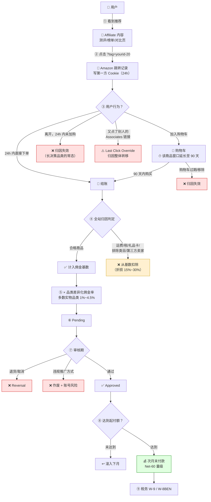

# 电商 Affiliate 与亚马逊联盟

> **一句话定位**：本文拆解**联盟营销里体量最大的单一生态**——电商类 Affiliate，以 Amazon Associates 为主轴（计划结构、窗口期、佣金基数、降佣史、全站归因的独特优势），再横向覆盖沃尔玛/Target/Best Buy/eBay 等替代方案、优惠券站与返利站的"最后一公里"经济学，以及独立站/DTC 的自建路径。
>
> **核心结论先行**：Amazon Associates 的佣金率是行业最低的一档（多数实物品类 **1%~4.5%** 量级），但它仍然是内容型电商 Affiliate 的**默认基础设施**，原因只有一条被普遍低估的机制——
> **全站归因（Site-wide Attribution）**：24 小时窗口内用户买**任何东西**都算你的，而不是只算你推的那件。
> 这把 Amazon 从"低佣金率渠道"变成了"高确定性渠道"：你不需要预测用户会买什么，只需要把他送进 Amazon。
> 但这条优势的代价是**极短的窗口期**（24 小时，加购可延长至 90 天）与**极低的率**，
> 所以 Amazon 只适合作为组合里的一条腿，不适合作为唯一依赖——2020 年 4 月的降佣事件（多品类降幅 40%~50%）已经证明了这个结论。
> 第二个核心结论：**电商联盟的真正战场不在佣金率，而在"最后一跳归因"**。
> 优惠券站、返利站、浏览器插件在结账前覆盖掉内容站的 Cookie，是品牌方与内容站长期的核心矛盾（§5、§6）。
>
> **可信度标签**：`[标准]` 官方明文　`[政策]` 平台公开政策（标时点）　`[惯例]` 行业共识　`[推断]` 待验证推导
>
> 最后更新：2026-09-10

---

## 1. 电商 Affiliate 的三种参与形态

`[惯例]` 中文说"做电商联盟"，实际是三种完全不同的生意：

| 形态 | English | 我是谁 | 卖什么 | 核心资产 | 主要收入结构 | 详见 |
|---|---|---|---|---|---|---|
| **内容型** | Content / Review Affiliate | 测评站、Niche 站、YouTube 频道、博主 | **决策辅助**（帮用户选对东西） | SEO 排名、内容库、信任 | CPS 佣金（低率高转化） | §4、§8、[`Niche站与内容站变现.md`](./Niche站与内容站变现.md) |
| **交易型** | Transactional Affiliate（Coupon / Cashback / 比价） | 优惠券站、返利站、比价站、浏览器插件 | **临门一脚**（省钱） | 交易意图流量、数据抓取、码库 | CPS 佣金（**Last Click 截胡**） | §5、§6 |
| **买量型** | Media Buying Affiliate | 投广告推电商 Offer 的玩家 | 流量差价 | 投放能力、素材、垫资 | 派款/佣金 − 流量成本 | [`CPA网络与Offer市场.md`](./CPA网络与Offer市场.md) |

**为什么必须先分** `[推断]`：三者的**归因位置**不同——内容型在漏斗上游（创造需求），交易型在漏斗末端（收割需求），买量型可以在任何位置。
而归因位置决定了：①品牌方对你的态度（爱还是恨）；②你能不能拿到高佣金率；③你的收入是否可持续。
本文 §5、§6 讨论的"截胡"矛盾，本质就是**内容型与交易型在同一个 Last Click 规则下的冲突**。

---

## 2. Amazon Associates 完整拆解

### 2.1 计划结构：为什么它是"三方模型"而不是"四方模型"

见 [`Affiliate体系总览.md`](./Affiliate体系总览.md) §2.3：Amazon Associates 是典型的**自建型（In-house）三方模型**——
Amazon 既是商家又是网络，没有中间层。

| 维度 | Amazon Associates | 传统联盟网络（CJ/Impact/Awin） |
|---|---|---|
| 结构 | Merchant = Network = Amazon | Merchant ≠ Network |
| 抽成 | **无网络抽成**（佣金率即到手率，但要扣佣金基数排除项） | Margin/Override 抽 20%~30% |
| Offer 广度 | **全站数亿 SKU**，一次注册全都能推 | 每个商家计划要单独申请审批 |
| 准入 | 门槛极低，注册即可用；**但有 180 天内产生至少 3 笔有效销售的存续要求** `[政策]`（量级，需核当期条款） | 逐个商家审批，新站被拒率高 |
| 佣金率 | 由 Amazon 单方面设定，**不可谈** | 可谈 Bump、可谈阶梯 |
| 数据 | 后台报表（点击、转化、EPC、按品类拆分），API 提供商品数据（Product Advertising API） | 各网络后台 |
| 议价能力 | **零** | 有（量级达标后） |

`[惯例]` **这个结构的含义**：Amazon 联盟的佣金率是**单方面定价**，推广者没有任何谈判渠道。
2017 与 2020 两次降佣（§2.5）都是提前数十天邮件通知后直接生效，无协商过程。
这是"把业务建立在单一商家政策上"的教科书级风险案例。

### 2.2 窗口期：24 小时 + 加购延长

`[政策]`（**以当期 Operating Agreement 为准**）：

| 机制 | 说明 |
|---|---|
| **基础窗口** | 点击后 **24 小时**内完成的合格购买计佣 |
| **加购延长** | 用户在窗口期内**将商品加入购物车**，该商品的计佣窗口延长至 **90 天**（直到购物车过期或该商品被购买/移除） |
| **窗口重置** | 用户点击**另一个** Associates 链接 → 归因转移（Last Click Override，见 [`联盟角色与佣金模型.md`](./联盟角色与佣金模型.md) §4.4） |
| **不计佣情形** | 通过其他渠道（如 Amazon 自己的广告、其他联盟链接）在窗口内再次触达并覆盖 |

**24 小时窗口意味着什么** `[推断]`：
用 [`联盟角色与佣金模型.md`](./联盟角色与佣金模型.md) §4.3 的捕获率模型（`捕获率 = 1 − e^(−w/μ)`）：

| 品类决策周期 μ | 24h 窗口捕获率 | 30 天窗口捕获率 | 损失 |
|---|---|---|---|
| 冲动型（快消、低价配件）μ≈1 天 | 63% | ~100% | −37% |
| 考虑型（服饰、家居）μ≈7 天 | 13% | 99% | **−86%** |
| 高决策（家电、床垫、乐器）μ≈20 天 | 5% | 78% | **−94%** |

→ **结论：Amazon 的 24 小时窗口对高客单价、长决策品类极不友好。**
这正是 §8 选品逻辑里"Amazon 适合中低客单价高频品类，高客单价品类应该找品牌自营计划"的数学依据。
反过来说，Amazon 能撑住这个短窗口，靠的是 §2.3 的全站归因与极高转化率。

> **加购延长是 Amazon 的独特设计** `[政策]`：
> 它把"24 小时"这个致命短板部分补上了——用户加了购物车但没立刻买（这是高客单价商品的常态），
> 你有 90 天的机会。这也是为什么 Amazon 联盟内容普遍强调"加入购物车"而非"立即购买"的行为引导。

### 2.3 全站归因：Amazon 联盟最被低估的优势

**全站归因**（Site-wide Attribution / Any-item Commission）
- 定义：用户通过你的链接进入 Amazon 后，在窗口期内购买的**任何合格商品**都计佣，不限于你链接指向的那件。
- 通俗解释：你推的是一双鞋，用户点进去买了个咖啡机 + 三本书 + 一箱纸巾，**这四样都算你的**。
- 易混提示：与传统联盟网络的"单品归因"（只算你推的那个 SKU/商家）完全不同。

**为什么这条机制的价值被系统性低估** `[推断]`：

```
① 把「选品准确性」的要求降到极低
   传统联盟：必须预测用户会买什么，推错了就没收入
   Amazon： 只需把「有购买意图的人」送进 Amazon，买什么由 Amazon 推荐系统决定
   → Amazon 的推荐算法替你做了交叉销售，你分享它的成果

② 把「客单价」的约束放宽了
   推 $20 的商品，用户实际购物车可能是 $180 → 有效 AOV 远高于你推广的商品 AOV

③ 解释了「低佣金率为什么还能活」
   你推的商品 $30 × 4% = $1.20；全站归因实际购物车 $120 × 3.5% = $4.20
   → 实际单笔收益是名义计算的 3.5 倍

④ 决定了「最优内容形态」
   不是深度单品测评，而是高购买意图的入口型内容：
   "best X for Y" 榜单页 / "X vs Y" 对比页 / 节日礼物指南 / 清单型内容
   （"10 things you need for camping"）—— 这些内容送进 Amazon 的用户，购物车里通常不止一件
```

**全站归因的边界与陷阱** `[惯例]`：

| 限制 | 说明 |
|---|---|
| **仍受 24 小时窗口约束** | 全站归因不延长窗口，只扩大商品范围 |
| **排除项同样适用于全站** | 用户买的其他商品若属排除类目（§2.4），照样不计佣 |
| **被 Override 后全部归零** | 用户点了另一个 Associates 链接，整个购物车的归因转移 |
| **Prime 会员的行为差异** | Prime 用户转化率高但客单价结构不同（更多小额高频） |
| **不同站点不互通** | 美国站的链接不计佣于英国站的购买（需 OneLink 或分别注册） |

### 2.4 佣金基数与排除项：有效佣金率为什么比标称低

`[政策]`（**以当期 Operating Agreement 为准**）Amazon 明确**不计入佣金基数**的项目包括（类别列举，非穷尽）：

| 排除项 | 说明 |
|---|---|
| **运费与配送费** | Shipping & Handling |
| **税费** | Sales Tax / VAT / GST |
| **礼品卡** | Gift Cards（历史上多次调整，长期属低率或排除类目） |
| **部分第三方卖家商品** | 由 Amazon 之外的卖家发货且不属于合格计划的商品 |
| **特定类目/商品** | Amazon 会指定某些类目或 SKU 不计佣（历史上包括部分电子产品、订阅服务、Amazon 自营服务如 Prime 会员费的部分情形） |
| **通过其他促销渠道的订单** | 如通过特定折扣入口下单 |
| **退货/取消的订单** | 常规 Reversal |

```
演算（示意，数字为假设值）：
  订单总额 $150.00
  − 运费 $9.99 − 税 $11.20 − 一件排除类目商品 $25.00
  ────────────────────────────────
  合格佣金基数 $103.81（仅订单额的 69%）× 综合佣金率 3.5% = 实得佣金 $3.63

  → 名义上"150 美元的订单、3.5% 佣金"，实际有效率 2.42%（低 31%）
```

`[惯例]` **这个 15%~30% 的基数折损是所有电商联盟计划的普遍现象**，不是 Amazon 独有。
签约任何计划前必须读 **"Commission Base" / "Qualifying Purchase"** 定义段（见 [`联盟角色与佣金模型.md`](./联盟角色与佣金模型.md) §3.7）。

### 2.5 降佣史：这个行业最重要的政策事件

`[政策]`（**时间线为公开报道的共识，具体幅度需以当期费率表与历史存档复核**）：

| 时间 | 事件 | 影响 |
|---|---|---|
| **2017 年 3 月** | 从**固定/简单分层费率**改为**按品类差异化费率**（Category-differentiated），多数品类下调，引入"标准 vs 高端"等分层逻辑 | 第一次系统性下调；大量站长收入下降 20%~40% 量级 `[惯例]`；行业开始意识到"单一平台依赖"的风险 |
| **2020 年 4 月** | **大幅下调多个品类，降幅达 40%~50%**（公开报道中常被引用的例子：家具/家居类从 8% 降至 3%，健康与个护从 5% 降至 1%，杂货类从 5% 降至 1%）。宣布到生效仅数十天 | **联盟行业的标志性事件**：大量内容站收入腰斩，直接导致①站点批量出售/关停；②行业向"多商家组合"与"品牌自营计划"迁移；③对 Amazon 依赖度的长期反思 |
| **2020 年之后** | 费率表多次小幅调整，按站点（US/UK/DE/FR/IT/ES/JP/CA/IN/BR/MX/AU 等）**分别设定**，各站不同步 | 跨国站点运营必须逐站核对 |
| **当前量级（2026-09）** | **多数实物品类落在 1%~4.5%**；少数高毛利品类（历史上如 Luxury Beauty、Amazon Games 等）可达 **10%** 左右；部分类目接近 0% | 见下方警告 |

> **⚠️ 强制声明**：
> **本文不提供逐品类精确费率表，也禁止读者引用任何第三方文章里的"Amazon 佣金表"。**
> 理由：① 该表按站点分别设定，且历史上至少变动 5 次以上；② 每次变动都可能重排类目归属；
> ③ 大量中文与英文二手文章互相引用过期数字，是错误信息重灾区。
> **任何决策必须以当期 Amazon Associates Operating Agreement 的官方费率表为准。**
> 本文只给"多数实物品类 1%~4.5%、少数高毛利品类约 10%"这一**量级**判断，用于建立直觉，不用于测算。
> 政策时点：2026-09。

**降佣史的四条教训** `[推断]`：① **佣金率不是合约，是政策**——Amazon 与推广者之间没有可谈判的费率条款，只有单方面通知；
② **收入结构的集中度是最大风险**——2020 年事件中损失最惨的是"单站 + 单平台 + 单一品类"的玩家；
③ **降佣通常发生在平台已确认你不会离开之后**——转化率与全站归因构成极强的锁定效应（§3），推广者即使被降佣也缺乏替代选项，这是典型的**买方垄断定价**；
④ **行业的应对是"多条腿"**——Amazon（转化确定性）+ 品牌自营计划（高佣金率）+ 广告位（Display/AdSense）+ 邮件列表（自有资产）+ 自有产品（最高毛利），见 §7 与 [`Niche站与内容站变现.md`](./Niche站与内容站变现.md)。

### 2.6 从点击到入账：完整链路



**读图要点** `[推断]`：① 红色节点是**归零点**——发生在这些节点的损失，在后台报表里表现为"没有转化"，**看不到原因**；
② 与 [`联盟角色与佣金模型.md`](./联盟角色与佣金模型.md) §8.0 的佣金漏损瀑布一致，Amazon 的特殊之处在于**前置闸门（24h 窗口 + Override）的损失占比远大于网络抽成**（因为没有网络抽成）；
③ 从点击到收款：24h~90 天（窗口）+ 当月末结算 + Net-60 量级账期 ≈ **60~150 天**，与行业普遍的 50~150 天一致 `[惯例]`。

### 2.7 起付额与结算

`[政策]`（量级，需核当期条款）：

| 支付方式 | 起付额量级 | 说明 |
|---|---|---|
| **Amazon 礼品卡** | 约 $10 | 门槛最低，适合新人；但**只适用于个人消费，不能作为经营收入** |
| **银行直接转账（Direct Deposit）** | 约 $100 | 主流方式；美国主体最方便 |
| **支票 Check** | 约 $100 | 已逐步淘汰，跨境兑现成本高 |
| **账期** | 当月结束后约 60 天付款（Net-60 量级） | 加上窗口期，点击到收款 60~150 天 |

`[惯例]` **两条实操提示**：① 未达起付额的余额会滚存，但**账号因违规被终止时余额通常不予支付**（见 [`联盟角色与佣金模型.md`](./联盟角色与佣金模型.md) §6.2）；
② Amazon 对**推广方式合规**的审查比佣金结算更严——禁止的推广方式（如邮件中的裸链、某些付费搜索行为、在离线/印刷媒介中使用短链等，具体清单以当期 Operating Agreement 为准）会导致**整个账号终止并没收余额**，这比降佣严重得多。

---

## 3. 为什么大家还是做 Amazon

`[惯例]` 五条理由，按重要性排序：

| # | 理由 | 量化的意义 |
|---|---|---|
| 1 | **转化率极高** | Amazon 的站点转化率显著高于独立站（用户带着购买意图来，且信任、支付、物流体验成熟）。业界共识是 Amazon 的 CVR 通常数倍于普通独立站，**无公开精确值** `[推断]` |
| 2 | **全站归因** | §2.3：推一件商品，整个购物车都算你的。这是**其他任何联盟计划都不具备**的机制 |
| 3 | **全品类覆盖 + 无需逐个申请** | 一次注册即可推数亿 SKU；传统网络要每个商家单独申请审批（且新站被拒率高） |
| 4 | **准入门槛极低 + 起付额低** | 新人当天就能开始，$10 礼品卡门槛 |
| 5 | **信任度带来的内容说服力** | "在 Amazon 上买"这句话本身降低了读者的决策成本，内容站的点击率更高 |

### 3.1 用单位经济算清楚"低率为什么能活"

`[推断]` **对比算例（数字为示意假设值，用于展示逻辑）**——同样 6,000 次月点击：

| 环节 | 场景 A：Amazon Associates | 场景 B：某品牌自营计划（在 Impact 上） |
|---|---|---|
| 转化率 | **8%**（Amazon 高转化 + 全站归因）→ 480 单 | 2%（独立站）→ 120 单 |
| 客单/购物车 | **$95**（全站归因放大） | $85 |
| 佣金基数系数 | 0.75（排除项折损）→ $71.25 | 0.90 → $76.50 |
| 佣金率 | 3.5% → $2.49/单 | **10%** → $7.65/单 |
| Approval Rate | 92% → $2.29/单 | 88% → $6.73/单 |
| 网络抽成 | 0%（自建） | 0%（SaaS 型不抽） |
| **月收入** | **480 × $2.29 = $1,099** | 120 × $6.73 = **$808** |

→ **结论：佣金率 10% 的品牌计划，收入低于佣金率 3.5% 的 Amazon。差距全部来自「转化率 × 全站归因」这两项。**

**这个算例的价值** `[推断]`：它精确解释了 §2.5 教训 3 里说的"锁定效应"——Amazon 用**转化率与全站归因**换走了**佣金率的定价权**。推广者在数学上没有替代选项，所以只能接受单方面降佣。

### 3.2 Amazon 的四个真实短板

| 短板 | 说明 | 应对 |
|---|---|---|
| **24 小时窗口** | 高决策品类捕获率极低（§2.2） | 高客单价品类改推品牌自营计划或 CJ/Impact 上的长窗口计划 |
| **佣金率单方面下调** | 无谈判渠道 | 多平台组合，见 §7 |
| **合规审查严厉，封号即没收余额** | 推广方式清单细且更新频繁 | 逐条读 Operating Agreement；不做任何边界行为 |
| **无 Bump / 无 AM / 无独家** | 完全无议价空间 | 把谈判精力投向品牌自营计划（那里有 AM） |

---

## 4. 替代与补充：其他电商联盟计划

### 4.1 美国主要零售联盟计划对照

> **所有佣金率与窗口期均为量级区间，标 `[政策]`/`[惯例]` + 时点 2026-09，需以各计划当期条款为准。**
> 大型零售商的联盟条款变动频繁，且常按推广者类型（内容型 vs 优惠券型）差异化定价，**公开页面往往不显示完整费率**。

| 计划 | 归属网络 `[惯例]` | 佣金率量级 | 窗口期量级 | 特点 | 相对 Amazon 的差异 |
|---|---|---|---|---|---|
| **Walmart Affiliate** | 自建 + Impact（历史上曾多变，需复核） | 约 1%~4%（品类差异大） | 约 3 天量级 | 全品类，杂货与家居强；对内容站有专门政策 | 窗口期略长于 Amazon，但**无全站归因**；转化率低于 Amazon |
| **Target Affiliates** | 历史上经 Impact / 曾短暂关闭后重开（**需复核当期状态**） | 约 1%~5% | 约 7 天量级 | 家居、服饰、母婴强；品牌调性好 | 窗口更长；品类更集中；**历史上曾暂停招募**，稳定性需关注 |
| **Best Buy Affiliate** | 历史上经 CJ / Impact（需复核） | 约 0.5%~2%（电子产品毛利薄） | 约 1~7 天量级 | 消费电子权威；有实体店协同 | 佣金率**低于 Amazon 电子品类**；但电子产品测评内容的信任度高 |
| **eBay Partner Network（EPN）** | **自建** | 约 1%~4%（品类差异化），历史上曾用"按新买家/老买家差异化"结构 | 约 24 小时量级（**点击后 24 小时内的成交**） | 拍卖 + 一口价混合；二手/收藏品/汽配等**长尾独特品类**无替代 | 见 §4.2 专门对比 |
| **品牌自营计划（DTC）** | Impact / Awin / ShareASale / CJ / 自建 SaaS | **约 5%~20%**（高毛利品类更高） | 约 30 天量级（**行业主流**） | 佣金率数倍于 Amazon；有 AM 可谈 Bump；常有新客差异化率 | **内容站应该优先争取的一类**，见 §7 |
| **Wayfair / Home Depot / Lowe's 等家居建材** | CJ / Impact 等 | 约 2%~8% | 约 7~30 天 | 客单价高（数百至数千美元），单笔佣金绝对值大 | 高客单价 + 长窗口，**弥补 Amazon 在高决策品类的短板** |
| **Sephora / Ulta 等美妆** | 历史上经 Impact / Rakuten（需复核） | 约 2%~10% | 约 7~30 天 | 复购率高、客单价中等、内容适配性强 | 美妆是内容型联盟最健康的品类之一 |

### 4.2 eBay Partner Network 与 Amazon 的佣金逻辑差异

`[政策]`/`[惯例]`（需核当期 EPN 条款）这是最值得单独讲的对比，因为**机制根本不同**：

| 维度 | Amazon Associates | eBay Partner Network |
|---|---|---|
| **归因范围** | **全站归因**（窗口内任意商品） | 历史上以**点击后 24 小时内的成交**为主，且曾区分"是否为新买家/新注册用户" |
| **新老买家差异化** | 不区分 | **历史上曾对"带来新买家/长期未活跃买家"给更高派款**，对老买家给低率或不计佣 `[政策]`（此机制历史上多次调整，务必核当期） |
| **佣金基数** | 商品价（排除运费/税/礼品卡等） | 商品价 + 部分情形含运费（**口径与 Amazon 不同，需逐项核对**） |
| **商品结构** | 全新品为主，标品 | **拍卖 + 一口价 + 二手 + 收藏品**，非标品占比高 |
| **品类独特性** | 全品类但无独特性 | **收藏品、二手、汽配、乐器、古董**等品类几乎无替代渠道 |
| **转化率** | 极高 | 中（拍卖流程有摩擦，一口价接近 Amazon） |
| **窗口期** | 24h（加购延长 90 天） | 约 24h 量级，**无加购延长机制**（口径需核当期） |
| **对内容站的适配** | 榜单/对比/礼物指南最优 | **深度单品/稀缺品/收藏类内容最优**（用户为特定商品而来） |

`[推断]` **结论**：eBay 与 Amazon 不是替代关系，而是**品类互补**。
做"二手相机镜头""古董手表""经典车配件""停产乐器"这类内容，eBay 是唯一有量的渠道；
做"最好的家用咖啡机"这类标品内容，Amazon 无可替代。

### 4.3 为什么品牌自营计划才是内容站的主战场

`[惯例]` 三个原因：

1. **佣金率数倍于 Amazon**（5%~20% vs 1%~4.5%），且**可谈**（有 AM、有 Bump 空间，见 [`主流联盟网络盘点.md`](./主流联盟网络盘点.md) §6）。
2. **窗口期长得多**（30 天 vs 24 小时）→ 高决策品类的捕获率从 5% 提到 78%（§2.2 表格）。
3. **品牌方需要内容站的"增量"**——他们愿意为"创造需求"付费，而不只是为"收割需求"付费。
   这直接体现在**新客差异化佣金率**上（见 [`联盟角色与佣金模型.md`](./联盟角色与佣金模型.md) §3.5）。

**代价**：转化率低（独立站没有 Amazon 的信任与物流），且要逐个申请审批。
所以正确结构是**组合**，不是二选一（§7.3）。

---

## 5. 比价站与优惠券站：最后一公里的战争

### 5.1 主要玩家与商业模式

| 玩家 | 类型 | 商业模式 | 关键事件/量级 `[政策]`/`[惯例]` | 与品牌方的关系 |
|---|---|---|---|---|
| **Honey** | 浏览器插件（自动找码 + 历史价格 + 返利） | 用户装插件 → 结账时自动试码 → 归因给 Honey → Honey 拿佣金，部分以"Honey Gold"返给用户 | **2020 年被 PayPal 以约 40 亿美元收购** `[政策]`（公开报道共识，需复核最终交割口径） | **最被品牌方敌视的一类**：插件在结账页自动注入，覆盖所有前置归因 |
| **Rakuten（原 Ebates）** | 返利站 + 插件 | 用户经 Rakuten 入口/插件购物 → Rakuten 拿佣金 → 把佣金的大部分以现金返利给用户，赚取差价 | 属 Rakuten Group（同时拥有 Rakuten Advertising 联盟网络，见 [`主流联盟网络盘点.md`](./主流联盟网络盘点.md) §2.1） | 特殊：**既是返利站又是联盟网络**，品牌方态度矛盾 |
| **RetailMeNot** | 优惠券码聚合站 | 用户搜"XX promo code" → 点击 → 归因给 RetailMeNot | 历史上曾上市后被私有化；码库规模曾是行业最大之一 | 品牌方普遍**排除或降佣**；"码站劫持"争议的中心 |
| **Capital One Shopping** | 浏览器插件 + 比价 | 插件自动比价 + 找码 + 返利积分 | 由金融机构（Capital One）运营，作为获客/留存工具 | 同样属插件类，被品牌方视为截胡者 |
| **Slickdeals** | 社区型折扣站（UGC 投票） | 用户/编辑发帖 → 社区投票上榜 → 联盟链接 | 社区驱动，**流量意图极强**；上榜难度大 | 品牌方态度**相对友好**：它是"创造需求"的（用户因为看到折扣才买），不是纯截胡 |
| **TopCashback / Quidco** | 纯返利站（英国为主） | 见 §6 | 英国返利市场双寡头 | 见 §6 |
| **CamelCamelCamel / Keepa** | Amazon 历史价格追踪 | 广告 + 联盟；**不做码** | 工具属性强，用户粘性高 | Amazon 对其态度历史上多次变化 `[惯例]` |

### 5.2 "截胡最后一公里"的机制

```
Day 0  用户在你的内容站读了 3,000 字深度测评，决定买 X
       → 点击你的联盟链接 → 写 Cookie(你)，窗口 30 天
Day 2  用户到商家站准备结账，习惯性开新标签搜 "X promo code"
       → 进入 RetailMeNot / Honey → 点击其链接 → 写 Cookie(RetailMeNot)，覆盖你的（Last Click Override）
Day 2  用户回商家站，用码（或没用码，只是点了链接）下单
       → 佣金 100% 归 RetailMeNot，你一无所获
```

**关键点** `[惯例]`：① 用户可能**根本没用上任何码**（码是过期或无效的），但只要点了链接归因就转移了——这是"码站劫持"最被诟病之处：**它可能没有创造任何价值，只是触发了一次点击**；
② 插件类（Honey、Capital One Shopping）更极端：**用户没有主动搜索**，插件在结账页自动运行并注入归因；
③ 从商家视角这笔佣金支出**几乎必然不是增量**（用户本来就要买），这正是 [`Affiliate体系总览.md`](./Affiliate体系总览.md) §7.2 讲的"增量比"问题——用 Geo Holdout 或 PSA 实验测量，通常会发现联盟渠道的真实增量只有归因数字的 40%~70% `[推断]`。

### 5.3 品牌方的五种反制手段

| # | 手段 | 机制 | 效果 | 副作用 |
|---|---|---|---|---|
| 1 | **排除 Coupon/Cashback 类推广者** | 在网络后台按推广者类型（Sub-network / Category）设黑名单，其带来的转化不计佣 | **最有效**，直接止血 | 失去"折扣敏感用户"这个真实存在的细分市场；部分返利站会转投竞品 |
| 2 | **降低其佣金率** | 给 Coupon 类 1%~2%，给内容类 10%~15% | 中等；降低其推广动机但不禁止 | 规则复杂，需要按类型精细管理 |
| 3 | **只允许未公开的唯一码** | 每个 Affiliate 分配唯一码，禁止公开分发；码被公开即判定违规 | 有效防止"码站收集公开码" | 唯一码会流向折扣聚合站（爬虫与用户投稿），需持续监控 |
| 4 | **归因优先级降级** | 不按 Last Click，而按**推广者类型设优先级**（内容型 > 优惠券型），或用 Multi-touch 分配 | 技术上最优雅 | 需要自建归因层（见 §5.4），多数中小品牌做不到 |
| 5 | **新客差异化率** | 老客订单 0% 或极低率（见 [`联盟角色与佣金模型.md`](./联盟角色与佣金模型.md) §3.5） | 有效削弱返利站的价值（其用户多为老客） | 内容站也受影响（其读者也可能是老客） |

### 5.4 归因优先级：从 Last Click 到分层裁决

`[惯例]` 成熟品牌的三步做法（与 [`联盟角色与佣金模型.md`](./联盟角色与佣金模型.md) §5 一致）：

```
第一步：自建统一归因层 —— 所有网络的点击都带统一 click_id 回到商家服务端
        → 商家看到「完整点击序列」，而不是各网络互相看不见的孤岛
第二步：按推广者类型设优先级
        Tier 1（不可被覆盖）：内容型、KOL、邮件列表 —— 创造需求
        Tier 2（可覆盖 Tier 3）：比价站、Deal 社区 —— 辅助决策
        Tier 3（最低优先级或排除）：优惠券站、返利站、插件 —— 收割需求
第三步：用增量实验校准 —— Geo Holdout / PSA 实验测各类推广者的真实增量
        → 据实测结果（而非归因报表）分配预算与佣金率
```

见 [`../07_追踪Cookie与归因/增量实验与因果归因.md`](../07_追踪Cookie与归因/增量实验与因果归因.md) 与 [`../07_追踪Cookie与归因/服务端追踪与S2S回传.md`](../07_追踪Cookie与归因/服务端追踪与S2S回传.md)。

### 5.5 内容站侧的应对

`[惯例]` 你无法阻止 Override，但可以降低损失：

| 策略 | 说明 | 局限 |
|---|---|---|
| **谈不可被覆盖的条款** | 与品牌直接约定"内容型推广者的归因不被 Coupon 类覆盖" | 只有量级达标才谈得动 |
| **用唯一码 + 内容绑定** | 在内容里嵌入专属码（"用码 XYZ 享 10% off"），码归因不依赖 Cookie | 码会泄露到聚合站 |
| **缩短"点击到购买"的路径** | 减少用户中途去搜码的机会（如提供限时专属优惠） | 需要品牌配合 |
| **建邮件列表** | 用户在你的列表里，二次触达不经搜索结果页 | 见 [`邮件营销与私域List.md`](./邮件营销与私域List.md) |
| **多商家组合 / 接受它做上游** | 单个品牌被截胡不致命；承认内容站的价值在"创造需求"，把定价谈判建立在这个论点上 | 运营成本高；需要数据支撑（新客占比等） |

---

## 6. 返利站（Cashback）的经济学

### 6.1 模式拆解

**返利站**（Cashback Site）
- 定义：把联盟佣金的一部分返还给消费者的中间站点。
- 通俗解释：商家给返利站 10% 佣金，返利站留 3%、给用户返 7%——用户为了这 7% 每次购物都从返利站入口进。
- 易混提示：与优惠券站（Coupon Site）不同——优惠券站给的是**商家的折扣码**（商家承担成本），返利站给的是**自己的佣金**（返利站承担成本）。

```
资金流（100 元追踪法）：
  消费者支付 $100.00 → 商家按 10% 佣金率付 $10.00 给返利站
  返利站返给用户 60%~80%（$6.00~$8.00），留存 $2.00~$4.00
  再扣返利站运营成本（支付通道、客服、获客）
  → 返利站净利率通常是个位数百分比量级 `[推断]`
```

### 6.2 主要玩家

| 玩家 | 主要市场 | 特点 `[惯例]` |
|---|---|---|
| **TopCashback** | 英国、美国 | 以"返还比例最高"为卖点（宣称把佣金的大部分返给用户） |
| **Quidco** | 英国 | 英国返利市场老牌玩家，与 TopCashback 双寡头 |
| **Rakuten（Ebates）** | 美国、日本、多国 | **同时拥有 Rakuten Advertising 联盟网络**——既是买方又是卖方，行业地位独特 |
| **Honey Gold** | 美国 | 插件内建返利功能，与自动找码捆绑 |
| **国内：返利网 / 一淘 / 花生日记** | 中国 | 见 §9 国内对照 |

### 6.3 商家态度为什么两极

| 立场 | 理由 | 哪类商家 |
|---|---|---|
| **支持** | ① 返利站用户**转化率高、客单价高**（他们本来就是来买东西的，返利只是加速器）；② 是**低成本获客渠道**（只在成交后付费）；③ 返利站的用户留存与复购强，能带来 LTV | 高复购品类（美妆、日用、订阅）、需要清库存的零售、新品牌拉新期 |
| **反对** | ① **几乎全是老客**——用户在结账前去返利站绕一圈，本来就要买，佣金纯损失；② 破坏价格体系（用户被训练成"不打折不买"）；③ Last Click 覆盖掉真正创造需求的内容站，长期损害渠道生态；④ 增量实验通常显示返利渠道的真实增量很低 | 强势品牌（不缺需求）、高毛利且已有品牌忠诚度的商家、重视内容渠道的品牌 |

`[推断]` **一个更深的判断**：返利站的本质是**"把商家的营销预算转移给消费者"**。它是否创造价值，取决于**这个转移是否改变了购买决策**——
若用户因为返利而**多买/提前买/买了本来不会买的品牌**则有增量；若用户本来就要买、只是顺手领了返利则是**纯损失**。
现实中两种都有，且**后者占比通常更高**（这正是增量实验要测的东西）。所以商家的理性策略不是"全禁"或"全放"，而是**按新客/老客差异化 + 用实验校准比例**。

### 6.4 返利站的脆弱性

`[惯例]` 三个结构性风险：① **完全依赖商家的政策**——品牌一旦把返利类排除或降佣，返现能力立刻崩塌（2010 年代后期大量品牌这么做）；
② **用户忠诚度极低**——用户只在"哪家返得多"之间切换，无品牌壁垒；③ **佣金率长期下行**——品牌方越来越会测增量，返利站的谈判地位持续弱化。

---

## 7. 独立站 / DTC 品牌的联盟计划

### 7.1 三条路径

| 路径 | 做法 | 成本量级 `[惯例]` | 优点 | 缺点 | 适合 |
|---|---|---|---|---|---|
| **① 上传统网络** | 在 ShareASale / Awin / CJ 上架 | 接入费 + 月费 + 抽成 20%~30% | **自带推广者流量**，冷启动快 | 抽成高、数据在网络手里、无法自定义归因优先级 | 新品牌、无运营人力 |
| **② 混合型平台** | Impact / PartnerStack / Pepperjam | 月费 $500~$3,000+ 量级，不抽佣金 | 有平台流量池 + 数据自主 + 可自定义规则 | 月费门槛；仍需自己招募 | 年联盟 GMV 数十万美元以上 |
| **③ 纯 SaaS 自建** | Refersion / Rewardful / UpPromote / GoAffPro / Tapfiliate / FirstPromoter / Post Affiliate Pro | 月费数十至数百美元量级 | **最便宜、数据完全自主、佣金 100% 归推广者** | **零撮合能力**——推广者要自己一个个找 | 已有 KOL/客户基础的品牌；订阅制 SaaS |

见 [`主流联盟网络盘点.md`](./主流联盟网络盘点.md) §5（SaaS 化趋势与迁移临界点演算）。

### 7.2 Shopify 生态的联盟插件

`[惯例]`（**具体功能与定价变动频繁，需核当期页面**）

| 插件 | 定位 | 强项 | 适用 |
|---|---|---|---|
| **Refersion** | 电商专属联盟管理 | 与 Shopify 深度集成、优惠券码归因、自动结算 | 中大型 DTC 电商 |
| **UpPromote** | Shopify 生态的联盟 + 推荐插件 | 价格较低、开箱即用、同时支持 Affiliate 与 Referral | 中小 Shopify 商家 |
| **GoAffPro** | 联盟管理插件 | 免费版可用、多级支持、社媒推广者友好 | 起步阶段、KOL 型推广 |
| **Rewardful** | **SaaS 订阅专属** | 与 Stripe 深度集成，循环佣金追踪 | 订阅制产品（非电商） |
| **FirstPromoter** | SaaS 联盟/推荐 | 配置快、支持多级 | 订阅制 |
| **Tapfiliate** | 通用型 | 电商 + SaaS 都能用 | 需要跨场景 |
| **Post Affiliate Pro** | 老牌可自托管 | 定制能力最强、支持多级分销 | 有技术团队；**注意多级分销的合规风险**（见 [`联盟角色与佣金模型.md`](./联盟角色与佣金模型.md) §3.4） |

### 7.3 自建 vs 上网络的取舍

`[推断]` 判断框架：

```
选「上网络」如果：
  ✓ 没有任何推广者关系，需从 0 冷启动　✓ 没有联盟运营人力（招募/审核/对账/争议）
  ✓ 年联盟 GMV 目标 < 数十万美元　　　 ✓ 需要网络帮你承担反作弊与合规责任

选「SaaS 自建」如果：
  ✓ 已有 KOL / 老客户 / 社媒粉丝基础（自带推广者）
  ✓ 想用「100% 佣金归推广者」作为竞争武器（对头部 KOL 极有吸引力）
  ✓ 需要自定义归因优先级（排除 Coupon 站、给内容站不可覆盖权）　✓ 有技术能力做服务端追踪与对账

选「混合型平台」如果：
  ✓ 两者都要——既要平台流量池，又要数据自主与规则自定义
  ✓ 年联盟 GMV 已过百万美元量级　✓ 这是当前中大品牌的主流选择
```

**混合策略（现实中最常见）** `[惯例]`：在 Impact 或 Awin 上架（获得 Marketplace 流量），**同时**用自建 SaaS 或直接签约管理头部 KOL 与内容站（给他们更高率与不可覆盖归因）。两套并行时**必须解决跨渠道归因冲突**，见 [`主流联盟网络盘点.md`](./主流联盟网络盘点.md) §8.2。

---

## 8. 内容型电商 Affiliate 的选品逻辑

### 8.1 四维评估模型

`[推断]` 内容站选品的核心公式：

```
单品月度潜在收益 = 搜索量 × 点击率 × 转化率 × 客单价 × 佣金基数系数 × 佣金率 × Approval Rate
                  × 复购/循环系数（是否持续产生佣金）× 竞争难度倒数（能否排上去）
```

四个可操作的评估维度：

| 维度 | 怎么量化 | 好品类的特征 | 陷阱 |
|---|---|---|---|
| **① 客单价（AOV）** | 商品均价 | **$100~$2,000**（高绝对佣金） | 太高（>$5,000）→ 决策周期长、Amazon 24h 窗口捕获率极低、退货争议多 |
| **② 佣金率** | 名义率 × 基数系数 | ≥5%（品牌自营）；Amazon 只能接受 1%~4.5% | 只看名义率不看基数与排除项 |
| **③ 转化率** | 品类基准 CVR | 有明确购买意图的品类（"best X for Y" 型关键词） | 高佣金率往往伴随低转化率（见 [`联盟角色与佣金模型.md`](./联盟角色与佣金模型.md) §10 误解 2） |
| **④ 复购/循环** | 是否订阅制、是否有耗材 | **有耗材/补充装**（打印机墨盒、宠物粮、护肤、咖啡豆）→ 一次推荐带来多次佣金 | 耐用品无复购（床垫、家电），必须靠流量规模 |

### 8.2 为什么高客单价品类更适合内容站

`[推断]` 数学原因（**这是本节的核心论证**）——内容站的成本结构是「固定内容成本 + 近乎零的边际流量成本」：一篇 3,000 字深度测评 ≈ $150~$500（外包）或 8~20 小时（自写），可持续产生流量 2~5 年（若排名稳住）。

```
低客单价品类（AOV $20，佣金率 4%）→ 单笔佣金 $0.80
  覆盖 $800 内容成本需 1,000 笔成交 → 转化率 3% 需 33,000 次点击 → 外链点击率 12% 需 275,000 次页面浏览
  ❌ 一篇内容几乎不可能达到

高客单价品类（AOV $800，佣金率 8%）→ 单笔佣金 $64
  覆盖 $800 内容成本只需 13 笔成交 → 约 430 次点击、3,600 次页面浏览
  ✅ 一篇排名不错的长尾文章 1~2 年就能达到
```

**结论**：内容站的经济学**天然偏向高客单价品类**，因为它需要的是"少量高价值转化"，而不是"海量低价值转化"（后者是买量型的经济学）。

**符合这个逻辑的经典品类** `[惯例]`：

| 品类 | AOV 量级 | 佣金率量级 | 为什么适合 |
|---|---|---|---|
| **床垫 / 寝具** | $500~$3,000 | 5%~15%（部分品牌曾给固定 $100~$300/单） | 极高客单 + 品牌愿付高佣（毛利高）+ 内容需求强（"best mattress for back pain"） |
| **家电 / 厨房设备** | $200~$3,000 | 2%~8% | 客单高、决策需研究、有明确对比需求 |
| **乐器 / 音频设备** | $150~$5,000 | 3%~10% | 高客单 + 强爱好者社区 + 长尾关键词丰富 |
| **办公设备 / 人体工学椅** | $200~$2,000 | 4%~12% | B2B/B2C 混合，客单高，复购弱但流量稳定 |
| **户外 / 露营装备** | $100~$2,000 | 4%~12% | 清单型内容天然适配（"10 things you need"）→ 全站归因受益 |
| **SaaS / 软件** | 订阅制 | **20%~50%，常含循环佣金** | 循环佣金 → 资产型收入，见 [`联盟角色与佣金模型.md`](./联盟角色与佣金模型.md) §3.3 |
| **金融 / 保险** | — | 单条线索 $5~$500 | 极高派款，但合规门槛最高（见 [`CPA网络与Offer市场.md`](./CPA网络与Offer市场.md) §2.1） |

**反面：不适合内容站的品类** `[惯例]`：
低价快消（AOV <$30）、时尚快消（退货率高 + 季节性强 + 尺码问题）、
纯 Amazon 独占的低率标品（除非依赖全站归因走流量规模）。

### 8.3 一个完整的选品演算

`[推断]` **示意算例（数字为假设值）**：

```
候选品类：家用意式咖啡机
  月搜索量 40,000（"best espresso machine" 关键词群）× 排名 5~8 位（CTR 3%）= 1,200 UV
  × 外链点击率 15% = 180 clicks

  路线 A（Amazon，全站归因）：CR 8% = 14.4 单；平均购物车 $210 × 基数系数 0.78 = $164
                             × 综合率 3.5% = $5.74 × Approval 93% = $5.34/单
                             → 月收入 = 14.4 × $5.34 = $77

  路线 B（品牌自营，Impact 上，佣金率 8%、窗口 30 天）：CR 降到 2.5% = 4.5 单
                             客单 $320 × 0.92 = $294 × 8% = $23.5 × 90% = $21.2/单
                             → 月收入 = 4.5 × $21.2 = $95

  → 两者接近，组合起来 $172（有重叠，实际取 $130~$170）

⚠️ 关键洞察：
  ① 单靠 Amazon，这个站月收入不到 $100 —— 即 §8.2 说的"内容站盈利门槛比想象高一个数量级"
  ② 要盈利必须：流量做到 10 倍（多篇文章 + 长尾关键词矩阵）／叠加广告位收入（见 ../12_流量变现与商业化/）／叠加邮件列表（见 邮件营销与私域List.md）
  ③ 这也是为什么成熟内容站的收入结构是「联盟 40% + 广告 30% + 自有产品/服务 30%」量级 `[惯例]`
```

---

## 9. 国内 vs 海外

### 9.1 平台对照

| 维度 | **Amazon Associates** | **淘宝联盟（淘宝客）** | **京东联盟** | **多多进宝** | **抖音精选联盟** |
|---|---|---|---|---|---|
| 结构 | 自建三方模型 | 平台自营联盟 | 平台自营联盟 | 平台自营联盟 | 平台自营联盟（+达人体系） |
| 归因范围 | **全站归因**（24h 内任意商品） | 单品/店铺维度为主，**无全站归因** | 单品维度为主 | 单品维度 | 商品/直播间维度，**闭环内归因** |
| 窗口期量级 | **24 小时**（加购延长 90 天）`[政策]` | 点击后约 15 天量级（**需核当期规则**）`[政策]` | 约 15 天量级 | 约 15 天量级 | 短（多为点击当日~数天） |
| 佣金率设定 | 平台单方面，**不可谈** | **商家自设**（0.5%~50%，多数 3%~20%）+ 平台抽技术服务费 | 商家自设 + 平台抽成 | 商家自设 | 商家/达人协商 + 平台抽成 |
| 平台额外抽成 | 无（但基数排除项多） | **技术服务费**（历史上约 10% 量级 `[政策]`，需核当期）+ 内容渠道分成 | 有 | 有 | 有（含达人分成结构） |
| 推广者门槛 | 极低（注册即用，有存续销售要求） | 低（需账号与推广位 PID） | 低 | 低 | 中（需达人体量/资质门槛） |
| 追踪标识 | tag 参数 + 第一方 Cookie | **PID（mm_xxx_yyy_zzz 三级）+ 淘口令** | 联盟 ID / 推广位 | 推广位 ID | 达人 ID + 商品链接 |
| 二级分销 | 无 | 曾爆发（花生日记、云集），**后因传销认定风险被监管收紧** `[政策]` | 无 | 有社交裂变形态 | 有 MCN/机构分层 |
| 优惠券站地位 | 无对应生态（Amazon 自己有 Coupon 功能，**不计佣给外部**） | 曾是主流（返利网、一淘、导购群），后受平台政策与商家态度压制 | 类似 | 社交裂变为主 | 达人直播带货为主流 |
| 返利站 | Honey / Rakuten / TopCashback | 返利网、一淘 | — | — | — |
| 结算 | 月结，Net-60 量级，起付额 $10~$100 | 月结，**回款更快**，门槛低（¥10 量级） | 月结 | 月结 | 按平台结算周期 |
| 内容形态主流 | 独立站 + SEO + YouTube | **平台内内容**（微淘、逛逛、直播）+ 微信社群 | 平台内 + 社群 | 社群裂变 | **短视频 + 直播** |
| 独立站生态 | **主流**（Niche 站是核心打法） | **几乎不存在**（搜索流量被平台内容闭环分流） | 同左 | 同左 | 同左 |

### 9.2 结构性差异的根源

`[推断]` 与 [`Affiliate体系总览.md`](./Affiliate体系总览.md) §8.2 一致，四个原因：

1. **平台闭环吃掉了独立生态**：淘宝/京东/拼多多/抖音自建联盟，商家、流量、追踪、结算全锁在体系内。
2. **搜索流量不独立**：海外 Niche 站命脉是 Google SEO；国内搜索份额低且被内容平台分流，独立站获取自然流量的路径基本不存在。
3. **邮件渠道缺失**：海外 Affiliate 的"自有资产"是邮件列表；国内没有这个渠道，推广者的流量都是**租来的**（平台账号随时可能被封）。
4. **归因机制不同**：Amazon 的**全站归因 + 淘口令的跨端传递**是两种截然不同的设计哲学——
   前者靠"把用户送进商城"，后者靠"把商品送到用户面前"（淘口令可以脱离平台传播到微信/QQ）。
   **淘口令是国内生态最重要的技术发明**，它绕开了"链接在社交平台被屏蔽"的问题，
   这是海外联盟体系里没有对应物的。

### 9.3 对国内团队的实操含义

`[惯例]`：
- **做海外电商 Affiliate**：Amazon Associates 是最低门槛入口（无需美国主体，$10 礼品卡起付）；跑通后往 Impact / ShareASale / CJ 上的品牌自营计划迁移（佣金率数倍，见 §4.3）。
- **中国卖家出海找 Affiliate**：在 Impact / Awin / ShareASale 上架计划，或用 Amazon Associates 让海外博主自然带货（无需自己运营）。见 [`主流联盟网络盘点.md`](./主流联盟网络盘点.md) §7.2（商家侧成本演算）。
- **国内电商联盟的现实**：推广者议价能力接近零，费率调整单方面生效——这是"单平台自营闭环"的制度性结果，不是运营能力问题。见 [`../14_国内市场与生态/国内联盟与变现生态.md`](../14_国内市场与生态/国内联盟与变现生态.md)。

---

## 10. 常见误解

**❌ 误解 1：Amazon 佣金率只有 3%，不值得做。**
✅ 正确：Amazon 的价值不在佣金率，而在**转化率 + 全站归因**（§2.3、§3.1）。
低率 × 高转化 × 被放大的购物车，单笔收益未必低于高率的品牌计划。
但它只适合作为组合的一条腿——24 小时窗口与单方面降佣是硬伤。

**❌ 误解 2：全站归因意味着"推什么都一样，反正用户买别的也算我的"。**
✅ 正确：全站归因**不延长窗口**（仍是 24 小时）、**不排除项照扣**、**被 Override 后整体归零**。
它扩大的是"商品范围"，不是"时间范围"或"确定性"。
而且它只对有购买意图的流量有效——把无意图流量送进 Amazon，全站归因也救不了。

**❌ 误解 3：加购延长 90 天 = 我有 90 天窗口。**
✅ 正确：**只有加入购物车的那件商品**享受 90 天延长；用户没加购、直接在 24 小时后购买的其他商品**不计佣**。
所以全站归因的红利只在 24 小时内有效，90 天延长是**单品级**的（§2.2）。

**❌ 误解 4：佣金率 3.5% 就是我能拿到订单额的 3.5%。**
✅ 正确：佣金基数要扣运费、税、礼品卡、排除类目、部分第三方卖家商品（§2.4）。
实际有效率通常比标称低 **15%~30%**。所有电商联盟计划都有这个问题，签约前必须读 Commission Base 定义。

**❌ 误解 5：优惠券站/返利站帮我带来了销售，商家应该欢迎它们。**
✅ 正确：它们在 Last Click 规则下**覆盖了真正创造需求的内容站**，且带来的订单大概率**不是增量**
（用户本来就要买）。增量实验通常显示联盟渠道真实增量只有归因数字的 40%~70% `[推断]`。
这是大量品牌排除或降佣 Coupon/Cashback 类的根本原因（§5.2、§5.3）。

**❌ 误解 6：Honey 被 PayPal 40 亿美元收购，说明优惠券插件是好生意；返利站把佣金返给用户所以不赚钱、对我没威胁。**
✅ 正确：那笔收购的价值主要在**用户数据与结账入口的战略性**（PayPal 要的是结账场景的触点），不是联盟佣金收入本身。
作为普通推广者去做插件类，面临**浏览器商店政策、品牌方集体排除、归因规则变更**三重风险。
返利站留的是**佣金差价**（通常 20%~40% 量级 `[推断]`）且规模巨大——它对内容站的威胁不是"赚钱多少"，而是**在最后一跳覆盖你的归因**（§5.2、§6.1）。

**❌ 误解 7：自建联盟计划（用 Shopify 插件）比上网络省钱，所以一定更好。**
✅ 正确：省钱是真的，但**你失去了撮合能力**——插件只提供技术，推广者要你自己一个个找。
没有推广者关系的品牌自建后，计划常年零活跃是常态。正确判断见 §7.3：**已有 KOL/客户基础 → 自建；从零冷启动 → 上网络。**

**❌ 误解 8：eBay 和 Amazon 差不多，选佣金率高的那个就行。**
✅ 正确：两者**机制根本不同**——eBay 历史上对"新买家/老买家"差异化派款，归因口径与 Amazon 不同，
且在收藏品、二手、汽配、乐器等品类是**唯一有量的渠道**。它们是品类互补，不是替代（§4.2）。

**❌ 误解 9：高客单价品类佣金高，但转化难，所以不如做低客单价走量。**
✅ 正确：**对内容站而言恰好相反**（§8.2）。内容站的成本是固定的内容生产成本，需要的是"少量高价值转化"。
低客单价品类下，一篇内容需要数十万次浏览才能回本，这在数学上几乎不可能。走量是**买量型**的经济学，不是内容型的。

**❌ 误解 10：Amazon 的降佣只影响大站，小站无所谓。**
✅ 正确：2020 年 4 月的降佣对**所有站点是同比例的**，且小站抗风险能力更弱（没有广告位收入、没有邮件列表、没有多商家组合）。
事件中批量关停和出售的正是中小站点（§2.5）。

---

## 11. 延伸追问

1. **佣金率、窗口期、Override、Commission Base 这四个条款怎么组合影响我的实际收益？怎么用 100 元追踪法演算？**
   → [`联盟角色与佣金模型.md`](./联盟角色与佣金模型.md) §3.7、§4、§7.3
2. **内容站的选品、关键词、内容生产与"联盟 + 广告 + 自有产品"的多腿收入结构怎么搭？**
   → [`Niche站与内容站变现.md`](./Niche站与内容站变现.md)
3. **优惠券站与返利站的截胡，在技术与合约层面到底怎么防？增量实验怎么设计？**
   → [`../07_追踪Cookie与归因/增量实验与因果归因.md`](../07_追踪Cookie与归因/增量实验与因果归因.md)、[`联盟反作弊与扣量.md`](./联盟反作弊与扣量.md)
4. **该上网络还是自建 SaaS？迁移的临界点怎么算？**
   → [`主流联盟网络盘点.md`](./主流联盟网络盘点.md) §5.2（含盈亏平衡演算）
5. **联盟链接、Cookie 写入、Postback 回传的技术细节、丢单排查，以及 Safari ITP 的 7 天上限对 Amazon 这类短窗口计划的实际影响？**
   → [`联盟追踪技术与Postback.md`](./联盟追踪技术与Postback.md)；[`../07_追踪Cookie与归因/Cookie原理与分类.md`](../07_追踪Cookie与归因/Cookie原理与分类.md)；[`联盟角色与佣金模型.md`](./联盟角色与佣金模型.md) §4.6

---

## 12. 相关文档

- 体系与三方/四方模型 → [`Affiliate体系总览.md`](./Affiliate体系总览.md)
- 佣金结构、窗口期敏感性、Override、结算 → [`联盟角色与佣金模型.md`](./联盟角色与佣金模型.md)
- 网络选型与 SaaS 化趋势 → [`主流联盟网络盘点.md`](./主流联盟网络盘点.md)
- CPA 类电商 Offer 与买量视角 → [`CPA网络与Offer市场.md`](./CPA网络与Offer市场.md)
- 追踪链路、Postback、丢单排查 → [`联盟追踪技术与Postback.md`](./联盟追踪技术与Postback.md)
- 落地页与转化漏斗（含各步转化率基准）→ [`落地页与转化漏斗设计.md`](./落地页与转化漏斗设计.md)
- 内容站选品、SEO 与多腿变现 → [`Niche站与内容站变现.md`](./Niche站与内容站变现.md)
- 邮件列表作为自有资产 → [`邮件营销与私域List.md`](./邮件营销与私域List.md)
- 优惠券劫持、归因抢占与扣量 → [`联盟反作弊与扣量.md`](./联盟反作弊与扣量.md)
- 规模化与单位经济 → [`Affiliate单位经济与规模化.md`](./Affiliate单位经济与规模化.md)
- 归因模型与 Last Click 争议 → [`../07_追踪Cookie与归因/归因模型总览.md`](../07_追踪Cookie与归因/归因模型总览.md)
- 增量实验与因果归因 → [`../07_追踪Cookie与归因/增量实验与因果归因.md`](../07_追踪Cookie与归因/增量实验与因果归因.md)
- 服务端追踪与自建归因层 → [`../07_追踪Cookie与归因/服务端追踪与S2S回传.md`](../07_追踪Cookie与归因/服务端追踪与S2S回传.md)
- Cookie 原理与浏览器限制 → [`../07_追踪Cookie与归因/Cookie原理与分类.md`](../07_追踪Cookie与归因/Cookie原理与分类.md)
- 隐私合规（GDPR/CCPA/TCF）／海外流量 Tier → [`../08_海外广告生态/海外隐私法规-GDPR-CCPA-TCF.md`](../08_海外广告生态/海外隐私法规-GDPR-CCPA-TCF.md) ／ [`../08_海外广告生态/海外流量Tier分层与地域特征.md`](../08_海外广告生态/海外流量Tier分层与地域特征.md)
- 扣量与联盟作弊博弈 → [`../13_反作弊与流量质量/扣量与联盟作弊博弈.md`](../13_反作弊与流量质量/扣量与联盟作弊博弈.md)
- 国内联盟与变现生态 → [`../14_国内市场与生态/国内联盟与变现生态.md`](../14_国内市场与生态/国内联盟与变现生态.md)
- 术语卡片 → [`../02_核心术语与知识库/联盟与套利术语.md`](../02_核心术语与知识库/联盟与套利术语.md)

> **政策时点声明**：本文所有 Amazon Associates 条款（24 小时窗口、加购延长 90 天、佣金基数排除项、起付额、账期、180 天存续销售要求）、
> 各零售计划的佣金率与窗口期、平台归属（Walmart/Target/Best Buy/eBay 所使用的网络历史上多次变动）、Honey 被 PayPal 收购的交易额、
> Amazon 2017 与 2020 年的费率调整幅度，均为 **2026-09 时点的认知**，标注 `[政策]` 处必须以当期官方文档为准。
> **本文刻意不提供逐品类精确佣金率表**：Amazon 费率表按站点分别设定且历史上至少变动 5 次以上，任何精确表都会在数月内过期，且是二手错误信息的重灾区。
> 决策前请核对：① Amazon Associates Operating Agreement 当期费率表（对应站点）；② 各品牌计划的当期 Terms；③ 各 Shopify 插件的当期定价与功能。
> 最后复核：2026-09-10
