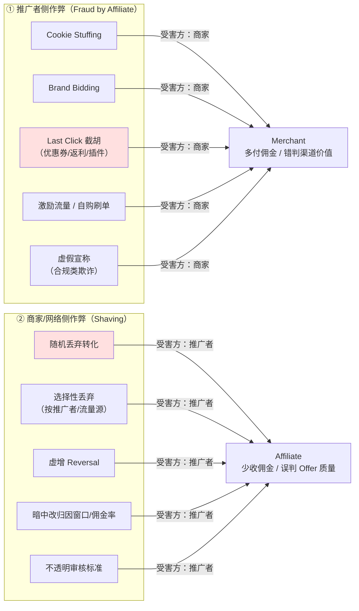
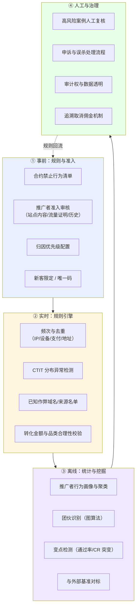

# 联盟反作弊与扣量

> **一句话定位**：本文从**防守方与认知方**视角研究联盟体系里的双向欺诈——
> 推广者侧的归因作弊，与商家/网络侧的扣量（Shaving）——重点是**可检测特征、检测方法与合约防范**，不是操作指南。
>
> **核心结论先行**：联盟体系里的作弊**几乎全部源于 Last Click 归因规则的可利用性**，
> 而不是技术漏洞。因此防御的根本手段是**改归因规则**（类型优先级、新客限定、唯一码），
> 而不是加更多风控规则。反过来，**扣量在数学上难以被单一推广者证明**——
> 均匀扣量对任何分维度分析都是不可见的，只能靠自购对照、跨网络横向比较与合约审计权来约束。
>
> **⚠️ 立场声明**：本文只写「原理 → 可检测特征 → 防御手段」。
> **不写**具体实施方法、不推荐工具、不提供规避审核技巧、不推荐任何流量源。
> 判定标准：如果一段内容能被作弊方直接拿去执行，就不该出现在这里。
>
> **可信度标签**：`[标准]` 官方明文　`[政策]` 平台公开政策（标时点）　`[惯例]` 行业共识　`[推断]` 待验证推导
>
> 最后更新：2026-09-10

---

## 1. 双向欺诈：谁在骗谁

联盟体系里有**两个方向**的欺诈，中文材料几乎只讲第一个，但第二个对推广者的伤害更直接。



| | ① 推广者侧作弊 | ② 商家/网络侧扣量 |
|---|---|---|
| 受害方 | 商家（以及被截胡的其他推广者） | 推广者 |
| 动机 | 无成本获取归因 | 降低应付佣金、美化渠道 ROI |
| 可检测性 | **中~高**（有行为与时间特征） | **低**（尤其均匀扣量） |
| 主要防御 | 归因规则设计 + 风控引擎 + 合约条款 | 自购对照 + 跨网络比较 + 审计权 + 分散化 |
| 行业治理成熟度 | 较成熟（MRC 标准、第三方验证、网络风控团队） | **不成熟**（缺乏第三方审计机制） |

`[推断]` **一个结构性判断**：推广者侧作弊之所以治理得相对好，是因为商家有**强动机 + 数据优势**去查
（商家掌握真实订单全量数据）。而扣量之所以难治，是因为推广者**既缺动机信息也缺数据**
——你看不到商家的全量订单，无法直接证明"这单本该算给我"。
这个信息不对称是扣量长期存在的根本原因，不是道德问题，是结构问题。

---

## 2. 推广者侧作弊：原理与可检测特征

> 本节按统一范式写：**利用了什么规则 → 为什么有效 → 可检测特征 → 防御手段**。
> 所有描述止于"能被检测的特征"这一层，不涉及实施细节。

### 2.1 Cookie Stuffing（Cookie 填充）

**原理**：在用户没有真实点击推广链接的情况下，通过页面加载的资源（隐藏 iframe、1×1 图片、
自动触发的请求）向联盟网络的追踪域名写入 Affiliate Cookie，从而让**用户后续的自然购买被归因给该推广者**。

**利用了什么**：`[推断]` 利用了 Last Click 归因 + Cookie 机制的两个特性：
① 浏览器会执行页面里所有资源的请求，无论是否可见；
② 归因引擎只看"窗口期内最后一次有效点击"，不校验这次点击是否有真实用户意图。

**为什么有效**：商家侧看到的报表完全正常——有点击、有 Cookie、有转化、在窗口期内。
除非专门检查"点击"的用户意图信号，否则无法与真实推广区分。

**可检测特征**（防守方视角）：

| 特征维度 | 异常表现 | 检测方法 |
|---|---|---|
| 点击→转化时间分布（CTIT） | 呈现**大量长间隔**（数小时到数天），与真实内容站的分布形态不同 | 画 CTIT 直方图，检查是否有异常的长尾堆积 |
| 点击的去重与来源 | Referrer 缺失或异常、UA 分布畸形、IP 与转化地区不匹配 | 日志字段完整性校验 |
| 点击与页面交互的关联 | 有"点击"记录但无任何后续页面浏览行为 | 需要商家侧埋点配合 |
| 推广者的流量结构 | 声称有巨大流量但站点内容稀薄、无 SEO 排名、无社媒存在 | 人工审核站点与流量证明 |
| 转化率异常 | 转化率**远高于**同品类基准，但 EPC 分布不合理 | 与同类推广者横向对标 |
| 网络侧请求特征 | 短时间内同一 IP/设备产生大量不同商家的"点击" | 频次规则 |

**防御手段**：
1. **网络侧**：对"点击"加意图校验（要求真实的用户交互事件而非纯资源加载）、频次限制、IP/设备去重、
   把 Cookie Stuffing 域名列入黑名单（EasyPrivacy 等公开名单本身就是重要情报源）。
2. **商家侧**：在合约里明确禁止，保留**追溯取消佣金**的权利；要求网络提供点击级原始数据用于自查。
3. **归因侧**：从纯 Last Click 改为**要求"点击"必须伴随可验证的用户交互**，
   或引入 Click-through 与 View-through 的区分并只认前者。

> **合规定性** `[政策]`：Cookie Stuffing 在多个司法辖区被认定为欺诈行为，
> 美国 FTC 与法院有过针对此类行为的执法与判决先例；在 GDPR 辖区，未经同意写入追踪 Cookie
> 本身就违反 ePrivacy 指令。主流联盟网络的条款一律明确禁止，发现即封号并没收未结余额。

### 2.2 Brand Bidding / Trademark Bidding（品牌词竞价）

**原理**：推广者在搜索引擎上**竞价商家自己的品牌词**（如 "Nike 官网"、"Nike discount"），
让自己的页面出现在品牌搜索结果之上，截获本来要直接访问商家官网的用户。

**利用了什么**：搜索引擎广告允许竞价任意关键词；用户在品牌词搜索后点击的第一个结果，
成为 Last Click，从而拿走佣金。

**为什么有效**：这批用户的**转化意图已经是 100%**（他们本来就打算买），
所以推广者的"转化率"极高、成本极低——但商家为此支付了本来完全不需要支付的佣金。
这是**增量比（Incrementality）为零甚至为负**的典型形态。

**可检测特征**：

| 特征 | 异常表现 |
|---|---|
| 流量来源 | Referrer 集中在搜索引擎，且落地关键词为品牌词（需要商家侧能看到搜索词，通常看不到） |
| 转化率 | **异常高**（远高于同品类内容站），且客单价分布与全站自然流量高度一致 |
| 新客占比 | **极低**——几乎都是老客/已决策用户 |
| 点击→转化时间 | **极短**（秒级到分钟级），因为用户已经决定要买 |
| 站点内容 | 落地页几乎无实质内容，只是一个跳转入口 |

`[推断]` **新客占比 + 点击转化时间**这两个指标组合起来是最有效的检测器：
真实内容站带来的是"高决策时间 + 高新客占比"，品牌词截胡是"极低决策时间 + 极低新客占比"。
这两个维度在商家自己的数据里是可见的，不需要网络配合。

**防御手段**：
1. 合约明确禁止竞价品牌词及**变体拼写**（brand + coupon / brand + discount / brand misspelling）；
2. 禁止**直接链接**到商家站（必须经过自有内容页），这能显著抬高截胡成本；
3. 用**归因类型优先级**把这类推广者降到最低（见 §2.3 的通用防御）；
4. 定期用品牌词自查搜索结果，发现违规即取证、取消佣金、终止合作；
5. **只允许唯一码**（Unique Code per Affiliate）而非公开码——公开码会被搜索"品牌名 + 优惠码"的站点收割。

### 2.3 Last Click 截胡：优惠券站、返利站与浏览器插件

这是**规模最大、争议最持久、也最难用"作弊"定性**的一类，因为它的行为在多数合约里是**被允许的**，
只是商家事后发现它不产生增量。

**原理**：用户在商家站的结账流程中，通过以下路径触发一次"点击"，从而成为 Last Click：
- 离开结账页去搜"商家名 + promo code"，点了优惠券站的结果；
- 安装了返利/优惠券浏览器插件，插件在结账页自动弹出或自动填码；
- 访问返利站，从返利站跳转回商家站完成购买。

**利用了什么**：`[标准]` 归因规则本身——Last Click + Cookie Duration + Override。
见 `联盟角色与佣金模型.md` §4.4 的 Override 机制图解。

**为什么争议**：
- **推广者立场**：我提供了折扣信息/返利，促成了这次成交，用户本来可能因为价格放弃。
- **商家立场**：这批用户已经在结账页了，转化率接近 100%，我付的佣金买不到任何增量，
  反而把本该属于内容站的归因抢走了，还额外付出了折扣成本。
- **数据立场** `[推断]`：用 Geo Holdout 或 PSA 实验测增量，优惠券/返利渠道的真实增量通常远低于其归因收入。
  这是可验证的，但**绝大多数商家不做这个实验**，因为要花钱且结果可能难堪。

**可检测特征**：

| 特征 | 优惠券/返利站的典型表现 | 内容站的典型表现 |
|---|---|---|
| 点击→转化时间 | **极短**（分钟级），集中在结账时段 | 数小时~数天 |
| 新客占比 | 低 | 中~高 |
| 平均订单额 | 与全站自然流量高度一致 | 与推荐品类相关，分布有偏 |
| 购物车 abandonment 关联 | 高——用户从结账页离开后回来 | 低 |
| 流量入口 | 搜索"品牌+code"、插件触发、直接跳转 | 有机搜索、社媒、邮件 |
| 复购贡献 | 几乎为零 | 有（内容站建立品牌认知） |
| 归因被 Override 的方向 | **总是覆盖别人，从不被覆盖** | 经常被覆盖 |

`[推断]` **"总是覆盖别人、从不被覆盖"是一个极强的结构性信号**。
在 Last Click 体系下，越靠近成交点的渠道，覆盖能力越强。
如果某个推广者的归因记录里，作为"覆盖方"的比例远高于"被覆盖方"，
说明它位于漏斗最末端，其增量贡献值得质疑。这个指标网络侧是有数据的，但很少对外披露。

**防御手段**（商家侧，按有效性排序）：

| # | 手段 | 效果 | 代价 |
|---|---|---|---|
| 1 | **归因类型优先级**：内容型 > 社媒 > 比价 > 优惠券/返利 > 插件 | 最直接，保护前置渠道 | 优惠券站会抗议甚至退出 |
| 2 | **New Customer Only** 或新客高佣、老客零佣 | 削掉大部分截胡价值 | 需要能可靠识别新老客 |
| 3 | **排除 Coupon/Cashback 类目** | 彻底，但会损失一部分真实增量 | 一刀切，可能误伤 |
| 4 | **只用唯一码**，禁止公开码 | 阻止"搜品牌+code"路径 | 需要为每个推广者生成与管理码 |
| 5 | **禁止插件类推广者**（合约条款 + 技术识别） | 阻止自动填码 | 技术上难以完全识别 |
| 6 | **缩短 Cookie 窗口 + 要求真实点击**（结账页触发的"点击"不算） | 削弱截胡 | 需要网络支持该规则 |
| 7 | **做增量实验**，用数据而非立场决策 | 唯一能定论的方法 | 成本高、周期长 |

> **注意手段 6 的技术含义** `[推断]`：如果网络能区分"用户主动点击推广链接"与
> "结账页面上由脚本/插件自动触发的请求"，就能在归因层直接排除后者。
> 这在技术上是可行的（检查 Referrer、检查是否有真实的导航事件、检查请求发起上下文），
> 但需要网络与商家共同实现，目前只有少数成熟网络支持。

### 2.4 激励流量与自购刷单

**激励流量**（Incentivized Traffic）：用奖励（现金、积分、抽奖、解锁内容）诱导用户点击链接或完成转化。

**可检测特征**：
- 转化率异常高但**客单价异常低**（用户只为完成动作，会选最便宜的商品）；
- 退货率/取消率异常高；
- 用户画像高度集中（年龄、地区、设备型号）；
- 转化时间高度集中（激励活动时段）；
- 复购率为零。

**自购刷单**：推广者自己下单套取佣金。特征是订单量小但**通过率 100%**、
收货地址与推广者注册信息关联、支付方式集中、退货率低（因为是真的买了）。

**防御**：新客限定、首单限额、设备与支付指纹去重、收货地址聚类分析、
合约明确禁止自购（多数网络条款已禁止，但执行靠检测）。

### 2.5 虚假宣称（合规类欺诈）

与前几类不同，这类**不破坏归因，但破坏合规**，因此后果最严重（法律层面而非商业层面）。

| 形态 | 表现 | 风险 |
|---|---|---|
| 收益承诺 | "月入十万"、"保证回报"（金融、投资、副业类 Offer 高发） | FTC 执法、平台封号、民事赔偿 |
| 健康功效 | 未经证实的疗效宣称（Nutra 类高发） | FDA/FTC 执法、多国监管处罚 |
| 伪造测评 | 声称"实测"但从未使用产品；伪造前后对比图 | FTC 2023 年修订的 Endorsement Guides 明确规制 `[政策]` |
| 虚假紧迫感 | 假倒计时、假库存、假"仅剩 2 件" | 消费者保护法、平台政策 |
| 未披露关系 | 不放 affiliate disclosure | **FTC 16 CFR Part 255** 明确要求披露物质性联系 `[政策]` |
| 假新闻/伪媒体 | Advertorial 伪装成新闻报道 | 平台政策与新闻伦理，多国监管关注 |

`[政策]` **FTC Endorsement Guides（16 CFR Part 255，2023 年修订）** 的关键要求：
披露必须**清晰且醒目**（clear and conspicuous），不能藏在页脚小字或"了解详情"里；
必须在用户看到推荐**之前或同时**看到披露；不得虚构使用者体验。
> 政策时点：2026-09。FTC 近年持续加强对虚假评价与 AI 生成内容的执法，需核当期指引。

**防御**（商家侧）：合规审查推广者的落地页与素材（多数网络提供"推广者素材报备"机制）、
合约里列明禁止的宣称类型、保留追溯取消佣金与终止合作的权利、
对高风险品类（Nutra、金融、健康）实施**前置审核**而非事后抽查。

---

## 3. 商家/网络侧扣量（Shaving）

### 3.1 动机与形态

**扣量**（Shaving / Conversion Dropping）= 网络或商家**故意少记转化**，从而少付佣金。

| 动机 | 说明 |
|---|---|
| 直接省钱 | 少记 20% 转化 = 少付 20% 佣金 |
| 美化渠道 ROI | 让联盟渠道的报表看起来效率更高（对内部汇报有利） |
| 平衡预算 | 月度预算耗尽后，用扣量代替"关停计划"，避免公开降佣引发推广者流失 |
| 补贴大推广者 | 从长尾推广者身上扣，用来给 Super Affiliate 发 Bump |
| 掩盖追踪缺陷 | 追踪本身丢单严重时，用"扣量"解释数据缺口（有时是真丢单，不是恶意） |

**形态分类**：

| 类型 | 机制 | 可检测性 |
|---|---|---|
| **均匀随机扣量** | 对所有转化按固定概率 p 丢弃 | **极低**——任何分维度分析都看不出差异 |
| **选择性扣量** | 只对新推广者、小推广者、特定流量源、特定地区扣 | **中**——分维度对比可发现 |
| **虚增 Reversal** | 把 Approved 的转化改判为 Reversed，理由模糊 | **中**——看 Reversal 理由分布 |
| **改规则不告知** | 悄悄缩短归因窗口、扩大佣金基数排除项、降低品类费率 | **中~高**——通过合约版本对比与数据突变发现 |
| **审核标准不透明** | CPL/CPA 里以"线索无效"为由大批拒绝，不给具体标准 | **低**——除非能拿到审核明细 |

### 3.2 检测方法（推广者视角，防守方手段）

> 这是本篇对推广者最有价值的部分。核心思路：**扣量本身不可直接观测，但它会在多个间接指标上留下统计痕迹。**

#### 方法一：自购对照测试（Self-Purchase Control）

```
原理：你确切知道某些转化真实发生了，把它们作为"已知真值"对照组。

做法：
  1. 在一段时间内，通过不同流量源、不同设备、不同时段安排 N 次可确认的真实转化
     （自购、或与合作方约定互购、或用可控的测试流量）
  2. 每一次都在自建点击日志里记录：时间戳、Sub ID、订单号、金额
  3. 等待完整审核周期后，统计网络后台记录到几次
  4. 记录率 = 后台记录数 / N

判读：
  记录率显著低于同期"正常用户"的隐含通过率 → 疑似扣量
  记录率与其他推广者的公开反馈一致 → 可能是普遍问题
  记录率接近 100% 但整体 CR 仍低 → 不是扣量，是流量或漏斗问题
```

**统计功效的现实约束** `[推断]`：要区分"扣量 20%"与"随机丢单 20%"，
在 α=0.05、功效 0.8 下大约需要 **150~200 次已知真值转化**（二项比例检验）。
对个人推广者而言，这个样本量往往需要数月才能积累，且自购本身有成本与账号风险。
**所以自购测试更适合做"存在性检测"（有没有系统性问题），不适合做"精确测量"。**

#### 方法二：跨网络横向对比（最有性价比的方法）

```
原理：同一商家常在多个网络上架同一计划，佣金率与规则相同。
     如果你在不同网络的表现差异显著，而流量质量可比，则差异来自网络的记账行为。

做法：
  1. 找同一 Merchant 在 2~3 个网络上的同一计划
  2. 用可比的流量源（同一站点、同一内容位）分别投放，用 Sub ID 区分
  3. 对比：CR、EPC、Approval Rate、Click-to-Conversion 时间分布
  4. 差异 > 20% 且流量可比 → 高度怀疑其中一个网络在扣量

注意：必须控制变量——不同网络的追踪实现质量本身就有差异（Pixel vs Postback），
     这会造成真实的 CR 差异，不是扣量。所以要同时检查追踪方式。
```

#### 方法三：Approval Rate 的分维度分解

```
按以下维度拆 Approval Rate，看是否存在结构性异常：

  维度              正常表现                    扣量信号
  ─────────────────────────────────────────────────────────────
  按 Sub ID/流量源   各源通过率相近（±10%）      某一源系统性偏低且无质量解释
  按时间             稳定或随季节小幅波动         突变（某天起整体下降一个台阶）
  按推广者账龄       新老相近                    新账户显著低于老账户 → 选择性扣量
  按订单金额         与品类退货率一致             大额订单通过率显著低 → 定向扣高价值单
  按地区             与物流/支付成功率一致        某地区为 0 或极低 → 可能被静默排除
  按新老客           新客通过率略低（欺诈多）      新客通过率异常低 → 可能只认老客
```

`[惯例]` **最实用的两个信号**：
1. **时间突变点**：通过率在某一天出现台阶式下降，且你自己的流量结构没变 → 商家/网络改了规则或开始扣量。
   用简单的变点检测（对比前后两周的均值与方差）就能发现。
2. **大额订单定向扣量**：按订单金额分桶看通过率，若高金额桶通过率显著低于低金额桶，
   而该品类的退货率与金额无关，这是很强的信号——因为扣一单大额订单省的钱最多。

#### 方法四：Reversal 理由分布审查

`[惯例]` 正规网络的 Reversal 会给出理由分类（Refund / Chargeback / Fraud / Terms Violation / Invalid Lead）。
危险信号：

| 信号 | 含义 |
|---|---|
| 大量 Reversal 无理由或理由为"其他" | 无法核实，疑似虚增 |
| "Terms Violation" 突增但你没改推广方式 | 可能是找借口扣量 |
| Reversal 集中在月末/季末 | 预算耗尽的信号 |
| Invalid Lead 比例远高于行业基准 | 审核标准被单方面收紧 |
| Reversal 发生在审核期最后一天 | 技术性拖延，占用你的现金流 |

**应对**：要求网络提供**订单级的 Reversal 明细**（含理由与时间）。
正规网络会提供；拒绝提供的网络本身就是风险信号。这条应该写进合约（见 §5）。

#### 方法五：与商家直接对账（最强但最难）

如果你带来的量足够大（月 GMV 数万美元以上），可以要求商家侧提供：
- 你带来的订单在你自己系统里的记录（通过唯一码或专属落地页参数）；
- 与网络报表的差异清单。

`[推断]` **唯一码（Unique Promo Code）是推广者对抗扣量的最强工具**，
因为它在你的可控范围内创造了一个**商家无法否认的归因凭证**：
用户用了你的码 = 你的转化，与网络的记账无关。
这也是为什么资深推广者会主动要求"给我一个唯一码"，而不是只依赖链接追踪。

### 3.3 扣量的数学不可证明性（必须承认的结论）

`[推断]` **一个诚实的结论：均匀随机扣量对单一推广者在数学上是不可证明的。**

原因：设真实转化数为 T，扣量率为 p，你观测到的转化数为 O = T(1−p)。
你无法独立观测 T——因为你不知道自己带来的流量里有多少人真的买了但没被记上
（这与 `联盟追踪技术与Postback.md` §7 的丢单点完全同构：丢单和扣量在数据上长得一模一样）。

你唯一能做的是：
1. **构造已知真值样本**（自购测试）→ 能检测存在性，但样本量要求高；
2. **横向对比**（跨网络、跨推广者）→ 能发现相对差异，但需要可比性假设；
3. **依赖外部信号**（行业口碑、其他推广者的公开反馈、社区讨论）→ 不是证据，但是有效的先验；
4. **用合约与审计权约束**（§5）→ 事前防范优于事后举证。

**因此对推广者的实际建议不是"如何证明扣量"，而是"如何选择不会扣量的合作方"**：
分散化（不依赖单一网络）、优先选口碑好的大网络、把唯一码作为标配要求、
把 Approval Rate 的时间序列纳入日常监控（发现突变立即降权该渠道）。

---

## 4. 防守方视角：商家与网络该怎么建反作弊体系

### 4.1 分层防御架构



### 4.2 四层的分工原则

| 层 | 处理什么 | 不处理什么 | 关键设计原则 |
|---|---|---|---|
| ① 事前规则 | **结构性问题**：归因规则可被利用、推广者资质 | 单条转化的判定 | **改规则比加检测有效 10 倍**（见 §5） |
| ② 实时规则引擎 | **已知模式**：明确特征的作弊 | 新型作弊 | 低误杀优先，宁可漏过不可错杀（误杀会赶走优质推广者） |
| ③ 离线挖掘 | **未知模式**：团伙、渐变、结构性异常 | 实时拦截 | 结果回流到 ①② 形成闭环 |
| ④ 人工治理 | **争议与边界案例** | 大批量判定 | 必须有申诉通道，否则优质推广者会流失 |

`[推断]` **最重要的一条设计原则**：**误杀的代价通常高于漏过。**
漏过一个作弊推广者，损失是有限的佣金；误杀一个头部内容站，损失的是它带来的**全部真实增量**
以及它在行业里的负面传播（Affiliate 圈子很小，口碑传播极快）。
所以风控阈值应该保守，把激进判定留给人工复核层。

### 4.3 关键检测指标清单

| 指标 | 定义 | 异常阈值方向 | 检测目标 |
|---|---|---|---|
| **CTIT 分布** | Click-to-Install/Conversion Time | 极短（秒级）→ 点击注入；极长且不自然 → Cookie Stuffing | 归因劫持、Cookie 填充 |
| **新客占比** | 新客订单 / 总订单 | 显著低于同品类基准 | Brand Bidding、截胡 |
| **点击→转化时间中位数** | 同上 | 显著低于同类推广者 | 截胡 |
| **Override 方向比** | 作为覆盖方次数 / 被覆盖方次数 | 远大于 1 | 漏斗末端截胡 |
| **客单价分布** | 与全站自然流量对比 | 高度一致 → 截胡；异常低 → 激励流量 | 截胡、刷单 |
| **退货/取消率** | 按推广者分组 | 显著高于基准 | 激励流量、欺诈订单 |
| **流量证明一致性** | 声称的流量 vs 站点实际可验证的排名/粉丝 | 严重不符 | 虚假流量声明 |
| **设备/IP 集中度** | 转化的设备与 IP 分布熵 | 熵异常低 | 设备农场、自购 |
| **转化率对标** | CR vs 同品类同地区基准 | 高得离谱 | 各类作弊 |

---

## 5. 合约设计：用条款防范（最被低估的防御手段）

`[推断]` **这是本文最想传达的一条**：联盟反作弊的**主战场在合约，不在风控系统**。
因为绝大多数作弊形态（尤其截胡）在技术上是"合规的点击 + 合规的 Cookie + 真实的订单"，
风控引擎抓不到——只有归因规则和合约条款能约束它。

### 5.1 商家侧必备条款清单

| # | 条款 | 作用 | 优先级 |
|---|---|---|---|
| 1 | **禁止行为明列**：Brand Bidding（含变体拼写）、Cookie Stuffing、Cloaking、激励流量、自购、未经批准的素材 | 提供取消佣金与终止合作的依据 | ★★★★★ |
| 2 | **归因优先级规则**：按推广者类型设优先级，而非纯 Last Click | 直接削弱截胡价值 | ★★★★★ |
| 3 | **新客限定或差异化费率**：新客 X%，老客 Y%（Y≪X）或 0 | 削掉大部分非增量支付 | ★★★★★ |
| 4 | **唯一码要求**：只允许未公开的、每推广者唯一的优惠码 | 阻止"搜品牌+code"收割 | ★★★★☆ |
| 5 | **追溯取消权**：事后发现违规可追回已付佣金（设合理时效，如 12 个月） | 提高作弊的预期成本 | ★★★★☆ |
| 6 | **数据访问权**：要求网络提供点击级原始数据、Reversal 明细 | 使自查成为可能 | ★★★★☆ |
| 7 | **审计权**：保留第三方审计网络记账的权利 | 约束扣量 | ★★★☆☆ |
| 8 | **素材报备制**：高风险品类要求推广者提交落地页与素材预审 | 防虚假宣称 | ★★★☆☆ |
| 9 | **流量源白名单**：明确允许/禁止的流量类型（如禁止 Push/Pop、禁止激励墙） | 控制流量质量 | ★★★☆☆ |
| 10 | **佣金基数与排除项的明确定义** | 避免事后争议 | ★★★★★ |

### 5.2 推广者侧应争取的条款

| # | 条款 | 为什么重要 |
|---|---|---|
| 1 | **唯一优惠码** | 对抗扣量的最强凭证（§3.2 方法五） |
| 2 | **Reversal 明细与理由披露** | 无明细就无法判断是真实退货还是虚增 |
| 3 | **审核期上限** | 防止无限期 Pending 占用现金流 |
| 4 | **佣金率与窗口的变更通知期**（如 30 天） | 防止"悄悄降佣" |
| 5 | **点击级数据导出** | 自建对账体系的前提 |
| 6 | **归因优先级中的类型定位** | 争取被归入"内容型"而非"优惠券型" |
| 7 | **账号封禁的申诉流程与余额处理** | 未结余额是最大单笔风险敞口 |
| 8 | **Cap 的明确告知** | 超量部分不计酬会摧毁规模化模型 |

`[惯例]` **现实约束**：个人推广者几乎没有谈判筹码，这些条款多数只能在量级达到一定规模后争取。
所以对新人的实际建议是：**用分散化替代谈判**——不要把所有流量押在一个网络/一个 Offer 上，
因为你的议价能力来自"我可以随时切走"。

---

## 6. 单位经济影响

### 6.1 作弊对商家的真实成本

`[推断]` 商家为作弊付出的不只是被骗的佣金，而是**三层成本**：

```
① 直接成本：支付给作弊转化的佣金
   = 归因 GMV × 佣金率 × 作弊占比

② 机会成本：被截胡的内容站失去激励，减少投入或退出
   → 长期损失的是真正创造需求的前置渠道
   （这一层最难量化，但可能远大于 ①）

③ 决策成本：渠道 ROI 报表被污染
   → 误判"联盟渠道效率高"，把预算从真正有效的渠道挪过来
   → 营销资源配置整体劣化
```

**为什么 ③ 最危险** `[推断]`：①是有限的现金损失，②是渐进的，
而③会导致**系统性错配**——当你相信 Last Click 报表时，你会持续加码漏斗末端渠道、
削减漏斗上端渠道，几年后发现自己的品牌搜索量在下降、新客获取成本在上升，
却已经不知道是哪一步走错的。这是"归因口径决定预算分配"的典型恶果。

### 6.2 扣量对推广者的影响与应对

```
表面损失：少收的佣金 = 真实转化 × 扣量率 × 单笔佣金
真实损失：还包括「决策污染」
  → 你以为某流量源 CR 低，砍掉了它，实际上它可能是被扣得最狠的
  → 你以为某 Offer 不赚钱，实际上是被扣量了
  → 你的整个优化方向建立在失真的数据上
```

`[惯例]` **应对优先级**：
1. **分散化**（多网络、多 Offer、多流量源）——唯一无条件有效的手段；
2. **监控 Approval Rate 时间序列**，突变即降权；
3. **要求唯一码**，作为独立验证通道；
4. **优先选择口碑好的大网络**（它们作弊的机会成本更高，因为品牌资产更值钱）；
5. **把不可验证的 Offer 当作高风险资产**，不投入长期建设（如不做专属内容、不建专属列表）。

---

## 7. 国内 vs 海外

| 维度 | 海外 | 国内 |
|---|---|---|
| **主要作弊形态** | Cookie Stuffing、Brand Bidding、优惠券/插件截胡、激励流量 | 淘口令劫持、私域导流违规、刷单套佣、达人虚假数据 |
| **归因规则** | Last Click + Cookie Duration，跨主体开放，**因此可被利用** | 平台内闭环规则，利用空间小但**规则不透明** |
| **扣量的主体** | 独立网络与商家（双边信任缺失） | 平台（推广者对平台规则几乎无议价与核查能力） |
| **第三方治理** | MRC 标准、第三方验证公司、行业论坛与口碑机制 | 主要靠平台自律与监管介入 |
| **插件截胡** | 严重（Honey、Rakuten 等，被 PayPal 40 亿美元收购说明其价值） | 形态不同（浏览器插件渗透率低，主要是 App 内导流与返利 App） |
| **合规重点** | FTC Endorsement Guides、GDPR、Nutra 宣称 | 广告法（绝对化用语、代言责任、虚假宣传）、电商法 |
| **检测技术成熟度** | 较高（网络有专职风控团队与成熟规则库） | 平台内风控强，但对外不开放 |
| **推广者的应对手段** | 分散化 + 唯一码 + 跨网络对比 + 审计条款 | 分散平台 + 自有私域沉淀 + 合同留证 |
| **争议解决** | 网络内部申诉 → 商务谈判 → 法律途径 | 平台申诉（成功率低）→ 监管投诉 → 法律途径 |

`[推断]` **结构性差异**：
海外的作弊治理是**多方博弈**（商家、网络、推广者、第三方验证机构、监管），
信息相对透明，口碑机制有效，所以形成了较成熟的行业规范。
国内是**平台单边治理**，规则由平台制定且可不透明地变更，推广者缺乏横向对比的可能
（因为几乎没有独立第三方网络），所以博弈能力天然更弱。
这与 `Affiliate体系总览.md` §8.2 得出的"平台自营闭环 vs 跨商家开放网络"这一制度差异是同一个根源。

---

## 8. 常见误解

**❌ 误解 1：联盟作弊主要是技术漏洞造成的，加强风控系统就能解决。**
✅ 正确：绝大多数作弊（尤其截胡）**在技术上完全合规**——真实的点击、真实的 Cookie、真实的订单。
漏洞在归因规则，不在系统。所以防御的主战场是合约条款与归因优先级配置，不是加风控规则。

**❌ 误解 2：扣量是传说，大网络不会做这种事。**
✅ 正确：无法证明大网络系统性扣量，但也无法证伪——**均匀扣量在数学上对单一推广者不可证明**（§3.3）。
理性的做法不是"相信"或"不相信"，而是**用分散化和监控把风险敞口降到可承受**，
并把 Approval Rate 时间序列纳入日常看板。

**❌ 误解 3：优惠券站和返利站是作弊，应该全面封杀。**
✅ 正确：它们的行为在多数合约里是允许的，且确实有一部分真实增量（价格敏感用户被折扣促成成交）。
问题是**归因收入远大于真实增量**。正确做法是做增量实验测出真实贡献，据此设定差异化费率或归因优先级，
而不是一刀切封杀（那会损失那部分真实增量，并把它们推向竞争对手）。

**❌ 误解 4：Approval Rate 低就是商家在扣量。**
✅ 正确：也可能是你的流量质量差、Trial Offer 天然高 Reversal、或追踪丢单严重。
区分方法：按 Sub ID 分组看——**所有源均匀偏低**才指向系统性问题；
**只有某几个源偏低**是你的流量问题。见 §3.2 方法三。

**❌ 误解 5：风控阈值应该尽量严，宁可错杀。**
✅ 正确：误杀一个头部内容站的代价（失去全部真实增量 + 圈内负面口碑）通常远大于漏过一个作弊者
（有限的佣金损失）。风控应该保守，把激进判定留给人工复核层，并且必须有申诉通道。

**❌ 误解 6：自购测试能精确测出扣量率。**
✅ 正确：要区分 20% 扣量与 20% 随机丢单，在常规显著性水平下需要 150~200 次已知真值样本，
个人推广者往往要数月才能积累。自购测试适合做**存在性检测**，不适合精确测量。

**❌ 误解 7：移动端点击注入是联盟场景的主要问题。**
✅ 正确：点击注入（Click Injection）主要发生在 **App 安装归因**场景，是 MMP 与广告网络之间的问题，
在联盟（尤其 Web 联盟）里占比不高。联盟侧最主要的"归因劫持"形态是 Last Click 截胡。
移动侧作弊见 `../13_反作弊与流量质量/点击欺诈与点击注入.md`。

**❌ 误解 8：唯一码只是给用户折扣，和反作弊没关系。**
✅ 正确：唯一码是**推广者对抗扣量的最强凭证**，也是**商家对抗公开码收割的最有效手段**。
它在归因链路之外创造了一条独立可验证的凭证，双方都应该主动要求/提供。

**❌ 误解 9：虚假宣称只是道德问题，最多被封号。**
✅ 正确：FTC 对虚假评价、未披露的实质联系、无依据的收益与健康宣称有明确执法权，
罚款与和解金额可达数百万美元级；Nutra 类还涉及 FDA。这是**法律风险**，不是平台规则风险。

**❌ 误解 10：只要我推广方式合规，别人作弊不会影响我。**
✅ 正确：在 Last Click 体系下，**别人的截胡直接就是你的损失**——他们覆盖的是你的归因。
这也是为什么内容站应该主动要求商家配置归因类型优先级，这不只是"公平问题"，是自己的收入问题。

---

## 9. 延伸追问

1. **归因优先级具体怎么配置？网络支持到什么程度？**
   → `主流联盟网络盘点.md` + `联盟角色与佣金模型.md` §5.2
2. **增量实验（Geo Holdout / PSA）怎么设计才能测出联盟渠道的真实贡献？**
   → `../07_追踪Cookie与归因/增量实验与因果归因.md`
3. **移动端点击注入、SDK 欺骗的检测特征是什么？**
   → `../13_反作弊与流量质量/点击欺诈与点击注入.md`、`../13_反作弊与流量质量/归因劫持与SDK欺骗.md`
4. **丢单与扣量在数据上如何区分？**
   → `联盟追踪技术与Postback.md` §7、§8（同构问题，诊断方法相通）
5. **MRC 标准与第三方验证公司在联盟场景能用上吗？**
   → `../13_反作弊与流量质量/第三方验证与MRC标准.md`
6. **规模做大后怎么系统性管理这些风险？**
   → `Affiliate单位经济与规模化.md` §风险管理

---

## 10. 相关文档

- 追踪链路与丢单点（与扣量在数据上同构）→ [`联盟追踪技术与Postback.md`](./联盟追踪技术与Postback.md)
- Override 机制与佣金漏损 → [`联盟角色与佣金模型.md`](./联盟角色与佣金模型.md)
- 增量比与渠道真实贡献 → [`Affiliate体系总览.md`](./Affiliate体系总览.md) §7.2
- 网络口碑与选型 → [`主流联盟网络盘点.md`](./主流联盟网络盘点.md)
- 落地页合规红线 → [`落地页与转化漏斗设计.md`](./落地页与转化漏斗设计.md)
- 风险矩阵与分散化 → [`Affiliate单位经济与规模化.md`](./Affiliate单位经济与规模化.md)
- 广告欺诈全景 → [`../13_反作弊与流量质量/广告欺诈全景与分类.md`](../13_反作弊与流量质量/)
- 扣量与联盟作弊博弈（反作弊目录视角）→ [`../13_反作弊与流量质量/扣量与联盟作弊博弈.md`](../13_反作弊与流量质量/)
- 点击注入与移动作弊 → [`../13_反作弊与流量质量/点击欺诈与点击注入.md`](../13_反作弊与流量质量/)
- 增量实验方法 → [`../07_追踪Cookie与归因/增量实验与因果归因.md`](../07_追踪Cookie与归因/)
- 归因模型偏差方向 → [`../07_追踪Cookie与归因/归因模型总览.md`](../07_追踪Cookie与归因/)
- 海外合规要求 → [`../08_海外广告生态/海外隐私法规-GDPR-CCPA-TCF.md`](../08_海外广告生态/)
- 国内合规要求 → [`../14_国内市场与生态/广告法与国内合规.md`](../14_国内市场与生态/)

> **政策时点声明**：本文涉及 FTC Endorsement Guides（16 CFR Part 255，2023 年修订）、
> GDPR / ePrivacy 对 Cookie 与设备指纹的要求、各联盟网络条款均为 2026-09 时点认知。
> FTC 近年持续加强对虚假评价与 AI 生成内容的执法，具体条款与罚则需核当期官方指引。
> 文中所有比例为量级估计并标注 `[推断]`，不构成对任何具体公司的指控。
> 最后复核：2026-09-10
