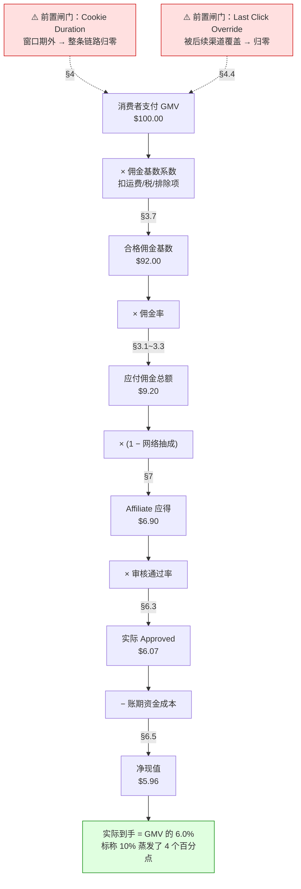

# 联盟角色与佣金模型

> **一句话定位**：本文回答两个问题——**这个体系里到底有哪些角色（含容易忽略的二级角色），以及钱是按什么规则算出来、什么时候能到手**。
>
> **核心结论先行**：Affiliate 的收益不是"佣金率 × 成交额"这么简单，而是
> `实际到手 = 归因成功率 × 佣金基数 × 佣金率 × 审核通过率 × (1 − 网络抽成) − 账期资金成本`。
> 五个乘数里任何一个塌陷，佣金率再高都没用。其中 **Cookie Duration** 与 **审核通过率** 是最容易被新手忽略的两个。
>
> **可信度标签**：`[标准]` 官方明文　`[政策]` 平台公开政策（标时点）　`[惯例]` 行业共识　`[推断]` 待验证推导
>
> 最后更新：2026-09-09

---

## 1. 角色全景

### 1.1 一级角色

见 [`Affiliate体系总览.md`](./Affiliate体系总览.md) §2.1（Merchant / Affiliate / Network / Consumer 四方模型）。本文只补充**容易被忽略的二级角色**。

### 1.2 二级角色（真实生态里赚钱的人往往在这里）

| 角色 | English | 干什么 | 赚什么钱 | 为什么重要 |
|---|---|---|---|---|
| **联盟经理** | Affiliate Manager（AM） | 网络侧对接推广者的人：审批准入、谈 Bump、给独家素材、处理争议 | 网络发的工资/提成 | **超级 Affiliate 的核心资源**。好的 AM 能拿到未公开的 Payout Bump、提前知道 Offer 变动、争议时帮你争取 |
| **商家侧联盟负责人** | Merchant-side Affiliate/Partner Manager | 商家内部管联盟渠道的人：定佣金、审推广者、防作弊 | 商家工资 | 决定你能不能进白名单、佣金能不能谈 |
| **子联盟 / 二级推广者** | Sub-affiliate | 招募并管理下游推广者，从下游业绩中抽成 | 下游佣金分成 | 把"做流量"变成"做组织"，是规模化的关键路径，但合规敏感（见 §3.5） |
| **联盟代理/中介** | Affiliate Agency / Broker | 代商家运营联盟渠道，或代大推广者谈判 | 服务费 / 分成 | 中大品牌常外包给代理（如 Impact 的服务层、独立代理公司） |
| **工具供应商** | Tool Vendor / SaaS | 提供追踪、落地页、竞品监控、关键词、素材情报工具 | 订阅费 | 生态的"卖水人"，收入稳定，见 §9 |
| **Offer 提供方（CPA 侧）** | Advertiser / Direct Client | CPA 网络里真正出钱的广告主 | 商品利润 | 直客（Direct）比经网络转手的 Offer 派款更高，Super Affiliate 追求直客 |
| **流量供应商** | Traffic Source | 卖流量的平台（Native/Push/Pop/社媒） | 广告费 | 买量型 Affiliate 的成本方，见 `../10_广告套利Arbitrage/` |

`[惯例]` **一条重要行业经验**：Affiliate 的收入天花板往往不取决于流量能力，而取决于**关系层级**。
同一个 Offer，普通推广者拿标准 Payout，超级 Affiliate 通过 AM 谈到的 Bump 可能高出 20%~50%，
甚至拿到 **Exclusive**（独家推广权）。这是 §7 要展开的内容。

---

## 2. 佣金计费模式全解

### 2.1 五种基础模式

| 模式 | English | 结算触发事件 | 谁承担转化风险 | 典型佣金量级 `[惯例]` | 适用品类 |
|---|---|---|---|---|---|
| **CPS** | Cost Per Sale / Revenue Share | 完成付款的成交 | 推广者承担到成交为止 | 售价的 3%~40%（数字商品/SaaS 高，实物零售低） | 电商、SaaS、旅游、保险 |
| **CPA** | Cost Per Action | 约定的动作（注册、下载、开卡、填表） | 推广者承担到动作为止 | 每动作 $0.5~$200+ | Lead Gen、金融、游戏、健康 |
| **CPL** | Cost Per Lead | 有效线索（邮箱+字段合格） | 商家承担后续转化 | 每条 $0.5~$50 | 保险、教育、贷款、家装、B2B |
| **CPI** | Cost Per Install | App 安装并激活（有时要求留存/注册） | 视是否要求后续事件 | 每安装 $0.3~$15（T1 高，T3 低） | 移动应用、游戏 |
| **CPC / CPM** | Cost Per Click / Mille | 点击或展示 | 商家承担 | 点击 $0.05~$2 | **严格说已不属于 Affiliate**，属 Ad Network |

### 2.2 风险归属：判断一个 Offer 好坏的第一性原理

```
风险从商家转移到推广者的程度：

CPM ──── CPC ──── CPI ──── CPL ──── CPA ──── CPS(+复购) ──── CPS(净收入分成)
商家全担                                          推广者全担
◄──────────────────────────────────────────────────────────►
```

**推论三条** `[推断]`：

1. **越靠右，Payout 单价越高，但转化率越低、丢单风险越大。** 高派款是风险对价，不是白送的钱。
2. **越靠右，对追踪准确性的依赖越强。** CPC 下丢一次点击只损失几分钱；CPS 下丢一次归因可能损失几十美元佣金。
   这解释了为什么资深 Affiliate 把大量精力花在追踪链路上（见 `联盟追踪技术与Postback.md`）。
3. **越靠右，商家越有动机扣量（Shaving）。** 因为单个转化的成本高，造假收益大。见 `联盟反作弊与扣量.md`。

### 2.3 混合模式

`[惯例]` 实际合约中纯模式少见，常见组合：

| 组合 | 结构 | 用意 |
|---|---|---|
| **Hybrid（CPA + CPS）** | 固定派款 $X + 成交额 Y% | 常见于 SaaS：注册给小额，付费再给分成。降低推广者的现金流压力 |
| **Tiered Hybrid** | 月成交 <N 单给 A%，≥N 单给 B% | 激励冲量 |
| **Base + Bonus** | 标准佣金 + 达标奖金（SPIFF） | 短期冲量活动，常见于季度促销 |
| **New Customer Only CPS** | 仅新客成交计佣，老客 0% 或折半 | 防优惠券站给老客发折扣套佣 |
| **CPL → CPA 升级** | 合格线索 $2，线索转化后追加 $30 | Lead Gen 常见，平衡推广者现金流与商家质量要求 |
| **Rev Share（游戏/博彩）** | 玩家净输额的 20%~50%，**可能是负数**（Negative Carryover） | 高风险高回报，负余额是否结转是关键条款 |

> **Rev Share 的 Negative Carryover 陷阱** `[惯例]`：
> 博彩/游戏类 Rev Share 里，如果玩家当月赢钱导致净收入为负，负余额可能**结转到下月**，
> 意味着你下个月即使带了新玩家也可能拿不到钱，直到把负数填平。
> 签约时必须确认条款是 "Negative Carryover" 还是 "No Negative Carryover"（后者每月清零，对推广者友好得多）。

---

## 3. 佣金结构的八个变量

同一个"CPS 10%"，实际收益可能差 5 倍。差别在以下八个变量。

### 3.1 固定 vs 比例（Flat vs Percentage）

| | Flat（固定派款） | Percentage（比例分成） |
|---|---|---|
| 形式 | 每单 $25 | 成交额 10% |
| 推广者偏好 | 低客单价时更有利（$50 商品给 $25 = 50%！） | 高客单价时更有利 |
| 商家偏好 | 成本可预测 | 与毛利挂钩，自动适配 |
| 风险 | 商家亏本风险（低价商品被套利） | 推广者收入随客单价波动 |
| 常见于 | CPA 网络、Lead Gen、订阅首月 | 电商、SaaS 长期分成 |

`[推断]` **Flat 派款 + 低客单价商品 = 套利高发区**。若一个 $30 的商品给 $25 固定佣金，
买量成本低于 $25 × 转化率的人就能无风险套利，商家会迅速被薅穿并下架 Offer。
看到 Flat 高派款要先问：商家为什么愿意付这么多？（通常是 LTV 远高于首单，如订阅制首月）

### 3.2 阶梯（Tiered / Volume-based）

```
示例结构（SaaS 常见）：
  月成交 1~10 单     → 20%
  月成交 11~50 单    → 25%
  月成交 51+ 单      → 30%
```

**关键问题**：阶梯是**全额累进**还是**超额累进**？
- 全额累进（达到 51 单，全部 51 单按 30% 算）→ 对推广者极其有利，冲量动力强
- 超额累进（只有第 51 单之后的部分按 30%）→ 激励弱得多

`[惯例]` 多数联盟计划用**全额累进**，但合约里常写得不清楚，签约时要确认。

### 3.3 循环佣金（Recurring Commission）—— SaaS 联盟的核心

**循环佣金**（Recurring Commission / Residual Commission）：用户每次续费，推广者都拿分成。

| | 一次性（One-time） | 循环（Recurring） |
|---|---|---|
| 结构 | 首单付一次 | 每月/每年续费都付 |
| 典型比例 | 20%~50% 首单 | 10%~30% 每月，持续 12 个月 / 24 个月 / **终身** |
| 代表 | 多数电商 | SaaS（ClickFunnels 曾给 30% 终身循环、GetResponse、SEMrush 等） |
| 收入形态 | 项目制，需持续拉新 | **资产型**，可积累 |
| 估值 | 低（纯一次性佣金站约 **20~30 倍**月净利润） | 高（循环佣金站约 **30~45 倍**月净利润）`[惯例]` |

**为什么循环佣金改变了一切** `[推断]`：
它把 Affiliate 从"流量生意"变成"资产生意"。假设某 SaaS 给 30% 终身循环，客单 $100/月：

```
第 1 个月带来 10 个付费用户 → 当月收入 $300
第 12 个月（假设月流失 5%，累计留存 ~54%）→ 仅这 10 人贡献 ~$162/月
第 24 个月 → 累计带来的用户仍在贡献 ~$88/月
```

即使停止推广，收入也不会归零。这是 SaaS Affiliate 与电商 Affiliate 的根本差异，
也是为什么大量内容站专注"best X software"类关键词。

> **反面**：循环佣金对商家是长期负债。近年不少 SaaS 把"终身循环"改为"12 个月循环"或直接改一次性，
> 属于 `[政策]` 变动，引用具体计划的条款务必核当期页面。

> **估值倍数的完整分型**（纯一次性 / 循环 / 纯广告 / 混合 / 付费会员，以及"邮件列表占收入 >30% 溢价 10%~20%"）
> 见 [`Niche站与内容站变现.md`](./Niche站与内容站变现.md) §7.1——**本目录的估值倍数以该表为唯一口径**，本文只给一次性 vs 循环的对照。
> 注意倍数与月利润**非线性**：月利润 $500 的小站倍数显著低于月利润 $20,000 的站，因为关键人依赖度与收入波动率更高。

### 3.4 二级分销（Sub-affiliate / 2-Tier）

推广者招募下游，从下游业绩抽成（如 5%~10%）。

- **优点**：把个人流量能力放大为组织能力，收入与被招募者数量挂钩。
- **风险** `[政策]`：多级分销在多个国家受反传销法规约束。美国 FTC 对"收入主要来自招募而非销售"的结构有明确执法先例；
  中国《禁止传销条例》对三级及以上计酬有明确认定标准。
  **两层（自己 + 直接下游）通常安全，三层及以上进入灰色地带。**
- 国内案例：花生日记、云集曾被认定为传销并处罚，是这条线的标志性事件。`[政策]`

`[惯例]` 主流海外网络（CJ、Impact、Awin）**多数不提供二级分销**，正因为合规风险；
提供二级分销的多是 CPA 网络或独立 SaaS 计划。看到强调"发展下线"的计划要提高警惕。

### 3.5 新客 vs 老客（New vs Returning Customer）

| 条款 | 含义 | 商家动机 |
|---|---|---|
| New Customer Only | 只有新客成交计佣 | 防止优惠券站/返利站给本来就要买的老客发折扣，套取佣金 |
| Blended | 新老客同率 | 简单，但易被套利 |
| Differentiated | 新客 15%，老客 5% | 折中，主流做法 `[惯例]` |

`[推断]` **这是判断一个联盟计划成熟度的最快指标**：
不区分新老客的计划，几乎必然被返利/优惠券站侵蚀，最终要么大幅降佣，要么整体排除这类推广者。
Amazon、Nike、Sephora 等大品牌历史上都走过"全率 → 差异化 → 排除 Coupon 站"的路径。

### 3.6 品类差异化费率（Category-differentiated Rate）

同一商家对不同品类给不同佣金率，通常与**毛利率**正相关：

```
典型逻辑（服饰电商示意）：
  自有品牌/高毛利品类   → 10%~15%
  第三方品牌/低毛利品类 → 2%~5%
  清仓/促销品           → 0%（排除计佣）
  礼品卡/电子产品       → 0%~1%（毛利极薄或易套利）
```

**Amazon Associates 的费率史** `[政策]`（**必须核当期官方表格**）：

Amazon 是品类差异化费率的典型，且历史上多次**大幅下调**：

- **2017 年 3 月**：从固定费率改为按品类差异化，多数品类下调，引入"标准 vs 高端"分层。
- **2020 年 4 月**：疫情期宣布大幅下调，多个品类降幅 40%~50%（如家具家居从 8% 降到 3%，健康个护从 5% 降到 1%，杂货从 5% 降到 1%）。这是 Affiliate 行业标志性事件，直接导致大量内容站收入腰斩、转型或关停。
- **当前量级**：多数实物品类落在 **1%~4.5%**，少数高毛利品类（如 Luxury Beauty、Amazon Games）可达 **10%** 左右。

> **政策时点：2026-09。Amazon 佣金表历史上至少变动 5 次以上，且按站点（US/UK/DE/JP/IN）分别设定。
> 本文给出的是量级与趋势，任何决策必须以当期 Amazon Associates Operating Agreement 的费率表为准。**

**这个案例的教训** `[惯例]`：**把业务建立在单一商家的佣金政策上，等于把命脉交给别人。**
成熟的 Affiliate 会做「Offer 组合分散」——同一品类接 3~5 个商家，任何一家降佣都不致命。

### 3.7 佣金基数（Commission Base）—— 最容易吃亏的细节

"10% 佣金"的 10% 是算在什么上面？

| 基数口径 | 含义 | 对推广者 |
|---|---|---|
| Gross Order Value | 订单总额（含运费、税） | 最有利 |
| Net Order Value | 扣除运费、税、折扣后 | 常见 |
| Product Subtotal | 仅商品小计 | 常见 |
| **Excluding excluded items** | 再排除礼品卡、特定品牌、第三方卖家商品 | **最不利，且常在细则里** |

`[惯例]` Amazon Associates 明确排除运费、税、礼品卡、部分第三方卖家商品。
实际有效佣金率往往比标称低 15%~30%。**签约前必须读 "Commission Base" / "Qualifying Purchase" 定义那一段。**

### 3.8 佣金上限（Cap）

- **Per-order Cap**：单笔订单佣金封顶（如"每单最高 $50"），防止高客单价订单成本失控。
- **Per-affiliate Cap**：单个推广者月度封顶，常见于 CPA Offer（见 §7.4）。
- **Program-wide Cap**：整个计划的月度预算封顶，达到后停止计佣。`[惯例]` 这个最坑，因为推广者通常不会被告知。

---

## 4. Cookie Duration：联盟经济学的核心变量

### 4.1 定义与机制

**Cookie Duration**（联盟窗口期 / Attribution Window / Cookie Life）
= 从用户点击联盟链接那一刻起，多长时间内发生的转化仍归因给该 Affiliate。

机制拆解：

```
T+0        用户点击联盟链接
           → 跳转到 Network 的追踪服务器
           → Network 在自己域名下写入 Cookie（含 Affiliate ID、Click ID、时间戳）
           → 302 重定向到商家落地页

T+x 天     用户在商家站下单
           → 商家页面加载 Network 的转化 Pixel（或商家服务端发 Postback）
           → Pixel 尝试读取之前写的 Cookie / 或携带 Click ID
           → Network 检查：x ≤ Cookie Duration？
              是 → 归因给该 Affiliate，进入 Pending
              否 → 视为自然流量，不计佣
```

### 4.2 常见窗口期

| 窗口期 | 典型场景 | 代表 `[政策]`（需核当期条款） |
|---|---|---|
| **Session-only / 数小时** | 低价快消、闪购 | 少数促销计划 |
| **24 小时** | 高频低决策成本电商 | Amazon Associates（加入购物车可延长至 90 天） |
| **7 天** | 快时尚、外卖、部分 CPA Offer | 大量 CPA 网络的标准配置 |
| **14 天** | 中端电商 | 常见 |
| **30 天** | **行业主流** | 多数零售联盟计划 |
| **60 天** | 数字商品、课程 | ClickBank 历史上以 60 天著称 |
| **90 天** | 高决策成本：旅游、B2B、教育 | 部分旅游与 SaaS 计划 |
| **终身 / 循环** | SaaS 订阅续费 | Recurring 计划（见 §3.3） |

### 4.3 敏感性测算：窗口期缩短对收益的影响

`[推断]` 以下模型假设「点击到转化的时间间隔 D 服从指数分布，均值 μ」，
则窗口期为 w 时能捕获的转化比例为：

```
捕获率 = P(D ≤ w) = 1 − e^(−w/μ)
```

**场景一：冲动型消费**（快消、闪购、低价 App，μ ≈ 1 天）

| 窗口期 | 捕获率 | 相对 30 天的收益 |
|---|---|---|
| 24 小时 | 63.2% | 63% |
| 7 天 | 99.9% | ~100% |
| 30 天 | ~100% | 100% |

→ **结论：冲动型品类里，窗口期从 30 天缩到 7 天几乎无损失；缩到 24 小时才明显掉。**

**场景二：考虑型消费**（服饰、家居、中端电子，μ ≈ 7 天）

| 窗口期 | 捕获率 | 相对 30 天的收益 |
|---|---|---|
| 24 小时 | 13.3% | 14% |
| 7 天 | 63.2% | 64% |
| 30 天 | 98.6% | 100% |
| 90 天 | ~100% | 101% |

→ **结论：这是最敏感的场景。窗口期从 30 天砍到 7 天，收益直接掉约 36%。**

**场景三：高决策成本**（B2B SaaS、旅游、教育、保险，μ ≈ 20 天）

| 窗口期 | 捕获率 | 相对 90 天的收益 |
|---|---|---|
| 7 天 | 29.5% | 30% |
| 30 天 | 77.7% | 79% |
| 90 天 | 98.9% | 100% |

→ **结论：B2B/旅游类必须要长窗口。30 天窗口会损失约 1/5 的真实转化。**

**模型的局限（必须说清）** `[推断]`：
1. 真实分布不是指数分布，而是**重尾**的——有相当比例用户在点击后 30~60 天才转化（比价、等促销、等发薪日）。指数分布会低估长窗口的价值。
2. μ 因品类、地区、季节差异极大。黑五期间 μ 会显著缩短（冲动+限时），旅游旺季前 μ 会拉长。
3. 该模型只算"捕获率"，没算"窗口越长 → 被后续渠道覆盖的概率越高"这个反向效应（见 §4.4）。

**验证方法**：拉自己账户的 Click-to-Conversion Time 分布直方图，按天分桶，直接看累计分布曲线。
这是唯一可靠的做法，模型只能给量级直觉。

### 4.4 Override：后点击覆盖前点击

`[惯例]` 绝大多数联盟计划采用 **Last Click 覆盖规则**：
窗口期内如果用户又点了**另一个** Affiliate 的链接，归因会转移给后者，前者的 Cookie 被覆盖（Override）。

```
Day 0:  用户点击 A 的测评文章链接    → 写 Cookie(A)，窗口 30 天
Day 3:  用户点击 B 的优惠券站链接     → 写 Cookie(B)，覆盖 A
Day 5:  用户下单                      → 佣金归 B，A 一无所获
```

**这个规则的商业后果极其深远**：

1. **优惠券站、返利站、浏览器插件天然是"最后一公里收割者"**。
   用户在结账前搜"XX promo code"、或被插件自动注入优惠码，归因就被抢走了。
   这是 §3.5 里商家做"New Customer Only"和排除 Coupon 站的根本原因。
2. **内容站的实际贡献被系统性低估**。用户可能读了 A 的深度测评做了决策，
   但结账时被 B 截胡。A 创造了需求，B 拿走了佣金。
3. **由此产生了长期博弈**：内容站要求商家给"内容型推广者"更长的窗口或**不可被覆盖的归因优先级**（部分平台已支持按推广者类型设优先级）。`[惯例]`

> **签约时要问的三个问题**：
> ① Cookie Duration 多久？② 是 Last Click Override 还是有优先级规则？③ Coupon/Cashback 类推广者是否被排除或降级？

### 4.5 Click-through vs View-through

| | Click-through（点击归因） | View-through（曝光归因，VTC） |
|---|---|---|
| 触发 | 用户点击了链接 | 用户只看到（如展示广告、社媒曝光） |
| 窗口期 | 7~90 天 | 通常 24 小时~7 天 |
| 在 Affiliate 里 | **绝对主流** | 少见（因 Affiliate 按点击计费，曝光难核实） |
| 争议 | 少 | 大（容易虚增，见 `../07_追踪Cookie与归因/归因模型总览.md`） |

`[惯例]` Affiliate 世界基本只认 Click-through。这与程序化展示广告（大量使用 VTC）形成鲜明对比，
也是"Affiliate 数据比展示广告数据更可信"的一个原因。

### 4.6 商家为什么在缩短窗口期

`[推断]` 四个动机，按强度排序：

1. **降低非增量支付**。窗口越长，越多"本来就会买"的订单被算作联盟贡献。缩短窗口是提高增量比的直接手段。
2. **对抗 Coupon/插件截胡**。短窗口 + Last Click 组合下，截胡者必须在更接近成交时出现，商家可以据此识别并排除。
3. **财务口径压力**。长窗口意味着月末有大量 Pending 负债，缩短窗口改善财务可预测性。
4. **隐私合规**。第三方 Cookie 与跨站追踪受限后，长窗口的技术可行性本身在下降（Safari ITP 对第三方 Cookie 有 7 天上限，且脚本写入的 Cookie 更短）。`[标准]`

> **Safari ITP 的技术硬约束** `[标准]`：WebKit 的 Intelligent Tracking Prevention 对
> **由脚本写入的第一方 Cookie**（document.cookie）设置 7 天有效期上限；
> 被分类为跨站追踪者的域名，其 Cookie 会被直接阻止。
> 这意味着在 Safari 上，即使商家声称 30 天窗口，实际归因能力也可能只有 7 天或更短。
> 应对方式是**服务端写 Cookie + Click ID 参数透传 + S2S Postback**，见 `联盟追踪技术与Postback.md`。

---

## 5. 归因优先级与冲突处理

当多个来源都声称拥有同一个转化时，谁赢？

### 5.1 网络内部去重

`[惯例]` 同一 Network 内多个 Affiliate 都在窗口期内有过点击 → **Last Click 胜出**，前者被 Override。

### 5.2 跨网络冲突

用户在 CJ 点了链接，又在 Impact 点了链接，最后成交 → **谁的 Pixel 先被商家部署/谁的技术先记录**，
以及商家自己的归因配置决定。这是**联盟渠道最混乱的场景**，因为两个网络互相看不见对方的点击。

`[推断]` 成熟商家会部署**自有归因层**（server-side tracking + 统一 click_id），
让所有网络的转化都先回到自己的系统做统一 Last Click 判定，再分别回传给各网络。
这能避免"双重计佣"，也是大品牌联盟管理的技术标志。

### 5.3 与 SAN（自归因网络）冲突

用户先点了 Affiliate 链接，后又点了 Google/Meta 广告，最后成交：

- Google/Meta 会按自己的归因口径报一次转化；
- Affiliate 网络也会报一次。
- **同一次销售被计了两次成本。**

`[惯例]` 商家的处理方式通常是：**规定优先级顺序**（如 Paid Search > Affiliate > Display），
或用 MMP/归因平台做统一裁决。移动端则由 MMP（AppsFlyer/Adjust）按预设优先级裁决，
见 `../07_追踪Cookie与归因/MMP移动归因平台.md`。

### 5.4 优惠券码归因（Code-based Attribution）

部分商家支持"用户输入优惠码即归因给该 Affiliate"，不依赖 Cookie。

- **优点**：完全绕开 Cookie 与浏览器限制，跨设备有效。
- **缺点**：**极易被劫持**。浏览器插件自动填码、 Coupon 站公开码、
  甚至结账页弹窗推荐码，都会把归因抢走。`[惯例]`
- 商家的对策：只允许**未公开的唯一码**（Unique Code per Affiliate），并禁止插件类推广者使用码归因。

---

## 6. 结算机制：钱什么时候真到手

### 6.1 结算时间线

```
转化发生
  ↓
【Pending】进入待审核状态              ← 此期间商家可 Reversal
  ↓ 商家审核期（通常 30~60 天，覆盖退货期）
【Approved】审核通过，计入可结算余额
  ↓ 账期（Net-20 / Net-30 / Net-60，从月末算起）
【Payable】到达可支付状态
  ↓ 检查是否达到 Payment Threshold
【Paid】实际打款
```

**从点击到收款的总时长** `[惯例]`：

| 环节 | 典型时长 |
|---|---|
| 点击 → 转化 | 0~30 天（Cookie Duration） |
| 转化 → Approved | 30~60 天（商家审核/退货期） |
| Approved → Payable | 20~60 天（Net terms） |
| Payable → Paid | 数天（达到起付额后） |
| **合计** | **50~150 天** |

### 6.2 起付额（Payment Threshold）

`[政策]`（**以各平台当期条款为准，以下为量级参考**）

| 平台 | 起付额量级 | 备注 |
|---|---|---|
| Amazon Associates | 约 $10（礼品卡）/ $100（银行转账） | 门槛低，适合新人 |
| ShareASale / Awin | 约 $50 | Awin 历史上还有接入押金 |
| CJ Affiliate | 约 $50 | — |
| Impact | 约 $25 | 门槛较低 |
| CPA 网络 | $50~$500 不等 | 部分网络对新账户设更高门槛或要求预付流量证明 |

**Threshold 的隐形影响** `[推断]`：
若起付额 $100 而你月均只赚 $40，需要 3 个月才能拿到第一笔钱；
若此时账号因违规被封，**未达起付额的余额通常不予支付**。这是新人常踩的坑。

### 6.3 Reversal / Chargeback：佣金被收回

| 触发原因 | English | 说明 | 是否可申诉 |
|---|---|---|---|
| 退货退款 | Refund / Return | 最常见，正常商业损耗 | 一般不可 |
| 信用卡拒付 | Chargeback | 用户向发卡行争议交易 | 可，但需商家配合 |
| 订阅取消 | Cancellation | Recurring 计划中用户退订 | 一般不可 |
| 判定欺诈 | Fraud | 商家风控判定订单欺诈 | 可 |
| **判定推广违规** | Terms Violation | 商家认为你用了禁止的推广方式（如 Brand Bidding、Cloaking、虚假宣称） | 可，但成功率低 |
| 无效线索 | Invalid Lead | CPL 里字段不合格、重复、无法联系 | 可，需看审核标准是否透明 |

**Approval Rate（通过率）是识别扣量的核心指标**：

```
Approval Rate = Approved / (Approved + Reversed)
（注意：Approval Rate = 1 − Reversal Rate，两者是同一件事的两种说法，不可混用区间）

健康区间 [惯例]：
  电商 CPS     > 85%（Reversal 5%~15%，由退货率决定）
  Lead Gen CPL  70%~90%（低于 70% 要警惕审核标准不透明）
  CPA 试用类    20%~50%（Reversal 50%~80%，Trial Offer 天然极低，见 §7.5）

危险信号（⚠️ 本条不适用于 Trial 类，其健康区间本就在 60% 以下）：
  通过率 < 60% 且商家不给出具体 Reversal 理由 → 高度疑似扣量（Shaving）
  通过率随时间单调下降 → 商家在收紧审核或开始扣量
  某几个 Sub ID 通过率异常低 → 你的某个流量源质量问题，不是扣量
  Trial 类的判据应改为：通过率 < 20%，或显著低于 AM 承诺值 → 才疑似扣量
```

### 6.4 支付方式与税务

| 方式 | 适用 | 成本 | 备注 |
|---|---|---|---|
| PayPal | 小额、个人 | 费率较高（跨境 4%+） | 部分网络已不支持 |
| 银行电汇 Wire | 大额 | $15~$40/笔手续费 | 大额首选 |
| Payoneer / Wise | 跨境个人 | 低于传统电汇 | 中国 Affiliate 常用 |
| ACH（美国境内） | 美国主体 | 低 | — |
| 加密货币 | 部分 CPA 网络 | 低 | 波动与合规风险 |

**税务要点** `[政策]`（**非税务建议，需咨询专业人士**）：

- **美国主体**：年收入超阈值会收到 1099-NEC，需自行申报自雇税。
- **非美国主体**：需填 **W-8BEN**（个人）或 **W-8BEN-E**（实体），声明非美国税务居民，
  避免被预扣 30% 美国税。中美有税收协定，但**佣金收入是否属于协定覆盖范围要具体判断**。
- **欧盟**：涉及 VAT，跨境 B2B 服务有反向征收（Reverse Charge）机制。
- **中国主体收境外佣金**：属于服务出口/个人劳务报酬，涉及增值税、个税、外汇结汇合规。
  通过 Payoneer/Wise 收款再结汇是常见路径，但**大额持续收入应做主体合规规划**。

### 6.5 现金流模型（买量型必看）

```
现金流出（当天）：流量成本 CPC × Clicks
现金流入（T+50~150 天）：佣金 × Approval Rate

资金占用峰值 ≈ 日均流量成本 × 平均回款天数

示例：日投 $500，平均回款 90 天
     → 需垫资 ≈ $500 × 90 = $45,000
     → 若毛利 20%，年周转资金回报率尚可，但一次账号封禁或 Offer 下架即可能现金流断裂
```

`[惯例]` **这是买量型 Affiliate 的第一死因**，不是投不出去，而是账期错配。
应对方式：优先选**回款快的网络**（部分 CPA 网络支持周结甚至日结，但派款率更低）、
控制日投放规模不超过可垫资额的 1/90、保留 3 个月现金流缓冲。

---

## 7. 网络抽成结构：100 元追踪法

### 7.1 三种收费模式

| 模式 | English | 机制 | 商家看到的成本 | Affiliate 拿到 | 透明度 |
|---|---|---|---|---|---|
| **加价/溢出** | Override / Markup | 商家付 X+Y%，Affiliate 得 X%，网络留 Y% | 明确知道总成本 | 明确知道自己那份 | 高（合约写明） |
| **毛利差** | Margin / Rev Share | 商家付网络 Z%，网络付 Affiliate X%，网络留 (Z−X)% | 只知道自己付了 Z% | 只知道拿到 X% | **低**（双方互不知对方数字） |
| **接入费/订阅费** | Access Fee / SaaS Fee | 商家付固定月费 + 每笔交易费，佣金 100% 给 Affiliate | 固定可预测 | 全额佣金 | 最高 |

### 7.2 典型量级 `[惯例]`（**区间，非精确值，需按合约核实**）

```
Margin / Override 型网络：网络留存通常为 Affiliate 佣金的 20%~30%
  → 若 Affiliate 得 10% 佣金，商家实付约 12%~13%
SaaS 型平台（Impact、PartnerStack、Rewardful 等）：
  → 月费 $500~$3,000+（视规模）+ 每笔交易费 或 按 GMV 分层
  → 佣金不分走，商家付全额给 Affiliate
接入押金：部分网络对新 Affiliate 收 $500~$3,000 押金（Awin 历史上采用过）
```

### 7.3 100 元追踪法（示例演算）

**场景**：用户在 Affiliate 内容站点击链接，到商家买了 $100 的商品，佣金率 10%，网络用 Margin 模式抽 25%。

```
消费者支付                          $100.00
  ↓
商家 GMV                            $100.00
  ↓ 佣金基数扣除（运费/税/排除项，假设 8%）
合格佣金基数（Qualifying Base）      $ 92.00
  ↓ 佣金率 10%
应付佣金总额                         $  9.20
  ↓ 网络抽成 25%（Margin）
  ├─ 网络留存                        $  2.30
  └─ Affiliate 应得                  $  6.90
  ↓ 审核通过率 88%（退货/拒付/违规）
Affiliate 实际 Approved              $  6.07
  ↓ 账期 90 天资金成本（年化 8%）
Affiliate 净现值                     $  5.96
```

**结论**：标称"10% 佣金"，Affiliate 实际到手约为 GMV 的 **6.0%**。
中间蒸发的 4 个百分点分别来自：基数扣除（0.8）、网络抽成（2.3）、审核损耗（0.83）、账期成本（0.11）。

`[推断]` **这个演算的实用价值**：谈判时不要只盯着佣金率。
把网络抽成从 25% 谈到 15%，等效于佣金率从 10% 提到 11%——但前者往往更容易谈成，因为它不在公开费率表里。

### 7.4 Offer 侧关键条款（CPA 网络语境）

| 条款 | English | 含义 | 对推广者的影响 |
|---|---|---|---|
| **派款** | Payout | 单个转化的固定报酬 | 越高越好，但要与转化率一起看（EPC = Payout × CR） |
| **上限** | Cap（Daily/Monthly） | 每日/每月最多计多少个转化 | 超量部分不计酬，规模化前必须确认 |
| **独家** | Exclusive | 只允许你（或少数几家）推 | 竞争小、可谈更高 Payout，通常要求保底量 |
| **地区限制** | Geo Targeting | 只接受特定国家的转化 | T1 派款高但竞争与合规严；T3 派款低但转化易 |
| **加价** | Payout Bump | 在标准派款上额外加成 | **Super Affiliate 的核心特权**，靠 AM 关系与量级谈 |
| **试用类** | Trial Offer | 用户只需付运费/领试用即算转化 | 派款低但转化率极高；**Reversal 率也极高**（见 §7.5） |
| **保底** | Minimum / Guarantee | 承诺最低投放量以换取条件 | 达不到要赔付，慎签 |
| **白名单** | Whitelist | 允许特定推广方式（如某些流量源） | 未在白名单的方式用了会被拒付 |

### 7.5 Trial Offer 的经济学陷阱

`[惯例]` Trial Offer（如"$1 试用 7 天，之后自动订阅 $49/月"）是 CPA 网络的高频品类：

```
表面：Payout $40，转化率 15%（远高于普通 Offer 的 2%）
     → EPC = $40 × 15% = $6.00   看起来极诱人

实际：
  Reversal 率可达 50%~80%（用户试用后取消订阅、拒付）
  → 有效 EPC = $6.00 × (1 − 60%) = $2.40
  且 Reversal 发生在 30~60 天后，期间你已经垫付了流量成本
  → 现金流风险极高
```

**判断方法**：
1. 问 AM 要该 Offer 的**历史 Approval Rate**，不要只看 Payout；
2. 小预算跑 7~14 天，等第一批 Reversal 数据回来再决定是否放量；
3. 检查条款里 Trial 转 Full Purchase 是否有**额外派款**（好的 Offer 会给）。

---

## 8. 单位经济：佣金模型怎么决定赚不赚钱

### 8.0 佣金漏损瀑布图

标称佣金率与实际到手之间，隔着五个乘数。这张图是本文所有算例的骨架：



**读图要点** `[推断]`：

1. **五个乘数是串联的**，任何一个塌陷，后面全废。佣金率只是第二环。
2. **两个前置闸门（虚线）在链路之外**——归因窗口与 Override 规则决定这次转化**能不能进入**这条链路。
   它们造成的损失在后台报表里**完全不可见**（你只会看到"没有转化"，不会看到"转化了但没算给我"）。
   这正是 §4 单独成节、篇幅最长的原因。
3. **谈判优先级应按漏损大小排序**，而不是按佣金率：
   网络抽成（2.3）> 审核损耗（0.83）> 基数扣除（0.8）> 账期（0.11）。
   但网络抽成不在公开费率表里，所以实际可谈的往往是审核标准透明化与基数定义。

### 8.1 通用公式

```
【免费流量型（内容站/SEO/社媒/邮件）】
月利润 = 月流量(UV) × 外链点击率 × 转化率 × 佣金基数 × 佣金率 × 通过率 × (1 − 网络抽成)
        − 内容生产成本 − 工具订阅 − 人力

【买量型（Media Buying）】
单笔利润 = Payout × 通过率 − CPC / 落地页转化率
日利润   = 日点击量 × (EPC_有效 − CPC) − 固定成本
盈亏平衡 = EPC_有效 ≥ CPC
        其中 EPC_有效 = Payout × CR × Approval Rate
```

### 8.2 算例一：内容站（Niche 站）

```
假设：
  月自然流量        50,000 UV
  外链点击率        12%          → 6,000 clicks
  商家转化率        3%           → 180 orders
  客单价            $60
  佣金基数扣除      8%           → $55.2
  佣金率            8%           → $4.42/order
  通过率            88%          → $3.89/order
  网络抽成          25%          → $2.92/order

月收入 = 180 × $2.92 = $525
成本   = 内容外包 $300 + 工具 $80 + 主机 $20 = $400
月利润 = $125

→ 结论：这个规模的站几乎不赚钱。
  要么把流量做到 200k+，要么提高客单价/佣金率品类，
  要么叠加邮件列表与广告位（多条变现腿）。
```

`[推断]` **这个算例的价值**：解释了为什么"月入 5 万 UV 的 Niche 站"在行业里被认为是**失败案例**而非成功。
内容站的盈利门槛比新手想象的高一个数量级——通常需要 15 万~50 万月 UV，或者切高客单价品类（金融、SaaS、旅游）。

### 8.3 算例二：买量型（CPA Offer）

```
假设：
  Offer Payout      $45（CPA，Lead Gen）
  流量源 CPC        $0.35（Native Ads，T2 地区）
  落地页转化率      9%（Pre-lander 40% → Lander 22.5%）
  Approval Rate     75%

EPC_有效 = $45 × 9% × 75% = $3.04
单笔毛利 = $3.04 − $0.35 = $2.69  →  毛利率 88%？

⚠️ 这个结果好得不真实，必须检查：
  ① Approval Rate 75% 是历史值还是 AM 口头承诺？
  ② 有没有 Cap？日超 50 个转化后不计酬 → 规模化即失效
  ③ Reversal 发生在 45 天后 → 需垫资 45 × 日消耗
  ④ 素材衰减：CR 9% 通常维持 1~3 周，之后掉到 4%~5%
     → CR 掉到 5% 时 EPC = $1.69，毛利仍有，但 ROAS 减半
  ⑤ 账户封禁风险：一次封号损失全部未结余额
```

### 8.4 敏感性：哪个变量最脆弱

`[推断]` 对买量型做单变量 ±20% 敏感性分析（基准见 §8.3）：

| 变量 | −20% 后 | 单笔毛利变化 | 脆弱度 |
|---|---|---|---|
| Approval Rate | 75%→60% | $3.04→$2.43，毛利 −23% | ★★★ |
| 落地页转化率 | 9%→7.2% | $3.04→$2.43，毛利 −23% | ★★★ |
| Payout | $45→$36 | $3.04→$2.43，毛利 −23% | ★★★ |
| CPC | $0.35→$0.42 | 毛利 $2.69→$2.62，−3% | ★ |

→ **结论：CPC 是最不敏感的变量，转化率与通过率才是命门。**
这与新手的直觉相反——新手每天盯 CPC 出价，老手每天盯 CR 与 Approval Rate。

---

## 9. 国内 vs 海外：佣金模型对照

| 维度 | 海外 | 国内（淘客体系） |
|---|---|---|
| 主流计费 | CPS 为主，CPA/CPL 生态活跃 | 几乎全 CPS |
| 佣金率区间 `[政策]` | 电商 1%~15%，SaaS 20%~50%（含循环） | 淘宝客 0.5%~50%（商家自设，多数 3%~20%） |
| 额外抽成 | 网络 Margin / Override（20%~30%） | 平台抽**技术服务费**（如淘宝联盟历史上约 10%），另有内容渠道分成 |
| 归因窗口 | 7~90 天，24h/30d 最常见 | 点击后约 15 天（各平台不同，需核当期规则） |
| 二级分销 | 少数网络支持，合规敏感 | 曾普遍（花生日记模式），后被监管收紧 |
| 循环佣金 | SaaS 常见，是核心卖点 | 几乎没有（电商为主，无订阅制基础） |
| 结算周期 | Net-20/30/60 + Threshold | 通常月结，次月确认收货后结算，周期更短 |
| 起付额 | $10~$500 | 较低（如 ¥10 起） |
| 支付方式 | PayPal / Wire / Payoneer | 支付宝 / 银行卡，境内结算 |
| 税务 | W-8BEN / 1099 / VAT | 平台代扣或自行申报，个税与增值税 |
| 数据透明度 | 网络后台给 EPC/CR 聚合数据 | 平台后台数据较封闭，跨店对比困难 |
| 追踪标识 | Affiliate ID + Sub ID + Click ID | PID（mm_xxx_yyy_zzz 三级）+ 淘口令 |
| 优惠券站地位 | 被大量品牌排除或降佣 | 曾是主流（返利网、一淘），后受平台政策与商家态度压制 |

**结构性差异的根源** `[推断]`：
海外是**多商家开放网络**，推广者可以在几十个品牌间比价选 Offer，网络之间也有竞争，
所以佣金率与条款是市场化博弈的结果，推广者有议价空间（Bump、Exclusive）。
国内是**单平台自营闭环**，商家在平台内设定佣金，平台既当撮合方又当规则制定方，
推广者几乎没有议价对象，只能被动接受费率调整——这也是国内淘客生态利润率长期承压的制度性原因。

---

## 10. 常见误解

**❌ 误解 1：佣金率高 = 赚钱多。**
✅ 正确：`收入 = 流量 × CR × 佣金基数 × 佣金率 × 通过率 × (1−网络抽成)`。
佣金率只是六个乘数之一。高佣金率往往伴随低转化率、高 Reversal 或低客单价。

**❌ 误解 2：Cookie 窗口期越长越好，没有坏处。**
✅ 正确：长窗口对推广者有利，但会带来两个反向效应——
① 更容易被后续渠道 Override；② 商家会因此认为你贡献的是非增量订单，长期看会降佣或排除你。
最优解是"合理窗口 + 高质量前置流量"。

**❌ 误解 3：Approval Rate 低说明我流量质量差。**
✅ 正确：也可能是商家扣量。区分方法：拆 Sub ID 看分布——
若所有流量源通过率**均匀偏低**，疑似系统性扣量；若只有某一两个源偏低，是你的流量问题。
见 `联盟反作弊与扣量.md`。

**❌ 误解 4：Recurring Commission 是永久被动收入。**
✅ 正确：受三个衰减因子影响——用户流失（Churn）、商家改条款（历史上大量 SaaS 把终身循环改为 12 个月）、
你自己停止带新客导致存量池萎缩。它是**折旧资产**，不是永续年金。

**❌ 误解 5：网络抽成是固定的、不可谈的。**
✅ 正确：Override/Margin 结构在合约里，量级达到一定水平后可以谈。
Super Affiliate 的实际净佣金率常显著高于新人。见 §7.3。

**❌ 误解 6：Trial Offer 转化率高所以是好 Offer。**
✅ 正确：要看 Reversal 后的有效 EPC 与现金流占用。见 §7.5，很多 Trial Offer 的有效收益为负。

**❌ 误解 7：Amazon 佣金率低所以不值得做。**
✅ 正确：Amazon 的价值不在佣金率，而在**极高的转化率与信任度**——
用户已经准备买，Amazon 的 CVR 远高于独立站。低率 × 高转化 × 高客单，EPC 未必差。
但它 24 小时窗口 + 频繁降佣，只适合作为组合里的一条腿，不适合作为唯一依赖。

**❌ 误解 8：签约时看佣金率就够了。**
✅ 正确：必须读的四个条款段落——**Commission Base 定义**（§3.7）、**Cookie Duration 与 Override 规则**（§4.4）、
**Reversal 与违规认定标准**（§6.3）、**禁止的推广方式清单**（Brand Bidding、Cloaking、Incentivized Traffic 等）。
这四段决定了你实际能拿到多少钱，以及会不会被封号。

---

## 11. 延伸追问

1. **点击之后到佣金入账，中间哪些环节会丢单？各自怎么诊断？**
   → `联盟追踪技术与Postback.md`（P2 阶段）
2. **怎么系统性地识别一个网络是否在扣量？**
   → `联盟反作弊与扣量.md`（P5 阶段）
3. **同一批流量，接 CPS 还是接 CPA 更划算？怎么算等价点？**
   → 本文 §8.1 公式可直接推：`等价条件：Payout_CPA = AOV × 佣金率 × 通过率_CPS / 通过率_CPA`
4. **循环佣金站的估值倍数为什么比一次性佣金站高？**
   → `Affiliate单位经济与规模化.md`（P5 阶段）
5. **商家侧：怎么设计佣金结构才能既吸引优质内容站，又不被优惠券站薅？**
   → 本文 §3.5 + §4.4，以及 `../07_追踪Cookie与归因/增量实验与因果归因.md`

---

## 12. 相关文档

- 体系与角色全景 → [`Affiliate体系总览.md`](./Affiliate体系总览.md)
- 追踪链路技术细节 → [`联盟追踪技术与Postback.md`](./联盟追踪技术与Postback.md)
- 网络抽成与准入对比 → [`主流联盟网络盘点.md`](./主流联盟网络盘点.md)
- Offer 条款与 Payout → [`CPA网络与Offer市场.md`](./CPA网络与Offer市场.md)
- Amazon 佣金史与电商联盟 → [`电商Affiliate与亚马逊联盟.md`](./电商Affiliate与亚马逊联盟.md)
- 扣量与作弊博弈 → [`联盟反作弊与扣量.md`](./联盟反作弊与扣量.md)
- 规模化与单位经济 → [`Affiliate单位经济与规模化.md`](./Affiliate单位经济与规模化.md)
- 归因模型原理 → [`../07_追踪Cookie与归因/归因模型总览.md`](../07_追踪Cookie与归因/)
- Cookie 与浏览器限制 → [`../07_追踪Cookie与归因/Cookie原理与分类.md`](../07_追踪Cookie与归因/)
- 拍卖与计费的对比视角 → [`../03_业务逻辑与商业模式/计费模式演进-从CPM到oCPX.md`](../03_业务逻辑与商业模式/)

> **政策时点声明**：本文所有具体佣金比例、起付额、账期、平台条款均为**量级参考**，
> 标注 `[政策]` 处尤需核对当期官方文档。联盟行业条款变动频繁，
> Amazon Associates 佣金表、各 SaaS 的循环佣金政策历史上均多次大幅调整。
> 最后复核：2026-09-09
