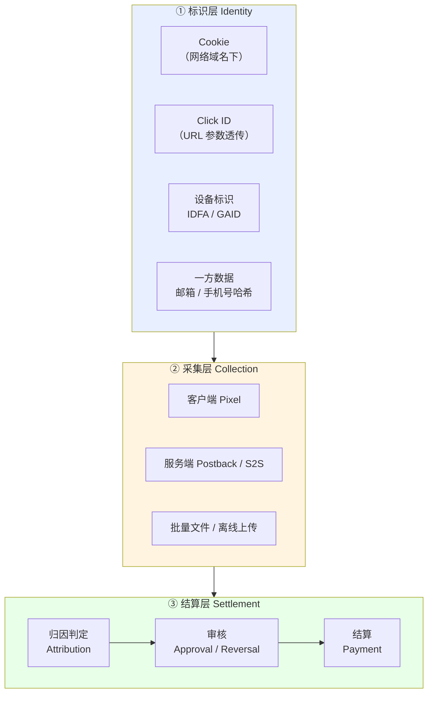
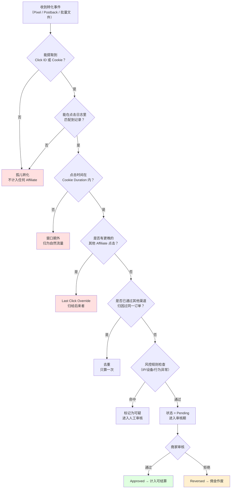
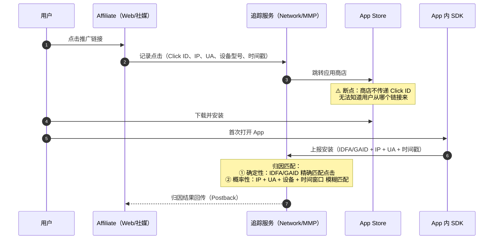
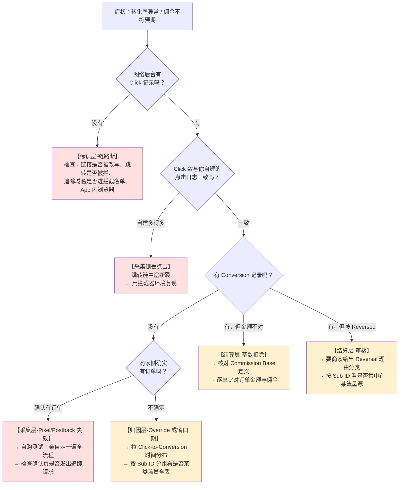

# 联盟追踪技术与 Postback

> **一句话定位**：本文回答联盟体系里最要命的一个技术问题——**用户点了你的链接、也真的买了东西，为什么佣金没记上？**
>
> **核心结论先行**：从"点击"到"佣金入账"要穿过 **7 个技术环节、17 个已知丢单点**。
> 其中至少 6 个丢单点在后台报表里**完全不可见**——你只会看到"没有转化"，看不到"转化了但没归因给我"。
> 所以联盟追踪的第一课不是"怎么埋点"，而是**"怎么让丢单可被观测"**：Sub ID 分维度透传 + 自建点击日志 + 与网络后台逐日对账。
>
> **可信度标签**：`[标准]` 官方明文　`[政策]` 平台公开政策（标时点）　`[惯例]` 行业共识　`[推断]` 待验证推导
>
> 最后更新：2026-09-10

---

## 1. 追踪体系全景：三层结构

联盟追踪不是一件事，是三层叠起来的：



| 层 | 回答的问题 | 失效后果 | 可控性 |
|---|---|---|---|
| **① 标识层** | 这次转化对应哪一次点击？ | 无法匹配 → 归因丢失 | **低**（受浏览器、隐私法规、平台策略支配） |
| **② 采集层** | 转化事件怎么被记录下来？ | 事件没上报 → 佣金不存在 | **中**（取决于商家的技术部署质量） |
| **③ 结算层** | 记下来的转化算给谁、算多少钱？ | Override / 审核拒绝 / 扣量 | **低**（规则由商家与网络制定） |

`[推断]` **这三层的失效模式完全不同，但新手常混为一谈**：
- 第①层失效是**技术性的、无恶意的**（浏览器拦了 Cookie），损失分散且难以追责；
- 第②层失效是**部署性的**（商家没埋对 Pixel），可以要求商家修；
- 第③层失效可能是**策略性的甚至恶意的**（Override、扣量），需要审计与谈判。

诊断丢单时必须先定位在哪一层，否则会把浏览器问题当成商家作弊去投诉，白费力气。

---

## 2. 联盟链接解剖

### 2.1 典型链接结构

各网络的链接格式不同，但**信息结构是统一的**。以几个真实形态为例（URL 为结构示意，非实际可用链接）：

```
# Awin / ShareASale 形态
https://www.awin1.com/cread.php
  ?awinmid=12345              ← Merchant ID（商家编号）
  &awinaffid=67890            ← Affiliate ID（你的编号）
  &ued=https%3A%2F%2Fmerchant.com%2Fproduct   ← 最终目标页（URL 编码）
  &pclickid=abc123xyz         ← Publisher Click ID（可选，你自定义的点击标识）
  &clickref=my-campaign-a     ← 自定义引用（Sub ID）

# CJ Affiliate 形态
https://www.anrdoezrs.net/click-67890-12345678
  ?url=https%3A%2F%2Fmerchant.com%2Fproduct
  &cjsku=SKU123
  &aff_sub=campaign-a         ← Sub ID
  &aff_sub2=source-google
  &aff_sub3=adgroup-1

# Impact.com 形态
https://sjv.io/a/click/67890/1234567
  ?clickid=abc123xyz          ← 网络生成的唯一点击 ID
  &irgwc=1
  &u1=campaign-a              ← Sub ID（u1~u5 五个自定义槽位）
  &u2=source-newsletter

# Amazon Associates 形态
https://www.amazon.com/dp/B0XXXXXX
  ?tag=yourtag-20             ← Tracking ID（一个账户可建多个 tag）
  &linkCode=ll1
  &linkId=abc123xyz
  &language=en_US

# 国内淘宝客 PID 形态
https://s.click.taobao.com/t?e=...
  或参数形式 pid=mm_12345678_87654321_111222333
                            ↑          ↑           ↑
                        站点/账号ID   广告位ID    具体推广位
```

### 2.2 参数分类学

| 参数类别 | 作用 | 谁生成 | 谁消费 | 举例 |
|---|---|---|---|---|
| **身份标识** | 定位是哪个推广者 | 网络 | 网络归因引擎 | `awinaffid`、`tag=`、`Affiliate ID` |
| **点击标识** | 定位是哪一次点击（唯一） | 网络（或推广者） | 网络归因引擎 | `clickid`、`pclickid`、`linkId` |
| **子渠道标识** | 定位是哪个流量源/素材/位置 | **推广者自己** | **推广者自己的分析** | `Sub ID`、`u1~u5`、`aff_sub1~5`、`s1/s2/s3` |
| **目标地址** | 跳转终点 | 推广者 | 网络的跳转服务 | `ued=`、`url=`、`dest=` |
| **附加上下文** | 商品信息、活动 ID | 推广者 | 商家/网络 | `cjsku=`、`productId` |

### 2.3 Sub ID：本篇最重要的实操建议

`[惯例]` **Sub ID 是推广者唯一能自己控制、且是事后诊断丢单的唯一抓手。**
多数网络给 3~5 个自定义槽位（Impact 的 `u1~u5`、CJ 的 `aff_sub1~5`、CPA 网络的 `s1~s5`）。

推荐的槽位分配规范（可直接照抄）：

| 槽位 | 含义 | 示例值 | 为什么这样分 |
|---|---|---|---|
| `s1` / `u1` | **流量源大类** | `google-seo` / `newsletter` / `tiktok` / `native-taboola` | 第一层归因，出问题时先看是哪个渠道 |
| `s2` / `u2` | **内容/位置标识** | `post-best-mattress-2026` / `email-welcome-3` | 定位到具体内容，判断是内容问题还是渠道问题 |
| `s3` / `u3` | **素材/变体标识** | `cta-a` / `banner-728x90` / `lp-v2` | A/B 测试的判据 |
| `s4` / `u4` | **时间戳或批次** | `20260910` | 排查"某天突然掉量"这类问题 |
| `s5` / `u5` | **自用 Click ID** | `clk_8f3a2b` | 与自建点击日志对齐（见 §8） |

**为什么必须有自建 Click ID** `[推断]`：
网络后台的报表通常只给**聚合数据**（按天、按 Sub ID 汇总），且延迟 24~48 小时。
当你发现"某天转化率异常"时，如果没有自己的点击级日志，你无法回答：
是点击量掉了？还是点击没掉但转化没记上？是全站问题还是某个流量源问题？
Sub ID 分维度 + 自建点击日志 = **唯一能把丢单从"玄学"变成"可测量"的手段**。

---

## 3. 点击链路：从点击到 Cookie 落地

### 3.1 完整时序

```mermaid
sequenceDiagram
    autonumber
    participant U as 用户浏览器
    participant A as Affiliate 站点
    participant N as Network 追踪服务器
    participant M as Merchant 商家站

    U->>A: 点击联盟链接
    A->>N: GET https://network.com/click?...（302 跳转）
    Note over N: ① 生成 Click ID<br/>② 记录点击日志（时间戳/IP/UA/Referrer/Sub ID）<br/>③ 尝试写 Cookie
    N-->>U: Set-Cookie: aff_click=abc123; Domain=.network.com<br/>Max-Age=2592000 (30天)
    N-->>U: 302 Location: https://merchant.com/product?clickid=abc123&utm_source=awin
    U->>M: 带着 clickid 参数访问商家站
    Note over M: ④ 商家可选：把 clickid 存进<br/>自己的一方 Cookie 或 session
    M-->>U: 返回商品页
    Note over U,M: 用户浏览、加购、可能几天后才下单
```

### 3.2 两种身份传递机制（并存，互为备份）

| 机制 | 载体 | 存活条件 | 优点 | 致命弱点 |
|---|---|---|---|---|
| **A. 网络域 Cookie** | Network 域名下的第三方 Cookie | 浏览器允许第三方 Cookie；未被清理；未过期 | 无需商家配合，跨页面持续有效 | **Safari/Firefox 已默认全拦；Chrome 政策反复；广告拦截器直接屏蔽追踪域名** |
| **B. Click ID 参数透传** | URL 参数 → 商家一方 Cookie / 服务端 session | 商家正确接收并存储、转化时正确回传 | 是**第一方**上下文，不受第三方 Cookie 限制 | **完全依赖商家的技术实现质量**，商家不做就废 |

`[标准]` **浏览器现状（2026-09 时点）**：

- **Safari / WebKit（ITP）**：第三方 Cookie **默认全部阻止**；由脚本（`document.cookie`）写入的**第一方** Cookie 上限 **7 天**；被分类为"跨站追踪者"的域名，其一方 Cookie 也被清除。
- **Firefox（ETP）**：严格模式下阻止第三方 Cookie 与已知追踪器；标准模式按名单拦截。
- **Chrome**：第三方 Cookie 淘汰政策**多次反复**（2024 年宣布改为提供用户选择而非默认淘汰，此后又有调整）。
  > **政策时点：2026-09。Chrome 的第三方 Cookie 政策变动频繁且方向不定，任何依赖它的判断都必须以当期 Google 官方公告为准。本文不给出确定性结论。**

`[推断]` **这个现状的含义**：机制 A 在 Safari（iOS/macOS 上占有可观份额，尤其欧美高端消费人群）上**基本失效**。
这意味着：**如果你推广的商家只依赖网络 Cookie、没有实现 Click ID 服务端透传，那么在 Safari 用户身上你的归因会大面积丢失。**
判断方法见 §8.4 的按浏览器分维度对账。

### 3.3 跳转链（Redirect Chain）的风险

联盟链接至少经过 1~2 次 302 跳转才到商家站。每一跳都是一个丢单点：

```
用户点击
  → Affiliate 站点（可能自己还有一层中转域名）
    → Network 追踪服务器（必跳）
      → 有时经过 Second Network / Reseller（二次转手）
        → Merchant 落地页
```

| 跳数增加带来的问题 | 说明 |
|---|---|
| **广告拦截器命中率上升** | EasyPrivacy 等名单里收录了大量联盟追踪域名，链路里任一域名被拦即断链 |
| **社媒/邮件客户端的链接改写** | 平台会把外链包一层自己的跳转（link shim），可能改变 Referrer、增加延迟；部分客户端会预加载或缓存链接 |
| **移动端 App 内浏览器** | 微信/抖音/Facebook/Instagram 内置浏览器的 Cookie 策略更激进，且跳出到系统浏览器后 Cookie 不共享 |
| **加载耗时** | 每跳 100~300ms，移动端弱网下用户可能在跳转完成前放弃 |
| **参数丢失** | 中转环节未正确透传 query string（尤其 URL 编码处理不当） |

`[惯例]` **实操对策**：
1. 用自己的域名做一层 **Bridge Page / Lander**，不要裸放联盟链接（社媒平台普遍对裸联盟链接限流）；
2. 从自有域名跳转时**保留完整 query string**，并对目标 URL 做正确的 URL 编码；
3. 定期检查跳转链是否被拦截器阻断（用开启 uBlock Origin + EasyPrivacy 的环境自测）；
4. 移动端优先测试 App 内浏览器路径，因为那是社媒流量的主要落点。

---

## 4. 转化采集：三条路

商家把"用户转化了"这件事告诉网络，有三种技术路径，可靠性差异极大。

### 4.1 路径一：客户端 Pixel（最常见、最脆弱）

商家在**转化确认页**（Thank You Page / Order Confirmation）嵌入网络提供的代码：

```html
<!-- 图片像素形态（最老，也最易被拦） -->


<!-- JS 形态（现代主流，可传更多字段） -->
<script>
  window.awin = window.awin || [];
  awin.push({
    type: 'sale',
    merchantId: '12345',
    orderRef: 'ORD-8881',
    amount: '99.50',
    currency: 'USD',
    parts: [{ partRef: 'SKU-A', amount: '59.50' },
             { partRef: 'SKU-B', amount: '40.00' }]   // 分品类佣金时用
  });
</script>
```

| 优点 | 缺点 |
|---|---|
| 商家接入成本极低（贴一段代码） | **依赖转化页被真实加载**：用户下单后立刻关页面 → 丢 |
| 无需后端开发 | **依赖 JS 执行**：广告拦截器、脚本管理器（GTM 加载失败）→ 丢 |
| 可传分品类明细（parts） | **依赖能读到网络 Cookie**：第三方 Cookie 被拦 → 匹配不上 |
| — | **可被篡改**：金额字段在客户端，理论上可改（网络侧会做校验） |

`[惯例]` **客户端 Pixel 的典型丢单率**：行业内普遍认为在 **10%~30%** 量级，取决于品类（高客单价用户更愿意等页面加载完）、
移动端占比（移动网络与 App 内浏览器丢得更多）、以及广告拦截器渗透率。
这个数字是 `[推断]` 级别的量级估计，**没有权威一手调研**，但方向是确定的：客户端采集一定比服务端丢得多。

### 4.2 路径二：服务端 Postback / S2S（最可靠）

商家的后端在订单入库后，直接向网络的追踪端点发一个 HTTP 请求：

```
GET https://network.com/postback
    ?type=sale
    &clickid={clickid}          ← 点击时透传过来、商家存下的那个 ID
    &orderid=ORD-8881
    &amount=99.50
    &currency=USD
    &status=pending
    &timestamp=1757462400

或 POST（JSON body，现代平台常用）
POST https://network.com/api/v1/conversions
Content-Type: application/json
Authorization: Bearer <merchant_api_token>

{
  "click_id": "abc123xyz",
  "order_id": "ORD-8881",
  "amount": 99.50,
  "currency": "USD",
  "items": [
    {"sku": "SKU-A", "price": 59.50, "qty": 1, "category": "home"},
    {"sku": "SKU-B", "price": 40.00, "qty": 1, "category": "kitchen"}
  ],
  "customer": {
    "is_new": true,
    "email_hash": "sha256:9f2c...",     //  hashed，用于跨设备匹配
    "country": "US"
  },
  "event_time": "2026-09-10T08:00:00Z"
}
```

| 优点 | 缺点 |
|---|---|
| **不依赖浏览器**：不受 Cookie 策略、广告拦截器、页面是否加载完影响 | 商家需要后端开发投入 |
| **不依赖用户行为**：下单即触发，即使用户立刻关页 | 需要商家正确存储并回传 Click ID |
| 可携带丰富字段（新客标记、品类明细、哈希邮箱） | 调试门槛高，出问题排查困难 |
| 可重试（网络端点暂时不可用时可排队重发） | 需要处理幂等（避免重复上报同一订单） |

`[惯例]` **这就是为什么 S2S 是行业公认的正确做法**，也是 Meta CAPI（Conversions API）、Google Enhanced Conversions
出现的同一个逻辑：客户端采集在隐私与拦截双重压力下已经不可靠，必须把信号搬回服务端。
见 `../07_追踪Cookie与归因/服务端追踪与S2S回传.md`。

**判断一个商家/网络的追踪成熟度，最快的问题就是**：`[推断]`
> "你们的转化回传是 Pixel 还是 Server Postback？Click ID 是否全程透传并持久化？"
答不上来或者只有 Pixel 的，你的丢单率会显著更高——这是**选 Offer 时应该纳入的隐性变量**。

### 4.3 路径三：批量文件 / 离线上传

```
商家每日/每周导出 CSV → 上传到网络后台（或 SFTP）
字段：order_id, click_id, amount, currency, date, status, affiliate_id
```

| 适用场景 | 问题 |
|---|---|
| 电话订单、线下门店成交、B2B 长周期成交、订阅续费 | **延迟大**（T+1 到 T+7），佣金数据滞后 |
| 技术能力弱的中小商家 | 人工操作易出错、易漏 |
| 需要人工审核后才算数的转化（如金融开户） | 无法做实时优化 |

`[惯例]` 这类方式在**高客单价长周期品类**（旅游、保险、B2B 软件、教育）里仍然常见，
因为转化本身就不是实时的（用户填表 → 销售跟进 → 数周后成交）。此时"延迟"不是技术缺陷而是业务现实。

### 4.4 三条路的对比总表

| 维度 | 客户端 Pixel | 服务端 Postback | 批量文件 |
|---|---|---|---|
| 可靠性 | ★★☆☆☆ | ★★★★★ | ★★★☆☆ |
| 时效 | 实时 | 实时 | T+1 ~ T+7 |
| 商家接入成本 | 极低 | 中~高 | 低（但持续人力） |
| 受浏览器影响 | **严重** | 无 | 无 |
| 受拦截器影响 | **严重** | 无 | 无 |
| 可携带字段 | 中 | 丰富 | 丰富 |
| 跨设备匹配能力 | 弱 | **强**（可用哈希邮箱/手机号） | 强 |
| 典型丢单率 `[推断]` | 10%~30% | 2%~8% | 5%~15%（漏传为主） |
| 谁该坚持用它 | 无 | **所有认真做联盟的商家** | 补充长周期转化 |

---

## 5. 归因判定：网络收到转化后做什么



### 5.1 判定顺序的商业含义

`[推断]` 注意上图的**判定顺序本身就是利益分配**：

1. **匹配优先于窗口期**：先找到是哪次点击，再看是否过期。
2. **Override 优先于风控**：先按 Last Click 定归属，再看是否作弊。
   → 这意味着**作弊者只要点击得更晚，就能抢走合规推广者的归因**。这是优惠券站与浏览器插件的机制基础，
     详见 `联盟反作弊与扣量.md`。
3. **去重发生在 Override 之后**：跨网络的去重实际上做不到（两个网络互相看不见对方的点击），
   所以"同一次销售被两个网络各计一次"是真实存在的现象，商家需要自建归因层才能解决。
   见 `联盟角色与佣金模型.md` §5.2。

### 5.2 归因优先级（部分网络支持配置）

`[惯例]` 成熟商家会要求网络配置**推广者类型优先级**，而不是纯 Last Click：

```
优先级示例（从高到低）：
  1. 内容型推广者（测评站、博主）        ← 保护"创造需求"的一方
  2. 社媒/KOL
  3. 比价站
  4. 优惠券站 / 返利站                    ← 降级，因其多为截胡
  5. 插件 / 工具类                        ← 最低，或直接排除
```

这个配置能显著改变内容站的实际收益。**签约时应该主动问商家是否支持类型优先级**，
如果不支持，内容站在这个计划里的收益会被系统性低估。

---

## 6. 移动端追踪：一套完全不同的问题

### 6.1 Web 与 App 的根本差异

| 维度 | Mobile Web | Native App |
|---|---|---|
| 标识载体 | Cookie（受浏览器策略约束） | 设备广告标识 IDFA / GAID（受系统授权约束） |
| 跳转方式 | 302 重定向 | **Deferred Deep Link**（延迟深链接） |
| 中间断裂点 | 浏览器拦截 | **应用商店**（点击→跳转商店→下载→安装→首次打开，中间标识会断） |
| 归因执行者 | 联盟网络 | **MMP**（AppsFlyer / Adjust / Branch / Kochava） |
| 隐私框架 | ITP / 第三方 Cookie | **ATT**（iOS）/ Privacy Sandbox（Android）/ **SKAdNetwork** |

### 6.2 移动归因的核心难题：安装断链



`[标准]` **iOS 的现状**：ATT（App Tracking Transparency）要求用户明示授权才能读取 IDFA。
授权率因品类与地区差异很大，`[惯例]` 普遍认为在 **20%~40%** 量级（这个数字各来源差异大，
应按自己的 MMP 后台实测为准，不要引用二手数字）。
授权被拒 → 只能用概率匹配或 SKAdNetwork 的聚合归因，**精度显著下降**。

`[标准]` **Android 的现状**：GAID 仍可用但用户可重置/关闭广告个性化；
Google 在推进 Privacy Sandbox on Android（含 Attribution Reporting API），路线与节奏仍在演进中。
> 政策时点：2026-09，需以当期 Google 官方文档为准。

### 6.3 联盟侧的应对

| 手段 | 原理 | 局限 |
|---|---|---|
| **Deferred Deep Link** | 点击时把上下文（Click ID、目标页）暂存服务端，安装后首次打开时按 IP+UA+时间窗匹配恢复 | 匹配是概率性的，公共 WiFi / 运营商 NAT 下准确率下降 |
| **Install Referrer（Android）** | Google Play 把 referrer 字符串随安装传给 App，可携带 Click ID | 仅 Android、仅 Google Play；`[标准]` 这是确定性归因的关键，应优先使用 |
| **SKAdNetwork（iOS）** | Apple 提供的聚合、延迟、无用户级数据的归因 | 无 Click ID、有 Privacy Threshold、Conversion Value 位宽有限，**联盟侧几乎无法做精细化归因** |
| **概率匹配 / Fingerprinting** | IP + UA + 设备型号 + 时间窗推断 | **在多个司法辖区已属违规**（GDPR 下被视为对个人数据的处理，ePrivacy 指令要求同意）。`[政策]` 只做认知，不作为方案推荐 |

`[推断]` **结论：iOS 上的联盟推广正在系统性地变得更难归因。**
这不是网络或 MMP 的能力问题，是 Apple 的策略选择。实际影响是：
① 移动 App 类 Offer（CPI）在 iOS 侧的归因准确性下降；
② 商家会更保守地设定 CPI Payout（因为无法核查）；
③ 推广者应优先选择**明确说明归因方式**的 Offer，并把 iOS/Android 分开看数据。

---

## 7. 十七个丢单点全清单

> 这是本篇的核心交付物。按 §1 的三层分类，每条给出**观测方法**——因为不可观测的丢单等于不存在。

### 7.1 标识层（6 个）

| # | 丢单点 | 机制 | 量级 `[推断]` | 观测方法 |
|---|---|---|---|---|
| 1 | **第三方 Cookie 被拦** | Safari/Firefox 默认拦；Chrome 视政策 | Safari 流量上可能丢 30%~70% | 按浏览器分维度对比 CR（见 §8.4） |
| 2 | **广告拦截器屏蔽追踪域名** | EasyPrivacy 名单收录联盟域名 | 桌面端 10%~30%（取决于地区与人群） | 用开启拦截器的环境自测跳转链 |
| 3 | **Cookie 过期（窗口期外）** | 转化发生在 Cookie Duration 之后 | 见 `联盟角色与佣金模型.md` §4.3 三场景测算 | 网络后台的 Click-to-Conversion 时间分布 |
| 4 | **跨设备** | 手机点击 → 电脑下单 | 5%~25%（品类相关） | 需商家侧支持哈希邮箱匹配才可见 |
| 5 | **隐私模式/无痕窗口** | Cookie 会话结束即销毁 | 2%~5% | 基本不可观测 |
| 6 | **App 内浏览器 Cookie 隔离** | 微信/抖音/FB/IG 内置浏览器与系统浏览器不共享 Cookie | 社媒流量上可达 20%~40% | 按流量源分维度对比 |

### 7.2 采集层（6 个）

| # | 丢单点 | 机制 | 量级 `[推断]` | 观测方法 |
|---|---|---|---|---|
| 7 | **Pixel 未部署或部署错页** | 商家把 Pixel 放在购物车页而非确认页 | 可能丢 100%（该商家全部） | 自己下一单，看后台有没有记录 |
| 8 | **用户未加载完确认页** | 下单后立刻关闭 | 5%~15% | 对比商家总订单数与联盟归因数 |
| 9 | **JS 未执行** | GTM 容器加载失败、脚本冲突、CSP 拦截 | 2%~10% | 浏览器控制台报错、网络面板查请求 |
| 10 | **Click ID 未透传/未持久化** | 商家收到参数但没存，转化时无法回传 | 取决于商家实现，可能 100% | 检查落地页 URL 是否带 clickid，下单后查后台 |
| 11 | **Postback 上报失败无重试** | 网络端点超时、商家无重试队列 | 1%~5% | 商家侧日志（需商家配合） |
| 12 | **重复上报被去重误杀** | 幂等设计缺陷，正常订单被判为重复 | 少见但难查 | 对账订单号 |

### 7.3 结算层（5 个）

| # | 丢单点 | 机制 | 量级 | 观测方法 |
|---|---|---|---|---|
| 13 | **Last Click Override** | 窗口期内被后来的推广者覆盖（优惠券站/插件截胡） | 内容站的**最大隐性损失**，可达归因数的 20%~40% `[推断]` | 几乎不可观测——你只会看到"没转化"。可用自建点击日志 + 用户调研间接推断 |
| 14 | **跨网络重复归因裁决** | 商家自建归因层把转化判给了另一个网络 | 取决于商家配置 | 与商家对账 |
| 15 | **排除项扣除** | 运费、税、礼品卡、排除品牌不计入佣金基数 | 15%~30% 的基数损耗 | 读合约的 Commission Base 定义（`联盟角色与佣金模型.md` §3.7） |
| 16 | **审核期 Reversal** | 退货、拒付、判定违规 | 电商 5%~15%；Trial 类 50%~80% | Approval Rate（`联盟角色与佣金模型.md` §6.3） |
| 17 | **扣量（Shaving）** | 网络/商家故意少记 | 0%~30%+（恶意时） | 见 `联盟反作弊与扣量.md`，核心是 Sub ID 分组对比与自购测试 |

### 7.4 丢单点的可见性分布（最该记住的一张表）

| 可见性 | 丢单点编号 | 特征 | 应对 |
|---|---|---|---|
| **完全可见**（后台直接显示） | 3、15、16 | 网络会明确报告 | 读报表即可 |
| **部分可见**（需要分维度拆） | 1、2、6、8、9 | 需要按浏览器/流量源/日期拆 Sub ID | 靠 §8 的对账体系 |
| **几乎不可见**（只能推断） | 4、5、7、10、11、12、**13**、14、17 | 你只看到"没转化"，看不到"转化了但没给我" | **只能靠自建点击日志 + 定期自购测试 + 与商家对账** |

`[推断]` **关键判断**：编号 13（Override）和 17（扣量）是**损失最大且最难观测**的两个。
它们共同的特点是：**你的报表里不会出现任何异常**，只会表现为"我的转化率比行业均值低"。
这就是为什么资深 Affiliate 会定期做「自购测试」（自己点自己的链接买一单，看是否被正确记录），
以及为什么内容站会强烈要求商家配置归因优先级（§5.2）。

---

## 8. 诊断方法论：把丢单从玄学变成可测量

### 8.1 分层排查决策树



### 8.2 自建点击日志（最低成本、最高收益的一项工程）

`[惯例]` 哪怕只有一个站，也应该做这件事：

```
用户点击你的链接时，你自己的服务器记一条日志：

  ts          点击时间戳（毫秒）
  self_cid    自己生成的 Click ID（同时写入 Sub ID s5 槽位）
  sub1~sub4   流量源 / 内容 / 素材 / 日期
  ua          User-Agent（解析出浏览器、OS、设备类型）
  ip_prefix   IP 前两段（**不要存完整 IP**，隐私合规）
  referer     来源页
  dest        目标联盟链接
  country     由 IP 粗判的国家

存储：一个 SQLite / 一张表就够。日均几千条的量级毫无压力。
```

有了这张表，你能回答四个原本无法回答的问题：

| 问题 | 怎么用日志回答 |
|---|---|
| 我的点击到底有没有到达网络？ | 自建点击数 vs 网络后台 Click 数，逐日对比 |
| 哪个流量源的归因丢得最多？ | 按 `sub1` 分组算「网络记录的转化 / 自建点击」比值，横向对比 |
| 是 Safari 用户丢得多吗？ | 按 UA 解析出的浏览器分组对比转化比值 |
| 某天为什么突然掉量？ | 按 `ts` 和 `sub4` 定位到具体日期与批次 |

> **隐私提示** `[政策]`：自建日志涉及个人数据处理，在 GDPR 辖区需要法律依据（通常为"合法利益"）、
> 需要在隐私政策中披露、需要设定保留期限、且应做最小化（如 IP 截断）。
> 这不是可选项，是合规要求。详见 `../08_海外广告生态/海外隐私法规-GDPR-CCPA-TCF.md`。

### 8.3 自购测试（Self-Purchase Test）

`[惯例]` 检测"整条链路是否通"的唯一可靠方法，也是检测扣量的辅助手段：

```
步骤：
  1. 用一台干净设备 + 全新浏览器配置（或无痕窗口）
  2. 清空该商家与网络域名的所有 Cookie
  3. 点击自己的联盟链接，完整走一遍流程
  4. 下一个小额真实订单（可随后退货，但注意频繁退货会影响账户信誉）
  5. 记录：链接参数、跳转链每一跳的 URL、确认页发出的所有请求（用浏览器网络面板）
  6. 等待 24~72 小时，检查网络后台是否出现该订单
  7. 若未出现 → 定位是哪一跳断的
```

**做这个测试的三个时机**：新接一个 Offer 时、发现转化率突然下降时、怀疑商家改了追踪实现时。

### 8.4 按维度对账表（周期性执行）

`[惯例]` 建议每周做一次，形成固定表格：

| 维度 | 自建点击 | 网络 Click | 差异率 | 网络 Conversion | 隐含 CR | 备注 |
|---|---|---|---|---|---|---|
| 按流量源（sub1） | | | | | | 某源差异大 → 该源被拦截或质量差 |
| 按内容（sub2） | | | | | | 某篇内容 CR 异常低 → 意图不匹配 |
| 按浏览器 | | | | | | Safari 显著低 → 第三方 Cookie 问题 |
| 按设备（移动/桌面） | | | | | | 移动低 → App 内浏览器或页面性能 |
| 按国家 | | | | | | 某国为 0 → 商家可能不接受该地区 |
| 按日期 | | | | | | 某天突降 → 商家改了实现或链路被拦 |

**判读原则** `[推断]`：
- **横向差异**（某维度显著低于其他）→ 是**技术或流量质量**问题，可定位可修复；
- **纵向普遍下降**（所有维度同步下滑）→ 是**商家侧变更**（改了追踪、降了佣金、开始扣量）或**外部冲击**（算法更新、政策变化）；
- 这两类的处理方式完全不同，混淆会导致在错误的地方花力气。

---

## 9. 追踪方案选型：不同角色该怎么配

| 角色 | 推荐配置 | 理由 |
|---|---|---|
| **纯内容站新手** | 只用网络给的链接 + 规范填 Sub ID + 手工记录发布内容 | 成本最低；先把闭环跑通 |
| **成熟内容站** | 自建点击日志 + 每周维度对账 + 多网络分散 + 叠加邮件列表（自有资产，不受归因影响） | 邮件列表是**唯一完全不依赖归因链路**的变现方式，这是它战略价值的技术根源 |
| **买量型 Affiliate** | 第三方追踪平台（Tracker）+ 全链路 Sub ID 透传 + Postback 双向对接 + 实时看板 | 买量必须实时看 ROAS，网络后台的 T+1/T+2 延迟不可接受 |
| **商家侧（Merchant）** | **服务端 Postback 为主 + Pixel 为备份 + 自建归因层统一裁决跨网络冲突** | 只依赖网络的 Pixel 会让你看不见自己的真实渠道贡献 |
| **网络侧（Network）** | 双通道采集 + Click ID 优先于 Cookie + 支持推广者类型优先级 + 提供原始数据导出 | 采集可靠性直接决定双边信任 |

`[推断]` **一条反直觉但重要的结论**：
对内容站而言，**把流量导入邮件列表的战略价值高于优化联盟追踪**。
因为邮件链接的点击发生在**你自己控制的上下文**里，用户从你的邮件点击到商家站，
归因链路与从 SEO 流量点击是同一套——但邮件用户的意图更强、CR 更高，
且列表本身不受 Google 算法与浏览器隐私政策影响。
追踪优化是"减少损失"，建列表是"改变结构"，后者的杠杆更大。见 `邮件营销与私域List.md`。

---

## 10. 国内 vs 海外

| 维度 | 海外 | 国内 |
|---|---|---|
| **追踪标识** | Affiliate ID + Click ID + Sub ID（`u1~u5` / `aff_sub1~5` / `s1~s5`） | PID 三级结构 `mm_账号_广告位_推广位` + 淘口令 |
| **跳转形态** | 302 重定向到商家站 | 淘口令（复制到剪贴板 → 打开 App 识别）是特色形态，绕过了链接被屏蔽的问题 |
| **主要断裂点** | 第三方 Cookie、广告拦截器、App 内浏览器 | **平台间互相屏蔽链接**（微信屏蔽淘宝链接是历史常态），因此发展出淘口令这类"带外传递"方案 |
| **归因执行方** | 独立第三方网络（CJ/Impact/Awin） | 平台自营（淘宝联盟/京东联盟），闭环内归因 |
| **数据可得性** | 网络后台给 Sub ID 级报表，部分给 Raw Data 导出 | 平台后台数据较封闭，跨店对比困难，原始数据出口少 |
| **服务端追踪** | S2S Postback 是行业公认最佳实践，中大商家普遍实现 | 平台内闭环，商家不需要自建 Postback |
| **跨平台追踪** | 可行（同一用户在 Web/App/邮件间可被 Click ID 串联） | **基本不可行**（各平台数据不互通） |
| **隐私约束** | GDPR / CCPA / ITP / Chrome 政策 | 个保法 / 数安法；SDK 合规采集要求 |
| **窗口期** | 24h~90 天，30 天为主流 | 平台统一规则，约 15 天量级（各平台不同，需核当期规则）`[政策]` |
| **丢单主因** | 浏览器隐私策略 + 拦截器 | 平台链接屏蔽 + App 跳转失败 |

`[推断]` **结构差异的根源**：
海外是**开放互联网**上的跨主体追踪，所以技术难点在"如何在不互信的主体之间传递并保存标识"，
答案是 Cookie → Click ID → 服务端 Postback 这条演进路线，且被浏览器隐私政策持续挤压。
国内是**平台闭环**内的追踪，标识从不出平台，所以技术难点不在追踪本身，
而在**跨平台传递标识**——由于各平台对外链有屏蔽策略，行业发展出了淘口令这类
"带外传递"（out-of-band）方案：把标识编码成一段文本，经剪贴板而非 URL 跳转传递，
由 App 在启动时识别并还原归因上下文。
两边面对的是完全不同的约束：海外是**浏览器与隐私法规**，国内是**平台生态边界**。

---

## 11. 常见误解

**❌ 误解 1：装了联盟链接就万事大吉，转化会自动记上。**
✅ 正确：从点击到佣金要穿过 7 个环节、17 个丢单点，其中 9 个几乎不可观测。
不做自建点击日志与定期自购测试，你根本不知道自己在漏多少。

**❌ 误解 2：转化率低是我的流量质量差。**
✅ 正确：可能是商家只部署了客户端 Pixel，在 Safari + 广告拦截器环境下大面积丢单。
先按浏览器和流量源分维度对账（§8.4），再下结论。

**❌ 误解 3：服务端 Postback 和客户端 Pixel 差不多，都是上报转化。**
✅ 正确：可靠性差一个量级。Pixel 依赖浏览器加载、JS 执行、能读到 Cookie 三个条件同时成立；
Postback 一个都不依赖。选 Offer 时应该把"商家用什么方式回传"当成隐性变量。

**❌ 误解 4：Sub ID 是可选项，填不填无所谓。**
✅ 正确：Sub ID 是**唯一**能把聚合数据拆到流量源/内容/素材粒度的手段，也是事后诊断丢单的唯一抓手。
不填 Sub ID 的推广者永远只能看到"总体转化率 2%"，无法回答"哪一半流量在亏钱"。

**❌ 误解 5：Cookie 被浏览器拦了，联盟就没法做了。**
✅ 正确：Click ID 参数透传 + 商家一方 Cookie + 服务端 Postback 这条路线**完全不依赖第三方 Cookie**。
真正的问题不是"Cookie 没了"，而是"很多商家的技术实现还停留在只依赖 Cookie"。

**❌ 误解 6：Last Click 归因下，谁离成交近谁功劳大，很公平。**
✅ 正确：这个规则系统性地让优惠券站、返利站、浏览器插件**截胡**内容站创造的需求。
见 §5.1 判定顺序的商业含义，以及 `联盟角色与佣金模型.md` §4.4。

**❌ 误解 7：iOS 上归因不准是 MMP 或网络的能力问题。**
✅ 正确：是 ATT + SKAdNetwork 的**设计目标**就是不提供用户级归因。
这不是 bug 是 feature。应对方式是接受精度下降、把 iOS/Android 分开看、优先选说明归因方式的 Offer。

**❌ 误解 8：移动端和 Web 的追踪是同一套逻辑。**
✅ 正确：移动端的核心难题是**应用商店造成的标识断链**，需要 Deferred Deep Link、Install Referrer、
概率匹配或 SKAN 来跨越，与 Web 的 Cookie/Click ID 机制完全不同。见 §6。

**❌ 误解 9：自建点击日志涉及隐私，干脆别做。**
✅ 正确：应该做，但要合规地做——IP 截断、明确保留期限、隐私政策披露、最小化采集。
"因为怕麻烦所以不做"的代价是永远无法诊断丢单。见 §8.2 的隐私提示。

**❌ 误解 10：网络后台的数据是实时的、准确的。**
✅ 正确：多数网络的转化数据延迟 24~72 小时，Pending 状态还会变动，
且网络看不到跨网络的点击。买量型必须用第三方 Tracker 做实时决策，不能依赖网络后台。

---

## 12. 延伸追问

1. **怎么系统性识别商家/网络是否在扣量？Sub ID 分组对比的具体统计方法是什么？**
   → `联盟反作弊与扣量.md`
2. **优惠券站和浏览器插件的截胡在技术上怎么实现的，商家怎么防？**
   → `联盟反作弊与扣量.md` §Last Click 劫持 + `../13_反作弊与流量质量/`
3. **买量型的第三方 Tracker 具体怎么和网络双向对接 Postback？**
   → `Affiliate单位经济与规模化.md` §工具链 + `../10_广告套利Arbitrage/联盟套利漏斗.md`
4. **S2S Postback 在广告技术里的通用形态（不只联盟）是什么？**
   → `../07_追踪Cookie与归因/服务端追踪与S2S回传.md`
5. **Cookie 的完整机制（SameSite / Secure / HttpOnly / Domain 作用域）怎么影响追踪？**
   → `../07_追踪Cookie与归因/Cookie原理与分类.md`
6. **归因窗口与 Override 规则的商业设计逻辑？**
   → `联盟角色与佣金模型.md` §4、§5

---

## 13. 相关文档

- 体系与角色 → [`Affiliate体系总览.md`](./Affiliate体系总览.md)
- 佣金、窗口期与 Override 规则 → [`联盟角色与佣金模型.md`](./联盟角色与佣金模型.md)
- 扣量识别与作弊博弈 → [`联盟反作弊与扣量.md`](./联盟反作弊与扣量.md)
- 落地页与跳转链设计 → [`落地页与转化漏斗设计.md`](./落地页与转化漏斗设计.md)
- 邮件列表作为不依赖归因的资产 → [`邮件营销与私域List.md`](./邮件营销与私域List.md)
- 追踪工具与成本 → [`Affiliate单位经济与规模化.md`](./Affiliate单位经济与规模化.md)
- 服务端追踪通用原理 → [`../07_追踪Cookie与归因/服务端追踪与S2S回传.md`](../07_追踪Cookie与归因/)
- Cookie 机制 → [`../07_追踪Cookie与归因/Cookie原理与分类.md`](../07_追踪Cookie与归因/)
- 第三方 Cookie 消亡 → [`../07_追踪Cookie与归因/第三方Cookie消亡与替代方案.md`](../07_追踪Cookie与归因/)
- 移动归因平台 → [`../07_追踪Cookie与归因/MMP移动归因平台.md`](../07_追踪Cookie与归因/)
- SKAN 与 Apple 隐私归因 → [`../07_追踪Cookie与归因/SKAdNetwork与Apple隐私归因.md`](../07_追踪Cookie与归因/)
- 设备标识体系 → [`../07_追踪Cookie与归因/设备标识体系-IDFA-GAID-CAID-OAID.md`](../07_追踪Cookie与归因/)
- 隐私法规 → [`../08_海外广告生态/海外隐私法规-GDPR-CCPA-TCF.md`](../08_海外广告生态/)
- 国内平台闭环对照 → [`../14_国内市场与生态/国内联盟与变现生态.md`](../14_国内市场与生态/)

> **政策时点声明**：本文涉及的浏览器隐私策略（Safari ITP / Firefox ETP / Chrome 第三方 Cookie）、
> Apple ATT 与 SKAdNetwork、Google Privacy Sandbox on Android、GDPR 要求均为 2026-09 时点认知。
> 其中 **Chrome 的第三方 Cookie 政策历史上多次反复，本文刻意不给出确定性结论**；
> ATT 授权率、Pixel 丢单率等数字均为量级估计，标注 `[推断]`，实际应以自己的 MMP/后台实测为准。
> 最后复核：2026-09-10
