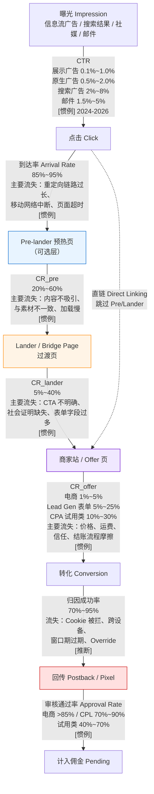
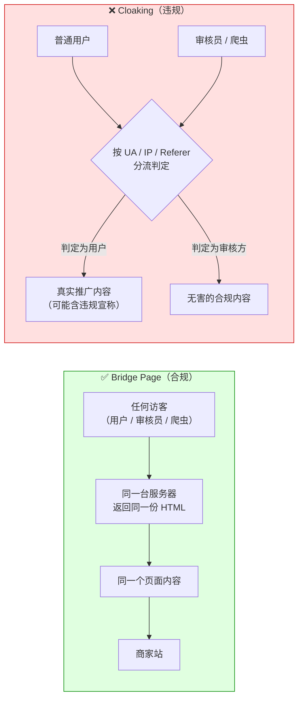

# 落地页与转化漏斗设计

> **一句话定位**：本文回答"用户从看到广告/内容到商家收到转化，中间到底走了几跳、每一跳漏掉多少、我能改哪几个旋钮"——**落地页与漏斗是 Affiliate 唯一能自己掌控、且杠杆最大的环节**。
>
> **核心结论先行**：漏斗不是"多一层页面就多一层保险"，而是**多一层页面就多一次流失，但也多一次筛选**。加页面是否划算取决于一条判据：
> `该层带来的意图提升幅度 > 该层的直接流失率`。
> 同时必须先分清三类页面——**Pre-lander（预热页）/ Lander-Bridge Page（过渡页）/ Direct Linking（直链）**，它们的合规边界完全不同。
> Bridge Page 是给**所有人看同一内容**，Cloaking 是给**审核方和用户看不同内容**，后者是违规行为，本文不讨论其实现。
>
> **可信度标签**：`[标准]` 官方明文　`[政策]` 平台公开政策（标时点）　`[惯例]` 行业共识　`[推断]` 待验证推导
>
> 最后更新：2026-09-10

---

## 1. 漏斗全景：从曝光到回传的逐跳流失

### 1.1 完整链路



**读图要点** `[推断]`：

1. **虚线（直链）是唯一一条不经过我方页面的路径**。它的存在意义是"零流失"，代价是"零筛选、零合规缓冲"，见 §3。
2. **归因成功率与审核通过率这两跳不在页面上，但在漏斗里**。它们是 `联盟角色与佣金模型.md` §8.0 的五个乘数中最后两个。
   把落地页优化到极致却漏了这两跳，等于把水装进一个底部有洞的桶。
3. **每一跳的"主要流失原因"是可诊断的，不是玄学**。诊断方法见 §1.2。

### 1.2 逐跳诊断表

| 跳 | 指标 | 数据从哪看 | 掉了先查什么 | 典型误判 |
|---|---|---|---|---|
| 曝光→点击 | CTR | 流量平台后台 | 素材 Hook、受众匹配、频次 | 把"受众太泛"当成"素材不好"，反复换素材 |
| 点击→到达 | Arrival Rate | 自有落地页 GA / 追踪系统 | 重定向跳数、TTFB、移动弱网 | 只看平台报的 Clicks，以为都到了 |
| Pre→Lander | CR_pre | 自有页面埋点 | Message Match、首屏 Hook、加载速度 | 用总 CR 掩盖分层差异 |
| Lander→Offer | CR_lander | 自有埋点 + 联盟点击报表 | CTA 数量与措辞、表单字段、社会证明 | 把"点击联盟链接数"当成"到达商家站数"（中间还会掉） |
| Offer→转化 | CR_offer | 联盟后台 / 商家后台 | 价格、运费、库存、结账摩擦、支付本地化 | 以为是自己页面问题，实际是商家站转化差 |
| 转化→回传 | 归因成功率 | 联盟后台 vs 自有埋点差额 | Cookie 拦截、ITP、跨设备、Click ID 丢失 | **完全看不到**，只能靠对账推断 |
| 回传→结算 | Approval Rate | 联盟后台 Pending/Approved | 退货、拒付、无效线索、扣量 | 见 `联盟反作弊与扣量.md` |

`[惯例]` **平台报的点击数 ≠ 你页面收到的访问数**，差 5%~15% 是常态（部分流量源更大）。
这个差额叫 **Click Fraud / Click Loss**，是判断流量源质量的第一道筛子，
详见 `../13_反作弊与流量质量/广告欺诈全景与分类.md`。

### 1.3 漏斗深度与"意图筛选"

```
加一层页面的两个作用力方向相反：
  负作用：直接流失（该层 CR < 100%）
  正作用：意图筛选（留下的人 CR 更高、Approval Rate 更高、退款更少）
  净效应 = 筛选收益 − 流失成本
```

`[推断]` **筛选收益体现在三个地方，而不只是一个**：

| 收益来源 | 机制 | 在报表里的位置 |
|---|---|---|
| CR_offer 提升 | 低意图用户被前置页过滤 | 联盟后台的 CR |
| Approval Rate 提升 | 被预热过的用户预期更准确，退货/拒付更少 | Pending→Approved |
| 商家侧口碑 | 流量质量好，AM 愿意给更高 Payout / Bump | **不在任何报表里**，靠关系 |

第三条最容易被忽略但最值钱。`联盟角色与佣金模型.md` §1.2 提到 Super Affiliate 的 Bump 可高出 20%~50%——
**Bump 的谈判筹码正是"我的流量通过率高、退款率低"**，而这只能靠漏斗筛选做出来。

---

## 2. 三类页面的严格区分（本篇核心）

中文资料把 Pre-lander、Lander、Bridge Page、Advertorial 混为一谈，这是漏斗讨论失准的根源。
四者的**合规属性完全不同**，必须先分开。

### 2.1 四种形态对照

| 维度 | **Pre-lander（预热页）** | **Lander / Bridge Page（过渡页）** | **Advertorial（软文式广告页）** | **Direct Linking（直链）** |
|---|---|---|---|---|
| 英文 | Pre-landing Page / Presell Page | Landing Page / Bridge Page | Advertorial（Advertisement + Editorial） | Direct Link / Naked Link |
| 中文正名 | 预热页、前置页 | 落地页、过渡页、桥页 | 软文广告页（**Pre-lander 的一种内容形态**） | 直链 |
| 在漏斗位置 | 点击后的**第一站** | 预热页之后 / 或点击后的第一站 | = Pre-lander 的内容写法 | 点击后**直达商家站** |
| 我方页面数 | 1 | 1 | 1 | 0 |
| 核心作用 | 制造需求、教育、筛选意图 | 承接意图、给出唯一 CTA、合规缓冲 | 用编辑体内容降低广告抵触 | 零流失 |
| 内容形态 | 故事、清单、问答、测评摘要 | 价值主张 + 社会证明 + CTA | 看起来像新闻/测评文章的广告页 | 无 |
| 合规风险 | 中（宣称红线集中在这里） | **低**（内容中立、指向明确） | **高**（易构成误导、需显著披露） | 中（取决于流量平台政策） |
| 谁在用 | 买量型 Affiliate、CPA Offer | 内容站、邮件营销、所有合规玩家 | 买量型（Nutra/Sweeps/Finance 高发） | 优惠券站、比价站、返利插件 |
| 与 Cloaking 的关系 | 无关（给所有人看同一内容） | **无关** | 无关 | 无关 |

### 2.2 Pre-lander：什么时候需要，什么时候有害

**Pre-lander（预热页 / Presell Page）**
- 定义：用户点击广告后到达的、由推广者自建的第一个页面，**目的不是转化，而是把冷流量加热**。
- 通俗解释：像销售在带你进店之前先聊两句"你是不是也在为 X 烦恼"，聊得上了再进店。
- 易混提示：它不是落地页（Lander），因为它**通常不承载最终 CTA**，它的 CTA 是"继续看下一页"。

**需要 Pre-lander 的四个场景** `[惯例]`：

| 场景 | 原因 |
|---|---|
| **流量是冷的**（信息流、Push、Pop） | 用户没有搜索意图，直接扔给商家站等于浪费点击 |
| **Offer 需要解释**（Nutra、金融、订阅制、SaaS） | 商家站的转化路径假设用户已被教育过 |
| **平台政策要求缓冲** | 部分流量源禁止直链到某些品类，直链会被拒审或限流 |
| **需要打 Sub ID 做分层** | Pre-lander 是插入自有追踪参数的最佳位置 |

**Pre-lander 有害的三个场景** `[推断]`：

1. **流量已经是热的**（搜索"X coupon"、邮件里的老订阅者）。此时加一层纯属流失，直链总 CR 往往更高。
2. **Pre-lander 与素材不一致**（Message Match 断裂）。用户以为点的是 A，看到的是 B，跳出率飙升。
3. **Pre-lander 做了过度承诺**——**这是最隐蔽的有害**。它把预期抬到商家站兑现不了的高度，
   结果是 CR 好看但 Approval Rate 崩塌、退款率高、被商家降权。
   它在你的报表里表现为"成功"，在商家的报表里表现为"垃圾流量"。

**判据**：一个 Pre-lander 是否合格，看的不是它自己的 CR，而是
`CR_pre × CR_offer × Approval Rate` 三者乘积是否高于直链的 `CR_offer × Approval Rate`。
单看第一层 CR 会把漏斗优化做成自欺欺人。

### 2.3 Lander / Bridge Page：作用与合规边界

**Bridge Page（过渡页 / 桥页）**
- 定义：位于推广者内容与商家站之间的、**自有域名上的**中间页面，向用户说明"你将离开本站前往合作方"。
- 通俗解释：机场的廊桥——本身不是目的地，但没有它你上不了飞机；而且它明确告诉你"你正在登机"。
- 易混提示：**Bridge Page ≠ Cloaking**。这是本领域最常被混淆、也最容易踩红线的一对概念。

**三个正当作用** `[惯例]`：

| 作用 | 说明 |
|---|---|
| **合规缓冲** | 承接 FTC 披露、Cookie 同意、隐私政策入口；把"这是广告"讲清楚再送走用户 |
| **不裸放联盟链接** | 社媒对联盟域名限流或屏蔽，用自有域名中转可提高可达性；也便于统一换 Offer |
| **打自有追踪** | 在自己页面上生成并透传 Sub ID / Click ID，便于分层归因 |

### 2.4 ★ Bridge Page 与 Cloaking 的区别（红线）

这是必须讲清的一条：



| 维度 | **Bridge Page（合规）** | **Cloaking（违规）** |
|---|---|---|
| 内容是否因人而异 | **否**，所有人看到同一内容 | **是**，审核方与用户看到不同内容 |
| 是否隐藏真实推广意图 | 否，页面明确说明这是推广 | 是，对审核方伪装成别的东西 |
| 技术手段 | 静态页面 + 参数透传 | 按 User-Agent / IP / Referer / 点击次数分流 |
| 平台态度 | 普遍允许（部分平台要求披露） | **所有主流平台明确禁止** `[政策]` |
| 后果 | — | 账户封禁、佣金没收、永久拉黑；商家可判定 Terms Violation 拒付（`联盟角色与佣金模型.md` §6.3） |

`[政策]` Google Ads、Meta、TikTok for Business 以及主流联盟网络（CJ / Impact / Awin）的服务条款中，
均把"向审核系统展示与实际用户不同的内容"列为禁止行为。**本文不讨论 Cloaking 的实现方式、工具与配置**，
只从检测方视角说明它的识别特征（同一 URL 在不同 UA / IP 段 / 首次与第 N 次访问下返回不同内容）。
相关内容见 `联盟反作弊与扣量.md` 与 `../10_广告套利Arbitrage/套利风险-平台封禁与合规.md`。

**给合规玩家的实操建议** `[惯例]`：如果你的 Bridge Page 需要 A/B 测试，
正确做法是**用稳定的分桶键（如用户 Cookie 或 Click ID 哈希）分流**，
并且**让审核方与爬虫也能进入实验分桶**（不要单独排除它们）。
"把爬虫排除在实验之外"这个动作本身，就是 Cloaking 的技术特征。

### 2.5 Direct Linking：适用场景与为什么被限制

**直链（Direct Linking）**：把联盟链接（含跳转服务）直接放在广告、社媒帖子或邮件里，用户点击后直达商家站。

**适用场景** `[惯例]`：

| 场景 | 为什么直链更好 |
|---|---|
| 优惠券站 / 比价站 | 用户意图已极度明确，任何中间页都是流失 |
| 邮件列表中的老订阅者 | 已建立信任，中间页反而显得可疑 |
| Deal 类社媒账号 | 时效性强，多一跳就多一秒流失 |
| 商家提供 Deep Link 到具体 SKU | 直达商品页比首页转化率高得多 |

**为什么大多数平台禁止或限流直链** `[政策]`/`[惯例]`：

1. **社媒平台**：联盟跳转链接常被列入垃圾链接库（历史上大量 Spam 用直链），
   Meta / TikTok / Pinterest 对裸联盟域名的自然触达有压制，付费投放可能直接拒审。
2. **搜索平台**：Google Ads 的 **Destination Requirements** 禁止"没有实质内容、仅用于跳转"的页面，
   同时禁止 Cloaking。注意这两条**方向相反**——既不能是纯跳转空页，也不能给审核方看不同内容。
   合规解是**页面要有实质价值**。
3. **联盟网络**：多数网络禁止 **Incentivized Traffic（激励流量）**与 **Brand Bidding（品牌词竞价）**，
   直链配合这两种玩法是重灾区，因此网络对直链流量抽检更严。
4. **无法追踪分层**：直链意味着你没有自己的页面、无法埋点，一旦 CR 掉了你**不知道为什么**——
   这是直链最大的隐性成本。`[推断]`

> **政策时点：2026-09。** Google Ads Destination Requirements、Meta 广告政策与各网络的
> Promotional Methods 条款均会更新，投放前必须核对当期条款原文。

---

## 3. Advertorial：只讲合规边界与识别特征

**Advertorial（软文式广告页，Advertisement + Editorial）**
- 定义：采用编辑/新闻/测评的排版与叙事方式呈现的**付费推广内容**，本质是广告。
- 通俗解释：把广告写成"看起来像文章"的样子。它天然带有"我不是在卖东西"的暗示，
  这既是它的商业价值来源，也是它的合规风险来源。
- 易混提示：Advertorial 是 **Pre-lander 的一种内容形态**，不是独立于漏斗的第四类页面。

**为什么常见** `[推断]`：① 信息流用户对广告样式有习得性无视（Banner Blindness），编辑体能突破这层过滤；
② Nutra / 金融 / SaaS 的转化需要先建立认知，纯商品页做不到；③ 结构高度模板化
（Hook → 故事 → 问题 → 方案 → 证据 → CTA），便于素材工厂规模化——这也是它在灰色品类泛滥的原因。

### 3.1 合规边界（只讲边界，不讲怎么写）

| 边界 | 要求 | 依据 |
|---|---|---|
| **必须可被识别为广告** | 显著位置披露商业关系，不能靠"读者自己看出来" | FTC Act §5 + 16 CFR Part 255 `[政策]` |
| **不得使用未证实的功效宣称** | 尤其健康、减肥、收益承诺类 | FTC 要求 competent and reliable scientific evidence `[政策]` |
| **不得伪造编辑独立性** | 伪装新闻媒体、伪造记者署名与报头均属高风险 | FTC 对 deceptive format 的执法口径 `[政策]` |
| **Testimonial 必须真实且典型** | 非典型结果需明示"结果因人而异" | 16 CFR Part 255.2 `[政策]` |
| **不得使用虚假紧迫感** | 假倒计时、假库存、假"仅剩 N 份" | FTC 与多国消费者保护法 `[政策]` |

### 3.2 识别特征（防守方视角）

`[惯例]` 判断一个 Advertorial 是否越线，看四个信号：

```
① 披露位置：是否在首屏、是否用小字灰字放页脚             → 页脚小字 = 高风险
② 域名与报头：是否伪装成新闻站（xxx-news-daily.com 配报纸版式） → 是 = 高风险
③ 宣称强度：是否出现"治愈 / 根治 / 保证 / 一周见效 / 稳赚"    → 是 = 高风险
④ 结果证据：Testimonial 配图配名配具体数字，却无免责声明       → 是 = 高风险
```

**Nutra（营养保健品）类的特殊性** `[惯例]`：Advertorial 违规的最高发区。FDA 与 FTC 对膳食补充剂
（Dietary Supplement）的宣称有严格限制——**不得宣称可诊断、治疗、治愈或预防疾病**
（这类宣称会把产品归类为未经批准的药物），合规只能使用 **Structure/Function Claim**
（结构/功能宣称，如"支持关节健康"）并附免责声明。**本文不提供任何可用于规避审查的宣称写法。**

---

## 4. 漏斗各步的优化杠杆

每条杠杆给出：**改什么 → 影响哪个指标 → 量级区间**。

`[推断]` 以下所有量级区间均为**行业常见报告的相对变化幅度**，不是保证值。
它们的作用是排优先级，不是做预算。**任何具体数字都要用自己的 A/B 测试覆盖。**

### 4.1 杠杆清单

| # | 杠杆 | English | 改什么 | 影响指标 | 相对变化量级 | 优先级 |
|---|---|---|---|---|---|---|
| 1 | **Hook 与首屏** | Hook / Above the Fold | 首屏第一句话是否直接说出用户的核心痛点或收益 | Pre-lander CR、跳出率 | ±20%~50% | ★★★ |
| 2 | **素材—落地页一致性** | Message Match / Ad-to-Page Consistency | 广告里的主标题、承诺、视觉风格在落地页首屏是否原样复现 | 跳出率、CR_pre | ±15%~40% | ★★★ |
| 3 | **加载速度** | Page Speed / LCP | 首屏图片压缩、字体子集化、去第三方脚本、CDN | 跳出率、CR（全链路） | 见 §4.3 | ★★★ |
| 4 | **CTA 设计** | Call To Action | 数量（1 个 vs 多个）、措辞（第一人称 vs 第二人称）、位置（首屏内 vs 需滚动） | CR_lander | ±10%~30% | ★★ |
| 5 | **表单字段数** | Form Field Count | 砍掉非必要字段 | 表单提交率 | 见 §4.2 | ★★★ |
| 6 | **社会证明** | Social Proof | 评价、销量、媒体 Logo、真实用户照片 | CR_lander、CR_offer | ±10%~25% | ★★ |
| 7 | **紧迫感** | Urgency / Scarcity | 真实限时折扣、真实库存 | CR | ±5%~20%（**必须真实，否则违规**） | ★ |
| 8 | **意图分层** | Traffic Segmentation | 按 Sub ID 把不同来源导向不同页面版本 | 整体 CR、Approval Rate | ±10%~30% | ★★ |
| 9 | **退出挽回** | Exit Intent / Back Button Offer | 返回时弹一次替代方案（**频次必须克制**） | CR | ±5%~15% | ★ |
| 10 | **移动端适配** | Mobile-First | 拇指热区、输入框自动聚焦、键盘类型匹配 | 移动端 CR | ±15%~40% | ★★★ |

### 4.2 表单字段数量与转化率的关系

`[惯例]` 漏斗优化里最稳定的一条经验规律：**字段数与提交率呈非线性负相关**。

```
典型形态（Lead Gen 表单）：
字段数     1     2     3     4     5     6     8     10+
提交率   █████ █████ ████  ███   ██    ██    █     ▌
相对值   100%  ~95%  ~85%  ~70%  ~58%  ~50%  ~35%  ~20%
                              ↑ 3~4 字段是常见"甜蜜点"
（以上为相对形态示意，非实测数据。绝对值受品类、Geo、流量温度影响极大 [推断]）
```

**为什么不是"字段越少越好"** `[推断]`：字段减少提高提交率，但**降低线索质量**，从而压低 Approval Rate。二者方向相反：

| 表单设计 | 提交率 | 线索质量 | Approval Rate | 净收益 |
|---|---|---|---|---|
| 只要邮箱 | 最高 | 最差（大量随手填） | 可能 <60% | 可能为负 |
| 邮箱 + 姓名 + 1 个资格问题 | 中 | 中 | 70%~85% | 常见最优 |
| 完整资格问卷（8~10 字段） | 低 | 高 | >90% | 高派款 Offer 才划算 |

**判据公式**：`最优字段数 = argmax ( 提交率 × Payout × Approval Rate )`

`[惯例]` 金融、保险类 CPL 常要求 8+ 字段，正因为 Payout 高（$20~$100/条），值得用低提交率换高通过率；
Sweepstakes 只要邮箱，因为 Payout 低（$1~$3）。
**字段数设计本质上是 Payout 的函数，不是用户体验的函数**——这是 Affiliate 漏斗与品牌方漏斗最大的思路差异。

### 4.3 移动端首屏加载速度对跳出率的影响

`[惯例]`/`[推断]` 公开研究较多但**口径混乱，只取方向与量级**：

| 首屏加载时间（移动 4G） | 跳出率相对变化 | 说明 |
|---|---|---|
| < 1 秒 | 基准 | 理想状态 |
| 1~3 秒 | 明显上升 | 行业中位数落在此区间 |
| 3~5 秒 | 大幅上升 | 常见于带多个第三方脚本的 Pre-lander |
| > 5 秒 | 极高 | 大量买量流量的真实状态（弱网 + T3 Geo） |

**为什么这条杠杆在 Affiliate 场景被严重低估** `[推断]`：

1. **买量流量的设备与网络远差于品牌方假设**。Push / Pop / Native 的大量流量来自中低端 Android + 弱网 + T3 地区
   （见 `../08_海外广告生态/海外流量Tier分层与地域特征.md`）。在办公室 Wi-Fi 上测速是无效验证。
2. **每多一跳重定向就多一次 DNS + TLS + 页面加载**。直链可能已经过 联盟跳转 → 商家 CDN → 商家页面，
   Pre-lander 再加一跳就是四次。
3. **加载慢的损失在报表里不可见**。平台报了点击、你的页面没有 PV，这批人**永远不会出现在任何转化率分母里**，
   你只会觉得"CR 低"。

**优化动作（按性价比排序）** `[惯例]`：

```
① 首屏图片：WebP/AVIF + 响应式尺寸 + 懒加载非首屏图
② 字体：子集化或直接用系统字体栈（省掉一次阻塞请求）
③ 第三方脚本：追踪像素异步化，分析脚本能砍就砍
④ CDN：全球边缘节点，别用单区域主机     ⑤ 服务器：TTFB 目标 < 200ms
⑥ 验证：用真实设备 + 网络节流（Slow 3G）测，不要只看桌面 Lighthouse 分数
```

---

## 5. 转化率基准表

### 5.1 按品类 × 漏斗深度

`[惯例]` 标注时点：**2024–2026 年行业报告与从业者共识的量级区间**。
**这些是区间，不是目标值。** 同一品类内部差异可达 10 倍以上。

| 品类 | 典型 Payout / 客单 | 直链 CR（点击→转化） | Pre-lander CR | Lander CR | 整体 CR（三页漏斗） | 备注 |
|---|---|---|---|---|---|---|
| **电商（实物零售）** | 客单 $20~$200，佣金 1%~15% | 1%~5% | — | 30%~60% | 0.3%~3% | Amazon 类高信任站点 CR 显著更高 |
| **Lead Gen（保险/贷款/教育/家装）** | $5~$100/条 | 5%~25% | 30%~60% | 10%~30% | 2%~10% | 字段数直接决定 CR，见 §4.2 |
| **Nutra（保健品/减肥）** | $30~$150/单（含 Trial） | 1%~6% | 15%~45% | 5%~20% | 0.5%~4% | Approval Rate 常 <70%，见 `联盟角色与佣金模型.md` §7.5 |
| **Sweepstakes（抽奖/免费领）** | $1~$5/条 | 10%~40% | 30%~70% | 20%~50% | 3%~20% | 单价低，靠量；列表质量差 |
| **SaaS / B2B** | 客单 $20~$500/月，佣金 20%~50% | 1%~8%（试用注册） | 20%~50% | 5%~20% | 0.5%~5% | 免费试用 CR 高，但**付费转化**才是真收益 |
| **金融（信用卡/券商/加密）** | $20~$300/条 | 2%~12% | 20%~50% | 5%~25% | 0.5%~5% | 合规最严，Geo 限制多 |
| **App Install（CPI）** | $0.3~$15/安装 | 5%~25% | — | 20%~50% | 1%~12% | 见 `CPA网络与Offer市场.md` |
| **旅游（机酒/租车）** | 客单 $200~$2000，佣金 3%~8% | 0.5%~3% | 20%~50% | 3%~15% | 0.2%~2% | 决策周期长，Cookie Duration 关键 |

### 5.2 为什么区间这么宽

`[推断]` 看到"电商 CR 1%~5%"不要以为中间值是 3%。**区间的宽度本身就是信息**：

| 差异来源 | 影响机制 | 量级 |
|---|---|---|
| **流量质量 / 温度** | 搜索"X review"（热）vs 信息流被吸引（冷） | **5~10 倍（最大变量）** |
| **Geo（地域）** | T1 购买力与信任度高但竞争贵；T3 CR 高但 Payout 低、支付渗透率低 | 3~10 倍 |
| **素材与落地页匹配度** | Message Match 好坏直接决定跳出率 | 1.5~3 倍 |
| **季节与时点** | Q4（黑五/圣诞）CR 与 AOV 双升，1 月回落；发薪日周期也影响 | 1.3~2 倍 |
| **设备** | 桌面 CR 通常高于移动（结账摩擦、支付便利性） | 1.2~2 倍 |
| **是否新客** | 老客/列表内用户 CR 远高于冷流量 | 2~5 倍 |

**结论**：**任何"行业平均 CR"都是无意义的数字**。有效做法是建立自己的基准线——
按 `品类 × Geo × 流量源 × 设备` 四维拆出自己的 CR 分布，然后只在**同一格内**做对比与优化。

### 5.3 与 Cookie Duration 结论的联动

`联盟角色与佣金模型.md` §4.3 已建立：考虑型消费（μ≈7 天）下，30 天窗口捕获 98.6%、7 天只捕获 63.2%；
高决策型（μ≈20 天）30 天也只捕获 77.7%。

**这条结论对漏斗设计的直接含义** `[推断]`：

- **冲动型品类**（μ≈1 天，24h 已捕获 63%）：漏斗要做**短**——直链或单页，减少每一秒流失。
- **考虑型 / 高决策型**（μ≈7~20 天）：漏斗要做**深且带回访机制**。
  Pre-lander 的价值不只是筛选，更是**建立可再次触达的入口**（邮件订阅、Retargeting 受众）。
  7 天窗口下你有 36.8% 的转化会漏掉，**把用户拉进自有列表是唯一能救回这部分的手段**
  → 这正是 [`邮件营销与私域List.md`](./邮件营销与私域List.md) 的立论起点。

---

## 6. 漏斗数学：公式与完整算例

### 6.1 核心公式

```
【整体转化率】
  单页（直链）：  CR_total = CR_offer
  两页漏斗：      CR_total = CR_lander × CR_offer
  三页漏斗：      CR_total = CR_prelander × CR_lander × CR_offer

【有效每点击收益】
  EPC_有效 = Payout × CR_total × Approval Rate × (1 − 网络抽成)

【盈亏平衡 CPC】（买量型的核心判据）
  Break-even CPC = Payout × CR_total × Approval Rate × (1 − 网络抽成)
                 = EPC_有效

【日利润】
  Profit = Clicks × (EPC_有效 − CPC) − 固定成本（工具/人力/主机）

【盈亏平衡所需 CR】（已知 CPC 反推）
  CR_required = CPC / (Payout × Approval Rate × (1 − 网络抽成))
```

> **口径提醒**：网络后台显示的 "EPC" 常是**每 100 次点击**的收益，且是**全体推广者的均值**。
> 本文所有 EPC 均为**每 1 次点击**、且是**你自己流量的预期值**。见 `Affiliate体系总览.md` §7.1。

### 6.2 完整算例：同一 Payout 下三档漏斗的盈亏平衡 CPC 对比

**场景设定** `[推断]`：某 CPA Offer，Payout $40（Lead Gen），网络抽成 25%，Approval Rate 75%。
三档漏斗方案的转化率如下（取自 §5.1 的 Lead Gen 区间中位偏保守值）：

| 方案 | 页面结构 | 各层 CR | CR_total |
|---|---|---|---|
| **A：直链** | 广告 → 商家表单 | CR_offer = 12% | 12.0% |
| **B：两页** | 广告 → Lander → 商家表单 | CR_lander 45% × CR_offer 15% | 6.75% |
| **C：三页** | 广告 → Pre-lander → Lander → 商家表单 | CR_pre 40% × CR_lander 60% × CR_offer 18% | 4.32% |

注意 B、C 的 **CR_offer 比 A 更高**（12% → 15% → 18%），这正是"意图筛选"的体现：
被前置页过滤过的人，到商家站后转化意愿更强。

```
EPC_有效 = Payout × CR_total × Approval × (1 − 抽成)
         = $40 × CR_total × 0.75 × 0.75
         = $22.5 × CR_total

方案 A：EPC = $22.5 × 0.120 = $2.700   → 盈亏平衡 CPC = $2.70
方案 B：EPC = $22.5 × 0.0675 = $1.519  → 盈亏平衡 CPC = $1.52
方案 C：EPC = $22.5 × 0.0432 = $0.972  → 盈亏平衡 CPC = $0.97
```

| 方案 | CR_total | EPC_有效 | 盈亏平衡 CPC | 若实际 CPC = $0.60，每点击毛利 | 毛利率 |
|---|---|---|---|---|---|
| A 直链 | 12.00% | $2.700 | $2.70 | $2.100 | 78% |
| B 两页 | 6.75% | $1.519 | $1.52 | $0.919 | 60% |
| C 三页 | 4.32% | $0.972 | $0.97 | $0.372 | 38% |

**表面上直链完胜。** 但这个结论有三个必须补上的修正项。

### 6.3 为什么"多一层页面"有时反而更赚

`[推断]` 上表遗漏了四个变量，把它们加回来，结论可能反转：

| 修正项 | 直链 A 的劣势 | 三页 C 的优势 | 量级影响 |
|---|---|---|---|
| **① Approval Rate 不同** | 冷流量直冲商家站，无效线索多，Approval 可能只有 55% | 被教育过的用户填表更认真，Approval 可达 85% | **C 的 EPC 变为 $22.5/0.75×0.85×0.0432 = $1.10；A 变为 $40×0.12×0.55×0.75 = $1.98** |
| **② 可承受的 CPC 上限不同** | 只能在贵的 T1 优质流量上跑（CPC $1.5+ 才有人，但那样 A 亏） | 可以买**便宜的冷流量**（Push/Pop，CPC $0.05~$0.30），因为漏斗自己会加热 | **这是最大的反转来源**：A 在 CPC $0.60 的流量上根本买不到量 |
| **③ 平台合规风险** | 部分品类禁止直链，账户可能被封 | 有合规缓冲层，账户存活率高 | 不可量化，但期望值为负 |
| **④ 数据可观测性** | 无自有埋点，CR 掉了不知道为什么 | 每层可埋点，可持续迭代 | 长期复利 |

**修正后的对比例子**：

```
方案 A'（直链，冷流量买不到，只能买 T1 优质流量 CPC $1.80，Approval 65%）
  EPC = $40 × 0.10 × 0.65 × 0.75 = $1.95
  毛利 = $1.95 − $1.80 = $0.15 / click  → 毛利率 8%  ⚠️ 极脆弱

方案 C'（三页，Push 流量 CPC $0.12，Approval 85%）
  EPC = $40 × 0.0432 × 0.85 × 0.75 = $1.10
  毛利 = $1.10 − $0.12 = $0.98 / click → 毛利率 89%
```

**结论**：`[推断]` **漏斗深度的选择，本质是"你能买到多便宜的流量"的选择。**

- **直链**要求流量本身已经足够热 → 只能买贵流量 → 毛利薄、抗风险能力差。
- **深漏斗**允许你自己把冷流量加热 → 能买便宜流量 → 毛利率高，但需要页面产能与迭代能力。

这也解释了为什么**买量型 Affiliate 几乎都做深漏斗，而优惠券站/比价站几乎都直链**——
不是技术偏好，是流量成本结构决定的。

### 6.4 什么时候多一层页面纯亏

`[推断]` 三种情况：

1. **该层 CR 低于"意图提升带来的 CR_offer 增益"的盈亏点**：加层后
   `CR_total_new × Approval_new < CR_total_old × Approval_old`，且没换来更低的 CPC。
2. **流量已经很热**（搜索交易词、邮件老订阅者）：CR_pre 的提升空间几乎为零，纯流失。
3. **加载与跳转成本失控**（§4.3）：弱网 Geo 下每加一跳的到达率损失可能超过 10%，
   三层漏斗光"页面没打开"就损失 20%~30%。

### 6.5 与已建立的敏感性结论的一致性校验

`联盟角色与佣金模型.md` §8.4 已建立：买量型下 **CPC ±20% 只影响毛利 3%，而 Approval Rate / CR / Payout
各 ±20% 影响 23%**。本篇的推论与之完全一致 `[推断]`：

```
落地页优化改的是 CR 与 Approval Rate —— 都是 ★★★ 脆弱度变量
出价谈判改的是 CPC                —— ★ 脆弱度变量

∴ 一个落地页工程师对利润的贡献，数量级上高于一个出价优化师。
∴ 团队编制应该反过来配：多数新手把 80% 时间花在盯 CPC，这是资源错配。
```

这条推论可直接用于 [`Affiliate单位经济与规模化.md`](./Affiliate单位经济与规模化.md) 的团队编制讨论。

---

## 7. A/B 测试方法

### 7.1 单变量 vs 多变量

| | **A/B（单变量）** | **Multivariate（MVT）** |
|---|---|---|
| 同时改动 | 1 个元素 | 多元素及其组合 |
| 版本数 | 2（或 A/B/n） | 笛卡尔积（3 标题 × 3 CTA × 2 图 = 18 版） |
| 所需样本 | 小 | **指数级增长** |
| 能学到 | 该元素的因果效应 | 元素间**交互效应** |
| Affiliate 适用性 | **主力方法** | 基本不适用（样本不够，见 §7.3） |

### 7.2 最小样本量估算

`[标准]` 经典双侧检验（α = 0.05，Power = 0.80），每组所需转化数近似：

```
n ≈ 16 × p̄(1−p̄) / δ²     p̄ = 两版平均 CR，δ = 想检出的绝对差异

示例：基准 CR 5%，想检出相对提升 20%（绝对 +1.0pp，p̄≈5.5%）
  n ≈ 16 × 0.055 × 0.945 / 0.01² ≈ 8,294 转化/组
  → 反推点击：8,294 / 0.05 ≈ 16.6 万点击/组，两组合计 33 万
```

| 基准 CR | 想检出的相对提升 | 每组所需转化 | 每组所需点击 |
|---|---|---|---|
| 1% | 20% | ~31,000 | ~3,100,000 |
| 2% | 20% | ~15,700 | ~785,000 |
| 5% | 20% | ~8,300 | ~166,000 |
| 5% | 50% | ~2,600 | ~52,000 |
| 15% | 20% | ~4,000 | ~27,000 |
| 15% | 50% | ~1,250 | ~8,300 |

`[推断]` **CR 越低、想检出的提升越小，样本量呈平方级增长**。低 CR 品类（电商、旅游）做精细 A/B 在数学上就不现实。

### 7.3 为什么 Affiliate 侧样本量常不够

| 原因 | 说明 |
|---|---|
| **流量规模小** | 单 Affiliate 日点击常 100~5,000，跑完 33 万点击的实验要 2~9 年 |
| **CR 低** | 见 §5.1，多数品类在个位数百分比 |
| **转化有延迟** | Cookie Duration 7~30 天，结论要等窗口关闭 |
| **Approval 有延迟** | Pending→Approved 再等 30~60 天（`联盟角色与佣金模型.md` §6.1） |
| **对照组在漂移** | 素材衰减、流量源波动、季节性 |
| **多重比较** | 同时跑 5 个实验，假阳性率急剧上升（α 膨胀） |

**小样本下的替代方法** `[推断]`：不要硬做统计检验（会得到大量假阳性）——

| 方法 | 做法 |
|---|---|
| **大改动优先** | 只测能带来 50%+ 相对提升的改动（换 Hook、换页面类型、换 Offer 角度），不测按钮颜色 |
| **序贯 + 停止规则** | 预设"跑满 X 点击或 EPC 差距超 Y% 就停"，避免无限期窥视 |
| **切换高 CR 判据** | 用 CR_lander 而非 CR_offer，样本量要求降低一个数量级 |
| **借用行业先验** | 用 §5.1 区间做先验，只验证"我是否落在区间内" |
| **原理判断 + 长周期趋势** | 承认统计上无法定论，按原理选方案，用 4~8 周趋势验证 |

### 7.4 ★ 用 EPC 而不是 CR 做判据

`[推断]` 这是 Affiliate A/B 测试与常规产品 A/B 测试最大的方法论差异。

```
❌ 错误判据：B 版 CR 5.2% > A 版 4.8%，所以 B 更好
✅ 正确判据：B 版 EPC_有效 > A 版 EPC_有效
   EPC_有效 = Payout × CR × Approval Rate × (1 − 网络抽成)
```

**四个理由**：

1. **CR 只覆盖漏斗的一段**。"更能骗人点击"的版本 CR 更高但 Approval Rate 更低、退款更多，EPC 反而更差。
   用 CR 做判据会系统性选出**短期好看、长期有害**的版本。
2. **CR 的分母口径会骗人**。若埋点只统计"到达页面的人"，而加载慢导致 15% 根本没到达（§4.3），
   这 15% 不在分母里 → CR 看起来没变，实际收入少了 15%。**EPC 的分母是点击，口径统一。**
3. **Payout 可能因流量质量浮动**。分层派款（新客/老客、Geo、Tier）下，CR 相同而 EPC 不同。
4. **EPC 直接对应盈亏平衡 CPC**（§6.1），是唯一能回答"这个版本还能不能投"的指标。

**实操口径** `[惯例]`：

```
主判据：EPC_有效（等 Approval 数据回来后再定论）
过程指标：CR_pre / CR_lander / CR_offer 分层看，定位是哪一层的问题
护栏指标：Approval Rate、退款率、投诉率、跳出率、加载时间
        —— 任一项显著恶化，即使 EPC 上升也不采纳
```

---

## 8. 合规红线专章

### 8.1 FTC 披露义务（affiliate disclosure）

`[政策]` **依据：FTC Act Section 5 + 16 CFR Part 255（Guides Concerning the Use of Endorsements and
Testimonials in Advertising）**。FTC 于 **2023 年 6 月**通过 Part 255 修订（7 月生效），
**2023 年 9 月**发布更新版 *Endorsement Guides* 与配套 FAQ。

| 要求 | 具体标准 | 常见错误做法 |
|---|---|---|
| **清晰显著** | Clear and Conspicuous：消费者在**决策前**能注意到 | 藏在页脚、折叠区、Terms 链接里 |
| **位置** | 靠近推荐内容本身；长文在开头 + 每个链接附近 | 只在文末放一行 |
| **措辞** | 说明**存在金钱关系**，如"我们可能从通过本站链接购买的商品中获得佣金" | 只写 "sponsor" / "partner" 等术语不解释 |
| **视觉强度 / 视频音频** | 字体颜色对比度与正文相当；视频须**口播或持续显示** | 灰色小字；只写在描述框折叠处 |
| **社媒** | 单条帖子内可见；`#ad` 放开头且不被"更多"折叠 | `#affiliate` 埋在 30 个标签中间 |
| **免费寄样** | 免费产品也构成 material connection，需披露 | "自己买的"但实为寄样 |

`[政策]` **2023 修订三重点**：① 明确把**虚假评论与刷评**纳入执法；② 披露义务适用于**任何形式的物质联系**
（含免费产品、旅行、股份）；③ **平台与品牌方对第三方推广者的披露负监督责任**，不能推给"是博主自己没标"。

> **政策时点：2026-09。** 引用前核对 FTC 当期 *Endorsement Guides* 与 *Disclosures 101 for Social Media Influencers*；各州另有消费者保护法。

### 8.2 虚假宣称（尤其 Nutra / 减肥 / 金融收益）

`[政策]` FTC 的核心要求是**宣称必须有依据（Substantiation）**：

| 品类 | 禁止的宣称类型 | 依据与后果 |
|---|---|---|
| **健康 / Nutra / 减肥** | 宣称可诊断、治疗、治愈、预防疾病；"X 周减 Y 斤"；无依据前后对比图 | 需 competent and reliable scientific evidence；FDA 对膳食补充剂另有 Structure/Function Claim 限制 |
| **金融 / 投资 / 加密** | 收益承诺、"稳赚"、"保本"、虚假收入截图 | FTC + SEC + 州监管；收益承诺可能构成证券欺诈 |
| **BizOpp / 网赚** | 收入宣称需有**代表性依据**并披露典型结果 | 16 CFR Part 437（Business Opportunity Rule）`[政策]` |
| **教育 / 任何品类** | 就业率与薪资承诺；"科学证明"但无研究；伪造专家背书 | FTC 已对多家在线教育机构执法；构成 deceptive |

`[惯例]` **Affiliate 侧的连带责任**：即使虚假宣称出自商家素材，**推广者使用了同样可能被追责**，
且必然导致账户被封、佣金被没收。实操原则：**不用商家给的"高转化素材包"，除非自己核过宣称依据。**
**本文不提供任何可用于包装虚假宣称的措辞、模板或规避审查的方法。**

### 8.3 GDPR 下落地页的 Cookie 同意

`[政策]` **依据：GDPR（EU 2016/679）+ ePrivacy Directive（2002/58/EC）**。落地页上需体现：
**事先同意**（非必要 Cookie / 追踪脚本同意前不得加载）、**自由具体知情明确**（不得默认勾选、不得与访问捆绑）、
**拒绝与同意同等容易**（"全部拒绝"须与"全部接受"同等显著，近年欧盟 DPA 执法重点）、
**目的限定**（必要/统计/营销分别取得同意）、**可撤回 + 同意记录留存**、
**跨境传输**需 SCC 或充分性认定（EU-US Data Privacy Framework）。

`[惯例]` **对 Affiliate 漏斗的三个直接影响**：

1. **联盟跳转链接会写 Cookie**（见 `../07_追踪Cookie与归因/Cookie原理与分类.md`），在 EU 流量上属需事先同意的行为。
2. **CMP 拦截导致归因丢单**——用户拒绝后 Cookie 不写、Pixel 不加载，转化无法归因。这是 EU 流量 EPC 系统性低于 US 的原因之一。
3. **合规应对不是绕过同意**，而是：Consent Mode 类机制（未同意时传匿名聚合信号）、服务端追踪减少客户端依赖、
   **把 EU 流量的 EPC 预期调低**。TCF 2.2 是主流同意信号框架，详见 `../08_海外广告生态/海外隐私法规-GDPR-CCPA-TCF.md`。

### 8.4 误导性倒计时、虚假库存与 Testimonial

`[政策]`/`[惯例]` 这是落地页上最常见、也**最容易被平台自动识别**的违规：

| 手法 | 为什么违规 | 平台/监管识别方式 |
|---|---|---|
| **每次访问重置的倒计时** | 制造不存在的紧迫感 | 爬虫多次访问同一 URL 对比时间戳 |
| **"仅剩 3 件"但库存充足** | 虚假稀缺 | 与商家实际库存对账 |
| **"1,247 人正在浏览"** | 伪造实时数据 | 数字模式检测、与商家数据对账 |
| **假浏览器通知 / 假系统警告 / 假播放按钮** | UI 欺骗（Dark Pattern） | 视觉审核 + 用户投诉 |
| **假"最近购买"滚动条** | 伪造社会证明 | 姓名与地区组合的规律性检测 |

`[政策]` FTC 2022 年发布 *Bringing Dark Patterns to Light* 后有多起执法；欧盟 UCPD 修订后已将部分 Dark Pattern 列入黑名单做法。

**Testimonial 真实性要求**（16 CFR Part 255）`[政策]`：**必须真实**（不得虚构证言、演员扮演"用户"、
AI 生成假人像）；**反映典型结果**（非典型结果需清晰显著披露一般消费者可期待的结果）；
**披露物质联系**；**专家背书需真具资质**（"医生推荐"者必须是真医生且在其专业范围内）；
2023 修订后**平台与卖家对第三方虚假评论承担责任**。

`[惯例]` **合规判据一句话**：*这个信息如果用户去商家站核实，是否一致？不一致就是虚假。*

### 8.5 上线前自查清单（任一条不过 → 不上线）

```
□ 联盟关系披露在首屏可见，措辞消费者能懂      □ 宣称有可查证依据，不用绝对化表述
□ 倒计时/库存/在线人数真实，且与商家站一致    □ Testimonial 真实可追溯，非典型结果有声明
□ EU 流量的 Cookie / 追踪脚本走 CMP          □ 隐私政策、Terms 页面存在且可访问
□ 没有伪装成新闻媒体或第三方独立测评机构      □ 所有访客（含爬虫与审核方）看到相同内容 —— 无 Cloaking
□ 表单数据只用于声明用途，提供退订/删除入口    □ 落地页承诺与广告素材一致，不做页面外的额外承诺
```

---

## 9. 埋点与 Sub ID：漏斗优化的数据基础

`[惯例]` **最小可用埋点集**：流量源（Impression / Click + 平台 click_id）→ Pre-lander（PageView / Scroll Depth /
CTA Click）→ Lander（Form Start / Field Abandon / Outbound Affiliate Click）→ 商家站（Pixel / Postback 转化）
→ 全链路（LCP / TTFB、Redirect Fail、404）。最后这组用于定位 §4.3 说的**隐性**流失。

**Sub ID 分层设计**，原则是"能从结果反查到原因"：

```
s1 = 流量源（fb / native_taboola / push_xxx / google_seo / email）
s2 = 广告组或关键词（adset_id / kw_slug / email_campaign_id）
s3 = 素材版本（cr_a01_v3）    s4 = 落地页版本（lp_b02_v1）    s5 = 设备/Geo（mob_us / desk_de）

→ 固定 s3、分组 s4 = "同一素材在不同落地页的 EPC"
→ 固定 s4、分组 s1 = "同一落地页在不同流量源的 Approval Rate"
```

**两条硬要求** `[推断]`：① **自有 funnel_id 必须与联盟 Sub ID 同值或一一映射**，否则转化回来后无法归到
具体素材/页面版本，A/B 测试无法闭环——很多团队的漏斗优化停摆在这一步，不是不会做页面，是数据串不起来；
② **EPC 必须按流量源分开算**（§7.4），没有 Sub ID 分层你只有一个总 EPC，任何优化都是盲人摸象。

字段透传、跳转链与 Postback 细节见 [`联盟追踪技术与Postback.md`](./联盟追踪技术与Postback.md)。

---

## 10. 国内 vs 海外

### 10.1 落地页监管框架对照

| 维度 | 海外 | 国内 |
|---|---|---|
| **核心法规** | FTC Act §5、16 CFR Part 255、GDPR/ePrivacy、UCPD（欧盟） | 《广告法》（2015 修订，2018/2021 修正）、《互联网广告管理办法》（2023 年 5 月施行）、《电子商务法》、《个人信息保护法》 |
| **披露义务** | 联盟关系需清晰显著披露 | 广告需**可识别**并显著标明"广告" `[政策]` |
| **绝对化用语** | FTC 关注"宣称是否有依据" | **《广告法》第 9 条明确禁止"国家级""最高级""最佳"等**，罚款起点高 `[政策]` |
| **医疗/保健宣称** | FDA + FTC 双重约束，不得宣称治病 | **更严**：医疗、药品、器械、保健食品广告需**审查批准**；禁止涉及疾病治疗功能 `[政策]` |
| **代言责任** | Endorsement Guides，需披露物质联系 | 《广告法》第 38 条：代言人**未使用过商品**不得代言；虚假代言承担**连带责任** `[政策]` |
| **落地页资质** | 无普遍备案要求 | **ICP 备案**（经营性还需 ICP 许可证）；部分行业需前置审批 |
| **平台审核** | Google/Meta 审核素材与落地页 | 巨量引擎/腾讯广告/百度推广有**落地页审核 + 行业资质白名单** |
| **同意机制** | GDPR 事先同意 + CMP | 《个人信息保护法》"告知—同意"，敏感信息需**单独同意**；实践中走 App 隐私弹窗与网页协议 |

### 10.2 微信 / 抖音生态内的落地页限制

`[政策]`/`[惯例]` 国内落地页的真实约束**主要来自平台，而非法律**：

| 平台 | 限制 | 说明 |
|---|---|---|
| **微信生态** | **外链高度受限**：微信内默认无法直接跳转淘宝等竞品站 | 转化被强制收敛到**小程序 / 视频号小店 / 微信小商店**闭环 |
| **微信公众号** | 可插入的跳转类型受限，广告需走官方组件 | 自定义 H5 落地页在分享传播中易被拦截（"已停止访问该网页"） |
| **抖音生态** | 转化基本走**抖音小店 + 精选联盟**闭环；外部落地页需资质审核 | 与海外 Affiliate 的"自由落地页"模式根本不同 |
| **快手 / 小红书** | 类似，站内闭环优先 | — |
| **百度推广** | 落地页需备案且与推广主体一致；医疗等敏感行业专项审查 | — |

**结构性差异** `[推断]`：

```
海外：推广者拥有【自有域名 + 自由落地页】
      → 漏斗可自由设计、埋点自由、A/B 自由
      → 落地页是【自有资产】，可迭代、可出售

国内：推广者的落地页被平台闭环收编
      → 转化发生在平台内（小店/小程序），漏斗由平台设计
      → 推广者能改的只有【素材】与【站内页面模板】
      → 落地页不是自有资产，是【平台租来的位置】
```

这解释了为什么**国内没有独立的"落地页优化"职业生态**（海外有大量 Landing Page Agency 与工具），
也印证了 `Affiliate体系总览.md` §8.2 的判断——**国内推广者连落地页都是租来的**。

### 10.3 国内团队出海做落地页的三个坑

`[惯例]`

| 坑 | 表现 | 原因 |
|---|---|---|
| **合规意识错位** | 把国内擦边素材思路带到海外，账户批量被封 | 海外平台对虚假宣称与 Dark Pattern 有自动识别，封号不可逆 |
| **披露缺失** | 落地页无 affiliate disclosure，被判定 Terms Violation | 国内《广告法》侧重绝对化用语，海外侧重**关系披露**，两者不同 |
| **速度优化不足** | 用国内服务器/CDN 服务 T3 流量，加载 5 秒以上 | 见 §4.3，买量漏斗最大的隐性流失源 |

---

## 11. 常见误解

**❌ 误解 1：漏斗层数越多，转化率越高。**
✅ 正确：每层都是乘法流失（§6.1）。加层的唯一正当理由是**能买到更便宜的流量**（§6.3）
或**能提升 Approval Rate**。两者都不成立时，加层就是纯亏。

**❌ 误解 2：Bridge Page 就是 Cloaking，做了会被封。**
✅ 正确：二者完全不同（§2.4）。**Bridge Page 给所有人看同一内容**，是普遍允许的合规缓冲层；
**Cloaking 给审核方和用户看不同内容**，是所有主流平台明确禁止的违规。
混为一谈会让人放弃一个正当的合规工具。

**❌ 误解 3：A/B 测试就是要测按钮颜色和文案微调。**
✅ 正确：Affiliate 侧样本量通常不足以检出小改动（§7.2、§7.3）。小流量玩家应只测**大改动**
（换 Hook、换页面类型、换 Offer 角度），效应量够大才能在有限样本下得出方向性结论。

**❌ 误解 4：CR 是最该看的指标。**
✅ 正确：应看 **EPC_有效 = Payout × CR × Approval Rate × (1−抽成)**（§7.4）。
CR 高但 Approval Rate 低的版本（过度承诺、诱导填表）会毁掉账户与商家关系。

**❌ 误解 5：直链转化率最高，所以永远最优。**
✅ 正确：直链 CR 确实最高，但它要求流量本身已经热，意味着**只能买贵流量**（§6.3）。
深漏斗把"加热流量"的工作从流量平台（收你高价）转移到自己的页面（边际成本近零），毛利率常远高于直链。

**❌ 误解 6：加载速度是技术问题，与转化优化无关。**
✅ 正确：加载慢导致的流失**在任何转化率分母里都不可见**（§4.3）——这批人根本没到达页面。
它是漏斗里唯一"隐形"的流失源，弱网 Geo + 多重定向下量级可达 20%~30%。

**❌ 误解 7：用商家提供的官方素材包最安全。**
✅ 正确：**推广者使用违规素材同样承担责任**（§8.2）。商家素材包里的"用户评价截图""前后对比图""收入宣称"
很多缺乏依据。必须自己核过宣称来源，且必须补上自己的联盟关系披露。

**❌ 误解 8：Advertorial 就是内容营销，不算广告，不用披露。**
✅ 正确：Advertorial 本质是**广告**（§3），只要存在物质联系（佣金）就必须披露。
FTC 2023 修订后对"伪装成编辑内容的广告"（deceptive format）执法更明确 `[政策]`。

**❌ 误解 9：倒计时和"仅剩 N 件"是常规手段，大家都这么用。**
✅ 正确：**虚假的**紧迫感属 Dark Pattern，是 FTC 与欧盟执法重点（§8.4），
也是最易被平台自动识别的违规特征。真实促销截止时间可用；每次访问重置的假倒计时不可用。

**❌ 误解 10：国内那套落地页打法在海外更有效。**
✅ 正确：海外平台的自动化审核（视觉识别、多次爬取对比、投诉闭环）远强于国内的资质审核模式，
且**封号通常不可逆、余额不予支付**（§10.3）。把擦边思路带出海是国内团队最常见的批量死法。

---

## 12. 延伸追问

1. **点击之后 Cookie 没写上 / Click ID 丢了，具体在哪几跳会丢？怎么排查？**
   → [`联盟追踪技术与Postback.md`](./联盟追踪技术与Postback.md)
2. **落地页做得再好，商家把我判成低质量流量降佣/拒付怎么办？**
   → [`联盟反作弊与扣量.md`](./联盟反作弊与扣量.md) 与 `联盟角色与佣金模型.md` §6.3
3. **同一批流量，跑 CPS 电商还是 CPA Lead Gen，盈亏平衡点怎么算？**
   → `联盟角色与佣金模型.md` §11.3 的等价条件公式，与本文 §6.1 联立
4. **落地页优化到什么程度就该停止，转去做规模化？**
   → [`Affiliate单位经济与规模化.md`](./Affiliate单位经济与规模化.md)
5. **Pre-lander 收集到的邮箱，怎么变成可反复触达的自有资产？**
   → [`邮件营销与私域List.md`](./邮件营销与私域List.md) §2

---

## 13. 相关文档

- 体系与角色全景 → [`Affiliate体系总览.md`](./Affiliate体系总览.md)
- 佣金结构与漏斗数学的上游参数 → [`联盟角色与佣金模型.md`](./联盟角色与佣金模型.md)
- 追踪链路与 Sub ID 透传 → [`联盟追踪技术与Postback.md`](./联盟追踪技术与Postback.md)
- Offer 类型与 Payout 区间 → [`CPA网络与Offer市场.md`](./CPA网络与Offer市场.md)
- 内容站侧的落地页（自有站点即落地页） → [`Niche站与内容站变现.md`](./Niche站与内容站变现.md)
- 漏斗终点的自有资产化 → [`邮件营销与私域List.md`](./邮件营销与私域List.md)
- 扣量、作弊与平台封禁 → [`联盟反作弊与扣量.md`](./联盟反作弊与扣量.md)
- 买量做漏斗的套利视角 → [`../10_广告套利Arbitrage/联盟套利漏斗.md`](../10_广告套利Arbitrage/联盟套利漏斗.md)
- 流量地域与设备差异 → [`../08_海外广告生态/海外流量Tier分层与地域特征.md`](../08_海外广告生态/海外流量Tier分层与地域特征.md)
- GDPR / CCPA / TCF 合规细则 → [`../08_海外广告生态/海外隐私法规-GDPR-CCPA-TCF.md`](../08_海外广告生态/海外隐私法规-GDPR-CCPA-TCF.md)
- Cookie 同意与浏览器限制 → [`../07_追踪Cookie与归因/Cookie原理与分类.md`](../07_追踪Cookie与归因/Cookie原理与分类.md)
- 点击欺诈与流量质量 → [`../13_反作弊与流量质量/广告欺诈全景与分类.md`](../13_反作弊与流量质量/广告欺诈全景与分类.md)
- 国内落地页与广告监管环境 → [`../14_国内市场与生态/国内联盟与变现生态.md`](../14_国内市场与生态/国内联盟与变现生态.md)
- 术语卡片 → [`../02_核心术语与知识库/联盟与套利术语.md`](../02_核心术语与知识库/联盟与套利术语.md)

> **政策时点声明**：本文 `[政策]` 标注涉及 FTC（16 CFR Part 255，2023 年修订）、16 CFR Part 437、
> FDA 膳食补充剂宣称规则、GDPR / ePrivacy / TCF 2.2、Google Ads Destination Requirements、Meta 广告政策、
> 中国《广告法》与《互联网广告管理办法》（2023 年 5 月施行）。上述政策与平台条款持续更新中；
> **所有转化率与量级区间为 `[惯例]`/`[推断]` 性质的参考，不得作为承诺值引用**。投放与建站前须核对当期官方条款原文。
> 最后复核：2026-09-10
