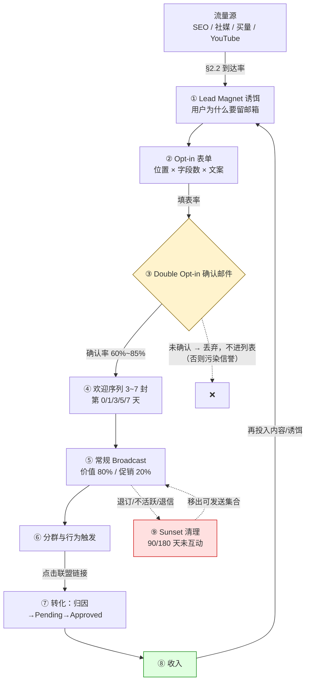
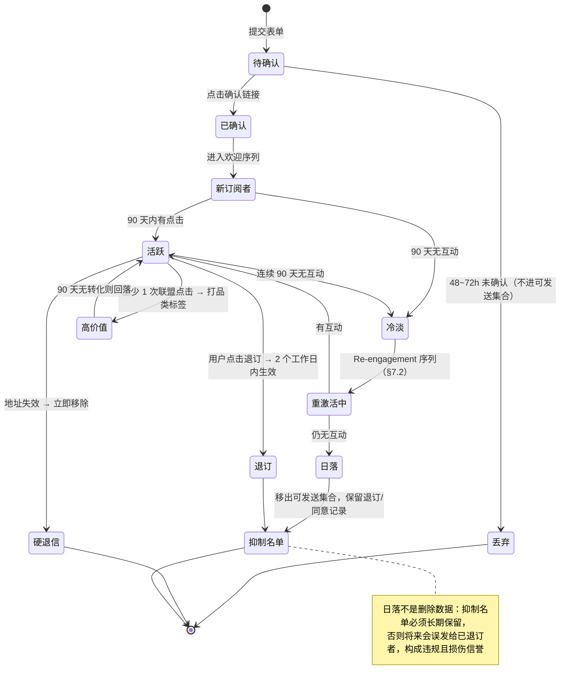
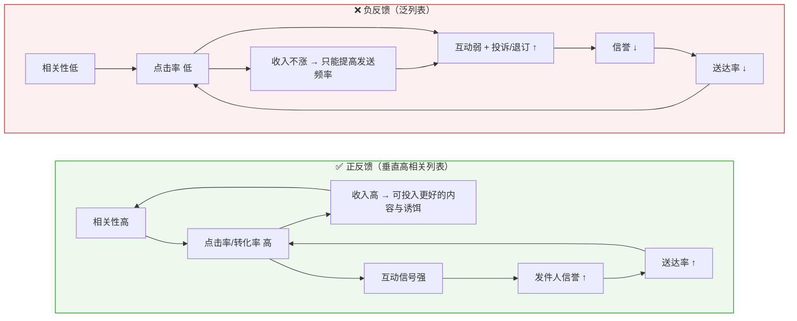

# 邮件营销与私域 List

> **一句话定位**：本文回答一个问题——**在 SEO 排名、社媒粉丝、买量账户随时可能归零的世界里，Affiliate 到底有没有一样东西是真正属于自己的？** 答案是邮件列表，但"属于"是相对的，需要用认证、合规与列表卫生持续付费维护。
>
> **核心结论先行**：邮件列表的战略价值不在"多一个触达渠道"，而在**把变现能力从别人的算法与归因链路里解耦出来**。[`联盟追踪技术与Postback.md`](./联盟追踪技术与Postback.md) §9 已确立：邮件列表是**唯一完全不依赖归因链路**的自有资产，追踪优化是"减少损失"，建列表是"改变结构"，后者杠杆更大。本文把这条结论展开为可执行的工程：**全链路 → 诱饵与列表质量 → opt-in 合规 → 送达率体系 → 序列设计 → 列表经济学 → 资产估值**。
> 但本文同时给出反面：2024 年后收件方（Gmail / Yahoo / Outlook）把发件人门槛抬高了一个量级，**"自有资产"的前提是你能持续把邮件送进收件箱**。
>
> **⚠️ 立场声明**：本文只写合规做法与"为什么灰色做法会失败"。**不写**：绕过反垃圾邮件机制的方法、购买/租用列表的渠道、提高送达率的灰色技巧（如轮换发件域名躲避信誉惩罚、伪造互动信号的"预热服务"）。判定标准：如果一段内容能被垃圾邮件发送者直接拿去执行，就不该出现在这里。
>
> **可信度标签**：`[标准]` 官方明文　`[政策]` 平台公开政策（标时点）　`[惯例]` 行业共识　`[推断]` 待验证推导
>
> 最后更新：2026-09-11

---

## 1. 立论：为什么邮件列表是 Affiliate 唯一真正"自有"的资产

### 1.1 四类流量的资产属性对照

`[推断]` 判断一个流量来源是不是"资产"，看四件事：**谁能单方面让你归零、数据能不能带走、归因链路断了它还在不在、能不能被估值交易。**

| 流量类型 | 控制权 | 谁决定生死 | 归因链路依赖 | 可迁移性 | 估值属性 |
|---|---|---|---|---|---|
| **SEO 流量** | 无（内容是你的，排名不是） | Google 算法与竞争者；HCU 类更新可一夜清空 | 高——点击必须穿过联盟跳转与 Cookie/Click ID | 差：域名权重不可搬迁，换域名等于从零开始 | 可估值但**高度脆弱**，买家按算法风险折价 |
| **社媒粉丝** | 无（账号在平台名下） | 平台风控、限流、封号；算法决定分发 | 高——外链常被平台改写或屏蔽 | 极差：粉丝 ID 无法导出，平台禁止站外导流 | 多数并购交易**不承认**为独立资产 |
| **买量流量** | 无（账户在平台名下） | 广告平台审核、素材衰减、CPC 通胀 | 高——依赖 Pixel/Postback/第三方追踪，最易丢单 | 差：账户与学习数据不可迁移 | 通常按零估值，只有落地页与素材库可交易 |
| **邮件列表** ★ | **较高**（名单可导出，域名可自有） | **你 + 收件方策略**（Gmail/Yahoo/Outlook 判定）+ ESP 的 AUP | **低**——见 §1.2 | 好：CSV 可导出，域名信誉随域名走 | **可独立估值**，尽调看 RPES × 规模 × 同意记录 |

### 1.2 呼应并深化：为什么"不依赖归因链路"

`联盟追踪技术与Postback.md` §7 列出 **17 个丢单点**，其中至少 6 个在后台完全不可见。把邮件点击与 SEO 点击并排看，丢单结构完全不同：

| 丢单环节 | SEO 流量点击 | 邮件点击 | 差异机制 |
|---|---|---|---|
| 浏览器隐私策略（ITP / 第三方 Cookie） | 高影响 | 中低影响 | 邮件点击常是"用户主动打开后直达商家站"的第一跳；且邮件用户更偏桌面端与已登录浏览器 `[推断]` |
| 广告拦截器 | 高影响 | 中影响 | 拦截器主要拦页面脚本；邮件里的链接是主动点击，跳转服务被拦概率更低 |
| 平台限流 / 外链改写 | 不适用 | 中影响 | 邮件客户端会给链接包一层 link shim（Postback §3.3），可能改 Referrer、预加载链接 |
| **触达是否发生** | 不由你决定（Google 决定） | **由你决定**（只要送达） | ← 这是本质差异 |

**深化后的准确表述** `[推断]`：邮件列表的"自有"体现在**触达权的自主性**，而不是**归因的免疫性**。邮件里的联盟链接照样要走 跳转 → Cookie/Click ID → 商家转化 → Postback → 归因判定，照样丢单、照样被优惠券站在结账前 Last Click Override。（**这不否定 Postback §9 的结论**——那条结论讲的是**资产属性**不依赖归因链路：列表本身作为存量资产，其存在与可触达性不需要归因成功；本节补充的是**单次变现动作**仍依赖归因链路。两者不矛盾，合起来才是完整图景。）真正不同的是三条：
① **触达频率由你控制**——SEO 是"用户搜了你才出现"，邮件是"你想说话就能说话"，这让**再触达**成为可能；
② **再触达能救回窗口期损失**——`联盟角色与佣金模型.md` §4.3 算出：考虑型消费（μ≈7 天）下 7 天窗口只捕获 63.2%、30 天捕获 98.6%；高决策型（μ≈20 天）30 天也只有 77.7%。**在短窗口计划下，救回那 36.8% 漏损的唯一手段就是在窗口内再发一封邮件让用户重新点击、刷新归因时间戳。** 这是邮件对联盟经济最具体、可量化的一条贡献；
③ **上下文由你控制**——用户在你的邮件里看到推荐时，心智是"我信任的人在给我建议"，而非"搜索结果页里的一条广告"。意图更强 → CR 更高（`落地页与转化漏斗设计.md` §5.2：列表内用户 CR 是冷流量的 **2~5 倍**）。

### 1.3 反面：为什么"自有"是相对的

`[推断]` 2024 年之后邮件列表的控制权**显著下降**：**① 收件方是新的守门人**——Gmail/Yahoo/Outlook 各自维护发件人信誉模型，可以不通知你就把邮件全量投进垃圾箱，且没有 Search Console 那样的明确反馈渠道；**② 2024-02 起 Google 与 Yahoo 设了硬性门槛**（§6.3），把"随便发发"的成本抬到工程级别；**③ ESP 是第二个守门人**——名单可导出，发送能力不可，多数主流 ESP 对纯联盟营销有限制（§5.2）；**④ 域名信誉可随域名迁移，但不能凭空重建**。

> **结论**：邮件列表是四类流量里**资产属性最强**的一个，但它不是"永久产权"，更像"需要每年交税的产权"——税就是认证配置、列表卫生、内容供给与合规成本。停止交税，资产会折旧到零（§8.5 给出折旧速度）。

### 1.4 三个可测判据

不要用订阅者数判断资产，用这三个：

| 判据 | 计算 | 健康线 `[惯例]` 2024~2026 | 意义 |
|---|---|---|---|
| **RPES**（每订阅者月价值） | 月邮件收入 / 活跃订阅者数 | 联盟列表 $0.05~$0.30；品牌自营 $0.7~$3.0 | 唯一能跨列表比较的价值指标（§8） |
| **互动率** | (点击+回复) / 送达 | 点击率 1.5%~5% | 直接决定发件人信誉，信誉决定送达率 |
| **同意可举证率** | 有完整同意记录的订阅者 / 总数 | 目标 100%，<80% 视为重大瑕疵 | 决定收购尽调中是否被计价（§9.4） |

> **RPES 为什么远低于品牌自营列表** `[推断]`：同参数下品牌自营每单赚**毛利**（假设 45%），联盟列表赚**净佣金**（§8.2 算出约 GMV 的 6.2%）。所以联盟列表 RPES 结构上只有品牌列表的 **10%~20%**——这不是能力问题，是商业模式问题，也解释了为什么联盟邮件必须靠**相关性**而非**规模**取胜（§8.3）。

---

## 2. List Building 全链路



**读图要点**：③ 与 ⑨ 是两个"减法节点"，看起来在减少规模，实际在保护域名信誉——**列表规模是虚荣指标，可发送集合（mailable set）才是真实资产**。

### 2.1 每步转化率区间与主要流失原因

`[惯例]` / `[推断]` 2024~2026。**所有区间都极宽**，因为决定性变量是「流量相关性 × 诱饵相关性」，同一套工具在不同 Niche 上能差 10 倍。任何"行业平均订阅率"都应视为无意义数字。

| 步骤 | 指标 | 典型区间 | 主要流失原因 | 改进杠杆 |
|---|---|---|---|---|
| ①→② | 看到表单的 UV 占比 | 内嵌 100%（注意力低）／弹窗 60%~85% | 表单在折叠线下；移动端弹窗被系统拦截 | 位置（§8.4 量化） |
| ②→③ | opt-in 提交率（按 UV） | 内嵌 0.2%~0.6%／定时弹窗 0.8%~2.5%／exit-intent 1.5%~4%／Content Upgrade 3%~10% | 诱饵不相关；字段太多；不信任（"会不会给我发垃圾邮件"） | 诱饵类型（§3）；字段降到 1 个 |
| ③→④ | Double Opt-in 确认率 | 60%~85% | 确认邮件进垃圾箱；用户忘了自己订阅；按钮不显眼 | 确认邮件里**立刻交付诱饵**、发件人名与订阅时一致、单一大按钮 |
| ④ | 欢迎序列完成率 | 25%~55% | 序列太长；第 2 封就促销；发件人不像人 | 3~5 封、每封单一目的、第 0 封在 opt-in 后 **5 分钟内**发（§7.1） |
| ⑤ | 单封 Broadcast 点击率 | 1.5%~5% | 内容不匹配；促销比例过高致疲劳 | 分群（§7.5 算例 E：EPC 可翻倍） |
| ⑥→⑦ | 邮件点击→成交 CR | 热列表 3%~8%／冷列表 0.5%~2% | 商家落地页差、价格不匹配、窗口期已过 | 选品；点击后直跳不绕路 |
| ⑦→⑧ | 归因成功率 × 通过率 | Postback §7；通过率健康线 >85% | Cookie/Click ID 丢失、被 Override、Reversal | 争取不可被覆盖的归因优先级 |
| ⑨ | 月流失率 | 2%~5%/月 | 退订 + 邮箱失效 + 长期不活跃被清理 | 内容质量与频率控制（§7.3） |

### 2.2 全链路漏损：1,000 UV 值多少钱

`[推断]` 取中位参数，用于建立数量级直觉：

```
1,000 UV
  × 表单可见率 75%         =  750 人看到 opt-in 入口
  × opt-in 提交率 1.5%     =  11.3 个邮箱提交        ← 每 100 UV 约 1.1 个
  × Double Opt-in 78%      =   8.8 个确认订阅者
  × 单封促销点击率 5%      =   0.44 次点击
  × 商家站 CR 4%           =   0.018 单
  × 净佣金/单 $5.28（§8.2）=   $0.094
  （欢迎序列完成率 40% ≈ 3.5 人真正读完 → 影响后续留存，不进入本次点击计算）

→ 1,000 UV 的邮件腿首月贡献约 $0.09，单月看毫无意义。
→ 意义在于这 8.8 人是【可反复触达的存量】，12 个月后累计收入远超当月（§8.4）。
```

**这条演算的真正用途**：解释为什么"这个月做了弹窗但收入没变"不是失败信号——**List Building 是资本性支出，不是费用性支出**，用当月 ROI 评估它必然得出错误结论。

### 2.3 订阅者生命周期状态机



---

## 3. Lead Magnet：诱饵类型决定列表质量

**诱饵**（Lead Magnet）
- 定义：用户用邮箱地址交换的即时交付物。
- 通俗解释：不是"订阅我的通讯"，而是"给我邮箱，我现在就给你这个有用的东西"——把"承诺未来价值"换成"立刻兑现价值"。
- 易混提示：与 **Content Upgrade**（内容升级）的区别——后者是**针对某一篇具体文章**定制的补充资料（文章讲"如何选咖啡机"，升级物是"参数对比表"），相关性远高于通用诱饵，因此转化率高一个量级，但每篇都要单独做，人力成本高。

### 3.1 九类诱饵对照

`[惯例]` / `[推断]` 2024~2026。**"列表质量"这一列才是选型依据，订阅率是陷阱指标。**

| 诱饵类型 | 制作成本 | 订阅转化率区间 | **列表质量** | 适用品类 | 长期留存 |
|---|---|---|---|---|---|
| **Checklist / 清单** | 极低（半天） | 1%~3% | 中——筛出"想要结构化答案"的人 | 全品类通用 | 中 |
| **模板 / 可复制文件**（表格、Prompt、Notion 模板） | 低~中 | 2%~6% | **高**——用模板的人有真实任务在身 | 工具、SaaS、办公、设计 | 高 |
| **工具 / 计算器**（在线计算器、评分器） | 中~高（需开发） | 3%~8% | **极高**——填写过程即自曝需求与预算 | 金融、保险、健身、房贷、SaaS | 极高 |
| **折扣码 / 优惠码** | 极低 | **3%~10%（最高）** | **最低** ← §3.2 | 电商、快消 | **低** |
| **免费课程 / Email Course**（分 5~7 天发送） | 中 | 1.5%~4% | **极高**——愿连续读 7 天者意图极强 | 教育、B2B、技能类 | 极高 |
| **行业 / 数据报告** | 高（需真实数据） | 0.8%~2.5% | 高（B2B 尤其） | B2B、SaaS、投资 | 中高 |
| **Quiz / 测评**（做完给结果，结果页收邮箱） | 中 | 5%~15% | 高——**且天然带分群标签** | 健康、美妆、教育、保险 | 高 |
| **试用 / Freemium 账户** | 高（要有产品） | 视产品 | 最高（已是用户） | 自有产品的 Affiliate | 最高 |
| **"独家更新"承诺**（无实物诱饵） | 零 | 0.2%~0.8% | 低~中，取决于是否真兑现 | 强人设的个人品牌 | 低 |

### 3.2 反直觉结论：折扣码型 = 最高订阅率 + 最差列表质量

`[推断]` **这是本篇最值得记住的一条。** 折扣码诱饵吸引来的三类人：① **价格敏感型**——只在有折扣时买，无折扣邮件点击率趋近于零，你的促销比例被迫不断上升；② **折扣聚合型**——同时订阅所有竞品的折扣列表，你在他的收件箱里与 20 个同类发件人竞争，打开与否只取决于哪家折扣更大；③ **一次性意图**——本次购买意图在被给码的那一刻就已满足，订阅动机同时结束。

三重后果：**月流失率可达 5%~10%**（优质列表的 2~3 倍）→ 互动率低 → 发件人信誉降 → 送达率降 → 更低互动率（§8.3 负反馈）→ **RPES 极低**。§8.4 算例 C 给出完整数值证明：折扣码方案订阅者最多（8,930 人），第 12 个月月收入只有 **$93**；Content Upgrade 方案（7,348 人）做到 **$1,080**。

> **判断口诀**：**订阅率高但相关性低的诱饵，是在用未来的送达率换今天的订阅数。**
> **例外** `[惯例]`：优惠券站 / 比价站的商业模式本身就是折扣聚合（见 [`电商Affiliate与亚马逊联盟.md`](./电商Affiliate与亚马逊联盟.md)），此时列表质量的"差"是设计内的——但这类站的核心风险不在邮件，而在被商家排除计佣与 Last Click 归因争议（见 [`联盟反作弊与扣量.md`](./联盟反作弊与扣量.md)）。对**内容站**而言，折扣码诱饵几乎总是错误选择。

### 3.3 相关性原则：诱饵必须是"你将来要卖的东西的前置问题"

`[推断]` 可直接执行的检验：**把诱饵与打算推的 Offer 并排放，问"想要这个诱饵的人，为什么自然会想要那个商品？"**

| 将来要推的 | ✅ 合格诱饵（前置问题） | ❌ 不合格（无关或错位） |
|---|---|---|
| 高端咖啡机（$800+） | "家用意式机选购决策树 + 参数对比表" | "免费咖啡优惠券包" |
| B2B SaaS（循环佣金） | "某岗位 SOP 模板 + 工具栈清单" | "抽奖赢一年会员" |
| 床垫（超高客单） | "按睡姿/体重的床垫硬度选择器" | "家居品类 10% off 码" |
| 保险 / 金融（CPL 高派款） | "保额计算器 + 条款坑点清单" | "理财电子书" |
| 健身补剂 | "12 周训练计划表 + 补剂时序图" | "蛋白粉折扣码" |

**推论**：相关性同时决定三件事——① 订阅率；② 列表质量（自我筛选出有真实任务的人）；③ **后续促销邮件的合法性感知**（用户觉得"你推荐是因为你懂我的问题"而非"你在卖我"）。第三点最被低估，它直接决定**投诉率**，而投诉率是 §6.3 的硬性准入线。

### 3.4 与 CPA 多级漏斗的接口

[`CPA网络与Offer市场.md`](./CPA网络与Offer市场.md) 的 **Multi-step Funnel**（广告 → Pre-lander → Quiz → Email 收集 → Offer）与本文在技术上是同一条链路的两种目的：

| | 买量型 CPA 漏斗 | 内容型 List Building |
|---|---|---|
| 收邮箱的目的 | 满足 Offer 的 Lead 定义，拿 Payout | 建立可反复触达的存量 |
| 同意范围 | 常写成"我们及合作伙伴的营销信息" | 应为**你自己的**内容营销，目的限定 |
| 合规风险 | **极高**——GDPR 下打包同意的目的限定存疑（§4.3） | 可控 |
| 能否二次变现 | 法律上多数情形**不可以**（§4.9） | 可以，这是它的核心价值 |

`[推断]` **关键提醒**：从 CPA 漏斗收来的地址，若同意文本是"接收来自我们及合作伙伴的营销信息"，在 GDPR 下这种**打包同意**很可能不满足"具体、明确"的要求——你既不能合法地把它当自有列表长期运营，也不能卖给别人。**做漏斗收邮箱之前先决定这个列表将来归谁用**，这决定同意文本怎么写，而同意文本一旦落地就改不了。

---

## 4. Opt-in 机制与合规

### 4.1 Single vs Double Opt-in：四维权衡

**Double Opt-in**（DOI，双重确认）
- 定义：用户提交邮箱后，系统再发一封确认邮件，点击确认链接才正式入列。
- 通俗解释：Single 是"你说要就算要"，Double 是"我再问一次你确定吗"。
- 易混提示：与 **Opt-out**（默认订阅 + 给退订入口）完全不同——Opt-out 在 GDPR/CASL/德国法下**直接违法**，在美国 CAN-SPAM 下却是合法基线（§4.4，最大误解源）。

| 维度 | Single Opt-in | Double Opt-in |
|---|---|---|
| **转化率** | 100% | 60%~85% `[惯例]`（损失 15%~40%） |
| **列表质量** | 低——含拼错地址（`gmial.com`）、机器人提交、随手填 | **高**——地址真实且可收信，硬退信率大幅下降 |
| **送达率** | 差——无效地址产生硬退信，退信率是信誉强负信号（§6.5） | **好**——退信率通常低 50%~80% `[推断]` |
| **合规性** | 美/澳可用；德/奥/瑞**法律上不够**；GDPR 下举证困难 | 全球最稳妥；德国等市场事实上强制（§4.2） |
| **同意举证** | 只有"某时刻某 IP 提交了表单"，无法证明是邮箱持有人本人 | 确认点击构成"该邮箱控制人同意"的强证据 |
| **Spam Trap 风险** | 较高（陷阱地址可被自动填充） | 低（陷阱地址不会点确认链接） |

`[推断]` **决策建议：默认用 Double Opt-in。** 损失的 15%~40% 正是"本来就不该进列表的人"——地址无效者推高退信率，无意愿者推高投诉率与不活跃占比，两者都通过 §6.4 的负反馈压低**整个列表**的送达率。用 30% 名义规模换送达率与信誉改善，长期净值为正。仅在同时满足 (a) 目标市场法律允许 Single（美/澳）、(b) 收集环节已做实时邮箱语法与可投递性校验、(c) 能承受较高退信率 三个条件时才考虑 Single。

### 4.2 为什么德国法律上要求 Double Opt-in

`[政策]` 德国《反不正当竞争法》UWG §7(2) Nr.2 / §7(3)：向自然人发广告邮件需**事先明示同意**（vorherige ausdrückliche Einwilligung），唯一例外是 §7(3) 的既有客户软性同意。关键在于**举证责任在发件人**：德国法院长期判例要求广告主能证明同意存在，而 DOI 的两步日志（提交时间/IP + 确认时间/IP）是司法实践接受的证明形式；仅有 Single Opt-in 日志通常被认为无法排除第三人代填，不构成有效证明。`[惯例]` **实务后果**：面向德国（及奥地利、瑞士同类法域）的列表，Single Opt-in 等于没有同意证据，一封警告函（Abmahnung）就可能带来律师费与和解金。

### 4.3 GDPR：六项义务与"Legitimate Interest 为什么不行"

`[政策]` GDPR（Regulation (EU) 2016/679，2018-05-25 适用）+ ePrivacy Directive（2002/58/EC）Art. 13。时点 2026-09。**拟议中的 ePrivacy Regulation 至今未通过，Art. 13 仍是现行依据。**

| 义务 | 依据 | 邮件营销的落地 |
|---|---|---|
| **明示同意，不得 opt-out** | ePrivacy Art. 13(1)；GDPR Art. 6(1)(a)、7 | 预勾选框（pre-ticked）**无效**；沉默或不作为不构成同意 |
| **同意须具体、知情、明确** | Art. 4(11)、Recital 32 | 必须写清"**谁**会用这个邮箱发**什么类型**的内容"；"及我们的合作伙伴"这类打包授权在多数监管解读下不满足"具体" |
| **目的限定** | Art. 5(1)(b) | 为"选购指南通讯"收的地址，不能拿去推无关品类的联盟 Offer |
| **撤回与给予同样容易** | Art. 7(3) | 订阅只填一个邮箱 → 退订必须一键完成：不得要求登录、填理由、电话确认 |
| **同意记录的举证责任** | Art. 7(1) | 留存时间戳、来源 URL、当时展示的同意文本版本、IP（建议截断，见 Postback §8.2 最小化原则）、DOI 确认时间戳 |
| **隐私政策披露 + 数据主体权利** | Art. 13、15~21 | 披露处理者身份、目的、保留期限、第三方接收者（含 ESP 与所在国）、传输机制（SCC）；支持访问/更正/删除/可携带 |

**为什么 Legitimate Interest（正当利益，Art. 6(1)(f)）不能用于营销邮件** `[政策]` / `[推断]`——这是最常见的合规误判，来源是对 **Recital 47** 的断章取义（它确实写了"为直接营销目的处理个人数据可视为出于正当利益"）。三条反驳：**① 两法并行取更严者**：GDPR 管"处理个人数据"，ePrivacy Art. 13(1) 管"向自然人电子信箱发送营销信息"这个**行为本身**，后者明确要求 **prior consent**，只给既有客户留了 soft opt-in 例外——即使 LI 满足了 GDPR 的合法性基础，**发送行为本身仍违反 ePrivacy**；**② Art. 21(2)~(3)** 赋予数据主体对直接营销的**无条件反对权**，这在实践上把 LI 变成"先发后撤"，与 Art. 13(1) 的"先同意后发"直接冲突；**③ LIA 三步检验过不了**：必要性测试必然失败（完全可以用同意机制达成同一目的），且"用户合理预期收到陌生联盟推广邮件"不成立。

> **结论**：**营销邮件的唯一稳妥合法性基础是明示同意**（或 §4.6 的 soft opt-in，且前提严格）。任何"我们用 Legitimate Interest"的说法在邮件场景下都应视为红旗。

### 4.4 CAN-SPAM Act（美国）：七项义务与 Affiliate 连带责任

`[政策]` CAN-SPAM Act of 2003（15 U.S.C. §§7701–7713）+ FTC 实施规则（16 CFR Part 316）。时点 2026-09。

| 义务 | 要求 | 常见违规 |
|---|---|---|
| **不得虚假/误导性报头** | From、To、Reply-To 与路由信息真实准确 | 用看似个人邮箱的地址掩盖商业主体 |
| **不得欺骗性主题行** | 主题行不得就内容误导收件人 | "Re: 你的订单"（无订单关系）、"你的退款已处理"、伪装成对话回复 |
| **广告性质披露** | 法案原文要求可识别为商业信息；**FTC 2005 最终规则认定该识别要求非必要**，但仍不得整体误导 | 把联盟推广写成中立测评且不披露利益关系（这会落到 FTC Act §5 与 Endorsement Guides，而非 CAN-SPAM） |
| **有效实体邮寄地址** | 当前有效的实体邮政地址（街道 / PO Box / 商业私人邮箱） | 只写网址；地址已失效 |
| **清晰醒目的退订机制** | 可运行；**不得收费**；不得索要邮箱与拒收理由之外的信息；不得要求用户执行"回复邮件或访问单一网页"以外的步骤 | 要求登录才能退订；退订页还要填问卷；只给 mailto 但无人处理 |
| **退订 10 个工作日内生效** | 且退订后不得转让/出售该地址（受托合规处理的承包商除外） | 退订后仍收到营销邮件 |
| **禁止特定获取与发送方式** | 禁止向 **address harvesting**（网站批量抓取）或 **dictionary attack**（穷举生成）所得地址发送；禁止虚假信息注册账户/IP；禁止经开放中继发送；禁止使用被入侵计算机 | **这条直接判了"买来的列表"死刑**——你无法验证供应商的地址来源（§4.9） |

**罚则量级** `[政策]` 2024~2025：民事罚款按"**每封邮件一次违规**"计，金额由 FTC **每年按通胀调整**，近年区间约 **$51,000~$53,000/封**（2024 年为 $51,744 量级）。**必须核当期 FTC 年度调整公告**——量级足以让一次小规模违规（哪怕 100 封）变成灾难。另有州检察长与受影响 ISP 的私人诉权。

> **⚠️ 与 Affiliate 直接相关的连带责任** `[政策]` 15 U.S.C. §7705：**① 发送者责任**——发起或促使发起商业邮件的一方担责，**Affiliate 自己群发推广邮件就是 sender，独立承担全部义务**；**② 商家责任**——其商品被推广的商家若**知道或应当知道**该违规推广且**从中获得经济利益**，也担责（能证明已建立并执行合理合规程序可免责）。**这条解释了行业现象**：为什么联盟合约里几乎都写明"禁止未经批准的邮件营销方式"并保留审计权与立即终止权——商家在用合同把 Affiliate 的邮件合规风险挡回去。你违规发信，最先切断你的往往是商家。

**CAN-SPAM 与 GDPR 的根本差异**：CAN-SPAM 是 **opt-out 制**（可先发，给了退订机制即合法），GDPR/ePrivacy 是 **opt-in 制**（必须先有同意）。**美国列表与欧盟列表不能用同一套同意流程。** 另 CAN-SPAM §7707 优先于州反垃圾邮件法，但**不排除**州法中针对欺诈/虚假陈述、计算机犯罪、消费者保护（如加州 UCL）的条款——所以"CAN-SPAM 合规 = 全美安全"也不成立。

### 4.5 CASL（加拿大）：默示同意有时限

`[政策]` Canada's Anti-Spam Legislation（S.C. 2010, c. 23），邮件条款自 2014-07-01 施行。时点 2026-09。适用 **CEM**（Commercial Electronic Message，含邮件、短信、即时消息）。要求**明示同意**（无时限但可随时撤回）或**默示同意**（**有时限**）：① 既有商业关系（自最近交易起 **2 年**）；② 既有非商业关系（会员/捐赠，**2 年**）；③ 收件人**公开**其地址且未声明拒绝、且内容与其职务相关；④ 收件人直接向发件人提供地址且内容相关。内容义务：识别发件人身份 + 提供**发送后至少 60 天内有效**的联系方式 + 可运行退订机制（**10 个工作日内生效**）。**举证责任在发件人**。罚则：个人最高 **CAD $1,000,000**、组织最高 **CAD $10,000,000**（按违规计）。私人诉权原定 2017-07-01 生效，**被政府无限期暂停至今未施行** `[政策]`，需核当期。

`[推断]` **实操含义**：加拿大地址**不能与美国地址用同一套 opt-out 逻辑**。特别是"默示同意 2 年时限"——若列表里的加拿大地址依据是 2 年前的购买关系，**时限已过，继续发送即违规**。多数 ESP 不会替你追踪这个时限，需在数据层自己打标。

### 4.6 英国 PECR 与 soft opt-in 例外

`[政策]` PECR 2003 Reg. 22 + UK GDPR / DPA 2018。时点 2026-09（英国近年有数据保护立法修订，以当期为准）。**基线**：向个人（含 sole traders 与多数合伙企业）发营销邮件需**事先同意**，唯一例外是 **soft opt-in**，三条件必须**同时**满足：

| 条件 | 要求 | Affiliate 为什么用不了 |
|---|---|---|
| ① 关系来源 | 联系方式是在**你（发件人）自己**的销售或销售磋商过程中获得的 | **致命**：Affiliate 与订阅者通常无销售关系；用户是在你的**内容页**留邮箱，不是在你的**结账流程**里 |
| ② 内容相似性 | 只推**类似的产品或服务** | 推第三方商家的商品，与"你自己卖的东西"难以构成相似 |
| ③ 双重退订机会 | 收集时给了退订机会，且**每封邮件**都给 | 这条可以满足 |

> **结论** `[推断]`：**Affiliate 在实践中几乎无法依赖 soft opt-in**，英国市场应按纯 opt-in 处理。ICO 对 PECR 违规罚款上限 **£500,000**；若同时构成 UK-GDPR 违规，上限 **£17.5m 或全球年营业额 4%**（取高者）。

### 4.7 目的地合规对照速查

`[政策]` 时点 2026-09。**量级对照，非法律意见；面向单一市场前必须核当期条文并咨询专业人士。** 澳大利亚 Spam Act 2003 的特色是允许 **inferred consent**（推断同意：存在明显既有关系且从行为可合理推断愿意接收），比 GDPR 宽松但比 CAN-SPAM 严格；三要件为同意 + 身份识别 + 可运行退订（**5 个工作日**内生效）；罚则按 penalty unit 计，近年修法后对法人量级显著提高（以当期条款为准）。

| 目的地 | 制度 | 依据 | 买列表可用？ | 退订生效时限 | 罚则量级 | 对 Affiliate 的核心约束 |
|---|---|---|---|---|---|---|
| **美国** | **Opt-out** | CAN-SPAM 2003 | 法律上不当然禁止，但 harvesting 地址被禁 → 实务不可用 | 10 个工作日 | ~$51k~$53k/封（年度调整） | 发送者独立担责 + 商家连带责任 |
| **加拿大** | **Opt-in**（限时默示） | CASL 2014 | ❌ | 10 个工作日 | 个人 CAD $1M / 组织 CAD $10M | 默示同意 2 年时限需自行追踪 |
| **英国** | **Opt-in**（soft opt-in 例外） | PECR 2003 + UK-GDPR | ❌ | 立即/合理期限 | PECR £500k；UK-GDPR £17.5M 或 4% | soft opt-in 事实上不可用 |
| **欧盟** | **Opt-in**（严格） | ePrivacy Dir. Art. 13 + GDPR | ❌ | 与同意同样容易 | 各国 DPA，最高 €20M 或 4% | 同意记录举证责任 + 目的限定 |
| **德国** | **Opt-in**（DOI 事实强制） | UWG §7 | ❌ | 立即 | 警告函（Abmahnung）+ 罚金 | **举证责任在发件人**，Single 不足以证明 |
| **法国/荷兰/西班牙** | Opt-in，各有 soft opt-in 变体 | 各国转化立法 | ❌ | — | 各国 DPA | 荷/法对既有客户有较宽软性例外 |
| **澳大利亚** | Opt-in + **inferred consent** | Spam Act 2003 | ❌（推断同意不覆盖陌生名单） | 5 个工作日 | 按 penalty unit，量级高 | 相对宽松但身份识别义务严 |

### 4.8 购买列表（Buying Lists）为什么是禁区

**① 法律风险——最大的误读是"CAN-SPAM 是 opt-out，所以美国买列表合法"** `[政策]`。三处断裂：CAN-SPAM §5(b) 明确禁止向 **address harvesting** 与 **dictionary attack** 所得地址发送，而你**无法验证**任何第三方供应商的地址来源（供应商自己往往也不知道），一旦命中 harvested 地址即违法且举证不能的后果由你承担；即使在美国合法，只要列表里有一个欧盟/英国/加拿大/德国地址就违反当地法；买来的列表**没有任何同意记录**，在 §4.3 的举证义务面前是空的。

**② 送达率毁灭——长期损害的机制**：

```
购买列表 → 必然含 Pristine Spam Trap（§6.5）
        → 收件方与 blocklist 运营方（Spamhaus、Barracuda 等）据此判定：
           该发件实体在【未经同意】的地址上发信
        → 被拉黑的是你的【发件域名】，不只是某个 IP
        → 关键：域名信誉是长期记忆，且【跨 IP、跨 ESP 继承】
           换了 ESP、换了 IP，From 域与 DKIM d= 域还是同一个 → 信誉跟着走
        → 恢复路径：停发 + 申请 delist + 数周到数月的干净发送历史
           部分 blocklist 移除需付费，或根本不给移除渠道
```

**③ ESP 封号**：所有主流 ESP 的 AUP 都明文禁止向 purchased / rented lists 发送（基础设施级服务如 Amazon SES 在文档里写得最直接）。后果通常是**立即封号 + 未结余额不退 + 宽限期后删数据**。

**为什么"轮换发件域名"救不了你** `[推断]`（红线：只解释失败机制，不提供规避方法）：收件方的信誉判定早已不是"单域名打分"。可用于关联发件实体的信号包括同一 IP 段与同一 ESP 账户、SPF 里同一批 `include`、DKIM 签名的同一组织域、邮件正文与链接的**内容指纹**、落地页域名、退订端点、以及 ESP 自身的账户级风控。在这些信号下轮换 From 域名不产生隔离效果；而**"检测到信誉受损后立刻启用新域名"这个行为模式本身就是最强的负面信号**——它把"信誉差"升级为"故意逃避"，通常导致更严厉的发件实体级处置。**正确做法只有两条**：永远不买列表；若域名信誉已受损，唯一修复路径是**停止向低互动地址发送 + 清理列表 + 用数月干净发送历史重建信誉**。

### 4.9 同意记录该留什么（举证清单）

`[推断]` 按 §4.3 的举证责任反推。**这是收购尽调（§9.4）必查的第一张表。**

| 字段 | 为什么必须 | 备注 |
|---|---|---|
| 邮箱地址（规范化小写） | 主体识别 | — |
| 同意时间戳（UTC，精确到秒） | 证明时点 | — |
| 来源页面完整 URL | 证明同意发生的上下文 | 与 §3.4 目的限定绑定 |
| **当时展示的同意文本版本号/快照** | 证明同意的**范围** | 最常被遗漏，也是尽调最看重的一项 |
| 提交 IP（建议截断） | 佐证 | 截断后 2 段，符合最小化原则 |
| DOI 确认时间戳 + 确认 URL（含一次性 token） | 证明是该邮箱控制人本人 | Single Opt-in 无此项 → 证据链断裂 |
| 同意类型标记（express / soft opt-in / inferred + 依据事实） | CASL 2 年时限、英国 soft opt-in 三条件都需要 | 需可查询、可批量导出 |
| 退订/抑制状态与时间戳 | 证明履行了退订义务 | **永久保留**，即使订阅者已删除 |
| 数据接收方（ESP 名称、所在国、传输机制） | Art. 13 披露 + 跨境传输合规 | SCC / 充分性认定 |

---

## 5. ESP 选择

**ESP**（Email Service Provider，邮件服务商）
- 定义：提供邮件模板、列表管理、自动化流程、发送基础设施与送达率能力的 SaaS。
- 通俗解释：不是"帮你发邮件的软件"，而是"替你维护发件信誉、并对你发的内容承担连带风险的平台"——这决定了它必然有内容审查。
- 易混提示：与**邮件传输代理（MTA）/ SMTP 中继**不同——基础设施级服务（Amazon SES、SendGrid、Mailgun、Postmark 类）只给发送管道与 API，模板/自动化/分群要自建。

### 5.1 按层级分类对比

| 层级 | 适用规模 | 定价模式 | 对 Affiliate 内容的态度 | 自动化能力 | 数据出口 |
|---|---|---|---|---|---|
| **入门级**（免费邮箱/办公套件群发） | < 500 订阅者 | 免费 | **明确禁止商业群发**；免费账户有每日外部收件人上限（量级约数百封/日 `[政策]`，以当期条款为准） | 无 | 差 |
| **创作者级**（博主/Newsletter） | 500~5 万 | 按订阅者分层，常有免费档 | **两极分化**：部分明确允许创作者推广联盟产品，部分把"纯联盟营销"列入禁止内容 | 中（简单序列 + 少量触发） | 中（CSV 可导，行为数据受限） |
| **营销级**（中小企业营销自动化） | 1 万~50 万 | 按订阅者 + 功能模块 | 多数 AUP 限制"以联盟佣金为主要收入的内容"，需事前披露或申请 | **强**（多分支、评分、CRM 字段） | 中~好（API + Webhook，历史事件导出常受套餐限制） |
| **电商级**（自营电商） | 1 万~数百万 | 按活跃资料数 + GMV 分层 | 对**自家产品**友好；对纯第三方联盟推广通常不友好 | **最强**（商城集成、预测性分群、RFM） | 好 |
| **基础设施级**（SMTP/API） | 无上限 | **按发送量**（量级 $0.10~$0.90/千封 `[惯例]`） | 只看投诉率与退信率，不做内容审查；但**明文禁止 purchased/rented lists** | 无（自建） | **最好**（原始日志、事件回调） |

### 5.2 关键红线：AUP 里的 "affiliate marketing" 限制

`[政策]` / `[惯例]` **这是选 ESP 时最容易被跳过、后果最严重的一步。** 机制：ESP 与收件方之间存在**账户级信誉绑定**——共享 IP 段上只要有一个客户大量发垃圾邮件，同段所有客户的送达率一起下降。所以 ESP 必须做客户与内容审查，而"以联盟佣金为主要收入的邮件"在风控模型里属高风险类目（投诉率高、退订率高、常与 CPA 漏斗/折扣码诱饵绑定，§3.2）。因此**大量主流 ESP 在 AUP 的 Prohibited Content / Restricted Use 清单里直接写明 affiliate marketing、multi-level marketing 等条目**，或要求事前书面批准。违规后果通常不是警告，而是**立即封号 + 不退未结余额 + 宽限期后删数据**，历史上还有 ESP 之间共享黑名单的情形。

| AUP 要查的条目 | 关键词 | 通过标准 |
|---|---|---|
| 禁止内容清单 | `prohibited content` / `restricted use` / `affiliate` / `multi-level marketing` | 未列入，或明确说明允许何种形式 |
| 列表来源要求 | `purchased lists` / `rented lists` / `third-party lists` / `co-registration` | 明文禁止 → 你必须 100% 自有 opt-in（与 §4.8 一致，这是好事） |
| 投诉率/退信率阈值 | `complaint rate` / `bounce rate` / `suspension` | 阈值明确且可达（通常投诉率 <0.1%~0.3%） |
| 发送量与预热限制 | `warm-up` / `sending limits` / `daily cap` | 与你的规模增长曲线匹配 |
| 数据导出权 | `export` / `data portability` / `termination` | 封号或退订后能否拿到完整列表与行为数据 |
| 跨境传输 | `sub-processors` / `SCC` / `data residency` | 有 SCC 或充分性依据，且能披露给订阅者（§4.3） |
| 联盟披露义务 | `FTC disclosure` / `endorsement` | 是否要求邮件内做利益关系披露 |

> **合规路径** `[惯例]`：若你的模式确实是纯联盟营销，正确做法是**在注册与 AUP 审查时如实披露业务模式**（推广第三方产品、佣金结算、有 FTC 披露），选择明确接受该模式的服务商。**靠隐瞒用途通过审核是最差选择**：ESP 的内容扫描与投诉率监控几乎必然在数周内发现，届时是"违规 + 欺诈性陈述"双重定性，封号不退款，还会留下跨服务商负面记录。
> 本节不推荐具体服务商——各家 AUP 历史上多次修订，**任何二手总结都可能在 6 个月内过期**，只能读当期原文。

### 5.3 定价模式与算例 D：按订阅者 vs 按发送量

**假设表** `[推断]`（价格为量级示意，非任何服务商报价）：20,000 订阅者；按订阅者 **$15/千/月**（通常含发送量上限，如 12× 订阅者数）；按发送量 **$0.90/千封**；基础设施级 **$0.20/千封**（+ 自建自动化人力）。

```
盈亏平衡封数 = 按订阅者单价 / 按发送量单价 = $15 / $0.90 = 16.7 封/月

每订阅者月发送   按订阅者   按发送量   基础设施级   最优
     4            $300       $72        $16       基础设施级
     8            $300      $144        $32       基础设施级
    10            $300      $180        $40       基础设施级
    16            $300      $288        $64       按订阅者
    24            $300      $432        $96       按订阅者
```

**结论**：① **低频（<8 封/月）→ 按发送量/基础设施级更省；高频（>17 封/月）→ 按订阅者更省**，因为前者随发送量线性增长、后者固定。② **两个隐藏成本**：基础设施级省下现金，付出的是**送达率工程人力**（认证、退信处理、Sunset 策略要自建）与自动化开发——对 2 万订阅者的联盟列表，这部分人力通常远高于省下的差价 `[推断]`。③ **定价模式本身在塑造列表卫生行为**：按订阅者计价时，§6.5 的 Sunset 清理每移出 1,000 个不活跃地址就每月省 $15；按发送量计价则相反——列表规模不花钱但低互动毁信誉，成本模型会诱导你保留垃圾地址。

### 5.4 关键能力清单

| 能力 | 为什么对 Affiliate 关键 | 最低可接受标准 |
|---|---|---|
| **分群（Segmentation）与标签** | §7.5 算例 E：行为分群可让 EPC 翻倍 | 支持按"链接点击、页面浏览、标签、自定义字段、时间窗"组合分群，且分群可保存复用 |
| **行为触发（Automation）** | 点击未转化/重激活序列的基础 | 多分支、延迟、条件判断、达成目标即退出（exit on goal） |
| **A/B 测试** | 主题行与发送时段优化 | 至少主题行 A/B；最好含内容、发件人名、发送时间 |
| **送达率基础设施** | §6 全部依赖它 | 自定义域名 DKIM（`d=` 与 From 域对齐）、SPF include、DMARC 报告接入、**专用 IP 选项**、**FBL** 自动处理、**ARC 支持** |
| **一键退订（RFC 8058）** | 2024 后向 Gmail/Yahoo 群发的硬性要求（§6.3） | 自动写入 `List-Unsubscribe` + `List-Unsubscribe-Post`，退订端点为单请求 POST |
| **API 与 Webhook** | 把联盟转化数据回灌进列表做分群 | 事件级 Webhook（送达/打开/点击/退信/退订/投诉）+ REST API |
| **原始数据导出** | §9.2 迁移能力的前提 | 可导出订阅者字段 + 完整事件历史（非仅聚合报表） |
| **多域名支持** | 不同 Niche 站用不同 From 域，避免信誉互相污染 | 多品牌/多域名账户，各自独立 DKIM |

**FBL**（Feedback Loop，投诉反馈回路）
- 定义：收件方（ISP）把用户"标记为垃圾邮件"的事件回传给发件方的机制。
- 通俗解释：让你立刻知道谁举报了你，从而马上把他移出列表——否则你会反复给已举报者发信，投诉率持续累积。
- 易混提示：FBL 不是"投诉率报表"，它是**实时事件流**；没有 FBL 自动处理，抑制名单永远不完整。

---

## 6. 送达率（Deliverability）体系：本篇技术核心

**送达率**（Deliverability）
- 定义：发出的邮件中真正进入**收件箱**（而非垃圾箱或被静默丢弃）的比例。
- 通俗解释：它有两层——"送达到邮箱服务器"（delivery rate）与"落进收件箱"（inbox placement rate）。后者才有意义，而后者**你看不到**，只能推断。
- 易混提示：ESP 报表里的 delivered 只表示对方服务器接受了这封信（250 OK），不表示用户看得到。

### 6.1 认证三件套

三者是**串联**关系：SPF 与 DKIM 各自证明一件事，DMARC 把它们与 From 域绑定并声明处置策略。**只有 SPF 不够，只有 DKIM 也不够。**

**SPF**（Sender Policy Framework，发件人策略框架）`[标准]` RFC 7208（取代 RFC 4408）
- 定义：发布在 DNS TXT 记录里的授权清单，声明"哪些服务器被授权代表本域名发信"。
- 通俗解释：域名主人贴的门禁白名单。收件方查这张名单：发信 IP 在名单上 → pass，不在 → fail。
- 易混提示：SPF 校验的是 **envelope from（MAIL FROM / Return-Path）**，**不是**用户看到的 `From:` 头——这正是"SPF 单独不够"的根本原因，也解释了 DMARC 为什么需要 alignment。

```
v=spf1 include:_spf.esp-a.com include:esp-b.net ip4:203.0.113.7 -all
  include: 引入第三方（你的 ESP）授权清单     ip4:/ip6: 直接授权某 IP
  -all hardfail（推荐，纯发送域）  ~all softfail（过渡期）  ?all neutral（等于没配）
  +all 灾难：任何人都可冒充本域，严禁使用
```

**DKIM**（DomainKeys Identified Mail，域名密钥识别邮件）`[标准]` RFC 6376（取代 RFC 4871）
- 定义：用发件域的**私钥**对指定头与正文哈希签名，签名放进 `DKIM-Signature` 头；**公钥**发布在该域 DNS 上，收件方验签。
- 通俗解释：给邮件盖防伪钢印，钢印在信里、验印的公开钥匙挂在 DNS 上。**信被转发多少次钢印都还在**——这是 DKIM 相对 SPF 的关键优势。
- 易混提示：DKIM 保护**内容完整性 + 发件域身份**，不保护"这封信是否被授权发出"（那是 SPF 的事）。两者互补不可互替。

**DMARC**（Domain-based Message Authentication, Reporting and Conformance）
- 定义：在 SPF/DKIM 之上加一层**一致性（alignment）校验**与**策略声明**——"如果一封信声称来自我的域但没通过对齐校验，收件方该怎么处置"。
- 通俗解释：SPF 和 DKIM 只回答"技术上合法吗"，DMARC 回答"**它冒充的是不是我**，以及冒充时你怎么办"。
- 易混提示：DMARC **不是**第三种认证，它是**对前两种的裁决规则**。

> **⚠️ 标准版本状态：本文无法确认，使用前必须自行核实**
>
> `[标准]` 可确认的部分：**RFC 7489（2015）是 DMARC 的原始标准**，SPF/DKIM/DMARC 三件套的核心机制与对齐（alignment）语义以它为准。
>
> `[推断]` **待核实的部分**：IETF 长期推进的 **DMARCbis** 工作确实讨论过两项运营层面的实质变更——
> **① 移除 `pct` 标签**（若成立，则"先 `p=quarantine pct=10` 再逐步提到 100"的经典渐进路径不再是标准支持的做法）；
> **② 新增 `t=y` 测试模式**（声明 `p=reject` 但请求收件方降一级处置，用于在不真正拒信的前提下验证策略）。
> 本文初稿曾写为"RFC 7489 已于 2026-05 被 RFC 9989 + 9990 + 9991 取代并升格 Standards Track"，
> **但这三个 RFC 编号与生效日期在本次写作中未能独立核实**（写作环境无联网核验能力），
> 因此不作为 `[标准]` 结论保留。
>
> **核实方法**：查 IETF Datatrack 的 DMARC 工作组（dmarc）文档状态页，或
> `https://www.rfc-editor.org/` 检索 "Domain-based Message Authentication"，确认当前生效的 RFC 编号与是否已 Obsolete RFC 7489。
> 在核实前，**配置 DMARC 一律以 RFC 7489 的标签语义为准**（`pct` 仍被现网主流收件方支持，`t=y` 不要依赖）。
> 核实完成后请更新本段，并在 `../00_研究方法与协作规范/研究进度看板.md` §六 失效复核清单里销项。

**DMARC 记录与判定**：

```
v=DMARC1; p=reject; rua=mailto:dmarc-agg@yoursite.com; sp=reject; aspf=r; adkim=r
  p=   主域策略：none（只监控）/ quarantine（进垃圾箱）/ reject（拒收）
  sp=  现存子域策略                      [RFC 7489]
  rua= 聚合报告地址                       [RFC 7489，报告格式另见 RFC 7489 §7]
  ruf= 失败报告地址                       [RFC 7489；注：多数收件方从未实现 ruf]
  aspf / adkim = alignment 模式：s（strict，域名完全一致）/ r（relaxed，组织域一致，默认）
  pct= 策略应用百分比                     [RFC 7489；是否已被新版标准移除 → 见上方待核实提示]
  np=  不存在子域的策略 / t=y 测试模式     [DMARCbis 提案，未确认是否已成为正式标准 → 不要依赖]

判定：DMARC pass = (SPF pass 且 SPF 对齐) 或 (DKIM pass 且 DKIM 对齐)
      ——满足其一即可，但必须【对齐】
```

**认证配置的七个常见错误**：

| 错误 | 后果 | 正确做法 |
|---|---|---|
| **SPF `include` 链累计 DNS 查询 > 10 次** | `[标准]` RFC 7208 §4.6.4：超上限直接判 **PermError**（不是部分通过），SPF 整体失败。叠了 ESP+CRM+工单+表单工具极易触发 | 核对总查询数；删无用 include；必要时用**独立子域**分担（发送域与业务域分开） |
| **忘了子域** | `example.com` 的 SPF **不覆盖** `mail.example.com` | 每个发信子域单独配；**不发信的子域也应发布 `v=spf1 -all`** 防伪造 |
| **用了 `+all` 或漏写 `-all`** | 等于开放冒充 | 稳定后收敛到 `-all` |
| **把 SPF 当唯一认证** | 邮件被**转发**后 SPF 必然失效（转发方 IP 不在你名单里） | 必须配 DKIM，并用 ARC 处理转发场景 |
| **DKIM `d=` 与 From 域不对齐** | `d=esp-vendor.com` 而 From 是 `@yoursite.com` → 验签**通过但 alignment 失败**，等于白签。**最隐蔽的错误**：ESP 报表显示 DKIM pass，Gmail 仍进垃圾箱 | 用自己域的 DKIM 签名（§5.4 选型硬标准） |
| **DKIM 密钥太短 / `h=` 不含 From** | 不满足收件方要求；From 头可被篡改而不破坏签名 | `[政策]` Google 要求 **≥1024 位，推荐 2048 位**；`h=` 必须含 `From`；主流用 `rsa-sha256` |
| **长期停在 `p=none`** | 只收报告不处置，等于没有保护（但**满足 Google 2024 要求的字面门槛**，§6.3） | 收 2~4 周报告 → 配齐所有合法发信源 → `p=quarantine` → `p=reject` |

**聚合报告（RUA）怎么读** `[标准]` 聚合报告的 XML 格式由 DMARC 标准定义（RFC 7489 §7，命名空间 `urn:ietf:params:xml:ns:dmarc-1.0`；若 DMARCbis 已正式发布则命名空间可能升为 `dmarc-2.0`，**这一点待核实，见 §6.1 的标准版本提示**），按 **24 小时**聚合。看三件事：**① `<source_ip>` + `<count>`——有没有你没授权的 IP 在以你的域发信**（发现伪造与影子 IT 的唯一手段）；② `<policy_evaluated><disposition>` 与 `<auth_results>`——pass 率多少、fail 的域是不是 ESP 配错了；③ `<identifiers><header_from>` 出现陌生子域 = 有人伪造。`[惯例]` 报告量大时人工读不动，需 DMARC 报告分析服务聚合。

### 6.2 Alignment 与转发破坏：ARC 的作用

```
正常直发：
  你（From: @yoursite.com）经 ESP 发出
    → envelope: Return-Path=@esp-bounce.com     → SPF 校验的是 esp-bounce.com
    → DKIM-Signature: d=yoursite.com            → 与 From 域【对齐】
  结果：SPF pass 但与 header_from 不对齐；DKIM pass 且对齐 → DMARC pass ✅

被用户转发：
  转发方 IP 不在你的 SPF 里 → SPF fail
  转发方可能改写头部/正文   → DKIM 也可能 fail
  → 两项都不对齐 → DMARC fail ❌
  ARC（[标准] RFC 8617，Authenticated Received Chain）在每一跳记录【原始】认证结果，
  让最终收件方能信任转发链上游的判定 → 恢复投递
```

`[推断]` **对 Affiliate 的两条实际含义**：① 必须确保 DKIM 的 `d=` 是你自己的域而非 ESP 默认域，否则邮件一旦经企业邮箱转发或邮件列表（B2B Offer 决策链的常态）SPF 失效、DKIM 又不对齐，DMARC 直接判 fail；② B2B 类 Offer 的邮件更容易被转发，**ARC 支持能力应列入 §5.4 选型清单**。

### 6.3 2024 年 Google / Yahoo 群发发件人新规：近年最重要的行业变化

`[政策]` Google，**2024-02-01 生效**（时点 2026-09，摘自 Google 官方发件人指南，引用前核当期页面）。**适用门槛**：向**个人 Gmail 账户**（`@gmail.com` / `@googlemail.com`）**每日发送超过 5,000 封**者适用"群发发件人"要求；5,000 封以下也需满足"所有发件人"的基础要求。

| 要求 | 具体内容 | 对 Affiliate 的影响 |
|---|---|---|
| **认证** | 所有发件人：SPF **或** DKIM；群发发件人：**SPF 和 DKIM 和 DMARC 全部具备**，且 DMARC 策略**允许为 `p=none`**（Google 建议逐步提升到 quarantine/reject） | 从"最佳实践"变成**准入门槛**；没有 DMARC 记录的域名会被降权 |
| **From 域对齐** | 直接邮件的 `From:` 域必须与 SPF 域**或** DKIM 域对齐才能通过 DMARC alignment | 不能用 ESP 默认的共享发件域 |
| **DKIM 密钥长度** | **≥1024 位，推荐 2048 位** | 老的短密钥需轮换 |
| **一键退订** | 营销/订阅类邮件必须：正文有清晰可见退订链接 + 头部含 `List-Unsubscribe-Post: List-Unsubscribe=One-Click` 与 `List-Unsubscribe: <https://...>`（`[标准]` RFC 2369、**RFC 8058**） | ESP 若不支持 RFC 8058，**你无法合规地向 Gmail 群发** |
| **spam rate** | Postmaster Tools 报告的垃圾邮件率必须**低于 0.30%**；Google 明确建议**保持 0.10% 以下**，且**绝不要达到 0.30% 或以上** | 这是**结果指标**不是配置项——只能靠列表质量与相关性达成（§3.2 折扣码诱饵在这里付出代价） |
| **正反向 DNS** | 发件域/IP 须有有效**正向与反向 DNS（PTR）**，PTR 解析出的主机名须能通过 A/AAAA 解析回同一发件 IP（FCrDNS） | **仅在自有/专用 IP 时你能控制**；共享 IP 由 ESP 负责 |
| **TLS** | 传输邮件须用 TLS（该项 2023-12 加入） | 现代 ESP 默认满足 |

**Yahoo 与 Microsoft** `[政策]`：Yahoo 于**同一时点（2024-02）**发布了方向一致的要求（DMARC 对齐、一键退订、投诉率上限、正反向 DNS）；Microsoft 亦在 **2025 年**对发往 Outlook.com 个人账号的群发发件人提出同类要求。三家阈值与措辞不同，**以各家当期发件人指南为准**（Google: Email sender guidelines；Yahoo: Sender Hub；Microsoft: Learn / Tech Community）。

`[推断]` **这条规则如何改变了小发件人的门槛**：2024 年之前是"注册个 ESP → 导入地址 → 开始发"，门槛约等于零，小发件人靠 ESP 共享 IP 的信誉"搭便车"。2024 年之后必须做齐**自有域名 + SPF + DKIM（`d=` 对齐）+ DMARC + RFC 8058 一键退订 + FCrDNS（若专用 IP）+ 持续把 spam rate 压在 0.3% 以下**，带来四个后果：① "顺手做个邮件列表"不再是零成本副业，而是一项持续的基础设施工作；② **认证配置错误会静默失败**（尤其 `d=` 不对齐、include 超 10 次）——后台显示 DKIM pass，邮件却进垃圾箱，没有明显报错；③ **spam rate 是结果不是配置**，无法靠技术手段压下来，只能靠"发给真正想收的人"——这把 §3 的列表质量问题变成了硬性技术约束；④ 小发件人第一次与大发件人适用**同一套**标准，搭便车空间被压缩。

### 6.4 发件人信誉

**发件人信誉**（Sender Reputation）
- 定义：收件方对一个发件实体的综合信任评分，决定邮件进收件箱、进垃圾箱还是被拒收。
- 通俗解释：邮箱里的"信用分"。分低了没人告诉你，你只会发现"打开率莫名下降"。
- 易混提示：**IP 信誉**与**域名信誉**是两个独立维度，且域名信誉是长期记忆、跨 IP 继承（§4.8）。

| 维度 | IP 信誉 | 域名信誉 |
|---|---|---|
| 归属 | 发送服务器（多为 ESP） | 你的 From 域与 DKIM `d=` 域 |
| 谁影响 | 共享 IP 上**所有客户**共同影响 | 只有你自己 |
| 换 ESP 后 | **重置**（新 IP 段，需重新预热） | **跟随你**（§9.2 迁移可行性的技术基础） |
| 恢复速度 | 快（数天~数周） | **慢（数周~数月，某些 blocklist 不可逆）** |
| 主要信号 | 发送量突增、退信率、blocklist 状态 | 用户互动（打开/回复/加联系人/移出垃圾箱）、投诉率、退订率、内容一致性 |

**共享 IP vs 专用 IP** `[惯例]`：专用 IP 通常要月发送 **>10 万~50 万封**才有必要；它起步信誉为零必须自己预热、且 FCrDNS 由**你**负责（§6.3）；共享 IP 起步能**借光**（同段优质客户已暖好），风险是被同段垃圾邮件客户拖累。**对多数 Affiliate：用共享 IP 更优，量级不够时专用 IP 是净损失。**

**预热（Warm-up）的正确逻辑** `[惯例]` / `[推断]`：预热不是"刷量"，而是**让收件方信誉模型在低风险条件下观察到你稳定的正向互动信号**。三条原则：**① 渐进增加发送量**——从每日数百封起步按周阶梯提升（典型数周爬到目标量，具体以 ESP 建议为准），**突发峰值是最强负面信号**（看起来像被入侵的账户或一次性垃圾邮件活动）；**② 优先发给最活跃人群**——信誉信号来自**真实用户行为**（打开、点击、回复、加联系人、从垃圾箱移回），活跃人群的正向信号密度最高；**③ 保持节奏稳定**——模型偏好可预测的发送模式，工作日固定时段胜过"想起来才发一大波"。

> **为什么"预热服务"（机器人互开邮件）会失败** `[推断]`：① 收件方的互动信号不只来自"像素被加载"，还来自账户级行为上下文（是否回复、加联系人、从垃圾箱移回、后续是否持续互动）——机器打开**只有像素加载这一项**，模式上极易识别；② 注入的账户本身常被识别为蜜罐/低质量账户，与它们互动是**负**信号；③ 你的报表数据被污染，之后所有基于打开率的分群与决策都建立在假数据上。**正确做法：宁可慢，也只发给真实的、同意过的、活跃的人。**

**域名老化** `[惯例]`：新注册域名立刻大量发信是典型垃圾邮件特征。行业惯例是发信域注册后**先静置数天~数周**（期间正常配 DNS、发布 SPF/DKIM/DMARC、有少量事务性流量）再开始营销发送；同时**发信域应与内容里的链接域保持稳定历史一致性**——频繁更换链接域是另一个负面信号。

### 6.5 列表卫生

| 项目 | 处理规则 | 阈值 `[惯例]` 2024~2026 | 为什么 |
|---|---|---|---|
| **硬退信**（Hard Bounce，地址永久无效） | **立即移除**，进抑制名单 | 目标 <2%；持续 >3% 说明采集环节有问题 | 硬退信率是信誉强负信号，且收件方据此判定你在用陈旧/购买的列表 |
| **软退信**（Soft Bounce，邮箱满/临时故障） | 重试 3~5 次（跨 48~72 小时），仍失败则**转硬退信处理** | 软退信率 <5% | 无限重试等于持续给无效地址发信 |
| **不活跃用户** | **Sunset Policy**：90 天无互动 → 降频（每月 1 封）；180 天 → 移出可发送集合进抑制名单 | 可发送集合中不活跃占比 <30% | 给不活跃者发信只产生负信号、不产生收入 |
| **投诉者** | **FBL 事件即刻移除**，永久抑制 | 投诉率 <0.10%（Google 硬线 0.30%） | 投诉率是最强的单一负信号 |
| **退订者** | 2 个工作日内生效（Google 要求），**永久保留在抑制名单** | 单封退订率 <0.5%；>1% 需排查内容 | 抑制名单删掉会导致将来误发 → 违规 + 投诉 |
| **拼写错误地址** | 采集时实时校验语法与域名可投递性 | — | 从源头减硬退信，比事后清理便宜得多 |

**Spam Trap 两种类型与命中后果** `[惯例]`：

| | **Pristine Trap**（全新陷阱） | **Recycled Trap**（回收陷阱） |
|---|---|---|
| 来源 | blocklist 运营方/ISP **专门创建、从未对外使用**的地址，只在网页上以不可见方式（或对爬虫可见）发布 | 曾是真实用户地址，长期无活动后被邮箱服务商**回收改造**为陷阱 |
| 你怎么会命中 | **几乎只有一种途径**：购买列表、或抓取（harvesting）网页地址 | 列表卫生差，长期不清理硬退信与不活跃地址 |
| 说明的问题 | 收件方判定你在**未经同意**的地址上发信——最严重的定性 | 判定你**列表管理失职** |
| 后果 | 域名/IP 进 blocklist；ESP 通常**直接封号**；部分 blocklist 无移除渠道 | 信誉降权、送达率下降；累积到一定量级同样可能进 blocklist |
| 预防 | **永远不买列表、不抓地址、100% 自有 opt-in**（§4.8） | DOI + 硬退信即时移除 + Sunset Policy + 定期用 ESP 陷阱检测工具扫描 |

### 6.6 关键指标基准区间

`[惯例]` 2024~2026。**区间很宽是正常的**——决定性变量是列表相关性、发送频率、品类与地域，同一指标在优质垂直列表与泛列表之间可差一个数量级（§8.3 的算例 A/B 就是 32 倍 RPES 差距）。**任何"行业平均"只能用来判断"我是不是离谱"，不能用来设定目标。**

| 指标 | English | 公式 | 健康区间 | 危险线 | 备注 |
|---|---|---|---|---|---|
| **送达率** | Delivery Rate | 送达 / 发送 | 96%~99.5% | <90% | 只表示服务器接受，不等于进收件箱 |
| **收件箱到达率** | Inbox Placement Rate | 需第三方 seed 测试 | 85%~98% | <70% | **ESP 后台看不到**，只能靠 seed list 推断 |
| **打开率** | Open Rate | 唯一打开 / 送达 | 表面值 20%~45% | — | ⚠️ **已被 Apple MPP 严重失真**（§6.7） |
| **点击率** | CTR | 唯一点击 / 送达 | **1.5%~5%**（联盟内容型） | <0.5% | **最可靠的互动指标**（与 `落地页与转化漏斗设计.md` §1 一致） |
| **点击打开率** | CTOR | 唯一点击 / 唯一打开 | 8%~20% | <5% | 衡量内容说服力；但分母被 MPP 虚高 → CTOR **被系统性低估** |
| **退订率** | Unsubscribe Rate | 退订 / 送达（单封） | <0.2%~0.5% | >1% | 促销邮件通常高于内容邮件 |
| **投诉率** | Spam Complaint Rate | 投诉 / 送达 | **<0.10%** | **≥0.30% 即违反 Google 群发要求** `[政策]` 2024-02 | 唯一的硬性外部阈值 |
| **硬退信率** | Hard Bounce Rate | 硬退信 / 发送 | <2% | >3% | §6.5 |
| **邮件转化率** | Email Conversion Rate | 成交 / 点击 | 热列表 3%~8%；冷 0.5%~2% | — | 与商家落地页强相关，不完全由你决定 |
| **月流失率** | List Churn | (退订+失效+清理) / 期初规模 | 2%~5%/月 | >8%/月 | §8.5 |
| **RPES** | Revenue Per Email Subscriber | 月收入 / 活跃订阅者 | 联盟 $0.05~$0.30 | — | §8 |

### 6.7 Apple MPP：打开率已经不可信

`[政策]` Apple **Mail Privacy Protection（MPP）**，随 iOS 15 / iPadOS 15 / macOS Monterey 于 **2021-09** 推出，用户可选择开启。**机制**：开启后 Apple 邮件客户端通过 Apple 隐私代理服务器**预先下载邮件的全部远程内容——包括追踪像素**，且这一动作发生在**用户是否真的阅读之前**（通常在邮件送达设备时）。发件方服务器因此收到一次"像素被请求"，ESP 记为一次打开。

| 影响 | 说明 |
|---|---|
| **打开率系统性虚高** | Apple 邮件用户在 Apple 设备上的邮件几乎"全部被打开"；列表里 Apple 用户占比越高虚高越严重 `[推断]` |
| **打开时间失真** | 打开时间变成"设备同步时间"而非"阅读时间"→ **基于打开时间的发送时段优化、"打开后 N 小时发下一封"类自动化触发全部失效** |
| **CTOR 被低估** | 分母（唯一打开）虚高 → 点击打开率被压低，无法横向比较 |
| **打开率不可作分群依据** | "未打开者"里混入大量真实读者；"打开者"里混入大量从未阅读的人 |
| **地理/设备报表失真** | Apple 代理的出口 IP 不代表用户真实位置 |

> **结论（对判断邮件效果影响极大）** `[惯例]`：**在 Apple 用户占比高的列表上（欧美消费者市场普遍如此），打开率已不是可靠指标。应以点击率（CTR）→ 联盟点击数 → 转化率 → 收入 这条链为准**，它们全部发生在**用户真实行动之后**，MPP 无法伪造。具体做法：① 报表主看 CTR 与 CTOR 的**趋势**而非绝对值；② 自动化触发条件**一律改用点击事件**；③ 判断列表健康度用**点击率 + 投诉率 + 退订率**三件套；④ 若必须估算真实打开率，可用"非 Apple 客户端子集"的打开率作下界参照 `[推断]`。

### 6.8 送达率下降的排查顺序

`[推断]` 按"最可能且最易验证"排序：**① 认证配置**——用第三方检测工具验证 SPF/DKIM/DMARC 三者是否 pass 且**对齐**（最常见：DKIM `d=` 不对齐、SPF include 超 10 次）；**② 投诉率**——Postmaster Tools / FBL 数据是否 ≥0.3%（Google 硬线）；**③ 列表卫生**——硬退信率、不活跃占比、多久没做 Sunset；**④ 内容变化**——最近是否改了链接域、加了短链、图片/文字比例失衡、引入新的联盟跳转域（跳转层数增加会降低信任）；**⑤ 发送模式**——是否突发峰值、是否长期停发后一次性群发；**⑥ IP/域名信誉**——查 blocklist 状态，共享 IP 是否被同段客户拖累；**⑦ 收件方策略**——是否恰逢 Gmail/Yahoo/Outlook 政策更新（§6.3）。

---

## 7. 邮件序列设计

### 7.1 欢迎序列（Welcome Sequence）

**目的不是卖东西，是完成三件事：兑现承诺、建立"这个人值得读"的预期、给未来促销取得许可。**

| # | 时点 | 目的 | 内容框架 | CTA 强度 |
|---|---|---|---|---|
| 0 | **opt-in 后 5 分钟内** | **兑现诱饵承诺** | 一句话感谢 + 立即下载链接 + "回复这封邮件，我会亲自看"（**回复是最强的信誉正向信号**） | 无（只有诱饵） |
| 1 | 第 1 天 | 自我介绍 + **期望设定** | 你是谁、凭什么讲这个话题、接下来发什么、多久发一次、怎么退订 | 无 |
| 2 | 第 3 天 | **建立权威/故事** | 一个具体经历或数据，展示你真的做过这件事（不是转述） | 极弱（可放最好的一篇内容） |
| 3 | 第 5 天 | **软性推荐** | "我自己在用 X，因为它解决了 Y"——**带 FTC 披露**，说明有佣金关系 | 中 |
| 4 | 第 7 天 | **明确 CTA + 分群** | 给一个具体行动（看对比测评/用计算器），并问"你最想解决哪个问题"以收集分群标签 | 中高 |
| 5 | 第 10~14 天 | 转入常规节奏 | 引导进入 Broadcast 与行为触发序列 | 常规 |

**节奏依据** `[惯例]`：第 0 封必须**立刻**发——这是整个生命周期里打开率最高的一封（用户刚提交表单正在等诱饵），也是唯一一封"用户主动期待"的邮件；**3~5 封是主流长度**，超过 7 封完成率快速下降且密集发送会在信誉模型建立前就制造疲劳；**序列中至少 60% 是纯价值、无 CTA**——这直接决定后续投诉率。

### 7.2 行为触发序列

| 触发事件 | 对 Affiliate 的含义 | 序列设计 | 时间窗 |
|---|---|---|---|
| **点击联盟链接但未转化** | 相当于电商"弃购"——意图已表达、成交未完成 | 1 封补充信息（对比/常见问题）→ 仍未转化则 1 封替代方案（另一商家的同类品） | 点击后 6~48 小时；**必须早于 Cookie Duration 到期**，否则归因链已断 |
| **浏览了某内容分类但未点链接** | 兴趣存在但未被说服 | 该品类深度对比内容，而非直接促销 | 24~72 小时 |
| **多次点击同一品类** | 高意图信号 → 打标签入分群 | 进入该品类专属序列（更高佣金 Offer 优先） | 累计 2~3 次点击后 |
| **90 天无互动** | 冷淡 | **重激活（Re-engagement）**：1 封"你还想看这类内容吗"+ 显式双选（继续/退订）→ 无回应则 Sunset | 90 天 / 150 天两轮 |
| **退信 / 投诉** | 卫生事件 | 立即抑制，不发送任何后续 | 即时 |

> **与 Cookie Duration 的联动** `[推断]`（呼应 `联盟角色与佣金模型.md` §4.3）：触发序列的时间窗应**由商家的 Cookie Duration 反推**。若某商家窗口只有 7 天、而品类是考虑型消费（μ≈7 天），"点击后第 6 天再发一封"能在窗口内刷新点击时间戳，把原本漏掉的转化救回来；若窗口是 30 天，则第 3~5 天发送更合适。**这是邮件序列设计里唯一与联盟条款直接耦合的参数，值得为每个主力 Offer 单独配置。**

### 7.3 80/20 价值/促销比例：不是教条，是三条可验证的机制

`[惯例]` 行业普遍引用"80% 价值 / 20% 促销"。**依据不是审美，是三条可测量的机制**：**① 促销邮件的边际打开率递减**——同一批订阅者，第 1 封促销点击率最高，之后每封递减（新鲜度衰减 + 意图已被前几封消耗），所以"多发促销"的收入曲线是**凹的**而非线性；**② 高促销比例提高退订率与投诉率，进而损害域名信誉**（§6.4），而投诉率有硬线（Google **0.30%** `[政策]` 2024-02）——**这不是可权衡的成本项，是准入线**，跨过去损失的不是这一封的收入而是整个列表的送达率；**③ 纯促销列表长期 LTV 更低**——用户把你标记为"广告发送者"后不再区分你与其他促销邮件，打开决策变成纯价格比较，这正是 §3.2 折扣码诱饵的长期结局。

**如何用自己的数据校准** `[推断]`：

```
判据公式（每增加一封促销邮件的净收益）：
  ΔNet = ΔRevenue_promo − ΔUnsub × LTV_remaining − ΔComplaint × Reputation_Cost
  LTV_remaining ≈ RPES × 预期剩余留存月数 = RPES / 月流失率 c
                  （§8.5：稳态下平均留存 = 1/c，c=3% → 33 个月）
  Reputation_Cost 无法直接定价，可用【送达率下降 × 全列表月收入】估算
                  → 量级通常远大于单封促销收入，是【约束项】而非优化项

操作：① 先用 4~6 周稳定在 80/20，记录基线（CTR、退订率、投诉率、送达率、月收入）
     ② 每 4 周把促销比例提高 5 个百分点（80/20 → 75/25），其他不变
     ③ 观察促销收入是否上升、退订/投诉是否上升【送达率通常滞后 2~6 周才反应】
     ④ 当 ΔNet ≤ 0，或投诉率接近自设的 0.10% 警戒线，退回上一档
     ⑤ 结论：最优比例是【你自己的】，且随列表年龄增长而下降（老列表更吃价值内容）
```

### 7.4 主题行与预览文本：收件箱里的乘法竞争

`[推断]` **机制**：用户在收件箱里的决策发生在**几百毫秒内**，可见信息只有发件人名称、主题行、预览文本三项，而这一切都**乘以发件人信誉**——信誉高则出现在 Primary/收件箱顶部，上述三项才被看见；信誉低则进 Promotions 标签页或垃圾箱，主题行写得再好也没用。

| 要素 | 原理 | 实务要点 |
|---|---|---|
| **发件人名称（From name）** | 识别度决定信任；用户记的是"人"不是"域名" | 用一致的人名或"人名 @ 站名"，**不要频繁更换**——更换会打断识别，且是信誉模型的异常信号 |
| **主题行** | 移动端可见约 **30~40 字符**，桌面约 60~70 字符，超出截断 | 关键信息前置；把主题行当作"一句话说明这封为什么值得读" |
| **预览文本（Preheader）** | 客户端显示在主题行后的第一行正文摘要，实际是**第二个主题行** | 必须显式设置，否则会显示"如果看不到此邮件请点击这里"这类无用文本 |
| **竞争密度** | 你的主题行是与同一时刻收件箱里其他 20 封一起被评估的 | 这也是"发送时段"有意义的原因——但注意 §6.7：MPP 之后基于打开时间的优化已不可靠，应改用**点击率**评估时段 |

> **合规与长期利益一致** `[政策]` / `[推断]`：CAN-SPAM 明确禁止**欺骗性主题行**（§4.4）。而"标题党"即使不违法，也会通过"打开后立刻关闭/删除/标记"这个行为模式拉高投诉率——收件方的模型看的是**打开之后的行为**，不只是打开本身，所以短期打开率提升往往以送达率为代价。本文不提供诱导性话术模板，因为它在 2024 年之后的信誉体系下是负期望的。

### 7.5 分群的 EPC 杠杆与算例 E

**分群**（Segmentation）
- 定义：按属性或行为把列表切分成子集，对不同子集发送不同内容。
- 通俗解释：不是"给所有人发同一封信"，而是"给最近看过咖啡机的人发咖啡机的内容"。
- 易混提示：与**标签（Tag）**不同——标签是打在单个订阅者身上的属性，分群是按标签/行为规则**动态生成**的集合。分群应自动更新，手工维护的名单必然过期。

**算例 E 假设表** `[推断]`（单次促销活动，列表 10,000 人；净佣金/单 $5.28，同 §8.2）

| 参数 | 全量群发 | 分群·高意图 | 分群·中意图 |
|---|---|---|---|
| 目标人数 | 10,000 | 1,500（近 30 天点击过该品类） | 3,500（近 90 天有互动） |
| 送达率 | 98% | 98% | 98% |
| CTR | 2.5% | **9%** | 3% |
| 点击→成交 CR | 3.0% | **8%** | 3.5% |

```
全量群发：10,000 × 98% = 9,800 送达 → 245 点击 → 7.3 单 → $38.8   EPC = $0.158
分群（只发 5,000 人，另 5,000 人这周发价值内容）：
  高意图 1,500 × 98% × 9% = 132 点击 × 8%   = 10.58 单
  中意图 3,500 × 98% × 3% = 103 点击 × 3.5% =  3.60 单
  合计 5,000 送达 → 235 点击 → 14.19 单 → $74.9                    EPC = $0.318
```

| | 全量群发 | 行为分群 | 变化 |
|---|---|---|---|
| 发送量 | 10,000 | 5,000 | **−50%** |
| 收入 | $38.8 | $74.9 | **+93%** |
| EPC | $0.158 | $0.318 | **+101%** |

`[推断]` **结论**：用一半发送量拿到近两倍收入，且额外获得三项非收入收益——① 未收到促销的 5,000 人退订/投诉风险为零；② 整体互动率上升 → 域名信誉上升 → 送达率上升（§8.3 正反馈）；③ 按发送量计费的 ESP 成本减半（§5.3）。**这是本篇 ROI 最高的单项优化**：不需要新流量、新内容产能或改认证配置，只需要 ESP 支持行为分群（§5.4 已列为选型硬标准）。

---

## 8. 列表经济学

**RPES**（Revenue Per Email Subscriber，每订阅者月价值）
- 定义：邮件渠道月收入 ÷ 活跃订阅者数。
- 通俗解释：列表的"坪效"。它把"10 万人的列表"和"1 万人的列表"放到同一把尺子上比，而这把尺子通常显示前者更差（§8.3）。
- 易混提示：与 **EPC** 不同——EPC 分母是点击数（单次点击效率），RPES 分母是人（**存量资产**产出率）。注意 `Affiliate体系总览.md` §7.1 的 EPC 口径陷阱（多数网络后台分母是每 100 次点击，且为全体推广者均值）。

### 8.1 公式体系

```
【月度列表收入】
  月收入 = 订阅者数 × 月均邮件数 × 送达率 × CTR × CR × 净佣金/单
  净佣金/单 = AOV × 基数系数 × 佣金率 × 通过率 × (1 − 网络抽成)
              （与 联盟角色与佣金模型.md §8.0 的五乘数完全一致）

【RPES】
  RPES = 月收入 / 订阅者数 = 月均邮件数 × 送达率 × CTR × CR × 净佣金/单
  ⚠️ RPES 与订阅者数【无关】——它是每人的产出率。
     所以"扩大列表"不会自动提高 RPES，反而常因稀释相关性而降低它。

【列表资产价值】 资产价值 ≈ 月净利润 × 估值倍数（月）        （§9.1）

【获客成本回收】 回收月数 = 单个订阅者获取成本 / RPES
  盈亏平衡：获取成本 < RPES × 预期留存月数 = RPES / 月流失率 c
```

`[推断]` **最后一条是全篇最有用的判据：一个订阅者值多少钱 = RPES ÷ 月流失率。** c=3% 时平均留存 33 个月，RPES $0.10 的列表里每个订阅者生命周期价值约 **$3.3**。而 §8.4 显示买量获取一个确认订阅者要 **$9~$53**——**付费获取订阅者对联盟列表几乎总是亏的，只有自有流量导入才成立。**

### 8.2 算例 A：1 万订阅者的垂直 Niche 列表（高相关性）

**假设表** `[推断]`（参数取自 §6.6 健康区间的中上位）

| 参数 | 值 | 依据 | 参数 | 值 | 依据 |
|---|---|---|---|---|---|
| 订阅者数 | 10,000 | — | AOV | $85 | 中客单垂直品类 |
| 月均发送 | 10 封 | §7.3 的 80/20 节奏 | 基数系数 | 0.92 | 扣运费/税/排除项（佣金模型 §3.7） |
| 送达率 | 98% | §6.6 | 佣金率 | 10% | — |
| CTR（点击/送达） | 4.0% | 联盟内容型 1.5%~5% 上段 | 通过率 | 90% | >85% 健康线 |
| 点击→成交 CR | 5.0% | 热列表 3%~8% | 网络抽成 | 25% | 佣金模型 §7.2 |

```
净佣金/单 = $85 × 0.92 × 10% × 90% × (1 − 25%) = $5.2785 ≈ $5.28
月送达量 = 10,000 × 10 × 0.98        = 98,000 封
月点击   = 98,000 × 4.0%             = 3,920 次
月成交   = 3,920 × 5.0%              = 196 单
月收入   = 196 × $5.28               = $1,035
RPES     = $1,035 / 10,000           = $0.1035    EPC = $1,035/3,920 = $0.264
每千封送达收入 = $1,035/98,000×1,000 = $10.56
成本 = ESP（10k 订阅者）$50 + 内容/助理 $130 = $180   →  月净利润 ≈ $855
```

**结论**：1 万订阅者的高相关垂直列表月净利约 **$855**。对照 `联盟角色与佣金模型.md` §8.2——**同一个 5 万 UV 站的联盟腿月利润只有 $125**，邮件腿是它的 **6.8 倍**。

> **交叉验证** `[推断]`：[`Niche站与内容站变现.md`](./Niche站与内容站变现.md) §5.5 的组合算例中，2,500 订阅者的邮件腿月收入 **$438**，即 RPS **$0.175**；本文算例 A 得 **$0.1035**。两者都落在该文 §5.4 给出的 `$0.10~$1.50` 区间下沿，差异来自品类客单价与佣金率——**联盟列表的 RPES 集中在 $0.10~$0.30 这一段**，$1 以上的数字几乎都来自品牌自营或自有产品。

### 8.3 算例 B：10 万订阅者的泛兴趣列表（低相关性）

**假设表** `[推断]`（差异原因：泛列表相关性低、卫生差、靠高频促销维持收入）

| 参数 | 值 | 与 A 的差异原因 | 参数 | 值 | 与 A 的差异原因 |
|---|---|---|---|---|---|
| 订阅者数 | **100,000** | 10 倍 | AOV | $40 | 泛品类客单低 |
| 月均发送 | 16 封 | 靠高频促销 | 佣金率 | 8% | — |
| 送达率 | **92%** | 卫生差、不活跃多 | 通过率 | **82%** | 流量质量差 → Reversal 多 |
| CTR | **0.8%** | 相关性低 | 基数系数 | 0.92 | 同 A |
| CR | **1.5%** | 意图弱 | 网络抽成 | 25% | 同 A |

```
净佣金/单 = $40 × 0.92 × 8% × 82% × 0.75 = $1.8106 ≈ $1.81
月送达量 = 100,000 × 16 × 0.92 = 1,472,000 封  ← A 的 15 倍
月点击   = 1,472,000 × 0.8%    = 11,776 次     ← A 的 3 倍
月成交   = 11,776 × 1.5%       = 176.6 单      ← 略低于 A 的 196 单
月收入   = 176.6 × $1.81       = $320          RPES = $0.0032
成本 = ESP（100k）$400~$800 + 内容 $150 + 送达率工程 $100 ≈ $650~$1,050
月净利润 ≈ $320 − $650 = −$330（亏损）
```

| | 算例 A（1 万，垂直） | 算例 B（10 万，泛） | 倍数 |
|---|---|---|---|
| 订阅者数 | 10,000 | 100,000 | **B 大 10 倍** |
| 月送达量 / 月点击 | 98,000 / 3,920 | 1,472,000 / 11,776 | B 大 15 倍 / 3 倍 |
| 月成交 | 196 | 177 | **A 略多** |
| 月收入 | **$1,035** | $320 | **A 高 3.2 倍** |
| **RPES** | **$0.1035** | $0.0032 | **A 高 32 倍** |
| EPC / 每千封收入 | $0.264 / $10.56 | $0.027 / $0.22 | A 高 9.7 倍 / **48 倍** |
| 月净利 | **+$855** | **−$330** | — |

**"小而精打败大而泛"的机制：两个反馈回路** `[推断]`



`[推断]` **关键洞察**：泛列表的负反馈有一个自我强化的死结——收入不涨时运营者的本能反应是**发得更频繁**，而更高频率对低相关列表意味着更高的退订与投诉，进一步压低送达率。§3.2 的折扣码诱饵正是进入这个回路的典型入口。

> **RPES 量级参照** `[推断]`：同参数下若换成**品牌自营电商列表**（每单赚 45% 毛利而非 6.2% 净佣金），RPES 约 **$0.75**。所以**联盟列表 RPES 结构上只有品牌自营的 10%~20%**。行业文章常引用的 "$1~$3/订阅者/月" 几乎都来自品牌自营口径，**直接套用到联盟列表会高估 5~20 倍**——这是引用外部基准时最容易犯的错。

### 8.4 算例 C：从 SEO 流量到邮件列表（与 5 万 UV 基准兼容）

基准沿用 `联盟角色与佣金模型.md` §8.2：**50,000 月 UV**、内容+工具+主机成本 **$400/月**、联盟腿月收入 $525、月利润 $125。

| 方案 | 覆盖流量 | opt-in 率 | DOI 确认率 | 月新增确认 | 全分摊成本/订阅者 | 列表质量 |
|---|---|---|---|---|---|---|
| **S1** 纯内嵌表单 | 50,000 | 0.4% | 78% | **156** | $2.56 | 中 |
| **S2** 定时弹窗 + 工具型诱饵 | 50,000 | 1.2% | 75% | **450** | $0.89 | 中高 |
| **S3** Exit-intent + **折扣码**诱饵 | 50,000 | **2.5%** | 70% | **875** ← 最多 | $0.46 ← 最低 | **最低** |
| **S4** Content Upgrade（30% 文章有专属诱饵） | 15,000 | **6.0%** | 80% | **720** | $0.56 | **最高** |
| **S5** 组合（内嵌 200 + exit 增量 398 + CU 增量 375 = 973 raw） | 50,000/15,000 | — | 78% | **759** | $0.53 | 高 |

**12 个月后累计规模与收入**（月流失 c=3%，递推 `L_{t+1}=L_t(1−c)+N`，见 §8.5）`[推断]`

| 方案 | L₁₂ | 净佣金/单 | 第 12 月**月收入** | RPES |
|---|---|---|---|---|
| S1 内嵌 | 1,592 | $5.28 | ~$165 | $0.104 |
| S2 弹窗+工具 | 4,592 | $5.28 | $475 | $0.104 |
| **S3 折扣码** | **8,930**（人最多） | $2.05 | **$93** ← 最低 | **$0.010** |
| **S4 Content Upgrade** | 7,348 | $6.03 | **$1,080** ← 最高 | **$0.147** |
| S5 组合 | 7,748 | $5.19 | $861 | $0.111 |

```
买量对照（若用付费流量获取订阅者）：
  CPC $0.35 / opt-in 2% / DOI 75% → $23.33 每确认订阅者
  CPC $0.35 / opt-in 5% / DOI 78% →  $8.97
  CPC $1.20 / opt-in 3% / DOI 75% → $53.33
  对比 §8.1 的 LTV 上限 $3.3 → 买量获取订阅者对联盟列表【结构性亏损】

与联盟腿合并的站点视图（取 S4；保守假设邮件收入 80% 为增量、20% 与站内搜索点击重叠）：
  收入 = $525 + $1,080 × 80% = $1,389
  成本 = 内容/工具/主机 $400 + ESP（7,348 人）$50 + 诱饵制作分摊 $40 = $490
  月净利润 = $899      ← 原基准 $125，提升 7.2 倍
  （不扣重叠则 $979；即使邮件腿只做到 S2 的 $475，利润也升到 $480）
```

**结论**：**① S3 订阅者最多（8,930）而收入最低（$93）；S4 订阅者更少（7,348）而收入是 S3 的 11.6 倍。** 这是 §3.2 反直觉结论的完整数值证明——**订阅者数是虚荣指标，RPES 才是资产指标**。**② S4 的天花板由"有 Content Upgrade 的文章占比"决定**（本例仅覆盖 30% 流量），扩展到全站是**人力约束而非流量约束**——这是它唯一的缺点。**③ S5 组合（$861）低于单一最优 S4（$1,080）**，因为混入了 exit-intent 的较低质量订阅者稀释 RPES，"什么都上"不等于最优；但 S5 不依赖单篇诱饵产能，可持续性更好。**④ 合并视图是本篇与 [`Niche站与内容站变现.md`](./Niche站与内容站变现.md) §5 的接口**：内容站单靠联盟腿几乎不赚钱（$125/月），**邮件列表是把一个"5 万 UV 失败案例"变成"月利近千美元"的那条腿**，杠杆远大于把流量从 5 万做到 10 万（后者只让联盟腿从 $525 涨到 $1,050，而成本同步翻倍）。

### 8.5 列表衰减模型

**列表不是静态资产，是折旧资产。**

```
L_{t+1} = L_t × (1 − c) + N_t
  c = 月流失率 = 退订 u + 邮箱失效 d + 不活跃清理 i      [惯例] c ∈ 2%~5%/月
  N_t = 当月新增【确认】订阅者（DOI 之后）
稳态规模（N 恒定）：L* = N / c        停止获取（N=0）：L_t = L_0 × (1−c)^t
半衰期：t½ = ln2 / (−ln(1−c))
```

| 月流失率 c | 12 月后剩余 | 24 月后 | 36 月后 | 半衰期 | 稳态倍数 L*/N |
|---|---|---|---|---|---|
| 2% | 78.5% | 61.6% | 48.3% | **34.3 个月** | 50× |
| 3% | 69.4% | 48.1% | 33.4% | **22.8 个月** | 33× |
| 5% | 54.0% | 29.2% | 15.8% | **13.5 个月** | 20× |

> **口径对齐** `[惯例]`：本文取 **c ∈ 2%~5%/月**（联盟促销型偏高）；[`Niche站与内容站变现.md`](./Niche站与内容站变现.md) §5.4 对**内容型**列表取 **1%~3%**。这个差异不是矛盾，而是 §7.3 那条机制的直接体现——**促销比例越高流失率越高**；折扣码型列表（§3.2）可落到 5%~10%/月。

`[推断]` **四条推论**：**① 稳态规模 = 月新增 ÷ 月流失率**——月增 1,000、流失 3% → 稳态 33,333 人，但**12 个月只能到 10,205（稳态的 31%）**。这解释了为什么建列表的前两年看起来收效甚微：你在填一个浴缸，而排水口一直开着。**② 降低流失率的杠杆大于提高新增率**——c 从 5% 降到 3%，稳态规模从 20× 提到 33×（**+65%**），而这只靠内容质量与频率控制（§7.3）就能做到，不需要任何新流量。**③ 收入衰减快于规模衰减**——收入 = 规模 × RPES，而 RPES 本身也随列表老化下降（品类需求可能已被满足），所以**收入半衰期短于规模半衰期**，实际观测常在 12~20 个月量级。**④ "停止获取 = 收入归零"只是时间问题**——这直接否证了"邮件是被动收入"（§11 误解 3）。

### 8.6 敏感性：哪个变量最脆弱

`[推断]` 对算例 A 做单变量 **−20%** 分析（基准月收入 $1,035）：五个变量（送达率 98%→78.4%、CTR 4.0%→3.2%、CR 5.0%→4.0%、净佣金 $5.28→$4.22、订阅者数 10,000→8,000）在数学上**完全等价**，都让月收入变成 **$828（−20%）**。但**可控性与杠杆完全不同**：

| 变量 | 脆弱度 | 说明 |
|---|---|---|
| CTR | ★★★ | **靠相关性与分群可提升**——§7.5 算例 E 已证明可翻倍，是唯一能"翻倍"而非"止损"的变量 |
| CR | ★★★ | 靠选品与商家落地页质量 |
| 送达率 | ★★（**非线性**） | 跌破阈值会触发信誉崩塌，实际损失远超 20% |
| 净佣金/单 | ★★（**不可控**） | 商家单方面降佣，见 Amazon 2020 降佣史（`电商Affiliate与亚马逊联盟.md` §2.5） |
| 订阅者数 | ★ | 最难改变，也**最没必要**优先改变（算例 B） |

→ **优先级：CTR > 送达率 > CR > 佣金 > 规模。这与"新手先追订阅者数"的直觉完全相反。**

---

## 9. 列表的资产属性

### 9.1 估值：倍数与收入结构

`[惯例]` 2024~2026 站点交易市场量级（与 `联盟角色与佣金模型.md` §3.3、[`Niche站与内容站变现.md`](./Niche站与内容站变现.md) §7.1 一致）：一次性佣金（电商 CPS）为主 **12~24×** 月净利（需持续拉新、商家降佣即冲击）；**循环佣金（SaaS Recurring）占比高 30~40×**（收入自带存量惯性）；广告位为主 20~30×（依赖 SEO，算法风险折价）；**混合站（广告+Affiliate+自营+邮件）32~45×**（多元变现降低单一风险，买家最偏好）；**邮件列表占收入 >30% 者在上表基础上 +10%~20% 溢价**。

`[推断]` **邮件腿为什么推高倍数**：站点估值的核心是**收入的可持续性与可控性**。同样 $1,000 月利润，"100% 来自 SEO + 一次性佣金"与"40% 来自自有列表 + 30% 来自循环佣金"在买家眼里是完全不同的资产——后者的现金流对单一外部主体（Google / 单一商家）的依赖度低得多，这与 §1.1 的资产属性分析同源。

### 9.2 可迁移性：换 ESP 的真实成本

| 迁移项 | 难度 | 说明 |
|---|---|---|
| 订阅者字段导出/导入 | 低 | CSV 即可，前提是旧 ESP 的 AUP 允许导出（§5.4） |
| **同意记录与审计轨迹** | **高** | 很多 ESP **不导出**完整同意日志 → 迁移后 §4.3 的举证能力受损，**最被低估的迁移成本** |
| 自动化流程重建 | 高 | 序列、分支、触发条件、分群规则要手工重搭，无标准交换格式 |
| 历史行为数据 | 中~高 | 点击/标签历史常受套餐限制；丢失后分群精度骤降 |
| 认证重配 | 中 | SPF `include` 要改、DKIM 新 selector 要发布并等待生效、DMARC 记录不变 |
| **域名信誉** | **跟随你** | 绑定在 From 域与 DKIM `d=` 域上，不绑定 ESP（§6.4）——**这是列表可迁移性的技术根基** |
| **IP 信誉** | **重置** | 换 ESP 即换 IP 段，需重新预热，迁移期送达率会阶段性下降 |

`[推断]` **结论**：迁移**可行但昂贵**，真实成本主要是"同意记录 + 自动化流程 + 预热期收入损失"三项，量级通常是数月运营成本。**降低迁移成本的做法从第一天就要做**：① 用自有域名发信；② 把同意记录存在**自己的**数据库（不只依赖 ESP）；③ 用 API/Webhook 把事件同步到自己的数仓。

### 9.3 与站点解绑：战略价值

`[推断]` 邮件列表是内容站里**唯一能在"SEO 流量归零"情景下继续变现**的资产：假设 Google 算法更新导致自然流量 −90%（HCU 类事件的常见量级），联盟腿 $525 → **$53**（几乎归零），而邮件腿 $1,080 → **$1,080**（列表还在，还能发）。站点从亏损变为仍有近千美元月现金流，**为你争取到 6~12 个月的重建时间**。这就是 §1.2 那句"改变结构 vs 减少损失"的具体含义：追踪优化能让 $525 变成 $580，列表能让它变成 $1,389 且在灾难情景下不归零。

### 9.4 合规风险作为资产折价项 + 反面：什么时候列表是负资产

`[推断]` 收购尽调对列表的检查清单与后果：

| 检查项 | 通过标准 | 未通过的后果 |
|---|---|---|
| **同意记录完整性**（§4.9 九字段） | 100% 可举证，含 DOI 时间戳与同意文本快照 | **大幅折价甚至整体排除计价**——买家无法承接法律风险 |
| **列表来源纯净性** | 全部自有 opt-in，无购买/租用/co-registration 历史 | 直接排除；买家担心继承 blocklist 与 ESP 封号风险 |
| **退订/抑制名单可迁移** | 完整导出且永久保留 | 迁移后误发 → 立即违规 |
| **ESP AUP 合规** | 当前账户无违规记录、用途已披露 | 买家担心接手即封号 |
| **收入集中度 / RPES 历史数据** | 不依赖单一商家；至少 12 个月可验证 | 折价；无数据 → 按最低倍数计价 |

> **结论** `[惯例]`：**没有完整同意记录的列表，在正规交易市场里通常不被计价**——它的"资产"属性只在你自己手里成立。这与 §4.8 的购买列表禁区是同一条逻辑的两端：**买来的列表既违法又不值钱。**

**反面：什么情况下列表是负资产** `[推断]`——① RPES < ESP 单位成本（算例 B：10 万泛列表月亏 $330）；② 域名信誉已受损且无法恢复（列表越大，每次发送对信誉的伤害越大）；③ 同意记录缺失（法律敞口 + 无法交易）；④ 高度依赖单一 ESP 且 AUP 存疑（封号即归零且余额不退）；⑤ 内容与联盟 Offer 无关（§3.3 相关性原则被破坏，促销即等于骚扰）。

---

## 10. 国内 vs 海外

### 10.1 为什么国内邮件营销几乎不存在

`[推断]` 四个原因，按决定性排序：**① 邮件使用率低**——国内 C 端沟通早已迁移到即时通讯（微信/QQ），邮箱退化为"注册验证码接收器"与 B2B 附件通道，**用户没有查看营销邮件的习惯，也就没有打开率的基础**；**② 送达率结构差**——QQ 邮箱、163/126 的反垃圾策略对商业群发极严，且缺乏 Google Postmaster Tools 那样的公开反馈通道，共享 IP 污染严重，正规发件人也常被误伤；**③ 缺乏可操作的合规路径**——CAN-SPAM 这类 opt-out 制度给了美国发件人一条清晰合法通道，而国内《个人信息保护法》与《广告法》要求明确同意且缺少针对邮件的细化操作指引（详见 [`../14_国内市场与生态/个保法与数据合规.md`](../14_国内市场与生态/个保法与数据合规.md)），**规则不清晰时市场默认不做**；**④ 变现闭环缺失**——海外邮件营销的价值链是"邮件 → 独立站 → 支付"，国内独立站生态本身薄弱、交易闭环在平台内，而平台不允许站外邮件导流。

### 10.2 国内对应物：微信私域

`[惯例]` / `[政策]` 时点 2026-09。**平台规则变动频繁，以当期微信官方规范为准。**

| 维度 | 海外邮件列表 | 公众号（订阅号） | 服务号 + 订阅通知 | 企业微信 | 微信社群 | 小程序订阅消息 |
|---|---|---|---|---|---|---|
| **触达方式** | 主动发送，频率自定 | 每日群发（有条数限制） | 模板/订阅通知，**一次授权一次触达** | 1v1 或群发，有条数限制 | 群消息，被折叠、免打扰普遍 | **一次订阅一次推送**（长期订阅需资质） |
| **打开率量级** | 表面 20%~45%（MPP 失真）；**CTR 1.5%~5%** | 推送打开率 **1%~5%**，近年持续下滑 | 通知类较高（有明确预期）但受严格场景限制 | 高于公众号 | 低且不可测（消息被折叠） | 高（用户刚做过动作）但一次性 |
| **资产归属** | **名单可导出，域名自有** | **账号与粉丝关系归平台**，不可导出用户 ID | 同左 | 客户关系在企业微信内，离职继承需平台功能支持 | 群成员不可导出 | 无沉淀 |
| **平台可否单方面终止** | 否（收件方不能删你的名单，只能降送达率） | **可以**：封号、限流、外链管控 | 可以 | 可以 | 可以 | 可以 |
| **变现路径** | 联盟链接 + 自有产品 + 广告位（**无平台抽成**） | 流量主广告 + 商单 + 自营（**平台抽成，外链受限**） | 服务转化 | 私聊成交 | 社群带货、团购 | 服务闭环 |
| **合规要求** | CAN-SPAM / GDPR / CASL / PECR（§4） | 《互联网广告管理办法》+ 平台规范 + 个保法 | 同左 + 平台资质审核 | 同左 | 同左 + 诱导分享规则 | 同左 + 平台场景限制 |
| **可迁移性** | **高**（§9.2） | **极低** | 极低 | 低 | 低 | 无 |

### 10.3 结论性判断

`[推断]` **国内"私域"的资产安全性实际上低于海外邮件列表**，尽管中文语境里"私域"听起来更像"自己的地盘"。三条理由：**① 法律意义上的所有权不同**——邮件列表是一组**你自己持有的个人数据记录**（合规前提下），可导出、可迁移、可交易；公众号粉丝是**平台账户下的一条关系记录**，运营者没有导出权也没有交易权。**② 终止机制不同**——收件方（Gmail）对你的最大惩罚是**降低送达率**，名单还在、关系还在、可以修复；平台（微信）的最大惩罚是**封号**，名单、内容、关系一次性归零且无修复路径。§1.1 表格里"谁决定生死"这一列，两边答案的严重程度完全不同。**③ 变现抽成不同**——邮件里的联盟链接直指商家、中间无平台抽成；微信生态的变现路径大多经过平台（流量主分成、小程序交易佣金、视频号带货佣金），**平台既是渠道又是分利方**。

> **一句话对照**：海外邮件列表是"需要每年交税的产权房"，国内微信私域是"随时可能被收回的租赁房"。

### 10.4 跨境场景：中国团队做海外 Affiliate 时的邮件营销

**价值** `[推断]`：对面向欧美流量、赚美元佣金的中国团队，邮件列表是**唯一能真正沉淀下来的海外用户资产**——SEO 排名归 Google、社媒粉丝归平台、广告账户归媒体，只有列表归你。这是 [`Affiliate体系总览.md`](./Affiliate体系总览.md) §8.2 把"邮件渠道缺失"列为国内推广者资产沉淀能力弱的制度性原因之一的直接延伸。

| 常见短板 `[惯例]` | 表现 | 为什么会致命 |
|---|---|---|
| **英文文案能力** | 邮件读起来像翻译稿；主题行不符合母语者的收件箱语感 | 邮件是**纯文字渠道**，没有图片/视频掩盖语言问题；文案质量直接决定 CTR，而 CTR 是 §8.6 里杠杆最大的变量 |
| **对当地用户心理的理解** | 促销频率过高（把国内"高频触达"习惯搬过去）、CTA 过于直接、忽视隐私敏感度 | 直接后果是退订率与**投诉率**上升 → 撞上 §6.3 的 0.30% 硬线 → 送达率崩塌。**文化误判变成技术事故的典型路径** |
| **合规意识** | 认为"买列表"是常规增长手段；用同一套同意流程覆盖全球；不知道 CASL 默示同意有时限 | 国内没有 CAN-SPAM/GDPR 的执法压力，这套肌肉记忆没建立过；而海外罚则是**按每封邮件计**的（§4.4） |

**可迁移的优势** `[推断]`：中国团队在**私域运营的战术层面**（社群分层、活动节奏、内容工业化生产、数据看板）通常比海外个人 Affiliate 强得多。把这套运营能力嫁接到合规的邮件基础设施上是有真实竞争力的组合——**前提是把"平台私域"的思维换成"自有数据 + 认证与信誉工程"的思维**。

### 10.5 术语对照

| 海外 | 国内对应物 | 备注 |
|---|---|---|
| Email List / Subscriber List | 私域流量池 / 粉丝 | 国内"粉丝"不含可导出属性 |
| ESP | 无直接对应（微信生态用第三方 SCRM 工具） | SCRM 管理的是平台内关系，不是自有名单 |
| Lead Magnet | 引流钩子 / 福利 | 概念一致 |
| Opt-in / Double Opt-in | 关注 / 加好友 / 入群 | 国内无"二次确认"惯例 |
| Broadcast / Drip Sequence | 群发推文 / SOP 自动化跟进 | 概念一致 |
| Sunset Policy | 沉默用户清理 | 国内更多是"僵尸粉清理" |
| Deliverability | 送达率 / 不进垃圾箱 | 国内对应"不被折叠/不被封" |
| RPES / RPS | 单粉价值 / ARPU | 概念一致 |
| Unsubscribe | 取关 / 退群 | 国内无统一技术协议（无 RFC 8058 对应物） |

---

## 11. 常见误解

**❌ 误解 1：买列表能快速起量，先发起来再慢慢换。**
✅ 正确：三重风险且**都不可逆**（§4.8）。最致命的是第二重——命中 Pristine Spam Trap 后被拉黑的是**你的发件域名**，而域名信誉是长期记忆且**跨 IP、跨 ESP 继承**。"先做起来再换"在技术上不成立：换 ESP 能换掉 IP 信誉，换不掉域名信誉；**轮换发件域名也救不了**，因为收件方按发件实体（IP 段、SPF include、DKIM 组织域、内容指纹、链接域）做关联，逃避行为本身是更强的负面信号。

**❌ 误解 2：打开率高说明邮件效果好。**
✅ 正确：**Apple MPP（2021-09 起）让打开率系统性虚高**——Apple 邮件客户端在用户阅读前就通过隐私代理预加载了追踪像素（§6.7）。应改看 **CTR → 联盟点击 → 转化率 → 收入**，这些全部发生在真实行动之后、无法被伪造。同时**所有基于"打开事件"的自动化触发都要改成基于"点击事件"**，基于打开时间的发送时段优化也已失效。

**❌ 误解 3：邮件是被动收入，列表建好就躺着收钱。**
✅ 正确：列表是**折旧资产**。月流失 3% 时半衰期只有 **22.8 个月**，5% 时 **13.5 个月**（§8.5）。停止获取则收入按 `(1−c)^t` 衰减，且**收入衰减快于规模衰减**（RPES 本身也在降）。持续获取、持续供给内容、持续做列表卫生三项都不能停。

**❌ 误解 4：促销邮件越多，收入越高。**
✅ 正确：促销收入曲线是**凹的**（边际打开率递减），成本曲线是**凸的**（退订与投诉随促销比例加速上升）。判据见 §7.3：`ΔNet = ΔRevenue − ΔUnsub × LTV_remaining − ΔComplaint × Reputation_Cost`。投诉率有**硬线**（Google 0.30% `[政策]` 2024-02），它不是可权衡的成本项而是准入线——跨过去损失的不是这一封的收入，是整个列表的送达率。

**❌ 误解 5：配置了 SPF 就够了。**
✅ 正确：SPF 校验的是 **envelope（Return-Path）**，不是用户看到的 `From:` 头，且邮件**被转发后 SPF 必然失效**。必须叠加 DKIM（签名随邮件走）+ DMARC（把两者与 From 域做 alignment 校验）。2024-02 起 Google 对群发发件人要求**三者全部具备**且 From 域对齐——这是准入门槛而非最佳实践（§6.1、§6.3）。

**❌ 误解 6：用个人 Gmail / 企业邮箱发也行，省钱。**
✅ 正确：三个硬障碍——① **每日外部收件人上限**（免费账户量级约数百封/日 `[政策]`，以当期条款为准），不具备规模化能力；② **认证无法自定义**，拿不到自己域的 DKIM 签名，DMARC alignment 必然失败；③ **群发商业邮件违反服务条款**，封的是你的主邮箱。省下每月几十美元 ESP 费，赔上整个列表的触达能力。

**❌ 误解 7：列表越大越值钱。**
✅ 正确：**RPES 才是价值指标**。算例 B（10 万泛列表）月收入 $320、RPES $0.0032、**月亏 $330**；算例 A（1 万垂直列表）月收入 $1,035、RPES $0.1035、月赚 $855——RPES 差 **32 倍**。§8.4 的 S3（折扣码，8,930 人，$93/月）vs S4（Content Upgrade，7,348 人，$1,080/月）是同一结论的另一次证明。**泛列表不只是不值钱，它是负资产**（§9.4）。

**❌ 误解 8：邮件和 Affiliate 追踪无关，反正不受 Cookie 影响。**
✅ 正确：**邮件里的联盟链接照样走完整归因链路**——跳转服务 → Cookie/Click ID → 商家转化 → Postback → 归因判定，照样丢单、照样被优惠券站在结账前 Last Click Override（§1.2）。邮件真正免疫的是**触达**（你能不能开口说话），不是**归因**（说的话有没有被记账）。不过邮件点击确有两个相对优势：转化时间窗更短（用户带着推荐立刻行动）→ **Cookie Duration 的影响相对小**；上下文更可控 → 跳转层数可压到最少。

**❌ 误解 9：Double Opt-in 会损失太多订阅者，不划算。**
✅ 正确：名义损失 15%~40%（§4.1），但损失掉的正是"本来就不该进列表的人"——地址无效者推高硬退信率，无意愿者推高投诉率与不活跃占比，两者都通过 §6.4 的负反馈压低**整个列表**的送达率。DOI 还额外带来：Spam Trap 命中风险大幅下降、德国等市场的**同意举证能力**（§4.2）、收购尽调里的可计价性（§9.4）。**长期净值为正**，且对面向欧盟/德国/加拿大的列表这不是选择题。

**❌ 误解 10：ESP 只是发送工具，选便宜的就行。**
✅ 正确：ESP 是**与你共享信誉风险的守门人**。多数主流 ESP 的 AUP 对"以联盟佣金为主要收入"的内容有限制甚至明文禁止（§5.2），违规后果是**立即封号 + 不退未结余额 + 数据被删**。选型时必须逐条读当期 AUP（§5.2 的七项清单）并**如实披露业务模式**——靠隐瞒通过审核只是把封号时间往后推几周，并追加"欺诈性陈述"这一定性。

**❌ 误解 11：进了垃圾箱是因为主题行有敏感词。**
✅ 正确：触发词（全大写、多个感叹号、"free"/"act now"）的影响被严重夸大。**真正决定投递的是行为信号**：投诉率、退订率、互动率（打开后是否继续互动、是否回复、是否加联系人、是否从垃圾箱移回）、认证与对齐状态、域名/IP 信誉、列表卫生（§6.4~§6.6）。按 §6.8 的顺序排查，"改主题行"排在最后。

---

## 12. 延伸追问

1. **RPES 怎么才能从 $0.10 提到 $0.30 以上？是提客单价、提频率，还是换佣金模式？** → §8.6 给了优先级（CTR > 送达率 > CR > 佣金 > 规模），§7.5 算例 E 证明分群可让 EPC 翻倍；再往上要走"循环佣金 Offer"（`联盟角色与佣金模型.md` §3.3）与"自有产品"（`Niche站与内容站变现.md` §5.3）两条路。
2. **同一域名同时发交易邮件与营销邮件，会不会互相污染信誉？** → 需拆子域并分别配认证。原理见 §6.1（SPF 子域不继承）与 §6.4（域名信誉维度）。
3. **邮件用户被优惠券站在结账前 Override 掉归因，有什么防守手段？** → [`联盟反作弊与扣量.md`](./联盟反作弊与扣量.md)（Last Click 劫持）+ `联盟角色与佣金模型.md` §4.4；商家侧解法是按推广者类型设归因优先级，邮件列表通常属"创造需求"的 Tier 1（见 [`电商Affiliate与亚马逊联盟.md`](./电商Affiliate与亚马逊联盟.md) §5.4 归因分层）。
4. **自建点击日志与邮件事件数仓，GDPR 下的合规边界在哪？** → `联盟追踪技术与Postback.md` §8.2 + 本文 §4.3（法律依据、披露、保留期限、最小化与 IP 截断）。**邮件场景多一层约束**：收件人地址本身就是个人数据，且 ePrivacy Art. 13 对发送行为的规制独立于 GDPR。
5. **中国团队做海外邮件营销，文案与文化短板怎么系统性补齐？** → §10.4 给出短板清单；方法论层面见 [`../08_海外广告生态/海外流量Tier分层与地域特征.md`](../08_海外广告生态/海外流量Tier分层与地域特征.md)（不同 Tier 市场的用户心理差异）。

---

## 13. 相关文档

- 体系与角色全景 → [`Affiliate体系总览.md`](./Affiliate体系总览.md)
- 佣金、Cookie Duration 与 Override 规则 → [`联盟角色与佣金模型.md`](./联盟角色与佣金模型.md)
- **"邮件列表是唯一完全不依赖归因链路的自有资产"这一结论的出处** → [`联盟追踪技术与Postback.md`](./联盟追踪技术与Postback.md) §9
- 邮件作为漏斗终点的自有资产化 → [`落地页与转化漏斗设计.md`](./落地页与转化漏斗设计.md) §5.3
- 列表作为内容站第三条变现腿（RPS 量级与组合算例）→ [`Niche站与内容站变现.md`](./Niche站与内容站变现.md) §5.4、§5.5
- Quiz / 多级漏斗里收邮箱的合规陷阱 → [`CPA网络与Offer市场.md`](./CPA网络与Offer市场.md)
- Amazon 邮件推广的禁止事项与商家态度 → [`电商Affiliate与亚马逊联盟.md`](./电商Affiliate与亚马逊联盟.md)
- 归因劫持与商家侧扣量 → [`联盟反作弊与扣量.md`](./联盟反作弊与扣量.md)
- 网络准入与 AM 关系（邮件列表是准入谈判的筹码）→ [`主流联盟网络盘点.md`](./主流联盟网络盘点.md)
- 规模化后的工具链与人力结构 → [`Affiliate单位经济与规模化.md`](./Affiliate单位经济与规模化.md)
- 隐私法规全景 → [`../08_海外广告生态/海外隐私法规-GDPR-CCPA-TCF.md`](../08_海外广告生态/海外隐私法规-GDPR-CCPA-TCF.md)
- 海外流量地域与用户特征 → [`../08_海外广告生态/海外流量Tier分层与地域特征.md`](../08_海外广告生态/海外流量Tier分层与地域特征.md)
- 追踪像素与埋点原理（含邮件像素）→ [`../07_追踪Cookie与归因/追踪像素与SDK埋点.md`](../07_追踪Cookie与归因/追踪像素与SDK埋点.md)
- 服务端追踪通用原理 → [`../07_追踪Cookie与归因/服务端追踪与S2S回传.md`](../07_追踪Cookie与归因/服务端追踪与S2S回传.md)
- 身份与合规术语卡片 → [`../02_核心术语与知识库/身份隐私与合规术语.md`](../02_核心术语与知识库/身份隐私与合规术语.md)
- 国内私域与变现生态 → [`../14_国内市场与生态/国内联盟与变现生态.md`](../14_国内市场与生态/国内联盟与变现生态.md)
- 国内数据合规 → [`../14_国内市场与生态/个保法与数据合规.md`](../14_国内市场与生态/个保法与数据合规.md)
- 非广告变现（自有产品/IAP/订阅）→ [`../12_流量变现与商业化/非广告变现-IAP订阅电商.md`](../12_流量变现与商业化/非广告变现-IAP订阅电商.md)
- 欺诈分类与流量质量 → [`../13_反作弊与流量质量/广告欺诈全景与分类.md`](../13_反作弊与流量质量/广告欺诈全景与分类.md)

> **政策时点声明**：本文涉及的认证标准（SPF RFC 7208 / DKIM RFC 6376 / **DMARC RFC 7489——注意：是否已被 DMARCbis 系列新 RFC 取代，本次写作未能核实，见 §6.1 的待核实提示，配置前请自行确认当期生效编号** / 一键退订 RFC 8058 + RFC 2369 / ARC RFC 8617）、收件方政策（Google Email sender guidelines **2024-02-01 生效**；Yahoo 同期；Microsoft 2025）、法规条文（CAN-SPAM 2003 及 FTC 年度罚款调整、CASL 2010、PECR 2003、GDPR、ePrivacy Directive Art. 13、德国 UWG §7、澳大利亚 Spam Act 2003）、以及 Apple MPP（2021-09）均为 **2026-09** 时点认知。
> **三类内容必须复核当期原文**：① FTC 的 CAN-SPAM 罚款金额（每年按通胀调整）；② 各 ESP 的 AUP（历史上多次修订，任何二手总结都可能已过期）；③ 收件方群发发件人指南的阈值。
> 本文所有转化率、送达率、RPES 等运营基准均为**区间估计**，标注 `[惯例]` / `[推断]`，**不应作为承诺性目标使用**——唯一可靠的做法是用自己的数据建立基准线（§6.6、§7.3）。
> 最后复核：2026-09-11


