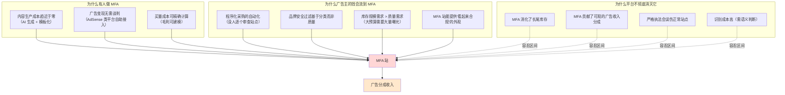
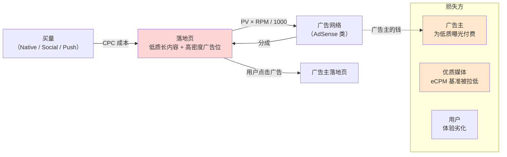

# AdSense 套利与 MFA 站

> **一句话定位**：MFA（Made For AdSense，专为广告分成而建的站）是广告套利里**唯一没有正当性辩护**的形态——
> 本文研究它为什么存在、经济学结构是什么、平台如何识别与处罚、以及对广告主和优质媒体造成的实际伤害。
>
> **核心结论先行**：MFA 的生命周期不由市场竞争决定，而由**单一平台的执法意愿**决定——
> 因为它的供应商、客户、裁判是同一家公司（这与搜索套利同构，见 `搜索套利与域名停放.md`）。
> 更关键的一条：**MFA 的真正受害者不是平台，而是广告主与优质媒体**——
> 它吞噬广告预算、拉低 eCPM 基准、污染品牌安全，而平台在"长尾库存变现收入"与"广告主满意度"之间长期摇摆，
> 这才是 MFA 屡禁不绝的结构性原因。
>
> **⚠️ 本篇红线声明（全目录最严）**
>
> | 本文写什么 | 本文不写什么 |
> |---|---|
> | MFA 的定义、判别标准、形态分类学 | **建站步骤、模板、主题选择、内容生产流程** |
> | 经济学结构与毛利模型的**量级** | 可直接复制的参数配置与投放设置 |
> | 平台如何识别与处罚（防守方视角） | **如何规避识别、如何提高存活率** |
> | 对广告主与优质媒体的伤害量化 | 如何把低质流量伪装成高质 |
> | 行业声誉与长期风险 | 任何具体站点、工具、流量源的推荐 |
>
> **判定标准**：如果一段内容能被 MFA 运营方直接拿去执行，它就不该出现在这里。
> 本篇的写作目的是让**广告主、平台、优质媒体、以及考虑进入这个领域的研究者**理解风险与防御，
> 不是提供操作手册。
>
> **可信度标签**：`[标准]` 官方明文　`[政策]` 平台公开政策（标时点）　`[惯例]` 行业共识　`[推断]` 待验证推导
>
> 最后更新：2026-09-11

---

## 1. 定义与判别标准

### 1.1 术语

**MFA**（Made For AdSense，也有 Made For Advertising 的更宽泛用法）
- 定义：**以降低的内容与体验成本，换取高密度广告展示收入**而建立的网站或页面。
- 通俗解释：这个站存在的理由不是给用户看内容，而是给用户看广告；内容是广告的载体，不是目的。
- 易混提示：MFA ≠ "有广告的内容站"。区别在于**站点的存在目的**与**广告/内容比**，见 §1.2。

**相关但不同的概念**：

| 概念 | English | 与 MFA 的关系 |
|---|---|---|
| 内容农场 | Content Farm | MFA 的常见实现形态之一，但内容农场也可能靠 SEO 自然流量而非买量 |
| 低质站 | Low-quality Site | Google 政策用语，MFA 是其子集 |
| 薄内容 | Thin Content | 描述内容质量，MFA 通常伴随薄内容但不是必要条件 |
| Doorway Page | 门页 | 为特定搜索词做的跳板页，与 MFA 有重叠但目的不同（门页导流，MFA 变现） |
| 站群 | Site Network / PBN | 多站组合运营，MFA 常以站群形态存在 |
| 寄生 SEO | Site Reputation Abuse | **不同**：借用高权重宿主站的排名，MFA 通常是自有低权重站 |

### 1.2 判别标准：五个维度

`[推断]` 结合 Google 政策的公开表述与行业实践，MFA 的判别可以看五个维度。
**注意：这是"识别特征"而非"官方定义清单"**——Google 的政策文本用的是更宽泛的表述（见 §4）。

| 维度 | 内容站的典型表现 | **MFA 的典型表现** | 可观测性 |
|---|---|---|---|
| **① 存在的理由** | 用户会为了内容而来（去掉广告仍有人看） | 去掉广告就没人来；内容是广告位的填充物 | 需人工判断 |
| **② 广告/内容比** | 首屏以内容为主，广告位克制 | **广告位数量与面积显著超过内容**；首屏几乎全是广告 | **可直接测量** |
| **③ 内容原创性** | 有一手信息、独立判断、作者可核查 | 汇编、改写、AI 量产、无附加价值 | 可抽样评估 |
| **④ 流量来源结构** | 自然搜索、直接访问、社媒、邮件为主 | **付费流量占比极高**，且来源集中 | **可直接测量** |
| **⑤ 用户行为特征** | 有浏览深度、有回访、有停留 | **单页跳出率极高、停留极短、几乎无回访** | **可直接测量** |

`[推断]` **维度 ②④⑤ 是平台可以自动化检测的**，这也是 Google 执法的技术基础。
维度 ①③ 需要人工或语义模型判断，是执法的难点，也是 MFA 长期存在的空间。

### 1.3 一个可操作的判别问句

`[推断]` 判断一个站是不是 MFA，最有效的单一问题是：

> **"如果把这个站上所有的广告拿掉，还会有人来吗？"**

- 答案是"会"（内容本身有价值）→ 是内容站，付费获客只是它的增长手段之一；
- 答案是"不会"（内容只是为了承载广告）→ 是 MFA。

这个问句的价值在于它**直接对应了价值创造的判断**：
内容站创造了用户价值，广告是对该价值的变现；
MFA 没有创造用户价值，广告收入来自广告主的错误定价（买了它以为在买优质流量）。

---

## 2. MFA 的经济学根源：为什么它存在

### 2.1 三方视角下的成因



### 2.2 差价从哪来（套用四类框架）

用 `套利模式总览与分类.md` §2 的分类：

| 差价类型 | 在 MFA 场景的具体形态 | 消除速度 |
|---|---|---|
| **③ 流量质量误判**（主要） | 广告主按"网页曝光"付费，无法在 pre-bid 阶段判断这个网页的内容质量；MFA 站提供的是"技术合规但价值为零"的曝光 | **慢**——需要语义级质量评估能力普及 |
| **① 信息差** | 新的买量渠道、新的高 RPM 品类、平台审核的盲区 | 快（3~12 个月） |
| **④ 平台补贴** | 某些广告网络为冲规模而给的宽松审核与高 RPM | **最快且无预警** |
| ② 定价机制差 | 相对次要 | — |

`[推断]` **MFA 主要依赖 ③ 型（质量误判），这是它半衰期比信息差型玩法长、但比机制差型短的原因。**
质量误判的消除需要买方具备"内容级质量评估"能力，而这正在通过第三方验证、
AI 内容分类、以及 MFA 专项检测服务逐步实现——但进度以年计，且永远是猫鼠博弈。

### 2.3 为什么"看起来合规"是关键

`[推断]` MFA 站与赤裸裸的作弊（如 Cookie Stuffing、假量）有一个重要区别：
**它的所有元素单独看都是合规的**——真实的用户、真实的浏览器、真实的页面加载、真实的广告展示、真实的点击。

它违规的地方是**整体的价值主张**：用极低成本的内容换取与优质媒体同等的广告定价。
这就是为什么：
- 传统风控规则（IP、设备、行为频次）**抓不到它**；
- 需要**站点级的质量评估**而不是**事件级的异常检测**；
- Google 的政策表述用的是"站点声誉"、"内容原创性"、"为用户还是为搜索引擎"这类**整体性判断**，
  而不是具体的技术特征。

---

## 3. 形态分类学（认知向）

> 本节只描述形态与识别特征，**不描述如何构建任何一种**。

`[惯例]` 行业中可观察到的 MFA 形态大致五类：

| 形态 | 特征 | 流量来源 | 识别信号 |
|---|---|---|---|
| **① 买量 + 内容型落地页** | 用 Native/Social 买量，落地页是长文（Advertorial 形态），页面布满展示广告 | 付费为主 | 付费流量占比 >80%；单页停留短但页面很长（为了放更多广告位） |
| **② 站群 + SEO** | 大量域名，每个站覆盖一个细分话题，内容为 AI 或改写 | 自然搜索为主 | 域名注册时间集中；内容风格高度同质；站间互相链接 |
| **③ 工具/计算器型** | 提供简单工具（单位换算、贷款计算）作为流量诱饵，工具本身价值极低，主要靠广告 | 自然搜索 + 直接 | 工具页的广告密度极高；用户完成任务后立即离开 |
| **④ 过期域名再利用** | 购买有历史外链与直接流量的过期域名，替换为广告密集内容 | 历史直接流量 + 外链 | **域名内容与历史主题完全不匹配**；外链锚文本与新内容无关 |
| **⑤ 视频/幻灯片型** | 用幻灯片式分页（一个内容拆成 20 页）人为放大 PV | 付费 + 自然 | PV/UV 异常高（>5）；每页内容极少；广告位随分页增加 |

`[推断]` **形态 ⑤（分页放大 PV）最值得单独说明**，因为它的经济学最直白：
广告收入 ≈ PV × RPM / 1000，所以把一个内容拆成 N 页就能把收入乘以 N。
这是**纯粹的机制利用**，不涉及任何内容价值——也因此最容易被平台识别与打击
（PV/UV 比值、每页内容量、翻页行为模式都是强特征）。

### 3.1 与 09 目录的 Advertorial 的边界

`../09_联盟营销Affiliate/落地页与转化漏斗设计.md` §3 讲过 Advertorial（软文型落地页）。
两者形态相似但目的不同，必须区分：

| | **Advertorial（联盟场景）** | **MFA（展示变现场景）** |
|---|---|---|
| 变现出口 | 联盟佣金 / Offer 派款（**转化**） | 广告展示收入（**曝光与点击**） |
| 页面目的 | 把弱意图流量转化为强意图，导向商家 | 让用户尽可能多地浏览页面，产生更多广告曝光 |
| 内容长度 | 中等（够建立需求即可） | **极长**（为了容纳更多广告位与提升停留） |
| 成功指标 | CR、EPC | PV/UV、RPM、Ad Load |
| 是否必然违规 | 不必然——真实测评 + 明确披露是合规的 | **接近必然**——因为其价值主张就是"低成本内容换广告收入" |

`[推断]` **关键判断**：Advertorial 本身是中性的营销形态，合规与否取决于内容真实性与披露；
MFA 则是**以低质换收入的结构**，几乎不存在合规的实现方式。
把两者混为一谈会导致两个错误：要么把正当的内容营销污名化，要么给 MFA 找到辩护理由。

---

## 4. 平台政策：Google 的立场与工具

### 4.1 政策表述的演变

`[政策]`（**时点 2026-09，需以当期官方文档为准**）

Google 对 MFA 的规制散落在几处，且**没有使用 "MFA" 这个词作为政策术语**——
它用的是更宽泛的质量与垃圾内容表述：

| 政策/机制 | 时间 | 针对什么 |
|---|---|---|
| **AdSense 计划政策** | 长期 | 内容政策（原创性、非法内容）、站点行为政策、"鼓励点击"禁止、广告放置规则（不得过度遮挡内容） |
| **搜索垃圾政策（Spam Policies）** | 长期，2024-03 大幅修订 | 规模化内容滥用、站点声誉滥用、过期域名滥用、门页、自动生成的垃圾内容 |
| **Helpful Content 系统** | 2022-08 起，**2024-03 并入核心排名系统** | **站点级**质量分类：内容是否为用户而做 |
| **核心更新（Core Updates）** | 周期性 | 相对排序调整，低质站被降级 |
| **广告侧的 MFA 专项识别** | 近年逐步加强 | 见 §4.3 |

`[政策]` **2024 年 3 月的三条新垃圾政策**与 MFA 直接相关：
1. **规模化内容滥用（Scaled Content Abuse）**——为提高排名而非帮助用户生成大量页面，**不论是否原创、是否 AI 生成**；
2. **站点声誉滥用（Site Reputation Abuse）**——第三方内容借用宿主站排名信号而宿主缺乏监督；
3. **过期域名滥用（Expired Domain Abuse）**——购买过期域名以继承排名信号并发布低质内容。

> 这三条与 `../09_联盟营销Affiliate/Niche站与内容站变现.md` §4.3 是同一批政策，
> 那篇从"内容站受影响"的角度写，本篇从"MFA 被打击"的角度写。**两者应保持一致引用。**

### 4.2 政策的模糊地带（诚实说明）

`[推断]` Google 的政策**没有给出 MFA 的量化定义**——没有说"广告面积超过 X% 即违规"、
"付费流量占比超过 Y% 即违规"。这是刻意的，因为量化标准一旦公开就会被精确规避。

**后果**：
- MFA 运营者可以声称自己"有原创内容"、"用户体验良好"，而判定权完全在平台；
- 正常站点也可能被误伤（尤其小规模、新站、付费获客比例高的站）；
- **申诉成功率与站点规模相关**——大站有客户经理渠道，小站只能走表单。

这也是 §6 里"为什么 MFA 的风险不是概率性的而是二元性的"的原因：
你无法通过"控制在安全线内"来降低风险，因为**安全线不公开且可随时移动**。

### 4.3 平台侧的识别手段（防守方视角）

`[推断]` 综合公开信息与行业观察，平台可用的识别手段分层：

| 层 | 手段 | 能识别什么 | 局限 |
|---|---|---|---|
| **① 站点结构** | 广告位数量/面积/位置、Ad Load、分页深度、首屏广告占比 | 形态 ⑤（分页放大）、极端 Ad Load | 可被调整 |
| **② 内容质量** | 原创性检测（与全网内容比对）、语义质量模型、AI 生成检测、作者可核查性 | 形态 ②（站群）、AI 量产 | 误判风险；对抗性强 |
| **③ 流量结构** | 付费流量占比、来源集中度、Referrer 分布 | 形态 ①（买量型） | 付费获客本身不违规 |
| **④ 用户行为** | 跳出率、停留时间、PV/UV、回访率、滚动深度 | 全体形态 | 可被伪造（但成本高） |
| **⑤ 域名历史** | 注册时间、内容主题与历史的一致性、外链锚文本相关性 | 形态 ④（过期域名） | — |
| **⑥ 站点级关联** | 同一主体/模板/托管/分析账号下的站点聚类 | 形态 ②（站群） | 需要跨站数据 |
| **⑦ 经济信号** | RPM 异常高 + 内容成本异常低的组合 | 全体形态 | 数据在平台内部 |

`[推断]` **最有效的是 ⑥ 站点级关联 + ④ 用户行为的组合**：
单站可以伪装，但站群的模板、托管、分析账号、Adsense 账号关联性很难完全切断；
而用户行为数据是平台独有的、无法被站点运营者伪造的。

---

## 5. 完整链路与资金流



### 5.1 分成链路的量级

`[惯例]`/`[政策]`（**需核当期条款**）展示广告分成平台的抽成结构：

```
广告主支付 $1.00
  → DSP / 中间层抽取（若走程序化）：15%~30%
  → 广告网络（如 AdSense 类）抽取：历史上约 32%（即站长获得约 68%）
     ※ 2023 年前后主要平台调整为按产品分别设定分成，内容类产品的站长分成比例有上调
     ※ 本文不给具体当期数字——分成政策历史上多次调整，请以当期官方条款为准
  → 站长实际获得：$0.40~$0.68（取决于路径长度与分成政策）
```

`[推断]` **这个链路对 MFA 经济学的含义**：
MFA 的毛利空间 = 站长实得 − 买量成本。由于站长实得只有广告主支付的 40%~68%，
**买量成本必须极低才能盈利**——这决定了 MFA 只能用最便宜的流量（低质 Native、Push、Pop），
而这些流量的用户体验又最差，形成恶性循环，也是它容易被识别的原因之一。

---

## 6. 单位经济与毛利模型

### 6.1 公式

```
日毛利 = PV × RPM / 1000 − Clicks_买量 × CPC − 固定成本
       = (UV × PV/UV) × RPM / 1000 − UV × CPC − 固定成本

盈亏平衡（每 UV）：
  PV/UV × RPM / 1000 = CPC
  → 所需 RPM = CPC × 1000 / (PV/UV)
```

`[推断]` **这个公式揭示了 MFA 的两个核心杠杆**：
1. **PV/UV**（每个用户看几页）——通过分页、相关内容、无限滚动放大；
2. **RPM**（每千次页面浏览收入）——通过 Ad Load、广告位位置、流量地区放大。

而这两个杠杆**都以牺牲用户体验为代价**，且都有平台上限。这就是 MFA 的内在矛盾。

### 6.2 算例：为什么这个生意的容错空间极小

`[推断]` 以下参数为**假设值**，用于演示测算方法与量级，不构成收益预测，也不是任何实际玩法的推荐。

```
【场景：买量 + 展示变现】
  买量 CPC                $0.15（低质 Native 流量，T2 地区，量级区间 $0.05~$0.40）
  PV/UV                   3.0（分页与相关内容引导，量级区间 1.5~5.0）
  RPM                     $12.00（T2 混合流量，量级区间 $3~$30）
  AdSense 类分成后实得      68% → 有效 RPM $8.16

【单 UV 经济】
  收入 = 3.0 × $8.16 / 1000 = $0.0245
  成本 = $0.15
  → 单 UV 毛利 = −$0.1255  ❌ 严重亏损

【反推：要盈亏平衡需要什么】
  所需有效 RPM = CPC × 1000 / (PV/UV) = $0.15 × 1000 / 3.0 = $50.00
  所需毛 RPM   = $50 / 0.68 = $73.53
  → 这个 RPM 只在 T1 高价品类（金融、保险、B2B）才可能达到

  或者：所需 PV/UV = CPC × 1000 / 有效RPM = $0.15 × 1000 / $8.16 = 18.4 页/UV
  → 每用户看 18 页，体验上不可行，且必然触发平台识别

【换一组参数（T1 + 高价品类 + 极低 CPC）】
  CPC $0.05、PV/UV 4.0、有效 RPM $20
  收入 = 4.0 × $20 / 1000 = $0.08
  毛利 = $0.08 − $0.05 = $0.03/UV → 毛利率 37.5%

【敏感性（g = 37.5%）】
  套用 09 已确立的通式：成本侧 |ΔM/M| = 0.2(1−g)/g，收入侧 |ΔM/M| = 0.2/g
  CPC ±20%      → 毛利 ∓33.3%      （= 0.2 × 0.625 / 0.375）
  RPM ±20%      → 毛利 ±53.3%      （= 0.2 / 0.375）
  PV/UV ±20%    → 毛利 ±53.3%      （PV/UV 与 RPM 同为收入侧乘数，弹性相同）
```

`[推断]` **三个结论**：

1. **绝大多数参数组合下 MFA 是亏损的**。只有"CPC 极低 + T1 高价品类 + 高 PV/UV"三者同时满足才有正毛利，
   而这个组合的容量很小（高价品类的便宜流量是稀缺资源）。
2. **毛利率即使为正也只有 20%~40%**，套用敏感性通式后，任何变量 ±20% 都会造成毛利 ±43%~53% 的波动。
   这是**极高敏感度、极低容错**的结构（对比 09 联盟买量的 g=88.5%，CPC ±20% 只影响 −3%）。
3. **风险是二元的不是概率的**（§4.2）：账号被封时损失的不是"这一单的毛利"，
   而是**全部未结余额 + 全部站点资产 + 已投入的买量成本**。用期望值算：

```
假设：月毛利 $10,000，封号概率 20%/月，封号时损失未结余额约 1.5 个月毛利
  期望月收益 = $10,000 × 0.8 − $15,000 × 0.2 = $8,000 − $3,000 = $5,000
  但方差极大，且封号概率会随规模上升（§7）

对比：月毛利 $5,000 但封号概率 2%/月的合规玩法
  期望月收益 = $5,000 × 0.98 − $7,500 × 0.02 = $4,900 − $150 = $4,750
```

`[推断]` **期望值接近（$5,000 vs $4,750），但风险特征完全不同**：
前者有 20% 概率单月归零并损失存量，后者几乎稳定。
这就是 `套利风险-平台封禁与合规.md` 要展开的"**规避封禁在数学上自败**"论点的具体算例——
你为规避而付出的成本（多账户、代理、伪装）本身就侵蚀毛利，而封号概率并不会因此降到零。

---

## 7. 规模化的内在矛盾

`[推断]` MFA 无法规模化，原因是三重反向作用：

| 矛盾 | 机制 |
|---|---|
| **① 规模 → 显眼 → 执法风险** | 小站不在监测视野内；规模一大就进入平台的重点审查名单。封号概率**随规模上升**，与正常生意相反 |
| **② 规模 → 买量成本上升** | 低价流量容量有限，放量必然抬高 CPC（与所有买方套利共通，见 `套利模式总览与分类.md` §6.3） |
| **③ 规模 → 内容质量下降** | 内容成本是主要可控成本，规模化必然靠 AI 量产或改写，而这正是 Scaled Content Abuse 政策的打击对象 |

**结论**：MFA 的"最优规模"不是由经济效率决定，而是由**执法概率曲线**决定——
在"规模收益递增"与"封号概率递增"的交点处停止。这个交点通常远低于正常生意的规模经济拐点，
所以 MFA 永远是**小作坊式**的，无法成长为公司级业务。

`[推断]` **这也解释了行业观察到的现象**：MFA 领域没有知名品牌公司，
只有大量匿名运营者与短生命周期站点。**因为任何试图建立品牌的努力都会增加曝光度从而提高执法风险**——
这是一个反向选择机制。

---

## 8. 套利与 MFA 的边界在哪（本篇核心思辨）

### 8.1 为什么这个问题重要

`[推断]` 这不是学术问题。实践中大量站点处于灰色地带：
- 一个用付费流量获客的测评站，是内容站还是 MFA？
- 一个提供贷款计算器 + 深度文章 + 高密度广告的站呢？
- 一个 AI 辅助写作但有编辑审核与一手数据的站呢？

**边界的判断直接决定了：这个资产能不能长期持有、能不能出售、会不会某天归零。**

### 8.2 边界的三个判据

`[推断]` 我提出三个判据，按重要性排序：

**判据一：去掉广告后是否仍有用户价值？（§1.3 的问句）**
- 有 → 广告是对价值的变现 → 内容站
- 无 → 广告是站点存在的唯一理由 → MFA
- **这是最本质的判据**，因为它直接对应"是否创造价值"

**判据二：收入是否依赖"平台无法验证的质量假设"？**
- 内容站的收入依赖**用户主动选择来看**（可验证：回访率、直接流量、品牌搜索量）
- MFA 的收入依赖**平台没有识别出它是低质的**（不可验证，且随时可能失效）
- **这个判据的实操价值**：如果你的商业模式成立的前提是"平台还没发现"，那它就是 MFA，
  不管内容做得多好看。

**判据三：能否通过一次严格的人工审核？**
- 想象一个懂行的审核员逐页检查你的站：内容是否有一手信息？广告是否过度？
  用户是否会满意？作者是否真实可查？
- 能通过 → 内容站；需要"审核员看不出来"才能通过 → MFA

### 8.3 一个反直觉的推论

`[推断]` **有些"看起来像 MFA"的站其实是合规的，有些"看起来像内容站"的其实是 MFA。**

| 表面特征 | 实际判断 |
|---|---|
| 广告很多 + 内容很长 | 如果内容是真实一手测评、有作者、有回访用户 → **合规**（Ad Load 高只是体验问题，不是违规） |
| 内容精致 + 广告克制 | 如果内容是 AI 量产、无一手信息、流量全靠买量、无回访 → **仍是 MFA** |
| 用 SEO 获客 | 不改变判断——MFA 也可以靠 SEO（形态 ②） |
| 用付费流量获客 | 不改变判断——正当的内容站也可以付费获客 |

**所以判据不是任何单一的表面指标，而是 §8.2 的三个本质问题。**
这也解释了为什么平台的政策表述是整体性的（"为用户还是为搜索引擎"）而不是量化阈值——
因为量化阈值一定会被精确规避，而整体判断难以规避。

### 8.4 对研究者的建议

`[推断]` 如果你在做的是"用付费流量推广一个真实有价值的内容站"，
那么你应该关心的是 §8.2 判据二的反面：**建立可验证的质量信号**——
真实作者、一手数据、用户回访、品牌搜索量、外部引用。
这些信号既是 SEO 的 E-E-A-T 要求，也是抵御误判的护城河。
见 `../09_联盟营销Affiliate/Niche站与内容站变现.md` §3.2。

如果你在做的事情无法建立这些信号，那它的商业模式本质上依赖"平台没发现"，
应该按 §6.2 的二元风险来定价，而不是按毛利率来定价。

---

## 9. 对广告主与优质媒体的伤害（量化视角）

### 9.1 MFA 在程序化供给中的占比

`[惯例]`（**二手引用，需核原始报告**）
近年有第三方研究机构对程序化网页供给做抽样分析，报告 MFA 站点占程序化网页曝光的
**约 15%~21% 量级**（2023 年前后的研究）。这个数字被行业广泛引用，
但不同研究的口径差异大（如何定义 MFA、抽样框是什么、是否含 App 库存），
**应视为量级参考而非统计事实**。

`[推断]` 即使按保守的 10% 计算，其含义也是重大的：
广告主每花 $10，约有 $1 买到了"技术合规但价值为零"的曝光。
在一个年规模数千亿美元的市场里，这是数百亿美元量级的价值转移。

### 9.2 三层伤害

| 层 | 伤害 | 可量化性 | 可追回性 |
|---|---|---|---|
| **① 直接损失** | 为无效曝光付费 | 可量化（MFA 占比 × 支出） | 部分（post-bid 拒付，但会引发结算纠纷） |
| **② 基准污染** | MFA 的低质库存拉低整体 eCPM 基准，同时其高 Ad Load 抬高了"正常"的广告密度预期 | 难量化 | 否 |
| **③ 预算错配** | 报表显示程序化渠道 ROI 尚可（因为 MFA 的曝光被计入了），于是继续加码；同时优质媒体的预算被挤压 | **最难量化，伤害最大** | 否 |

`[推断]` **第 ③ 层是最危险的**，机制与 `../09_联盟营销Affiliate/联盟反作弊与扣量.md` §6.1 讲的
"决策成本"完全同构：**当报表被污染时，营销资源配置会系统性劣化，而且你不知道自己错了。**
几年后表现为"品牌搜索量下降、新客获取成本上升、优质媒体合作减少"，
却很难追溯到"当年程序化渠道里有 20% 是 MFA"这个原因。

### 9.3 优质媒体为什么是净损失方

`[推断]` 三条机制：
1. **预算分流**：广告主的总预算有限，流向 MFA 的部分就是从优质媒体扣走的；
2. **基准拉低**：MFA 以极低成本提供大量曝光，拉低了"每千次曝光"的市场心理价位；
3. **品牌安全连带**：广告主因为担心品牌安全而整体收紧程序化预算，优质媒体被连带伤害。

这也是为什么**优质媒体有强烈动机推动 MFA 治理**，且愿意付费购买第三方验证服务——
它们与广告主的利益在这一点上是一致的，与平台的利益则存在张力（平台从 MFA 获得分成收入）。

---

## 10. 防守方章节：怎么防

### 10.1 如果你是广告主 / 买方

| # | 手段 | 机制 | 有效性 | 成本 |
|---|---|---|---|---|
| 1 | **MFA 专项排除列表** | 使用第三方维护的 MFA 域名列表做 pre-bid 排除 | **高** | 中（第三方服务费） |
| 2 | **白名单采购（Inclusion List）** | 只买审核过的站点清单 | **最高** | 高（牺牲规模与自动化） |
| 3 | **站点级质量指标过滤** | 用跳出率、停留时间、PV/UV、内容量等做 pre-bid 过滤 | 中~高 | 中 |
| 4 | **付费流量占比检测** | 识别"流量主要来自其他广告"的站点（套利的套娃） | 中 | 中 |
| 5 | **广告密度检测** | 通过 creative 渲染后的页面分析广告占比 | 中 | 中 |
| 6 | **供应链透明度** | ads.txt / sellers.json / schain 交叉验证（见 `Prebid与HeaderBidding套利.md` §9） | 中 | 低 |
| 7 | **增量实验** | 用 Geo Holdout 测程序化渠道的真实贡献 | **最高（唯一因果口径）** | 高（周期长） |
| 8 | **合约条款** | 要求 DSP/代理承诺 MFA 占比上限并允许审计与拒付 | 中 | 低 |

`[推断]` **性价比排序**：1 → 3 → 6 → 2 → 7。
先用第三方 MFA 列表做 pre-bid 排除（成本低、见效快），再加行为指标过滤，
再用供应链验证补漏；白名单与增量实验是"重武器"，适合预算规模大且已被伤害过的广告主。

### 10.2 如果你是平台

| 手段 | 机制 | 难点 |
|---|---|---|
| 站点级质量分类器 | 语义模型 + 行为数据 + 结构特征综合评分 | 误伤正常站点；对抗性规避 |
| 站点关联聚类 | 识别同一主体运营的站群 | 需要跨站数据；隐私边界 |
| 经济信号交叉 | RPM 异常高 + 内容成本异常低 | 数据在内部，但需要建模 |
| 分成政策的差异化 | 对质量分层给不同分成比例 | 会与"鼓励优质内容"的目标冲突吗？实际上正好一致 |
| **广告主侧的反馈闭环** | 把广告主的投诉与拒付数据回流到站点评分 | 目前普遍不足 |

`[推断]` **平台的根本困境**：它的收入同时来自广告主与站长，
打击 MFA 会减少分成收入但提升广告主满意度。短期财务与长期生态的权衡，
决定了执法力度会**周期性摆动**——广告主流失严重时收紧，收入压力大时放松。
**这就是 MFA"屡禁不绝"的结构性原因，不是技术能力问题。**

### 10.3 如果你是优质媒体

见 `Prebid与HeaderBidding套利.md` §10.3——核心是建立"干净供应链"的声誉资产、
申请 PMP 把优质库存与开放市场区隔、主动披露质量数据。

---

## 11. 为什么会被消灭（5 问第 ⑤ 问）

| 消灭力量 | 手段 | 速度 | 当前状态 |
|---|---|---|---|
| **Google 政策执法** | 垃圾内容政策、Helpful Content 系统、核心更新、AdSense 账号停用 | **不定期、离散** | 持续中，2024-03 有显著加强 |
| **AI 内容检测能力** | 语义模型识别量产内容 | 中 | 军备竞赛，检测方与生成方同步进化 |
| **买方 MFA 排除** | 第三方 MFA 列表与质量过滤 | **快** | 大型 DSP 与广告主已普遍采用 `[惯例]` |
| **买量成本上涨** | 低价流量容量耗尽 | 中 | 持续中 |
| **广告主增量意识** | 用实验而非报表评估渠道 | 慢 | 仍在早期 |

`[推断]` **但 MFA 不会被完全消灭**，三个原因：
1. **它依赖 ③ 型差价（质量误判）**，而质量评估永远是猫鼠博弈，检测方滞后于造假方；
2. **平台的执法意愿会周期性摆动**（§10.2 的根本困境）；
3. **AI 让内容生产成本进一步趋近于零**，降低了进入门槛，抵消了部分执法效果。

**所以 MFA 的长期状态是"低比例持续存在"**——不会归零，也不会成为主流。
它会在平台收紧时收缩、放松时反弹，形成一个长期震荡。

---

## 12. 行业声誉与长期风险

`[推断]` 这一节写给"正在考虑进入这个领域的人"，是最实际的劝退理由：

| 风险 | 说明 |
|---|---|
| **资产无法沉淀** | 站点随时可能被停用，域名权重、内容库、流量关系全部归零。**与内容站的根本区别：内容站的资产可以出售，MFA 的资产不能在阳光下出售** |
| **无法建立声誉** | 行业圈子小，MFA 运营者的身份一旦关联，会影响其做正当业务的能力 |
| **技能不可迁移** | MFA 积累的能力（规避识别、批量建站）在正当业务中几乎无用，甚至是负资产 |
| **法律与合规风险** | 若涉及误导性内容、虚假宣称、健康/金融品类的无依据宣称，可能触及消费者保护法（见 `../09_联盟营销Affiliate/落地页与转化漏斗设计.md` §8） |
| **税务与主体风险** | 大规模站群运营涉及多主体、多账户、跨境资金，合规成本高 |
| **心理压力** | 收入建立在"平台没发现"的基础上，是一种持续的、不可对冲的存在性风险 |

**结论** `[推断]`：**MFA 的期望收益可能为正，但它的风险结构是"长期积累为零 + 尾部一次性归零"。**
即使纯从投资角度看，这也是一个劣质资产：无法沉淀、无法出售、无法传承、无法抵押。
相比之下，同样的时间与资金投入内容站（`../09_联盟营销Affiliate/Niche站与内容站变现.md`）
或邮件列表（`../09_联盟营销Affiliate/邮件营销与私域List.md`），虽然短期收益更低，
但形成的是**可估值、可出售、可积累的资产**。

---

## 13. 国内 vs 海外

| 维度 | 海外 | 国内 |
|---|---|---|
| **MFA 的存在形态** | 独立站 + AdSense 类展示变现，是明确的政策打击对象 | 形态不同：更多是**平台内容生态内的低质内容农场**（搬运、洗稿、AI 量产），变现靠平台流量分成而非第三方广告网络 |
| 变现出口 | AdSense / 程序化展示广告 | 平台创作分成、平台广告分成计划 |
| 识别与处罚主体 | Google（单一平台主导）+ 买方排除 | 各内容平台自行治理 |
| 政策工具 | 垃圾内容政策、Helpful Content 系统、账号停用 | 平台内容规范、限流、封号、取消分成资格 |
| 买量型 MFA | 存在（Native 买量 → 广告变现） | **较少**——因为缺乏开放的第三方展示变现出口，且平台内买量与变现是同一主体 |
| 站群形态 | 常见（多域名 + SEO） | 常见但形态不同（多账号 + 平台内分发） |
| 结构性原因 | **开放互联网 + 第三方广告网络自助接入** → 低门槛 | **平台闭环** → 变现必须通过平台，平台有直接的治理手段 |

`[推断]` **国内 MFA 空间更小的根本原因与 §9（Prebid 篇）一致**：
缺乏开放的第三方展示变现出口。海外的 MFA 之所以可能，是因为**任何人都能自助接入 AdSense 类平台**，
不需要任何审核关系；国内的变现必须通过平台，平台对内容有直接的审核与限流手段，
所以"低质内容换广告收入"的路径被平台内治理直接切断。

**但国内有对应的形态**：平台内容生态里的低质内容农场（搬运、洗稿、AI 量产），
靠平台的创作分成计划变现。治理逻辑相同（平台的质量分类器 + 人工审核），
但因为平台既是内容分发方又是变现方，治理效率理论上更高。

---

## 14. 常见误解

**❌ 误解 1：MFA 就是"广告很多的网站"。**
✅ 正确：判据不是广告数量，而是**去掉广告后是否仍有用户价值**（§1.3、§8.2）。
一个广告密集但内容真实一手、有回访用户的站是合规的；一个内容精致但全靠买量、无回访、AI 量产的站仍是 MFA。

**❌ 误解 2：MFA 是技术活，做得精细就不会被封。**
✅ 正确：风险是**二元的不是概率的**（§4.2）——安全线不公开且可随时移动，
且封号损失的是全部未结余额与站点资产，不是"这一单的毛利"。精细化能提高存活时间，但不能改变风险结构。

**❌ 误解 3：MFA 利润率高，是个好生意。**
✅ 正确：§6.2 的算例显示**绝大多数参数组合下是亏损的**；
即使为正，毛利率也只有 20%~40%，套用敏感性通式后任何变量 ±20% 会造成毛利 ±43%~53% 的波动。
且期望收益要扣除封号损失，与合规玩法的差距远小于表面。

**❌ 误解 4：MFA 伤害的是平台，所以平台会拼命打击。**
✅ 正确：**主要受害者是广告主与优质媒体**。平台的立场是矛盾的——
它从 MFA 获得分成收入，但又因此失去广告主信任。这个矛盾决定了执法力度会**周期性摆动**，
是 MFA 屡禁不绝的结构性原因（§10.2）。

**❌ 误解 5：Advertorial 就是 MFA。**
✅ 正确：Advertorial 是中性的营销形态（把弱意图流量转化为强意图），合规与否取决于内容真实性与披露；
MFA 是以低质换收入的**结构**，几乎不存在合规实现方式。两者的变现出口也不同（转化 vs 曝光），见 §3.1。

**❌ 误解 6：用 AI 写内容就是 MFA。**
✅ 正确：Google 的 Scaled Content Abuse 政策明确说**不论是否原创、是否 AI 生成**，
判定标准是"为提高排名而非帮助用户生成大量页面"。
AI 辅助 + 人工审核 + 一手数据 + 真实作者是可以合规的；AI 量产 + 无附加价值 + 为排名而生才是违规。

**❌ 误解 7：买量做内容站和 MFA 是一回事。**
✅ 正确：付费获客本身完全正当。区别在 §8.2 判据二：**你的收入是否依赖"平台无法验证的质量假设"**。
能建立可验证质量信号（真实作者、一手数据、回访、品牌搜索）的付费获客站是内容站。

**❌ 误解 8：买第三方 MFA 排除列表就够了。**
✅ 正确：列表是性价比最高的第一道防线，但它**滞后**（新站不在列表里）且**不完整**。
需要叠加行为指标过滤、供应链验证，最终靠增量实验验证真实影响（§10.1）。

**❌ 误解 9：MFA 占程序化供给的比例有准确数字。**
✅ 正确：行业广泛引用的 15%~21% 来自少数第三方研究的抽样，**口径差异大、无统一标准**，
应视为量级参考。本文标为 `[惯例]` 并明确注明是二手引用（§9.1）。

**❌ 误解 10：MFA 会被彻底消灭。**
✅ 正确：它依赖 ③ 型差价（质量误判），而质量评估永远是猫鼠博弈；
加上平台执法意愿的周期性摆动与 AI 降低内容成本，**长期状态是"低比例持续存在、震荡而非消亡"**（§11）。

---

## 15. 延伸追问

1. **广告主怎么用增量实验测出程序化渠道里有多少预算被 MFA 吞噬？**
   → `../07_追踪Cookie与归因/增量实验与因果归因.md`（待建）；本篇 §10.1 手段 7
2. **Google 的站点级质量分类器具体怎么工作？误伤率有多高？**
   → 属平台内部机制，公开信息有限。可观察的代理指标见 §4.3；`../09_联盟营销Affiliate/Niche站与内容站变现.md` §4.1 从受影响方视角写了 HCU 的机制
3. **MFA 与 IVT（无效流量）的关系是什么？MFA 流量算不算无效？**
   → `../13_反作弊与流量质量/无效流量IVT-GIVT-SIVT.md`（待建）。**这是个有争议的问题**：MFA 的曝光是"真实用户看到真实广告"，不符合 IVT 的技术定义，但对广告主无价值——现有标准体系在这个场景下有缺口
4. **买方为什么普遍不做白名单采购（最有效的手段）？**
   → 因为牺牲规模与自动化，与大预算的投放需求冲突。§10.1 的成本列已标注
5. **如果 MFA 的期望收益为正，为什么理性的从业者不该做？**
   → §12 的资产属性分析：无法沉淀、无法出售、无法迁移技能，是劣质资产

---

## 16. 相关文档

### 本目录
- 四类差价框架与生命周期模型 → [`套利模式总览与分类.md`](./套利模式总览与分类.md)
- 通用毛利公式与风险调整回报 → [`套利单位经济与毛利模型.md`](./套利单位经济与毛利模型.md)
- 信息流套利（MFA 的主要流量来源）→ [`信息流套利-Taboola-Outbrain.md`](./信息流套利-Taboola-Outbrain.md)
- 搜索套利（同样面对"供应商=客户=裁判"的结构）→ [`搜索套利与域名停放.md`](./搜索套利与域名停放.md)
- 供应链透明度与买方防御 → [`Prebid与HeaderBidding套利.md`](./Prebid与HeaderBidding套利.md) §9、§10
- 封禁逻辑与合规风险 → [`套利风险-平台封禁与合规.md`](./套利风险-平台封禁与合规.md)

### 跨目录
- Advertorial 的合规边界 → [`../09_联盟营销Affiliate/落地页与转化漏斗设计.md`](../09_联盟营销Affiliate/落地页与转化漏斗设计.md) §3、§8
- Scaled Content Abuse 与 HCU（同一批政策）→ [`../09_联盟营销Affiliate/Niche站与内容站变现.md`](../09_联盟营销Affiliate/Niche站与内容站变现.md) §4
- 报表污染导致的预算错配（同构论证）→ [`../09_联盟营销Affiliate/联盟反作弊与扣量.md`](../09_联盟营销Affiliate/联盟反作弊与扣量.md) §6.1
- 可积累资产 vs 折旧资产 → [`../09_联盟营销Affiliate/邮件营销与私域List.md`](../09_联盟营销Affiliate/邮件营销与私域List.md) §9
- 广告欺诈全景与分类 → [`../13_反作弊与流量质量/广告欺诈全景与分类.md`](../13_反作弊与流量质量/)
- 无效流量标准（MFA 是否算 IVT 的争议）→ [`../13_反作弊与流量质量/无效流量IVT-GIVT-SIVT.md`](../13_反作弊与流量质量/)
- 品牌安全与可见性 → [`../13_反作弊与流量质量/品牌安全与广告可见性.md`](../13_反作弊与流量质量/)
- 增量实验方法 → [`../07_追踪Cookie与归因/增量实验与因果归因.md`](../07_追踪Cookie与归因/)
- 展示广告变现机制 → [`../12_流量变现与商业化/eCPM优化方法论.md`](../12_流量变现与商业化/)
- 广告负载与用户体验平衡 → [`../12_流量变现与商业化/广告负载与用户体验平衡.md`](../12_流量变现与商业化/)
- 国内平台内容治理 → [`../14_国内市场与生态/国内联盟与变现生态.md`](../14_国内市场与生态/)

---

> **玩法状态**：**持续被打击期，长期震荡而非消亡**（判断时点：2026-09）
> 依据：① Google 2024-03 的三条垃圾内容政策显著加强了对规模化内容与过期域名滥用的执法；
> ② 大型 DSP 与广告主已普遍采用 MFA 排除列表，买方侧防御在快速成熟；
> ③ 但它依赖 ③ 型差价（质量误判）且平台执法意愿存在结构性摆动（§10.2），
> AI 又进一步降低了内容生产成本，因此**不会归零，会长期以低比例存在并周期性反弹**。
> 需列入 `../00_研究方法与协作规范/研究进度看板.md` §六 失效复核清单，建议每季度复核平台政策动向。
>
> **政策时点声明**：本文涉及的 Google 政策（AdSense 计划政策、搜索垃圾政策、Helpful Content 系统
> 2022-08 起并于 **2024-03 并入核心排名系统**、2024-03 的三条新垃圾政策）、
> AdSense 类产品的分成比例（历史上站长约得 68%，2023 年前后调整为按产品分别设定）、
> 以及 MFA 占程序化供给的比例（第三方研究约 15%~21%，**二手引用需核原始报告**），
> 均为 **2026-09** 时点认知。
> **本文刻意不给出任何当期的具体分成比例、不给出政策条款编号、不给出 MFA 占比的精确值**——
> 分成政策历史上多次调整，MFA 占比的各研究口径差异极大。
> 所有毛利测算参数均为**假设值**，标注 `[推断]`，用于演示方法论与量级，
> **不构成收益预测，也不构成对任何实际操作的建议**。
> 最后复核：2026-09-11
