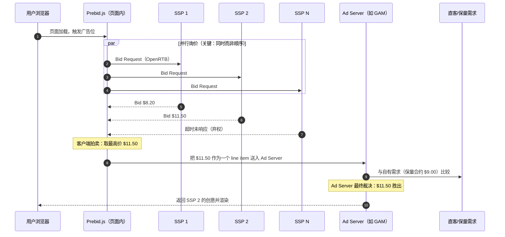
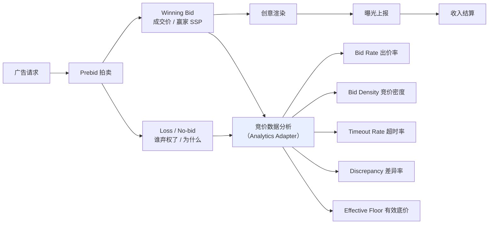
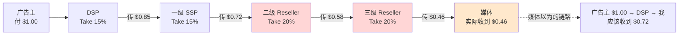
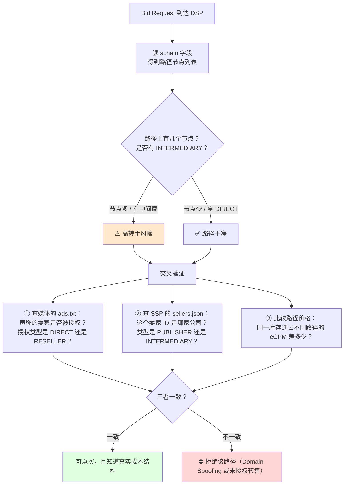

# Prebid 与 Header Bidding 套利

> **一句话定位**：本文讲**卖方侧套利**——媒体如何通过引入多 SSP 实时竞价把同一个广告位卖出更高价格，
> 以及这条正当的 Yield 优化路径上衍生出的灰色形态（转售加价、Bid Caching、供应链不透明）。
>
> **核心结论先行**：卖方套利是六大流派里**唯一半衰期以年计**的形态，因为它依赖的是定价机制差（②型），
> 而机制变更需要平台推动 + 行业采纳，速度以年计。
> 更关键的一条：**多 SSP 竞价本身不是套利，是媒体经营的正常组成部分**——
> 真正的套利发生在"信息不对称被利用"的地方：媒体不知道自己的 Take Rate 被吃了多少，
> 买方不知道自己的钱经过了几手。所以本篇的主线是**透明度**，不是技巧。
>
> **📌 技术债声明**：本篇**自包含** Header Bidding 与拍卖机制的必要原理（§2、§3），
> 因为它依赖的 `../03_业务逻辑与商业模式/拍卖机制与竞价理论.md`、
> `../05_技术架构与系统实现/OpenRTB协议详解.md`、
> `../12_流量变现与商业化/HeaderBidding与Prebid.js.md` 三篇**目前都尚未创建**。
> 待 `12` 目录建篇后需做一次**去重**：本篇 §2~§3 应压缩为摘要 + 链接，把完整原理迁到 `12`。
> 该技术债已登记在 `../00_研究方法与协作规范/研究进度看板.md` §六。
>
> **⚠️ 立场声明**：灰色形态（Bid Caching、Reselling）只讲**机制、经济学、可检测特征与防御设计**，
> 不讲如何配置、不推荐任何工具或中间商。
>
> **可信度标签**：`[标准]` 官方明文　`[政策]` 平台公开政策（标时点）　`[惯例]` 行业共识　`[推断]` 待验证推导
>
> 最后更新：2026-09-11

---

## 1. 本篇在套利谱系中的位置

`套利模式总览与分类.md` §3 区分了三种套利，本篇讲的是**卖方套利（Sell-side / Yield Arbitrage）**：

| | 买方套利 | **卖方套利（本篇）** | 联盟套利 |
|---|---|---|---|
| 谁在做 | Media Buyer | **媒体 / Publisher / SSP 中间商** | Affiliate |
| 我拥有什么 | 买量能力 | **流量库存** | 买量能力 + 漏斗 |
| 买什么 | 流量 | **不买流量**（只投入技术与商务） | 流量 |
| 差价来源 | 买量成本 < 变现收入 | **多 SSP 竞价 > 单一 Waterfall**；或转手加价 | 买量成本 < 佣金 |
| 半衰期 | 6~24 个月 | **3~8 年** | 12~36 个月 |
| 规模上限 | 中 | **高（自有流量规模决定）** | 中 |

`[推断]` **一个必须先说清的定性判断**：

多 SSP 竞价提升 eCPM **不是套利，是媒体经营的正常组成部分**——就像零售商比较多个供应商的报价一样正当。
本篇之所以放在套利目录，是因为**同一条技术路径上衍生出了真正灰色的形态**：
利用信息不对称在供应链中转手加价、用 Bid Caching 虚增竞价表现、用不透明的 Reseller 隐藏真实卖家。
所以本文的结构是：**先讲正当的 Yield 优化（§2~§6），再讲灰色的供应链套利（§7~§9），最后讲防御（§10）。**

---

## 2. 自包含背景：从 Waterfall 到 Header Bidding

### 2.1 Waterfall（瀑布流）的机制与根本缺陷

**瀑布流**（Waterfall / Mediation Waterfall）：媒体把多个广告网络按**历史平均 eCPM 从高到低排序**，
广告请求依次询问每个网络"你要不要这个曝光"，第一个说"要"的成交。

```
广告请求
  ↓
① 问网络 A（历史 eCPM $12）→ 不要 → 继续
② 问网络 B（历史 eCPM $8） → 不要 → 继续
③ 问网络 C（历史 eCPM $5） → 要！以 $5 成交
  ↓
结果：这次曝光卖了 $5
```

**四个根本缺陷** `[标准]`/`[惯例]`：

| # | 缺陷 | 机制 | 后果 |
|---|---|---|---|
| 1 | **价格发现是过时的** | 排序依据是**历史平均** eCPM，不是这次曝光的真实价值 | 高价值曝光被低价卖掉，低价值曝光被高价网络拒掉后无竞争 |
| 2 | **没有实时竞争** | 网络之间不知道彼此的存在，是顺序询问而非同时竞价 | 无法形成真实市场价格 |
| 3 | **顺序敏感且不透明** | 排在前面的网络有优先权，但媒体很难验证排序是否最优 | 网络有动机虚报历史 eCPM 以争取靠前位置 |
| 4 | **串行调用带来时延** | 每次拒绝都要等一个往返 | 页面加载变慢，用户体验与 SEO 受损 |

`[推断]` **缺陷 1 是最本质的**：广告曝光的价值是**高度异质**的
（同一个广告位，对不同用户、不同时段、不同广告主的价值可能差 10 倍以上），
用历史平均值排序等于**用均值定价一个方差极大的资产**。这是 Waterfall 必然低效的数学根源。

### 2.2 Header Bidding 的原理

**头部竞价**（Header Bidding，HB）：在页面的 `<head>` 里运行一段 JavaScript，
**在调用广告服务器（Ad Server）之前，先让多个需求方同时竞价**，然后把最高价与 Ad Server 的自有需求一起比较。



**为什么 HB 能提升收益** `[标准]`/`[推断]`：

| 机制 | 说明 |
|---|---|
| **实时价格发现** | 每个 SSP 针对**这一次曝光**出价，而不是报历史均值 |
| **并行竞争** | N 个 SSP 同时竞价，形成真实的拍卖；竞争者越多，成交价越接近真实价值 |
| **与直客同台竞争** | 程序化需求与保量合约在 Ad Server 里同场比较，避免"保量占用了本可高价卖出的曝光" |
| **消除顺序偏见** | 不再依赖历史排序，网络无法靠虚报均值获取优先权 |

`[惯例]` **收益提升的量级**：行业普遍报告 HB 相比 Waterfall 能带来 **20%~40%** 的收益提升，
早期（2015~2017）部分媒体报告更高。**但这个数字必须谨慎引用**：
① 提升幅度与媒体的流量规模、地区、广告位类型强相关（大媒体提升小，因为它们的 Waterfall 已经优化得较好）；
② 早期数据来自 HB 供应商的营销材料，有系统性偏差；
③ 随着 HB 成为标配，"提升"已经变成"不做就损失"，基准线变了。
> 数据时点：2026-09。该区间为行业共识量级，无权威一手统计。

### 2.3 客户端 HB vs 服务端 HB（s2s）

| | **客户端 HB**（Client-side，Prebid.js） | **服务端 HB**（Server-side，Prebid Server / Google EBDA 类） |
|---|---|---|
| 拍卖在哪跑 | 用户浏览器里 | 媒体的服务器或第三方服务器 |
| Cookie 匹配 | **直接**——SSP 能在用户浏览器里读自己的 Cookie，匹配率高 | **间接**——需要通过 Cookie Sync 或 UID 传递，匹配率低 |
| 出价率（Bid Rate） | **高** | 低（因为匹配不上就不出价） |
| 页面时延 | **高**（多个 bidder 的 JS 都要加载与执行） | 低（只有一次服务端调用） |
| 页面性能与 SEO | 受损 | 好 |
| 隐私合规 | 复杂（多方在浏览器里读写 Cookie，需 CMP/TCF 管理） | 相对简单 |
| 可接入的 bidder 数 | 受限（每加一个都增加时延，通常 10~20 个上限） | 可以很多（服务端并发，通常 20~50+） |
| 主流选择 `[惯例]` | 桌面端为主 | 移动端与大型媒体为主，且**趋势是混合部署** |

`[推断]` **这个权衡的本质**：客户端 HB 用**页面性能**换**出价率**，服务端 HB 用**出价率**换**页面性能**。
没有绝对优劣，取决于媒体的流量结构（移动占比）、广告位数量、以及对 Core Web Vitals 的敏感度。
实践中成熟媒体常用**混合部署**：头部广告位用客户端（保收益），长尾与移动端用服务端（保性能）。

### 2.4 拍卖机制的变迁：二价 → 一价 → Bid Shading

这是理解现代 HB 经济学的关键背景 `[标准]`/`[惯例]`：

```
早期（~2017 前）
  ADX 内部：二价拍卖（Second Price，赢家付第二高价 + $0.01）
  Header Bidding：一价拍卖（First Price，赢家付自己的出价）
  → 问题：同一需求方通过 HB 和 ADX 两条路出价，会自己和自己竞争（Bid Duplication）

转折（2018~2019）
  主要 ADX 陆续从二价转向一价
  → 买方失去"说真话"的激励（二价拍卖下说真话是最优策略，一价下不是）
  → 出现 Bid Shading：买方算法把出价压到"预估的最低成交价"

现在
  全行业基本一价 + Bid Shading
  → 卖方的对策：动态底价（Dynamic Floor Price）、软底价、Bid Landscape 数据
```

**为什么这对套利分析重要** `[推断]`：
- **一价拍卖下，底价（Floor Price）成为卖方的主要定价工具**。因为买方会 shading，卖方必须靠底价把价格顶上去。
- **底价优化本身就是一个套利空间**：设置过低 → 留下买方剩余；设置过高 → 流拍（无人出价）收益归零。
  这个最优点的寻找，是卖方 Yield 优化的核心技术活。
- **Bid Shading 是买方侧的"套利"**：它利用的是"卖方不知道我的真实估值"这一信息不对称。
  所以这是一场**双向的信息战**，不是单向的。

---

## 3. Prebid 架构（自包含）

### 3.1 Prebid 是什么

**Prebid** 是一套开源的 Header Bidding 实现，由 Prebid.org（原 AppNexus 主导，现为独立开源组织）维护。
它是行业事实标准 `[惯例]`。包含三个主要部分：

| 组件 | 作用 | 部署位置 |
|---|---|---|
| **Prebid.js** | 客户端 HB 库：加载 bidder adapter、执行拍卖、与 Ad Server 通信 | 媒体页面的 `<head>` |
| **Prebid Server** | 服务端 HB：接收一次请求，并发向多个 bidder 询价 | 媒体自建或托管（多家 SSP 提供托管服务） |
| **Prebid Mobile** | App 内的 HB SDK | App 内 |

### 3.2 Prebid.js 的模块结构

```
Prebid.js
├── Core（拍卖引擎、时序控制、事件总线）
├── Bidder Adapters（每个 SSP 一个 adapter，200+ 个）
├── Ad Server Adapters（GAM / 其他）
├── Analytics Adapters（把竞价数据发到分析服务）
├── Consent Management（TCF / USP / GPP 模块）← 隐私合规的关键
├── User ID 模块（各类 Identity Solution 的接入）
├── Price Granularity（价格分桶，决定送给 Ad Server 的精度）
└── Floor Price 模块（动态底价）
```

`[标准]` **两个容易被忽略但影响收益的配置**：

1. **Price Granularity（价格分桶）**：Prebid 把成交价映射到 Ad Server 的 line item 时，
   默认分桶很粗（如 $0.10 或 $0.50 一档）。粗分桶会**把高价成交映射到低价 line item**，直接损失收益。
   高分辨率分桶（如 $0.01）需要更多 line item，管理成本高，但对高 eCPM 媒体收益显著。
   → 这是"配置不当导致收益损失"的典型案例，也是 Yield 优化的第一站。

2. **Timeout 设置**：给 bidder 的响应时限。设太短 → 慢的 SSP 被弃权（损失竞争）；
   设太长 → 页面时延增加。`[惯例]` 桌面端通常 700~1200ms，移动端更短。
   → 最优值需要用真实数据（各 SSP 的响应时延分布 × 其出价贡献）测算，不是拍脑袋定的。

### 3.3 竞价数据流与可观测性



**五个核心指标的定义与用途** `[惯例]`：

| 指标 | English | 定义 | 用途 |
|---|---|---|---|
| 出价率 | Bid Rate | 有出价的请求数 / 总请求数 | 衡量需求覆盖；低说明匹配不上或底价太高 |
| 竞价密度 | Bid Density | 平均每次拍卖的出价数 | **收益的最强预测因子之一**——竞争者越多成交价越高 |
| 超时率 | Timeout Rate | 超时弃权的 bidder 占比 | 高说明时延设置不合理或某 SSP 性能差 |
| 差异率 | Discrepancy | (Prebid 记录的成交价 − 实际结算收入) / Prebid 记录值 | **识别 Take Rate 不透明与 Bid Caching 的关键指标** |
| 有效底价 | Effective Floor | 实际成交价的下沿分布 | 判断底价设置是否合理 |

`[推断]` **Discrepancy 是本篇最重要的诊断指标**。
Prebid 在客户端记录"这次拍卖成交价是 $X"，但媒体最终从 SSP 收到的结算可能是 $X × (1 − Take Rate)。
如果媒体不知道 SSP 的 Take Rate，就无法解释这个差额——
**而"无法解释的差额"正是供应链套利的藏身之处**（见 §7）。
成熟媒体会要求所有 SSP 披露 Take Rate，并把 Discrepancy 做成周度看板。

---

## 4. 卖方套利的正当形态：Yield 优化

> 本节内容**不是套利，是媒体经营的正常组成部分**。放在这里是为了划清边界——
> 让 §7 的灰色形态有明确的对照。

### 4.1 Yield 优化的杠杆清单

| # | 杠杆 | 机制 | 预期影响量级 `[惯例]` | 实施成本 |
|---|---|---|---|---|
| 1 | **增加竞价密度** | 接入更多 SSP，让同一曝光有更多竞争者 | 中~大 | 低（配置） |
| 2 | **动态底价优化** | 按流量特征（地区/设备/广告位/时段）分别设底价 | 中~大 | 中（需数据与算法） |
| 3 | **Price Granularity 调细** | 减少高价成交被映射到低价 line item 的损失 | 中 | 低 |
| 4 | **Timeout 调优** | 平衡超时弃权与页面时延 | 小~中 | 低 |
| 5 | **客户端/服务端混合部署** | 按广告位与端选择最优方案 | 中 | 中~高 |
| 6 | **广告位与 Ad Load 优化** | 增加可售卖库存（但要权衡用户体验） | 中~大 | 中 |
| 7 | **数据信号增强** | 传递更丰富的用户/上下文信号，提升买方出价意愿 | 中 | 中（涉及隐私合规） |
| 8 | **First Look / 优先访问权设计** | 给高价值需求方优先询价权，换取更高价格 | 小~中 | 中（商务谈判） |
| 9 | **PMP / 私有市场** | 为优质库存建立邀请制市场，获得溢价 | 中~大 | 高（需商务能力） |
| 10 | **Take Rate 谈判与披露** | 要求 SSP 披露真实抽成，横向比价 | **中（且常被忽略）** | 低（商务） |

### 4.2 竞价密度为什么是最强杠杆

`[推断]` 拍卖理论的基本结论：**在一价或二价拍卖中，成交价随竞争者数量增加而上升，但边际收益递减。**

```
直观模型（二价拍卖，N 个买方的估值独立同分布）：
  期望成交价 ≈ 第二高估值
  N 越大 → 第二高估值越接近最高估值 → 卖方剩余越大

一价拍卖 + Bid Shading 下：
  N 越大 → 每个买方越担心被别人超过 → shading 幅度越小 → 成交价越高
```

**实践含义**：从 3 个 SSP 增加到 8 个，收益提升明显；从 15 个增加到 20 个，边际收益很小，
但页面时延与管理成本线性增加。**所以存在一个最优 SSP 数量**，通常 `[惯例]` 在 **8~15 个**区间，
具体取决于流量规模与广告位数量。

**这也解释了为什么"接入更多 SSP"不是无脑正确的**：
每个 SSP 都有 Take Rate，且增加时延与运维复杂度。当边际收益 < 边际成本时应停止。

---

## 5. 差价从哪来：卖方套利的四种机制

用 `套利模式总览与分类.md` §2 的四类差价框架分析：

| 差价来源 | 在卖方侧的具体形态 | 类型 | 消除速度 |
|---|---|---|---|
| **定价机制差** | Waterfall 的均值定价 vs HB 的实时拍卖；不同 SSP 对同一流量的估值差异 | ② | **慢（3~8 年）** |
| **信息不对称** | 媒体不知道 SSP 的真实 Take Rate；买方不知道供应链路径 | ①+② | **中（透明度标准在推进）** |
| **流量质量误判** | 买方无法在 pre-bid 阶段判断质量，卖方可以把低质流量混入 | ③ | 中~慢 |
| **平台补贴** | 新 SSP 为抢份额给高底价或低 Take Rate | ④ | **快且无预警** |

`[推断]` **卖方套利之所以半衰期最长，是因为它主要依赖 ② 型（机制差）**，
而机制差需要"平台改机制 + 行业采纳新标准"两步才能消除，速度以年计。
相比之下买方套利主要依赖 ①型（信息差），情报一扩散就消失。

**但要注意**：其中的"信息不对称"部分（媒体不知道 Take Rate、买方不知道路径）
正在被 `ads.txt` / `sellers.json` / SupplyChain Object 三件套快速消除（§9）。
所以**卖方套利里衰减最快的是"不透明带来的差价"，最持久的是"机制效率带来的收益"**。
前者是套利，后者是经营——这正是 §1 强调的边界。

---

## 6. 毛利结构与收益量级

### 6.1 卖方的收益公式

与买方套利不同，卖方**没有"买量成本"**，所以公式结构完全不同：

```
广告收入 = 广告请求数 × 填充率 × eCPM / 1000
        = 页面浏览量 × 广告位/页 × 填充率 × eCPM / 1000

其中 eCPM = f(竞价密度, 底价设置, 流量质量, 地区, 广告样式, 季节)

净收入 = 广告收入 × (1 − SSP Take Rate) − 技术成本 − 内容成本
```

`[惯例]` **SSP Take Rate 的量级**：历史上不透明，通常 **10%~20%**；
在买方与媒体的压力下，主要 SSP 已陆续披露，部分降到 **10% 以下**甚至声称 0%（靠其他方式变现）。
> 政策时点：2026-09。Take Rate 是商务谈判结果，同一 SSP 对不同规模媒体的报价可能差数倍。
> **本文不给任何具体 SSP 的当前费率**——这些数字变动频繁且属商业机密，请以自己的合约为准。

### 6.2 算例：HB 部署前后的收益对比

`[推断]` 以下参数为假设值，用于演示测算方法，不构成收益预测。

```
【假设】
  月页面浏览量 PV        10,000,000
  广告位/页              3
  月广告请求数           30,000,000
  流量结构               T1 占 60%，T2 占 30%，T3 占 10%

【部署前：Waterfall】
  填充率                 72%
  平均 eCPM              $2.80
  毛收入 = 30M × 72% × $2.80 / 1000      = $60,480
  SSP/网络 Take Rate     18%
  净收入 = $60,480 × 0.82                = $49,594

【部署后：Header Bidding（8 个 SSP）】
  填充率                 81%    ← 更多需求方 → 更高填充
  平均 eCPM              $3.90  ← 竞价密度提升 → 价格发现更充分（+39%）
  毛收入 = 30M × 81% × $3.90 / 1000      = $94,770
  SSP Take Rate          15%    ← 多家竞争，可谈判
  净收入 = $94,770 × 0.85                = $80,555
  技术成本（Prebid 托管 + 工程）           −$3,000/月

【结果】
  净收益提升 = $80,555 − $3,000 − $49,594 = $27,961 / 月（+56%）

【敏感性：哪个变量最关键】
  eCPM −10%        → 净收入 $71,078（−15%）
  填充率 −10%（→73%）→ 净收入 $71,594（−14%）
  Take Rate +5pp   → 净收入 $75,819（−9%）
  竞价密度从 8 降到 4 个 SSP → eCPM 约 −15%~−20% → 净收入 −22%~−29%
```

`[推断]` **结论**：
1. **竞价密度是最强杠杆**（与 §4.2 的理论一致）——SSP 数量减半的影响超过 Take Rate 涨 5 个百分点。
2. **提升幅度（+56%）高于行业常说的 20%~40%**，因为这个算例假设了从"未优化的 Waterfall"起步。
   已经精细优化过 Waterfall 的大媒体，提升会显著更小。
3. **对卖方的实操建议**：先做低成本的配置优化（Price Granularity、Timeout、增加 SSP），
   再投入高成本的（动态底价算法、PMP 商务）。前者是"捡钱"，后者是"挖矿"。

---

## 7. 灰色形态：供应链套利的三种手法

> ⚠️ **本节只讲机制、经济学与可检测特征，不讲如何实施。**
> 目的是让媒体与买方能识别，而不是让中间商能操作。

### 7.1 三种形态的区分

| 形态 | English | 机制 | 谁受损 | 是否违规 |
|---|---|---|---|---|
| **转售加价** | Reselling / Supply Chain Arbitrage | 中间商不做任何增值，只在供需之间转手并抽取差价 | 媒体（少收）+ 广告主（多付） | 取决于是否披露；**不披露即欺诈** |
| **Bid Caching** | Bid Caching | 复用上一次拍卖的出价响应，用于当前的曝光机会，而不重新询价 | 媒体（价格发现失真）+ 买方（为不新鲜的出价付费） | IAB Tech Lab 有明确指引，**多数场景不被认可** |
| **域名伪装 / 库存替换** | Domain Spoofing / Inventory Substitution | 在 bid request 里虚报网站域名或流量来源，把低质流量当高质卖 | 广告主（品牌安全 + ROI） | **明确欺诈** |

### 7.2 转售加价的经济学



`[推断]` **这张图的核心信息**：广告主付 $1.00，媒体可能只收到 $0.40~$0.60，
中间的 $0.40~$0.60 被 DSP + 多级 SSP + Reseller 分层吃掉。
其中**真正提供服务的（DSP 的竞价能力、一级 SSP 的需求聚合）拿一部分是正当的**，
但**纯粹转手的 Reseller 拿的那部分是套利**。

**为什么这个差价能存在** `[推断]`：
1. **媒体不知道自己的流量被转了几手**（缺乏 SupplyChain Object）；
2. **广告主不知道自己的钱到了哪里**（缺乏路径可见性）；
3. **每一层的 Take Rate 都不透明**；
4. **接入成本形成了壁垒**——中小媒体没有能力直接对接几十个 DSP，只能接受中间商。

### 7.3 Bid Caching 的机制与危害

**Bid Caching**：把上一次拍卖中某个 SSP 返回的出价（bid response）**存储下来**，
在下一次曝光机会出现时直接复用，而不重新向该 SSP 询价。

**为什么有人这么做** `[推断]`：
- 提高表面上的**竞价密度**与**出价率**（报表好看）；
- 减少真实询价量，降低服务器成本；
- 在 waterfall 式的混合部署里"凑数"。

**危害**：
| 受害方 | 危害 |
|---|---|
| **媒体** | 价格发现失真——缓存的出价不反映当前这次曝光的真实价值，可能远低于实时询价能得到的价格 |
| **买方（SSP/DSP）** | 为自己没有参与竞价的曝光付费；预算被无效消耗 |
| **生态** | 竞价数据被污染，所有依赖 Bid Rate/Bid Density 做的优化决策都建立在假数据上 |

`[标准]` **IAB Tech Lab 对 Bid Caching 有明确的指引立场**（不认可在多数场景下使用），
且要求如果使用时必须标记。具体条款需查当期 IAB Tech Lab 文档。
> 政策时点：2026-09。**本文不给出具体的指引文档编号与条款细节**，需核对当期原文。

**可检测特征**（防守方视角）：
- Bid response 的时间戳与当前 auction 的时间戳不一致；
- 同一 bid ID 在多次拍卖中重复出现；
- 某 SSP 的出价率异常高但其真实 QPS 很低；
- Discrepancy（§3.3）异常——缓存的出价往往无法真实结算。

### 7.4 域名伪装与库存替换

**机制** `[惯例]`：在 OpenRTB bid request 的 `site.domain` / `site.page` / `app.bundle` 字段里
填写一个比真实来源更有价值的域名或 bundle，让买方以为在买优质媒体的库存。

**为什么危害特别大**：这直接击穿**品牌安全**（Brand Safety）——
广告主设置的黑白名单、语义分类、第三方验证全部基于这些字段，字段造假则所有防护失效。

**可检测特征**：
- `sellers.json` 与 `ads.txt` 交叉验证：声称的域名是否授权了这个卖家；
- SupplyChain Object 的路径与声称的来源是否一致；
- 流量的行为特征（页面浏览深度、停留时间、点击模式）与声称的站点类型是否匹配；
- 第三方验证公司（IAS / DoubleVerify / HUMAN 类）的域名级核查。

**防御**：买方应要求 **pre-bid 阶段的域名验证**，而不是只在 post-bid 阶段过滤——
post-bid 过滤意味着钱已经花出去了，只能拒付，而拒付会引发结算纠纷。

---

## 8. 买方视角：识别与 SPO

### 8.1 SPO（供应链优化）

**供应链优化**（Supply Path Optimization，SPO）：买方主动选择**最短、最透明、成本最低**的路径
触达同一份库存，剔除多余的中间层。

`[惯例]` SPO 的四个判断维度：

| 维度 | 判断标准 |
|---|---|
| **路径长度** | 从 DSP 到媒体的跳数，越少越好 |
| **Take Rate 透明度** | 是否披露、是否合理 |
| **是否 first-look** | 该路径是否能拿到优先询价权 |
| **库存独特性** | 该路径是否提供别处拿不到的库存 |

### 8.2 买方如何识别供应链套利

| 手段 | 机制 | 有效性 |
|---|---|---|
| **读 SupplyChain Object** | 看 bid request 里的 `schain` 字段，数跳数、看每一跳是谁 | **高**（前提是该字段被正确填充） |
| **交叉验证 ads.txt / sellers.json** | 声称的域名是否授权了这个卖家；这个卖家 ID 对应哪家公司 | **高** |
| **比较同一库存的多路径价格** | 同一个媒体的同一广告位，通过不同 SSP 买，价格差多少 → 差价就是中间层的抽取 | **很高**（最直接的证据） |
| **Discrepancy 分析** | 竞价日志与结算数据的差异 | 中 |
| **第三方验证** | IAS / DV / HUMAN 类的路径与质量报告 | 中~高 |
| **要求 SSP 披露 Take Rate** | 合约条款 | 中（大买方有议价能力） |

`[推断]` **"比较同一库存的多路径价格"是最有力的手段**，因为它不需要信任任何一方的披露——
如果媒体 A 的库存通过路径 1 买到是 $8 eCPM、通过路径 2 买到是 $5 eCPM，
而两条路径的库存完全相同，那 $3 的差价就是路径 2 上的中间层吃掉的。这个证据无法辩驳。

### 8.3 SPO 对套利者的反作用

`[推断]` SPO 的普及正在**系统性压缩卖方套利的空间**：
- 买方主动剔除多余中间层 → Reseller 的收入消失；
- 买方要求透明度 → Take Rate 不透明的 SSP 失去生意；
- 买方偏好 first-look 路径 → 二级、三级转手失去价值。

**这是 §5 结论的动态版本**：卖方套利里"不透明带来的差价"正在被快速消除，
而"机制效率带来的收益"（§4 的 Yield 优化）不受影响——因为它创造真实价值。

---

## 9. 透明度标准三件套

`[标准]` 这三个标准都由 **IAB Tech Lab** 制定，是识别供应链套利的唯一公开工具：

| 标准 | 发布 | 放在哪 | 回答什么问题 | 局限 |
|---|---|---|---|---|
| **ads.txt** | 2017 | 媒体网站根目录（`/ads.txt`） | **谁被授权卖我的流量**（DIRECT / RESELLER + 卖家 ID） | 只管授权关系，不管实际路径；媒体可能不更新 |
| **app-ads.txt** | 2018 | 开发者官网根目录 | 同上，用于 App 库存 | 需要 App 与官网的关联可验证 |
| **sellers.json** | 2019 | SSP/ADX 网站根目录 | **这个卖家 ID 是谁**（公司名、域名、卖家类型：PUBLISHER / INTERMEDIARY / BOTH） | 依赖各方自愿披露；`INTERMEDIARY` 标记是关键信号 |
| **SupplyChain Object（schain）** | 2019 | OpenRTB bid request 里的字段 | **这一次请求经过了谁**（有序的节点列表，含每节点的 asi / sid / hp 等） | 依赖填充完整；可被伪造（但伪造会与 ads.txt/sellers.json 冲突） |

### 9.1 三件套如何联合使用



### 9.2 三个标准的实际局限（诚实声明）

`[推断]` 三件套是必要的，但**远不充分**：

1. **ads.txt 的维护是媒体的责任，很多媒体不做**——过期、遗漏、包含已终止的合作方都常见。
2. **sellers.json 依赖自愿披露**，且"INTERMEDIARY"的自我标注并不可靠（没人愿意标自己是中间商）。
3. **schain 可以被填错或伪造**，但伪造会与前两者冲突——所以**三件套的价值在于交叉验证，单独用任何一个都容易被绕过**。
4. **它们都不解决 Take Rate 不透明**——你能看到路径上有谁，但看不到每一层抽了多少。
   这仍然只能靠合约披露与多路径价格比较。
5. **它们对 CTV、DOOH 等新形态的覆盖还不完整**。

---

## 10. 防守方章节：如果你是买方 / 广告主 / 优质媒体，怎么防

### 10.1 如果你是买方（DSP / 广告主）

| # | 手段 | 机制 | 成本 |
|---|---|---|---|
| 1 | **强制要求 schain 完整性** | 拒绝 schain 缺失或节点异常的请求 | 低（配置） |
| 2 | **ads.txt / sellers.json 自动交叉验证** | pre-bid 阶段拦截未授权卖家 | 中（需要爬取与缓存两套文件） |
| 3 | **多路径价格比较** | 同库存不同路径的 eCPM 差异监控，识别中间层抽取 | 中 |
| 4 | **SPO 白名单** | 只通过审核过的路径购买 | 低（但会损失部分库存覆盖） |
| 5 | **要求 SSP 披露 Take Rate** | 写进合约 | 低（需议价能力） |
| 6 | **pre-bid 质量过滤** | 在出价前用第三方数据过滤低质/伪装域名 | 高（第三方服务费） |
| 7 | **Discrepancy 周度看板** | 竞价日志 vs 结算数据的差异监控 | 低 |

### 10.2 如果你是广告主（最终付钱的人）

`[推断]` 广告主通常不直接看 bid request，所以手段更偏商务与合约：
1. 要求代理商与 DSP **披露供应链路径与 Take Rate 结构**（越来越多的大广告主把这写进合约）；
2. 要求 **Brand Safety 的 pre-bid 保障**，而不只是 post-bid 报告；
3. 用**增量实验**验证程序化渠道的真实贡献（见 `../07_追踪Cookie与归因/增量实验与因果归因.md`）——
   如果增量远低于报表归因，说明供应链上存在大量无效或套利流量；
4. 关注 **MFA 流量占比**：见 `AdSense套利与MFA站.md`，这是广告主预算被套利吞噬的最大单一渠道。

### 10.3 如果你是优质媒体（被套利者连带伤害的一方）

| 手段 | 机制 |
|---|---|
| **维护好 ads.txt** | 只授权真实合作方，及时清理过期条目——这既是自我保护也是生态贡献 |
| **主动披露自己的 Take Rate 结构** | 在与广告主/代理的直接沟通中建立信任，争取 direct 路径的溢价 |
| **申请 PMP / 私有市场** | 把优质库存与开放市场的低质流量区隔，获得定价溢价 |
| **推动买方做 SPO 时把自己列为 first-look** | 用库存独特性换优先访问权 |
| **拒绝参与不透明的转售** | 短期损失收入，长期建立"干净供应链"的声誉资产 |

### 10.4 核心论点：为什么无法完全消灭

`[推断]` 与 `套利模式总览与分类.md` §8 的结论一致，但在卖方侧有更具体的形态：

**中小媒体确实需要中间商**——它们没有工程能力自建 Prebid、没有商务能力直接对接几十个 DSP、
没有规模去谈好价格。中间商提供的聚合服务是**真实价值**，抽成的一部分是正当报酬。

问题不在于"存在中间层"，而在于"**中间层不透明且无增值**"。
所以防御的目标不是消除中间层，而是：
1. 让路径**可见**（schain）；
2. 让身份**可验证**（ads.txt + sellers.json）；
3. 让成本**可比较**（多路径价格 + Take Rate 披露）。

**当这三件事都做到时，"有增值的中间商"会存活，"纯转手的套利者"会被市场自然淘汰**——
因为买方会主动选择更短的路径。这比任何封禁政策都更有效，因为它是市场机制而非行政手段。

---

## 11. 为什么会被消灭（5 问第 ⑤ 问）

| 消灭力量 | 手段 | 速度 | 当前进展 |
|---|---|---|---|
| **透明度标准普及** | ads.txt / sellers.json / schain | 中（已 6~7 年，仍在演进） | 三件套已成事实标准，但填充完整性与交叉验证的自动化程度仍不足 `[惯例]` |
| **买方 SPO** | 主动剔除多余路径 | **快** | 大型 DSP 与广告主已普遍实施 `[惯例]` |
| **Take Rate 披露压力** | 媒体与买方要求 SSP 公开抽成 | 中 | 主要 SSP 已陆续披露 `[政策]`（各家节奏不同，需核当期） |
| **Google 的机制统一** | Ad Manager 的统一拍卖规则、EBDA/Open Bidding 类服务端方案 | 中 | 持续演进中，对独立 SSP 的挤压是长期趋势 `[惯例]` |
| **隐私政策** | Cookie 淘汰削弱 Cookie 匹配 → 影响出价率与价格发现 | **不确定** | Chrome 政策多次反复，见 `../07_追踪Cookie与归因/第三方Cookie消亡与替代方案.md` |

`[推断]` **结论**：
- **"不透明带来的差价"正在被快速消除**（SPO + 三件套 + Take Rate 披露），半衰期已在末期；
- **"机制效率带来的收益"（Yield 优化）不会消失**，因为它创造真实价值——它会持续演变为媒体经营的常规能力；
- **Bid Caching 与域名伪装**属于欺诈，不遵循市场衰减规律，而是取决于执法强度，会长期以低比例存在。

---

## 12. 国内 vs 海外

| 维度 | 海外 | 国内 |
|---|---|---|
| **Header Bidding 普及度** | 主流媒体标配，Prebid 是事实标准 | **极低**——缺乏开放的多 SSP 竞价生态 |
| 变现集中度 | 分散：几十家 SSP/ADX 竞争 | **高度集中**：穿山甲（Pangle）、优量汇、百青藤等少数聚合平台 |
| 卖方套利的空间 | 大（多 SSP 价差 + 供应链转手） | **几乎没有**（平台内定价统一，无跨平台竞价机制） |
| 透明度标准 | ads.txt / sellers.json / schain 已标准化 | **无对应标准**，平台内闭环不需要 |
| 媒体的议价能力 | 中~高（可在多家 SSP 间比价） | **低**（少数平台的规则单边制定） |
| Take Rate 透明度 | 在压力下逐步披露 | 平台内规则，通常不对外披露细节 |
| App 侧的对应形态 | Prebid Mobile + 聚合平台（MAX / AdMob Mediation） | 聚合平台（TopOn / GroMore 类）为主，但底层是 Waterfall + 有限 Bidding |
| 结构性原因 | **开放互联网 + 标准化协议 + 多方博弈** | **平台闭环 + 缺乏跨平台标准 + 单边规则** |

`[推断]` **国内为什么没有 HB 生态**，三个原因：

1. **需求侧集中**：广告主预算集中在少数几个平台，没有"几十个独立 DSP 竞争同一曝光"的前提。
   HB 的价值来自竞争密度，密度不存在则机制无意义。
2. **供给侧被聚合平台整合**：媒体接入 1~2 个聚合平台就覆盖了绝大部分需求，
   缺乏"自建 Prebid 对接多家 SSP"的动机与能力。
3. **缺乏标准化协议的行业共识**：海外的 HB 生态依赖 IAB Tech Lab 的开放标准；
   国内各平台的接口私有化，跨平台竞价在技术上与商务上都难以实现。

**实践含义**：国内媒体的收益优化路径是**平台内的运营效率**（广告位设计、Ad Load、Bidding 与 Waterfall 混合配置、
聚合平台的层级调优），而不是海外式的**跨 SSP 竞价密度优化**。
两者的能力模型不同，见 `../12_流量变现与商业化/`（待建）与 `../14_国内市场与生态/国内联盟与变现生态.md`。

---

## 13. 常见误解

**❌ 误解 1：Header Bidding 是一种套利手段。**
✅ 正确：HB 是**媒体经营的正常组成部分**，就像零售商比较多个供应商报价一样正当。
放在套利目录里讨论，是因为同一条技术路径上衍生了灰色的转售与缓存形态（§7）。要分清 §4（正当）与 §7（灰色）。

**❌ 误解 2：接入的 SSP 越多，收益越高。**
✅ 正确：竞价密度的边际收益递减，而每个 SSP 都带来 Take Rate、时延与运维成本。
最优数量通常在 8~15 个区间（§4.2、§6.2 敏感性算例显示 SSP 数量减半的影响超过 Take Rate 涨 5pp）。

**❌ 误解 3：服务端 HB 一定比客户端好，因为它更快。**
✅ 正确：这是**用出价率换页面性能**的权衡，不是单向改进。服务端因 Cookie 匹配困难导致出价率更低。
成熟媒体常用混合部署：头部广告位走客户端保收益，移动端与长尾走服务端保性能（§2.3）。

**❌ 误解 4：Prebid 记录了成交价，我就能收到那么多钱。**
✅ 正确：中间隔着 **Take Rate**，且可能隔着多级转手。**Discrepancy（竞价记录与结算收入的差异）
是识别供应链套利的关键指标**，必须做成周度看板（§3.3）。

**❌ 误解 5：ads.txt 配好了就安全了。**
✅ 正确：三件套的价值在于**交叉验证**，单独用任何一个都容易被绕过。
ads.txt 只管授权关系不管实际路径；sellers.json 的 INTERMEDIARY 自我标注不可靠；
schain 可被填错。必须三者联合使用（§9.1、§9.2）。

**❌ 误解 6：Bid Caching 是一种常见的性能优化。**
✅ 正确：它**破坏价格发现**，让媒体以低于真实价值的价格成交，并污染所有依赖竞价数据的优化决策。
IAB Tech Lab 有明确指引立场。检测特征是 bid response 时间戳与 auction 时间戳不一致、bid ID 重复出现（§7.3）。

**❌ 误解 7：一价拍卖对卖方更有利，所以行业转向一价是好事。**
✅ 正确：一价拍卖下买方失去"说真话"的激励，会用 **Bid Shading** 把出价压到预估的最低成交价。
所以卖方必须靠**动态底价**把价格顶回去——一价拍卖把定价权斗争从"拍卖机制"转移到了"底价算法"，
不是单方面的利好（§2.4）。

**❌ 误解 8：卖方套利和买方套利可以互相迁移。**
✅ 正确：能力模型几乎不重叠。卖方套利是"**资产 + 商务 + 技术配置**"生意（需已有流量、需与 SSP 谈判、需懂 Prebid 配置），
买方套利是"**运营效率**"生意（素材产能、快速试错、现金流管理）。见 `套利模式总览与分类.md` §3.2。

**❌ 误解 9：国内没有 HB 是因为技术落后。**
✅ 正确：是**生态结构差异**——需求侧集中、供给侧被聚合平台整合、缺乏跨平台标准共识。
HB 的价值来自竞争密度，密度不存在则机制无意义。国内的优化路径是平台内运营效率（§12）。

**❌ 误解 10：Price Granularity 这种小配置不影响收益。**
✅ 正确：粗分桶会把高价成交映射到低价 line item，**直接损失收益**，而且是静默损失（报表看不出来）。
这是 Yield 优化的第一站，实施成本极低（§3.2）。

---

## 14. 延伸追问

1. **动态底价（Dynamic Floor Price）的最优解怎么求？它和 Bid Shading 的博弈均衡在哪？**
   → 需要 `../03_业务逻辑与商业模式/拍卖机制与竞价理论.md`（待建）；本篇 §2.4 给了机制背景
2. **Prebid 的完整配置与调优手册？**
   → 应落在 `../12_流量变现与商业化/HeaderBidding与Prebid.js.md`（待建）；本篇 §3 只给了架构与两个关键配置
3. **OpenRTB bid request/response 的逐字段释义？**
   → 应落在 `../05_技术架构与系统实现/OpenRTB协议详解.md`（待建）；本篇 §7.4 只涉及 `site.domain` / `schain` 等少数字段
4. **MFA 流量如何通过 HB 生态吞噬广告主预算？**
   → `AdSense套利与MFA站.md`
5. **广告主怎么用增量实验验证程序化渠道的真实贡献？**
   → `../07_追踪Cookie与归因/增量实验与因果归因.md`（待建）
6. **卖方套利为什么是唯一"规模越大越好"的形态？**
   → `套利模式总览与分类.md` §6.3、§7.2

---

## 15. 相关文档

### 本目录
- 三类套利与四类差价框架 → [`套利模式总览与分类.md`](./套利模式总览与分类.md)
- 通用毛利公式与敏感性 → [`套利单位经济与毛利模型.md`](./套利单位经济与毛利模型.md)
- MFA 与展示侧套利 → [`AdSense套利与MFA站.md`](./AdSense套利与MFA站.md)
- 风险汇总 → [`套利风险-平台封禁与合规.md`](./套利风险-平台封禁与合规.md)

### 跨目录（多数待建，链接指向规划文件名）
- 拍卖机制与竞价理论 → [`../03_业务逻辑与商业模式/拍卖机制与竞价理论.md`](../03_业务逻辑与商业模式/)
- 预算流转与各级抽成 → [`../03_业务逻辑与商业模式/预算流转与分成链路.md`](../03_业务逻辑与商业模式/)
- OpenRTB 协议 → [`../05_技术架构与系统实现/OpenRTB协议详解.md`](../05_技术架构与系统实现/)
- ADX 交易链路与 RTB 时序 → [`../05_技术架构与系统实现/ADX交易链路与RTB时序.md`](../05_技术架构与系统实现/)
- Header Bidding 与 Prebid.js（本篇 §2~§3 未来应迁移至此）→ [`../12_流量变现与商业化/HeaderBidding与Prebid.js.md`](../12_流量变现与商业化/)
- 广告瀑布流 → [`../12_流量变现与商业化/广告瀑布流Waterfall.md`](../12_流量变现与商业化/)
- eCPM 优化方法论 → [`../12_流量变现与商业化/eCPM优化方法论.md`](../12_流量变现与商业化/)
- 程序化生态与主要玩家 → [`../08_海外广告生态/程序化生态与主要玩家.md`](../08_海外广告生态/)
- 头部 SSP 与 ADX 盘点 → [`../08_海外广告生态/头部SSP与ADX盘点.md`](../08_海外广告生态/)
- 品牌安全与广告可见性 → [`../13_反作弊与流量质量/品牌安全与广告可见性.md`](../13_反作弊与流量质量/)
- 第三方验证与 MRC 标准 → [`../13_反作弊与流量质量/第三方验证与MRC标准.md`](../13_反作弊与流量质量/)
- 无效流量分类 → [`../13_反作弊与流量质量/无效流量IVT-GIVT-SIVT.md`](../13_反作弊与流量质量/)
- 国内变现生态 → [`../14_国内市场与生态/国内联盟与变现生态.md`](../14_国内市场与生态/)

---

> **玩法状态**：**成长期**（判断时点：2026-09）
> 依据：① Header Bidding 仍在向中长尾媒体扩散，尚未饱和；
> ② 供应链透明度标准（ads.txt / sellers.json / schain）仍在演进，填充完整性与自动化交叉验证尚有缺口；
> ③ Take Rate 披露压力持续但各家进度不一；
> ④ 其中"不透明转售"这一子形态已处于**衰退期**（买方 SPO 普及 + 三件套生效），
> 而"Yield 优化"这一正当形态**不会消亡**，会持续演变为媒体经营的常规能力。
> 需列入 `../00_研究方法与协作规范/研究进度看板.md` §六 失效复核清单，建议每半年复核。
>
> **政策时点声明**：本文涉及的 IAB Tech Lab 标准（ads.txt 2017 / app-ads.txt 2018 / sellers.json 2019 /
> SupplyChain Object 2019）、拍卖机制变迁（二价→一价，2018~2019）、Google Ad Manager 的统一拍卖与
> EBDA/Open Bidding 类产品、各 SSP 的 Take Rate 披露政策、Bid Caching 的行业指引立场，
> 均为 **2026-09** 时点认知。
> **本文刻意不给出任何具体 SSP 的当前 Take Rate、不给出 IAB 指引的具体条款编号、
> 不给出 Chrome 第三方 Cookie 政策的确定性结论**（该政策历史上多次反复）——
> 这些数字与条款变动频繁，引用前必须核对当期官方文档。
> 所有收益量级（HB 提升 20%~40%、Take Rate 10%~20%、最优 SSP 数 8~15）均标 `[惯例]`/`[推断]`，
> 属量级参考，实际应以自己的竞价数据实测为准。
> 最后复核：2026-09-11
