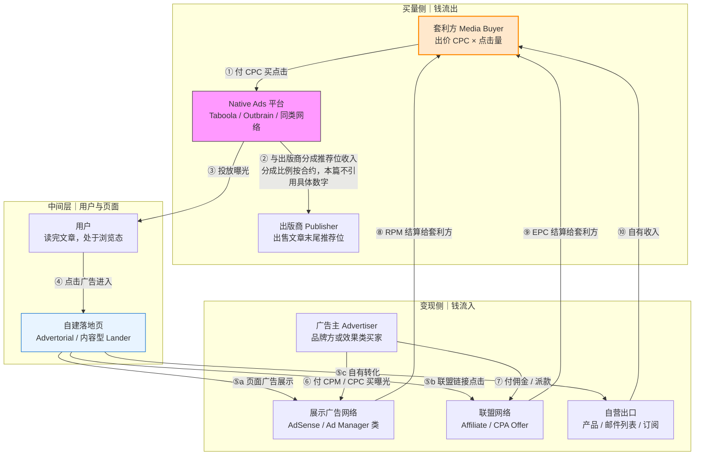
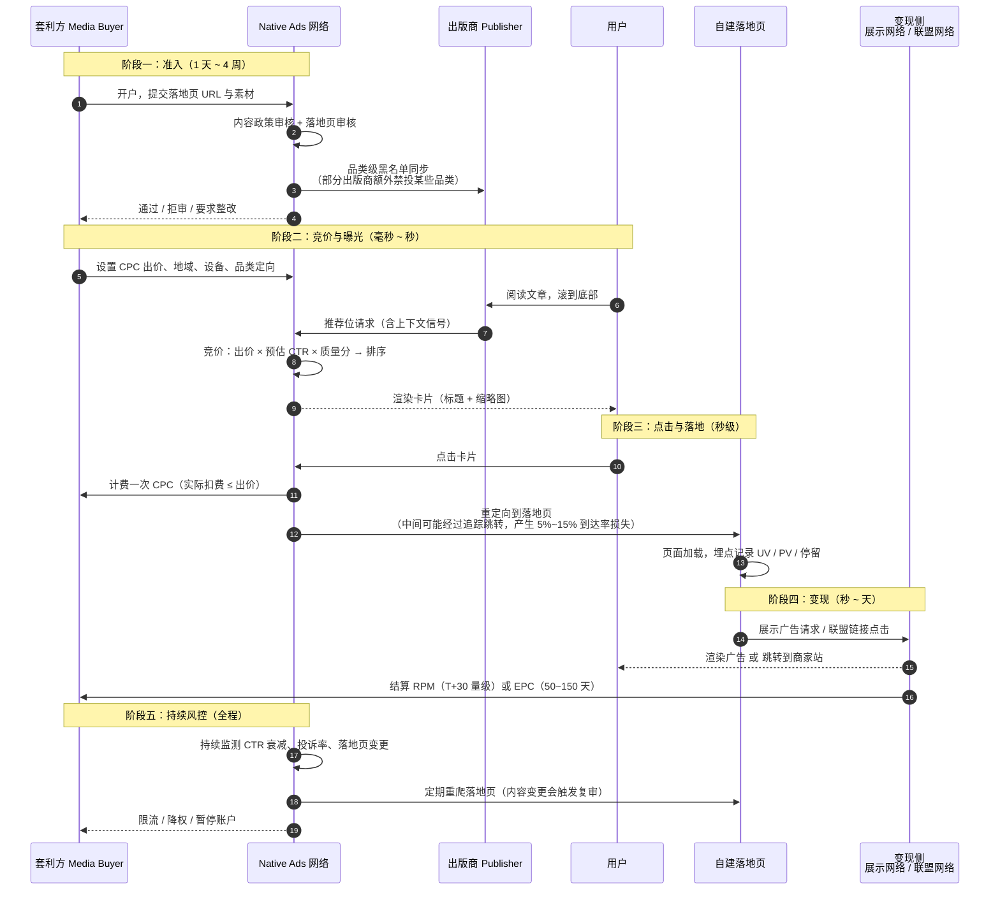
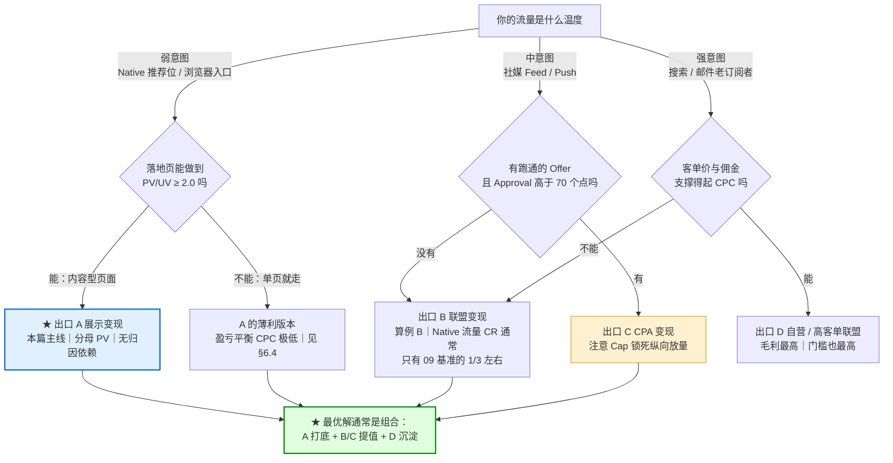
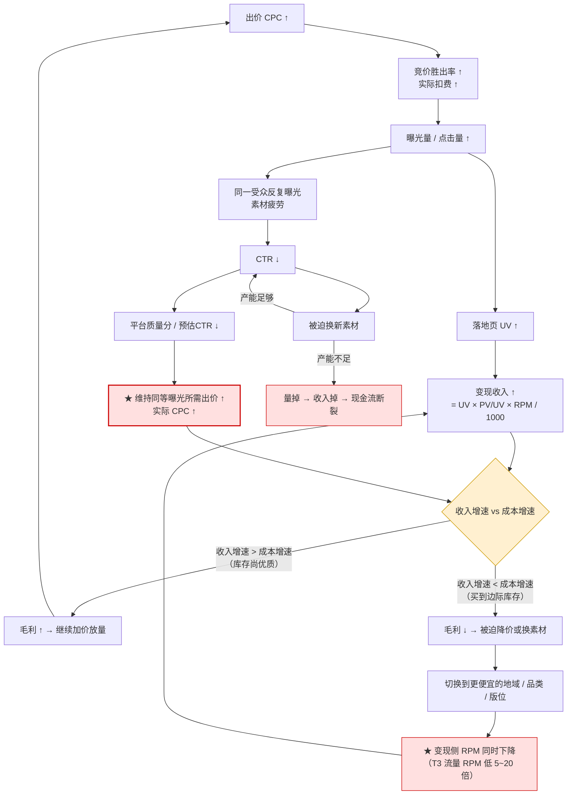
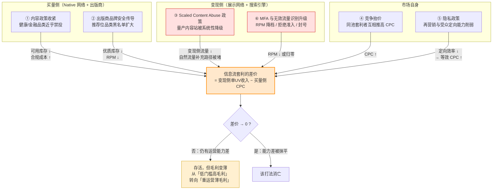
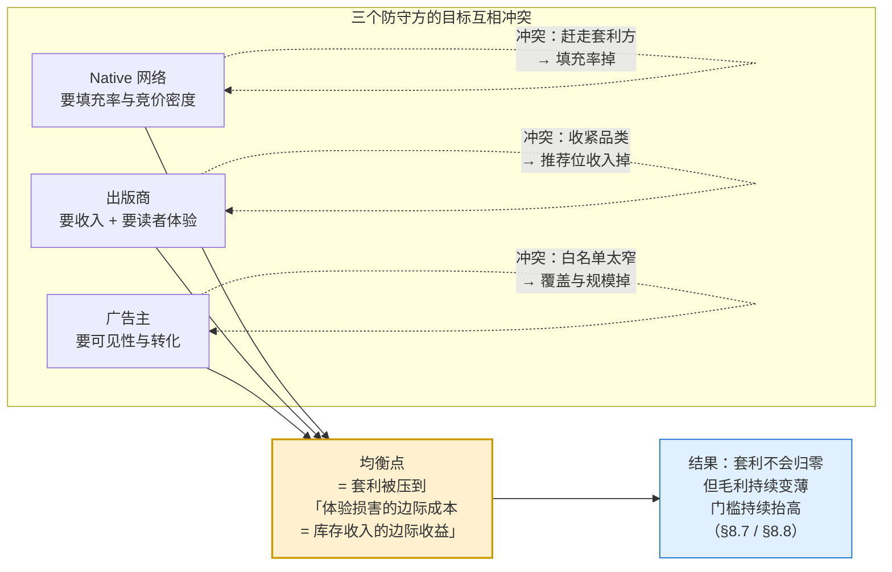

# 信息流套利：Taboola / Outbrain 与 Native Ads 买量

> **一句话定位**：信息流套利是**买方套利**里规模最大的一支——用 CPC 竞价从 Native Ads 网络买入**出版商推荐位上的弱意图流量**，落在自建的内容型落地页上，再用**展示广告 RPM / 联盟 EPC / CPA 派款 / 自有转化**四种出口之一把它卖掉，赚的是"**同一批流量在买方眼里的单价，低于它在卖方变现体系里的等效单价**"这个差价。
>
> **核心结论先行**：
> ① **这不是"流量便宜所以好赚"的生意，是"每 UV 收入能否做高"的生意。** 买量 CPC 与变现 EPC_1000UV 在长期均衡下必然被竞争推向相等（§8.4）；决定谁赚钱的不是买入价，而是**页面深度（PV/UV）、Ad Load 效率、变现网络层级**三个乘数。
> ② **Native 流量的弱意图属性，决定了它的最优出口通常是"展示变现"而不是"联盟变现"。** 算例 A（展示）毛利率可达 **69%**，算例 B（联盟，把 09 基准 CR 从 9% 校准到 Native 真实水平 2.5%）毛利率只有 **49%**，且在 T1 高价流量上**直接为负**。原因是分母结构不同：展示收入按 PV 计、联盟收入按点击计，而弱意图流量的 PV 可以做高、CR 做不高。
> ③ **页面浏览深度是被严重低估的杠杆。** PV/UV 从 1.5 提到 3.0，盈亏平衡 CPC 从 $0.034 翻到 $0.068（**整整 2 倍**，§6.4 算例）——同一批 UV、同一个 RPM，只因多翻了一页。
> ④ **规模化的天花板是素材产能，不是预算。** 素材半衰期 7~21 天（复用 09 已确立模型）× 多账户 × 多品类，意味着日消耗 $5,000 的团队需要**每天 5~10 套新素材**；同时 CPC 上涨、素材衰减加速、账户风险上升三重效应叠加，**日净利在日消耗 $500~$1,000 见顶（风险调整后约 $172~$304/日），越过 $2,000 转亏**（算例 C）。
> ⑤ **这个流派正在从"低门槛高毛利"转向"重运营薄毛利"。** 六条挤压机制同时作用（§8），当前状态判定为 **活跃但收缩**。
>
> **可信度标签**：`[标准]` 官方明文　`[政策]` 平台公开政策（标时点）　`[惯例]` 行业共识　`[推断]` 待验证推导
>
> 最后更新：2026-09-11

---

## 1. 信息流套利在套利图谱中的位置

### 1.1 三种"套利"里，它是哪一种

[`README.md`](./README.md) §3 已把三种易混的"套利"分开。本篇讲的是**买方套利（Buy-side Arbitrage）**：

| | 买方套利 ★本文 | 卖方套利 | 联盟套利 |
|---|---|---|---|
| 谁在做 | Media Buyer / 内容型落地页运营方 | 媒体 / Publisher | Affiliate / Media Buyer |
| 买什么 | **出版商推荐位上的 CPC 流量** | 不买量，卖自己的库存 | FB / TikTok / Push / Native 流量 |
| 卖什么 | 展示收入 / 联盟佣金 / Offer 派款 / 自有转化 | 多 SSP 竞价抬 eCPM | 佣金 / 派款 |
| 差价来源 | 买入 CPC < 变现等效 CPC | 竞价机制与底价差 | 买入 CPC < 佣金 EPC |
| 典型形态 | **Native 买量 → Advertorial/内容站 → AdSense 类变现** | Prebid / Reselling / Bid Caching | FB 买量 → Pre-lander → CPA Offer |
| 主要风险 | 买量平台封号 + **变现平台封号（双侧）** | 被 SPO 从供应链剔除 | 商家扣量、Offer 下架 |
| 详见 | 本文 | [`Prebid与HeaderBidding套利.md`](./Prebid与HeaderBidding套利.md) | [`联盟套利漏斗.md`](./联盟套利漏斗.md) |

### 1.2 信息流套利 vs 联盟套利：同一个流量池，两种变现出口

这是中文资料里最容易糊掉的一对。二者**买量侧高度重合**（都会买 Native），差异全在**卖出侧**：

| 维度 | **信息流套利（本文）** | **联盟套利**（[`联盟套利漏斗.md`](./联盟套利漏斗.md)） |
|---|---|---|
| 收入分母 | **PV**（展示收入）或 UV（自有转化） | **Click**（佣金 EPC） |
| 收入公式 | `UV × PV/UV × RPM / 1000` | `Clicks × Payout × CR × Approval` |
| 落地页形态 | **内容型 / 站点型**（多页、可翻页、有内链） | **漏斗型**（Pre-lander → Lander → Offer，越短越好） |
| 页面停留目标 | **越长越好**（要翻页、要看广告） | **越短越好**（快速推向 CTA） |
| 对流量意图的要求 | **低**（弱意图也能产生 PV） | **中~高**（必须转化才有钱） |
| 归因链路依赖 | 展示变现**几乎不依赖归因**（按 PV 结算） | **强依赖**（五道漏损，见 [`../09_联盟营销Affiliate/联盟角色与佣金模型.md`](../09_联盟营销Affiliate/联盟角色与佣金模型.md) §8.0） |
| 账期 | 展示网络 T+30 量级；买量支出**当天现金** | 联盟 50~150 天（09 基准） |
| 核心杠杆 | **PV/UV、Ad Load、变现网络层级** | CR、Approval Rate、Payout 谈判 |
| 主要封禁风险方 | **Google/Ad Manager 侧**（MFA 判定） | 联盟网络侧 + 流量平台侧 |

> **一句话判据** `[推断]`：**你希望用户在页面上待多久？** 希望他多翻页 → 你在做展示套利；希望他赶紧点走 → 你在做联盟套利。这个差别会决定落地页的每一个设计选择，二者不能混着优化。

### 1.3 谁在赚谁的钱：四方 + 一条被忽略的边



**两条流必须分开看**：

- **资金流**（①②⑧⑨⑩）：套利方付 CPC 给 Native 平台 → 平台与出版商分成 → 变现侧把钱付回套利方。**套利方的毛利 = ⑧+⑨+⑩ − ① − 固定成本。**
- **数据流**（③④⑤）：曝光 → 点击 → 页面行为 → 变现事件。**这条链在展示变现下极短（PV 即收入），在联盟变现下极长（要过五道漏损）**——这正是 §1.2 判据的技术根源。

**被忽略的那条边（⑥⑦）** `[推断]`：**广告主是这套体系的最终出资人，但他们通常不知道自己的钱流到了哪里。** 品牌广告主在展示网络上买的是"CPM 曝光"，其中一部分曝光实际发生在套利方买来的、质量存疑的页面上。这条边是 [`../13_反作弊与流量质量/品牌安全与广告可见性.md`](../13_反作弊与流量质量/品牌安全与广告可见性.md) 的主题，也是 §9 防守方章节里"广告主"这一方的立论基础。

### 1.4 与 09 目录的分工（本篇不重复什么）

| 已在 09 讲透 | 本篇只写增量 |
|---|---|
| Pre-lander / Lander / Bridge Page / Direct Linking 的四类页面区分与合规属性（[`../09_联盟营销Affiliate/落地页与转化漏斗设计.md`](../09_联盟营销Affiliate/落地页与转化漏斗设计.md) §2） | **Native 流量特有的适配**：为什么弱意图必须换成长叙事 + 多页结构（§5.4） |
| 漏斗逐跳流失、A/B 测试方法、EPC 判据（同上 §1、§7） | **出价与 EPC 的反馈回路**：买量侧的竞价动态如何反过来吃掉变现侧的优化成果（§6） |
| FTC 披露、Testimonial、Dark Pattern 的合规边界（同上 §8） | **Native 平台的内容政策如何与 FTC 叠加**，以及平台审核机制的设计逻辑（§5.3、§9） |
| 展示广告 RPM 的分层网络与 **PV/session 口径陷阱**（[`../09_联盟营销Affiliate/Niche站与内容站变现.md`](../09_联盟营销Affiliate/Niche站与内容站变现.md) §5.2） | **买来的流量 RPM 为什么系统性低于自然流量**，以及本篇所有算例统一采用 PV 口径的声明（§4.2） |
| 素材衰减半衰期模型 `CR(t) = CR₀ × 0.5^(t/T_half)`，T_half 7~21 天（[`../09_联盟营销Affiliate/Affiliate单位经济与规模化.md`](../09_联盟营销Affiliate/Affiliate单位经济与规模化.md) §3.5） | **它对"素材产能"这个真实瓶颈的推导**，以及 Native 场景下 T_half 偏短端的原因（§6.3） |
| Cap 锁死纵向放量、规模化只能横向扩 Offer（同上 §3.3） | **展示变现下没有 Cap，但有另一组天花板**：账户风险、变现侧政策、流量池深度（§8、算例 C） |

---

## 2. 5 问框架：信息流套利的完整拆解

> [`README.md`](./README.md) §1 规定所有流派用同一个 5 问框架。本节完整走一遍，**第 ⑤ 问在 §8 独立成节**（它是判断玩法寿命的唯一依据）。

### 2.1 ① 买什么流量

| 维度 | 答案 |
|---|---|
| **流量源** | Native Ads 网络聚合的**出版商推荐位**（文章末尾"You may also like"、侧栏、页内嵌位），以及同类网络的浏览器新标签页、内容分发位 |
| **计费方式** | **CPC 竞价**为主（少数 CPM / vCPM 形态）；平台设最低出价 |
| **单价量级** `[惯例]`（时点 2026-09） | T1 约 **$0.10~$1.20**；T2 约 **$0.03~$0.35**；T3 约 **$0.005~$0.08**。热门品类（金融/健康）可再高一个量级 |
| **流量意图** | **弱**——用户处于"浏览态"（刚读完一篇文章），不是"搜索态"（带着明确任务）。这是全篇最关键的前提 |
| **流量质量** | 参差极大：同一网络内，头部新闻出版商的推荐位质量远高于长尾内容农场；**且质量随你的出价档位变化**（高出价买到更好的版位与受众） |
| **可规模化程度** | **高**（这是它相对搜索套利、Niche 站的最大优势）：日消耗从 $100 到 $50,000 都有人跑；但**规模化会自我抬价**（§7.3 算例 C） |
| **进入门槛** | 低——开一个平台账户 + 一个落地页 + 一个变现账户即可起步；**但存活门槛高**（双侧审核） |

**与 Meta / Google 自有流量的本质差异见 §3.1，这是理解整篇的钥匙。**

### 2.2 ② 卖什么收益

四种出口，详见 §4.1 的对照表。一句话概括：

```
展示变现  → 卖 PV（页面浏览量）        收入 = PV × RPM / 1000
联盟变现  → 卖 Click（外链点击）      收入 = Clicks × EPC_有效
CPA 变现  → 卖 Action（转化事件）     收入 = Conversions × Payout × Approval
自营变现  → 卖 Relationship（关系）   收入 = 订阅者数 × LTV，或商品毛利
```

`[推断]` **四者的分母递减、单值递增、对流量意图的要求递增。** 所以弱意图流量天然落在"分母大、单值小"的那一端——即展示变现。这不是偏好问题，是数学结构问题。

### 2.3 ③ 差价从哪来

这是最需要讲清的一问。**差价不是凭空产生的，它来自四个具体的错配**：

| 错配类型 | 具体机制 | 为什么会存在 | 可被消灭吗 |
|---|---|---|---|
| **① 定价单位错配（最主要）** | 买入按 **CPC**（单次点击）计价，卖出按 **RPM**（千次页面浏览）计价。一次点击可以带来 1.5~4 个 PV | 买量市场与变现市场是**两个独立的价格体系**，中间没有套利通道把它们拉平 | 部分可以——变现侧下调 RPM，或买量侧抬 CPC（§8.4 正在发生） |
| **② 流量质量误判** | 出版商认为"文章末尾推荐位"是低价值库存，愿意低价出让；套利方通过**页面设计**把它变成可变现的 PV | 出版商没有能力/意愿自己做落地页运营，只关心推荐位的分成收入 | 难——这是分工带来的效率，不完全是漏洞 |
| **③ 运营能力差** | 同样的流量，新手 RPM $3、熟手 RPM $15（网络层级 + Ad Load + 页面深度 + 地域组合的差异） | 变现侧的优化知识（哪家网络门槛多高、Ad Load 怎么配、页面怎么分页）**不是公开信息** | 会随行业成熟而收敛 |
| **④ 平台补贴 / 库存过剩** | Native 网络的库存增长快于广告主需求增长时，平台会用**低价放量**填充库存 | 双边市场的供需阶段性失衡 | 周期性——需求回暖时 CPC 自动上涨 |

> **★ 最重要的判断** `[推断]`：**①是唯一结构性的差价来源，②③④都会随时间收敛。**
> 而①的存在前提是"**一次点击能产生多个 PV**"。所以：
> - 如果你的落地页只有 1 个 PV/UV（用户看完就走），你在**纯靠②③④赚钱**，那是脆弱的；
> - 如果你能做到 3+ PV/UV，你在**吃①的结构性红利**，那才可能长期存在。
> **这条推论直接解释了为什么这个流派的落地页必须做成"内容站形态"而不是"单页漏斗形态"**（§5.4）。

### 2.4 ④ 毛利结构

```
【展示变现口径（本篇主口径）】
  日收入 = UV × (PV/UV) × RPM / 1000
  日成本 = UV × CPC_实际 + 固定成本
  日毛利 = UV × [ (PV/UV) × RPM / 1000 − CPC_实际 ] − 固定成本

  盈亏平衡 CPC = (PV/UV) × RPM / 1000        ← 记作 EPC_1000UV 的单 UV 形式
  盈亏平衡 RPM = CPC_实际 × 1000 / (PV/UV)

【联盟变现口径】
  日毛利 = Clicks × [ Payout × CR_total × Approval × (1 − 网络抽成) − CPC_实际 ] − 固定成本
  盈亏平衡 CPC = EPC_有效        ← 与 09 §6.1 完全同式

【可承受出价（两口径通用）】
  可承受 CPC = 变现侧单 UV 收益 × (1 − 目标毛利率)
```

**与 README §2 给的通式的一致性校验**：README 写 `日毛利 = UV × RPM_变现 / 1000 − UV × CPC_买量 − 固定成本`，其中 `RPM_变现` 隐含分母是 **UV**。本篇把它显式展开为 `(PV/UV) × RPM_PV`，并**全程声明 RPM 的分母是 PV**（§4.2），二者等价、无矛盾。

**敏感性通式**（复用 09 已建立的结论）：

```
|ΔM/M| = 0.2 × (1 − g) / g        g = 毛利率
g = 88.5%（09 基准，低 CPC + 高派款）→ CPC ±20% 只影响毛利 ∓2.6%
g = 69%  （本文算例 A 展示变现）    → CPC ±20% 影响毛利 ∓9%
g = 49%  （本文算例 B Native 联盟） → CPC ±20% 影响毛利 ∓21%
g = 20%  （规模化后的薄毛利状态）   → CPC ±20% 影响毛利 ∓80%
```

> **★ 这条推导给出的最重要运营结论** `[推断]`：**毛利率越低，CPC 的敏感度高得越快。**
> 09 说"CPC 不敏感、落地页工程师比出价优化师值钱 8.7 倍"，那是在 g=88.5% 的高毛利场景。
> 信息流套利的常态毛利率在 **20%~60%**（远低于 09 基准），此时 **CPC ±20% 就能吃掉 9%~80% 的毛利**——
> **所以在信息流套利里，出价与买量侧的谈判能力重新变得极其重要**，不能照搬 09 的团队编制结论。
> 这是本篇与 09 的**唯一一处结论方向差异**，根源是毛利率水位不同，不是模型矛盾。

### 2.5 ⑤ 为什么会被消灭

**独立成节，见 §8。** 六条挤压机制 + 均衡分析 + 半衰期判断。

---

## 3. 链路全景：从买量到变现的完整一跳一跳

### 3.1 Native Ads 网络到底在卖什么（必须先搞清）

**Native Ads / Content Discovery 网络**（内容推荐网络）
- 定义：一类**聚合第三方出版商页面上的"内容推荐位"库存**，以 CPC 竞价卖给广告主与流量买家的广告网络。
- 通俗解释：你读完一篇新闻，文章底下有一栏"你可能还喜欢"，里面 8~12 个图文卡片——**那一栏就是它卖的东西**。它不属于这家媒体，媒体把它租给了网络。
- 易混提示：**它不是"信息流广告"的同义词**。国内说的"信息流"（巨量引擎、腾讯广告）是**平台自有 App 内的原生广告位**；海外的 Native Ads 网络卖的是**别人家网站上的推荐位**。二者在库存归属、审核链路、流量意图上完全不同（详见 §10 与 [`../04_产品形态与广告样式/信息流广告.md`](../04_产品形态与广告样式/信息流广告.md)）。

**这是与 Meta / Google 自有流量的本质差异，必须讲透** `[推断]`：

| 维度 | **自有流量平台**（Meta / Google 搜索 / TikTok） | **Native Ads 聚合网络**（Taboola / Outbrain 类） |
|---|---|---|
| **库存归属** | 平台**自己拥有**用户界面（Feed、搜索结果页、For You） | 库存**属于第三方出版商**，平台只是代理卖方 |
| **用户与谁有关系** | 用户与**平台**有关系（账号、社交图谱、使用习惯） | 用户与**出版商**有关系（在读这家媒体的文章），与网络无关 |
| **数据资产** | 极厚——第一方行为数据、身份图谱、跨应用信号 | 薄——主要是**上下文信号**（当前文章主题）+ 出版商侧的第一方数据（受隐私政策约束）+ 网络自己的跨站行为观察 |
| **定向能力** | 强（兴趣、Lookalike、行为序列） | 中~弱（上下文定向 + 地域 + 设备 + 粗粒度兴趣） |
| **审核链路的层数** | **一层**：平台审你 | **三层**：网络审你 + **出版商审你** + 变现侧审你 |
| **品牌安全责任的承担方** | 平台自己 | **出版商承担主要声誉风险**——推荐位上出现低质广告，读者骂的是媒体 |
| **库存的边际成本** | 平台可以无限增加广告位（但会损害自有体验） | 出版商的推荐位数量**受读者体验硬约束**，不能随便加 |
| **流量意图** | 混合（Feed 是浏览态，搜索是任务态） | **纯浏览态**（读完文章后的注意力余量） |
| **CPC 量级** | 高（T1 常见 $0.5~$5+） | **低**（T1 常见 $0.1~$1.2） |

**三条推论** `[推断]`：

**① 为什么它便宜——三层因果链**

```
用户刚读完一篇文章
   → 心智状态是「浏览态」：注意力松散、无明确任务、不准备做任何决定
   → 推荐位出现在「文章末尾 / 侧栏」：视觉优先级低，属于注意力的余量
   → CTR 天然低（相对搜索广告低一个量级），单次点击的转化意图弱
   → 对广告主的等效价值低（同样 $1 买到的转化更少）
   → 广告主出价意愿低
   → CPC 便宜
```

**关键在于"便宜"不是平台的恩惠，是流量质量的定价结果。** 所以任何"用便宜流量做高意图变现"的想法，都需要一个**中间转化环节**把弱意图加热——这就是 Advertorial 的功能定位（§5.1）。

**② 为什么它反而能规模化**：出版商的数量是**开放的**（任何有流量的网站都可以接入推荐位），而 Meta/Google 的广告位数量受自有产品体验硬约束。所以 Native 网络的库存增长弹性更大，**放量空间更广**——这是它成为最大套利流派的原因。

**③ 为什么它的审核更难通过**：三层审核链路意味着**任何一层不满意都会掐断你**。而出版商那一层是**最不可预测的**——它不是规则引擎，是几百家媒体各自的品牌安全判断，且会因一次读者投诉、一次广告主施压而突然收紧（§9.2）。

### 3.2 市场结构：主要玩家与类别

`[惯例]`　**时点：2026-09。以下为公开公司的类别归纳，不含份额数字**（份额数据各家口径差异极大且变动频繁，本篇不引用具体百分比）。

| 类别 | 代表（公开公司） | 库存特征 | 审核严格度 | 对套利方的意义 |
|---|---|---|---|---|
| **头部内容推荐网络** | **Taboola**、**Outbrain**（二者于 2021 年完成合并，仍以双品牌运营） | 与大型新闻出版商有长期独家/半独家合约，库存质量相对高 | **严**（尤其健康、金融品类）；有明确的内容政策与落地页审核 | 量最大、最稳，但**准入门槛与合规成本最高** |
| **搜索引擎外的展示/发现网络** | Google 生态内的展示与发现类库存（通过 Ad Manager / 广告网络触达） | 覆盖极广，混合了自有与第三方库存 | 严，且与 AdSense 政策**联动**（买量侧违规会牵动变现侧账户） | **双侧账户关联风险最高**的一类，见 §9.4 |
| **中长尾内容推荐网络** | Revcontent、Zergnet、MGID 等公开运营的网络 | 出版商质量分层极大，含大量长尾内容站 | 中~宽（差异极大） | CPC 更低、放量更容易，但**流量质量与稳定性差**，需按版位白名单管理 |
| **社媒/短视频平台的原生位** | Meta、TikTok、Snapchat、X 等的 Feed 内原生广告 | 自有库存，意图与数据能力远强于内容推荐位 | 严 | **不属于本流派**（价差结构不同），归 [`联盟套利漏斗.md`](./联盟套利漏斗.md) |
| **浏览器/新标签页/推送类** | 各类以浏览器入口、Push 订阅为库存的网络（品类繁多，不点名小众产品） | 意图**极弱**，CPC 极低 | 宽 | 单价低但**质量差、投诉率高**，属高风险打法 |

> **红线说明**：上表只列**公开上市公司或长期公开运营的网络**，用于说明市场结构；**不推荐任何具体流量源，不给出"哪家审核松"的选择建议**。§9 会反过来讲平台如何识别与拦截。

### 3.3 完整链路：一次点击的钱与数据怎么流



**四个容易被忽略的环节** `[推断]`：

| # | 环节 | 为什么重要 |
|---|---|---|
| **③** | **实际扣费 ≤ 出价** | CPC 竞价通常是**第二价格类**机制（实际扣费由次高出价 + 增量决定），所以"出价 $0.50"不等于"每次点击花 $0.50"。**但放量时你自己的出价会抬高整个池子的清算价**（§6.2） |
| **④** | **到达率损失 5%~15%** | 你为这次点击**已经付了钱**，但用户没到你的页面。这部分是纯损失，且在任何转化率分母里都看不见（09 落地页 §1.2 已确立） |
| **⑤** | **落地页会被定期重爬** | 审核不是一次性的（§11 误解 8）。**上线后改内容 = 触发复审**，这是账户被封的高频原因 |
| **⑥** | **CTR 衰减会反噬成本** | 平台的排序是 `出价 × 预估CTR × 质量分`。素材老化 → CTR 下降 → 质量分下降 → **要维持同样曝光必须提高出价** → 成本上升。这是一个正反馈回路（§6.1 的 mermaid） |

### 3.4 链路上每一方的真实诉求

| 角色 | 想要什么 | 怕什么 | 行为结果 |
|---|---|---|---|
| **套利方** | 低 CPC、高 RPM、账户不死 | 双侧封号、素材衰减、CPC 上涨 | **持续压低买价 + 持续做高每 UV 收入 + 分散账户与站点** |
| **Native 网络** | 填充率、每次点击收入、广告主续投 | 出版商流失、品牌广告主投诉、监管 | **既要低价库存被填满（欢迎套利方），又要控制内容质量（限制套利方）——这个矛盾决定了 §8.7 的均衡** |
| **出版商** | 推荐位分成收入、读者体验、品牌声誉 | 读者投诉"这什么垃圾广告"、广告主质疑品牌安全 | **对高 eCPM 的推荐位有需求，但对内容品类设黑名单；一旦声誉受损就收紧** |
| **变现侧网络** | 高质量库存、广告主满意 | **低质流量拉低整体 RPM 与广告主信任** | **持续升级 MFA / 无效流量识别**（见 [`AdSense套利与MFA站.md`](./AdSense套利与MFA站.md)） |
| **广告主** | 曝光能带来品牌提升或转化 | **钱花在没人看的页面上、品牌出现在低质内容旁** | **要求供应链透明度、排除未知域名**（见 [`../13_反作弊与流量质量/品牌安全与广告可见性.md`](../13_反作弊与流量质量/品牌安全与广告可见性.md)） |
| **用户** | 读到有用的内容 | 被误导、被追踪、页面全是广告 | **投诉、装拦截器、离开出版商**——这是所有收紧的最终驱动力 |

---

## 4. 变现出口：四种卖法的对照

### 4.1 四类出口总对照表

`[惯例]`　**时点：2026-09。下表 RPM/EPC 全部为量级区间，且分母口径已在列头显式声明**（口径陷阱见 §4.2）。**任何具体数字都必须用自己的实测覆盖。**

| 维度 | **A 展示变现**<br/>AdSense / Ad Manager 类 | **B 联盟变现**<br/>Affiliate 链接 | **C CPA Offer 变现** | **D 自营产品 / 邮件列表** |
|---|---|---|---|---|
| **收入分母** | **PV**（页面浏览量） | **Click**（外链点击数） | **Action**（转化事件） | **UV**（访客 / 订阅者） |
| **单 UV 收益量级**<br/>（T1 混合流量，2026-09） | **$0.02~$0.15**<br/>（= PV/UV 1.5~3.0 × RPM $8~$30 ÷ 1000） | **$0.03~$0.40**<br/>（外链 CTR 8%~20% × EPC $0.3~$2.5） | **$0.05~$0.80**<br/>（CR 0.5%~4% × Payout $5~$45 × Approval） | **$0.10~$2.00+**<br/>（低量高值：订阅/复购/自有毛利） |
| **RPM 量级**（PV 口径） | 入门级网络 T1 **$3~$15**；中级 T1 **$10~$45**；T3 **$0.5~$8** | 不适用（按 Click 计） | 不适用（按 Action 计） | 不适用 |
| **EPC 量级**（每外链点击） | 不适用 | 内容类 **$0.1~$3**；高价 B2B/SaaS 可达 $10+（09 §7.1） | 不适用 | 不适用 |
| **对流量质量的要求** | **低**——只要能产生 PV 与停留就有收入 | **中**——必须有点击外链的意愿 | **中~高**——必须完成表单/购买动作 | **高**——必须建立信任 |
| **对内容形态的要求** | **多页、可翻页、有内链**（要 PV/UV） | 有推荐位、有对比结构（要外链 CTR） | 强叙事 + 单一 CTA（漏斗形态） | 品牌感 + 价值主张 + 订阅入口 |
| **对页面深度的偏好** | **越深越好**（PV/UV 是核心杠杆） | 中（太深会稀释 CTA） | **越浅越好**（多一跳多一层流失） | 中 |
| **归因链路依赖** | **几乎为零**（按 PV 结算，不需要跨站归因） | **强**（Cookie / Click ID / Postback，五道漏损） | **强**（同上，且窗口更短） | **弱**（自有支付与自有列表） |
| **账期** | 展示网络 **T+30 量级**；买量支出**当天现金** | **50~150 天**（09 基准） | **30~90 天** | **T+1~T+7** |
| **规模化上限** | **高**（PV 可无限增加，但受变现侧政策约束） | 中（受 Offer Cap 约束，09 §3.3） | **低**（Cap 硬锁死纵向放量） | 低（受内容与产品产能约束） |
| **主要风险** | **变现侧 MFA / 无效流量判定**（`[政策]` Google 明确把"主要目的是展示广告的页面"列为违规）→ 账户封禁、收入没收 | Offer 下架、扣量、佣金下调、Approval 崩塌 | Cap 撞顶、派款层级被转手压价、商家跑路 | 转化率极低（冷流量做自营通常不成立）、前期投入沉没 |
| **典型毛利结构** | 收入随 UV 线性，成本随 UV 线性 → **毛利率 = 1 − CPC/EPC_1000UV** | 同上线性结构，但 EPC 波动更大 | **加法结构**（Σ 各 Offer 的 Cap 上限） | 前期负、后期高（自有资产） |
| **谁在做** | 内容型落地页 / 站群 / 聚合站 | 买量型 Affiliate | Media Buyer | 极少数（需要长期投入） |

### 4.2 ★ RPM 分母口径声明（本篇所有算例的前提）

09 [`Niche站与内容站变现.md`](../09_联盟营销Affiliate/Niche站与内容站变现.md) §5.2 已确立：**同一个站用 PV 口径与 session 口径算出的 RPM 可能差 1.5~2.5 倍**，对比不同网络前必须先统一分母。本篇在此之上再加一条：

> **本篇所有 RPM 数字的分母统一为 PV（页面浏览量），所有 EPC 的分母统一为"外链点击数"，所有 CPC 的分母统一为"Native 平台计费点击数"。**
> **且"CPC 的分母"与"RPM 的分母"不是同一个东西**——CPC 计的是**买量侧点击**，RPM 计的是**变现侧页面浏览**。二者之间隔着"到达率损失"（§3.3 环节 ④）。

**三个口径必须显式分开，否则算例会系统性高估收入** `[推断]`：

```
买量侧计费点击  Clicks_paid          ← 你付钱的分母
   × 到达率 85%~95%
落地页独立访客  UV_landed            ← PV/UV 的分母
   × PV/UV 1.5~3.0
落地页浏览量    PV_landed            ← RPM 的分母（PV 口径）

∴ 每个「买量侧计费点击」的实际变现收入
   = 到达率 × (PV/UV) × RPM / 1000
   ≠ (PV/UV) × RPM / 1000            ← 后者会高估 5%~18%
```

**本篇的处理方式**：为保持算例可读，**算例 A/B/C 的主式子用 UV_landed 作分母**（即已扣掉到达率损失），并在成本侧单独列一行"**到达率损失成本**"，让这笔钱显式出现而不是被藏进 UV 里。这与 09 §1.2 "平台报的点击数 ≠ 你页面收到的访问数"的口径完全一致。

### 4.3 买来的流量 RPM 为什么系统性低于自然流量

这是 09 §5.2 那张 RPM 分层表**不能直接套用**的地方，必须给出折价系数 `[推断]`：

| 折价来源 | 机制 | 量级（相对 09 §5.2 的自然流量 RPM） |
|---|---|---|
| **① 地域组合更差** | 套利方为压 CPC 会混入 T2/T3 流量；09 的 RPM 区间以 T1 为前提 | **T1 vs T3 差 5~20 倍**（09 已确立）。混合流量必须按地域加权重算 |
| **② 停留与浏览深度更浅** | 弱意图用户读完就走，PV/UV 天然低于自然搜索访客 | PV/UV 自然流量 2.0~3.5 vs 买量流量 **1.3~2.5** |
| **③ 变现侧对流量来源敏感** | 部分展示网络会因**付费流量占比过高**而下调 RPM 或拒绝准入（09 §5.2 陷阱 ③：中级网络卡"流量真实性"） | 中级网络准入可能被直接拒；即使接入，RPM 也可能被降档 |
| **④ 广告可见性与无效流量折价** | 买量流量的设备/网络更差（中低端 Android + 弱网），广告加载失败率与不可见率更高 | 有效展示率下降 → 等效 RPM 再打折 |
| **⑤ 品类上下文价值低** | 内容型落地页的主题往往泛化（为覆盖多品类流量），广告主竞价密度低 | 垂直权威站的 RPM 溢价拿不到 |
| **⑥ 季节性被放大** | RPM 的 Q4/Q1 波动在低基数上被放大 | 波动幅度更大，预算规划更难 |

**综合折价系数** `[推断]`（**待验证，验证方法：同一站点分别用自然流量与买量流量做对照，比较 Page RPM**）：
**买量流量的实际 RPM 通常是同类自然流量站的 30%~70%。**

> **这条折价系数是全篇最重要的一个"隐性假设修正"。** 很多新手的算例错误不在于公式，而在于**把 09 §5.2 里 Mediavine 级的 $18~$45 RPM 直接套到自己买来的 T2 混合流量上**——那会高估收入 3~10 倍，得出"稳赚"的错误结论，然后在真实数据面前崩溃。
> 本篇算例 A 采用的是 **入门~中级网络的 T1/T2 混合 RPM $8~$22**，已经隐含了这个折价。

### 4.4 出口选择的决策树



**组合出口的三个协同与冲突** `[推断]`：

| 关系 | 说明 |
|---|---|
| **协同：A + D** | 展示收入覆盖买量成本（保命），邮件列表把一次性流量变成可重复变现资产（09 §5.4：列表是**唯一不依赖归因链路的自有资产**）。**这是唯一能把"租来的流量"变成"自有资产"的组合** |
| **协同：A + B** | 没点外链的 80%~92% 访客由 A 变现，点了外链的由 B 变现——**分母不重叠**，是纯加法 |
| **冲突：A vs B/C** | 广告位越多，外链 CTR 越低（09 §5.1 已指出二者在"页面空间"上是竞争关系）。**必须实测平衡点**，不能凭感觉 |
| **冲突：A vs 变现侧政策** | 广告负载越重，越接近"主要目的是展示广告的页面"这一 MFA 判定特征 → **变现侧封号风险上升**。这是 A 出口的内在天花板（详见 [`AdSense套利与MFA站.md`](./AdSense套利与MFA站.md)） |

---

## 5. 落地页侧：为什么是 Advertorial 形态

> **分工声明**：页面类型的四分类（Pre-lander / Lander / Advertorial / Direct Linking）、合规边界、FTC 披露要求、Testimonial 与 Dark Pattern 的判定，**已在 [`../09_联盟营销Affiliate/落地页与转化漏斗设计.md`](../09_联盟营销Affiliate/落地页与转化漏斗设计.md) §2、§3、§8 讲透，本篇不重复**。
> 本篇只写三件事：**Advertorial 在套利链路里的功能定位**、**Native 流量特有的页面适配**、**平台审核机制的设计逻辑**。
> **红线**：本节不提供 Advertorial 的写法模板、标题公式、图片规范或任何"怎么写才不被发现"的内容。

### 5.1 Advertorial 的功能定位：不是骗，是**意图转换器**

**Advertorial**（软文式广告页，Advertisement + Editorial）：09 §3 的定义是采用编辑/新闻/测评的排版与叙事方式呈现的付费推广内容。

在套利链路里，它承担的是一个**明确的工程功能** `[推断]`：

```
【输入】弱意图流量：用户刚读完一篇文章，处于浏览态
        ├─ 没有明确任务
        ├─ 不准备做决定
        └─ 对广告样式有习得性无视（Banner Blindness）

【需要解决的问题】变现出口需要"意图"，但流量没有意图

【Advertorial 的功能】用内容叙事在页面内制造意图
        ├─ 建立问题的存在感（"原来这件事值得关注"）
        ├─ 提供信息与判断（降低用户的决策成本）
        ├─ 延长停留与翻页（直接产生 PV → 展示收入）
        └─ 在意图形成后，给出变现出口（外链 / CTA / 下一页）

【输出】① 强意图子集 → 走 B/C/D 出口（少数人）
        ② 弱意图但多页浏览的主体 → 走 A 出口（多数人）★
```

> **★ 这里有一个被普遍误解的关键点**：**在展示变现口径下，Advertorial 的主要产出不是"转化"，而是"页面浏览量"。**
> 算例 A 会证明：一个 PV/UV = 2.5 的内容型落地页，即使**外链 CTR 为零、转化为零**，也能靠展示收入盈利。
> 所以"Advertorial = 骗人买东西"这个印象是错的——**在这个流派里，多数访客从头到尾没有点过任何外链，他们的价值全部由 PV 贡献。**
> 这也解释了为什么这个流派的落地页越来越像"内容站"而不是"漏斗"（§5.4）。

**但它的合规风险确实更高**，因为"看起来像编辑内容"这件事本身就要求**明确披露商业关系**（09 §3.1 表格已列边界）。**功能正当 ≠ 手法合规**，二者必须分开评价。

### 5.2 Native 流量特有的页面适配（本篇增量）

09 §2.2 给出了"需要 Pre-lander 的四个场景"，其中第一条就是"流量是冷的（信息流、Push、Pop）"。本节讲**冷到什么程度会改变页面结构**：

| 适配项 | 热流量（搜索/邮件）的做法 | **Native 弱意图流量的做法** | 为什么 |
|---|---|---|---|
| **叙事长度** | 短——价值主张 + 社会证明 + CTA，一屏内完成 | **长**——需要完整的问题建立 → 信息供给 → 判断 → 引导 | 用户没有预先形成的需求，**需求必须在页面内被建立** |
| **页面数量** | 单页 | **多页 / 分页 / 强内链** | 展示变现的收入分母是 PV；且长叙事天然需要分页承载 |
| **CTA 密度** | 高（首屏 + 中段 + 末尾） | **低~中**（过度 CTA 会破坏内容感，同时压低 PV/UV） | CTA 与 PV/UV 在此场景是**竞争关系**：把人送走就少一页 |
| **首屏目标** | 让人立刻行动 | **让人继续读下去**（降低跳出率） | 跳出 = PV/UV = 1.0 = 收入减半（§6.4） |
| **信息密度** | 精炼 | **需要实质信息量**（否则读者立刻识别为广告并离开） | 弱意图用户的耐心极低，第一屏不抓住就没了 |
| **信任元素** | 品牌背书、评价 | **来源可核查性**（引用、数据、真实署名） | 同时也是 09 §3.2 E-E-A-T 与 Google 质量政策的要求 |
| **加载速度优先级** | 高 | **极高** | 09 §4.3：买量流量的设备与网络远差于假设，弱网 + 中低端 Android 是常态；**每多一跳重定向多一次 DNS+TLS** |
| **移动端优先** | 是 | **是，且要按最差的设备测** | Native 推荐位流量移动端占比极高 |

**页面深度与展示变现的量化关系** `[推断]`：

```
每 UV 展示收入 = (PV/UV) × RPM_PV / 1000

PV/UV = 1.2（单页、看完就走）    RPM $15 → 每 UV 收入 $0.018
PV/UV = 2.0（分页 + 少量内链）    RPM $15 → 每 UV 收入 $0.030
PV/UV = 3.0（多页 + 强内链）      RPM $15 → 每 UV 收入 $0.045
PV/UV = 4.5（内容站形态）         RPM $15 → 每 UV 收入 $0.068

→ PV/UV 从 1.2 到 4.5，收入 ×3.75。而 CPC 不变。
→ 这就是 §2.3 结论①「结构性差价来自一次点击产生多个 PV」的数值化。
```

**但 PV/UV 有硬上限** `[惯例]`：分页过细（比如把 800 字拆成 8 页）会触发两类反制——① **用户体验崩坏**（读者流失、投诉、出版商侧的口碑反馈）；② **变现侧政策**（人为拆分页面以提高广告展示数，是展示网络的明确违规类型）。**可持续区间大致在 PV/UV 2.0~4.0**，超过就要问自己"这些页面是为用户做的还是为广告位做的"。

### 5.3 合规边界：三层审核如何叠加

`[政策]` + `[惯例]`　**时点：2026-09。以下为对公开政策方向的归纳，不构成对任何具体条款原文的引用；具体条款请以各平台当期政策页面复核。**

**Advertorial 面临的不是一个审核方，是四个** `[推断]`：

| # | 审核方 | 审什么 | 触发后果 | 与 09 的关系 |
|---|---|---|---|---|
| **①** | **监管方**（美国 FTC；英国 ASA/CAP；欧盟 UCPD） | 商业关系是否清晰显著披露；宣称是否有依据；Testimonial 是否真实且典型；是否有 Dark Pattern | 执法行动、罚款、连带责任 | 09 §8.1~§8.4 已详列，**本篇不重复** |
| **②** | **买量侧 Native 网络** | 内容政策（禁止品类、误导性标题与图片、宣称强度）；落地页政策（是否有实质内容、是否与素材一致、是否为纯跳转页） | 拒审、限流、账户暂停、永久封禁 | 09 §2.5 讲的是 Google Ads / Meta 的 Destination Requirements；**Native 网络的对应机制是本篇增量**（§5.3.1） |
| **③** | **出版商** | 品类黑名单（很多媒体禁投健康、金融、减肥、政治类）；品牌调性 | **该出版商的库存对你关闭**——你甚至不会收到通知，只会发现量掉了 | **09 完全没有这一层，这是 Native 网络独有的**（§9.2） |
| **④** | **变现侧网络** | 内容质量、流量真实性、是否 MFA、付费流量占比、Ad Load 是否过度 | 降档 RPM、拒绝准入、封号、没收收入 | 09 §5.2 陷阱 ③ 已指出"付费流量占比过高会被拒"；**MFA 判定细节见 [`AdSense套利与MFA站.md`](./AdSense套利与MFA站.md)** |

#### 5.3.1 买量侧的内容政策：平台如何识别（防守方视角，不给规避方法）

`[惯例]`　**本节只讲"平台看什么信号"，不讲"怎么改才过审"。**

| 信号类别 | 平台在看的可观测特征 | 为什么这个特征有效 |
|---|---|---|
| **标题与素材一致性** | 卡片标题/图片的承诺，与落地页首屏内容是否**语义对齐** | 不对齐 = 用户预期落空 = 高跳出 + 高投诉；这是**用户满意度**的最直接代理指标 |
| **误导性表述模式** | 是否出现"治愈/根治/保证/稳赚/X 天见效"类绝对化与功效宣称；是否伪造紧迫感（每次访问重置的倒计时、假库存、假在线人数） | 这类表述与投诉率、退款率高度相关，且**可被文本模式识别自动化检测**（09 §8.4 已列同一批特征） |
| **伪装独立编辑** | 域名与版式是否伪装成新闻媒体（报纸版式 + 新闻类域名 + 伪造报头/记者署名） | FTC 对 deceptive format 有明确执法口径；同时**损害出版商生态的整体信任** |
| **落地页实质内容** | 页面是否有独立于"引导点击"的信息价值；文字量、结构、引用来源 | 纯跳转页 = 零用户价值 = 长期损害网络声誉 |
| **品类合规** | 是否落入禁止/受限品类（健康宣称、金融收益承诺、成人、盗版、下载站等） | 这些品类的监管与投诉风险最高，平台一律从严 |
| **落地页稳定性** | **定期重爬**：上线后内容是否被替换成与审核版本不同的东西 | 这是识别"审核后改内容"的核心手段（§11 误解 8）。**注意：这与 Cloaking 是两件事**——Cloaking 是同一时刻对不同访问者返回不同内容（09 §2.4），这里是不同时刻内容变了 |
| **账户行为模式** | 同主体多账户、频繁换域名、素材与落地页的高频轮换、投诉率与拒审率的历史 | 用于识别"被封后换壳重来"，是账户信誉体系的基础（§9.1.2 机制 ①） |

> **红线声明**：以上信号清单的用途是**理解平台为什么这样设计、以及防守方可以怎么加强**（§9）。**本文不提供任何用于降低这些信号可检测性的方法。**

#### 5.3.2 品类红线：为什么健康与金融是重灾区

`[惯例]` + `[政策]`　**时点：2026-09。**

| 品类 | 为什么审核最严 | 主要监管/政策依据方向 | 对套利方的实际含义 |
|---|---|---|---|
| **健康 / 保健品 / 减肥** | 功效宣称直接涉及人身安全；FDA 对膳食补充剂禁止疾病治疗宣称（09 §3.2 已述） | FTC 要求 competent and reliable scientific evidence；FDA 的 Structure/Function Claim 限制 | **多数严肃出版商直接拉黑**； networks 审核最严；投诉率最高 |
| **金融 / 投资 / 加密 / 贷款** | 收益承诺可能构成证券欺诈；消费者损害金额大 | FTC + SEC + 各州监管；多国对加密广告有专门限制 | 部分网络**整体禁投**；CPC 反而最高（因为合规玩家少、竞价集中在少数人手里） |
| **政治 / 社会议题** | 出版商品牌安全风险极高 | 各平台政策 + 出版商自律 | 选举周期前后收紧幅度最大 |
| **YMYL 内容站本身** | 变现侧对内容质量要求更高（09 §2.5） | Google 的质量评估框架（**非排名算法文档**） | 用买量流量做 YMYL 主题的内容站，**变现侧准入难度显著更高** |

**结构性后果** `[推断]`：**审核越严的品类，CPC 越高、可用库存越少、账户死亡率越高，但单位毛利也越高。** 这是一个"**风险溢价**"结构——不是"审核严所以别做"，而是"审核严意味着这个品类的差价里含了一份风险补偿，而这份补偿的期望值通常为负（因为封号会没收全部未结算收入）"。详见 [`套利风险-平台封禁与合规.md`](./套利风险-平台封禁与合规.md)。

### 5.4 与 09 漏斗模型的接口：为什么这里的页面结构是"反漏斗"的

09 §1.3 建立的判据是"**该层带来的意图提升幅度 > 该层的直接流失率**"，并推出"漏斗越深、CR_total 越低、但可承受的 CPC 越低"。

**在展示变现口径下，这个判据要改写** `[推断]`：

```
【09 联盟口径】加一层页面：
   收益 = 意图提升 → CR_offer ↑ → Approval ↑
   成本 = 该层流失 → CR_total ↓
   判据 = 意图提升幅度 > 直接流失率

【本篇展示口径】加一层页面（或加一次分页/内链跳转）：
   收益 = PV +1 → 展示收入 += RPM/1000（确定性收益，不依赖任何人转化）
   成本 = 该层流失 → 后续 PV 全部归零（概率性损失）
   判据 = (1 − 流失率) × 后续期望PV收益 + RPM/1000  >  流失率 × 原有后续PV收益
```

**两条判据的方向差异**：

| | 09 联盟漏斗 | 本篇展示结构 |
|---|---|---|
| 加页面的收益 | **不确定**（依赖 CR 提升） | **确定**（多一个 PV 就多一份 RPM/1000） |
| 加页面的成本 | 确定（流失） | 不确定（后续 PV 归零的期望损失） |
| 最优页面数 | 少（09 §6.2 算例：直链在同等流量下 EPC 最高） | **多**（只要单页流失率低于盈亏线） |
| 结论 | **漏斗要短** | **内容要长、页要多** |

> **所以这个流派的落地页在结构上是"反漏斗"的**：09 教你把用户尽快送到商家站，这里教你把用户尽量留在自己的页面上。
> **这不是道德差异，是分母差异**——09 的钱在"点击外链"那一刻产生，这里的钱在"每一次页面浏览"时产生。
> **但两者可以在同一个页面上共存**（§4.4 协同 A+B）：主体访客贡献 PV，少数高意图访客贡献外链点击。这也是为什么成熟玩家做的是"内容站 + 联盟位"的混合体，而不是纯漏斗。

**单页流失率的盈亏线** `[推断]`：设每次翻页的流失率为 `d`，单页展示收入为 `r = RPM/1000`，则加第 n 页的净收益为正的条件是：

```
(1 − d) × r  >  0        →  只要 d < 100% 就为正？不对，要算机会成本：
加第 n 页后，剩余用户的期望后续页数 = Σ (1−d)^k
正确的判据是：加页后总期望收入 = r × Σ_{k=1..n} (1−d)^(k−1)  必须单调递增
→ 由于 (1−d) < 1，级数收敛，加页永远增加收入（数学上）
→ 真正的约束不在数学，在三处：① d 太高时新增量趋近于零（不值得维护成本）
                              ② 人为拆页触发展示网络政策（§5.2）
                              ③ 用户体验崩坏 → 出版商/网络侧的口碑反馈 → 账户风险
```

**这条推导的实用结论**：**PV/UV 的优化不是数学问题，是政策与体验问题。** 数学告诉你"越多越好"，现实告诉你在 2.0~4.0 之间停手。

---

## 6. 出价与 EPC 的平衡（本篇技术核心）

### 6.1 核心等式与反馈回路

```
【核心等式】
   可承受 CPC = 变现侧单 UV 收益 × (1 − 目标毛利率)

   展示口径：变现侧单 UV 收益 = 到达率 × (PV/UV) × RPM_PV / 1000  ≡ EPC_1000UV / 1000
   联盟口径：变现侧单 UV 收益 = 到达率 × 外链CTR × EPC_有效

【盈亏平衡（毛利率 = 0）】
   盈亏平衡 CPC = 到达率 × (PV/UV) × RPM / 1000
   盈亏平衡 RPM = CPC / (到达率 × PV/UV) × 1000
```

**但这个等式是静态的。真实的系统是一个带负反馈与正反馈的回路** `[推断]`：



**读图要点——三个必须理解的回路** `[推断]`：

| 回路 | 类型 | 机制 | 运营含义 |
|---|---|---|---|
| **① 出价 → 量 → 收入 → 加价** | 正反馈（有上限） | 只要边际库存的变现效率不低于平均，加价放量就是赚的 | **但这个回路有天花板**：库存质量随出价档位下降，边际 UV 的 RPM 低于平均 RPM |
| **② 量 → 素材疲劳 → CTR↓ → 质量分↓ → 实际CPC↑** | **负反馈（致命）** | 平台的排序含预估 CTR 因子，CTR 掉了要维持曝光就得加价 | **这是"素材产能是真实瓶颈"的机制根源**（§6.3）——不是创意问题，是成本问题 |
| **③ 降本 → 换便宜地域 → RPM 同步下降** | **隐藏的负反馈** | 买量侧省下的钱，被变现侧的 RPM 折价吃掉 | **T3 流量 CPC 便宜 5~20 倍，但 RPM 也便宜 5~20 倍（09 §5.2）——两个倍数如果相等，换地域是零收益动作**。这是 §11 误解 3 的定量版本 |

### 6.2 出价机制：CPC 竞价里到底发生了什么

`[惯例]` + `[推断]`　**以下为对公开竞价机制的通用归纳，具体机制以各平台当期文档为准。**

| 机制要素 | 常见形态 | 对套利方的实际影响 |
|---|---|---|
| **计费方式** | CPC（按点击计费）为主；部分场景 CPM / vCPM | CPC 下**曝光免费、点击才花钱** → CTR 是成本的隐含分母 |
| **排序公式** | 通常为 `出价 × 预估CTR × 质量/相关性因子` 类的**期望收益排序**（与 [`../03_业务逻辑与商业模式/拍卖机制与竞价理论.md`](../03_业务逻辑与商业模式/拍卖机制与竞价理论.md) 的 GSP/eCPM 排序同构） | **低质量素材即使高出价也拿不到量**；反过来，高 CTR 素材可以用更低出价拿到同样曝光 |
| **实际扣费** | 第二价格类（实际扣费 ≤ 出价，由次高竞争者决定） | **出价 ≠ 成本**。但放量时你自己成为别人的"次高竞争者"，会抬高整个池子的清算价 |
| **最低出价** | 按地域/品类设定 floor | 决定了这个地域**能不能进场**；T3 的 floor 极低，T1 高 |
| **预算与放量** | 日预算 + 出价上限；加速投放会优先消耗高质量库存 | **日预算耗尽后自动停**，所以"量掉了"可能只是预算问题，不是账户问题 |
| **定向粒度** | 地域、设备、浏览器/OS、时段、品类/上下文、版位白名单 | **版位白名单是控制质量的第一杠杆**（长尾内容站的流量质量差异极大） |

**放量与 CPC 上涨的关系（这是 §7.3 算例 C 的机制基础）** `[推断]`：

```
放量推高 CPC 的四条机制：
① 库存质量分层——优质版位库存有限，扩量必然买到更差的版位
   → 等效于「平均质量下降」→ 要维持同样的胜出率必须加价
② 自我竞价——你的消耗占比越高，你越可能成为自己的竞争者
   （在同一场拍卖里你的多个广告组互相抬价）
③ 受众饱和——同一批用户被反复曝光 → CTR 衰减 → 质量分下降 → 实际 CPC 上升
④ 竞对跟进——起量的素材会被同行观察到并复制（09 已指出素材情报是双向的）
   → 同一关键词/品类池的竞争者增加 → 清算价上升

量级 `[惯例]`（时点 2026-09，无一手数据支撑，仅作方向参考）：
   日消耗 $100 → $1,000    CPC 常见上涨 10%~40%
   日消耗 $1,000 → $5,000  CPC 常见再涨 20%~60%
   日消耗 $5,000 → $20,000 CPC 常见再涨 30%~100%+，且需扩品类/扩地域才能继续
```

### 6.3 素材衰减：为什么"素材产能"是这个流派的真实瓶颈

**直接复用 09 已确立的模型**（[`../09_联盟营销Affiliate/Affiliate单位经济与规模化.md`](../09_联盟营销Affiliate/Affiliate单位经济与规模化.md) §3.5），本篇不重新推导，只做**场景校准与瓶颈推导**：

```
CR(t) = CR₀ × 0.5^(t / T_half)

T_half = 7 天 （快衰减：Sweepstakes / Nutra / Push 流量）
T_half = 14 天（中位：多数 Native + Lead Gen）
T_half = 21 天（慢衰减：Brand Search / 高意图品类 / 邮件）
```

**Native 场景的校准** `[推断]`：**信息流套利的 T_half 应取偏短端（7~14 天）**，三条理由：
① **弱意图流量对新鲜度更敏感**——强意图用户是带着任务来的，素材旧一点也会点；弱意图用户是被"这一眼"吸引的，**视觉与标题的新鲜度就是全部**；
② **受众池更小且重叠度更高**——出版商推荐位的受众是有限的几批人，反复曝光后疲劳得更快（§6.1 回路 ②）；
③ **展示变现口径下衰减的是 CTR 而不是 CR**——但机制同构：**CTR(t) = CTR₀ × 0.5^(t/T_half)**，而 CTR 直接进入平台的质量分与排序，所以衰减会**同时打击量与成本**（比联盟口径下只打击 CR 更严重）。

**★ 在展示口径下，素材衰减的后果比联盟口径更严重** `[推断]`：

| | 联盟口径（09） | **展示口径（本篇）** |
|---|---|---|
| 衰减的是什么 | CR（转化率） | **CTR（点击率）** |
| 直接影响 | EPC_有效 ↓ → 每点击毛利 ↓ | ① 平台排序分 ↓ → **曝光量 ↓**；② 质量分 ↓ → **实际 CPC ↑** |
| 后果 | 收入下降，成本不变 | **收入下降 + 成本上升，双向挤压** |
| 盈亏平衡 CPC 变化 | 下降（EPC 掉了） | **下降得更快**（EPC 掉 + CPC 涨） |

**素材产能需求的推导**（把 09 §7 的公式移植到本流派）：

```
素材需求速率 = 在跑「账户 × 品类 × 地域组合」数 / T_half

场景一：单人，2 个账户 × 2 品类 × 3 地域 = 12 个组合，T_half = 10 天
        → 每 0.83 天需要一套新素材 ≈ 每天 1.2 套

场景二：小团队，5 个账户 × 4 品类 × 5 地域 = 100 个组合，T_half = 10 天
        → 每天 10 套新素材

场景三：机构化，日消耗 $50,000，需要 300+ 组合在跑
        → 每天 30 套新素材 → 必须有专职创意团队 + 外包产能
```

> **★ 本节的核心结论**：**信息流套利的规模化天花板不是资金、不是流量、不是技术，是"每天能产出多少套新素材"。**
> 这与 09 §7 对买量型 Affiliate 的结论（"**素材衰减是确定的、连续的、不可谈判的；素材产出是可变的、有产能上限的**"）完全同构。
> **推论**：一个团队的日消耗上限 ≈ 素材日产能 × T_half × 单组合可承载的日消耗。
> 想突破，只有三条路：**提高素材产能（招人/外包/AI 辅助）、延长 T_half（做更耐用的内容型素材）、减少组合数（聚焦）**。
> 加预算不在这三条路里——**这就是 §11 误解 7"规模化就是加预算"的定量反驳。**

### 6.4 PV/UV 对展示变现的杠杆（含算例，另见 §7.1 算例 A）

`[推断]`　**同一批 UV、同一个 RPM，只改 PV/UV。口径声明**：下表全部按**每个 UV_landed**（已到达落地页的独立访客）计算；
到达率取 90%，所以**每个 UV_landed 的买量成本 = CPC ÷ 0.9**；实际 CPC 假设为 $0.030 → 每 UV 成本 $0.0333。

| PV/UV | 每 UV 展示收入<br/>（RPM $15，PV 口径） | 盈亏平衡 CPC<br/>（= 0.9 × PV/UV × 15/1000） | 每 UV 毛利<br/>（收入 − $0.0333） | 毛利率 |
|---|---|---|---|---|
| **1.2**（单页看完就走） | $0.0180 | **$0.0162** | −$0.0153 | **亏损** |
| **1.5** | $0.0225 | $0.0203 | −$0.0108 | **亏损** |
| **2.0** | $0.0300 | $0.0270 | −$0.0033 | **亏损** |
| **2.5** | $0.0375 | $0.0338 | +$0.0042 | **11%** |
| **3.0** | $0.0450 | $0.0405 | +$0.0117 | **26%** |
| **4.0** | $0.0600 | $0.0540 | +$0.0267 | **44%** |

```
盈亏平衡 CPC = 到达率 × (PV/UV) × RPM / 1000
PV/UV 1.5 → 3.0（翻倍）：盈亏平衡 CPC 从 $0.0203 → $0.0405（同样翻倍）

校验（PV/UV = 3.0 那一行）：
  每 UV 收入 = 3.0 × 15 / 1000 = $0.0450
  每 UV 成本 = $0.030 ÷ 0.90   = $0.0333
  每 UV 毛利 = 0.0450 − 0.0333 = $0.0117
  毛利率     = 0.0117 ÷ 0.0450 = 25.9% ≈ 26%   ✅ 与表内一致
```

> **★ 这一节的结论**：**PV/UV 翻倍 = 可承受 CPC 翻倍 = 可进入的流量池扩大一个档位。**
> 在 RPM $15 的假设下：PV/UV = 1.5 时你**只能买 CPC < $0.020 的流量**（基本只有最差的 T3 库存）；
> PV/UV = 2.5 才刚过盈亏线（$0.034）；PV/UV = 3.0 时能买到 **CPC < $0.041** 的流量（T3 优质 + 部分 T2）；
> PV/UV = 4.0 且 RPM 提到 $25（换更好的变现网络）时，可承受 CPC 到 **$0.090**（T2 主力档位）。
> **所以"页面深度"不是一个 UX 指标，是这个流派的准入门票。**
>
> **第二个结论更反直觉**：**在 CPC $0.030 这个价位上，PV/UV < 2.5 的所有做法都是亏的。**
> 而 §4.3 已经指出买量流量的 PV/UV 常态只有 **1.3~2.5**——**这意味着这个流派的默认状态是亏损，盈利需要主动把 PV/UV 推到区间上沿。**
> 这是 §11 误解 1「Native 流量便宜所以好赚」的定量反驳。

---

## 7. 三个完整算例

> **统一口径声明（三个算例共用，违反任何一条都会得出错误结论）**
> ① **RPM 的分母是 PV**（页面浏览量），不是 session、不是 UV、不是广告展示数——理由见 §4.2 与 09 [`Niche站与内容站变现.md`](../09_联盟营销Affiliate/Niche站与内容站变现.md) §5.2 陷阱 ①。
> ② **CPC 的分母是"买量侧计费点击"**，与 RPM 的分母不是同一个东西，中间隔着到达率。
> ③ **到达率统一取 90%**（09 [`落地页与转化漏斗设计.md`](../09_联盟营销Affiliate/落地页与转化漏斗设计.md) §1.1 给 85%~95%），并**把到达率损失作为一行显式成本列出**，不藏进 UV 里。
> ④ 所有数值为**假设值**，用于说明结构而非预测收益；每个参数都标注来源与区间。
> ⑤ 三个算例**刻意使用不同的流量档位与地域组合**，因为它们回答的是三个不同的问题（能不能赚 / 该选哪个出口 / 能做多大规模）。**不要把它们横向比收益率。**

### 7.1 算例 A：展示变现型（本篇主线）

**问题**：一个内容型落地页，靠展示广告变现，日投多少、赚多少、盈亏平衡在哪、哪个变量最脆弱？

#### A-1 假设表

| 参数 | 取值 | 依据与区间 |
|---|---|---|
| 日 UV_landed（已到达落地页的独立访客） | **100,000** | 假设值；对应日买量点击 111,111 |
| 到达率 | **90%** | 09 落地页 §1.1（85%~95%） |
| CPC（实际扣费，非出价） | **$0.018** | §3.1 T2/T3 混合区间 $0.005~$0.35 的中段；本例取 T3 优质 + T2 长尾混合 |
| PV/UV | **2.5** | §4.3 买量流量 1.3~2.5 的**上沿**（内容型多页结构的成果） |
| Ad Load（广告单元数 / PV） | **2.5** | 09 §5.2「中负载」定义 |
| 填充率 Fill Rate | **85%** | `[惯例]` 入门~中级网络常见区间 70%~95% |
| 可见率 Viewability | **65%** | `[惯例]`；口径与阈值见 [`../13_反作弊与流量质量/品牌安全与广告可见性.md`](../13_反作弊与流量质量/品牌安全与广告可见性.md) |
| 有效 eCPM（每千次**可见**展示） | **$9.00** | 由下方 RPM 反推；T1/T2 混合、入门~中级网络 |
| 变现网络层级 | **入门级 ~ 中级** | 09 §5.2 分层表（**买量流量常拿不到中级准入**，§4.3 折价来源 ③） |
| 地域组合 | T1 35% / T2 40% / T3 25% | 假设值；**RPM 必须按此加权重算，不能直接用 T1 数字** |
| 日固定成本 | **$250** | 主机与 CDN $40 + 追踪与分析工具 $60 + 素材与内容摊销 $150 |

#### A-2 逐步计算

```
① RPM 的四因子分解（这一步是本算例的核心，它把「RPM」拆成四个可优化的旋钮）
   RPM_PV = Ad Load × Fill × Viewability × eCPM_可见
          = 2.5 × 0.85 × 0.65 × $9.00
          = $12.43 / 1000 PV

② 日 PV          = 100,000 UV × 2.5            = 250,000 PV
③ 日展示收入     = 250,000 ÷ 1,000 × $12.43    = $3,107.8
④ 日买量点击     = 100,000 ÷ 0.90              = 111,111 clicks
⑤ 日买量成本     = 111,111 × $0.018            = $2,000.0
⑥ 其中「到达率损失」= (111,111 − 100,000) × $0.018 = $200.0
   → 这 $200 买到了 11,111 次「付了钱但用户没到页面」的点击，占总买量支出 10%
⑦ 日变动毛利     = $3,107.8 − $2,000.0         = $1,107.8
⑧ 日净利         = $1,107.8 − $250             = $857.8
   → 月净利 ≈ $857.8 × 30 = $25,700
⑨ 毛利率 g（变动口径）= $1,107.8 ÷ $3,107.8    = 35.6%
   净利率（含固定成本）= $857.8 ÷ $3,107.8      = 27.6%
```

**口径自洽性校验（与 09 §5.2 兼容）** `[推断]`：

```
本例 PV 口径 RPM = $12.43，落在 09 §5.2「入门级 AdSense T1 $3~$15」区间内 ✅
换算为 session 口径：session RPM ≈ (PV/UV) × PV RPM = 2.5 × $12.43 = $31.1
   → 落在 09 §5.2「中级 Mediavine $18~$45」区间内 ✅
   → 倍数 2.5，正好落在 09 所述「PV 与 session 口径差 1.5~2.5 倍」的上沿 ✅

∴ 同一个站，报 PV 口径是「入门级 $12」，报 session 口径是「中级 $31」。
  两个数字都没错，但混用会得出完全错误的迁移决策。这就是 §4.2 声明口径的原因。
```

#### A-3 三个方向的盈亏平衡

| 求解目标 | 公式 | 数值 | 安全边际 | 含义 |
|---|---|---|---|---|
| **盈亏平衡 CPC** | `到达率 × (PV/UV) × RPM / 1000` | **$0.0280** | 当前 $0.018，**可上涨 56%** | CPC 涨到 $0.028 才开始亏 |
| **盈亏平衡 RPM** | `CPC × 1000 ÷ (到达率 × PV/UV)` | **$8.00** | 当前 $12.43，**可下降 36%** | RPM 掉到 $8 才开始亏 |
| **盈亏平衡 PV/UV** | `CPC × 1000 ÷ (到达率 × RPM)` | **1.61** | 当前 2.5，**可下降 36%** | 页面深度掉到 1.6 才开始亏 |
| **盈亏平衡 Viewability** | `CPC × 1000 ÷ (到达率 × PV/UV × AdLoad × Fill × eCPM)` | **41.8%** | 当前 65%，**可下降 36%** | 可见率掉到 42% 才开始亏 |

> **★ 一张表看清这个算例的本质**：**四条平衡线的安全边际完全相同（都是 36%~56%），因为它们全是同一个等式的不同解法。**
> 这意味着：**这四个变量之间可以互相补偿**——CPC 涨 20%，可以用 PV/UV 提 20% 或 RPM 提 20% 来抵消。
> **这就是这个流派的全部运营艺术：不是找到某个"神奇的低 CPC 流量源"，而是同时管理四个旋钮，让它们的乘积始终高于成本。**

#### A-4 敏感性分析（用 09 的通式校核）

09 [`Affiliate单位经济与规模化.md`](../09_联盟营销Affiliate/Affiliate单位经济与规模化.md) §5.1 建立的通式：`|ΔM/M| = 0.2(1−g)/g`（成本侧变量 ±20%）。
本例 g = 35.6% → 成本侧 `= 0.2 × 0.644 / 0.356 = 36.2%`；收入侧变量则为 `0.2/g = 56.2%`。

| 变量 | 变化 | 新值 | 日变动毛利 | 变化幅度 | 通式预测 | 脆弱度 |
|---|---|---|---|---|---|---|
| **RPM** | −20% | $9.94 | $486.2 | **−56.1%** | −56.2% ✅ | ★★★★★ |
| **PV/UV** | −20% | 2.0 | $486.2 | **−56.1%** | −56.2% ✅ | ★★★★★ |
| **Viewability** | −20% | 52% | $486.0 | **−56.1%** | −56.2% ✅ | ★★★★★ |
| **CPC** | +20% | $0.0216 | $707.8 | **−36.1%** | −36.2% ✅ | ★★★★ |
| **到达率** | −10%（0.90→0.81） | 0.81 | $885.6 | **−20.1%** | — | ★★★ |
| **日固定成本** | +100%（$250→$500） | $500 | 净利 $607.8 | 净利 **−29.1%** | — | ★★ |

> **★ 与 09 的结论方向一致，但水位完全不同——这是本篇最需要强调的一处**：
> 09 基准 g = 88.5% 时，CPC ±20% 只影响毛利 **∓2.6%**，所以 09 的结论是"出价优化师不值钱、落地页工程师值钱 8.7 倍"。
> 本例 g = 35.6% 时，CPC ±20% 影响毛利 **∓36.1%**——**敏感度放大了 14 倍。**
> **∴ 在信息流套利里，买量侧的出价能力与地域/版位选择重新变成一线变量，不能照搬 09 的团队编制结论。**（§2.4 已预告此差异，此处完成数值验证）
>
> **同时注意"收入侧三兄弟"（RPM / PV/UV / Viewability）脆弱度完全相同且都高于 CPC**——因为它们都在分子上。
> **∴ 优化优先级：先做 PV/UV 与 Viewability（自己完全可控），再谈 RPM（部分可控：换网络、调 Ad Load），最后才是 CPC（外部竞价决定，最不可控）。**

#### A-5 Ad Load 的最优点：为什么"广告越多越赚"是错的

`[推断]`　把 Ad Load 从 1.5 拉到 3.5，**同时让 Fill、Viewability、eCPM 随之劣化**（广告位越多，越靠下、越不可见、广告主竞价越低）：

| Ad Load<br/>（单元/PV） | Fill | Viewability | eCPM_可见 | RPM_PV | 日收入 | 日变动毛利 | 政策与体验风险 |
|---|---|---|---|---|---|---|---|
| 1.5 | 90% | 75% | $10.50 | $10.63 | $2,657.8 | $657.8 | 低 |
| 2.0 | 88% | 70% | $9.80 | $12.07 | $3,018.4 | $1,018.4 | 低~中 |
| **2.5** ★ | 85% | 65% | $9.00 | **$12.43** | **$3,107.8** | **$1,107.8** | 中 |
| 3.0 | 82% | 58% | $8.20 | $11.70 | $2,924.9 | $924.9 | 中~高 |
| 3.5 | 78% | 52% | $7.50 | $10.65 | $2,661.8 | $661.8 | **高**（接近 MFA 判定特征） |

```
校验（Ad Load 2.5）：2.5 × 0.85 × 0.65 × $9.00 = $12.431 → 250,000 PV ÷ 1000 × 12.431 = $3,107.8 ✅
校验（Ad Load 3.5）：3.5 × 0.78 × 0.52 × $7.50 = $10.647 → 250,000 ÷ 1000 × 10.647 = $2,661.8 ✅
```

**三条结论** `[推断]`：

1. **毛利对 Ad Load 是一条倒 U 曲线，峰值在 2.5 附近**——从 1.5 加到 2.5 多赚 $450/日，从 2.5 加到 3.5 **反而少赚 $446/日**。"广告位越多越赚"在越过峰值后是**负的**。
2. **峰值位置不是固定的，由 Viewability 与 eCPM 的折价速率决定**——页面越长、广告位越靠下，折价越快，峰值越靠左。
3. **越过峰值之后还有第二重成本没进表**：政策风险（§4.1 出口 A 的主要风险）与用户体验（PV/UV 本身会因体验恶化而下降）。**所以真实的峰值比表里算出的更靠左。**

> 完整框架见 [`../12_流量变现与商业化/eCPM优化方法论.md`](../12_流量变现与商业化/eCPM优化方法论.md)；09 §5.2 对「轻/中/重负载」的定性描述（RPM ×0.6~0.8 / ×1.0 / ×1.3~1.8）与本表的方向一致，本表补上了**买量场景下 Viewability 与 eCPM 同步劣化**这一项，所以峰值出现得更早。

#### A-6 算例 A 结论

> **① 这个规模（日消耗 $2,000、日 UV 10 万）能赚钱，月净利量级 $25,700，但毛利率只有 35.6%（净利率 27.6%）——远低于 09 买量型联盟基准的 88.5%。**
> **② 赚钱的前提是 PV/UV 做到了 2.5（区间上沿）**。若只有 1.6（买量流量的常见水平），本例**刚好盈亏平衡**；若 1.3，**明确亏损**。
> **③ 到达率损失是隐形的 10% 成本**（$200/日、$6,000/月），它不出现在任何转化率报表里。
> **④ 最脆弱的三个变量（RPM / PV/UV / Viewability）全在收入侧，且全是自己可控的**——这是好消息：这个流派的利润主要由**页面工程能力**决定，不是由"能不能抢到便宜流量"决定。

### 7.2 算例 B：联盟变现型（与 09 基准参数体系对接）

**问题**：同一批 Native 流量改走联盟变现，收益如何？为什么"通常不如"展示变现？

#### B-1 参数校准：把 09 基准改成 Native 真实水位

09 [`联盟角色与佣金模型.md`](../09_联盟营销Affiliate/联盟角色与佣金模型.md) §8.3 / [`Affiliate单位经济与规模化.md`](../09_联盟营销Affiliate/Affiliate单位经济与规模化.md) §3.1 的基准是：

```
Payout $45 ／ CPC $0.35 ／ CR 9%（Pre-lander 40% → Lander 22.5%）／ Approval 75%
→ EPC_有效 $3.04 ／ 单笔毛利 $2.69 ／ 毛利率 88.5% ／ ROAS 8.68
```

**09 §3.2 自己已经警告过："这个结果好得不真实……在一个竞价市场里，长期存在 ROAS 8.7 的公开 Offer 是不可能的。"** 本算例做的正是 09 预留的那步校准：

| 参数 | 09 基准 | **Native 校准值** | 校准理由 |
|---|---|---|---|
| Payout | $45 | **$45**（不变） | 沿用同一 Offer，保证可比性 |
| CPC | $0.35（标注为 T2 Native） | **$0.45** | **$45 派款的 Lead Gen Offer 通常限 T1**（Geo 白名单）→ 必须买 T1 Native 流量，§3.1 区间 $0.10~$1.20 的中低段 |
| CR_total | **9%** | **2.5%** | 09 的 9% = Pre-lander 40% × Lander 22.5%，是**优化漏斗 + 精选流量**的成果；Native 推荐位冷流量按 09 落地页 §5.1「Lead Gen 三页漏斗整体 CR 2%~10%」取**下沿** |
| Approval Rate | 75% | **70%** | 冷流量线索质量更低（填写随意、资格不符），无效与拒付更多；09 落地页 §2.2 已指出"Pre-lander 过度承诺 → CR 好看但 Approval 崩塌" |
| 网络抽成 | 0（CPA 口径下 Payout 已是净额） | **0**（不变） | 同上 |
| 到达率 | 未计 | **90%** | 本篇统一口径（§7 声明 ③） |

#### B-2 逐步计算

```
① EPC_有效（每个「已到达」点击）= Payout × CR_total × Approval × (1 − 抽成)
                                = $45 × 2.5% × 70% × 1.0 = $0.7875
② EPC_有效（每个「付费」点击）  = 到达率 × ①  = 0.90 × $0.7875 = $0.7088
③ 每点击毛利                   = $0.7088 − $0.45 = $0.2588
④ 毛利率 g                     = $0.2588 ÷ $0.7088 = 36.5%
⑤ ROAS                         = $0.7088 ÷ $0.45 = 1.58

【与 09 基准的对照】
   EPC_有效      $3.04   → $0.709   （缩水 77%）
   每点击毛利    $2.69   → $0.259   （缩水 90%）
   毛利率        88.5%   → 36.5%    （−52 个百分点）
   ROAS          8.68    → 1.58     （缩水 82%）
   盈亏平衡 CPC  $3.04   → $0.709   （缩水 77%）

【三个方向的盈亏平衡】
   盈亏平衡 CPC      = $0.709                          当前 $0.45 → 可上涨 58%
   盈亏平衡 CR       = CPC ÷ (到达率 × Payout × Approval)
                     = 0.45 ÷ (0.90 × 45 × 0.70) = 1.59%   当前 2.5% → 可下降 36%
   盈亏平衡 Approval = CPC ÷ (到达率 × Payout × CR)
                     = 0.45 ÷ (0.90 × 45 × 0.025) = 44.4%  当前 70% → 可下降 37%
```

#### B-3 同预算对比：$2,000 日消耗，两种出口

**这是本算例最关键的一步**——把算例 A 与算例 B 放在**同一笔预算**下比：

| | **算例 A：展示变现** | **算例 B：联盟变现** |
|---|---|---|
| 地域档位 | T2/T3 混合（RPM 有收入即可） | **必须 T1**（Offer Geo 白名单） |
| CPC | $0.018 | $0.45 |
| 日付费点击 | 111,111 | **4,444** |
| 日 UV_landed | 100,000 | 4,000 |
| 日收入 | $3,107.8 | 4,444 × $0.7088 = **$3,150.0** |
| 日变动毛利 | $1,107.8 | 4,444 × $0.2588 = **$1,150.0** |
| 毛利率 g | 35.6% | **36.5%** |
| 日固定成本 | $250 | $250 |
| **日净利** | **$857.8** | **$900.0** |

> **★ 反直觉的结果：同样 $2,000 日预算，两种出口的净利几乎一样（$858 vs $900，差 4.9%）。**
> **所以"Native 流量做联盟变现不如做展示变现"这句话，如果理解成"赚得更少"，是错的。**
> 真正的差异不在收益率，在**下面这六条结构性属性**——它们决定了两种完全不同的生意。

#### B-4 六条结构性差异（这才是"不如"的真实含义）

| # | 维度 | 展示变现（A） | 联盟变现（B） | 谁赢 |
|---|---|---|---|---|
| **①** | **规模上限** | **无 Cap**，可线性扩到日消耗 $50,000+ | **Cap 锁死纵向放量**（09 §3.3）。本例 CR 2.5%、日 Cap 50 → 上限 = 50 ÷ 0.025 = 2,000 clicks = **日消耗 $900**。要跑到 $2,000/日必须**同时跑 2~3 个 Offer 分摊 Cap** | **A 大胜** |
| **②** | **垫资与现金流** | 展示网络 T+30 → 日投 $2,000 × 30 天 = **垫资 $60,000** | 联盟 50~150 天（09 基准）→ 取 90 天：日投 $2,000 × 90 = **垫资 $180,000**（对照 09：日投 $500 × 90 天 = $45,000，同式放大） | **A 胜 3 倍** |
| **③** | **★ 反馈闭环速度** | RPM 数据 **T+1 可见** → 与素材半衰期 7~14 天**同量级**，可以闭环优化 | Approval 数据 **50~150 天后**才回来 → 是素材半衰期的 **4~20 倍** | **A 决定性胜出** |
| **④** | **归因链路依赖** | 几乎为零（按 PV 结算） | **五道漏损**（基数扣除 / 佣金率 / 通过率 / 抽成 / 归因成功率，09 §8.0），每一道都由外部方控制 | **A 胜** |
| **⑤** | **收入波动源数量** | 1 个（RPM，季节性 ±30%） | **4 个**（CR、Approval、Payout、Geo 政策），且 **Payout 可被商家单方面下调**、Offer 可随时下架 | **A 胜** |
| **⑥** | **封号后果** | 变现侧封号 → 可换网络，损失约 30 天在途收入 | 联盟侧扣量 + 买量侧封号 + **未结算佣金全额没收**（50~150 天在途） | **A 胜** |

**★ 第 ③ 条是这个流派里最被低估的一条** `[推断]`：

```
素材寿命   T_half = 7~14 天（§6.3，Native 取偏短端）
展示变现反馈延迟 = 1~30 天     → 反馈延迟 / 素材寿命 = 0.1 ~ 4.3   （可闭环）
联盟变现反馈延迟 = 50~150 天   → 反馈延迟 / 素材寿命 = 3.6 ~ 21.4  （★ 无法闭环）

含义：做联盟变现时，你今天看到的 Approval Rate 数据，
      来自 2~5 个月前那批早已死掉的素材与早已换掉的落地页。
      你无法回答「这个素材版本的 EPC 到底是多少」——
      而这正是 09 落地页 §7.4 说的「必须用 EPC 而不是 CR 做 A/B 判据」的前提。
      前提不成立 → A/B 测试体系失效 → 只能靠 CR 做判据 → 系统性选出
      「短期好看、长期有害」的版本（09 §7.4 理由 1 描述的正是这个失败模式）。

展示变现不存在这个问题：PV 与 RPM 是当天可测的，EPC_1000UV 可以在 24 小时内闭环。
```

#### B-5 算例 B 结论

> **① 把 09 基准的 CR 从 9% 校准到 Native 真实水位 2.5%、Approval 从 75% 校准到 70%、CPC 从 $0.35 提到 $0.45 后，EPC_有效从 $3.04 掉到 $0.709（−77%），毛利率从 88.5% 掉到 36.5%，ROAS 从 8.68 掉到 1.58。**
> **这个校准不是推翻 09，而是兑现 09 §3.2 自己留下的警告**——"报价里一定有你没看到的东西"。
>
> **② 同预算下两种出口的净利几乎相同（$858 vs $900）。所以选出口的依据不是收益率，是六条结构性属性（B-4）——其中五条半都指向展示变现。**
>
> **③ 精确表述"为什么 Native 流量做联盟变现通常不如做展示变现"**：
> 不是因为赚得少，而是因为——
> **(a)** Native 流量的核心缺陷是**意图弱**，而联盟收入 = 意图的函数、展示收入 = 页面浏览的函数。**弱意图对 CR 的打击远大于对 PV/UV 的打击**；
> **(b)** 联盟 Offer 的 **Geo 白名单把你锁死在 T1 高价流量**上，而展示变现可以用 T2/T3 便宜流量——**这是"便宜流量"这个优势能否被兑现的分水岭**；
> **(c)** **Cap 锁死纵向放量**，所以联盟变现的规模化只能是横向的（09 §3.3 已证），需要 20~60 个 Offer 的关系网络，那是**关系生意**不是投放生意；
> **(d)** **反馈延迟是素材寿命的 4~21 倍**，A/B 优化体系在结构上失效。
>
> **④ 但联盟变现不是不该做**——它是**组合里的第二条腿**（§4.4 协同 A+B）：主体访客贡献 PV（A 出口），少数高意图访客贡献外链点击（B 出口），**分母不重叠，是纯加法**。真正不该做的是**只做 B 不做 A**，那等于放弃了 Native 流量唯一的结构性优势（便宜 + 可放量）。

### 7.3 算例 C：规模化的边际挤压（三重效应叠加）

**问题**：日消耗从 $100 加到 $20,000，毛利率怎么变？最优规模区间在哪？

#### C-1 三重效应的建模

`[推断]`　§6.2 已给出机制，这里把它参数化。**三个效应同时随规模恶化**：

| 效应 | 机制 | 参数化方式 | 量级依据 |
|---|---|---|---|
| **① CPC 上涨** | 库存质量分层 + 自我竞价 + 受众饱和 + 竞对跟进（§6.2 四条机制） | CPC 随日消耗上升 | `[惯例]` §6.2 给的分档涨幅：$100→$1,000 涨 10%~40%；$1,000→$5,000 再涨 20%~60%；$5,000→$20,000 再涨 30%~100% |
| **② RPM 与 PV/UV 下降** | 小规模可精选 T1/T2 优质地域与头部版位；规模大了必须混入 T3 与长尾版位 → 地域组合劣化（§4.3 折价来源 ①）、流量意图更弱 → PV/UV 下降 | RPM、PV/UV 随日消耗下降 | `[推断]`，量级参照 §4.3 的 T1/T3 RPM 差 5~20 倍做保守折算 |
| **③ 账户风险上升** | 账户数增加 → "至少一个被封"的概率上升；且大规模买量更容易触发变现侧的无效流量 / MFA 检测 | 风险成本率 = `1 − (1 − p₀)^n` | `[推断]`，单账户月封禁概率 p₀ 取 **2%~5%** |

**为什么 ③ 可以直接写成"风险成本率 = 至少一个账户被封的月概率"** `[推断]`：

```
在途收入 = 日收入 × 账期天数（展示变现取 30 天）
封禁一次的损失 ≈ 全部在途收入被没收（变现侧封号的常见后果，见 [`套利风险-平台封禁与合规.md`]）
月期望损失 = 在途收入 × P(至少一个账户被封)
日期望损失 = 月期望损失 ÷ 30 = 日收入 × P(至少一个账户被封)
∴ 风险成本率（占日收入的比例）= P(至少一个账户被封) = 1 − (1 − p₀)^n
```

#### C-2 假设表（六档规模）

| 日消耗 | 在跑账户数 n | CPC | RPM（PV 口径） | PV/UV | 到达率 | 日固定成本 |
|---|---|---|---|---|---|---|
| **$100** | 1 | $0.0150 | $13.50 | 2.70 | 90% | $60 |
| **$500** | 2 | $0.0170 | $13.20 | 2.65 | 90% | $120 |
| **$1,000** | 3 | $0.0190 | $12.80 | 2.60 | 90% | $180 |
| **$2,000** | 5 | $0.0225 | $12.20 | 2.50 | 90% | $300 |
| **$5,000** | 8 | $0.0290 | $11.00 | 2.40 | 90% | $600 |
| **$10,000** | 14 | $0.0400 | $9.50 | 2.20 | 90% | $1,200 |

**参数校准检查** `[推断]`：CPC 涨幅 $100→$1,000 = +27%（在 10%~40% 内 ✅）；$1,000→$5,000 = +53%（在 20%~60% 内 ✅）；$5,000→$10,000 = +38%（在 30%~100% 内 ✅）。

#### C-3 逐步计算与毛利率曲线

```
通用式：
  每 UV 收入 = (PV/UV) × RPM / 1000
  每 UV 成本 = CPC ÷ 0.90
  日 UV      = 日消耗 ÷ 每 UV 成本
  日变动毛利 = 日消耗 × (每UV收入 ÷ 每UV成本 − 1)
  毛利率 g   = 1 − 每UV成本 ÷ 每UV收入
```

| 日消耗 | 每 UV 收入 | 每 UV 成本 | 日 UV | 日收入 | 日变动毛利 | **毛利率 g** | 日固定成本 | **日净利** | 净利率 |
|---|---|---|---|---|---|---|---|---|---|
| **$100** | $0.03645 | $0.01667 | 6,000 | $218.7 | $118.7 | **54.3%** | $60 | **$58.7** | 26.8% |
| **$500** | $0.03498 | $0.01889 | 26,471 | $925.9 | $425.9 | **46.0%** | $120 | **$305.9** | 33.0% |
| **$1,000** ★ | $0.03328 | $0.02111 | 47,368 | $1,576.4 | $576.4 | **36.6%** | $180 | **$396.4** | **25.1%** |
| **$2,000** | $0.03050 | $0.02500 | 80,000 | $2,440.0 | $440.0 | **18.0%** | $300 | **$140.0** | 5.7% |
| **$5,000** | $0.02640 | $0.03222 | 155,172 | $4,096.5 | **−$903.5** | **−22.1%** | $600 | **−$1,503.5** | −36.7% |
| **$10,000** | $0.02090 | $0.04444 | 225,000 | $4,702.5 | **−$5,297.5** | **−112.6%** | $1,200 | **−$6,497.5** | −138.2% |

```
校验（$1,000 档）：
  每 UV 收入 = 2.60 × 12.80 / 1000 = $0.033280
  每 UV 成本 = 0.0190 / 0.90       = $0.021111
  日 UV      = 1000 / 0.021111     = 47,368
  日收入     = 47,368 × 0.033280   = $1,576.4
  日变动毛利 = 1576.4 − 1000       = $576.4 ；g = 576.4/1576.4 = 36.6% ✅
校验（$5,000 档）：
  每 UV 收入 = 2.40 × 11.00 / 1000 = $0.026400
  每 UV 成本 = 0.0290 / 0.90       = $0.032222  → 成本 > 收入，必然亏损 ✅
  盈亏平衡 CPC（此档）= 0.90 × 2.40 × 11.00/1000 = $0.02376 < $0.0290 → 确认已越过平衡线 ✅
```

#### C-4 叠加账户风险后的曲线

| 日消耗 | 账户数 n | P(至少一个被封)<br/>p₀=2% | P(至少一个被封)<br/>p₀=5% | 风险成本/日<br/>（= 日收入 × P） | **风险调整后日净利**<br/>（区间：低~高） |
|---|---|---|---|---|---|
| **$100** | 1 | 2.0% | 5.0% | $4.4 ~ $10.9 | **$47.8 ~ $54.3** |
| **$500** | 2 | 4.0% | 9.8% | $36.6 ~ $90.4 | **$215.5 ~ $269.3** |
| **$1,000** ★ | 3 | 5.9% | 14.3% | $92.7 ~ $224.8 | **$171.6 ~ $303.7** |
| **$2,000** | 5 | 9.6% | 22.6% | $234.5 ~ $551.7 | **−$411.7 ~ −$94.5** |
| **$5,000** | 8 | 14.9% | 33.7% | $611.0 ~ $1,379.5 | **−$2,883.0 ~ −$2,114.5** |
| **$10,000** | 14 | 24.6% | 51.2% | $1,158.7 ~ $2,409.1 | **−$8,906.6 ~ −$7,656.2** |

```
校验（$1,000 档，p₀=5%）：1 − 0.95³ = 1 − 0.857375 = 14.26% ✅
   风险成本 = $1,576.4 × 14.26% = $224.8 ✅ ；风险调整净利 = $396.4 − $224.8 = $171.6 ✅
校验（$1,000 档，p₀=2%）：1 − 0.98³ = 1 − 0.941192 = 5.88% ✅
   风险成本 = $1,576.4 × 5.88% = $92.7 ✅ ；风险调整净利 = $396.4 − $92.7 = $303.7 ✅
校验（$10,000 档，p₀=5%）：1 − 0.95¹⁴ = 1 − 0.487671 = 51.23% ✅
   风险成本 = $4,702.5 × 51.23% = $2,409.1 ✅ ；净利 = −$6,497.5 − $2,409.1 = −$8,906.6 ✅
校验（$5,000 档，p₀=2%）：1 − 0.98⁸ = 1 − 0.850763 = 14.92% ✅
   风险成本 = $4,096.5 × 14.92% = $611.2 ✅
```

**曲线的形状** `[推断]`：

```
日净利（未调风险）                       风险调整后日净利（区间中值）
 $400 ┤            ●396                  $300 ┤
 $300 ┤      ●306                        $250 ┤      ●242   ●238
 $200 ┤                                  $200 ┤
 $100 ┤  ●59                             $150 ┤
    $0 ┼───┬─────┬─────┬─────┬─────┬      $100 ┤  ●51
       100 500   1k    2k    5k   10k        $0 ┼───┬─────┬─────┬─────┬─────┬
                ↑ 峰值                     −$100┤                 ●−201
                                               100 500   1k    2k    5k   10k
                                            −$1500┤              ●−2499
                                            −$3000┤                    ●−4900
                                                       ↑ 峰值区间 $500~$1,000（两档几乎持平）
                                                       ↑ 越过 $2,000 转亏，$5,000 后加速下坠
```

#### C-5 ★ 最优规模区间与"突破曲线"的正确姿势

**结论一：不改参数，最优规模区间是日消耗 $500~$1,000**

```
未调风险：净利峰值在 $1,000（$396.4），净利率 25.1%
风险调整：$500 档 $216~$269、$1,000 档 $172~$304 —— 两档几乎持平，
          ∴ 峰值区间是 $500~$1,000（账户风险随规模超线性上升，把峰值压平并前移）
越过 $2,000：风险调整后转亏（−$95 ~ −$412）
越过 $5,000：连变动毛利都是负的（每 UV 成本 $0.0322 > 每 UV 收入 $0.0264）
```

**结论二：这条曲线是"参数不变"的曲线。规模化的正确姿势是先改参数，再加预算。**

同样在 **日消耗 $5,000** 这一档，把三个参数改掉：

| 改动 | 从 → 到 | 手段 | 依据 |
|---|---|---|---|
| RPM | $11.00 → **$20.00** | 换变现网络层级（入门 → 中级）+ 混入部分直客广告 | 09 §5.2：中级 T1 $10~$45；直客可达程序化 **2~5 倍** |
| PV/UV | 2.40 → **3.20** | 落地页内容站化（多页 + 强内链，§5.2、§6.4） | §6.4 证明 PV/UV 是准入门票 |
| CPC | $0.0290 → **$0.0290**（不变） | 规模带来的抬价无法回避 | §6.2 |

```
每 UV 收入 = 3.20 × 20.00 / 1000 = $0.06400
每 UV 成本 = 0.0290 / 0.90       = $0.03222
日 UV      = 5,000 / 0.03222     = 155,172
日收入     = 155,172 × 0.064     = $9,931.0
日变动毛利 = 9,931.0 − 5,000     = $4,931.0     g = 49.7%
日固定成本 = $1,200（需要团队：投放 + 素材 + 数据 + 合规）
日净利     = $3,731.0                            净利率 37.6%
风险调整（n=8，P=14.9%~33.7% → 风险成本 $1,482~$3,343）：净利 $388 ~ $2,249
```

> **★ 算例 C 的核心结论**：
> **同样日消耗 $5,000，不改参数的净利是 −$1,504，改了参数是 +$3,731，差额 $5,235/日（约 $157,000/月）。**
> **∴ "规模化"在这个流派里的含义不是"把预算调大"，而是"先把 RPM × PV/UV 的乘积抬上去，再把预算调大"。顺序反了必然亏损。**
> **这与 09 §3.3 的 Cap 结论同构**：09 说"买量型 Affiliate 的规模化在数学上不可能是纵向的，只能是横向的（更多 Offer）"；
> 本篇说"信息流展示套利的规模化在参数不变时不可能是纵向的，只能是**先升级参数**（更好的变现网络 + 更深的页面 + 更多品类分散）"。
> **两者都是加法/升级结构，不是乘法结构。** §11 误解 7「规模化就是加预算」由此被定量否证。

#### C-6 三个算例的横向总结

| | 算例 A 展示 | 算例 B 联盟 | 算例 C 规模化 |
|---|---|---|---|
| 日消耗 | $2,000 | $2,000 | $100 ~ $10,000 |
| 日净利 | $858 | $900 | 峰值 $396（$1,000 档）→ 转负（$5,000 档） |
| 毛利率 g | 35.6% | 36.5% | 54.3% → −112.6% |
| CPC 敏感度（±20%） | ∓36.1% | ∓34.8%（通式：0.2×0.635/0.365） | 随 g 下降而**急剧放大** |
| 最脆弱变量 | RPM / PV/UV / Viewability（收入侧，∓56.2%） | CR / Approval / Payout（收入侧，∓54.8%） | **规模本身**（三重效应叠加） |
| 核心瓶颈 | 变现网络准入 + 页面深度 | **Cap + 反馈延迟** | **素材产能 + 参数升级能力** |
| 一句话 | 用页面工程把便宜流量的 PV 卖出去 | 用漏斗把少数高意图访客卖掉，但规模与现金流受锁 | 加预算之前先改参数 |

---

## 8. 为什么会被消灭（5 问第 ⑤ 问）

> [`README.md`](./README.md) §1 说得很直接：**第 ⑤ 问最容易被忽略，但它是判断"这个玩法还能活多久"的唯一依据。**
> 本节给六条挤压机制，每条标注**作用方向、量级、时间尺度、可逆性**；然后分析为什么它们不会把套利消灭到零（§8.7 的均衡）；最后给半衰期判断（§8.8）。

### 8.1 六条挤压机制总览



### 8.2 逐条拆解

`[推断]` + `[政策]`　**时点：2026-09。以下机制的方向判断为行业共识；具体政策条款请以各平台当期文档复核，本节不引用任何未经核实的条款编号或阈值。**

| # | 机制 | 作用方向 | 量级 | 时间尺度 | 可逆吗 |
|---|---|---|---|---|---|
| **①** | **买量侧内容政策收紧** | 可用库存 ↓、合规成本 ↑、账户死亡率 ↑ | **健康/金融/减肥品类在头部网络上近乎不可投**；每次收紧都会淘汰一批玩家 | 持续（2018 年起多轮，选举年与监管事件后加速） | **不可逆**（政策只会更严） |
| **②** | **出版商品牌安全压力传导** | 优质库存 ↓、RPM ↓ | 头部出版商的品类黑名单逐年扩大；**这一层不透明、不通知，只表现为"量掉了"** | 持续，且**由广告主与读者双向驱动** | **不可逆**（品牌安全是单向棘轮） |
| **③** | **搜索引擎对量产内容的政策** | 变现侧的自然流量补充路径被堵 | 09 [`Niche站与内容站变现.md`](../09_联盟营销Affiliate/Niche站与内容站变现.md) §3.4 / §4.4 已详述 **Scaled Content Abuse**（2024-03 公布的垃圾内容政策）：**不论是否 AI 生成、不论是否原创，"为提高排名而非为用户量产页面"即构成滥用** | 已发生（2024-03 起），持续执法 | **不可逆** |
| **④** | **同池竞争抬价** | CPC ↑ | 算例 C 已量化：日消耗从 $100 到 $10,000，CPC 涨 **2.67 倍**，而 RPM 只跌 33% → 但**这是单个玩家的自我抬价；全行业玩家增多时的抬价更快** | 持续 | **周期性可逆**（行业退潮时 CPC 会回落） |
| **⑤** | **隐私政策削弱定向能力** | 等效 CPC ↑（同样的钱买到更不精准的量） | 浏览器对第三方 Cookie 与跨站追踪的限制、移动端设备标识的收紧，使**跨站行为定向**与**再营销**能力下降；上下文定向相对不受影响 | 已发生，持续 | **不可逆** |
| **⑥** | **变现侧 MFA 与无效流量识别升级** | **RPM ↓ 或直接归零** | **这是六条里唯一直击收入端且能"归零"的一条**。判定特征包括"页面主要目的是展示广告""付费流量占比异常""人为拆分页面提高展示数" | 持续升级 | **不可逆** |

### 8.3 ③ 与 ⑥ 的合流：为什么"内容站化"这条路本身在被堵

§5.4、§6.4 反复强调"这个流派的出路是把落地页做成内容站（提高 PV/UV）"。**但这条出路正好撞在 ③ 和 ⑥ 的枪口上** `[推断]`：

```
出路：落地页内容站化 → PV/UV 从 1.5 提到 3.0~4.0 → 可承受 CPC 翻倍
       ↓
但它需要的动作是：为承载更多广告展示而量产页面
       ↓
③ Scaled Content Abuse 的判定要点是「为提高排名/收益而非为用户，生成许多页面」
   —— 注意：这条政策的判据是「目的」，不是「质量」。
      09 §3.4 明确：「无论内容是否原创、是否 AI 生成、是否高质量」都可能构成滥用
⑥ 变现侧的 MFA 判定要点是「页面存在的主要目的是否是展示广告」
       ↓
∴ 「为了多赚广告费而多做的页面」同时命中 ③ 和 ⑥ 的核心判据
       ↓
结果：PV/UV 的可持续区间被从两侧压缩
      —— 数学上越多越好（§5.4），政策上超过某个点就是违规
      —— §5.2 给的 2.0~4.0 区间，上沿正在下移
```

> **★ 这是本篇对"为什么会被消灭"最重要的一条判断**：**这个流派的核心生存策略（做深页面）与它面临的两条最强挤压机制（量产内容滥用 + MFA 判定）指向同一个动作。**
> 所以它不是被某一次政策更新打死的，而是**生存空间被从两侧持续压缩**——每压缩一轮，能活下来的玩家就必须把内容做得更"真的有用"，运营成本上升，毛利变薄，玩家数量减少。
> **这是一个"门槛持续抬高"的过程，不是"一刀切禁止"的过程。**

### 8.4 ④ 竞争抬价的博弈结构

`[推断]`　**为什么套利者会互相把 CPC 推到无利可图？**

```
前提：Native 推荐位的库存是「有限且共享」的（出版商数量与推荐位数量都受体验硬约束）
      套利者的变现出口是「同质的」（都用同一批展示网络，RPM 区间相同）

→ 每个套利者的可承受 CPC 上限 ≈ 同一个数（算例 A 的 $0.028）
→ 只要有人出价低于上限，加价就能抢到更多量（第二价格机制下加价成本低于加价收益）
→ 纳什均衡：所有人的出价被推到接近「共同的可承受上限」
→ 此时毛利率 → 0

打破这个均衡的三种方式（也是这个流派真正的竞争力所在）：
① 提高分子：做到别人做不到的 PV/UV 或 RPM（更好的变现网络层级、直客广告、更深的页面）
   → 你的可承受上限高于同行 → 你能在别人亏钱时还赚钱
② 降低成本结构：素材自产（不外购）、工具自建、团队效率高
   → 你的固定成本低 → 净利率高于同行
③ 找到别人不做的池子：小语种地域、冷门品类、被忽视的版位
   → 短期避开竞争（但会被跟进，半衰期短）

∴ 这个流派的长期利润 = 「运营能力差」的货币化，不是「信息差」的货币化。
  信息差会被抹平，能力差不会。这是 §8.8 半衰期判断的核心依据。
```

### 8.5 ⑤ 隐私政策的具体作用路径

| 被削弱的能力 | 对套利方的影响 | 方向 |
|---|---|---|
| **跨站行为定向** | 无法用"访问过 X 类站点"来筛人 → 只能靠上下文（当前文章主题）与粗粒度人口属性 | 等效 CPC ↑ |
| **再营销 / Retargeting** | 无法对"来过但没转化"的用户二次触达 → 单次点击的价值必须一次性兑现 | **对展示变现影响小**（本来就不靠回访），**对联盟/自营变现影响大** |
| **转化衡量与优化信号** | 平台侧的转化优化能力下降 → 智能出价的效果变差 → 更依赖人工出价 | 运营成本 ↑ |
| **受众相似扩展（Lookalike）** | 无法从种子人群扩展 → 放量时质量下降更快 | 算例 C 的 CPC 上涨曲线**更陡** |
| **上下文定向（相对不受影响）** | **反而受益**——它不依赖用户级标识 | Native 推荐位天生就是上下文场景，**这是它相对社媒平台的一个抗隐私优势** |

> **反直觉结论** `[推断]`：**隐私政策对 Native 内容推荐位套利的打击，小于对社媒买量套利的打击。**
> 因为前者的定向本来就主要靠"用户正在读什么"（上下文），后者高度依赖"这个用户是谁、做过什么"（行为图谱）。
> 详见 [`../08_海外广告生态/海外流量Tier分层与地域特征.md`](../08_海外广告生态/海外流量Tier分层与地域特征.md) 与 08 目录的隐私法规专篇。

### 8.6 六条机制的合力：毛利率的历史轨迹

`[推断]`　**以下为结构性判断，不是统计数据**（这类数据没有公开一手来源，任何具体百分比都不应被引用）：

| 时期 | 毛利率水位（量级） | 主导特征 | 门槛 |
|---|---|---|---|
| **早期**（内容推荐网络成型初期） | **高**（50%~80%） | 库存充足、竞争者少、变现侧无 MFA 概念、审核宽松 | **极低**：一个站 + 一个账户就能起 |
| **中期**（审核体系与 MFA 识别建立） | **中**（25%~50%） | 品类收紧、变现侧开始区分流量来源、头部玩家形成方法论 | **中**：需要页面工程能力与多账户运营 |
| **当前**（2026-09） | **中低**（算例 A 的 35.6%，算例 C 显示规模化后更低） | 六条机制同时作用；能力差成为唯一利润来源 | **高**：需要素材产能、变现网络关系、合规能力、数据体系 |
| **趋势方向** | **继续走低 + 分化** | 头部机构化玩家靠规模与直客关系维持；散户被挤出 | 持续抬高 |

### 8.7 ★ 为什么平台**不能**把它消灭到零：均衡怎么形成

这是 [`README.md`](./README.md) §4 要求的正向论点，也是本节最重要的判断 `[推断]`：

```
【平台的真实目标函数不是「零套利」，而是「最大化 库存收入 × 生态可持续性」】

套利方对平台的价值：
① 消化低价值库存——出版商推荐位的「文章末尾、浏览态、弱意图」库存，
   品牌广告主不愿意买（转化差、品牌安全风险）。套利方是这批库存的
   「最后买家」（buyer of last resort），没有他们，填充率会掉。
② 提供竞价密度——CPC 竞价需要足够多的买家。套利方数量多 → 竞争充分
   → 清算价更高 → 平台与出版商分成更多。
③ 承担内容生产成本——套利方自建落地页与素材，平台不承担这部分成本。

套利方对平台的成本：
① 用户体验损害——误导性素材、低质落地页 → 读者投诉 → 出版商流失
② 品牌安全风险传导 → 广告主流失（这是最贵的一项）
③ 监管与声誉风险（FTC 执法、媒体曝光）

【均衡的形成】
   平台的最优策略 = 把套利压到「体验与品牌损害的边际成本 = 库存收入的边际收益」那一点
   → 这一点永远不是零
   → 所以平台的行为模式是「周期性收紧 + 保留合规玩家」，而不是「一刀切禁止」

【可观测的表现】
   · 平台有明确的内容政策与准入审核，但从不宣布「禁止内容型落地页」
   · 头部网络对大买家提供专属客户经理与更高的量（因为大买家更合规、更稳定）
   · 品类黑名单是「分级」的（健康严、金融严、娱乐宽），不是全禁
   · 出版商可以自选接受的广告品类 → 平台把「质量判断」部分外包给出版商
   · 处罚是「阶梯式」的（拒审 → 限流 → 暂停 → 封号 → 永久拉黑），
     而不是一次性封杀 —— 阶梯式的目的正是「行为矫正」而非「清除」

【这个均衡会移动吗】
   会，而且方向明确：广告主对供应链透明度的要求持续上升
   → 品牌安全成本上升 → 均衡点向「更严」移动
   → 套利方的生存空间持续压缩，但不会归零
```

### 8.8 ★ 半衰期判断

[`README.md`](./README.md) §5 说"套利玩法半衰期通常 6~24 个月"。**这个说法需要区分层次** `[推断]`：

| 层次 | 半衰期 | 依据 |
|---|---|---|
| **单个素材** | **7~14 天**（§6.3，T_half 取偏短端） | 复用 09 已确立模型 + Native 场景校准 |
| **单个落地页/站点** | **2~6 个月** | 素材换完一轮后页面本身也会疲劳；变现侧政策与算法调整周期 |
| **单个"打法组合"**（某品类 × 某地域 × 某变现网络 × 某页面结构） | **6~18 个月** | 落在 README 给的 6~24 个月区间内；被同行复制的速度决定下限 |
| **整个流派** | **没有半衰期，但有持续的门槛抬升** | §8.7 的均衡不会归零；§8.3 的空间压缩是渐进的 |

**当前阶段判断（2026-09）**：

```
① 流派整体：仍然活跃——公开上市公司的核心业务就是卖这类库存，
   库存供给与广告主需求都在，均衡点存在（§8.7）
② 但内部结构在剧烈分化：
   · 「低门槛散户打法」（单站 + 单账户 + 入门级变现网络 + 量产内容）
     → 收缩，且在部分方向上已接近消亡（③⑥ 合流，§8.3）
   · 「机构化打法」（多账户 + 素材工厂 + 中高级变现网络 + 直客关系 + 合规团队）
     → 活跃，且门槛与利润率都在向「正规数字媒体公司」靠拢
③ 最脆弱的一环：变现侧（⑥）。买量侧的收紧是渐进的、可预期的；
   变现侧的账户处置是突发的、不可申诉的、且会没收在途收入。
   → 所以这个流派的风险管理重心应该在变现侧，不在买量侧。
   → 详见 [`套利风险-平台封禁与合规.md`](./套利风险-平台封禁与合规.md) 与
      [`AdSense套利与MFA站.md`](./AdSense套利与MFA站.md)
```

---

## 9. 如果你是平台 / 出版商 / 广告主，怎么防（防守方章节）

> [`README.md`](./README.md) §4 规定每篇流派文档必须有这一节，"这一节让研究有正向价值，也是与红线要求自洽的写法"。
> **本节的全部内容都是防守方视角**：识别信号 + 机制设计。**不含任何"如何降低可检测性"的信息。**

### 9.1 防守方一：Native Ads 网络（Taboola / Outbrain 类平台）

**它的困境**（§8.7 已述）：既要填充低价值库存（欢迎套利方），又要控制内容质量（限制套利方）。所以它的机制设计必然是**分层管控**而不是全面禁止。

#### 9.1.1 识别信号

| 信号类别 | 具体信号 | 为什么有效 | 检测难度 |
|---|---|---|---|
| **流量特征** | 单一广告主的点击高度集中在少数出版商/版位；点击的时段分布异常规整；设备与浏览器分布偏离该出版商的自然读者构成 | 正常品牌广告主的流量分布由定向决定，套利方的分布由"哪里 CPC 最低"决定 | 低 |
| **行为特征** | **落地页停留极短 + 立刻返回 / 立刻翻页到底**；**无任何交互事件**（不播放视频、不填表、不点内链正文）却产生大量广告展示；滚动速度异常均匀（机械化翻页） | 套利流量的目标是"产生 PV"，不是"消费内容"，行为指纹与自然读者不同 | 中 |
| **行为特征** | **广告点击率异常高但后续转化/停留异常低**（用户被广告位布局诱导误点） | 误点（Accidental Click）是 Ad Load 过重的直接后果，也是广告主投诉的主因 | 中 |
| **内容特征** | 落地页与素材的**语义一致性得分低**；落地页文本的**信息密度低**（大量模板化段落、无实质数据与引用）；**域名注册年龄短 + 内容量突增** | 对应 §5.3.1 的平台审核维度 | 中（需 NLP 与外部数据） |
| **内容特征** | 出现绝对化/功效宣称的文本模式；伪造紧迫感元素（重置型倒计时、假库存、假在线人数） | 与投诉率、退款率高度相关（09 落地页 §8.4 列的是同一批特征） | **低**（模式匹配即可） |
| **账户特征** | 同主体/同支付信息/同落地页模板下的多账户；被拒审后**换域名重投同一素材**；投诉率与拒审率的历史累积 | 识别"换壳重来"，是账户信誉体系的基础 | 中（需实体解析） |
| **供应链特征** | 落地页上的广告位来自与买量平台**同一集团**的变现网络（钱在体系内空转） | 这是"闭环套利"的强信号，也意味着广告主的钱没有创造真实价值 | **低**（域名与广告代码可直接观测） |

#### 9.1.2 机制设计

| 机制 | 设计要点 | 为什么这样设计 |
|---|---|---|
| **① 分层准入 + 账户信誉分** | 新账户默认低出价上限、低日预算、受限版位；随历史表现（投诉率、拒审率、留存）逐步解锁 | 把"一次性审核"变成"持续审核"，直接对治 §11 误解 8 |
| **② 动态底价（Floor Price）** | 按**版位 × 品类 × 广告主信誉**动态设 floor；对高投诉品类提高 floor | 用价格机制而不是禁令来筛选——**愿意付高价的人通常是转化目标明确的品牌广告主，而不是套利方**（套利方的可承受上限被 RPM 硬约束，§8.4） |
| **③ 落地页定期重爬 + 变更触发复审** | 不只审一次；内容变更后重新审核；**变更幅度超阈值自动暂停** | 对治"审核后改内容"（§3.3 环节 ⑤） |
| **④ 出版商级品类黑名单下沉** | 让每个出版商自选可接受的品类与广告主类型，平台负责执行 | **把质量判断部分外包给最有动机的一方**（出版商的声誉是自己承担） |
| **⑤ 投诉率与用户负反馈进入排序** | 把"返回率、投诉、拦截器命中"作为负向质量因子，直接影响排序与实际扣费 | 让损害体验的行为**自动变贵**，而不是靠人工封号 |
| **⑥ 阶梯式处罚而非一刀切** | 拒审 → 限流 → 暂停 → 封号 → 主体级永久拉黑 | §8.7 的均衡要求：目标是行为矫正，不是清除（清除会损害填充率） |
| **⑦ 结算延迟与审计权** | 对高风险账户保留结算延迟与事后审计、追回的权利 | 让"跑一波就撤"的策略期望值为负 |
| **⑧ 供应链透明度要求** | 要求广告主/代理披露最终落地页与变现方式；对"买量—变现同集团闭环"打标 | 对应 [`Prebid与HeaderBidding套利.md`](./Prebid与HeaderBidding套利.md) 的 SPO 与 reseller 白名单思路 |

### 9.2 防守方二：出售推荐位的出版商

**它的困境**：推荐位收入是"白捡的"（不需要自己生产内容），但**读者骂的是媒体，不是网络** `[推断]`。

| 识别信号 | 出版商能看到什么 | 行动 |
|---|---|---|
| **推荐位的读者反馈** | 页面评论、社交媒体吐槽、读者调研中"广告太多/太low"的提及率、**拦截器与广告屏蔽插件的安装率** | 收紧品类黑名单 |
| **推荐位的跳出与回访影响** | 装了推荐位后，**文章页的跳出率、回访率、订阅转化率是否变化** | 用 A/B（有/无推荐位）量化长期成本 |
| **具体广告主的落地页** | 人工抽查推荐位上出现的卡片，点进去看落地页 | **绝大多数出版商不做这一步**——这是最低成本、最高收益的防守动作 |
| **品类集中度** | 推荐位上是否长期只有 2~3 个品类（说明只有套利方在买） | 提高 floor 或引入直客 |

**机制设计** `[惯例]` + `[推断]`：
① **在与网络的合约里保留品类否决权与广告主黑名单权**（很多出版商签的是标准合约，没有这一条）；
② **限制推荐位的数量与位置**（文章末尾一栏 vs 每屏都插），把体验成本控制在可接受范围；
③ **要求网络提供落地页抽样报告**，或自建简单的落地页巡检；
④ **把推荐位收入与"读者留存指标"一起看**，而不是只看推荐位 eCPM——**推荐位的真实成本是读者流失，它不出现在推荐位的报表里**；
⑤ **发展直客内容合作**（原生赞助内容），用高质量广告替换低质量填充——这是 [`../12_流量变现与商业化/`](../12_流量变现与商业化/) 的主题。

### 9.3 防守方三：被蹭流量的广告主

**它的困境**：它在展示网络上买 CPM 曝光，**其中一部分曝光实际发生在套利方买来的页面上**（§1.3 那条被忽略的边）。它付了钱，但拿到的可能是**误点、不可见展示、零品牌记忆** `[推断]`。

| 识别信号 | 怎么看 |
|---|---|
| **域名级投放报告** | 要求 DSP / 网络提供**逐域名**的曝光、点击、转化明细。套利站的域名特征：注册新、内容量突增、无品牌搜索量、无外部提及 |
| **点击后的行为质量** | 按域名分组的**停留时长、跳出率、后续转化率**。套利流量在这些指标上系统性偏差 |
| **可见性与无效流量报告** | 按域名分组的 Viewability 与 IVT 率，见 [`../13_反作弊与流量质量/品牌安全与广告可见性.md`](../13_反作弊与流量质量/品牌安全与广告可见性.md) |
| **CPM 与效果的背离** | 某些域名 CPM 极低但转化也极低——**低 CPM 不是便宜，是折价** |
| **供应链路径** | 同一批库存经过多少层转售（reseller 链条长度），见 [`Prebid与HeaderBidding套利.md`](./Prebid与HeaderBidding套利.md) |

**机制设计** `[惯例]`：
① **白名单而不是黑名单**——黑名单永远追不上新注册的域名；**只投经过审核的域名清单**；
② **合约里写死供应链透明度要求**（逐域名报告、reseller 披露、审计权）；
③ **把 Viewability 与 IVT 纳入结算条款**（不可见展示不计费）；
④ **SPO（Supply Path Optimization）**——主动减少供应链路径数量，见 [`Prebid与HeaderBidding套利.md`](./Prebid与HeaderBidding套利.md)；
⑤ **用增量实验而不是归因报告评估效果**（09 [`Affiliate体系总览.md`](../09_联盟营销Affiliate/Affiliate体系总览.md) §7.2 的增量比逻辑同样适用）。

### 9.4 防守方四：变现侧展示网络（被套利方当作"出口"的那一方）

`[推断]`　它的识别信号与机制设计已在 [`AdSense套利与MFA站.md`](./AdSense套利与MFA站.md) 详述，本节只列**与信息流套利特有的接口**：

| 信号 | 说明 |
|---|---|
| **流量来源构成** | 付费流量占比异常高（09 §5.2 陷阱 ③：中级网络会因此拒绝准入） |
| **Referer / UTM 分布** | 大量访问来自少数几个推荐位域名 |
| **内容生产速率** | 站点内容量在短期内突增，且与站点年龄不匹配（对应 Scaled Content Abuse 的判定方向） |
| **广告展示数 / 内容量比值** | Ad Load 异常（§7.1 A-5 显示峰值在 2.5，超过就是为广告而做页面） |
| **用户行为分布** | 停留时长呈双峰（自然读者 vs 被引导翻页的买量访客） |

### 9.5 四方防守的合力与"不可能三角"



**给防守方的一句话总结** `[推断]`：**不要试图消灭套利，要试图提高套利的成本。**
消灭是不可能的（§8.7 的均衡）；提高成本是可行的——而**最有效的三个杠杆是**：
① **动态底价**（用价格筛选，比禁令更难绕过）；
② **持续审核而非一次性审核**（落地页重爬 + 账户信誉分）；
③ **把用户负反馈接入排序与扣费**（让损害体验的行为自动变贵）。

---

## 10. 国内 vs 海外

### 10.1 为什么国内几乎没有对应形态

**一句话** `[推断]`：**因为这个流派的存在前提是"有一个独立的第三方 Native Ads 网络，把分散在各家媒体上的推荐位库存聚合成一个可竞价买量的入口"——这个前提在国内不成立。**

**四条结构性原因**：

| # | 原因 | 具体机制 |
|---|---|---|
| **①** | **信息流广告由平台自营闭环** | 国内的信息流库存集中在**巨量引擎（抖音/今日头条）、腾讯广告（微信/QQ/腾讯新闻）、百度信息流**等**平台自有 App** 内。平台**既是库存所有者，又是竞价系统运营者，又是审核方**——没有"第三方聚合网络"这一层。你想买信息流流量，只能去平台后台开户直投 |
| **②** | **媒体的推荐位没有被第三方聚合** | 海外有大量独立新闻出版商把"文章末尾推荐位"租给 Taboola/Outbrain；国内媒体的类似位置**要么自营（自家内容推荐），要么走平台广告联盟**，没有形成独立的第三方内容推荐网络市场 |
| **③** | **落地页与转化被强制闭环** | 09 [`落地页与转化漏斗设计.md`](../09_联盟营销Affiliate/落地页与转化漏斗设计.md) §10.2 已详述：微信生态外链高度受限、抖音转化走小店闭环、外部 H5 在分享传播中易被拦截。**自由落地页这个前提在国内就不存在**——而信息流套利的核心资产恰恰是自建落地页 |
| **④** | **展示变现的第三方出口薄弱** | 海外的 AdSense / Ad Manager / 中级广告网络构成了一个**分层的、对付费流量开放的**变现市场；国内网站展示广告变现主要走**百度联盟、穿山甲、优量汇**等平台联盟，且**对"买量—变现"闭环套利的容忍度与可行性都更低**（平台自己能识别自家流量） |

**加一条资质与合规约束** `[政策]`：国内广告投放涉及**ICP 备案**（经营性还需 ICP 许可证）、部分行业的**前置审批**、《广告法》对**绝对化用语**（第 9 条禁止"国家级""最高级""最佳"等）与**代言责任**（第 38 条）的严格规定、以及《互联网广告管理办法》（2023 年 5 月施行）要求广告**可识别**并显著标明"广告"。**Advertorial 这种"看起来像编辑内容的广告"形态，在国内的合规空间比海外更窄**——因为"显著标明广告"的要求与"看起来像内容"的商业价值直接冲突。（09 落地页 §10.1 已列同一批法规，此处只讲它对形态的影响）

### 10.2 系统性对照表

| 维度 | **海外** | **国内** |
|---|---|---|
| 信息流库存归属 | **大量第三方出版商**，由独立网络聚合 | **平台自有 App**（抖音/头条/微信/QQ/百度） |
| 第三方 Native Ads 网络 | **成熟**：Taboola、Outbrain、Revcontent、Zergnet、MGID 等公开运营 | **基本不存在**（没有独立的第三方内容推荐网络市场） |
| 买量入口 | 多个网络可横向比价、可分散账户风险 | **平台直投后台**（单一入口，账户体系强实名） |
| 计费方式 | **CPC 竞价为主** | CPC / CPM / **oCPM / oCPC**（平台代优化，见 [`../14_国内市场与生态/国内主要广告平台.md`](../14_国内市场与生态/国内主要广告平台.md)） |
| 落地页自由度 | **高**（自建域名、自由结构、可多页） | **低**（平台落地页组件 / 小程序 / 站内闭环；外链受限） |
| 展示变现出口 | **分层市场**：入门级 → 中级 → 高级 → 直客（09 §5.2） | 主要是平台联盟（百度联盟、穿山甲、优量汇），**层级分化弱** |
| 内容站 + 展示变现路径 | **主流打法之一**（Niche 站生态） | **被平台内容生态挤压**（百家号、知乎、小红书、公众号吸走自然流量；独立站获取自然流量路径基本不存在——09 [`Affiliate体系总览.md`](../09_联盟营销Affiliate/Affiliate体系总览.md) §8.2 原因 ②） |
| Advertorial 形态 | 常见（受 FTC 披露约束） | **合规空间窄**（《互联网广告管理办法》要求显著标明"广告"） |
| 审核链路层数 | **三层**：网络 + 出版商 + 变现侧（§5.3） | **两层但更硬**：平台审核 + 行业资质白名单（平台既是库存方又是审核方，**无法通过换网络分散风险**） |
| 账户风险分散 | 可多网络、多账户 | **强实名 + 主体关联识别**，分散难度大 |
| 隐私与定向 | 上下文定向为主，受隐私政策削弱（§8.5） | 平台第一方数据极强，**定向能力反而更强**（闭环内） |
| 典型玩家 | Media Buyer、内容型落地页运营方、站群 | 信息流代投公司、效果广告代理、SEM/信息流优化师 |
| 对应的国内形态 | — | **信息流代投 / 效果代理**：赚的是**服务费与返点**，不是**买卖差价**——**风险结构完全不同**（不承担流量风险） |

### 10.3 国内最接近的三种"类套利"形态

`[惯例]` + `[推断]`　**只描述结构，不提供操作方案**：

| 形态 | 结构 | 与海外信息流套利的关键差异 |
|---|---|---|
| **信息流代投 / 效果代理** | 帮广告主在巨量引擎/腾讯广告上投放，赚服务费与平台返点 | **不承担流量风险**——买量的钱是广告主的。海外套利方是**用自己的钱承担差价风险**。所以国内这类公司的核心能力是"投放优化 + 客户关系"，不是"单位经济管理" |
| **内容号 + 平台分成** | 在百家号/头条号/公众号做内容，赚平台的**流量分成**与广告分成 | 收入来自**平台补贴/分成**，不是"买量—变现"的差价；**没有买量环节**，所以不构成套利（构成的是内容生产生意） |
| **电商/直播的付费流量运营** | 用平台付费流量推自己的商品或直播间 | **变现出口是自营 GMV**（对应本篇出口 D），且流量与转化都在同一平台闭环内 → **平台能同时看到买入与卖出，差价空间被平台定价能力压缩** |

> **★ 结论** `[推断]`：**国内不是"没有套利"，而是"套利的空间被平台闭环吃掉了"。**
> 海外套利方赚的是**两个独立市场之间的定价差**（买量市场 vs 变现市场，§2.3 错配 ①）；
> 国内这两个市场**被同一批平台同时运营**——平台既是流量的卖方，又是变现的买方（或分成方），
> **它有能力也有动机把这个差价定到接近零**。
> 所以国内对应的位置上长出来的是"**代投服务**"和"**平台分成**"这两种**不承担差价风险**的生意形态。
> 这也解释了为什么 09 [`Affiliate体系总览.md`](../09_联盟营销Affiliate/Affiliate体系总览.md) §8.2 说"国内 CPA Network 基本没有对应物"——**同一个结构原因**。

---

## 11. 常见误解

**❌ 误解 1：Native 流量便宜，所以信息流套利好赚。**
✅ 正确：**便宜是流量质量的定价结果，不是恩惠**（§3.1 的三层因果链：浏览态 → 位置在末尾 → CTR 低意图弱 → 广告主出价意愿低 → CPC 低）。
算例 A 显示毛利率只有 **35.6%**，远低于 09 买量型联盟基准的 88.5%；§6.4 更显示：**在 CPC $0.030 上，PV/UV < 2.5 的所有做法都是亏的**，而买量流量的 PV/UV 常态只有 1.3~2.5（§4.3）。
**这个流派的默认状态是亏损，盈利需要主动把页面深度做到区间上沿。**

**❌ 误解 2：Advertorial 就是骗人的。**
✅ 正确：要分两件事。**功能上**，它是**意图转换器**——把弱意图流量在页面内加热（§5.1）；而且在展示变现口径下，**它的主要产出根本不是"转化"而是"页面浏览量"**，多数访客从头到尾没点过任何外链。
**手法上**，它确实容易越线（伪装独立编辑、未证实宣称、虚假紧迫感），但**越线的是具体手法，不是形态本身**。09 落地页 §3.1 给的是边界清单，不是禁令。
**把形态和手法混为一谈，会导致两个错误**：以为"做 Advertorial 一定违规"，或以为"只要不违规就一定在骗人"。

**❌ 误解 3：不同变现网络的 RPM 可以直接比，选高的那个就行。**
✅ 正确：**先统一分母，再比数字**（09 §5.2 陷阱 ①）。算例 A 的校验演示了这一点：同一个站，**PV 口径 RPM $12.43，session 口径 RPM $31.1，差 2.5 倍**——两个数字都没错。
还有三条必须一起看：**地域组合**（T1 vs T3 差 5~20 倍，没有地域前提的 RPM 数字无意义）、**准入的隐性要求**（付费流量占比过高会被中级网络直接拒，09 §5.2 陷阱 ③）、**买量流量的系统性折价**（§4.3：只有同类自然流量站的 30%~70%）。
**直接搬 09 表里 Mediavine 级的 $18~$45 到自己的 T2 混合买量流量上，会高估收入 3~10 倍。**

**❌ 误解 4：出价高就能拿到量。**
✅ 正确：排序通常是 `出价 × 预估CTR × 质量因子` 类的期望收益排序（§6.2）。**低质量素材即使高出价也拿不到量**，因为平台要最大化的是**每次曝光的期望收入**，不是出价数字。
反过来，**高 CTR 素材可以用更低出价拿到同样曝光**。而且高出价还有第二重代价：§6.1 回路 ② 显示放量会加速素材疲劳 → CTR 衰减 → 质量分下降 → **维持同等曝光的实际 CPC 进一步上升**。
**"加出价"是最贵的那个杠杆。**

**❌ 误解 5：素材做一次能用很久，起量了就稳了。**
✅ 正确：`CTR(t) = CTR₀ × 0.5^(t/T_half)`，**T_half 在 Native 场景取偏短端 7~14 天**（§6.3）。而且在展示口径下衰减的是 **CTR**，它同时进入平台的排序与质量分 → **量掉 + 成本涨，双向挤压**（比联盟口径下只掉 CR 更严重）。
算出来的产能需求：**12 个「账户×品类×地域」组合、T_half=10 天 → 每天 1.2 套新素材；100 个组合 → 每天 10 套。**
**所以这个流派的天花板是素材产能，不是预算**（§6.3）。

**❌ 误解 6：展示变现和联盟变现差不多，看哪个方便就用哪个。**
✅ 正确：算例 B 证明**同预算下两者净利几乎相同**（$858 vs $900），所以选择依据**不是收益率**，是六条结构性属性：
**规模上限**（联盟受 Cap 锁死，展示无 Cap）、**垫资**（联盟 $180,000 vs 展示 $60,000，差 3 倍）、**★ 反馈闭环速度**（联盟 Approval 数据 50~150 天才回来，是素材寿命的 **4~21 倍** → **A/B 优化体系在结构上失效**）、**归因依赖**（联盟五道漏损）、**波动源数量**（联盟 4 个 vs 展示 1 个）、**封号后果**（联盟没收 50~150 天在途佣金）。
**正确做法是组合（§4.4）：主体访客走展示，少数高意图访客走联盟，分母不重叠，纯加法。**

**❌ 误解 7：规模化就是把预算调大。**
✅ 正确：算例 C 定量否证了这一条。**参数不变时**，日净利曲线是倒 U：$100 → $58.7；$500 → $305.9；**$1,000 → $396.4（峰值）**；$2,000 → $140；$5,000 → **−$1,504**；$10,000 → **−$6,498**。风险调整后峰值前移到 **$500~$1,000**。
而在**同样 $5,000 日消耗**下，先改参数（RPM $11→$20、PV/UV 2.4→3.2）净利变成 **+$3,731**——**差额 $5,235/日**。
**∴ 规模化的正确顺序是"先升级参数，再加预算"，反过来必亏。** 这与 09 §3.3 的 Cap 结论同构：**都是加法/升级结构，不是乘法结构。**

**❌ 误解 8：平台审核是一次性的，过审了就安全了。**
✅ 正确：审核是**持续的**（§3.3 环节 ⑤、§5.3.1、§9.1.2 机制 ③）。**落地页会被定期重爬，内容变更会触发复审**；账户信誉分是**累积**的（投诉率、拒审率的历史都算）；处罚是**阶梯式**的（拒审 → 限流 → 暂停 → 封号 → 主体级永久拉黑）。
**"上线后偷偷改内容"是被识别的高频原因**——注意这与 Cloaking 是两件事（09 §2.4）：Cloaking 是**同一时刻**对不同访问者返回不同内容；这里是**不同时刻**内容变了。两者都违规，检测手段不同。

**❌ 误解 9：账户被封了，换个账户、换个域名就能重来。**
✅ 正确：平台的实体解析能力覆盖**支付信息、主体信息、落地页模板指纹、素材指纹、行为模式**（§5.3.1 账户特征行、§9.1.1 账户特征行）。换壳重来的结果是**新账户继承旧账户的负信誉**，且**在途未结算收入被没收**（算例 C 已把它量化为"风险成本率 = 1−(1−p₀)^n"，日消耗 $5,000、8 个账户时是日收入的 **14.9%~33.7%**）。
详见 [`套利风险-平台封禁与合规.md`](./套利风险-平台封禁与合规.md)。

**❌ 误解 10：T3 流量 CPC 便宜 10 倍，所以更划算。**
✅ 正确：**T3 的 RPM 也便宜 5~20 倍**（09 §5.2 陷阱 ②）。§6.1 回路 ③ 已指出：**两个倍数如果相等，换地域是零收益动作。**
真正要算的是**每 UV 的净差**：`到达率 × (PV/UV) × RPM_地域 / 1000 − CPC_地域/到达率`。
而且 T3 还带三个隐性折价：**设备与网络更差 → Viewability 与 Fill 更低**（算例 A 的 RPM 四因子分解里，这两项会同时掉）、**支付渗透率低 → 联盟/自营出口基本不可用**、**广告主竞价密度低 → eCPM 更低**。
**地域选择的正确方法是算净差，不是看 CPC 单价。**

**❌ 误解 11：Taboola / Outbrain 这类平台，和国内的巨量引擎、腾讯广告是一回事。**
✅ 正确：**库存归属完全不同**（§3.1 的对照表）。海外 Native 网络卖的是**第三方出版商页面上的推荐位**，国内信息流平台卖的是**自有 App 内的广告位**。
由此推出四个差异：**数据资产**（网络薄、平台厚）、**审核链路**（网络三层含出版商、平台两层但更硬）、**品牌安全责任方**（出版商 vs 平台自己）、**风险分散可能性**（可换网络 vs 单一入口）。
**这也是国内没有对应套利形态的根本原因**（§10.1）。

---

## 12. 延伸追问

1. **变现侧的 MFA 判定到底看哪些信号？"内容型落地页"和"MFA 站"的边界在哪？**
   → 见 [`AdSense套利与MFA站.md`](./AdSense套利与MFA站.md)。本篇 §4.1、§7.1 A-5、§9.4 只给了接口，判定机制与处罚后果那篇讲透。
2. **搜索套利（RSOC / AFD）与信息流套利的单位经济差在哪？为什么搜索套利的 CPC 高一个量级却仍然有人做？**
   → 见 [`搜索套利与域名停放.md`](./搜索套利与域名停放.md)。核心差异是**流量意图**（搜索态 vs 浏览态），它会同时改变 CR、PV/UV 与可承受 CPC 三个参数。
3. **卖方侧套利（Prebid / Header Bidding）与本篇的买方侧套利，在供应链上是怎么对接的？套利方买到的库存里有多少是被转售过多次的？**
   → 见 [`Prebid与HeaderBidding套利.md`](./Prebid与HeaderBidding套利.md)。§9.3 给广告主的"供应链路径"信号就来自那里。
4. **通用毛利公式、敏感性通式、盈亏平衡反推的完整推导在哪？本篇的算例能不能换成我自己的参数？**
   → 见 [`套利单位经济与毛利模型.md`](./套利单位经济与毛利模型.md)。本篇 §2.4、§7.1 A-4 只做了应用与校核（用的正是 09 的 `|ΔM/M| = 0.2(1−g)/g` 通式）。
5. **账户被封、佣金被没收、监管风险的具体量级与应对（含现金流缓冲设计）？**
   → 见 [`套利风险-平台封禁与合规.md`](./套利风险-平台封禁与合规.md)。本篇 §7.3 C-4 只把账户风险量化成了一条成本率，处置流程与合规红线在那篇。

---

## 13. 相关文档

**同目录（`10_广告套利Arbitrage/`）**

- 本目录立场、红线与 5 问框架 → [`README.md`](./README.md)
- 六大流派分类图谱与本流派的位置 → [`套利模式总览与分类.md`](./套利模式总览与分类.md)
- 通用毛利公式、敏感性通式、盈亏平衡反推 → [`套利单位经济与毛利模型.md`](./套利单位经济与毛利模型.md)
- 变现侧的 MFA 判定与处罚（本篇出口 A 的最大风险） → [`AdSense套利与MFA站.md`](./AdSense套利与MFA站.md)
- 搜索态流量的对应流派 → [`搜索套利与域名停放.md`](./搜索套利与域名停放.md)
- 卖方侧套利与供应链透明度 → [`Prebid与HeaderBidding套利.md`](./Prebid与HeaderBidding套利.md)
- 社媒 / Push / Pop 买量做 CPA 的对应流派 → [`联盟套利漏斗.md`](./联盟套利漏斗.md)
- 封禁逻辑、合规风险、现金流缓冲 → [`套利风险-平台封禁与合规.md`](./套利风险-平台封禁与合规.md)

**跨目录**

- 漏斗与页面类型（Pre-lander / Lander / Advertorial / Direct Linking） → [`../09_联盟营销Affiliate/落地页与转化漏斗设计.md`](../09_联盟营销Affiliate/落地页与转化漏斗设计.md)
- 展示广告 RPM 分层、**PV/session 口径陷阱**、Ad Load 取舍 → [`../09_联盟营销Affiliate/Niche站与内容站变现.md`](../09_联盟营销Affiliate/Niche站与内容站变现.md)
- 买量型基准参数体系、素材衰减模型、规模化 S0~S5、Cap 约束 → [`../09_联盟营销Affiliate/Affiliate单位经济与规模化.md`](../09_联盟营销Affiliate/Affiliate单位经济与规模化.md)
- Payout / Approval / Cap / 派款层级 → [`../09_联盟营销Affiliate/CPA网络与Offer市场.md`](../09_联盟营销Affiliate/CPA网络与Offer市场.md)
- Affiliate 三方/CPA/Ad Network 的区分 → [`../09_联盟营销Affiliate/Affiliate体系总览.md`](../09_联盟营销Affiliate/Affiliate体系总览.md)
- T1/T2/T3 的地域特征与 RPM 差异 → [`../08_海外广告生态/海外流量Tier分层与地域特征.md`](../08_海外广告生态/海外流量Tier分层与地域特征.md)
- 海外生态全景与主要平台 → [`../08_海外广告生态/海外广告生态全景.md`](../08_海外广告生态/海外广告生态全景.md)
- RPM / eCPM 的完整优化框架 → [`../12_流量变现与商业化/eCPM优化方法论.md`](../12_流量变现与商业化/eCPM优化方法论.md)
- Viewability、IVT 与品牌安全的口径 → [`../13_反作弊与流量质量/品牌安全与广告可见性.md`](../13_反作弊与流量质量/品牌安全与广告可见性.md)
- 信息流广告的产品形态 → [`../04_产品形态与广告样式/信息流广告.md`](../04_产品形态与广告样式/信息流广告.md)
- 国内主要广告平台与自营闭环 → [`../14_国内市场与生态/国内主要广告平台.md`](../14_国内市场与生态/国内主要广告平台.md)
- 竞价排序机制的理论根源 → [`../03_业务逻辑与商业模式/拍卖机制与竞价理论.md`](../03_业务逻辑与商业模式/拍卖机制与竞价理论.md)

---

> **玩法状态**：**活跃但收缩**（判断时点：2026-09，依据：
> ① **活跃**——公开上市公司仍以聚合出版商推荐位、按 CPC 竞价售卖为核心业务，库存供给与广告主需求同时存在，§8.7 的均衡点不会归零；
> ② **收缩**——§8.2 的六条挤压机制同时作用，其中 ③（搜索引擎对量产内容的政策，2024-03 公布）与 ⑥（变现侧 MFA 与无效流量识别升级）**直击本流派的核心生存策略"落地页内容站化"**（§8.3）；
> ③ **内部剧烈分化**——低门槛散户打法（单站 + 单账户 + 入门级变现网络 + 量产内容）在部分方向上已接近消亡；机构化打法（多账户 + 素材工厂 + 中高级变现网络 + 直客关系 + 合规团队）仍活跃，且门槛与利润率都在向"正规数字媒体公司"靠拢；
> ④ **量化支撑**——算例 A 毛利率 35.6%（vs 09 买量型联盟基准 88.5%）、算例 C 显示不改参数时日净利峰值只到 $396（日消耗 $1,000 档）且越过 $2,000 后风险调整转亏；
> ⑤ **层次区分**——单个素材半衰期 7~14 天、单个站点 2~6 个月、单个打法组合 6~18 个月、**整个流派没有半衰期但有持续的门槛抬升**（§8.8）。
> **⚠️ 本判断为 `[推断]`，依据是政策方向与单位经济结构推演，不是统计数据；下次复核建议时点：2027-03。**）
>
> **政策时点声明**：本文涉及的 Native Ads 平台内容政策与审核机制、出版商推荐位合作条款、展示广告网络的准入与 MFA 判定、搜索引擎的垃圾内容政策（含 2024-03 公布的 Scaled Content Abuse）、以及 FTC / GDPR 等监管要求，**均为 2026-09 时点的认知归纳，标 `[政策]` 处仅表示"这是对公开政策方向的归纳"，不构成对任何具体条款原文、阈值或编号的引用**。
> 文中所有 CPC / RPM / EPC / CR / Approval / Viewability / 封禁概率数值均为 **`[惯例]` 量级区间或 `[推断]` 假设值**，用于说明结构与推导逻辑，**不可作为投放预算或收益预测依据**；任何具体决策必须用自己账户的实测数据覆盖。
> **本篇不提供任何 Advertorial 写法模板、审核规避技巧、cloaker 工具、欺诈流量源或具体 Offer 的推荐**——§5.3.1 与 §9 的信号清单仅供防守方理解机制使用。
> **最后复核：2026-09-11**

