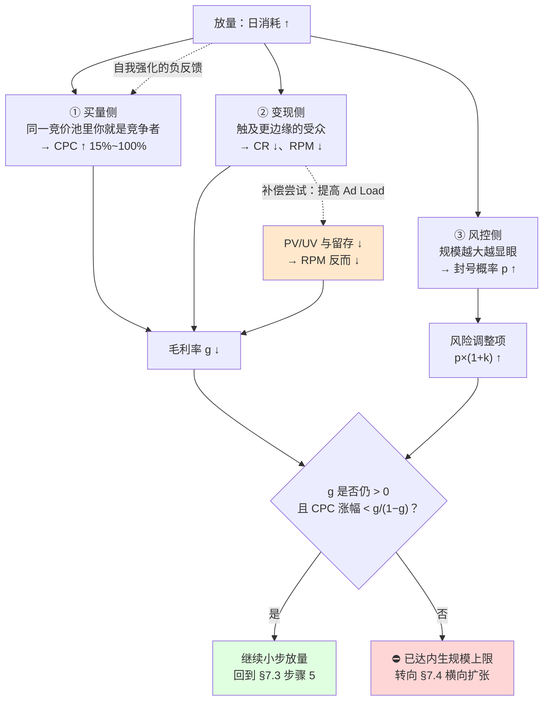
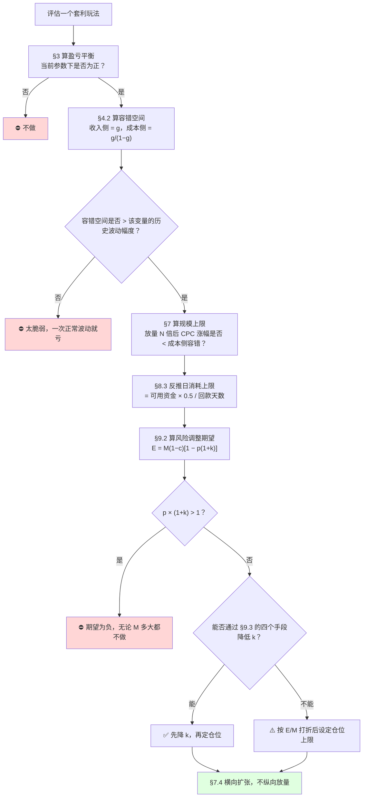

# 套利单位经济与毛利模型

> **一句话定位**：本篇是 `10_广告套利Arbitrage` 全目录的**公式与算账基准**——
> 其余 7 篇流派文档的单位经济部分都挂在这里的公式体系上，避免各篇各算一套导致口径漂移。
>
> **核心结论先行**：本篇给出三个可直接用于决策的解析式，它们比"算一遍毛利"更有价值，
> 因为它们是**判断某个玩法值不值得做**的通用判据：
>
> 1. **收入侧容错空间 = g**（毛利率）——收入最多能跌多少还不亏；
> 2. **成本侧容错空间 = g/(1−g) = ROAS − 1**——成本最多能涨多少还不亏；
> 3. **放弃判据：`p × (1+k) > 1`**（p 为月封号概率，k 为封号损失折合的月毛利数）——
>    满足即期望收益为负，**无论毛利率多高都不该做**。
>
> 由 ①② 可推出本篇最重要的对比结论：**套利（g = 20%~40%）与联盟买量（g = 88.5%）不是"利润高低"的差别，
> 而是"数学结构"的差别**——同样的 CPC ±20% 扰动，联盟场景毛利只动 −2.6%，套利场景动 −30%~−80%。
> 这解释了两者完全不同的运营节奏：套利者必须每天盯出价，联盟玩家可以只盯转化率。
>
> **⚠️ 立场声明**：本篇是**分析工具**，不是操作指南。所有算例参数均为**假设值**，
> 用于演示计算结构与杠杆关系，**不构成收益预测，也不构成对任何实际操作的建议**。
>
> **可信度标签**：`[标准]` 官方明文　`[政策]` 平台公开政策（标时点）　`[惯例]` 行业共识　`[推断]` 待验证推导
>
> 最后更新：2026-09-11

---

## 1. 本篇的角色：5 问框架的第 ④ 问

`套利模式总览与分类.md` §5 定义了全目录统一的 **5 问分析框架**：

```
① 买什么流量？      → 各流派文档的 §买量侧
② 卖什么收益？      → 各流派文档的 §变现侧 + 本篇 §2（口径统一）
③ 差价从哪来？      → 总览篇 §2（四类差价分类学）
④ 毛利结构？        → ★ 本篇（全目录的公式与算账基准）
⑤ 为什么会被消灭？  → 各流派文档的对应章节 + 本篇 §7（规模化的内生上限）
```

**分工约定**（避免各篇重复推导）：

| 内容 | 权威出处 | 其他文档怎么做 |
|---|---|---|
| 通用毛利公式、四类变现出口的统一口径 | **本篇 §2** | 引用，不重推 |
| 盈亏平衡反推与矩阵 | **本篇 §3** | 引用 + 代入本流派参数 |
| 容错空间解析式、敏感性通式 | **本篇 §4、§5** | 引用 + 代入本流派的 g |
| 规模化的三重挤压模型 | **本篇 §7** | 引用 + 给本流派的具体拐点 |
| 垫资与现金流模型 | **本篇 §8** | 引用 + 代入本流派的回款周期 |
| 风险调整后的期望收益、仓位纪律 | `套利风险-平台封禁与合规.md` §3 | 引用；本篇 §9 只做单位经济侧的衔接 |
| 各流派的具体参数与链路 | 各流派文档 | 本篇只用它们做算例演示 |

---

## 2. 通用毛利公式体系

### 2.1 基础形式（与 `README.md` 写作要点 2 一致）

```
日毛利 = 收入侧 − 成本侧 − 固定成本
       = UV × RPM_变现 / 1000  −  UV × CPC_买量  −  固定成本

盈亏平衡：RPM_变现 / 1000 = CPC_买量
```

这个形式只适用于**展示变现**。要覆盖四类出口，需要统一口径。

### 2.2 四类变现出口的公式与口径差异

| 出口 | 收入公式（每 1000 次买入点击） | 关键变量 | 口径陷阱 |
|---|---|---|---|
| **展示变现** | `PV/UV × RPM × 分成比例` | PV/UV、RPM、分成 | **RPM 的分母**：Page RPM（÷PV）vs Impression RPM（÷广告展示数）vs session-based，差 1.5~2.5 倍 |
| **点击变现**（联盟链接） | `外链 CTR × EPC × 1000` | 外链 CTR、EPC | **EPC 的分母**：多数联盟网络后台的 "EPC" 是**每 100 次点击**，不是每 1 次 |
| **Offer 派款** | `CR × Payout × Approval Rate × 1000` | CR、Payout、Approval | Approval Rate 常被忽略；Trial 类仅 **20%~50%**（Reversal 50%~80%） |
| **自营产品** | `CVR × AOV × 毛利率 × 1000` | CVR、AOV、毛利率 | 要扣退货与支付通道费 |

`[推断]` **口径不统一是套利测算最常见的致命错误**。三个高频陷阱：

1. **RPM 分母**：见 `../09_联盟营销Affiliate/Niche站与内容站变现.md` §5.2——
   AdSense 类用 Page RPM，部分报表用 Impression RPM，聚合平台按 sessions 报告。
   **对比不同变现出口前必须先统一到"每千次页面浏览"**，否则迁移决策会完全错误。
2. **EPC 分母**：见 `../09_联盟营销Affiliate/Affiliate体系总览.md` §7.1——
   多数网络后台显示的 EPC 实际是"每 100 次点击收益"，直接当"每次点击收益"用会高估 100 倍。
3. **Approval Rate 缺失**：`CR × Payout` 是**名义** EPC，`CR × Payout × Approval Rate` 才是**有效** EPC。
   Trial 类 Offer 的 Approval Rate 仅 **20%~50%**（Reversal 50%~80%），
   所以名义与有效的差距高达 **50%~80%**（09 已确立的基准：Payout $40 × CR 15% → 名义 $6.00；
   取 Reversal 60%（即 Approval 40%）→ **有效 $2.40**）。
   ⚠️ 注意不要把 `$2.43` 当成 Trial 的有效 EPC——那是 09 §8.4 里**买量型基准算例**
   （Payout $45 × CR 9% × Approval 60%）的数字，属于另一个场景。

### 2.3 算例 A：四类出口的统一比较

`[推断]` 参数为假设值。**统一到"每 1000 次买入点击的毛收益"**（即每 1000 UV，假设 1 click = 1 UV）：

| 变现出口与场景 | 每千次买入点击毛收益 | 计算式 |
|---|---|---|
| 展示 · T2 中低质流量 | **$24.48** | PV/UV 3.0 × RPM $12 × 分成 68% |
| 展示 · T1 高价值品类 | **$122.40** | PV/UV 3.0 × RPM $60 × 分成 68% |
| 展示 · T1 + 分页放大 | **$204.00** | PV/UV 5.0 × RPM $60 × 分成 68% |
| 联盟链接 · 弱意图流量 | **$105.00** | 外链 CTR 30% × EPC $0.35 |
| 联盟链接 · 09 基准 EPC | **$912.00** | 外链 CTR 30% × EPC $3.04 |
| 联盟链接 · 外链 CTR 仅 10% | **$304.00** | 外链 CTR 10% × EPC $3.04 |
| CPA Offer · 09 基准 | **$3,037.50** | CR 9% × Payout $45 × Approval 75% |
| CPA Offer · 弱意图 CR 仅 2% | **$675.00** | CR 2% × Payout $45 × Approval 75% |
| Trial Offer · 09 基准 | **$2,400.00** | CR 15% × Payout $40 × Approval **40%**（即 Reversal 60%，见 §2.2 陷阱 3） |
| 自营数字产品 | **$840.00** | CVR 2.0% × AOV $60 × 毛利 70% |
| 自营 · 弱意图 CVR 0.5% | **$210.00** | CVR 0.5% × AOV $60 × 毛利 70% |

**三个结论** `[推断]`：

1. **同一批买入点击，变现出口的收益差可达 100 倍以上**（$24.48 ~ $3,037.50）。
   所以"选什么变现出口"的杠杆远大于"把 CPC 谈低 10%"。
2. **但这个比较是误导性的，除非同时看流量成本**：高收益出口（CPA/Trial）要求**高意图流量**，
   而高意图流量的 CPC 可能是低质流量的 10~50 倍。真正该比的是：
   ```
   ROAS = （每千次买入点击的收益） / （该类流量的 CPC × 1000）
   ```
3. **"弱意图流量 + 展示变现"与"高意图流量 + Offer 变现"是两种完全不同的生意**，
   前者的约束是规模与 Ad Load，后者的约束是 CR 与 Cap。用同一套盯盘逻辑管两者是常见错误
   （见 `搜索套利与域名停放.md` §15 追问 2 的同构论述）。

### 2.4 完整成本侧：不只是 CPC

`[惯例]` 新手常只算流量成本，漏掉以下几项，导致毛利被系统性高估：

```
完整成本 = 流量成本（CPC × Clicks）
         + 落地页与内容成本（外包/自制，按 UV 摊）
         + 工具成本（Tracker / 建站 / 素材情报 / 分析，见 §8.4）
         + 基础设施（服务器、CDN、域名、代理）
         + 人力（自己时间的机会成本，多数人不计 → 这是"看起来赚钱实际亏"的主因）
         + 支付通道费（跨境收款 1%~4%）
         + 资金成本（垫资 × 年化利率 × 回款天数/365，见 §8）
         + 风险准备（预期封号损失，见 §9）
```

`[推断]` **最常被漏掉的两项是「人力机会成本」与「风险准备」**。
把它们加回去后，很多"账面盈利"的玩法实际是负的。
这也是 §9 的风险调整公式存在的理由。

---

## 3. 盈亏平衡反推

### 3.1 三个方向的反推

套利决策通常是"已知一侧，求另一侧"，所以要掌握三个方向：

```
【方向一】已知变现能力，求能承受的最高 CPC
  CPC_max = PV/UV × RPM_有效 / 1000            （展示变现）
  CPC_max = 外链CTR × EPC_有效                  （联盟点击变现）
  CPC_max = CR × Payout × Approval Rate         （Offer 派款）

【方向二】已知 CPC，求所需的变现水平
  RPM_所需（毛） = CPC × 1000 / (PV/UV × 分成比例)
  EPC_所需（有效）= CPC / 外链CTR
  CR_所需         = CPC / (Payout × Approval Rate)

【方向三】已知两侧，求所需的目标毛利率下的安全边际
  目标毛利 M_target = 收入 × g_target
  → 实际可承受的 CPC = CPC_盈亏平衡 × (1 − g_target)
```

`[推断]` **方向三最实用但最少被使用**。多数人只算盈亏平衡点（g=0），
然后在盈亏平衡点附近运营——那意味着任何波动都会导致亏损。
正确做法是**先定目标毛利率（如 30%），再反推可承受的 CPC 上限**，
这个上限通常比盈亏平衡 CPC 低 30%，看起来"更保守"，但存活率高得多。

### 3.2 算例 B：盈亏平衡矩阵（展示变现）

`[推断]` 公式：`所需毛 RPM = CPC × 1000 / (PV/UV × 分成比例)`，取分成比例 = 68%。
单元格 = 需要的**毛 RPM**（美元）：

| CPC ↓ \ PV/UV → | 1.5 | 2.0 | 3.0 | 5.0 |
|---|---|---|---|---|
| **$0.05** | 49.0 | 36.8 | 24.5 | 14.7 |
| **$0.15** | 147.1 | 110.3 | **73.5** | 44.1 |
| **$0.35** | 343.1 | 257.4 | 171.6 | 102.9 |
| **$0.80** | 784.3 | 588.2 | 392.2 | 235.3 |
| **$2.00** | 1960.8 | 1470.6 | 980.4 | 588.2 |

**怎么读这张表** `[推断]`：

1. **可行区域只在左上角**。对照 `../08_海外广告生态/海外流量Tier分层与地域特征.md` 的 RPM 量级：
   T1 高价值品类的展示 RPM 约 $30~$80，T2 约 $5~$25，T3 约 $0.5~$8（`[惯例]` 区间，需核当期）。
   → 只有 `CPC ≤ $0.15` 且 `PV/UV ≥ 3` 且流量为 T1 时，展示变现才可能盈利。
   这精确解释了 `AdSense套利与MFA站.md` §6.2 的算例为什么在 CPC $0.15 + RPM $12 下严重亏损。
2. **PV/UV 是最容易被操纵也最容易触发风控的杠杆**：从 1.5 提到 5.0，所需 RPM 降到 30%。
   但分页放大是 MFA 的典型特征（`AdSense套利与MFA站.md` §3 形态 ⑤），平台可识别。
3. **CPC 从 $0.05 到 $0.15（3 倍），所需 RPM 也涨 3 倍**——线性关系意味着
   **买量成本的上涨无法靠优化变现侧消化**，只能靠换更便宜的流量或换更高价值的变现出口。

### 3.3 各流派的盈亏平衡特征速查

| 流派 | 盈亏平衡的关键约束 | 典型 g 区间 `[惯例]` | 详见 |
|---|---|---|---|
| 信息流套利 | RPM × PV/UV vs Native CPC | 20%~60% | `信息流套利-Taboola-Outbrain.md` |
| 搜索套利 | AFD/RSOC 的 RPM vs 关键词 CPC | 20%~40% | `搜索套利与域名停放.md` §7 |
| 域名停放 | 无需买量（自然直达），但收益极长尾 | 组合级为正，单域名多为零 | `搜索套利与域名停放.md` §8 |
| MFA / 展示套利 | Ad Load 上限 vs 流量成本 | 15%~40%（且二元风险） | `AdSense套利与MFA站.md` §6 |
| 联盟套利 | Payout × CR × Approval vs CPC | 20%~90%（视 Offer 类型） | `联盟套利漏斗.md` |
| 卖方套利（Prebid） | **无买量成本**，是纯增量收益 | 不适用（见 §6.3） | `Prebid与HeaderBidding套利.md` §6 |

---

## 4. 容错空间解析式（本篇最核心的贡献）

### 4.1 从敏感性到容错空间

09 目录已确立敏感性通式（`../09_联盟营销Affiliate/Affiliate单位经济与规模化.md` §5.1）：

```
设 R = 每单位流量的收入，C = 每单位流量的成本，M = R − C，g = M/R（毛利率）
则 C = R(1 − g)

成本侧扰动 +d：  ΔM/M = −d(1−g)/g
收入侧扰动 −d：  ΔM/M = −d/g
```

这个式子回答的是"**波动 20% 会怎样**"。但决策时更常问的是反向问题：
"**我能承受多大波动**"。把 ΔM/M = −1（毛利归零）代入即可反解：

```
【收入侧容错空间】  d_收入 = g
   推导：R(1−d) − C = 0  →  R(1−d) = R(1−g)  →  d = g

【成本侧容错空间】  d_成本 = g/(1−g) = ROAS − 1
   推导：R − C(1+d) = 0  →  C(1+d) = R  →  d = R/C − 1 = ROAS − 1
   其中 ROAS = R/C = 1/(1−g)
```

`[推断]` **这两个式子是本篇最有决策价值的产出**，因为它们把一个抽象的毛利率
翻译成了两个可直接对照现实的数字：**"我的收入最多能跌多少"和"我的成本最多能涨多少"**。

### 4.2 算例 C：容错空间对照表

| 场景 | g | **收入侧容错** | **成本侧容错** | ROAS | 单 Offer 超投容忍倍数 |
|---|---|---|---|---|---|
| 联盟买量（09 基准） | **88.5%** | 88.5% | **769.6%** | 8.70 | 8.70× |
| 信息流套利 · 展示变现 | 60% | 60.0% | 150.0% | 2.50 | 2.50× |
| 搜索套利 · 上限 | 40% | 40.0% | 66.7% | 1.67 | 1.67× |
| **套利中位** | **30%** | **30.0%** | **42.9%** | 1.43 | 1.43× |
| 搜索套利 · 下限 | 20% | 20.0% | **25.0%** | 1.25 | 1.25× |
| MFA 薄利 | 15% | 15.0% | **17.6%** | 1.18 | 1.18× |

**四个结论** `[推断]`：

1. **联盟买量与套利不是"利润高低"的差别，是"数学结构"的差别。**
   联盟买量的成本侧容错是 **769.6%**——CPC 涨到 8.7 倍才亏本；
   套利中位（g=30%）的成本侧容错只有 **42.9%**，搜索套利下限只有 **25%**。
   这解释了为什么套利者必须每天盯出价、快速止损，而联盟玩家可以周度迭代。

2. **成本侧容错 = ROAS − 1，这个等式有直接的运营含义**：
   ROAS 1.25（g=20%）意味着**你只能承受 25% 的成本上涨**。
   而 `§7` 会证明，放量本身就会推高 CPC 18%~75%——
   **所以在 g=20% 的结构下，规模化到 5~20 倍就会自动把自己推到亏损线**。这不是管理问题，是算术问题。

3. **"单 Offer 超投容忍倍数 = ROAS"** 是 `联盟套利漏斗.md` §3 独立推出的同一结论，
   在此给出通式：在 Cap 约束下，若某 Offer 的实际 CPC 超支，
   你能超投的倍数上限就是 ROAS。ROAS 1.43 意味着超投 43% 就归零。

4. **收入侧容错恒等于 g，与成本结构无关。**
   这是个容易被忽略的对称性：**g=30% 时，收入跌 30% 就亏，无论你的成本是 CPC 还是固定成本。**
   所以"降成本"和"提收入"对生存空间的贡献是不对称的——提收入直接等于扩大 g，降成本只等于扩大 g/(1−g)。
   在低 g 区间，**提收入的边际价值远高于降成本**。

### 4.3 双变量同时扰动

`[推断]` 现实中收入与成本常同向恶化（流量涨价的同时变现能力下降）。
双变量扰动的毛利变动率：

```
ΔM/M = [ (1+x) − (1−g)(1+y) − g ] / g
     其中 x = 收入侧变化率，y = 成本侧变化率
盈亏平衡线：x = (1−g)(1+y) − 1
```

---

## 5. 敏感性分析

### 5.1 单变量敏感性（复用 09 通式）

以 ±20% 扰动为例：

| g | 成本侧 +20% → 毛利 | 收入侧 −20% → 毛利 | 收入侧 +20% → 毛利 |
|---|---|---|---|
| 88.5%（联盟基准） | −2.6% | −22.6% | +22.6% |
| 60% | −13.3% | −33.3% | +33.3% |
| 40% | −30.0% | −50.0% | +50.0% |
| **30%（套利中位）** | **−46.7%** | **−66.7%** | **+66.7%** |
| 20% | −80.0% | −100.0%（归零） | +100.0% |
| 15% | −113.3%（翻负） | −133.3%（翻负） | +133.3% |

`[推断]` **注意收入侧的敏感度恒为 `d/g`，是成本侧的 `1/(1−g)` 倍。**
在 g=30% 时，收入侧敏感度是成本侧的 1.43 倍；在 g=88.5% 时是 8.7 倍。
→ **毛利率越高，越应该盯收入侧（转化率、派款）；毛利率越低，两侧都得盯，且成本侧的绝对影响更致命**
（因为低 g 时成本侧扰动就能让你翻负）。

这与 09 的结论"新手盯 CPC，老手盯 CR 与通过率"并不矛盾，而是**补充了适用边界**：
那条结论成立于 g=88.5% 的联盟场景；在 g=20%~30% 的套利场景，**CPC 是最需要盯的变量**。
`联盟套利漏斗.md` §1 已独立得出同一结论。

### 5.2 算例 D：双变量敏感性矩阵（g = 30%）

单元格 = 毛利变动率。行 = 收入侧变化 x，列 = 成本侧变化 y：

| x ↓ \ y → | −20% | −10% | 0 | +10% | +20% |
|---|---|---|---|---|---|
| **−20%** | −20.0% | −43.3% | −66.7% | −90.0% | **−113.3%** |
| **−10%** | +13.3% | −10.0% | −33.3% | −56.7% | −80.0% |
| **0** | +46.7% | +23.3% | 0.0% | −23.3% | −46.7% |
| **+10%** | +80.0% | +56.7% | +33.3% | +10.0% | −13.3% |
| **+20%** | +113.3% | +90.0% | +66.7% | +43.3% | +20.0% |

**盈亏平衡等高线**：`x = 0.7(1+y) − 1`，即
- y = 0 时，x = −30%（收入跌 30% 归零，等于 g）
- y = +20% 时，x = −16%（成本涨 20% 后，收入只能再跌 16%）
- y = +43% 时，x = 0（成本涨 43% 即归零，等于 g/(1−g)）

`[推断]` **这张矩阵的实用价值**：把当前的 (x, y) 落点标在图上，
如果落在左下三角（负值区），说明已进入亏损，应立即降仓而不是"再优化一下"。
右下角 `−113.3%` 那格意味着：**收入跌 20% 同时成本涨 20%，亏损额是原毛利的 1.13 倍**——
这在套利里是完全可能发生的组合（流量涨价 + 变现 RPM 下降经常同时出现，见 §7）。

### 5.3 脆弱性排序

| 变量 | 典型波动幅度 `[惯例]`/`[推断]` | 对毛利的影响（g=30%） | **可观测性** | 应对 |
|---|---|---|---|---|
| CPC | ±10%~50%（放量、竞争、平台调价） | −23%~−117% | **高**（日度可见） | 多源、控规模、提升转化率 |
| RPM / eCPM | ±10%~30%（季节、Ad Load、地区结构） | ±33%~±100% | **高** | 多出口、优化位置与密度 |
| CR / CVR | ±20%~50%（素材衰减、落地页、流量质量） | ±67%~±167% | 高 | 素材产能、A/B 测试 |
| Approval Rate | ±10%~30%（商家审核、扣量） | ±33%~±100% | **中**（滞后 30~60 天） | 多 Offer、横向对账 |
| PV/UV | ±20%（内容形态、分页） | ±67% | 高 | 但受平台风控约束 |
| 封号 | 二元事件 | **−100% 且损失存量** | **无** | 仓位上限（`套利风险-平台封禁与合规.md` §6） |
| 政策变更 | 二元事件 | **−100%** | 有公告但即时生效 | 仓位上限 + 现金储备 |

`[推断]` **可观测性这一列比影响幅度更重要**。
CPC/RPM/CR 的影响虽然大，但**日度可见**，可以在恶化初期就调整；
封号与政策变更的影响是"归零 + 损失存量"，且**完全不可观测**，只能靠事前仓位纪律。
→ **精力分配应该是：象限 ④ 的变量交给自动化看板，象限 ② 的变量交给预设的仓位规则。**
详见 `套利风险-平台封禁与合规.md` §1.2 的四象限分类。

---

## 6. 六个流派的单位经济对照

### 6.1 结构差异总表

| 流派 | 收入侧主变量 | 成本侧主变量 | 固定成本占比 | g 量级 | 规模约束 |
|---|---|---|---|---|---|
| 信息流套利 | RPM × PV/UV | Native CPC | 中（素材产能） | 20%~60% | 素材衰减 + 账户存活率 |
| 搜索套利 | AFD/RSOC RPM | 关键词 CPC | 低 | 20%~40% | **关键词库存总量** |
| 域名停放 | 停放页 RPM × 直达流量 | 域名年费（**固定，与流量无关**） | **极高** | 组合级，单域名多为负 | 有效域名比例 |
| MFA / 展示套利 | Ad Load × RPM | 买量 CPC | 低 | 15%~40% | **执法概率**（非经济约束） |
| 联盟套利 | Payout × CR × Approval | CPC | 中 | 20%~90% | **Offer 的 Cap** |
| 卖方套利 | 竞价密度 × 底价 | **无流量成本** | 中（技术与商务） | 不适用 | 自有流量规模 |

### 6.2 域名停放的成本结构特殊性

`[推断]` 域名停放是唯一**成本与流量完全无关**的流派：

```
域名年费是固定的（$10~$50/年量级），无论有没有流量都要付
→ 组合的经济性取决于「有效域名比例」而不是「单位流量毛利」

设：持有 N 个域名，年费 $f/个，其中比例 q 产生收益，有效域名年均收益 $R
组合年利润 = N × q × R − N × f = N(qR − f)
盈亏平衡：q > f/R

示例：f = $12，R = $60/年 → q > 20%
     即：只要超过 20% 的域名产生收益，组合就盈利
```

**这个结构的含义** `[推断]`：
1. 它是**长尾生意**——绝大多数域名收益为零，少数贡献绝大部分收入（详见 `搜索套利与域名停放.md` §8）；
2. 规模化靠"增加 N"，但 N 增加会**降低 q**（好域名先被注册完），所以存在最优 N；
3. **风险结构与买量型完全不同**：没有日度现金流压力，但有"沉没成本 + 长期等待"的资本占用；
4. 因此它更接近**资产投资**而非套利，估值逻辑也不同。

### 6.3 卖方套利为什么"不适用毛利率"

`[推断]` `Prebid与HeaderBidding套利.md` 的卖方套利（多 SSP 竞价提升 eCPM）
**没有买量成本**，所以：

```
g = (收入 − 0) / 收入 = 100%
容错空间：收入侧 = 100%，成本侧 = ∞
```

这在数学上意味着**它没有亏损风险**（只有"收益不及预期"），
所以它不是套利，而是**媒体经营的正常组成部分**——这与总览篇 §1.2 的判断口诀一致。

`[推断]` **但有两个隐性成本必须计入，否则会误判**：
1. **技术与运维成本**（Prebid 配置、监控、工程人力）；
2. **用户体验成本**（更多 SSP 意味着更多脚本、更高时延，影响 Core Web Vitals 与留存）。

把它们计入后，正确的公式是：
```
净收益 = ΔeCPM × 请求量 − 技术成本 − 用户体验的货币化损失
```
其中第三项最难量化但真实存在，是"接入更多 SSP 存在最优点"的原因（见该文 §4.2）。

---

## 7. 规模化的三重挤压：为什么套利有内生上限

### 7.1 三重挤压机制



`[推断]` 套利无法靠加预算规模化，因为放量会同时触发三个反向作用：

```
① 买量侧：自己抬高自己的 CPC
   同一竞价池里，你的放量就是别人的竞争 → CPC 随日消耗上升
   经验量级 [惯例]：日消耗 5×  → CPC +15%~25%
                    日消耗 20× → CPC +35%~50%
                    日消耗 50× → CPC +60%~100%（且优质库存耗尽）

② 变现侧：Ad Load 与流量质量的双向稀释
   放量意味着触及更边缘的受众 → 转化率与 RPM 下降
   提高 Ad Load 补偿 → 用户体验下降 → PV/UV 与留存下降 → RPM 反而降

③ 风控侧：规模越大越显眼
   封号概率随规模上升（与正常生意相反）
   见 `套利风险-平台封禁与合规.md` §2.1、`AdSense套利与MFA站.md` §7
```

`[推断]` **注意图中那条虚线的自我强化回路**：②→补偿尝试→RPM 反降→g 进一步压缩→
被迫继续放量以维持绝对利润→回到 ①。这是一个**正反馈的死亡螺旋**，
解释了为什么套利者的规模曲线常常不是"缓慢见顶"而是"突然崩塌"。

### 7.2 算例 E：三重挤压的数值演示

`[推断]` 基准设为**盈利组合**：CPC $0.15、PV/UV 3.0、RPM $110（T1 高价值品类）、分成 68%。
单 UV 盈亏平衡 CPC = 3.0 × 110 × 0.68 / 1000 = **$0.2244**（与 §3.2 矩阵一致）。

| 日消耗 | CPC | UV | RPM | 日收入 | 日毛利 | g | 月封号率 | 风险调整后日收益 |
|---|---|---|---|---|---|---|---|---|
| **$100** | $0.150 | 667 | $110.0 | $149.60 | **$49.60** | **33.2%** | 5% | $42.16 |
| **$500**（5×） | $0.177 | 2,825 | $104.5 | $602.20 | **$102.20** | **17.0%** | 9% | $74.61 |
| **$2,000**（20×） | $0.213 | 9,390 | $96.8 | $1,854.20 | **−$145.80** | **−7.9%** | 16% | −$75.82 |
| **$5,000**（50×） | $0.263 | 19,048 | $88.0 | $3,419.43 | **−$1,580.57** | **−46.2%** | 25% | −$395.14 |

（风险调整列 = 日毛利 × [1 − 封号率 × (1+k)]，取 k=2；此处为演示口径，严格模型见 §9 与 `套利风险-平台封禁与合规.md` §3）

**四个结论** `[推断]`：

1. **规模从 $100 扩到 $500（5×），毛利只从 $49.6 涨到 $102.2（2.06×），毛利率从 33.2% 腰斩到 17.0%。**
   这是"规模收益递减"的量化表现——收入涨 4×，毛利只涨 2×。
2. **拐点在 $500~$2,000 之间**：到 $2,000 时日毛利已经**转负**。
   注意 CPC 只涨了 42%、RPM 只跌了 12%——**两个都不算剧烈的变化，就足以让 g=33% 的结构翻负**。
   这正是 §4.2 结论 2 的实例：成本侧容错只有 42.9%（g=30% 时），而放量 20× 就把 CPC 推高了 42%。
3. **绝对亏损随规模放大**：$5,000/日时每天亏 $1,580，一个月亏 $47,000。
   **"规模越大亏损越大"是套利与经营的本质区别**——经营的规模经济在这里变成了规模不经济。
4. **风险调整后更差**：封号率从 5% 升到 25%，把本就为负的毛利进一步放大。

### 7.3 最优规模的判断方法

`[推断]` 由 §7.2 可提炼出一个可操作的判断流程：

```
步骤 1：在小规模（日消耗 ≤ $100~$200）下测出 g₀ 与各项基准
步骤 2：用 §4.2 算出成本侧容错 d_成本 = g₀/(1−g₀)
步骤 3：估算放量到 N 倍时的 CPC 涨幅（用 §7.1 的经验量级，或自己小步实测）
步骤 4：若 CPC 涨幅 > d_成本 → 该规模不可达，停止放量
步骤 5：若在容错内，继续小步放量并重复步骤 1~4
```

**关键纪律**：**不要跳过小步实测直接放量**。§7.1 的 CPC 涨幅量级是行业经验值，
不同流量源、不同品类、不同季节差异极大。唯一可靠的方法是自己的实测曲线。

### 7.4 突破内生上限的唯一方式：横向而非纵向

`[推断]` 由 §7.2 的结论 3 可直接推出：

| 方向 | 机制 | 是否可行 |
|---|---|---|
| **纵向放量**（同一玩法加预算） | 受三重挤压，规模收益递减且终会转负 | ❌ 有硬上限 |
| **横向扩玩法**（复制到其他 Offer / 品类 / 地区 / 流量源） | 每个玩法各自受限于自己的差价容量，互不挤压 | ✅ 但受**注意力**约束 |
| **纵向升级**（从买方套利转向卖方套利或经营） | 摆脱买量成本，g → 100% 或转为资产型 | ✅ 但需要不同能力 |

→ 这与 09 已确立的"**Cap 锁死纵向放量，规模化只能横向扩 Offer**"是同一结论的推广：
不仅 Cap 锁死纵向，**三重挤压本身也锁死纵向**。
横向扩张的上限则是人的注意力（09 §6 给出单人 3~5 个玩法的经验区间）。

---

## 8. 现金流与资金周转

### 8.1 垫资模型（复用 09 基准）

```
垫资需求 = 日消耗 × 回款天数
资金占用峰值出现在"持续投放 + 尚未回款"的稳态
```

09 已确立基准：日投 $500 × 回款 90 天 → 垫资约 **$45,000**。

### 8.2 算例 F：垫资矩阵

`[推断]` 单元格 = 所需垫资（美元）：

| 日消耗 ↓ \ 回款周期 → | 21 天 | 30 天 | 60 天 | 90 天 | 120 天 |
|---|---|---|---|---|---|
| **$100** | $2,100 | $3,000 | $6,000 | $9,000 | $12,000 |
| **$500** | $10,500 | $15,000 | $30,000 | **$45,000** | $60,000 |
| **$2,000** | $42,000 | $60,000 | $120,000 | $180,000 | $240,000 |
| **$5,000** | $105,000 | $150,000 | $300,000 | $450,000 | $600,000 |

**各流派的实际回款周期** `[惯例]`（**需核当期条款**）：

| 变现出口 | 典型回款周期 | 说明 |
|---|---|---|
| AdSense 类展示变现 | **约 21~30 天**（月结 + Net-21 量级） | **最快**，是展示套利的现金流优势 |
| CPA 网络 | 周结 / 半月结 / 月结，部分支持日结 | 与账户等级挂钩；日结通常伴随更低派款 |
| 联盟网络（CPS） | **50~150 天**（转化窗口 + 审核期 + Net 账期） | 最慢，见 `../09_联盟营销Affiliate/联盟角色与佣金模型.md` §6 |
| 自营产品 | 即时~数天 | 最快，但需要产品与履约能力 |

`[推断]` **由此推出一个反直觉的结论**：
**展示变现型套利的现金流结构优于联盟型套利**，尽管后者的毛利率高得多（88.5% vs 20%~40%）。

```
联盟型：g = 88.5%，回款 90 天 → 资金周转率 4 次/年
        年化资金回报率 ≈ 88.5% × 4 ≈ 354%（但需垫资 90 天）
展示型：g = 30%，回款 25 天  → 资金周转率 14.6 次/年
        年化资金回报率 ≈ 30% × 14.6 ≈ 438%（垫资仅 25 天）
```

→ **按"资金回报率"而非"毛利率"排序，展示型反而更优。**
这就是为什么大量套利者选择展示变现而不是联盟变现，尽管后者的单笔毛利高得多。
（此测算简化了复利与风险调整，严格版本见 §9）

### 8.3 现金流断裂的三种触发

| 触发 | 机制 | 预防 |
|---|---|---|
| **账期错配** | 流量成本当天付现，收入 21~150 天后到账 | 垫资测算 + 现金储备（3~6 个月） |
| **规模过快** | 放量成功但垫资需求同步放大（§8.2 矩阵） | 用矩阵反推"给定资金能支撑的日消耗上限" |
| **余额被冻结** | 封号/争议导致未结余额无法提取 | **及时提现**，把余额视为风险敞口而非收入（`套利风险-平台封禁与合规.md` §7.3） |

`[推断]` **反推公式（最实用）**：
```
可支撑的日消耗上限 = 可用垫资资金 × 安全系数 / 回款天数
安全系数建议 ≤ 0.5（留一半应对波动与机会）

示例：可用资金 $50,000，回款 30 天，安全系数 0.5
     → 日消耗上限 = 50,000 × 0.5 / 30 = $833/日
```

### 8.4 成本结构的阶段适配

`[惯例]` 工具与人力支出应随收入阶段引入，**过早引入高级工具是新手最常见的烧钱错误**：

| 月毛利阶段 | 应引入的工具层级 | 工具成本占收入比 |
|---|---|---|
| < $1,000 | 免费/入门：平台自带报表、电子表格 | < 5% |
| $1,000~$5,000 | 入门级 Tracker、基础建站、单一分析工具 | 5%~10% |
| $5,000~$30,000 | 专业 Tracker、素材情报、自动化脚本 | 8%~15% |
| > $30,000 | 全套 + 专职数据分析 + BI | 10%~20%（但绝对额大，需专职管理） |

详见 `../09_联盟营销Affiliate/Affiliate单位经济与规模化.md` §8（工具链与成本结构）。

---

## 9. 风险调整后的单位经济

### 9.1 为什么名义毛利是错误指标

`[推断]` 由 §5.3 的脆弱性排序：套利的核心风险（封号、政策变更）是**不可观测的二元事件**，
名义毛利率完全无法反映它们。必须做风险调整。

### 9.2 风险调整公式（衔接 `套利风险-平台封禁与合规.md` §3）

```
期望月收益 E = M × (1 − c) × [1 − p × (1 + k)]

  M = 名义月毛利
  c = 规避/风控措施的月成本占 M 的比例
  p = 月封号（或等价处置）概率
  k = 封号损失折合的月毛利数
    = （未结余额 + 在途投入 + 资产残值）/ M
```

### 9.3 算例 G：k 值对决策的决定性影响

`[推断]` 取 p = 10% 与 p = 20% 两档，看不同 k 下的期望收益比 E/M：

| k（封号损失 = 几个月毛利） | **放弃判据 p >** | p=10% 时 E/M | p=20% 时 E/M |
|---|---|---|---|
| 1 | 50.0% | 0.80 | 0.60 |
| 2 | 33.3% | 0.70 | 0.40 |
| **3** | **25.0%** | **0.60** | **0.20** |
| 5 | 16.7% | 0.40 | **−0.20**（期望为负） |

**三个决策规则** `[推断]`：

1. **放弃判据**：`p × (1+k) > 1` → 期望收益为负，无论 M 多大都不该做。
   k=3 时只要月封号率 > 25% 就该放弃；k=5 时阈值降到 16.7%。
2. **降低 k 比降低 p 更划算**。k 从 3 降到 1（靠缩短回款、及时提现、轻资产运营），
   在 p=20% 下 E/M 从 0.20 升到 0.60——**三倍改善，且成本远低于任何规避措施**。
   这与 `套利风险-平台封禁与合规.md` §3.3 结论二一致，此处给出数值证明。
3. **k 是可以主动设计的**，这是本篇对风险篇的补充：
   ```
   降低 k 的四个手段（按性价比排序）：
     ① 选回款快的变现出口（展示 21~30 天 vs 联盟 50~150 天）→ k 可降 60%+
     ② 及时提现，不在平台留余额 → 直接砍掉"未结余额"这一项
     ③ 轻资产运营（不重仓单一站点/账户）→ 砍掉"资产残值"项
     ④ 控制日消耗规模 → 砍掉"在途投入"项
   ```
   → **所以"选哪个变现出口"不只是毛利率问题，也是风险结构问题。**
     §8.2 已证明展示型的资金回报率更优，这里再证明它的 k 也更低。**两个维度指向同一选择。**

### 9.4 完整的决策流程



`[推断]` **这个流程的价值在于它有三个独立的"⛔ 出口"**，
而多数从业者的决策只有一步（"毛利率够不够高"）。
三个出口分别拦截三类错误：**算错账**（§3）、**低估波动**（§4）、**忽视尾部风险**（§9）。

---

## 10. 防守方视角：用机制设计改变套利者的盈亏平衡点

> 与 `套利模式总览与分类.md` §8 的生态位分析、`Prebid与HeaderBidding套利.md` §10 的供应链防御互补。
> 本节只讲**经济学层面的防御**——如何通过改变参数让套利者的账算不平。

### 10.1 核心思路：不追求归零，追求把 g 压到负

`[推断]` 由 §4.1 的容错空间公式，防守方的目标可以精确表述为：

```
让套利者的 g ≤ 0，即让  收入侧 ≤ 成本侧
手段只有两类：
  A. 压低其收入侧（降 RPM、降 Payout、降 Approval Rate、限制 Ad Load）
  B. 抬高其成本侧（提 CPC、提底价、增加合规成本、增加技术与运营门槛）
```

### 10.2 各主体的可用手段

| 主体 | 手段 | 作用于 | 效果 | 副作用 |
|---|---|---|---|---|
| **广告平台** | 动态底价（Dynamic Floor） | 抬 B（CPC） | 直接压缩 g | 可能降低填充率 |
| | 质量分/信誉体系 | 抬 B（低质账户付更高价） | **精准**，只打击套利者 | 需要足够数据 |
| | 审核与内容政策 | 抬 B（合规成本） | 中 | 误伤正常广告主 |
| | 账户关联识别 | 提高 p（封号概率） | **高**（直接触发 §9 放弃判据） | 误封风险 |
| **变现平台** | 站点质量分类器 | 压 A（RPM 分层） | 高 | 误伤新站与小站 |
| | Ad Load 上限 | 压 A | 中 | 降低自身收入 |
| | MFA 专项识别 | 压 A 至零 | 高 | 见 `AdSense套利与MFA站.md` §4.3 |
| **广告主/买方** | MFA 排除列表、pre-bid 过滤 | 压 A（需求撤出） | **最高** | 牺牲覆盖规模 |
| | 供应链透明度要求 | 压 A（剔除中间层） | 高 | 需技术与合约投入 |
| | 增量实验 | 揭示真实损失 | 中（改变预算分配） | 成本高、周期长 |
| **优质媒体** | 推动 PMP/私有市场 | 隔离自身库存 | 中 | 需商务能力 |
| | 主动披露质量数据 | 争取溢价 | 中 | — |

### 10.3 为什么"提高 p"比"压低 g"更有效

`[推断]` 由 §9.3 的放弃判据 `p × (1+k) > 1`：

- 压低 g 需要**持续的、成本高昂的**机制投入（底价优化、质量分类器），且套利者会通过换流量源、换品类来适应；
- 提高 p 只需要**一次有效的关联识别**，就能让 `p × (1+k)` 越过 1，使整个玩法的期望值转负。

以 k=3 为例，只要 p > 25%，玩法就该被放弃。而 §7.2 显示规模越大 p 越高——
**所以"让套利者 able to 规模化"本身就是一种防御**：他们一放量，p 就上升，期望值就转负。
这解释了一个现象：平台往往容忍小规模套利存在，但对规模化行为严厉打击——
这不是执法资源不足，而是**成本效益最优的策略**。

### 10.4 防御的均衡点

`[推断]` 与总览篇 §8 的结论一致：均衡不是零套利，而是
**"套利毛利率被压到刚好覆盖其风险与执行成本"**。原因：
1. 套利者消化了平台自己服务不了的低质流量；
2. 完全消除的误杀成本高于容忍成本（`../09_联盟营销Affiliate/联盟反作弊与扣量.md` §4.2 已论证"误杀代价高于漏过"）；
3. 套利者充当定价机制缺陷的探测器。

---

## 11. 国内 vs 海外

| 维度 | 海外 | 国内 |
|---|---|---|
| **可用的变现出口数量** | 多（AdSense 类、数十家联盟网络、CPA 网络、聚合平台、自营） | **少**（穿山甲/优量汇/百青藤等少数聚合平台 + 平台内分成） |
| **出口的独立性** | 高（多个独立主体，可真正分散） | **低**（集中于少数平台，分散无意义） |
| **回款周期** | 展示 21~30 天、CPA 周~月结、联盟 50~150 天 | 普遍更短（月结、次月结算） |
| **垫资压力** | 联盟型压力大 | 相对小 |
| **g 的可得区间** | 宽（15%~90%，取决于流派与出口） | **窄**（平台内定价统一，价差空间小） |
| **规模化的内生上限** | 由三重挤压决定（§7） | 由**平台规则**决定（更硬、更不可预测） |
| **p（封号概率）的可估性** | 中（有历史数据与同行参照） | **低**（规则不透明且可单方变更） |
| **风险管理的主要手段** | 分散化 + 仓位纪律 | **仓位纪律为主**（分散化基本不可用） |
| **转型路径** | 内容站、邮件列表、自有产品、SaaS 均可 | 邮件列表不可用；主要在平台内转型（账号、私域、品牌） |

`[推断]` **对单位经济模型的具体影响**：

1. **§2.2 的四类变现出口在国内只剩两类半**——展示变现（平台聚合）与 Offer 派款（平台内联盟），
   自营产品受资质与支付限制。出口少 → 无法用 §10.1 的"换出口"来应对单一出口的挤压。
2. **§7 的三重挤压在国内变成"四重"**——多了一重"平台规则单方变更"，
   且这一重的可观测性最差（象限 ②）。
3. **§9 的 k 值在国内通常更低**（回款快），这是唯一的结构性优势；
   但 p 的不可估性抵消了这个优势——无法估 p 就无法用放弃判据做决策。

→ **结论**：国内的套利单位经济分析在方法上相同，但**输入参数的不确定性高一个量级**，
所以更依赖小步实测与快速退出，而不是事前建模。

---

## 12. 常见误解

**❌ 误解 1：毛利率高就是好生意。**
✅ 正确：要看**容错空间**（§4.2）。g=88.5% 的联盟买量能承受 CPC 涨 769.6%；
g=20% 的搜索套利只能承受 25%。同样的"赚钱"，生存能力差 30 倍。

**❌ 误解 2：盈亏平衡算出来为正就可以做。**
✅ 正确：盈亏平衡点是 **g=0** 的边界，在那附近运营意味着任何波动都导致亏损。
应该先定目标毛利率（如 30%），再反推可承受的 CPC 上限（§3.1 方向三），
这个上限比盈亏平衡 CPC 低 30%——看起来保守，存活率高得多。

**❌ 误解 3：规模化就是加预算。**
✅ 正确：§7.2 的算例显示日消耗从 $100 加到 $2,000（20×），日毛利从 +$49.6 变成 **−$145.8**。
CPC 只涨 42%、RPM 只跌 12% 就足以让 g=33% 的结构翻负。**规模越大亏损越大**是套利的常态。

**❌ 误解 4：变现出口选毛利率最高的那个。**
✅ 正确：要按**资金回报率**排序，不是毛利率。§8.2 证明展示型（g=30%、回款 25 天）的
年化资金回报率约 438%，高于联盟型（g=88.5%、回款 90 天）的约 354%。
且 §9.3 证明展示型的 k 值也更低。**两个维度指向同一选择。**

**❌ 误解 5：RPM 和 EPC 可以直接跨平台比较。**
✅ 正确：**分母口径不统一**。RPM 有 Page/Impression/session 三种分母（差 1.5~2.5 倍），
EPC 在多数联盟后台是"每 100 次点击"（差 100 倍）。§2.2 已列出三个高频陷阱，对比前必须先统一口径。

**❌ 误解 6：CR × Payout 就是我能拿到的钱。**
✅ 正确：那是**名义** EPC。有效 EPC = CR × Payout × **Approval Rate**。
Trial 类 Offer 的 Approval Rate 只有 **20%~50%**（Reversal 50%~80%），
名义 $6.00 的 Offer 有效只有 **$2.40**（取 Reversal 60%，09 §7.5 已确立）。

**❌ 误解 7：封号是小概率事件，可以忽略。**
✅ 正确：要用**期望值**判断（§9.3）。k=3 时只要 p > 25%，期望收益就是负的；
k=5 时阈值降到 16.7%。而这些 p 值在套利领域并不罕见。

**❌ 误解 8：应该优先想办法降低封号概率。**
✅ 正确：**优先降低 k**（封号损失折合月数）。§9.3 算例：k 从 3 降到 1，在 p=20% 下 E/M 从 0.20 升到 0.60，
三倍改善，且手段（选回款快的出口、及时提现、轻资产、控规模）的成本远低于任何规避措施。

**❌ 误解 9：域名停放和搜索套利的成本结构一样，都是买量变现。**
✅ 正确：域名停放的成本**与流量完全无关**（年费固定），所以它的经济性取决于"有效域名比例 q > f/R"
而不是单位流量毛利（§6.2）。它更接近资产投资而非套利，风险结构与估值逻辑都不同。

**❌ 误解 10：卖方套利（Prebid）也要算毛利率。**
✅ 正确：它没有买量成本，g 在数学上是 100%，**不适用毛利率框架**（§6.3）。
但要计入两个隐性成本：技术运维与用户体验的货币化损失。正确公式是
`净收益 = ΔeCPM × 请求量 − 技术成本 − 体验损失`。

**❌ 误解 11：降成本和提收入对生存空间的贡献是对称的。**
✅ 正确：**不对称**。收入侧容错恒等于 g，成本侧容错等于 g/(1−g)。
在低 g 区间（套利场景），提收入的边际价值远高于降成本——
因为提收入直接扩大 g，而降成本只扩大 g/(1−g)，且降幅受 §7.1 的放量反弹制约（§4.2 结论 4）。

**❌ 误解 12：平台防御的目标是消灭套利。**
✅ 正确：均衡点是"把 g 压到刚好覆盖风险与执行成本"，不是归零（§10.4）。
而且 §10.3 证明"提高 p"比"压低 g"更有效——所以平台的实际策略往往是
**容忍小规模、严打规模化**，因为套利者一放量，p 就上升，期望值自动转负。

**❌ 误解 13：算例里的数字可以当参考基准用。**
✅ 正确：本篇全部算例参数为**假设值**，用于演示计算结构与杠杆关系。
实际的 CPC、RPM、CR、Approval Rate 因品类、地区、季节、流量源差异可达数倍，
**必须用自己的小步实测数据替换**（§7.3 的关键纪律）。

---

## 13. 延伸追问

1. **给定一个具体玩法，怎么快速走完 §9.4 的决策流程？**
   → 需要三个输入：当前参数下的 g（§3）、各变量的历史波动幅度（§5.3）、p 与 k 的估计（§9）。
   其中 p 最难估，只能通过小仓位实测与同行参照
2. **§7.1 的 CPC 涨幅经验量级可靠吗？怎么建立自己的曲线？**
   → 量级为 `[惯例]`，差异极大。方法是**阶梯式放量实测**：每档日消耗运行 5~7 天，
   记录 CPC 与 RPM，画出自己的"规模—成本—收益"曲线，找拐点
3. **如果 §9.3 的四个降 k 手段都用尽了，p 仍然很高怎么办？**
   → 说明该玩法的风险结构不适合你，应转向 §7.4 的"纵向升级"（卖方套利或经营）
4. **四类变现出口能不能同时用？怎么分配流量？**
   → 能，且应该。分配方法是**按边际收益相等原则**（各出口的最后 1000 次点击收益相等），
   实操见 `联盟套利漏斗.md` 的多 Offer 组合优化
5. **为什么展示型套利的资金回报率更高，但行业里联盟型玩家更多？**
   → 因为展示型的**规模上限更低**（§7.2 的拐点更早）且**政策风险更集中**（单一变现平台）。
   联盟型的 g 高、容错大，允许更大的单玩法规模。这是"资金效率"与"规模容量"的权衡
6. **本篇的公式体系能直接用于经营型业务吗？**
   → 不能直接用。经营型业务的收入侧有复购与 LTV，成本侧有规模经济，
   §7 的三重挤压不成立。可复用的是 §4 的容错空间思想与 §9 的风险调整框架

---

## 14. 相关文档

### 本目录
- 四类差价分类学、六大流派对照、5 问框架、生命周期模型 → [`套利模式总览与分类.md`](./套利模式总览与分类.md)
- 信息流流派的具体参数 → [`信息流套利-Taboola-Outbrain.md`](./信息流套利-Taboola-Outbrain.md)
- 搜索与域名流派（含域名停放的组合期望值算例）→ [`搜索套利与域名停放.md`](./搜索套利与域名停放.md)
- MFA 流派（含"多数参数组合下亏损"的算例）→ [`AdSense套利与MFA站.md`](./AdSense套利与MFA站.md)
- 联盟流派的漏斗与多 Offer 组合优化 → [`联盟套利漏斗.md`](./联盟套利漏斗.md)
- 卖方套利（不适用毛利率框架的原因见本篇 §6.3）→ [`Prebid与HeaderBidding套利.md`](./Prebid与HeaderBidding套利.md)
- 风险的象限分类、期望值模型、仓位纪律 → [`套利风险-平台封禁与合规.md`](./套利风险-平台封禁与合规.md)

### 跨目录
- 公式体系与算例基准的来源 → [`../09_联盟营销Affiliate/Affiliate单位经济与规模化.md`](../09_联盟营销Affiliate/)
- 敏感性通式的原始推导 → [`../09_联盟营销Affiliate/联盟角色与佣金模型.md`](../09_联盟营销Affiliate/) §8
- EPC 口径陷阱 → [`../09_联盟营销Affiliate/Affiliate体系总览.md`](../09_联盟营销Affiliate/) §7.1
- RPM 分母口径陷阱 → [`../09_联盟营销Affiliate/Niche站与内容站变现.md`](../09_联盟营销Affiliate/) §5.2
- 账期与结算机制 → [`../09_联盟营销Affiliate/联盟角色与佣金模型.md`](../09_联盟营销Affiliate/) §6
- Approval Rate 与扣量 → [`../09_联盟营销Affiliate/联盟反作弊与扣量.md`](../09_联盟营销Affiliate/)
- 拍卖机制与底价 → [`../03_业务逻辑与商业模式/拍卖机制与竞价理论.md`](../03_业务逻辑与商业模式/)
- 流量 Tier 与地域差价 → [`../08_海外广告生态/海外流量Tier分层与地域特征.md`](../08_海外广告生态/)
- eCPM 优化方法论 → [`../12_流量变现与商业化/eCPM优化方法论.md`](../12_流量变现与商业化/)
- 收益漏斗口径 → [`../12_流量变现与商业化/收益漏斗-填充率与展示率.md`](../12_流量变现与商业化/)
- 无效流量与流量质量 → [`../13_反作弊与流量质量/无效流量IVT-GIVT-SIVT.md`](../13_反作弊与流量质量/)
- 国内变现生态 → [`../14_国内市场与生态/国内联盟与变现生态.md`](../14_国内市场与生态/)

---

> **玩法状态**：本篇是方法论篇，不针对单一玩法。
> 关于"套利行业整体"的状态判断见 `套利模式总览与分类.md` 文末（成熟期偏后）
> 与 `套利风险-平台封禁与合规.md` 文末（从技巧竞争转向结构竞争）。
> 本篇的公式体系**不受玩法生命周期影响**——玩法会消亡，但单位经济的分析方法不会。
>
> **政策时点声明**：本文所有具体数值（CPC、RPM、EPC、Payout、CR、Approval Rate、分成比例、
> 回款周期、工具成本占比、封号概率、CPC 随放量的涨幅）**均为假设值或行业量级区间**，
> 标注 `[推断]` / `[惯例]` 并给区间，**不构成收益预测、投资建议或对任何实际操作的推荐**。
> 全部算例（A~G）已用脚本复算校验，公式推导见 §4.1、§5.1、§9.2，可自行验算。
> 涉及平台政策的表述（分成比例、回款周期、审核机制）均为 **2026-09** 时点认知，
> **本文刻意不给出任何单一平台的当期具体分成比例、底价数值或封号率统计**。
> 最后复核：2026-09-11
