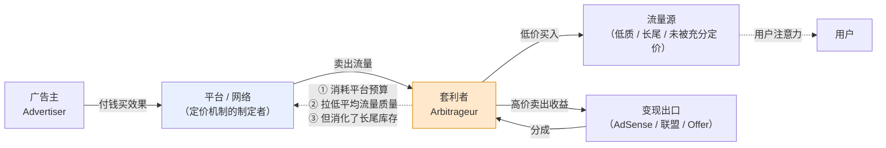

# 套利模式总览与分类

> **一句话定位**：广告套利不是"赚钱技巧"，而是**市场定价失效的暂时利用**——本文建立一套判断"某个套利空间从哪来、能活多久、谁会消灭它"的分析框架，供本目录其余 7 篇流派文档统一套用。
>
> **核心结论先行**：套利空间只来自四个因子——**市场分割、信息不对称、定价机制刚性、平台补贴**。任何一个因子被消除，对应的套利就消失。
> 因此判断一个玩法还能活多久，不需要预测平台政策，只需要问：**它依赖的是哪个因子，那个因子的消除速度有多快。**
> 更反直觉的一条：**平台无法完全消灭套利**，因为套利者在替平台做它自己不愿做的事（消化低价值流量、承担审核风险、覆盖长尾需求）。
> 平台的目标从来不是"归零"，而是把套利压到"社会可接受"的均衡水平。
>
> **⚠️ 立场声明**：本目录研究立场是**认知与防守**。本文只讲机制、经济学、生命周期与防御设计，
> 不含建站教程、不含规避审核技巧、不推荐任何作弊工具或欺诈流量源。
> 判定标准：如果一段内容能被套利方直接拿去执行，它就不该出现在这里。
>
> **可信度标签**：`[标准]` 官方明文　`[政策]` 平台公开政策（标时点）　`[惯例]` 行业共识　`[推断]` 待验证推导
>
> 最后更新：2026-09-11

---

## 1. 定义与本质

### 1.1 准确定义

**广告套利**（Ad Arbitrage / Traffic Arbitrage）
指在同一时间窗口内，**以较低价格获取流量或广告位，以较高价格卖出其产生的收益**，赚取差价的商业行为。
其收入来源不是商品或服务的价值创造，而是**同一资产在不同市场或不同定价机制下的价格差**。

三个必要构成要件（缺一即不是套利）：

| 要件 | 含义 | 缺了会变成什么 |
|---|---|---|
| **两侧同时存在** | 买入端与卖出端在同一时间窗口内闭合 | 变成单边投放（广告主）或单边变现（媒体） |
| **差价来自机制而非能力** | 利润源于定价机制差异，不是源于"我做得更好" | 变成正常经营（内容站、品牌、SaaS） |
| **不承担标的风险** | 套利者不持有商品、不服务用户、不建立长期关系 | 变成商家或服务商 |

### 1.2 与相邻概念的边界（本篇最需要讲清的一件事）

`[推断]` 中文语境里"套利"被严重滥用。严格区分：

| | **套利 Arbitrage** | **买量投放 Media Buying** | **经营 Operating** |
|---|---|---|---|
| 收入来源 | 机制差价 | 商品/服务的价值创造 | 商品/服务的价值创造 |
| 是否持有标的 | 否 | 否（但推广真实商品） | 是 |
| 利润的可持续性 | **必然衰减**（alpha decay） | 取决于产品竞争力 | 取决于品牌与复购 |
| 核心能力 | 发现差价 + 快速执行 + 风险控制 | 素材 + 定向 + 出价 | 产品 + 供应链 + 用户关系 |
| 规模上限 | 低（受差价容量限制） | 中~高 | 高 |
| 典型形态 | Native 买量→AdSense 变现、停放页、Prebid 转售 | 电商 DTC 买量、App 买量 | 品牌、SaaS、内容 IP |
| 谁在做 | 套利者（Arbitrageur） | 增长团队 / 效果营销 | 企业主 |

**判断口诀**：**利润是"来自机制"还是"来自价值"？**
- 来自机制 → 套利，会衰减，必须不断寻找新空间；
- 来自价值 → 经营，可积累，规模越大壁垒越高。

`[惯例]` 现实中三者常混在同一个账户里。一个"买量做 DTC 品牌"的团队，如果它的毛利主要来自
"用低于市场价的流量卖正常价格的商品"，那它做的是套利；如果来自"产品本身的溢价与复购"，那它做的是经营。
**很多团队以为自己在经营，实际上在套利**——判断方法是：把你的流量成本按行业中位数替换，看还剩多少利润。
剩下的才是经营利润，其余是套利利润，而套利利润会在 6~24 个月内消失。

### 1.3 套利在广告产业链里的位置



**三方视角下的套利者** `[推断]`：

| 主体 | 套利者对它是 | 为什么 |
|---|---|---|
| **广告主** | 净损失 | 付了钱买到的是低意图流量，转化率与增量都低；且抬高了整体竞价水平 |
| **平台** | 又爱又恨 | 恨它拉低流量质量与广告主 ROI；但它在**消化平台自己卖不掉的长尾库存**，且承担了内容审核的外部性 |
| **优质媒体** | 净损失 | 套利者用低价流量拉低了整个市场的 eCPM 基准，且挤占了广告主预算 |
| **用户** | 净损失 | 体验劣化（低质内容、误导性标题、高密度广告），且隐私被更激进地采集 |

`[推断]` **这个表格解释了为什么套利必然被挤压**：它在四个主体里有三个是净损失方，
只有平台一方存在矛盾态度。而平台的态度取决于"长尾库存变现收益"与"广告主流失风险"的权衡——
当广告主的抱怨超过长尾库存的价值时，平台就会收紧。**这是所有套利玩法生命周期的共同底层机制。**

---

## 2. 差价的四种来源：套利空间的分类学

> 这是本目录最重要的分析工具。任何套利玩法都可以归到这四类之一，
> 且**归类之后就能预测它的寿命**——因为四类因子的消除速度差一个数量级。

### 2.1 四类差价来源

| # | 类型 | English | 机制 | 典型流派 | **消除速度** | 谁在消除它 |
|---|---|---|---|---|---|---|
| ① | **信息差** | Information Asymmetry | 一部分人知道某个流量源/品类/地区的定价被低估 | 早期 Push 流量套利、新平台红利期 | **快（3~12 个月）** | 竞争者涌入；工具与情报服务把它商品化 |
| ② | **定价机制差** | Pricing Mechanism Gap | 两侧用不同机制定价（拍卖 vs 固定分成 vs 保量），同一资产价格不同 | Prebid 多 SSP 竞价、Waterfall 层级套利、AFD 分成 | **中（1~3 年）** | 平台改机制（如 Waterfall→Bidding、二价→一价） |
| ③ | **流量质量误判** | Quality Mispricing | 卖方无法准确度量质量，买方按平均价付费，低质流量被高价卖出 | MFA 站、部分 Native 套利、IVT 混入 | **中~慢（2~5 年）** | 第三方验证、MRC 标准、IVT 过滤技术成熟 |
| ④ | **平台补贴** | Platform Subsidy | 平台为抢占份额而主动让利（高分成、低底价、宽松审核） | 新平台早期的高 RPM、新联盟网络的高 Payout | **最快也最不可控（随时消失）** | 平台的战略转向（一次政策公告即可归零） |

### 2.2 用分类学预测寿命：一个可操作的判断法

`[推断]` 给定一个套利玩法，按以下步骤判断它还能活多久：

```
步骤 1：它依赖哪一类差价？（可能多类叠加）
步骤 2：那一类因子的消除速度是多少？（查上表）
步骤 3：现在处于该周期的哪个阶段？
        导入期 → 少数人知道，毛利高，规模小
        成长期 → 情报扩散，竞争者进入，CPC 开始上涨
        成熟期 → 毛利被压到 10%~30%，拼执行效率与规模
        衰退期 → 平台开始针对性收紧，账户封禁率上升
        死亡期 → 政策明确禁止，或价差被抹平至无利可图
步骤 4：叠加判断——是否依赖单一平台？（依赖度越高，尾部风险越大）
```

**关键洞察** `[推断]`：**④ 平台补贴型是最危险的**，因为它的消除是**离散的、无预警的**——
一次政策公告就能让毛利从 +40% 变成 −20%，且没有任何前兆指标可监控。
而 ①②③ 型的衰减是**连续的**，可以通过 CPC 上涨、RPM 下降、封号率上升等指标提前观测。

这直接推出一个风控原则：**依赖 ④ 的玩法必须用"能在一次公告中全部损失"的仓位上限来控制**，
而不是用"分散化"来控制——因为平台补贴的消失是系统性的，分散到同一个平台的多个账户毫无意义。

### 2.3 历史案例：四类差价各自的消亡过程

| 案例 | 差价类型 | 消亡过程 | 耗时 |
|---|---|---|---|
| **Waterfall 层级套利**（把高 eCPM 网络排在前面吃差价） | ② 定价机制差 | Header Bidding / Prebid 普及 → 所有需求方同时竞价 → 层级差价被抹平 | 约 5~8 年（2015~2022）`[惯例]` |
| **二价拍卖下的买方套利** | ② 定价机制差 | 主要 ADX 从二价转向一价拍卖（2018~2019）→ 买方必须改用 Bid Shading | 约 1~2 年 `[惯例]` |
| **早期 Push 通知流量套利** | ①+④ | 情报扩散 → 竞争者涌入 → CPC 上涨；同时浏览器与 OS 收紧推送权限 | 约 2~3 年 `[惯例]` |
| **展示广告 IVT 混入**（把无效流量当有效卖） | ③ 质量误判 | MRC 标准建立 + IAS/DV/HUMAN 等验证方成熟 + 买方要求 pre-bid 过滤 | 持续中，已 8 年以上仍未根除 `[惯例]` |
| **某类新平台早期高 RPM 红利** | ④ 平台补贴 | 平台达到规模目标后下调分成 | 通常 6~18 个月，**且无预警** `[惯例]` |

`[推断]` **从案例中提炼的规律**：
- ② 型（机制差）的消亡是**平台主动的、一次性的**，但通常有公开路线图，可提前准备；
- ①型（信息差）的消亡是**竞争者驱动的、渐进的**，可通过监控 CPC 与毛利趋势预警；
- ③型（质量误判）**最难根除**，因为它是猫鼠博弈，且检测方永远滞后于造假方；
- ④型（补贴）**最不可预测**，因为决策在平台内部，外部无任何信号。

---

## 3. 三种"套利"的严格区分

`10/README.md` §3 给了对照表，本文深化其**风险归属**与**能力模型**两个维度——
因为这两者决定了"一个人能不能从一种套利迁移到另一种"。

### 3.1 完整对照

| 维度 | **买方套利** | **卖方套利** | **联盟套利** |
|---|---|---|---|
| English | Buy-side / Traffic Arbitrage | Sell-side / Yield Arbitrage | Affiliate Arbitrage |
| 谁在做 | Media Buyer / 套利者 | 媒体 / Publisher / SSP 中间商 | Affiliate（买量型） |
| 我拥有什么 | 买量能力 + 落地页资产 | **流量库存**（网站、App、域名） | 买量能力 + 漏斗 |
| 买什么 | 流量 | （不买，或只买技术） | 流量 |
| 卖什么 | 展示收入 / Offer 派款 | 广告位的更高成交价 | 联盟佣金 / Offer 派款 |
| 差价来源 | 买量成本 < 变现收入 | 多 SSP 竞价 > 单一 Waterfall；或转手加价 | 买量成本 < 佣金 |
| 核心机制 | RPM/CPC 差 | 拍卖密度 / 供应链不透明 | Payout × CR 与 CPC 的差 |
| **承担的风险** | 买量成本波动、封号、素材衰减 | **被买方识别并剔除供应链（SPO）**、政策合规 | 商家扣量、Offer 下架、账期 |
| **不可控的致命变量** | 流量源涨价与封号 | 买方的供应链优化决策 | 商家单方面改条款 |
| 资金门槛 | 中~高（需垫资买量） | **低**（已有流量即可） | 中~高 |
| 技术门槛 | 中（追踪 + 数据分析） | **高**（Prebid 配置、供应链谈判） | 中 |
| 规模上限 | 中（受差价容量限制） | 高（受自有流量规模限制） | 中 |
| 毛利率量级 `[惯例]` | 10%~40% | **对媒体是纯增量收益，无"毛利率"概念** | 20%~90%（视 Offer 类型） |
| 半衰期 | 6~24 个月 | 3~8 年（随机制演进而非竞争衰减） | 12~36 个月 |
| 详见 | `信息流套利-Taboola-Outbrain.md`<br>`搜索套利与域名停放.md`<br>`AdSense套利与MFA站.md` | `Prebid与HeaderBidding套利.md` | `联盟套利漏斗.md` |

### 3.2 为什么这个区分很重要：能力不可迁移

`[推断]` **三种套利要求的能力模型几乎不重叠**，这是最常被忽略的一点：

```
买方套利的核心能力 = 素材产能 × 数据分析 × 快速试错 × 现金流管理
                    （本质是"运营效率"生意）

卖方套利的核心能力 = 供应链关系 × 技术配置 × 流量库存规模 × 合规
                    （本质是"资产 + 商务"生意）

联盟套利的核心能力 = 漏斗工程 × Offer 选择 × 与 AM 的关系 × 追踪精度
                    （本质是"信息 + 关系"生意）
```

**实践含义**：一个做惯了买方套利的人转做 Prebid 卖方套利，几乎要重新学一遍；
反之亦然。行业里"什么套利都做"的团队通常在每一类上都不够深。

### 3.3 三种套利的组合与冲突

`[推断]` 有意思的是三者可以**串成一条链**：

```
买方套利者  --买量-->  某个内容站
                          |
                     该站是卖方套利者（用 Prebid 多 SSP 竞价抬高 eCPM）
                          |
                     该站的流量又卖给了广告主
                          |
广告主发现 ROI 不达标  <--  因为流量是买方套利者买来的低意图流量
```

这条链上**每一环都在套利，且每一环都在损害最终广告主的利益**。
这就是 `../13_反作弊与流量质量/` 里"供应链透明度"（`ads.txt` / `sellers.json` / SupplyChain Object）
之所以重要的原因——它是唯一能让买方看清"我的钱经过了几手"的机制。
详见 `Prebid与HeaderBidding套利.md` §买方视角的识别。

---

## 4. 六大流派分类图谱

```mermaid
flowchart TD
    ROOT["广告套利<br/>Ad Arbitrage"]

    ROOT --> A["① 信息流套利<br/>Native Ads Arbitrage"]
    ROOT --> B["② 搜索与域名套利<br/>Search / Domain Arbitrage"]
    ROOT --> C["③ 展示套利<br/>Display / MFA Arbitrage"]
    ROOT --> D["④ 联盟套利<br/>Affiliate Arbitrage"]
    ROOT --> E["⑤ 卖方与供应链套利<br/>Sell-side / Supply Chain"]
    ROOT --> F["⑥ 新兴形态<br/>Emerging"]

    A --> A1["Taboola / Outbrain 买量<br/>→ Advertorial → AdSense / 联盟"]
    A --> A2["Push / Pop 流量<br/>→ 短漏斗 → Offer"]

    B --> B1["关键词买量 → RSOC / AFD 搜索页"]
    B --> B2["域名停放（新域名 / 过期域名）"]

    C --> C1["MFA 站（Made For AdSense）"]
    C --> C2["高密度广告位 + 低质内容"]

    D --> D1["社交买量 → Pre-lander → CPA Offer"]
    D --> D2["多 Offer 组合与流量分层"]

    E --> E1["Prebid 多 SSP 竞价抬价"]
    E --> E2["Reselling / Bid Caching / 转手加价"]

    F --> F1["CTV / 音频等新库存的定价空白"]
    F --> F2["AI 内容量产 + 展示变现"]
    F --> F3["零售媒体与站内流量的定价差"]

    style A fill:#ffe8cc
    style B fill:#ffe8cc
    style C fill:#ffd6d6
    style D fill:#ffe8cc
    style E fill:#d6e8ff
    style F fill:#e8ffd6
```



### 4.1 六大流派横向对比（本目录的导航表）

| 流派 | 买什么 | 卖什么 | 差价类型（§2） | 毛利率量级 `[惯例]` | 资金门槛 | 规模上限 | 半衰期 | 主要死因 | 详见 |
|---|---|---|---|---|---|---|---|---|---|
| **① 信息流套利** | Native 点击（Taboola/Outbrain） | 展示 RPM / 联盟佣金 / Offer 派款 | ①信息差 + ③质量误判 | 10%~40% | 中（$5k+ 垫资） | 中 | 12~24 月 | 平台审核趋严 + CPC 上涨 | `信息流套利-Taboola-Outbrain.md` |
| **② 搜索/域名套利** | 关键词点击 / 域名年费 | AFD/RSOC 搜索广告分成 | ②机制差 + ①信息差 | 20%~50% | 低~中 | **低**（关键词容量有限） | 24~48 月 | Google 政策（**同一对手方既供又买**） | `搜索套利与域名停放.md` |
| **③ 展示/MFA 套利** | 廉价流量（各类） | AdSense 类展示收入 | ③质量误判 + ④补贴 | 变化极大，可为负 | 低 | 中 | **短（政策打击重点）** | Google 明确政策禁止 | `AdSense套利与MFA站.md` |
| **④ 联盟套利** | 社交/Push/Pop/Native 点击 | CPA Offer 派款 | ①信息差 + ②机制差 | 20%~90% | 中~高 | 中（受 Cap 限制） | 12~36 月 | Offer 下架 + 扣量 + 账户封禁 | `联盟套利漏斗.md` |
| **⑤ 卖方/供应链套利** | （不买流量）技术投入 | 更高的 eCPM / 转手差价 | **②机制差为主** | 对媒体是纯增量 | 低（需已有流量） | **高** | 3~8 年 | 买方 SPO 剔除 + 透明度标准普及 | `Prebid与HeaderBidding套利.md` |
| **⑥ 新兴形态** | 视形态 | 视形态 | 多为 ④补贴 | 未知 | 未知 | 未知 | **通常很短** | 定价空白被填平 | 本文 §7 |

`[推断]` **从这张表能读出三个结论**：

1. **⑤ 卖方套利是唯一"半衰期以年计"的形态**。因为它依赖的是定价机制差（②型），
   而机制变更需要平台推动、行业采纳，速度以年计。其他五类都依赖信息差或补贴，衰减快得多。
   → **如果要在套利里选一个"可长期投入"的方向，卖方侧的 Yield 优化是唯一答案**，
     而它本质上已经不是套利，而是媒体经营的正常组成部分（见 `../12_流量变现与商业化/`）。

2. **③ MFA 是政策打击的重点且没有正当性辩护**。其他流派至少还能论证"我在消化长尾库存"，
   MFA 的价值主张是纯粹的"用低质内容套取广告分成"，所以它的寿命取决于平台的执法意愿，而不是市场竞争。

3. **② 搜索套利的结构性风险独一无二**：你的供应商、客户、裁判是**同一家公司**。
   其他流派至少面对多方博弈，有腾挪空间。这决定了它的尾部风险最高（详见该文 §防守方章节的论述）。

---

## 5. 5 问分析框架（本目录统一方法论）

> `10/README.md` §1 定义了这 5 问。本节把它变成**可执行的分析清单**，
> 其余 7 篇流派文档都必须完整回答这 5 问。

### 5.1 五问详解

| # | 问题 | 要答出什么 | 常见答错方式 |
|---|---|---|---|
| ① | **买什么流量？** | 源类型、单价区间、意图强度、可规模化程度、供给侧集中度 | 只说"买 Native 流量"，不给单价区间与意图强度判断 |
| ② | **卖什么收益？** | 变现出口、口径（RPM/EPC/Payout）、**分母定义**、结算周期 | **忽略口径**——RPM 的 PV vs session 差 1.5~2.5 倍，EPC 常是"每 100 次点击" |
| ③ | **差价从哪来？** | 归入 §2 四类之一（可多类），并说明**为什么这个差价现在还存在** | 说"因为便宜"——这是现象不是原因。必须答出机制 |
| ④ | **毛利结构？** | 通用公式代入 + 盈亏平衡反推 + 敏感性 + **现金流（垫资与账期）** | 只算毛利不算现金流。套利的第一死因是账期错配不是毛利不足 |
| ⑤ | **为什么会被消灭？** | 谁在消灭它、用什么手段、消除速度（查 §2.1 表）、当前处于生命周期哪个阶段 | 答"平台会管"——太空。要指名具体机制与可观测的前兆指标 |

### 5.2 第 ⑤ 问的前兆指标清单（最实用）

`[推断]` 一个套利玩法进入衰退期，通常会依次出现这些可观测信号：

```
阶段 1（成长末期）  CPC 上涨速度 > 变现 RPM 上涨速度  → 毛利率开始压缩
阶段 2（成熟期）    同行数量激增，情报服务开始卖"这个玩法"的课程/工具
阶段 3（衰退早期）  账户封禁率上升，且封禁理由从"违规内容"变成"账户关联/异常行为"
阶段 4（衰退期）    平台发布针对性政策公告或帮助文档更新
阶段 5（死亡期）    变现出口方（如 AdSense）开始批量停用相关站点
```

**监控建议**：把「毛利率」「封号率」「CPC 涨幅」三个指标做成周度看板。
毛利率下降是经济信号，封号率上升是政策信号，**后者通常领先前者 1~3 个月**。

### 5.3 框架的局限（诚实声明）

`[推断]` 这个框架有三个已知局限：

1. **无法预测黑天鹅**：平台的一次战略性政策转向（如某公司全面调整分成结构）不在任何前兆指标里。
2. **⑤ 问的答案有幸存者偏差**：我们只能研究"已经死掉或还活着"的玩法，
   那些从未跑通的尝试不会留下记录，所以"成功率"永远被高估。
3. **口径不统一使横向比较困难**：不同流派的 RPM/EPC/Payout 分母定义不同，
   §5.1 第 ② 问强调口径正是为此，但实践中仍常被忽略。

---

## 6. 毛利结构的横向对比

### 6.1 通用公式（详见 `套利单位经济与毛利模型.md`）

```
日毛利 = 收入侧 − 成本侧
       = UV × RPM_变现 / 1000  −  UV × CPC_买量  −  固定成本
         （展示变现口径）

盈亏平衡：RPM_变现 / 1000 = CPC_买量
        → 盈亏平衡 RPM = CPC × 1000
```

### 6.2 套利 vs 联盟的毛利率结构差异（关键对比）

| | **套利**（展示变现为主） | **联盟买量**（Offer 派款为主） |
|---|---|---|
| 毛利率量级 `[惯例]` | **10%~40%** | **60%~90%** |
| 单笔交易价值 | 极低（单次展示 $0.001~$0.05） | 高（单个转化 $5~$200） |
| 需要的流量规模 | **极大**（靠量堆收入） | 中小（靠转化率） |
| 变量敏感度 | **极高**（g 低 → 分母小 → 任何波动都被放大） | 较低 |
| 盈亏平衡的容错空间 | 窄 | 宽 |
| 现金流周转 | 快（AdSense 类月结） | 慢（联盟 50~150 天） |

`[推断]` **这个对比推出本篇第二个核心结论**：

由 09 目录已确立的敏感性解析通式 `|ΔM/M| = 0.2(1−g)/g`（g 为毛利率）：

```
联盟买量场景：g = 88.5%  →  CPC ±20% 使毛利变动 ∓2.6%（约 −3%）
套利场景：    g = 30%    →  CPC ±20% 使毛利变动 ∓46.7%
套利场景：    g = 15%    →  CPC ±20% 使毛利变动 ∓113%（直接翻负）
```

**所以：套利是"高敏感度、低容错"的生意，联盟买量是"低敏感度、高容错"的生意。**
这解释了两者完全不同的运营风格——套利者必须每天盯数据、快速止损、仓位分散；
联盟买量者可以周度迭代、承受单点失败。

**也解释了为什么"用联盟思维做套利"必死**：以为毛利率低一点没关系、可以慢慢优化——
在 g=15% 的结构下，CPC 涨 20% 就直接亏损，没有"慢慢优化"的时间窗。

### 6.3 规模上限的来源

| 流派 | 规模上限由什么决定 | 为什么不能靠加预算突破 |
|---|---|---|
| 信息流套利 | 出价能力 × 素材产能 × 账户存活率 | 加预算→抬自己的 CPC→毛利率进一步压缩 |
| 搜索套利 | **符合商业价值关键词的总量** | 关键词库存是硬约束，且放量即抬价 |
| MFA | 平台执法强度 | 规模越大越显眼，被封概率越高 |
| 联盟套利 | **Offer 的 Cap** | Cap 锁死纵向放量（09 已确立），只能横向扩 Offer |
| 卖方套利 | 自有流量规模 | 唯一"规模越大越好"的形态，因为多 SSP 竞价的收益随库存递增 |

---

## 7. 套利的生命周期与半衰期模型

### 7.1 alpha 衰减：套利的金融学类比

`[推断]` 套利与量化交易的 alpha 衰减在结构上同构：

```
套利收益 = f(差价空间, 竞争者数量, 执行效率)

差价空间随时间衰减：
  d(空间)/dt = −k × 竞争者进入速率

竞争者进入速率 ∝ 该玩法的可见利润率 × 情报扩散速度
```

**推论**：**利润率越高、越容易被讲述的玩法，衰减越快。**
这形成一个自我调节机制——高毛利会吸引竞争，竞争会消灭毛利。
所以任何"月入十万且方法简单"的套利玩法，其公开传播的那一刻就已经进入衰退期。

### 7.2 半衰期的经验量级

| 玩法类型 | 半衰期量级 `[惯例]` | 依据 |
|---|---|---|
| 单一信息差型（某流量源 + 某品类的组合红利） | **3~9 个月** | 情报扩散快，工具化程度高 |
| 漏斗工程型（靠 Pre-lander 与素材优化建立的效率优势） | **12~24 个月** | 优势可被模仿但需要时间 |
| 机制差型（Waterfall 层级、二价拍卖、Prebid 配置） | **2~8 年** | 需平台改机制 + 行业采纳 |
| 关系型（与 AM 的独家 Offer、直客关系） | **可持续，但不可规模化** | 依赖个人，无法复制 |
| 资产型（域名组合、内容站权重、邮件列表） | **不是套利，是经营** | 见 §1.2 的判断口诀 |

`[推断]` **半衰期与"可积累性"成反比**——这是本篇第三个核心结论：

```
可积累性低 ←────────────────────────────→ 可积累性高
信息差套利   漏斗工程   机制差套利   关系型   资产型
半衰期短                                        半衰期长/无
毛利波动大                                      毛利稳定
不需要长期投入                                  需要长期投入
   ↑                                              ↑
   纯套利                                      已变成经营
```

**实践含义**：成熟的从业者会用套利**产生现金流**，然后把现金流投入可积累的资产
（内容站权重、邮件列表、自有产品、品牌）。**只做套利的人会被困在"永远在找下一个玩法"的循环里**，
因为套利的半衰期决定了他必须不断重新开始。
这也是 `../09_联盟营销Affiliate/邮件营销与私域List.md` 里"列表是唯一自有资产"这个论断的套利侧对应版本。

### 7.3 新兴形态的观察（⑥ 类）

`[推断]`（**以下为方向性判断，非既成事实，均需持续观察**）

| 潜在空间 | 差价来源 | 为什么可能存在 | 为什么可能很快消失 |
|---|---|---|---|
| CTV / 音频库存 | ②机制差 + ③质量误判 | 新库存的定价体系不成熟、测量标准（可见性、归因）尚未统一 | IAB 标准与第三方验证正在快速跟进 |
| AI 量产内容 + 展示变现 | ①信息差 + ④补贴 | 内容生产成本趋近于零 | Google 的 Scaled Content Abuse 政策（2024-03）已明确打击，见 `../09_联盟营销Affiliate/Niche站与内容站变现.md` §4.3 |
| 零售媒体站内流量 | ②机制差 | 各零售媒体平台的竞价机制成熟度不一 | 头部平台快速收敛到标准化拍卖 |
| AI 搜索 / 答案引擎里的引用位 | 未知 | 全新的流量分配机制，定价空白 | 平台会直接从第一天就设计好商业化机制，不给套利留空间 |

---

## 8. 生态位分析：谁在被套利，损失了什么

`[推断]` 这一节回答"套利到底创造还是毁灭价值"，是判断其可持续性与伦理位置的基础。

| 受损方 | 损失形式 | 量级判断 | 是否可追回 |
|---|---|---|---|
| **广告主** | 为低意图流量支付高价；整体竞价水平被抬高；ROI 报表被污染 | **最大受损方** | 部分（通过 pre-bid 过滤、供应链透明度、增量实验） |
| **优质媒体** | eCPM 基准被拉低；广告主预算被分流；品牌安全事件连带 | 中~大 | 部分（通过 PMP、私有市场、质量认证） |
| **平台** | 广告主满意度下降；生态质量下降；但获得了长尾库存变现 | **净效应不确定** | 不适用（它是规则制定者） |
| **用户** | 体验劣化；隐私被更激进采集；被误导性内容欺骗 | 大但**分散且不可量化** | 基本不可 |
| **合规套利者** | 被违规套利者抬高了流量成本（劣币驱逐良币） | 中 | 否 |

**关键判断** `[推断]`：套利的**总社会效应为负**，因为它不创造价值，只是把价值从广告主与用户
转移到套利者手上，同时在转移过程中产生了额外的摩擦成本（审核、风控、验证、合规）。

但**平台不会把它压到零**，原因有三：
1. **长尾库存确实需要有人消化**——平台自己服务不了的低质流量，套利者在服务；
2. **完全消除需要付出更高的成本**——严格审核会误伤正常广告主与媒体（09 已确立"误杀代价高于漏过"）；
3. **套利者充当了机制缺陷的探测器**——他们最先发现定价失效，平台据此改进机制。

**所以均衡点不是零，而是"套利利润率被压到刚好覆盖其风险与执行成本的水平"。**
理解这一点，就能理解为什么套利的毛利率长期稳定在 10%~40% 而不会更高也不会归零。

---

## 9. 国内 vs 海外

| 维度 | 海外 | 国内 |
|---|---|---|
| **套利空间总体** | 大且形态多样 | **显著更小** |
| 买方套利（信息流） | 活跃：Taboola/Outbrain 等第三方 Native 网络提供开放买量入口 | 弱：信息流广告由平台自营闭环（巨量引擎/腾讯广告/百度信息流），**没有独立的第三方 Native 网络作为买量入口** |
| 搜索套利 | 存在：AFD/RSOC 类产品提供域名广告分成 | **几乎不存在**：无对应的域名广告分成产品，搜索广告体系封闭 |
| 域名停放 | 成熟生态（Sedo/Bodis/ParkingCrew 等） | 基本不存在；国内域名投资（米农）重**转售价值**而非停放收租 |
| MFA / 展示套利 | 存在但被政策持续打击 | 形态不同：更多是内容农场 + 平台流量分成（如某些内容平台的补贴），而非 AdSense 类展示变现 |
| 卖方套利（Prebid） | **成熟**：Header Bidding 是主流媒体标配 | **极弱**：变现集中于少数聚合平台（穿山甲/优量汇），缺乏多 SSP 竞价的开放生态 |
| 联盟套利 | 活跃：CPA 网络 + 多流量源 | 形态不同：受平台资质与版号限制，更多是信息流代投与私域导流 |
| **结构性原因** | 开放互联网 + 多方博弈 + 标准化协议（OpenRTB/Prebid） | **平台闭环 + 单边规则制定 + 缺乏跨平台标准** |
| 监管与合规 | FTC / GDPR / 平台政策 | 广告法 / 个保法 / 平台资质要求 |

`[推断]` **国内套利空间小的根本原因是"开放生态的缺失"**：

套利的前提是**存在多个独立定价的市场**，才能产生价差。
海外开放互联网有几十个 ADX、上百个 SSP、数千个媒体，定价分散 → 价差存在。
国内是少数几个超级平台各自闭环，平台内定价统一 → **价差在制度上被消除**。

这也解释了为什么国内的"流量生意"更多表现为**平台内的运营效率竞争**（谁的素材好、谁的账户权重高、
谁的达人矩阵强），而不是**跨市场的价差套利**。两者需要的能力完全不同：前者是运营能力，后者是金融式的定价嗅觉。

---

## 10. 常见误解

**❌ 误解 1：套利就是"低买高卖"，是中性甚至聪明的商业行为。**
✅ 正确：套利**不创造价值**，只是转移价值。它的四个利益相关方里有三个是净损失方（广告主、优质媒体、用户），
只有平台态度矛盾。这决定了它必然被持续挤压，也决定了它的商业模式没有护城河。见 §1.3、§8。

**❌ 误解 2：找到一个好的套利玩法就能长期赚钱。**
✅ 正确：**套利的定义性特征就是必然衰减**（§7.1 的 alpha 衰减）。利润率越高、越容易被讲述的玩法衰减越快。
任何"方法简单且月入十万"的玩法，在公开传播的那一刻已进入衰退期。

**❌ 误解 3：套利和买量投放是一回事，都是买流量赚钱。**
✅ 正确：区分标准是**利润来自机制还是来自价值**（§1.2 的判断口诀）。
实操检验法：把你的流量成本替换成行业中位数，看还剩多少利润——剩下的是经营利润，其余是会消失的套利利润。

**❌ 误解 4：毛利率低没关系，靠规模就能做起来。**
✅ 正确：**低毛利率意味着高敏感度**。由 `|ΔM/M| = 0.2(1−g)/g`，g=15% 时 CPC 涨 20% 会让毛利变动 −113%（直接翻负）。
套利没有"慢慢优化"的时间窗。见 §6.2。

**❌ 误解 5：分散到多个账户/多个玩法就能控制风险。**
✅ 正确：要看**依赖的差价类型**。若依赖 ④ 平台补贴，消失是系统性的、无预警的，
同一平台的多账户分散毫无意义。分散化的有效性取决于**不相关性**而非数量。见 §2.2。

**❌ 误解 6：平台最终会消灭所有套利。**
✅ 正确：均衡点不是零。平台需要套利者消化长尾库存、承担审核外部性、充当机制缺陷的探测器；
且完全消除的误杀成本高于容忍成本。套利毛利率长期稳定在 10%~40% 就是这个均衡的体现。见 §8。

**❌ 误解 7：三种套利可以互相迁移，都是"买流量卖收益"。**
✅ 正确：三者的能力模型几乎不重叠（§3.2）——买方套利是运营效率生意，卖方套利是资产+商务生意，
联盟套利是信息+关系生意。"什么套利都做"的团队通常在每类上都不够深。

**❌ 误解 8：搜索套利风险和其他套利差不多。**
✅ 正确：它的结构性风险独一无二——**供应商、客户、裁判是同一家公司**。
其他流派面对多方博弈有腾挪空间，搜索套利的生死完全取决于单一平台的政策选择。见 §4.1 结论 3。

**❌ 误解 9：卖方套利（Prebid）是灰色地带。**
✅ 正确：多 SSP 竞价提升 eCPM 是**媒体经营的正常组成部分**，完全正当。
灰色的是其中的**转售加价、Bid Caching、供应链不透明**等形态——必须区分"正当的 Yield 优化"
与"利用信息不对称的转手套利"。见 `Prebid与HeaderBidding套利.md`。

**❌ 误解 10：国内没有套利是因为监管严。**
✅ 正确：主因是**开放生态缺失**——平台闭环使定价在制度上统一，价差无从产生。
监管是次要因素。国内的"流量生意"因此表现为平台内运营效率竞争，而非跨市场价差套利。见 §9。

**❌ 误解 11：套利赚的是"信息差"，所以情报最重要。**
✅ 正确：信息差（①型）是**衰减最快**的一类（3~12 个月）。真正持久的是机制差（②型，2~8 年）。
所以长期玩家的核心能力不是"拿到情报"，而是"理解定价机制并预判其演变"。见 §2.1、§7.2。

---

## 11. 延伸追问

1. **给定一个具体的套利玩法，怎么用 §2 的四类差价框架判断它还能活多久？**
   → 本文 §2.2 的四步判断法可直接套用；各流派的具体应用在对应文档的「为什么会被消灭」章节
2. **套利的毛利率为什么长期稳定在 10%~40%？这个均衡是怎么形成的？**
   → 本文 §8；量化模型见 `套利单位经济与毛利模型.md`
3. **卖方套利为什么是唯一"规模越大越好"的形态？它还是套利吗？**
   → 本文 §6.3、§7.2；详见 `Prebid与HeaderBidding套利.md`
4. **如果套利的社会效应为负，为什么它不会被完全禁止？**
   → 本文 §8 的三条理由；防守方的机制设计见 `套利风险-平台封禁与合规.md`
5. **从套利转向可积累资产的具体路径是什么？**
   → 本文 §7.2 的可积累性谱系；实操见 `../09_联盟营销Affiliate/Niche站与内容站变现.md` §5（多条变现腿）
     与 `../09_联盟营销Affiliate/邮件营销与私域List.md` §9（列表的资产属性）
6. **国内的"平台内运营效率竞争"与海外套利在能力模型上有哪些可迁移的部分？**
   → 本文 §9；未展开，值得单独做一篇专题

---

## 12. 相关文档

### 本目录
- 通用毛利公式、盈亏平衡反推、风险调整回报 → [`套利单位经济与毛利模型.md`](./套利单位经济与毛利模型.md)
- ① 信息流流派 → [`信息流套利-Taboola-Outbrain.md`](./信息流套利-Taboola-Outbrain.md)
- ② 搜索与域名流派 → [`搜索套利与域名停放.md`](./搜索套利与域名停放.md)
- ③ 展示 / MFA 流派 → [`AdSense套利与MFA站.md`](./AdSense套利与MFA站.md)
- ④ 联盟流派 → [`联盟套利漏斗.md`](./联盟套利漏斗.md)
- ⑤ 卖方与供应链流派 → [`Prebid与HeaderBidding套利.md`](./Prebid与HeaderBidding套利.md)
- 风险汇总与合规 → [`套利风险-平台封禁与合规.md`](./套利风险-平台封禁与合规.md)

### 跨目录
- 拍卖机制（差价的技术根源）→ [`../03_业务逻辑与商业模式/拍卖机制与竞价理论.md`](../03_业务逻辑与商业模式/)
- 预算流转与各级抽成 → [`../03_业务逻辑与商业模式/预算流转与分成链路.md`](../03_业务逻辑与商业模式/)
- 海外流量 Tier 与地域差价 → [`../08_海外广告生态/海外流量Tier分层与地域特征.md`](../08_海外广告生态/)
- 程序化供应链与透明度标准 → [`../08_海外广告生态/程序化生态与主要玩家.md`](../08_海外广告生态/)
- 联盟体系（④ 流派的基础）→ [`../09_联盟营销Affiliate/Affiliate体系总览.md`](../09_联盟营销Affiliate/)
- 联盟买量的单位经济（对比基准）→ [`../09_联盟营销Affiliate/Affiliate单位经济与规模化.md`](../09_联盟营销Affiliate/)
- 变现出口的机制 → [`../12_流量变现与商业化/eCPM优化方法论.md`](../12_流量变现与商业化/)
- 流量质量与欺诈分类 → [`../13_反作弊与流量质量/广告欺诈全景与分类.md`](../13_反作弊与流量质量/)
- 无效流量标准 → [`../13_反作弊与流量质量/无效流量IVT-GIVT-SIVT.md`](../13_反作弊与流量质量/)
- 国内平台闭环生态 → [`../14_国内市场与生态/国内联盟与变现生态.md`](../14_国内市场与生态/)

---

> **玩法状态**：本文是框架篇，不针对单一玩法。六大流派的当前状态分别标注在各自文档结尾。
> 总体判断 `[推断]`（时点 2026-09）：**买方套利整体处于"成熟期偏后"**——
> 依据是情报服务与工具已高度商品化、主要平台的审核与风控体系成熟、毛利率被压至 10%~40% 区间；
> **卖方套利处于"成长期"**——Header Bidding 仍在向中长尾媒体扩散，供应链透明度标准仍在演进；
> **MFA 类处于"持续被打击期"**——不存在稳定状态，寿命取决于平台执法节奏。
>
> **政策时点声明**：本文涉及的平台政策（Google 对 MFA 与 Scaled Content Abuse 的态度、
> 各 Native 平台的审核政策、IAB Tech Lab 的 `ads.txt` / `sellers.json` / SupplyChain Object 标准）、
> 历史事件时间线（Waterfall→Header Bidding 的迁移、二价→一价拍卖的转向）、
> 以及所有毛利率与半衰期区间，均为 **2026-09** 时点认知，多数标注 `[惯例]` 或 `[推断]`。
> 本文**刻意不给出任何单一平台的具体分成比例、底价数值或封号率统计**——
> 这些数字变动频繁且多无一手来源，需要时请核对当期官方文档，或以自己的实测数据为准。
> 最后复核：2026-09-11
