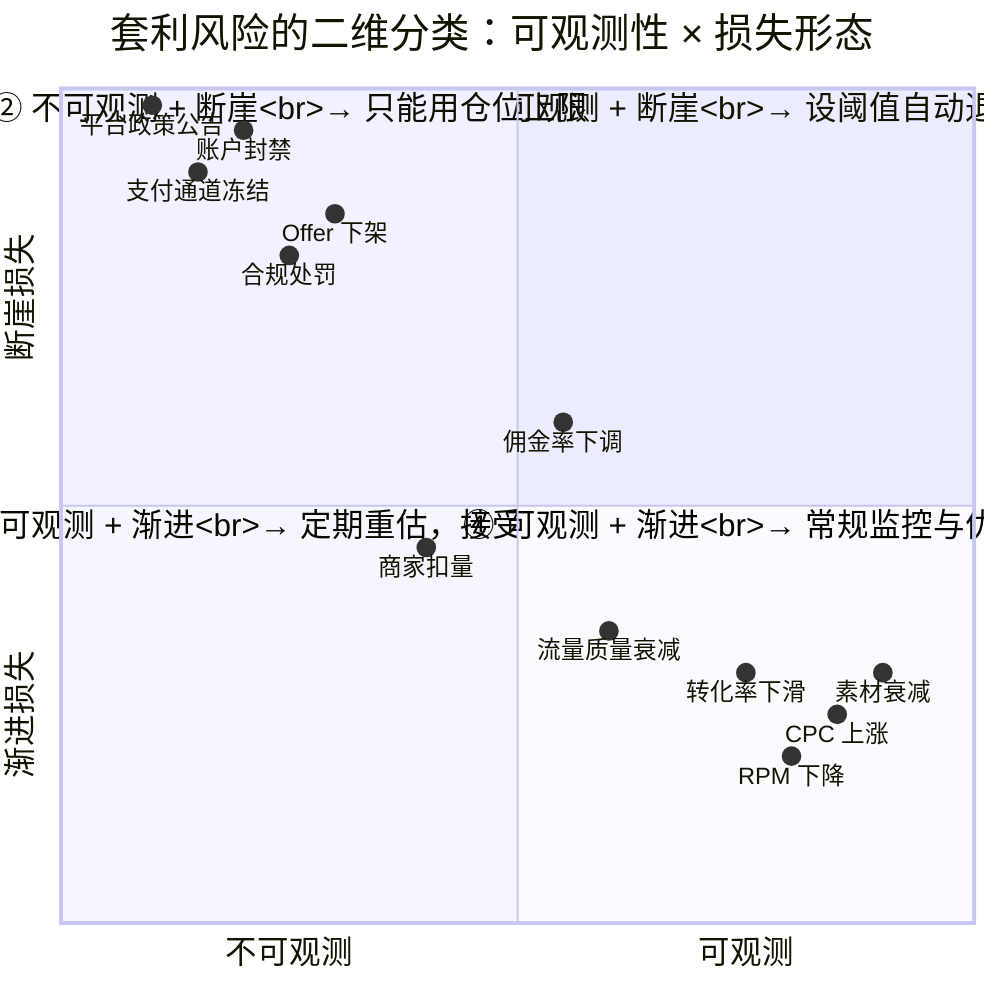
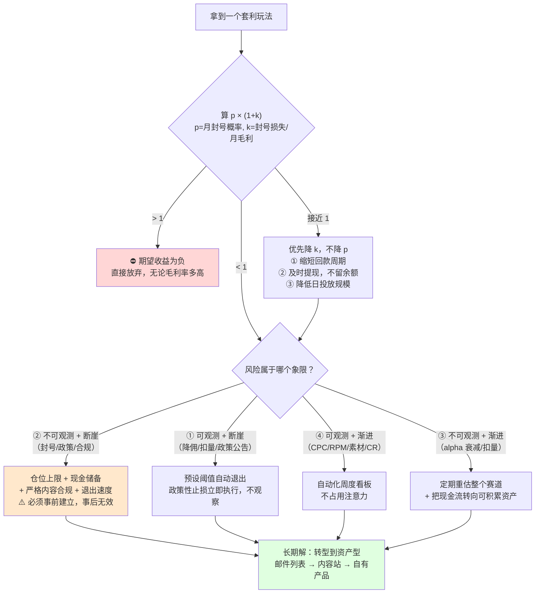

# 套利风险：平台封禁与合规

> **一句话定位**：本篇是 `10_广告套利Arbitrage` 的**风险收口**——
> 把前 7 篇分散讨论的风险汇总成一套统一的分类学、期望值模型与仓位管理纪律。
>
> **核心结论先行**：套利的风险结构与经营**根本不同**，因此不能套用经营的风险管理方法。
> 经营的风险是**渐进的、可观测的、可对冲的**；套利的核心风险是**断崖的、不可观测的、不可对冲的**。
> 由此推出本篇三条主张：
> **① 风险管理的第一动作是分类，不是缓解**——把风险分成"可监控"与"不可监控"两类，用完全不同的方法处理；
> **② 对不可监控风险，唯一有效的手段是仓位上限，不是分散化**——尤其是依赖平台补贴的玩法，
> 分散到同一平台的多个账户毫无意义；
> **③ "规避封禁"在数学上自败**——规避成本是确定的、持续的，而封号概率只能降低不能归零，
> 且规避行为本身会提高被识别为"刻意规避"的概率。
>
> **⚠️ 立场声明**：本篇讲**风险识别、量化与防御性管理**，不讲如何规避平台风控。
> "规避"与"管理"的区别是：管理是**接受风险存在并控制敞口**，规避是**试图让平台检测不到**。
> 本篇只做前者。任何"如何绕过检测"的内容都不在这里。
>
> **可信度标签**：`[标准]` 官方明文　`[政策]` 平台公开政策（标时点）　`[惯例]` 行业共识　`[推断]` 待验证推导
>
> 最后更新：2026-09-11

---

## 1. 为什么套利需要一套独立的风险框架

### 1.1 与经营的风险结构对比

| 维度 | **经营**（内容站、品牌、SaaS） | **套利** |
|---|---|---|
| 风险的时间形态 | **渐进**（流量下滑、成本上升、竞争加剧） | **断崖**（账号停用、政策公告、Offer 下架） |
| 可观测性 | 高（有前兆指标，可预警） | **核心风险无前兆** |
| 损失形态 | 收入减少，资产仍在 | **收入归零 + 资产没收 + 未结余额损失** |
| 恢复可能性 | 高（调整策略后可恢复） | **低**（账号与域名一旦被标记，很难洗白） |
| 相关性 | 风险之间相对独立 | **高度相关**（同一平台的多账户会同批处置） |
| 适用方法 | 监控 + 优化 + 对冲 | **仓位上限 + 快速退出 + 资产转移** |
| 金融学类比 | 实业投资 | **高杠杆的短期期权卖方** |

`[推断]` **最后一行的类比最值得展开**：
套利的收益结构类似"卖出期权"——**大多数时候稳定收取小额权利金（毛利），
偶尔发生一次巨额损失（封号）**。这种结构的致命特征是：
- 历史收益率看起来很好（因为损失是稀疏事件）；
- 用历史数据做的风险模型会**系统性低估尾部风险**；
- 一次尾部事件可以抹掉数年的累计收益。

**这就是为什么"我做了两年都没事"在套利领域不构成任何安全性证据。**

### 1.2 风险的二维分类学（本篇核心工具）



### 1.3 四象限的处理方法

| 象限 | 特征 | 典型风险 | **正确方法** | 常见错误 |
|---|---|---|---|---|
| **④ 可观测 + 渐进** | 有前兆、损失渐进 | CPC 上涨、RPM 下降、素材衰减、CR 下滑 | **常规监控 + 优化迭代**。周度看板，设预警线 | 忽视（因为"还在赚钱"），等到毛利转负才反应 |
| **① 可观测 + 断崖** | 有前兆但一旦发生损失大 | 佣金率下调、大规模扣量、流量源政策变更 | **设阈值自动退出**。前兆出现即降权，不等确认 | 试图"再观察一下"，错过退出窗口 |
| **② 不可观测 + 断崖** | **无前兆，一次性归零** | 账户封禁、平台政策公告、支付通道冻结、Offer 突然下架 | **只能用仓位上限**。把单次损失控制在可承受范围 | **试图用分散化解决**——对系统性风险无效 |
| **③ 不可观测 + 渐进** | 无法测量但持续侵蚀 | 行业 alpha 衰减、竞争者涌入、生态劣化 | **定期重估整体赛道**，接受不确定性 | 用战术优化掩盖战略衰退 |

`[推断]` **这个分类的实践价值**：
大多数从业者把所有精力花在象限 ④（因为那里有数据、有抓手、有优化空间），
而真正致命的是象限 ②。**象限 ④ 的错误让你少赚，象限 ② 的错误让你归零。**

所以正确的精力分配是反直觉的：
- 象限 ④ 用**自动化监控**处理（做成看板，不要占用注意力）；
- 象限 ② 用**规则化的仓位纪律**处理（提前定好上限，不临场判断）；
- 只把注意力留给象限 ①③ 的判断。

---

## 2. 平台封禁：机制与逻辑

### 2.1 封禁为什么是断崖式的

`[推断]` 平台的处置逻辑与商业合作根本不同：

| | 商业合作的终止 | **平台的封禁** |
|---|---|---|
| 触发 | 协商、通知期、过渡安排 | **单方面、即时、通常无预警** |
| 理由披露 | 明确 | **模糊**（"违反政策"，常不指明具体条款） |
| 申诉 | 有法律与商务渠道 | 有表单，**成功率低且不可预测** |
| 资产处理 | 结算已发生的款项 | **未结余额可能被扣留或没收** |
| 关联性 | 仅限该合约 | **可波及同主体/同设备/同支付/同IP 的其他账户** |

**关键机制：关联性识别（Association Detection）** `[惯例]`

平台封禁很少是单账户事件。识别维度包括：
- 主体信息（公司名、法人、税号、地址）
- 支付信息（收款账户、银行卡、PayPal/Payoneer 账号）
- 技术指纹（浏览器指纹、设备、登录 IP 与网段）
- 资产关联（域名注册信息、托管商、分析账号、广告账号 ID）
- 行为模式（投放结构、素材相似度、落地页模板）

`[推断]` **这意味着"多账户分散"对封禁风险的对冲效果远低于直觉**：
如果多个账户能被关联，一次处置会同时命中全部；
如果不能被关联，那你为此付出的隔离成本（独立主体、独立支付、独立环境）本身就是显著的毛利侵蚀。

**这是一个两难**：关联性高 → 分散无效；关联性低 → 成本高且可能被判定为"刻意规避"。

### 2.2 封禁的触发类型

| 类型 | 触发 | 可预警性 | 典型处置 |
|---|---|---|---|
| **内容违规** | 误导性宣称、禁止品类、素材违规 | 中（有明确的政策文本可对照） | 广告拒登 → 账户限制 → 停用 |
| **行为异常** | 转化率异常、点击模式异常、流量来源异常 | **低** | 直接停用 |
| **关联处置** | 其他账户被封，本账户被牵连 | **无** | 批量停用 |
| **政策变更** | 平台整体收紧某类业务 | **有公告，但公告即生效** | 存量业务被清零 |
| **支付/主体问题** | 支付争议、主体信息不实、拒付率高 | 中 | 冻结余额 |
| **投诉驱动** | 广告主或用户投诉累积 | 低 | 审查 → 停用 |
| **模型判定** | 风控模型评分超阈值 | **无** | 自动停用 |

`[推断]` **只有第一类（内容违规）是可以事前防范的**——因为政策文本是公开的，可以逐条对照。
其余六类都不同程度地不可预警。这解释了为什么"我严格遵守了平台政策却还是被封"是常见遭遇：
**遵守政策只覆盖了七类触发中的一类。**

### 2.3 未结余额：最被低估的损失项

`[惯例]` 封禁时的损失不只是"未来收入没了"，而是三笔叠加：

```
损失敞口 = ① 未结算余额（已赚但未到账）
         + ② 在途投入（已花但尚未产生回报的买量成本）
         + ③ 资产残值归零（站点、账户、域名、受众）
```

**① 的量级**：取决于结算周期。若为 Net-30 且月中被封，可能损失半个月到两个月的收入；
联盟场景的账期更长（`../09_联盟营销Affiliate/联盟角色与佣金模型.md` §6 已确立点击到收款 50~150 天），
所以**未结余额可能相当于 2~5 个月的毛利**。

**② 的量级**：买量是当天付现，转化与回款是滞后的。若在"已投放但未回款"的窗口被封，
这部分成本完全沉没。量级 ≈ 日消耗 × 平均回款天数。

**③ 最难量化但可能最大**：一个运营两年、有稳定现金流账户的商业价值，
远高于其单月毛利——但在封禁后价值归零，且**无法出售**（因为无法转移账户）。

`[推断]` **由此推出第一条仓位纪律**：
> **未结余额应被视为风险敞口，而不是收入。**
> 在计算"我能承受多大日投放规模"时，必须把
> `日消耗 × 回款天数 + 累计未结余额` 计入总敞口，
> 并确保它不超过自有资金的某个比例（建议 ≤ 30%，见 §6）。

---

## 3. 期望值数学：为什么"规避封禁"自败

### 3.1 模型

`[推断]` 设：
- `M` = 月毛利（未做任何规避时）
- `p` = 月封号概率
- `L` = 封号时的损失（未结余额 + 在途投入 + 资产残值），通常为 `k × M`，k 为月数倍数
- `c` = 规避措施的月成本（多账户、独立主体与支付、隔离环境、额外人力，占 M 的比例）
- `p'` = 采取规避后的月封号概率（`p' < p`，但 `p' > 0`）

```
不规避的期望月收益：E₀ = M × (1 − p) − p × L = M × (1 − p) − p × k × M
                     = M × [1 − p(1 + k)]

规避的期望月收益：  E₁ = M × (1 − c) × (1 − p') − p' × k × M × (1 − c)
                     = M × (1 − c) × [1 − p'(1 + k)]
```

**规避有利的条件**：`E₁ > E₀`
```
(1 − c) × [1 − p'(1+k)] > 1 − p(1+k)
```

### 3.2 数值代入

`[推断]` 取套利场景的典型量级：`k = 3`（封号损失约 3 个月毛利）、`p = 15%/月`

```
不规避：E₀/M = 1 − 0.15 × (1+3) = 1 − 0.60 = 0.40

规避方案 A（c = 10%，p' = 8%）：
  E₁/M = 0.90 × [1 − 0.08 × 4] = 0.90 × 0.68 = 0.612   ✅ 优于不规避

规避方案 B（c = 25%，p' = 10%）：
  E₁/M = 0.75 × [1 − 0.10 × 4] = 0.75 × 0.60 = 0.45    ⚠️ 略优，但已接近打平

规避方案 C（c = 40%，p' = 12%）：
  E₁/M = 0.60 × [1 − 0.12 × 4] = 0.60 × 0.52 = 0.312   ❌ 劣于不规避
```

### 3.3 三个反直觉结论

`[推断]`

**结论一：规避是否划算，取决于"规避成本 c"与"概率降幅 (p−p')/p"的比值，而不是概率降幅本身。**
把封号概率从 15% 降到 8%（降 47%）听起来很多，但如果为此付出 25% 的毛利，收益极其有限（方案 B）。

**结论二：k 越大，规避越有价值；k 越小，规避越不值得。**
因为规避的价值来自"避免那次巨额损失"。如果你的未结余额很小（回款快、仓位轻），
那封号的损失也小，规避就不划算。
→ **所以"缩短回款周期、降低未结余额"比"规避封禁"更有效**：它直接降低 k，且成本远低于规避。

**结论三：当 p 无法降到足够低时，最优解可能是"不做"。**
若某玩法的 `p(1+k) > 1`，则 `E₀ < 0`——**期望收益为负**，无论怎么优化都是亏的。
以 k=3 为例，只要月封号概率 > 25%，这个玩法的期望值就是负的。
→ **这是判断"某个玩法还能不能做"的硬标准**，比看毛利率可靠得多。

### 3.4 与 09 目录结论的一致性

`../09_联盟营销Affiliate/Affiliate单位经济与规模化.md` §5.4 从联盟视角得出过同构结论：
**规避封禁在数学上自败**，因为它把"低概率、可分散"的风险换成了"高概率、100% 没收"的确定成本。

本篇的增量是给出了**可计算的判据**：
```
① 算出 k（封号损失 = 几个月毛利）
② 估计 p（月封号概率）
③ 若 p × (1+k) > 1 → 期望为负，不做
④ 若接近 1 → 优先降 k（缩短回款、降低未结余额），而不是降 p
⑤ 只有当 c 小且 p 降幅大时，规避才划算
```

`[推断]` **第 ④ 条是最重要的实操建议**：大多数人本能地去降低 p（因为"被封"很可怕），
但降低 k 的成本远低于降低 p，且效果同样直接。
具体做法：选回款快的出口、控制日投放规模、不把所有余额留在单一平台、及时提现。

---

## 4. 合规风险

### 4.1 三类合规风险

| 类别 | 具体风险 | 主要法规/主体 | 严重度 |
|---|---|---|---|
| **消费者保护** | 虚假宣称、误导性标题、未披露的商业关系、假评价、假倒计时 | FTC（美国，含 16 CFR Part 255 Endorsement Guides）、各国消费者保护法 | **高**（可达民事与行政责任） |
| **隐私与数据** | 未经同意写入追踪 Cookie、设备指纹、跨境数据传输、缺乏隐私政策 | GDPR / ePrivacy（欧盟）、CCPA-CPRA（加州）、各州法、个保法（中国） | **高**（GDPR 罚款上限为全球营收 4%） |
| **平台条款** | 违反广告平台政策、联盟网络条款、变现平台计划政策 | 各平台合约 | 中（后果是商业性的：封号、扣款） |

### 4.2 合规风险与平台风险的本质区别

`[推断]` **这是本篇最需要强调的一点**：

| | 平台封禁 | **合规处罚** |
|---|---|---|
| 责任主体 | 账户（可弃） | **个人/法人（不可弃）** |
| 追溯期 | 通常即时 | **可达数年** |
| 地理范围 | 单一平台 | 跨平台、跨司法辖区 |
| 是否可"重新开始" | 可以（新账户） | **困难**（记录跟随主体） |
| 损失量级 | 未结余额 + 资产 | 罚款 + 法律费用 + 业务禁止 |

**所以合规风险的性质完全不同**：它是**跟随主体的、不可通过弃号规避的、有长追溯期的**。
一个把"封号"当作可接受成本的人，可能同时把"FTC 调查"也当作可接受成本——这是严重的误判。

### 4.3 套利场景的高发合规问题

| 问题 | 场景 | 为什么高发 |
|---|---|---|
| **未披露联盟关系** | 内容型落地页推荐商品但不放 disclosure | 披露会降低转化率，有隐匿动机 |
| **误导性宣称** | 健康、金融、副业类 Offer 的收益/效果承诺 | 这些品类转化率对宣称强度极敏感 |
| **假评价/假体验** | 声称"实测"但未使用产品 | 内容成本压力 |
| **虚假紧迫感** | 假倒计时、假库存、假"仅剩 2 件" | 直接提升转化率 |
| **未经同意的追踪** | 落地页在无 CMP 的情况下写 Cookie | 技术实现省事 |
| **禁止品类投放** | 部分品类在特定地区违法或需资质 | 高派款诱惑 |

`[政策]` 详见 `../09_联盟营销Affiliate/落地页与转化漏斗设计.md` §8（FTC 披露义务与合规红线专章）
与 `../08_海外广告生态/海外隐私法规-GDPR-CCPA-TCF.md`（待建）。
> 政策时点：2026-09。FTC 近年持续加强对虚假评价与 AI 生成内容的执法，需核当期指引。

`[推断]` **一个结构性观察**：套利场景的合规问题**不是偶发的疏忽，而是内生的激励冲突**——
每一条合规要求（披露、真实宣称、同意）都会**降低转化率**，而套利的毛利率本来就只有 10%~40%。
所以合规成本对套利的挤压远大于对经营的挤压。
这解释了为什么灰色玩法与合规违规高度伴生：**不是从业者道德水平低，是经济结构决定的。**

---

## 5. 流量源与变现出口的风险

### 5.1 流量源侧

| 风险 | 机制 | 可观测性 | 应对 |
|---|---|---|---|
| **CPC 上涨** | 竞争加剧、平台调价、自己放量抬价 | **高** | 常规监控（象限 ④） |
| **质量下滑** | 平台为填充率引入更低质流量 | 中（需按 Sub ID 分组看 CR） | 分组对账 |
| **政策变更** | 禁止某类落地页/品类/定向 | 有公告但即时生效 | 关注平台公告（象限 ①） |
| **账户处置** | 见 §2 | **无** | 仓位上限（象限 ②） |
| **扣量** | 流量源少报点击/转化 | 低（`../09_联盟营销Affiliate/联盟反作弊与扣量.md` §3.3 已论证不可证明） | 多源交叉对比 |
| **供应中断** | 平台退出某市场、关停某产品 | 有公告 | 多源备份 |

### 5.2 变现出口侧

| 风险 | 机制 | 可观测性 | 应对 |
|---|---|---|---|
| **佣金/派款下调** | 商家或网络单方面调整 | 有通知但通常提前期短 | 多 Offer 分散 |
| **Offer 下架** | 广告主停止投放 | **常无预警** | 不重仓单一 Offer |
| **Cap 收紧** | 降低计酬上限 | 有时不告知 | 监控有效 EPC 而非名义 Payout |
| **审核标准收紧** | Approval Rate 下降 | 中（可监控趋势） | 象限 ① 阈值退出 |
| **账号停用** | 变现平台判定违规 | **无** | 仓位上限 + 及时提现 |
| **分成政策变更** | 平台调整 Take Rate | 有公告 | 多平台分散 |
| **MFA 类专项打击** | 见 `AdSense套利与MFA站.md` §4 | 中（有政策文本） | 不依赖单一变现出口 |

`[推断]` **一个重要的对称性**：
套利者同时面对**买方侧（流量源）**和**卖方侧（变现出口）**的双重断崖风险，
且两侧的风险**高度相关**——因为大平台的政策转向往往同时影响两侧
（例如某公司收紧内容政策，既影响买量账户也影响变现账号）。

**所以"流量源分散 + 变现出口分散"如果都集中在同一家大平台上，等于没有分散。**
这是 §6 要展开的核心。

---

## 6. 分散化：正确做法与真实代价

### 6.1 分散化的有效性取决于"不相关性"

`../09_联盟营销Affiliate/Affiliate单位经济与规模化.md` §10.2 已确立：
**真正的分散是不相关性，而不是数量。** 本篇把它推广到套利的全部风险维度：

| 分散维度 | 表面做法 | **有效做法** | 无效的原因 |
|---|---|---|---|
| Offer | 同一网络接 5 个 Offer | **跨网络、跨品类、跨广告主** | 同一网络的处置会同时命中；同一品类的政策变化会同时命中 |
| 流量源 | 同一平台开 5 个账户 | **跨平台、跨机制（付费+自然+自有列表）** | 关联性识别会批量处置（§2.1） |
| 变现出口 | 同时用 3 个广告网络 | **跨体系（展示 + 联盟 + 自营产品 + 邮件）** | 三大广告平台的政策转向会同时影响多数网络 |
| 地区 | 投放 5 个国家 | **跨 Tier、跨合规辖区** | 同一 Tier 的 eCPM 与竞争同向波动 |
| 主体 | 注册 3 个公司 | **业务模式本身的多元化** | 主体分散只解决关联性问题，不解决系统性风险 |
| 品类 | 做 5 个垂直 | **跨周期属性（消费刚需 vs 可选 vs B2B）** | 同一宏观冲击下同向波动 |

### 6.2 系统性风险无法通过分散化对冲

`[推断]` **这是本篇第二个核心结论**：

套利依赖的四类差价（`套利模式总览与分类.md` §2）中，
**④ 平台补贴型的消失是系统性的**——一次政策公告就能让整个品类归零。

```
可分散的风险（特异风险）        不可分散的风险（系统风险）
────────────────────           ────────────────────
单个 Offer 下架                 平台整体政策转向
单个账户被封                    某类业务被全面禁止
单个流量源涨价                  买量成本全行业上涨
单个商家扣量                    隐私法规导致追踪能力整体失效
                               AI 导致内容成本归零 → 竞争者无限涌入
```

**对系统风险的唯一有效手段是仓位上限与退出速度**，不是分散化。

具体纪律 `[推断]`：
1. **单一平台依赖度上限**：任何一个平台（流量源或变现出口）占总收入不超过 **40%~50%**；
2. **单一玩法的仓位上限**：任何一个玩法的投入不超过自有资金的 **30%**；
3. **退出预案**：对每个玩法预先写好"如果 X 发生，我在 Y 天内退出"，X 必须是可观测的触发条件；
4. **现金储备**：保留 **3~6 个月**的运营现金，不投入任何玩法——这不是保守，是系统风险的唯一对冲。

### 6.3 分散化的真实代价（诚实声明）

`[推断]` 分散化不是免费的，代价有三：

| 代价 | 机制 | 量级 |
|---|---|---|
| **注意力稀释** | 每个玩法都需要监控与优化，人的注意力是硬约束 | 通常 3~5 个玩法是单人上限 `[惯例]` |
| **无法在任何单点做到极致** | 深度优化需要专注；分散意味着每个都做到 70 分 | 可能损失 20%~40% 的单点毛利 `[推断]` |
| **规模经济丧失** | 工具、人力、数据无法复用 | 中小规模下显著 |

**所以存在一个最优分散度**：太少 → 尾部风险不可承受；太多 → 每个都做不深。
`[推断]` 经验上 **3~5 个低相关玩法** 是单人/小团队的合理区间，
超过这个数量应该靠**团队扩张**而不是**个人分散**。

---

## 7. 仓位管理与止损纪律

### 7.1 为什么套利需要"仓位"概念

`[推断]` 经营的语言是"预算"，套利的语言应该是"**仓位**"——
因为它更像投资（承担风险换取收益）而不是经营（组织生产创造价值）。

用仓位语言能立刻得到三条经营语言得不到的纪律：

| 纪律 | 内容 |
|---|---|
| **单一仓位上限** | 任何单一玩法的投入 ≤ 总资金 × 30% |
| **总仓位上限** | 所有玩法的总投入 ≤ 总资金 × 70%（留 30% 现金应对系统风险） |
| **止损线** | 预设的退出条件，**触发即执行，不临场判断** |

### 7.2 止损线的设定方法

`[推断]` 止损线必须是**可观测、可量化、预设**的，否则在压力下一定会被"再等等"击穿。

| 类型 | 触发条件示例 | 动作 |
|---|---|---|
| **经济性止损** | 连续 7 天毛利率 < 5% | 降仓 50% |
| **趋势性止损** | CPC 连续 14 天上涨且涨幅 > 30%，同时 RPM 未同步上涨 | 暂停并重新评估 |
| **政策性止损** | 平台发布针对性政策公告 | **立即降仓至 20%，不等影响显现** |
| **处置性止损** | 任一账户被限制或警告 | 全部关联账户降仓 50%，提现未结余额 |
| **质量性止损** | Approval Rate 连续下滑且跌破 60% | 停止该 Offer |
| **时间性止损** | 某玩法运行超过预设周期仍未达盈亏平衡 | 关停，不追加投入 |

`[推断]` **"政策性止损要立即执行"是最反直觉但最重要的一条**：
因为政策公告的影响通常有滞后（几天到几周才完全显现），
人的本能是"先看看实际影响多大"——但等到影响显现时，退出通道已经拥挤（所有人同时在退，
流量价格与变现能力同时恶化）。**先退出的人拿到最好的价格。**

### 7.3 提现纪律

`[惯例]`/`[推断]` 由 §2.3 的未结余额风险直接推出：

1. **能提现就提现**，不要在平台里留余额（余额不是现金，是信用敞口）；
2. 关注每个平台的**最低提现额与提现周期**，把它们纳入现金流规划；
3. 对回款慢的出口（联盟 50~150 天）**降低仓位**，而不是"接受账期"；
4. 把 `未结余额 / 月毛利` 作为一个常看指标——它就是你当前的 k 值（§3）。

---

## 8. 风险矩阵总表

> 汇总表，象限编号见 §1.2。概率与影响为**主观量级评估**，标 `[推断]`，用于排优先级而非精确计算。

| # | 风险 | 象限 | 概率 | 影响 | 可缓解性 | 主要缓解手段 | 详见 |
|---|---|---|---|---|---|---|---|
| 1 | 账户封禁（流量源） | ② | 中~高 | **极高** | 低 | 仓位上限 + 及时提现 + 内容合规 | §2、§3 |
| 2 | 变现账号停用 | ② | 中 | **极高** | 低 | 多出口分散 + 及时提现 | §5.2 |
| 3 | 平台政策转向 | ② | 低~中（但影响全局） | **极高** | **无** | 仓位上限 + 现金储备 + 退出速度 | §6.2 |
| 4 | Offer 突然下架 | ② | 高 | 中~高 | 中 | 多 Offer + 不重仓 | §5.2 |
| 5 | 支付通道冻结 | ② | 低 | **高** | 中 | 多通道 + 多主体 + 及时结汇 | §9 |
| 6 | 合规处罚（FTC/GDPR） | ② | 低~中 | **极高且跟随主体** | 中 | 严格合规（唯一有效手段） | §4 |
| 7 | 未结余额损失 | ①② | 中 | 高 | **高** | 缩短回款 + 及时提现（降低 k） | §2.3、§7.3 |
| 8 | 佣金/派款下调 | ① | **高** | 中 | 中 | 多商家 + 直客关系 | §5.2 |
| 9 | 扣量 | ③ | 中 | 中 | **低**（不可证明） | 多网络横向对比 + 唯一码 | `../09_.../联盟反作弊与扣量.md` §3 |
| 10 | CPC 上涨 | ④ | **高** | 中 | 高 | 常规监控 + 多源 + 提升转化率 | §5.1 |
| 11 | RPM/eCPM 下降 | ④ | 高 | 中 | 高 | 多出口 + 优化 Ad Load 与位置 | §5.1 |
| 12 | 素材衰减 | ④ | **必然** | 中 | 高 | 素材产能建设（半衰期 7~21 天） | `../09_.../Affiliate单位经济与规模化.md` §3.5 |
| 13 | 转化率下滑 | ④ | 高 | 中 | 高 | A/B 测试 + 落地页迭代 | `../09_.../落地页与转化漏斗设计.md` |
| 14 | 流量质量衰减 | ④ | 中 | 中 | 中 | 分组对账 + 换源 | §5.1 |
| 15 | 行业 alpha 衰减 | ③ | **必然** | 高 | **低** | 定期重估赛道 + 转向可积累资产 | §10 |
| 16 | 现金流断裂 | ①② | 中 | **极高** | **高** | 垫资测算 + 现金储备 + 控制日投放规模 | `../09_.../Affiliate单位经济与规模化.md` §4 |
| 17 | 关键人依赖 | ③ | 中 | 高 | 中 | SOP 化 + 职能分工 | `../09_.../Affiliate单位经济与规模化.md` §9 |
| 18 | 汇率波动 | ④ | 中 | 低~中 | 高 | 多币种 + 及时结汇 | §9 |

### 8.1 按"不可缓解性"排序的行动优先级



`[推断]` 把 §8 的表按「可缓解性低 + 影响极高」筛出来，就是必须优先处理的：

```
第 1 优先：#3 平台政策转向、#6 合规处罚、#1/#2 账号处置
           → 手段只有：仓位上限 + 现金储备 + 严格合规 + 退出速度
           → 这些手段必须【事前】建立，事后无效

第 2 优先：#16 现金流断裂、#7 未结余额损失
           → 手段：垫资测算 + 及时提现 + 缩短回款周期
           → 这是"降低 k"，性价比最高（§3.3 结论二）

第 3 优先：#15 行业 alpha 衰减
           → 手段：把套利现金流投入可积累资产（内容站权重、邮件列表、自有产品）
           → 这是唯一的长期解，见 §10

其余（象限 ④）：用自动化监控处理，不占用注意力
```

---

## 9. 资金、支付与税务风险

`[惯例]`/`[推断]`（**非财务或税务建议，需咨询专业人士**）

| 风险 | 机制 | 应对方向 |
|---|---|---|
| **支付通道冻结** | 高风险行业被支付服务商列为受限类目；争议率过高触发风控 | 多通道、控制争议率、如实申报业务性质 |
| **跨境收款合规** | 个人持续收取境外大额佣金的申报与结汇问题 | 主体规划（个体/公司/境外主体）、专业咨询 |
| **税务身份** | 美国来源收入的预扣（W-8BEN）、欧盟 VAT、境内个税与增值税 | 见 `../09_联盟营销Affiliate/联盟角色与佣金模型.md` §6.4 |
| **汇率波动** | 收入为外币、成本部分为本币 | 及时结汇、自然对冲（成本也用同币种） |
| **多主体的合规成本** | 为分散风险设立多主体，带来记账、报税、审计成本 | 权衡：主体分散只解决关联性问题，不解决系统风险（§6.1） |

`[推断]` **一个容易被忽略的点**：为规避平台关联性而设立的多主体结构，
会**显著增加合规与税务复杂度**，且这种复杂度本身是一种风险
（申报不一致、资金流不清晰、主体间交易定价问题）。
所以"多主体"不是免费的分散化手段，它的成本要计入 §3 模型里的 `c`。

---

## 10. 退出与转型：唯一的长期解

### 10.1 为什么必须有退出计划

`[推断]` 由 §1.1 的类比（卖出期权的收益结构）与 §8.1 的第 3 优先（alpha 必然衰减）可推出：

**套利的长期期望收益率必然趋于零。**
因为：
- 差价来自市场定价失效；
- 定价失效会被套利行为本身修复（`套利模式总览与分类.md` §7.1 的 alpha 衰减）；
- 所以任何单一套利玩法的寿命是有限的（6~48 个月）。

**因此，只做套利的人被 structurally 困在"永远在找下一个玩法"的循环里。**
唯一的出路是把套利产生的现金流**转移到可积累的资产**上。

### 10.2 可积累性谱系（复用总览篇 §7.2）

```
可积累性低 ←──────────────────────────────→ 可积累性高
信息差套利   漏斗工程   机制差套利   关系型   资产型
半衰期短                                       半衰期长/无
   ↑                                             ↑
   纯套利                                    已变成经营
```

### 10.3 四条转型路径

| 路径 | 机制 | 门槛 | 适合谁 |
|---|---|---|---|
| **① 内容资产** | 用套利现金流养内容站，建立 SEO 权重与品牌搜索 | 中（需 12~24 个月与内容能力） | 有耐心、能做内容的 |
| **② 邮件列表** | 把买来的流量转化为订阅者，形成不依赖平台的自有资产 | 低~中 | 所有买量型玩家（**优先级最高**） |
| **③ 自有产品** | 从推广别人的商品转为卖自己的（数字产品先行） | 中（需产品能力） | 有品类洞察的 |
| **④ 服务/工具** | 把自己的方法论产品化卖给同行（"卖水人"） | 高（需工程与销售能力） | 有独特方法论的 |

`[推断]` **路径 ② 是性价比最高的第一站**，理由已在
`../09_联盟营销Affiliate/邮件营销与私域List.md` §1 与 `联盟追踪技术与Postback.md` §9 论证：
邮件列表是**唯一完全不依赖平台归因链路与流量分配的自有资产**，
且它的建设可以直接复用买量流量（不需要额外的流量成本）。

**具体机制**：买量 → 落地页 → 用 Lead Magnet 换订阅 → 既推 Offer（当期收入）又积累列表（长期资产）。
同一份流量成本产生两份回报，且第二份的边际成本接近零。

### 10.4 退出的时机判断

| 信号 | 含义 |
|---|---|
| 连续 3 个月毛利率下滑且无单一可归因原因 | 行业 alpha 衰减（象限 ③），不是战术问题 |
| 头部玩家开始公开售卖"这个玩法"的课程 | 信息差已完全商品化，处于衰退期末段 |
| 封号率上升且理由从"内容违规"变成"账户异常" | 平台已进入针对性执法阶段 |
| 新进入者的盈亏平衡点已高于当前实际毛利 | 该玩法的经济空间已被压缩至极限 |
| 你发现自己 80% 的精力在应对风险而非创造价值 | **最主观但最准确的信号** |

---

## 11. 国内 vs 海外

| 维度 | 海外 | 国内 |
|---|---|---|
| **主要风险类型** | 平台封禁 + 合规处罚（FTC/GDPR）+ 供应链变动 | **平台规则单边变更** + 广告法/个保法 + 资质与版号 |
| 封禁的可预警性 | 低（模型判定为主） | 低（平台内规则不透明） |
| 申诉渠道 | 表单 + 商务渠道（大账户有 AM） | 平台申诉（成功率低）+ 监管投诉 |
| 合规主体 | FTC / 各州 / EU 监管，**罚款量级高且跟随主体** | 市场监管部门，广告法罚款 + 平台处置 |
| 未结余额风险 | 中（结算体系相对规范） | 中（平台内结算，规则可单方调整） |
| 分散化的可行性 | **较高**（多平台、多网络、多变现出口） | **低**（少数平台垄断，无处可分散） |
| 系统性风险的来源 | 少数大平台的政策转向 | 少数大平台的规则调整 + 监管政策 |
| 转型路径的可用性 | 内容站、邮件列表、自有产品、SaaS 均可行 | 邮件列表不可用；内容站受平台生态挤压；主要在平台内转型（做账号、做私域、做品牌） |
| 跨境场景特有风险 | — | 收款与结汇合规、境外主体与账户的合规性、数据出境 |

`[推断]` **国内套利风险管理更难，根本原因是"分散化不可用"**：
海外至少有多个独立的平台、网络、变现出口可以分散；
国内的流量与变现高度集中于少数平台，**无法通过分散来对冲系统性风险**，
只能靠仓位控制与业务模式转型。

这也解释了为什么国内的"流量生意"更倾向于**在平台内建立位置**（账号权重、达人矩阵、私域），
而不是做跨平台套利——前者虽然也依赖平台，但至少积累了一些平台内资产。

---

## 12. 常见误解

**❌ 误解 1：我做了两年都没被封，说明我的方法安全。**
✅ 正确：套利的收益结构类似**卖出期权**——大多数时候稳定收小额权利金，偶尔一次巨额损失。
历史无事故**不构成任何安全性证据**，反而可能让你低估尾部风险（§1.1）。

**❌ 误解 2：多开几个账户就能分散封号风险。**
✅ 正确：要看**关联性**。若账户能被关联（主体/支付/指纹/资产），一次处置批量命中；
若不能关联，隔离成本本身就侵蚀毛利，且可能被判定为刻意规避。这是一个两难（§2.1）。

**❌ 误解 3：严格遵守平台政策就不会被封。**
✅ 正确：政策合规只覆盖 §2.2 七类触发中的**一类**（内容违规）。
其余六类（行为异常、关联处置、政策变更、支付问题、投诉驱动、模型判定）都不同程度不可预警。

**❌ 误解 4：封号的损失就是那个月的收入。**
✅ 正确：损失是三笔叠加——未结余额（可能相当于 2~5 个月毛利）+ 在途投入 + 资产残值归零。
且**资产无法出售**（不能转移账户）。这才是 §3 模型里的 k（§2.3）。

**❌ 误解 5：应该优先想办法降低封号概率。**
✅ 正确：**优先降低 k（封号损失）而不是 p（封号概率）**。
缩短回款周期、及时提现、控制未结余额的成本远低于规避措施，且效果同样直接（§3.3 结论二、§3.4）。

**❌ 误解 6：毛利率高就值得做。**
✅ 正确：要算**期望值**。若 `p × (1+k) > 1`，期望收益为负，无论毛利率多高都是亏的。
以 k=3 为例，月封号概率超过 25% 就该直接放弃（§3.3 结论三）。

**❌ 误解 7：分散到 5 个 Offer 就安全了。**
✅ 正确：分散的有效性取决于**不相关性**。同一网络的 5 个 Offer、同一平台的 5 个账户、
同一品类的 5 个垂直，在系统性冲击下会同时失效（§6.1、§6.2）。

**❌ 误解 8：合规风险和商业风险一样，大不了换个号。**
✅ 正确：**性质完全不同**。合规处罚跟随主体、有数年追溯期、跨平台跨辖区、无法通过弃号规避。
把"封号可接受"的心态迁移到合规上是严重误判（§4.2）。

**❌ 误解 9：套利里的合规违规是少数人的道德问题。**
✅ 正确：是**内生的激励冲突**——每条合规要求（披露、真实宣称、同意）都降低转化率，
而套利毛利率本就只有 10%~40%。灰色玩法与合规违规高度伴生是经济结构决定的（§4.3）。

**❌ 误解 10：政策公告后可以"先观察实际影响再决定"。**
✅ 正确：**政策性止损要立即执行**。影响有滞后，但等到显现时退出通道已拥挤
（所有人同时退出，流量价格与变现能力同时恶化）。先退出的人拿到最好的价格（§7.2）。

**❌ 误解 11：分散化越多越安全。**
✅ 正确：分散有真实代价——注意力稀释、无法在单点做到极致、规模经济丧失。
单人/小团队的合理区间是 **3~5 个低相关玩法**，超过应靠团队扩张而非个人分散（§6.3）。

**❌ 误解 12：只要一直能找到新玩法，套利就能长期做下去。**
✅ 正确：套利的长期期望收益率**必然趋于零**，因为套利行为本身会修复定价失效（alpha 衰减）。
唯一出路是把现金流转移到可积累资产——其中**邮件列表是性价比最高的第一站**（§10）。

---

## 13. 延伸追问

1. **怎么给一个具体玩法估算 p（月封号概率）？有没有可参考的基准？**
   → 没有公开统计。可行方法是同行访谈 + 自己的历史数据 + 用小仓位实测（§3 的模型需要这个输入）
2. **k 值怎么精确计算？各出口的未结余额口径不同怎么处理？**
   → §2.3 给了三项构成；具体测算方法见 `../09_联盟营销Affiliate/Affiliate单位经济与规模化.md` §4
3. **如果 p×(1+k) > 1，有没有办法把它降到 1 以下？**
   → 三条路：降 k（缩短回款、及时提现）、降 p（严格内容合规，这是唯一有效且低成本的手段）、
     提高 M 的可持续性（转向可积累资产）。§3.3、§7.3、§10
4. **平台的风控模型具体怎么工作？能不能预判？**
   → 不可预判，属平台内部机制。**本篇不提供任何规避检测的内容**（立场声明）
5. **转型到邮件列表的具体路径与算例？**
   → `../09_联盟营销Affiliate/邮件营销与私域List.md` §8（列表经济学算例）
6. **系统性风险（平台政策转向）真的完全无法对冲吗？**
   → 金融意义上的对冲不可行（没有对应的衍生品）。可行的替代是**跨体系的资产结构**——
     把收入来源分布在"平台依赖度不同"的资产上（§10.2 的可积累性谱系）

---

## 14. 相关文档

### 本目录
- 四类差价与生命周期模型（风险的时间维度）→ [`套利模式总览与分类.md`](./套利模式总览与分类.md) §2、§7
- 风险调整后的回报与仓位模型 → [`套利单位经济与毛利模型.md`](./套利单位经济与毛利模型.md)
- 买方套利的具体风险 → [`信息流套利-Taboola-Outbrain.md`](./信息流套利-Taboola-Outbrain.md)、[`搜索套利与域名停放.md`](./搜索套利与域名停放.md)
- MFA 的二元风险与声誉成本 → [`AdSense套利与MFA站.md`](./AdSense套利与MFA站.md) §6.2、§12
- 供应链侧的风险 → [`Prebid与HeaderBidding套利.md`](./Prebid与HeaderBidding套利.md) §8、§10
- 联盟套利的 Offer 与扣量风险 → [`联盟套利漏斗.md`](./联盟套利漏斗.md)

### 跨目录
- 规模化路径与风险矩阵 → [`../09_联盟营销Affiliate/Affiliate单位经济与规模化.md`](../09_联盟营销Affiliate/) §10
- 扣量的不可证明性 → [`../09_联盟营销Affiliate/联盟反作弊与扣量.md`](../09_联盟营销Affiliate/) §3.3
- 结算周期与未结余额 → [`../09_联盟营销Affiliate/联盟角色与佣金模型.md`](../09_联盟营销Affiliate/) §6
- 合规红线（FTC / 披露 / 虚假宣称）→ [`../09_联盟营销Affiliate/落地页与转化漏斗设计.md`](../09_联盟营销Affiliate/) §8
- 转型路径：邮件列表 → [`../09_联盟营销Affiliate/邮件营销与私域List.md`](../09_联盟营销Affiliate/)
- 转型路径：内容资产 → [`../09_联盟营销Affiliate/Niche站与内容站变现.md`](../09_联盟营销Affiliate/)
- 海外隐私法规 → [`../08_海外广告生态/海外隐私法规-GDPR-CCPA-TCF.md`](../08_海外广告生态/)
- 出海结算与税务 → [`../08_海外广告生态/出海广告投放与结算.md`](../08_海外广告生态/)
- 广告欺诈分类 → [`../13_反作弊与流量质量/广告欺诈全景与分类.md`](../13_反作弊与流量质量/)
- 第三方验证与 MRC 标准 → [`../13_反作弊与流量质量/第三方验证与MRC标准.md`](../13_反作弊与流量质量/)
- 国内合规 → [`../14_国内市场与生态/广告法与国内合规.md`](../14_国内市场与生态/)

---

> **玩法状态**：本篇是风险框架篇，不针对单一玩法。
> 总体判断 `[推断]`（时点 2026-09）：**套利行业的风险管理正在从"技巧竞争"转向"结构竞争"**——
> 依据是：① 平台风控的自动化程度提高，使"规避技巧"的边际价值下降；
> ② 买方侧防御（MFA 排除、SPO、增量实验）成熟，压缩了质量误判型差价；
> ③ 透明度标准（ads.txt / sellers.json / schain）普及，压缩了供应链不透明差价；
> ④ 因此存活下来的参与者靠的是**仓位纪律与资产结构**，而不是操作技巧。
> 这个趋势与 `套利模式总览与分类.md` §11 的"成熟期偏后"判断一致。
> 需列入 `../00_研究方法与协作规范/研究进度看板.md` §六 失效复核清单，建议每半年复核。
>
> **政策时点声明**：本文涉及的平台处置机制、FTC 与 GDPR 的执法实践、支付与税务合规要求，
> 均为 **2026-09** 时点认知，多数标注 `[惯例]` 或 `[推断]`。
> **本文刻意不给出任何平台的当期具体政策条款、封号率统计、罚款金额或申诉成功率**——
> 这些数字无公开一手来源且变动频繁。
> §3 的期望值模型中所有参数（k=3、p=15%、c=10%~40%）均为**演示用假设值**，
> 用于说明方法而非给出结论；实际应用时须用自己的历史数据与同行访谈校准。
> 本文**不构成财务、税务或法律建议**，涉及主体规划与税务处理请咨询专业人士。
> 最后复核：2026-09-11
