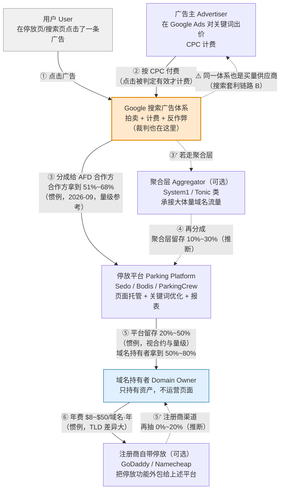
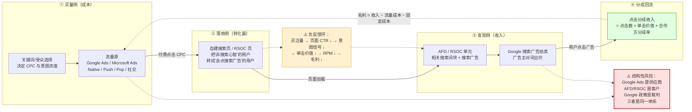
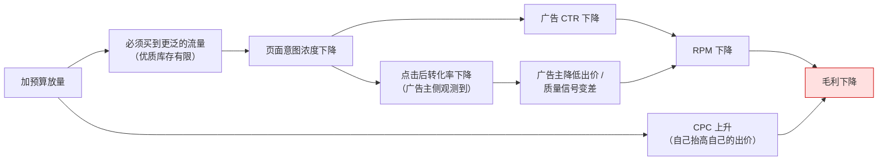
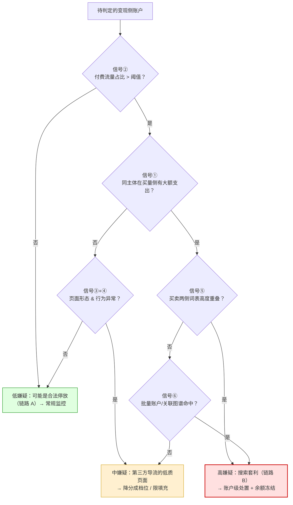

# 搜索套利与域名停放

> **一句话定位**：这是套利六大流派里**唯一一个"对手方同时是供应商、客户和裁判"**的流派——你在 Google Ads 买关键词，用 Google 的域名广告产品（AFD / RSOC）变现，由 Google 判定你是否违规。它把套利的所有结构性风险压缩到了一个单点上。
>
> **本文解决的问题**：把中文语境里被混为一谈的**搜索套利（Search Arbitrage）**、**域名停放（Domain Parking）**、**RSOC / AFD 变现**三件事彻底分开；讲清 AFD/RSOC 的分成链路为什么能产生极高 RPM；用三个完整算例算清两条链路的盈亏平衡与组合期望值；并回答"这个玩法还能活多久、平台会怎么杀它"。
>
> **核心结论先行**：
> 1. **搜索套利是主动买量，域名停放是被动承接**——两者的经济学结构完全不同，不是同一门生意的大小号。搜索套利的收入 = `买量规模 × 搜索页 RPM`，域名停放的收入 = `存量域名组合 × 直接流量期望值`。前者是流量生意，后者是**资产生意**。
> 2. **搜索套利的毛利率常态只有 20%~40%（优质配置可到 50% 左右，与 [`套利模式总览与分类.md`](./套利模式总览与分类.md) §4.1 给的 20%~50% 一致），远低于联盟买量的 88.5%**。套用已确立的敏感性通式 `|ΔM/M| = 0.2(1−g)/g`，同样的 CPC ±20% 扰动：联盟场景毛利 **−2.6%（取整 −3%）**，搜索套利场景毛利 **−30%（g=40%）~ −80%（g=20%）**。**这不是运营能力差异，是数学结构差异**（§7.5~§7.6）。
> 3. **搜索页/停放页的 RPM 由关键词的商业价值决定，不由流量规模决定**（§3.4）。所以这个流派对**关键词选择极度敏感、对流量规模极度不敏感**——这与信息流套利正好相反，也是它所有反直觉现象的总根源。
> 4. **域名停放是长尾生意**：绝大多数域名收益为零，少数域名贡献绝大部分收入（§8 算例 B）。它的正确模型是**期权组合**，不是年金。
> 5. **单点对手方风险不可分散**。其他套利流派可以换流量源、换网络、换 Offer；这个流派的供应商、客户、裁判是同一家公司。**它的生死完全取决于单一平台的政策选择**——这是它与其他流派最本质的风险差异（§10.6、§11）。
>
> **可信度标签**：`[标准]` 官方明文　`[政策]` 平台公开政策（标时点）　`[惯例]` 行业共识　`[推断]` 待验证推导
>
> 最后更新：2026-09-11

---

## 1. 本篇在套利版图中的位置

### 1.1 先定位：它属于买方套利的一个子类

[`套利模式总览与分类.md`](./套利模式总览与分类.md) 把套利分成六大流派。本篇覆盖其中**两个容易混在一起的流派**：

| 流派 | 买什么 | 卖什么 | 本篇章节 |
|---|---|---|---|
| **搜索套利**（Search Arbitrage / Search Traffic Arbitrage） | 付费流量（搜索关键词、Native、其他） | **搜索页广告点击收入**（AFD / RSOC / 自建搜索页） | §4、§7 |
| **域名停放**（Domain Parking） | **不买流量**——承接自然到达的直接流量 | **停放页广告点击收入**（AFD 为主） | §5、§8、§9 |

两者共用同一套变现出口（Google 的域名广告产品），所以被混为一谈；但**流量获取方式相反**（主动 vs 被动），导致单位经济、风险结构、规模化路径全都不同。§2 用一张表把它们钉死。

### 1.2 它与兄弟流派的边界

| 对比对象 | 相同点 | 关键差异 | 详见 |
|---|---|---|---|
| **信息流套利（Native）** | 都是"低价买量 → 高 RPM 页面变现" | 信息流套利的变现出口通常是 AdSense 展示单元或联盟 Offer；搜索套利的变现出口是**搜索广告点击**，单次点击价值高一个数量级，但对关键词的依赖也强一个数量级 | [`信息流套利-Taboola-Outbrain.md`](./信息流套利-Taboola-Outbrain.md) |
| **AdSense 套利与 MFA 站** | 都可能被判定为"为广告而生的页面" | MFA 卖的是**展示**（按 PV/曝光计价），搜索套利卖的是**点击**（按 CPC 计价）。MFA 靠内容量堆 PV，搜索套利靠关键词堆单点价值 | [`AdSense套利与MFA站.md`](./AdSense套利与MFA站.md) |
| **联盟套利漏斗** | 都是买量生意，共用垫资与素材衰减逻辑 | 联盟套利卖的是**转化派款**（CPA），有 Approval Rate 与扣量风险；搜索套利卖的是**点击分成**，没有商家审核环节，但有平台政策审核环节 | [`联盟套利漏斗.md`](./联盟套利漏斗.md) |
| **Prebid / HB 套利** | 都属于"利用定价机制差" | Prebid 是**卖方侧**套利（媒体抬价），搜索套利是**买方侧**套利（买量转卖） | [`Prebid与HeaderBidding套利.md`](./Prebid与HeaderBidding套利.md) |

`[推断]` **一句话判据**：**看收入是按"展示"还是按"点击"结算，以及关键词在链路里是成本项还是收益项。**
- 信息流套利：关键词是**成本项**（你买的是受众，不是词），收入按展示/点击混合。
- 搜索套利：关键词**既是成本项又是收益项**——你买的词决定了你能卖的词。这个"同一变量出现在分子和分母"的结构，是它数学上脆弱的根源（§4.4）。

---

## 2. 三分法：搜索套利 / 域名停放 / RSOC-AFD 必须分清

### 2.1 两个子流派的严格对照

这是本篇最重要的一张表。**看到"搜索套利"或"域名停放"任何一个词，先回到这张表确认对方说的是哪一列。**

| 维度 | **搜索套利**（Search Arbitrage） | **域名停放**（Domain Parking） |
|---|---|---|
| **谁在做** | Media Buyer、套利公司、部分 AdTech 中间商（如 System1 这类公开上市公司） | 域名投资人（Domainer）、注册商、停放平台、过期域名买家 |
| **流量怎么来** | **主动买量**：Google Ads / Microsoft Ads / Native / Push / Pop / 社交 | **被动承接**：类型直达（Typo / 直接输入）、过期域名的历史直接流量、书签、错误链接 |
| **买什么流量** | 付费点击（CPC 计价），意图强度取决于买的是什么词 | **不买**。流量的"成本"是域名年费（准固定成本），边际成本 ≈ 0 |
| **卖什么收益** | 搜索页/RSOC 页上的**广告点击分成** | 停放页上的**广告点击分成**（同一套 AFD 变现出口） |
| **差价从哪来** | ① 流量源之间的定价差（Native 的 CPC ≪ 搜索页的单击价值）② 关键词意图错配（买泛词、卖窄词）③ 平台补贴期的价差窗口 | ① 域名的**存量直接流量**是免费资产 ② 停放页 RPM 高于同流量的其他变现方式 ③ 过期域名的历史外链权重带来的自然流量 |
| **流量意图强度** | **中~低**：从 Native/Push 买来的人本来不在搜索心智里，需要落地页把他"转成搜索用户" | **看似高实则杂**：直接输入域名的人意图明确，但过期域名的流量常是"找旧站的迷路用户"，商业意图极低 |
| **规模化方式** | 横向：更多关键词 × 更多流量源 × 更多页面变体（受 Cap 与账户风控约束） | 横向：更多域名（组合式，见 §8）；**单个域名几乎无法放量** |
| **主要成本结构** | 80%+ 是纯变动成本（流量费）→ **几乎没有规模经济** | 90%+ 是准固定成本（域名年费）→ **有规模经济，但被长尾分布抵消** |
| **主要风险** | 平台政策（Google 明确反对此类形态）、买量侧 CPC 上涨、变现侧 RPM 下滑、账户封禁 | 收益长期衰减（直接流量消失）、域名续费沉没成本、过期域名玩法的政策风险 |
| **收入可预测性** | 低（每天盯盘，素材与关键词半衰期以天/周计） | 中（组合层面相对稳定，但趋势长期向下） |
| **代表平台** | Google Ads / Microsoft Ads（买量侧）；AFD / RSOC 服务商（变现侧）；System1、Tonic / Ask Media 等聚合买方 | Sedo、Bodis、ParkingCrew、GoDaddy / Namecheap 自带停放、Afternic |
| **半衰期** | **6~18 个月**（一个关键词组合的有效期） | **数年**（域名是长期资产，但收益曲线单调下行） |

`[推断]` **一句总结**：**搜索套利是"用今天的现金买今天的收入"，域名停放是"用过去的沉没成本收今天的租"。** 前者的核心能力是投放与选词，后者的核心能力是**资产筛选与组合管理**。用错能力模型是这个领域最常见的失败方式。

### 2.2 第三个容易混进来的：RSOC / AFD 不是流派，是变现层

**RSOC**（Related Search on Content，内容页相关搜索）与 **AFD**（AdSense for Domains，域名版 AdSense）经常被当作"一种套利玩法"来讨论，这是概念错位。它们的准确定位是：

> **RSOC / AFD 是 Google 提供给第三方页面的"搜索广告变现产品"，它是一个变现出口（Monetization Layer），不是一个流量获取方式。**

它可以被挂在两条完全不同的链路上：

| 挂载链路 | 流量来源 | 典型页面形态 | 谁在分成 | 政策态度 |
|---|---|---|---|---|
| **链路 A：域名停放** | 自然到达（类型直达、历史直接流量） | 停放页：域名名 + 若干"相关搜索"词块 + 广告位，**几乎无内容** | 域名持有者 ← 停放平台 ← Google | **明确支持**——这正是该产品的设计用途 `[政策]` |
| **链路 B：搜索套利** | **付费买量** | 自建搜索页 / RSOC 页：把买来的流量落到一个"搜索结果页"形态的页面上 | 套利方 ← （可能有中间聚合商）← Google | **明确限制**——付费流量导向此类页面的形态受政策约束（§4.5，条款细节待核实） |

**同一个产品，两条链路，两种政策命运。** 这是理解本领域最重要的一件事：

- 讨论"RSOC 还能不能做"是没有意义的提问；
- 有意义的提问是"**用自然流量挂 RSOC**能不能做"（多数情况可以）与"**用买量流量挂 RSOC**能不能做"（政策风险极高）。

`[惯例]` 行业里说的"RSOC 生意"通常默认指链路 B（因为链路 A 的量级太小、不值得当成"生意"讨论），这也是它政策风险高的原因。本文后续凡说"RSOC/AFD"，会显式标注指的是哪条链路。

### 2.3 快速判断流程

```
有人跟你说"我在做搜索套利 / 域名停放 / RSOC"，先问三个问题：

Q1：你的流量是买的还是自然来的？
 ├─ 买的  → 搜索套利（链路 B）。继续问 Q2
 └─ 自然来 → 域名停放（链路 A）。风险主要在收益衰减，不在政策

Q2：你的变现出口是谁？
 ├─ Google AFD / RSOC（直接或经中间商）→ 对手方风险集中（§4.4）
 ├─ 其他搜索广告联盟（Microsoft / Yahoo / 中小 syndication）→ 分成更低但政策弹性略大
 └─ 自建广告位 / 联盟链接 → 那其实是信息流套利或联盟套利，不是搜索套利

Q3：你的毛利率 g 是多少？
 ├─ g > 50% → 要么你买的词非常便宜，要么这个价差窗口在关闭中（§4.4）
 └─ g = 20%~40% → 常态。此时敏感性通式告诉你：任何单变量 ±20% 都会打掉 30%~40% 毛利
 └─ g < 15% → 这个漏斗不该跑（§7.6）
```

---

## 3. 机制层：AFD / RSOC 到底怎么运作

### 3.1 Google 的域名广告产品体系

`[政策]` + `[惯例]`　**时点：2026-09。产品名称、准入门槛与分成结构变动频繁，以下名称以业界通用叫法给出，具体条款需以 Google 当期官方文档复核。**

| 产品名 | 缩写 | 面向谁 | 页面形态 | 准入 | 备注 |
|---|---|---|---|---|---|
| **AdSense for Domains** | **AFD** | 域名持有者、停放平台 | 停放页：域名 + 相关搜索词块 + 广告 | **不对个人直接开放**，通过认证的停放合作伙伴接入 `[政策]` | 这是"域名停放"的标准变现出口 |
| **AdSense for Domains 的内容页变体 / Related Search** | 业界常称 **RSOC** / **AFD for Content** | 内容站、搜索结果页运营方 | 页面内嵌"相关搜索"单元 + 搜索广告 | 门槛高于普通 AdSense，通常需通过合作伙伴或达到量级要求 `[惯例]` | 名称在业界不统一，容易与 AFD 混用 |
| **Search Ads for Domains** | — | 同上 | 同上 | 同上 | **业界常把它当作 AFD/RSOC 的同义或近义称呼**，不同服务商的措辞不同。本文把它归入 AFD 家族，不单独区分 |
| **AdSense for Search（历史）** | AFS | 站内搜索框 | 用户在你站内的搜索框里搜词 → 出搜索广告 | 历史上开放度更高 | **【已失效 / 历史】** 该产品线在 Google 侧经历过多轮调整与收缩，当前的主力形态是 AFD 家族。**具体退役时点与条款演变本文无法确认，标为待核实** |
| **普通 AdSense（对照）** | — | 内容站 | 展示广告单元 | 无流量门槛，内容政策审核 | 卖的是**展示**，RPM 量级远低于 AFD（对照见 §3.3） |

**三条必须理解的准入事实** `[惯例]` + `[政策]`：

1. **AFD 基本不是"自助产品"**。个人域名持有者拿不到 AFD 的直接接入权，必须通过 Sedo、Bodis、ParkingCrew、GoDaddy 等**认证停放合作伙伴**。这意味着：**你在停放平台上看到的收益，已经被抽过一层**（§3.2）。
2. **量级门槛真实存在**。中间聚合商（System1、Tonic / Ask Media 一类）对接 Google 时通常有整体流量与合规要求，它们再向下分配给中小域名持有者时也会设自己的门槛（最低域名数、最低月收益、KYC）。**具体数字各服务商不同，本文不给假精确值。**
3. **合规审核是持续的，不是一次性的**。AFD 家族对"流量来源"有明确要求——**自然到达的流量是设计用途，付费导入的流量是政策敏感区**。这一点决定了链路 A 与链路 B 的命运分岔（§2.2）。

> **政策时点：2026-09，需以当期官方文档复核。** 本文不提供任何条款编号、罚则金额或分成比例的"精确值"——凡无法确认的一律标 `[推断]` 并给区间。

### 3.2 停放页的收益分成链（资金流图）

**这是本篇要求的核心 mermaid 图之一。** 从广告主付费到域名持有者收款，中间经过 2~4 层抽成：



**逐级抽成的量级区间**（**全部为量级参考，非官方数字**）：

| 层级 | 抽成量级 | 标签与时点 | 说明 |
|---|---|---|---|
| 广告主 → Google | Google 留存 **约 30%~49%** 的搜索广告点击收入 | `[推断]` 2026-09 | **推导依据**：Google 长期在财报中披露"Traffic Acquisition Cost, TAC"占广告收入的比例，历史上在 **20%~25%** 量级；TAC 主要是付给搜索合作伙伴与 AdSense 网络成员的分成。若 TAC ≈ 广告收入的 22%，则合作伙伴侧合计拿到约 22%，Google 留存约 78%；但**AFD 这类"域名/搜索联盟"渠道的分成比例显著高于普通 AdSense 展示渠道**（因为它是搜索广告的高价值点击），业界普遍认为合作方拿到 **51%~68%**。**两个口径不矛盾：TAC 是全体渠道的加权平均，AFD 是其中的高档位。本文无法给出 AFD 的官方分成率，标为待核实。** |
| Google → 停放平台（AFD 合作方） | 合作方拿 **51%~68%** | `[惯例]` 2026-09 | 业界普遍引用的区间。**无一手来源，不得当作精确值使用。** 部分服务商对超大体量客户可谈到更高档 |
| 聚合层（可选） | 留存 **10%~30%** | `[推断]` 2026-09 | 只在链路里存在聚合商时发生。聚合商的价值是"凑够量级门槛 + 承担合规责任 + 提供关键词优化技术" |
| 停放平台 → 域名持有者 | 持有者拿 **50%~80%** | `[惯例]` 2026-09 | Sedo / Bodis / ParkingCrew 的公开分成档位历史上多在此区间，且**量级越大档位越高**。**具体档位需查各平台当期条款。** |
| 注册商渠道（可选） | 再抽 **0%~20%** | `[推断]` 2026-09 | GoDaddy / Namecheap 的自带停放本质是把功能外包，部分注册商不留成（用停放换域名续费留存），部分留成 |

**端到端折算** `[推断]`　把上表串起来（走"停放平台直连"路径，不含聚合层与注册商抽成）：

```
广告主付 $1.00 点击费
 → Google 留存 32%~49%           剩 $0.51~$0.68 给停放平台
 → 停放平台留存 20%~50%          剩 $0.26~$0.54 给域名持有者
 ⇒ 域名持有者最终拿到点击费的 26%~54%（中位约 35%~40%）

若中间还有聚合层（留存 10%~30%）：
 ⇒ 域名持有者最终拿到 18%~49%（中位约 28%~35%）
```

> **这条链的第一个洞察**：**域名持有者是这条链上离钱最远、议价能力最弱的一方**——他既不控制页面、也不控制关键词、也看不到原始点击日志。他能谈判的只有"换哪家停放平台"。这与 [`../09_联盟营销Affiliate/Affiliate体系总览.md`](../09_联盟营销Affiliate/Affiliate体系总览.md) §2.4 的"风险分配全景"是同一类结构：**离钱越远的一方，承担的风险越不可观测。**

### 3.3 为什么停放页 RPM 可以极高

`[推断]` + `[惯例]`　停放页的 Page RPM 常常被报到**远高于普通内容站的 AdSense RPM**（后者 T1 约 $3~$15，见 [`../09_联盟营销Affiliate/Niche站与内容站变现.md`](../09_联盟营销Affiliate/Niche站与内容站变现.md) §5.2）。原因不是"停放页更会赚钱"，而是**四个结构性因素叠加**：

| # | 因素 | 机制 | 量级影响 |
|---|---|---|---|
| **1** | **卖的是搜索点击，不是展示** | 普通 AdSense 的收入 = 展示 × eCPM，一次展示价值几美分；AFD 的收入 = **点击 × 搜索广告 CPC**，一次点击价值可达数美元 | **主导因素**，可差 1~2 个数量级 |
| **2** | **页面上没有别的东西分散注意力** | 停放页除域名名、几个"相关搜索"词块和广告位之外**几乎没有内容**。用户的唯一可点目标就是广告 | 广告 CTR 可以远高于内容站（内容站的 CTR 被正文、图片、导航、联盟链接稀释） |
| **3** | **关键词是被"选中"的，不是"匹配"的** | 停放平台会针对每个域名**人工/算法配置最值钱的关键词组**（如 `insurance.example.com` 配保险类词）。内容站的广告是上下文自动匹配，无法做这种极致选词 | 单击价值（CPC）被系统性拉高 |
| **4** | **RPM 的分母极小** | 停放页的"页面浏览"里，**绝大多数是零点击的迷路用户**，但只要有极少数人点了高价词，摊到全部 PV 上的 RPM 仍然可观 | 让 RPM 数字看起来"很好"，但**方差极大**（见 §3.4 与 §8） |

**但这里有一个必须立刻纠正的口径陷阱**（与 [`../09_联盟营销Affiliate/Affiliate体系总览.md`](../09_联盟营销Affiliate/Affiliate体系总览.md) §7.1 的 EPC 口径陷阱同类）：

> ⚠️ **停放页 RPM 的分母通常是"停放页 PV"，而这个 PV 里包含大量机器人流量、爬虫、以及一秒内就离开的迷路用户。** 用"真实人类有效 PV"做分母重算，RPM 会显著下降。**所以"某停放平台 RPM $50"这类数字在没有分母口径的前提下不可比较、不可外推。** `[惯例]`
>
> 另外，**T1 与 T3 的 RPM 相差 5~20 倍**（[`../09_联盟营销Affiliate/Niche站与内容站变现.md`](../09_联盟营销Affiliate/Niche站与内容站变现.md) §5.2 已确立）。停放流量的地域分布高度依赖域名历史，**不可自选**——这是停放与买量的一个关键差别：**买量可以选 Geo，停放只能接受 Geo。**

### 3.4 关键机制：RPM 由关键词商业价值决定，不由流量规模决定

**这是本流派的"第一性原理"，全篇的算例都挂在它上面。**

搜索广告的定价来自关键词拍卖（[`../03_业务逻辑与商业模式/拍卖机制与竞价理论.md`](../03_业务逻辑与商业模式/拍卖机制与竞价理论.md)、[`../04_产品形态与广告样式/搜索广告.md`](../04_产品形态与广告样式/搜索广告.md)）。一次点击的价格 ≈ 广告主的**单次转化价值 × 预期转化率 × 竞争密度**。因此：

```
搜索页 RPM ≈ 页面 CTR × 平均单击价值(CPC) × 1000
           ≈ 页面 CTR × [广告主 LTV × 广告主 CR × 竞争系数] × 1000
                          └────────── 与你的流量规模完全无关 ──────────┘
```

**推论（四条，全部反直觉）** `[推断]`：

| # | 推论 | 为什么反直觉 | 实操含义 |
|---|---|---|---|
| **1** | **1,000 个"保险/法律/贷款"类词的 UV，可以比 100,000 个"壁纸/笑话"类词的 UV 赚得多** | 直觉上"流量为王" | **选词 > 放量**。这个流派的杠杆在词表，不在预算 |
| **2** | **同一个域名的收益，换个停放平台可能差数倍** | 直觉上"流量一样收益就一样" | 平台的核心能力是**关键词映射与广告填充质量**，不是"托管页面" |
| **3** | **买量放量会主动摧毁 RPM** | 直觉上"量越大收入越高" | 买来的泛流量拉低页面 CTR 与意图浓度 → 广告主侧质量信号变差 → **单击价值下降**。§4.3 会算这个反馈环 |
| **4** | **收益的时间波动主要来自广告主竞价周期，不是来自你的流量** | 直觉上"流量稳收入就稳" | 保险类词在续保季、法律类词在诉讼高发期、金融类词在季度末，RPM 会有 **±30%~±60%** 的季节性摆动 `[推断]`。**这个波动你完全不可控** |

> **§3 的核心结论**：**这个流派不是一门"流量生意"，是一门"关键词生意"。** 流量只是把关键词送到拍卖里的载具。理解了这一点，就理解了为什么它**对流量规模不敏感、对关键词选择极度敏感**——也理解了为什么"买一堆量就能做大"在这个流派里是错的（§13 误解 9）。

---

## 4. 搜索套利的完整链路

### 4.1 链路总览（本篇要求的第二张核心 mermaid 图）



### 4.2 每一步的经济学与关键变量

| 环节 | 关键变量 | 量级区间（`[惯例]`/`[推断]` 2026-09） | 谁决定它 | 优化杠杆 | 杠杆上限 |
|---|---|---|---|---|---|
| **① 选词** | 关键词商业价值 | 单击价值从 <$0.05（娱乐/壁纸类）到 >$20（保险/法律/Mesothelioma 类），**跨 2~3 个数量级** | 广告主的 LTV 与竞争密度 | 换词表、找"高价低竞争"的长尾组合 | **词库会被耗尽**（与信息流套利的素材衰减同构，但半衰期以月计而非天计） |
| **① 选源** | 买量 CPC | Native T2/T3 约 $0.02~$0.30；Push/Pop 约 $0.001~$0.05；Google Ads 搜索词 $0.5~$50+ | 流量源拍卖 | 换源、换 Geo、换时段 | **源的质量与意图强度负相关于价格**——便宜的量意图弱 |
| **② 落地页** | 页面 CTR（进入 → 点广告） | 5%~40%，**高度依赖词与页面的匹配度** `[推断]` | 页面结构、词块相关性、加载速度 | 词块与买量词的语义对齐、页面变体测试 | **政策约束**：过度引导点击、伪装成搜索结果页都是违规形态（§4.5） |
| **② 意图转换** | 买量意图 → 搜索意图的转换率 | **这是搜索套利最独特的一步**，没有公开基准 `[推断]` | 流量源类型 | Native/社交需要"教育"用户去搜索；搜索词买量则天然已是搜索心智 | **转换率越低，RPM 越低**——这是为什么"从 Google 买词再卖回 Google"看似最直接却最贵 |
| **③ 变现** | 单击价值（分成后） | = 广告主 CPC × 合作方分成率（51%~68%，§3.2） | Google 拍卖 + 你的分成档位 | 提高分成档位需**量级门槛**（找聚合商或直签） | 档位提升空间有限（10%~30% 量级） |
| **③ 变现** | 填充率 / 广告条数 | 每次页面加载出 3~8 条相关搜索广告 `[惯例]` | Google 侧 | **不可控** | 无 |
| **④ 结算** | 账期 | Google AFD 侧月结量级；经停放平台/聚合商再加 15~45 天 `[推断]` | 中间层合约 | 选快结算的中间层（代价：分成档位更低） | 与信息流/联盟套利的账期逻辑相同 |

`[推断]` **一句话概括这条链的经济学**：**你在做一件"把低意图流量重新贴标签成高意图流量"的事**。买量侧买到的是"便宜的注意力"，变现侧卖出的是"昂贵的搜索意图"。**差价来自这个标签转换的成功率**——而成功率不由你决定，由 Google 的质量信号系统判定。这是它比信息流套利更脆弱的根本原因。

### 4.3 为什么这个玩法在数学上很脆弱：同一对手方三重身份

**这是本篇最重要的结构性论点。**

```
在搜索套利链路里，Google 同时扮演三个角色：

  角色 1｜供应商  ← 你在 Google Ads 买关键词，它决定你的 CPC
  角色 2｜客户    ← 你的收入来自 Google AFD/RSOC 的点击分成，它决定你的 RPM
  角色 3｜裁判    ← 它判定你的页面形态与流量来源是否违规，它决定你能不能继续做
```

**这三重身份叠加产生四种其他流派没有的风险** `[推断]`：

| # | 风险 | 机制 | 为什么无法对冲 | 其他流派的对照 |
|---|---|---|---|---|
| **1** | **两侧价格可以被同时调整** | 平台有能力提高买量侧 CPC（拍卖竞争、质量分要求）同时降低变现侧分成或收紧填充 | **你无法只在一个市场上交易**——离开 Google Ads 就失去最贵的关键词库存，离开 AFD 就失去搜索广告的变现出口 | 信息流套利：Taboola 涨价了可以换 Outbrain；联盟套利：网络扣量了可以换网络 |
| **2** | **平台看得到你的完整账本** | 买量侧的投放词、出价、Geo、素材，与变现侧的页面、点击、收入，**都在同一个体系内** | 你的毛利结构对平台是**完全透明**的。任何"平台不愿意看到有超额利润"的价差窗口都可以被精确关闭 | 信息流套利：Native 平台看不到你在 AdSense 侧的收入 |
| **3** | **裁判标准可以事后追溯** | 政策可以在你的资产（域名、页面、账户历史）已经建立之后变更，且判定权在平台 | **无申诉的实质对等性**——平台的判定通常不可举证反驳（与 [`../09_联盟营销Affiliate/联盟反作弊与扣量.md`](../09_联盟营销Affiliate/联盟反作弊与扣量.md) §3.3"扣量在数学上对单一推广者不可证明"同构） | 联盟套利：至少商家和网络是两方，可以交叉验证 |
| **4** | **平台有直接的利益冲突动机** | 你的搜索页与 Google 自己的 SERP **争夺同一批广告主的同一批点击**。你赚的每一分钱，都是从 Google 的广告主关系里分出来的 | 平台有**结构性动机**压缩这个中间层——它不是"可能会管"，是"有动机管" | Prebid 套利：SSP 之间互相竞争，媒体有议价空间 |

**风险 #4 值得展开**，因为它解释了这个流派的长期走向：

> `[推断]` **搜索套利本质上是在"转售 Google 自己的搜索广告库存"。** 你在 Google Ads 买一次点击（付钱给 Google），把这个人送到你的页面，他再点一次搜索广告（钱又回到 Google），Google 分一部分给你。**从 Google 的视角看，这是一次"用自己的库存赚自己的钱、还要付分成出去"的循环。**
>
> 它对 Google 有价值的部分是：① 触达了 Google SERP 之外的场景；② 部分流量确实有真实商业意图。
> 它对 Google 无价值（甚至有害）的部分是：① 买来的泛流量污染了广告主的转化数据，广告主会发现"这批点击不转化"→ **降低对整个搜索广告渠道的信任与出价**；② 中间层拿走了本可归 Google 的利润；③ 用户体验差（把用户从 Native 广告骗到一个只有广告的页面）损害生态声誉。
>
> **结论**：**这个流派对平台是"净负外部性"的可能性大于"净正贡献"**，所以它的长期方向是收缩，而不是扩张。§6 会把这个判断落到时间线上。

### 4.4 负反馈环：为什么放量会摧毁 RPM

§3.4 推论 3 的量化版本 `[推断]`：



**双向挤压**：放量时**成本侧上升（CPC ↑）+ 收入侧下降（RPM ↓）**同时发生。这与 [`../09_联盟营销Affiliate/Affiliate单位经济与规模化.md`](../09_联盟营销Affiliate/Affiliate单位经济与规模化.md) §3.4 的"放量必然推高 CPC"是同一机制，但**搜索套利多了一个收入侧的下降通道**（联盟套利的 Payout 是合约固定的，不随你的流量质量变化；搜索套利的单击价值是拍卖决定的，**随你的流量质量实时变化**）。

**这是搜索套利与信息流套利、联盟套利最重要的数学差异** `[推断]`：

| 流派 | 收入侧变量是否随放量变化 | 后果 |
|---|---|---|
| 联盟套利 | **否**（Payout 是合约固定值，Approval Rate 短期稳定） | 放量只受 Cap 与 CPC 约束，毛利结构稳定 |
| 信息流套利 | **部分**（AdSense RPM 会因流量质量下降而降，但展示计价缓冲较大） | 中度反馈 |
| **搜索套利** | **是，且是实时的**（单击价值来自拍卖，拍卖看质量信号） | **强反馈。放量到某个点后毛利必然转负，且这个点比想象的低** |

### 4.5 Google 政策对此类行为的态度演变

`[政策]`　**时点：2026-09。本节只描述政策的方向与逻辑，不引用具体条款编号、不给罚则金额——本文无法核实这些细节，凡需要精确条款处均标为待核实。**

| 时期 | 政策方向 | 依据强度 | 说明 |
|---|---|---|---|
| **早期（2000s~2010s 初）** | 相对宽松，域名停放与"搜索联盟"是明确的商业化产品线 | `[惯例]` | AFD / AFS 这类产品本身就是这个时期的产物。Google 有意愿把搜索广告库存分销到站外 |
| **中期（2010s）** | 逐步收紧"付费流量导向搜索页"的形态 | `[政策]` 方向可确认，**具体条款与生效时点待核实** | AdWords/AdSense 政策长期包含对"引导点击广告""无实质内容的页面""arbitrage 类落地页"的限制表述。**本文不引用原文条款号** |
| **2015 前后** | 对 **Domain Parking + 付费流量** 的组合有明确限制动作 | `[惯例]`，**具体政策文件与时点待核实** | 业界普遍记得 Google 对"用付费流量导向停放/搜索页"的账户做过批量处置。**本文无法确认处置规模、判定标准与时间线，标为待核实** |
| **近年（2020s）** | 三条并行收紧：① 垃圾内容政策（Scaled Content Abuse 类）② 站点级声誉与"寄生 SEO"治理 ③ 对搜索联盟页面的质量要求 | `[政策]` 方向可确认 | ①与 [`../09_联盟营销Affiliate/Niche站与内容站变现.md`](../09_联盟营销Affiliate/Niche站与内容站变现.md) §4.1 记载的 **2024-03** 核心更新与 Scaled Content Abuse 政策同源；②③的具体条款**待核实** |
| **当前（2026-09）** | AFD/RSOC 作为**产品仍然存在且被支持**，但其**设计用途是承接自然流量**；把它用于付费流量套利是政策敏感区 | `[政策]` + `[推断]` | **这条是本篇的政策基线判断**。任何"RSOC arbitrage 稳定可做"的说法都与这个基线冲突 |

**三条给研究者的诚实声明**：

1. **本文没有联网核实任何具体条款。** 上表的"政策方向"来自行业公开共识与产品逻辑推导，**不构成对 Google 当期政策的准确引用**。
2. **不要引用任何"Google 规定第 X.X 条禁止搜索套利"的说法**，除非你能打开当期官方页面。本文刻意不给条款号，就是为了避免制造可被误引的假精确信息。
3. **政策风险的正确用法是"方向判断"而不是"条款合规"**：方向是收紧的，所以任何长期商业计划都不应把这个链路当作稳定基础设施。

---

## 5. 域名停放的完整链路

### 5.1 域名来源类型：四种，经济学完全不同

| 来源类型 | 英文 | 流量从哪来 | 流量量级 | 流量意图 | 成本结构 | 收益特征 | 风险 |
|---|---|---|---|---|---|---|---|
| **① 新注册域名（无历史）** | New Registration / Hand-registered | **几乎没有**——只有极少数人误输入 | 极低（月 0~数十 PV 常见） | 无 | 年费 $8~$50 `[惯例]`，TLD 差异大 | **绝大多数为零**。这是 §8 算例 B 里长尾的"零收益主体" | 沉没成本（续费是每年重复决策） |
| **② 过期域名（有历史）** | **Expired Domain** | 历史直接流量（书签、旧链接、名片、邮件签名）+ 历史外链带来的自然流量 | 中~高（月数百~数万 PV） | **杂**——找旧站的迷路用户为主，商业意图低 | **一次性收购价**（数百~数万美元，极端案例更高）+ 年费 | 有收益但**随时间衰减**（§9 算例 C 的核心） | ①衰减不可逆 ②"域名历史与当前内容不匹配"会被识别 ③收购价可能远高于可回收收益 |
| **③ 类型直达 / 误输入** | Typo Traffic / Type-in | 用户输错域名（如 `.con`、少打一个字母） | 视域名的"通用性"而定 | **低~中**——误输入者通常在找别的东西 | 域名年费（**但通用词的 typo 域名往往已被抢注且价格高**） | 曾经是这个流派的主要收入来源，**结构性下降中**（§6.3） | 部分司法辖区下 typo 域名涉及商标争议（**本文不提供法律意见**） |
| **④ 停放平台聚合** | Aggregated Parking | 平台把大量中小域名的流量打包，用整体量级换更好的分成档位与关键词映射 | 单个域名小，聚合后大 | 混合 | 平台抽成（§3.2） | 对域名持有者是"托管收益"，对平台是"规模生意" | 域名持有者**看不到原始数据**，无法验证平台报表 |

`[推断]` **关键区分**：**①和③是"资产生意"，②是"投资生意"，④是"渠道生意"。** 混在一起谈"域名停放赚钱吗"必然得到互相矛盾的答案——因为①的期望收益接近零、②的期望收益取决于收购价、③在结构性下降、④只是分成方式。

### 5.2 停放平台生态：商业模式与分成结构差异

`[惯例]`　**时点：2026-09。以下为公开公司的业务定位描述，分成比例的具体档位需查各平台当期条款，本文不给精确值。**

| 平台 | 类型 | 商业模式 | 分成结构特征 | 适合谁 | 关键差异点 |
|---|---|---|---|---|---|
| **Sedo** | 综合型：停放 + 交易市场 + 经纪 | 停放是**引流工具**，真正赚钱靠域名交易佣金与经纪服务 | 停放分成档位中等；**但交易市场的流动性是它的核心价值** | 想卖域名的投资人 | 停放不是它的主业，所以停放优化投入相对有限；它的价值在"退出通道" |
| **Bodis** | 专注停放 + 域名货币化 | **停放即主业**：关键词优化、A/B 测试页面变体、多变现源切换 | 分成档位通常更有竞争力（对大域名组合有高档位）`[惯例]` | 有域名组合、想最大化停放收益的投资人 | 技术投入在"每个域名配什么词"上，这是 §3.4 的直接应用 |
| **ParkingCrew** | 专注停放（与 Sedo/Team Internet 体系有历史关联） | 停放即主业，界面与功能相对简洁 | 分成档位中等 | 中小域名持有者 | **归属关系与品牌沿革有过变动，本文无法确认当前股权结构，标为待核实** |
| **GoDaddy 自带停放 / Afternic** | 注册商 + 停放 + 交易网络 | 停放是**域名续费留存工具**：让你觉得"这个域名还有点用，值得续费" | 分成可能较低甚至不留成给持有者，**但注册商的真实目的是续费率** | 已经在 GoDaddy 注册域名的人（默认开启） | **动机不对齐**：注册商优化的是"续费率"，不是"你的停放收益最大化" |
| **Namecheap 自带停放** | 注册商 + 停放（功能较简） | 同上 | 同上 | 同上 | 功能极简，适合"懒得配置"的默认场景 |
| **System1** | **聚合型买方**（公开上市公司） | **收购/承接大体量停放与搜索流量，用规模换更好的分成与技术投入**，并延伸到搜索套利链路 B | 对下游域名持有者/流量方是**买方**，对 Google 是**大客户** | 想一次性变现大量域名的持有者 | **它同时站在链路 A 与链路 B 上**——这是理解"聚合层"最好的例子。它承担了合规责任与量级门槛，也因此拿走一层分成 |
| **Tonic / Ask Media 一类** | 搜索联盟 / RSOC 服务商 | 提供 RSOC 页面技术与 Google 侧的接入资格，向流量方分成 | 分成档位取决于流量量级与合规记录 | 有流量的媒体/套利方 | **主要服务链路 B**（搜索套利侧），政策风险敞口比纯停放平台大 |

**三种商业模式的本质差异** `[推断]`：

```
类型一：停放即主业（Bodis / ParkingCrew）
  利益对齐度：★★★★☆  你赚得多它才赚得多
  它优化什么：单域名 RPM（关键词映射、页面变体）
  风险：它自己的 Google 接入资格被撤销 → 你全部收益归零

类型二：注册商附带（GoDaddy / Namecheap）
  利益对齐度：★★☆☆☆  它优化的是"你会不会续费"
  它优化什么：让你觉得域名有价值 → 续费
  风险：分成低、优化投入少，你的收益被系统性低估

类型三：综合市场（Sedo）
  利益对齐度：★★★☆☆  停放是引流，交易佣金才是利润
  它优化什么：域名流动性（帮你卖掉）
  风险：停放收益不是它的优先级

类型四：聚合买方（System1）
  利益对齐度：★★☆☆☆（对下游）  它是买方，你是卖方
  它优化什么：整体量级与 Google 侧的谈判地位
  风险：它拿走一层分成，且你失去对页面与数据的控制权
```

> **选择判据** `[推断]`：**问一句"它的利润来自我的收益，还是来自我的资产？"**
> - 来自我的收益（Bodis 类）→ 利益对齐，分成高，但你要承担它的平台风险。
> - 来自我的资产（GoDaddy 续费、Sedo 交易佣金、System1 收购）→ 利益不完全对齐，停放收益会被系统性做低。

### 5.3 过期域名玩法：机制与风险（风险认知向，不讲操作）

`[惯例]` + `[推断]`　**本节只讲机制与风险，不提供任何收购筛选方法、不提供工具、不提供操作步骤。**

**为什么有人高价买过期域名**（三个动机，价值递减）：

| # | 动机 | 机制 | 价值的真实性 | 衰减速度 |
|---|---|---|---|---|
| **1** | **历史直接流量** | 旧域名有书签、名片、邮件签名、旧文章里的链接 → 用户直接输入 → 落到停放页 | **真实但短暂**：这些人是在找**旧站**，一旦发现旧站没了，多数不会再来 | **快**（月~年，§9 算例 C） |
| **2** | **历史外链权重** | 旧域名有大量外链，理论上可以承接自然搜索流量 | **高度可疑**：搜索引擎长期治理"域名历史与当前内容不匹配"的情况。外链指向的是一个**已不存在的内容**，权重能否转移**无法确认** | **快，且可能被惩罚性归零** |
| **3** | **域名本身的语义价值** | 短、易记、通用词、行业词 → 未来的转售价值 | **真实且持久**——但这属于**域名投资**，不属于"停放套利" | 慢 |

**平台与搜索引擎如何识别"域名历史与当前内容不匹配"**（防守方视角，机制描述）：

| 识别信号 | 机制 | 判定强度 |
|---|---|---|
| **内容主题突变** | 域名过去 10 年都是"某地方报社"，突然变成一个只有相关搜索词块的页面 → **主题连续性断裂** | 强 |
| **注册人/主体突变** | WHOIS 与历史快照的主体完全不同，且**变更时间与内容变更时间高度接近** | 强 |
| **外链锚文本与落地内容不匹配** | 外链锚文本是"XX 日报 订阅"，落地页是"insurance quotes" → **锚文本-内容错配** | **极强**（这是最直接的信号） |
| **流量来源结构异常** | 自然搜索流量占比骤降、直接流量占比骤升，且直接流量的落地页只有停放页 | 中~强 |
| **用户行为信号** | 极短停留、极高跳出、极低的"二次访问"率——**迷路用户的典型指纹** | 中 |
| **历史快照对比** | 公开的历史页面存档可以直接证明"这个域名以前是什么" | **极强，且几乎不可辩解** |

**政策风险的三条**（只讲风险，不讲规避）：

1. **搜索侧**：把过期域名的历史权重用于承接与历史无关的商业流量，属于搜索引擎长期治理的形态。轻则不给自然流量，重则站点级处置。**具体政策条款与处置标准本文不引用，标为待核实。**
2. **广告侧**：AFD/RSOC 的合规审核会看流量来源质量。**如果平台判定你的流量是"误导性的历史流量"，分成资格可能被撤销**——而且撤销是**账户级**的，会牵连该主体下的全部域名（§8.4 的组合风险）。
3. **法律侧**：涉及他人商标、已注销公司名、公众人物姓名的过期域名，可能面临争议解决程序（如 UDRP）或诉讼。**本文不提供法律意见，任何收购决策需咨询专业人士。**

> **本节的核心认知**：**过期域名玩法的收益来自"历史流量的自然耗尽"，而不是"资产的持续增值"。** 这意味着它是一笔**有明确回收期限的投资**（§9 算例 C 会算出来），而不是一门可以长期做的生意。把它当"被动收入"是 §13 误解 1 与误解 6 的组合错误。

### 5.4 域名组合经济学：为什么是"期权"而不是"年金"

`[推断]`　单个域名的收益分布是**极度右偏的长尾**：

```
一个典型的 N 个域名组合，月收益分布形态（示意）：

  域名占比          贡献收入占比
  ─────────────────────────────────
  60%~80% 的域名  →  $0（完全无流量或流量无价值）
  15%~30% 的域名  →  合计贡献 10%~25% 的收入
   3%~8%  的域名  →  合计贡献 40%~60% 的收入
   <1%    的域名  →  单个可贡献 20%~50% 的收入（头部域名）

  这个形态与"年金"（每期固定金额）完全不同，
  它与"期权组合"（多数归零、少数巨额回报）在数学上同构。
```

**由此得到三条经营结论**（§8 算例 B 会用数字证明）：

| # | 结论 | 依据 |
|---|---|---|
| **1** | **不能用"平均收益"做决策，必须用"分布"** | 平均数被头部域名拉高，用平均数外推会让你买太多平庸域名 |
| **2** | **组合规模的价值在于"命中头部的概率"，不在于"总流量"** | 持有 1,000 个域名不是为了 1,000 份小收益，是为了提高"里面有一个头部域名"的概率 |
| **3** | **续费决策必须逐域名做，不能批量做** | 批量续费等于为 60%~80% 的零收益域名持续付费。**这是这个生意最常见的亏损方式**（§13 误解 2） |

---

## 6. 5 问分析框架完整走查

[`README.md`](./README.md) §写作要点 1 规定所有流派用同一个 5 问框架。**本节把两个子流派并排走完，这是本篇与其他流派文档的对齐锚点。**

### 6.1 ① 买什么流量？

| | **搜索套利** | **域名停放** |
|---|---|---|
| **源** | Google Ads / Microsoft Ads（搜索词）、Native（Taboola/Outbrain 类）、Push、Pop、社交 | **不买量**。源是"域名的存量直接流量" |
| **单价** | Native T2/T3 $0.02~$0.30；Push/Pop $0.001~$0.05；搜索词 $0.5~$50+ `[惯例]` | 边际单价 ≈ **$0**（域名年费是准固定成本，与 PV 无关） |
| **质量** | 低~中。买来的量本质是"注意力"，不是"搜索意图" | 杂。直接输入者意图明确但常是迷路用户；历史外链带来的自然流量意图与域名主题无关 |
| **可规模化程度** | **中**。受 Cap、账户风控、优质库存枯竭约束；且放量会摧毁 RPM（§4.4） | **低（单域名）/ 高（组合）**。单个域名的流量由历史决定，无法放量；只能横向加域名 |
| **可自选性** | **高**：可以选词、选 Geo、选设备、选时段 | **极低**：地域分布、设备分布、时间分布全部由域名历史决定，**不可调整** |
| **意图强度分布** | 可通过选词间接控制（买高意图词贵，买泛词便宜） | **不可控制**，且长期下降（§6.3 第 3 条） |

`[推断]` **这一问的关键差异**：**搜索套利的流量是"租来的"，域名停放的流量是"资产折旧出来的"。** 前者的成本随规模线性增长（纯变动成本），后者的成本与规模无关（准固定成本）。参照 [`../09_联盟营销Affiliate/Affiliate单位经济与规模化.md`](../09_联盟营销Affiliate/Affiliate单位经济与规模化.md) §1.4 的四类成本判据：**域名停放有真实的规模经济（准固定成本占比 90%+），搜索套利几乎没有（纯变动成本占比 80%+）。**

但注意：**规模经济被长尾分布抵消**（§5.4）。加第 1,001 个域名的成本是固定的（年费），但它的期望收益接近零。**所以"有规模经济"不等于"越做越赚"**——这是 §8 算例 B 要算清的核心。

### 6.2 ② 卖什么收益？③ 差价从哪来？

**② 卖什么收益**（两者相同）：

```
收入 = 页面 PV × 广告 CTR × 单击价值 × 合作方分成率
     = PV × RPM / 1000

其中 RPM = 广告 CTR × 单击价值 × 分成率 × 1000
```

**关键区别在于 RPM 的分母口径**（与 [`../09_联盟营销Affiliate/Niche站与内容站变现.md`](../09_联盟营销Affiliate/Niche站与内容站变现.md) §5.2 的口径陷阱同源）：

| 口径 | 分母 | 在搜索套利里 | 在域名停放里 |
|---|---|---|---|
| **Page RPM** | 页面浏览量 PV | 最常用。买量场景下 PV/UV ≈ 1.0~1.3（用户落地就走） | 最常用。但 PV 里混入大量爬虫与秒退流量 |
| **Session RPM** | 会话数 | 与 PV 口径差异小（1.0~1.3 倍） | **差异大**（1.5~2.5 倍）——因为停放流量的"会话"定义模糊 |
| **UV RPM** | 独立访客 | 买量场景下最接近"每个买来的点击赚多少" | 最能反映真实人类价值 |

> ⚠️ **对比任何两个停放平台/服务商的 RPM 报价前，必须先统一分母。** 已确立的口径差是 **PV vs session 1.5~2.5 倍**，加上 **T1/T3 地域差 5~20 倍**，**两个未标口径的 RPM 数字可以相差 10~50 倍而都"没错"**。这是本领域最常见的误判来源。

**③ 差价从哪来**（两者完全不同）：

| 差价来源 | **搜索套利** | **域名停放** |
|---|---|---|
| **信息差** | ★★★★ 主力：知道"哪些高价词可以用便宜的泛流量承接"，以及"哪个流量源当前 CPC 被低估" | ★★ 弱：知道"哪类过期域名有真实历史流量"（但这是私有信息，市场效率在提高） |
| **定价机制差** | ★★★★★ **核心**：Native/Push 按注意力定价（CPM/低 CPC），搜索广告按商业意图定价（高 CPC）。**两套定价体系之间的价差就是这个生意的全部利润来源** | ★★ 弱：AFD 的分成率相对固定 |
| **流量质量误判** | ★★★ 流量源低估了某批流量的搜索意图 → 你低价买到 | ★ 几乎不存在 |
| **平台补贴** | ★★ AFD 分成率高于普通 AdSense（§3.2 已论证），这本身是一种"渠道补贴" | ★★★ 同左，且停放是 AFD 的**设计用途**，补贴更稳定 |
| **存量资产** | ✗ 无 | ★★★★★ **核心**：域名的历史流量是**已经存在的免费资产**，差价来自"这个资产此前没被变现" |

`[推断]` **一句话对比**：**搜索套利的差价来自"两套定价体系之间的价差"，域名停放的差价来自"一个未被变现的存量资产"。** 前者是**动态的、会被套利掉的**（价差窗口关闭是必然）；后者是**静态的、会被折旧掉的**（存量流量自然耗尽是必然）。**两条链路的差价都会消失，但消失的机制不同、时间尺度不同**——这是 §6.5 分别给半衰期判断的依据。

### 6.3 ④ 毛利结构？

**通用毛利公式**（与 [`README.md`](./README.md) §写作要点 2 一致，与 [`套利单位经济与毛利模型.md`](./套利单位经济与毛利模型.md) 对齐）：

```
【搜索套利（链路 B）】
  日毛利 = UV × RPM_搜索页 / 1000 − UV × CPC_买量 − 固定成本
  盈亏平衡：RPM_搜索页 / 1000 = CPC_买量
          → 所需 RPM ≥ CPC × 1000
  毛利率 g = (RPM/1000 − CPC) / (RPM/1000)

【域名停放（链路 A）】
  月毛利 = Σ_域名 (PV_i × RPM_i / 1000) − N × 年费/12 − 平台/工具成本
  盈亏平衡（组合级）：Σ PV_i × RPM_i / 1000 ≥ N × 年费/12
  盈亏平衡（单域名级）：PV_i × RPM_i / 1000 ≥ 年费_i / 12
  → 单域名月盈亏平衡 PV = 年费 / (12 × RPM / 1000) = 年费 × 1000 / (12 × RPM)
```

**单域名月盈亏平衡 PV 速查表** `[推断]`（用于 §8 算例 B 的"有效域名比例"判定）：

| 年费 \ RPM | $2 | $5 | $10 | $20 | $50 |
|---|---|---|---|---|---|
| **$10/年** | 417 PV | 167 PV | 83 PV | 42 PV | 17 PV |
| **$15/年** | 625 PV | 250 PV | 125 PV | 63 PV | 25 PV |
| **$40/年** | 1,667 PV | 667 PV | 333 PV | 167 PV | 67 PV |
| **$100/年**（溢价 TLD） | 4,167 PV | 1,667 PV | 833 PV | 417 PV | 167 PV |

> **这张表的读法**：**一个 $15/年的 .com，在 RPM $5 的情况下需要每月 250 个真实 PV 才不亏。** 而 §5.1 已指出新注册域名的月 PV 常见量级是 **0~数十**。**结论直接得出：绝大多数新注册域名在数学上不可能盈亏平衡。** 这不是运气问题，是结构问题（§13 误解 2）。

**两种成本结构的对照**：

| 成本项 | 搜索套利 | 域名停放 |
|---|---|---|
| 流量成本 | **80%+ 的总成本**，纯变动 | 0 |
| 域名年费 | 少量（几个落地页域名） | **主要成本**，准固定 |
| 页面/服务器 | 低~中（页面简单，但需要多变体测试） | 极低（停放平台托管） |
| 中间层抽成 | 聚合商 10%~30%（若走聚合） | 停放平台 20%~50% |
| 人力 | **高**（每天盯盘、换词、换素材、换账户） | 低（组合建立后接近被动） |
| 工具 | Tracker、代理、多账户管理（**本文不推荐具体工具**） | 域名管理面板、续费提醒 |
| **成本随规模的行为** | **严格线性**（无规模经济） | **线性但斜率极小**（每个域名的边际成本 = 年费） |

### 6.4 ⑤ 为什么会被消灭？（**独立小节，见 §10**）

这是 5 问里最重要的一问，也是 [`README.md`](./README.md) 明确说"最容易被忽略"的一问。**本篇把它独立成 §10 整节**，因为：

1. 搜索套利与域名停放的**消亡机制不同、时间尺度不同**，必须分别判断（§10.6 给出两个独立的半衰期）。
2. 这个流派的消亡**不主要靠市场竞争**（套利者互相抬价），而**靠单一平台的政策选择**——这是它与其他五个流派的本质差别（§4.3、§10.6）。
3. 它同时受到**用户行为结构性变化**（直接输入域名的人越来越少）与**技术范式变化**（AI 搜索）的双重挤压，这两条都不可逆。

### 6.5 5 问框架速查总表

| 问 | **搜索套利** | **域名停放** |
|---|---|---|
| ① 买什么流量 | Native/Push/搜索词，$0.001~$50 CPC，低~中意图，可放量但放量毁 RPM | 不买。承接存量直接流量，边际成本 $0，不可放量 |
| ② 卖什么收益 | 搜索页广告点击分成（AFD/RSOC） | 停放页广告点击分成（AFD） |
| ③ 差价从哪来 | **定价机制差**（注意力定价 vs 意图定价）+ 信息差 | **存量资产未变现** + 平台渠道补贴 |
| ④ 毛利结构 | g = 20%~40%（常态），无规模经济，敏感性极高（§7.5） | 组合级期望值为正但**长尾极重**，有规模经济但被分布抵消（§8） |
| ⑤ 为什么会被消灭 | 平台政策收紧 + 买量侧 CPC 长期上涨 + 变现侧 RPM 下滑 + 价差窗口被套利掉 | 直接流量结构性消失 + 移动端 App 化 + 智能地址栏 + AI 搜索 |
| **半衰期判断** | **6~18 个月**（单个词组合）；流派整体处于**收缩期** | **数年**（单个域名）；流派整体处于**长期缓慢衰退期** |

---

## 7. 算例 A：搜索套利单日盈亏平衡与敏感性

> **本算例的全部数字为假设值**，用于展示计算结构、杠杆关系与敏感性形式，**不构成任何收益预测**。参数区间来自 §4.2 的量级参考。

### 7.1 基准设定

```
场景：Native 流量买量 → RSOC 页变现，T2 地区，中价商业词组合

  买量侧
    流量源 CPC          $0.08          （Native T2，区间 $0.02~$0.30）
    日预算              $400
    日 UV（= 点击数）    $400 / $0.08 = 5,000 UV
    PV/UV               1.15           （部分人会点第二个词块）
    日 PV               5,750

  变现侧
    搜索页 RPM（PV 口径）$14            （T2 中价商业词，区间 $5~$40）
    分成率（已含在 RPM 内）51%~68%      （§3.2）

  固定成本
    域名 + 服务器 + Tracker  $60/月 → $2/日
    人力（不折现，单列）      —
```

### 7.2 基准毛利计算

```
日收入 = PV × RPM / 1000 = 5,750 × $14 / 1000 = $80.50
日流量成本 = 5,000 UV × $0.08 = $400.00
日固定成本 = $2.00

日毛利 = $80.50 − $400.00 − $2.00 = −$321.50      ❌ 巨亏
```

⚠️ **这个基准故意设成亏损的，因为它是这个流派最常见的真实情形。** 下面反解盈亏平衡点，看看要什么条件才能赚钱。

### 7.3 盈亏平衡：三个方向反解

| 求解目标 | 公式 | 数值 | 与基准的差距 | 含义 |
|---|---|---|---|---|
| **① 盈亏平衡 RPM** | `RPM_be = CPC × 1000 / (PV/UV)` | `$0.08 × 1000 / 1.15 = **$69.6**` | 基准 $14 → 需 **5.0 倍** | **在 CPC $0.08 下，搜索页 RPM 必须接近 $70 才不亏** |
| **② 盈亏平衡 CPC** | `CPC_be = RPM × (PV/UV) / 1000` | `$14 × 1.15 / 1000 = **$0.0161**` | 基准 $0.08 → 需降到 **1/5** | **在 RPM $14 下，CPC 必须低于 $0.016** |
| **③ 盈亏平衡 PV/UV** | `PVUV_be = CPC × 1000 / RPM` | `$0.08 × 1000 / $14 = **5.71**` | 基准 1.15 → 需 **5.0 倍** | 一个用户要点 5.7 次广告——**不现实**（且会触发政策判定） |

`[推断]` **三条平衡线给出的核心结论**：

> **搜索套利的可行域非常窄：`CPC × 1000 / RPM < PV/UV`，而 PV/UV 在搜索页场景下通常只有 1.0~1.5。**
> 所以**近似条件是 `RPM > CPC × 1000`**，即：**搜索页 RPM 必须至少是买量 CPC 的 1,000 倍。**
>
> 这个"1,000 倍"不是巧合，它就是 RPM 的定义（每千次）。**它意味着：你每花 $1 买 1 次点击，那次点击带来的页面必须产出 $1,000/千次 = $1 的收入。换句话说，你必须把买来的每一次点击，都变成一个"价值等于它自己成本"的页面浏览。**

**什么样的组合能落进可行域**（三档场景）：

| 档位 | 买量源 | CPC | 搜索页 RPM | PV/UV | 每 UV 毛利 | ROAS | 毛利率 g | 可行性判断 |
|---|---|---|---|---|---|---|---|---|
| **A：低价泛量 + 中价词** | Push/Pop（T3） | **$0.006** | **$12** | 1.10 | $0.0132 − $0.006 = **+$0.0072** | 2.20 | **54.5%** | ✅ 数学上可行。**但 Push/Pop 的意图极弱，$12 RPM 很难达到；且政策风险最高** |
| **B：Native T2 + 高价词** | Native（T2） | **$0.05** | **$85** | 1.15 | $0.0978 − $0.05 = **+$0.0478** | 1.96 | **48.9%** | ⚠️ 需要命中真正的高价词组合（保险/法律/金融），**词库竞争激烈且会被耗尽** |
| **C：Native T2 + 中价词**（§7.1 基准） | Native（T2） | $0.08 | $14 | 1.15 | $0.0161 − $0.08 = **−$0.0639** | 0.20 | **负** | ❌ 不可行。**这是最常见的失败配置** |
| **D：从 Google Ads 买搜索词再卖回 Google** | Google Ads | **$2.50** | **$180** | 1.20 | $0.216 − $2.50 = **−$2.284** | 0.086 | **负** | ❌ **结构性不可行**——你在 Google 买词的价格已经包含了广告主的全部出价，你不可能用 Google 自己的拍卖价买、再用 Google 的分成价卖。**这就是 §4.3 "同一对手方" 的数学后果** |

> **算例 A 的第一个核心结论**：**档位 D 是最反直觉也最重要的一条。**
> 很多人以为"搜索套利就是从 Google 买搜索流量，然后卖搜索广告"——**这在数学上几乎不可能盈利**，因为买价与卖价来自**同一个拍卖**，中间还隔着 Google 的留存（§3.2）。**能盈利的搜索套利必然是"跨定价体系"的：从按注意力定价的市场（Native/Push/Pop）买，到按意图定价的市场（搜索广告）卖。** 这就是 §6.2 说的"定价机制差"的具体含义。

### 7.4 盈利档位下的完整日账（档位 B）

```
日预算 $400，CPC $0.05 → 日 UV = 8,000；PV/UV 1.15 → 日 PV = 9,200

日收入     = 9,200 × $85 / 1000 = $782.00
日流量成本 = 8,000 × $0.05      = $400.00
日固定成本 = $2.00
────────────────────────────────────────
日毛利     = $380.00
月毛利     = $380 × 30 = $11,400
毛利率 g   = ($782 − $400) / $782 = 48.9%      （含固定成本后 48.6%）
ROAS       = $782 / $400 = 1.96
```

**垫资需求**（复用 [`../09_联盟营销Affiliate/Affiliate单位经济与规模化.md`](../09_联盟营销Affiliate/Affiliate单位经济与规模化.md) §4.1~§4.3 的公式与时点）：

```
裸垫资峰值 = 日均流量成本 × 回款天数
含缓冲     = 上式 × 1.33

  回款 30 天：$400 × 30 = $12,000  → 含缓冲 $16,000
  回款 45 天（AFD 经停放/聚合层的常见量级）：$400 × 45 = $18,000 → 含缓冲 $24,000
  回款 60 天：$400 × 60 = $24,000  → 含缓冲 $32,000
```

> **一致性核对**：与已确立基准"日投 $500 × 回款 90 天 → 垫资 $45,000"（[`../09_联盟营销Affiliate/Affiliate单位经济与规模化.md`](../09_联盟营销Affiliate/Affiliate单位经济与规模化.md) §4.1）用的是同一公式 `日投 × 回款天数`。**本算例的 $400 × 45 = $18,000 与 $500 × 90 = $45,000 完全同构，无矛盾。**
>
> **搜索套利的账期通常比联盟套利短**（AFD 月结 vs 联盟 30~120 天审核期），所以**垫资压力是搜索套利相对联盟套利的一个结构性优势**。但 §7.6 会说明这个优势被低毛利率完全抵消。

### 7.5 敏感性分析：套用已确立的解析通式

**复用 09 目录已确立的通式**（[`../09_联盟营销Affiliate/Affiliate单位经济与规模化.md`](../09_联盟营销Affiliate/Affiliate单位经济与规模化.md) §5.1，其源头是 [`../09_联盟营销Affiliate/联盟角色与佣金模型.md`](../09_联盟营销Affiliate/联盟角色与佣金模型.md) §8.4）：

```
设收入侧 R、成本侧 C、毛利 M = R − C、毛利率 g = M / R。对 ±20% 单变量扰动做一阶展开：

【收入侧变量】RPM、PV/UV、填充率 —— 只进 R
  |ΔM / M| = 0.2 / g

【成本侧变量】CPC —— 只进 C
  |ΔM / M| = 0.2 × (1 − g) / g

【敏感度比】收入侧 / 成本侧 = 1 / (1 − g)
```

**代入档位 B（g = 48.9%）**：

```
收入侧（RPM −20%）：0.2 / 0.489 = 40.9%   → 毛利 −40.9%
成本侧（CPC +20%）：0.2 × 0.511 / 0.489 = 20.9% → 毛利 −20.9%
敏感度比：1 / 0.511 = 1.96 倍
```

**数值验证**（不用通式，直接算，确认自洽）：

| 扰动 | 新值 | 日收入 | 日流量成本 | 日毛利 | 变化 | 通式预测 | 是否一致 |
|---|---|---|---|---|---|---|---|
| **基准** | — | $782.0 | $400 | **$380.0** | — | — | — |
| RPM −20% | $68.0 | $625.6 | $400 | **$223.6** | **−41.2%** | −40.9% | ✅（差异来自固定成本 $2） |
| RPM +20% | $102.0 | $938.4 | $400 | **$536.4** | **+41.2%** | +40.9% | ✅ |
| CPC +20% | $0.060 | $782.0 | $480 | **$300.0** | **−21.1%** | −20.9% | ✅ |
| CPC −20% | $0.040 | $782.0 | $320 | **$460.0** | **+21.1%** | +20.9% | ✅ |
| PV/UV −20% | 0.92 | $625.6 | $400 | **$223.6** | **−41.2%** | −40.9% | ✅（PV/UV 进 R，同 RPM） |
| **RPM −20% 且 CPC +20%**（放量的真实组合，§4.4） | $68.0 / $0.060 | $625.6 | $480 | **$143.6** | **−62.2%** | — | ⚠️ **双变量叠加，接近 −100%** |
| RPM −35% 且 CPC +20% | $55.3 / $0.060 | $509.6 | $480 | **$27.6** | **−92.7%** | — | ❌ **实质上归零** |

**通式校核通过。** 现在做本篇要求的核心对比：

### 7.6 核心对比：为什么套利场景的敏感度远高于联盟场景

**这是本篇要求算清的关键对比。** 同一个通式 `|ΔM/M| = 0.2(1−g)/g`，代入两个流派的毛利率：

| 场景 | 毛利率 g | **CPC ±20% → 毛利**（成本侧通式 `0.2(1−g)/g`） | RPM / Payout / CR ±20% → 毛利（收入侧通式 `0.2/g`） | 敏感度比 1/(1−g) | 结论 |
|---|---|---|---|---|---|
| **联盟买量基准**（已确立：Payout $45 / CPC $0.35 / CR 9% / Approval 75% → EPC_有效 $3.04、单笔毛利 $2.69） | **88.5%** | **−2.6%（原文取整 −3%）** | −22.6%（原文 −23%） | **8.70×** | CPC 几乎不重要，盯 CR 与 Approval |
| 联盟买量现实校准（T1 优质流量，ROAS 1.20） | 16.7% | −99.8% | −119.8% | 1.20× | 已确立结论：**CPC 单独就能让你归零** |
| **搜索套利档位 A**（Push/Pop + 中价词，§7.3） | **54.5%** | **−16.7%** | −36.7% | **2.20×** | 中敏感 |
| **搜索套利档位 B**（Native T2 + 高价词，§7.4） | **48.9%** | **−20.9%** | −40.9% | **1.96×** | 中敏感 |
| **搜索套利常态区间上限** | **40%** | **−30.0%** | −50.0% | 1.67× | 高敏感 |
| **搜索套利常态区间下限** | **20%** | **−80.0%** | −100.0% | 1.25× | **极高敏感：CPC +20% 打掉八成毛利** |
| 搜索套利低毛利情形 | 10% | −180% | −200% | 1.11× | ❌ 不该跑 |

**四条结论** `[推断]`：

| # | 结论 | 依据 |
|---|---|---|
| **1** | **搜索套利的毛利率（20%~40%）落在敏感性曲线的陡峭段** | 通式 `0.2(1−g)/g` 在 g=88.5% 时是 **0.026**，在 g=40% 时是 **0.30**，在 g=30% 时是 **0.467**，在 g=20% 时是 **0.80**——**同一个 ±20% 扰动，联盟基准与套利下限的影响差 30 倍**（0.80 / 0.026） |
| **2** | **"CPC 是最不敏感的变量"这条联盟结论在搜索套利里不成立** | 敏感度比 1/(1−g)：联盟基准 **8.70×**（成本侧完全不重要），搜索套利 **1.25~2.20×**（**成本侧与收入侧几乎同等重要**）。**在搜索套利里必须同时盯 CPC 和 RPM** |
| **3** | **搜索套利的双变量叠加风险是致命的** | §7.5 表：RPM −20% 且 CPC +20% → 毛利 −62%；RPM −35% 且 CPC +20% → −93%。而 §4.4 已证明**放量时这两个扰动必然同时发生且同向**（成本升、收入降） |
| **4** | **搜索套利的可行运营方式是"小步快跑"而不是"放量"** | 与联盟套利的 Cap 约束（[`../09_联盟营销Affiliate/Affiliate单位经济与规模化.md`](../09_联盟营销Affiliate/Affiliate单位经济与规模化.md) §3.3）给出同一个结论，但**理由不同**：联盟是被 Cap 锁死，搜索套利是被**负反馈环**锁死。**两者的规模化都只能是横向的** |

> **算例 A 的第二个核心结论（本篇最重要的一句话）**：
>
> **联盟买量之所以"能容忍 CPC 波动"，是因为它的毛利率高达 88.5%——高毛利是一个缓冲垫。**
> **搜索套利的毛利率只有 20%~40%，缓冲垫薄得多，所以任何单变量的 ±20% 都会打掉 30%~50% 的毛利，双变量同向叠加则直接归零。**
>
> **这不是"搜索套利玩家水平差"，是"两个流派的毛利结构不同"。** 而毛利结构的差异来自一个更深的机制：**联盟套利的收入侧（Payout）是合约固定的，搜索套利的收入侧（单击价值）是拍卖决定的、且随你的流量质量实时变化。合约给你缓冲，拍卖不给你缓冲。**

---

## 8. 算例 B：域名停放组合期望值

> **本算例的全部数字为假设值**，用于展示长尾分布下的组合数学。**不构成任何收益预测或投资建议。**

### 8.1 基准设定

```
组合规模：N = 500 个 .com 域名（新注册 + 少量低价收购的混合）
域名年费：$15/个（.com 续费价量级，区间 $10~$50，视注册商与 TLD）
年持有成本：500 × $15 = $7,500  → 月持有成本 $625
停放平台分成：持有者拿 65%（§3.2 区间 50%~80% 的中高档）
平台/工具成本：$0（停放平台通常不收费，靠分成盈利）
人力：忽略（组合建立后接近被动，但 §8.6 会说明这是幻觉）
```

### 8.2 收益分布假设（长尾）

`[推断]`　分布形态依据 §5.4 的结构性描述。**分层的正确做法是先定域名数再加总，不要用"占比"倒推**（占比倒推极易让各档合计不等于 100%）：

| 档位 | 域名数 | 占比 | 单域名月均 PV | 单域名 RPM | 单域名月毛收益（分成 65% 后） | 该档合计月收益 | 占组合收入 |
|---|---|---|---|---|---|---|---|
| **零收益档** | 350 | **70%** | 0~30 | — | **$0.00** | **$0** | **0%** |
| **尾部档** | 100 | 20% | 300 | $4 | 300 × 4/1000 × 65% = **$0.78** | **$78** | **4.2%** |
| **中部档** | 40 | 8% | 3,000 | $8 | 3,000 × 8/1000 × 65% = **$15.60** | **$624** | **33.3%** |
| **头部档** | **10** | **2%** | 15,000 | $12 | 15,000 × 12/1000 × 65% = **$117.00** | **$1,170** | **62.5%** |
| **合计** | **500** | **100%** | — | — | 平均 **$3.74** | **$1,872** | **100%** |

**分布形态一目了然**：**2% 的域名（10 个）产出 62.5% 的收入；70% 的域名（350 个）产出 0。** 这就是 §5.4 说的"期权组合而非年金"的数字化表达。

### 8.3 组合盈亏

```
月收益（毛）   = $1,872
月持有成本     = $625
────────────────────────
月净利         = $1,247
年净利         = $14,964
组合 ROI（年）  = $14,964 / $7,500 = 199.5%      ← 看起来很好
```

**但把分布拆开看**：

| 视角 | 数值 | 结论 |
|---|---|---|
| **组合级 ROI** | **+199.5%** | ✅ 盈利 |
| **头部 10 个域名（2%）的贡献** | $1,170 / $1,872 = **62.5%** | ⚠️ **2% 的资产贡献 62.5% 的收入** |
| **头部 + 中部（10%）的贡献** | ($1,170 + $624) / $1,872 = **95.8%** | ⚠️ **10% 的资产贡献 96% 的收入** |
| **零收益 350 个域名（70%）的净贡献** | $0 − 350 × $15/12 = **−$437.5/月** | ❌ **70% 的资产是纯亏损** |
| **单域名中位数月收益** | **$0.00** | ❌ **中位数是零，平均数 $3.74** |
| **平均数 vs 中位数** | $3.74 vs $0.00 | ⚠️ **平均数完全没有决策价值** |

> **算例 B 的第一个核心结论**：**这是一个"平均数说谎"的生意。**
> 组合 ROI +199.5% 与"中位数域名月收益 $0"同时成立，且不矛盾。
> **任何用"平均单域名收益"来估算"我该买多少域名"的算法都会系统性高估收益**——因为你买到的是分布，不是均值。

### 8.4 盈亏平衡所需的"有效域名比例"

**反解**：给定组合规模 N、年费 F、有效域名的平均月收益 r，组合盈亏平衡条件是：

```
N × p_eff × r ≥ N × F / 12
⟹ p_eff ≥ F / (12 × r)

其中 p_eff = 有效域名比例（月收益 > 0 的域名占比）
     r     = 有效域名的平均月毛收益
     F     = 单域名年费
```

**注意 N 被约掉了**——**盈亏平衡的有效域名比例与组合规模无关**。这是一条重要结论：`[推断]`

> **加大组合规模不会改善"有效比例"这个约束，它只会等比放大盈利或亏损。** 规模化的价值不在于"摊薄成本"（成本本来就是每域名线性的），而在于**提高"命中至少一个头部域名"的概率**（§8.5）。

**有效域名比例速查表**（`p_eff ≥ F / (12r)`）：

| 年费 F \ 有效域名平均月收益 r | $1 | $5 | $15 | $50 | $117 |
|---|---|---|---|---|---|
| **$10/年** | **83.3%** | 16.7% | 5.6% | 1.7% | 0.7% |
| **$15/年** | **125%**❌ | 25.0% | 8.3% | 2.5% | 1.1% |
| **$40/年** | 333%❌ | 66.7% | 22.2% | 6.7% | 2.8% |
| **$100/年**（溢价 TLD） | 833%❌ | 166.7%❌ | **55.6%** | 16.7% | 7.1% |

**读表三条** `[推断]`：

1. **左上角是不可能区**（p_eff > 100%）：$15/年的域名，如果有效域名的平均月收益只有 $1，**那么这个组合在数学上永远不可能盈亏平衡**——无论买多少个。这直接否定了"低价域名多买总能赚"的直觉（§13 误解 2）。
2. **本算例的实际 p_eff = 30%**（150/500），有效域名平均月收益 r = $1,872 / 150 = **$12.48**。查表：F=$15、r=$12.48 → 需要 p_eff ≥ 15/(12×12.48) = **10.0%**。**实际 30% ≫ 门槛 10%，所以组合盈利。安全边际 3 倍。**
3. **溢价 TLD 是陷阱**：$100/年的域名，除非平均月收益 >$8.3，否则需要 100% 的域名都有效。**溢价 TLD 只有在"域名本身有转售价值"时才成立，作为停放资产几乎必然亏损。**

### 8.5 组合规模与"命中头部"的概率

`[推断]`　把头部域名（月收益 >$100）的出现建模为**低概率独立事件**，命中率 q = 2%（§8.2）：

```
P(组合里至少有 1 个头部域名) = 1 − (1 − q)^N

  N =  10：1 − 0.98^10  = 18.3%
  N =  50：1 − 0.98^50  = 63.6%
  N = 100：1 − 0.98^100 = 86.8%
  N = 200：1 − 0.98^200 = 98.2%
  N = 500：1 − 0.98^500 = 99.996%
```

**但边际成本是线性的、边际收益是递减的**：

| N | 年持有成本 | P(至少 1 个头部) | 从上一档起，每提高 1pp 概率的边际成本 | 结论 |
|---|---|---|---|---|
| 10 | $150 | 18.3% | —（基准） | 赌博 |
| 50 | $750 | 63.6% | **$13.2/pp** | 尚可 |
| 100 | $1,500 | 86.8% | **$32.3/pp** | 效率下降 2.4 倍 |
| 200 | $3,000 | 98.2% | **$131.6/pp** | **明显不划算（效率再降 4 倍）** |
| 500 | $7,500 | 99.996% | **$2,506/pp** | 概率已饱和，纯粹在为年费买单 |

> **算例 B 的第二个核心结论**：
> **组合的最优规模在 N = 50~150 之间**（`[推断]`，取决于单域名年费与你的头部命中率 q）。
> 超过这个规模，**"命中头部"的概率已经饱和，但你仍在为每一个新增的零收益域名付年费**。
>
> **这解释了域名停放行业的一个真实现象**：**大型域名组合持有者（数万~数十万域名）的商业模式不是"停放收租"，而是"批量持有 + 等待转售"。** 停放收益对他们只是"持有期间的成本回收"，真正的利润来自少数域名的**转售溢价**。这与 [`../09_联盟营销Affiliate/Affiliate单位经济与规模化.md`](../09_联盟营销Affiliate/Affiliate单位经济与规模化.md) §3.3 的"横向加法"结论同构，但**加法项的方差大得多**。

### 8.6 组合的三个隐藏成本（"接近被动"是幻觉）

| # | 隐藏成本 | 量级 | 为什么被忽略 |
|---|---|---|---|
| **1** | **续费决策的人力成本** | 500 个域名逐个判定"续不续"，每个需查收益、查流量趋势、查转售可能 → **每年 20~60 小时** `[推断]` | "停放是被动收入"的心理预期让人不记这笔账 |
| **2** | **账户级政策风险的相关性** | §8.2 的 500 个域名如果在**同一个停放平台账户**下，一次账户级处置 = **全部收益归零**。这不是 500 个独立风险，是 **1 个风险 × 500 倍敞口** | 长尾分布让人以为"分散在 500 个域名上就安全了"——**分散的是域名，没分散的是账户** |
| **3** | **收益的趋势性下滑** | §6.3 与 §10.3 都指出停放收益长期下降。本算例的静态快照会**系统性高估多年期收益** | 用"当前月收益 × 12 × 年数"做投资回收测算是最常见的错误（§9 修正这一点） |

**隐藏成本 #2 是致命的那一个** `[推断]`。对照 [`../09_联盟营销Affiliate/Affiliate单位经济与规模化.md`](../09_联盟营销Affiliate/Affiliate单位经济与规模化.md) §10.2 的分散化原则：

> **真正的分散是"不相关性"，不是数量。**
> 500 个域名放在 1 个账户 = **相关性 1.0**，等价于 1 个域名。
> 要达到分散效果，必须跨**停放平台**、跨**注册商**、跨**主体**——而这会让 §3.2 的分成档位下降（每个平台的量级都不够高）。
>
> **这是域名停放的核心两难：分散化与分成档位是冲突的。** 与联盟套利里"分散化与 Bump/Exclusive 量级门槛冲突"（同文 §10.2）**完全同构**。

---

## 9. 算例 C：过期域名收购的投资回报

> **本算例全部标 `[推断]`**，参数为假设区间。**过期域名的真实收益高度个案化，任何"平均回收周期"都没有统计意义。** 本节的目的只是提供一个**可复用的投资测算框架**。

### 9.1 为什么必须建衰减模型

§5.3 已论证：过期域名的收益来自**历史流量的自然耗尽**，不是资产的持续产出。所以静态测算（`收购价 / 月收益 = 回收月数`）**必然严重低估回收周期**。

**衰减模型**（与 [`../09_联盟营销Affiliate/Affiliate单位经济与规模化.md`](../09_联盟营销Affiliate/Affiliate单位经济与规模化.md) §3.5 的素材衰减模型同构，复用同一函数形式）：

```
月收益(t) = M₀ × 0.5^(t / T_half) + M_floor

  M₀      = 收购后第一个月的毛收益（历史流量最完整的时点）
  T_half  = 历史流量半衰期，月
  M_floor = 衰减后的"地板收益"（域名残留的直接流量 + 停放平台的兜底填充）
            通常 M_floor ≪ M₀，保守可设为 0
```

**T_half 的决定因素** `[推断]`：

| 因素 | T_half 更短（衰减快） | T_half 更长（衰减慢） |
|---|---|---|
| 旧站的性质 | 时效性内容（新闻、活动、论坛）→ 用户找不到就走 | 长期服务型（企业官网、工具站）→ 有回访习惯 |
| 旧站关闭时长 | 已经关闭很久（流量已在别处耗尽） | 刚刚过期（流量仍完整） |
| 品牌强度 | 无品牌、纯关键词域名 | 有品牌记忆 |
| 外链结构 | 外链指向已死页面 | 外链来自长期存活的目录/引用 |
| 典型区间 | **3~6 个月** | **12~36 个月** |

### 9.2 三档情景测算

**共同假设**：年费 $15、停放平台分成后持有者拿 65%、M_floor = 0、不考虑转售残值（§9.4 单独讨论）。

```
累计收益(n 个月) = Σ_{t=0}^{n-1} M₀ × 0.5^(t/T_half)
                 = M₀ × (1 − 0.5^(n/T_half)) / (1 − 0.5^(1/T_half))

回收条件：累计收益(n) ≥ 收购价 P + n × $15/12
```

| 情景 | 收购价 P | M₀（首月毛收益） | T_half | 首年累计收益 | 3 年累计收益 | **终身收益上限 M_∞** | **静态测算回收**（P/M₀） | **衰减模型回收** | 差距 |
|---|---|---|---|---|---|---|---|---|---|
| **① 乐观** | $3,000 | $600 | 24 个月 | **$6,173** | **$13,624** | **$21,075** | 5.0 个月 | **约 5.6 个月** | +0.6 个月 |
| **② 中性** | $5,000 | $400 | 12 个月 | **$3,563** | **$6,236** | **$7,126** | 12.5 个月 | **约 22 个月** | **+9.5 个月** |
| **③ 悲观** | $8,000 | $300 | 6 个月 | **$2,062** | **$2,707** | **$2,750** | 26.7 个月 | **永不回收**（M_∞ < P） | **∞** |

**计算说明**（情景②的完整展开，便于复用）：

```
T_half = 12 → 月衰减因子 0.5^(1/12) = 0.94387 → 1 − 0.94387 = 0.05613

首年累计 = $400 × (1 − 0.5^(12/12)) / 0.05613 = $400 × 0.5 / 0.05613    = $3,563
3 年累计 = $400 × (1 − 0.5^(36/12)) / 0.05613 = $400 × 0.875 / 0.05613  = $6,236
终身上限 = $400 / 0.05613                                                = $7,126

回收点求解：Σ M(t) = P + n × ($15/12) = 5,000 + 1.25n
  n = 12：$3,563  vs $5,015 → 未回收（差 $1,452）
  n = 20：$400 × (1 − 0.5^(20/12))/0.05613 = $400 × 0.68500/0.05613 = $4,882  vs $5,025 → 未回收
  n = 21：$400 × 0.70270/0.05613 = $5,008  vs $5,026 → 差 $18，几乎持平
  n = 22：$400 × 0.71936/0.05613 = $5,126  vs $5,028 → ✅ 回收
⟹ 衰减模型回收周期 ≈ 22 个月，而静态测算是 12.5 个月。**低估了 76%**
```

**情景③的致命之处**（这是本算例最重要的一条）：

```
T_half = 6 → 1 − 0.5^(1/6) = 1 − 0.89090 = 0.10910
终身收益上限 M_∞ = $300 / 0.10910 = $2,750

收购价 P = $8,000  >  M_∞ = $2,750

⟹ 无论持有多久、无论停放平台怎么优化，这笔投资在数学上不可能回收。
   静态测算给出"26.7 个月回本"，是因为它假设月收益恒为 $300；
   衰减模型显示第 12 个月收益已跌到 $75、第 24 个月跌到 $18.8。
```

### 9.3 三条投资判据

`[推断]`：

| # | 判据 | 公式 | 阈值建议 |
|---|---|---|---|
| **1** | **衰减修正回收周期** | 解 `Σ M₀×0.5^(t/T_half) = P + n×F/12` | **n ≤ 18 个月** 才是可接受的投资（超过 18 个月，政策与平台变动风险累积过高） |
| **2** | **终身收益上限（快速排除法）** | `M_∞ = M₀ / (1 − 0.5^(1/T_half)) ≈ 1.443 × M₀ × T_half` | **M_∞ ≥ 2P** 才有安全边际（对冲 T_half 估错）。**先用近似式做 10 秒排除，再用精确式复核** |
| **3** | **T_half 的敏感度** | 判据 2 对 T_half 是**线性**的 | **T_half 估错 50% → 终身收益估错 50%。而 T_half 在收购前几乎无法准确估计**——这是这笔投资的核心不可知量 |

**判据 2 的推导与精度**（等比级数极限）：

```
M_∞ = Σ_{t=0}^{∞} M₀ × 0.5^(t/T_half) = M₀ / (1 − 0.5^(1/T_half))

近似式的来源：当 T_half 较大时，0.5^(1/T_half) ≈ 1 − ln2/T_half
             ⟹ M_∞ ≈ M₀ × T_half / ln2 = 1.4427 × M₀ × T_half

精度校验（精确值 vs 近似值）：
  T_half =  6 → 精确 9.166 × M₀，近似 8.658 × M₀  → 误差 5.5%
  T_half = 12 → 精确 17.816 × M₀，近似 17.316 × M₀ → 误差 2.8%
  T_half = 24 → 精确 35.124 × M₀，近似 34.625 × M₀ → 误差 1.4%

⟹ 近似式在 T_half ≥ 12 时误差 <3%；T_half = 6 时误差约 5.5%，且方向是**低估**（偏保守，可接受）
```

**用判据 2 复查三档情景**：

| 情景 | M_∞（精确） | 收购价 P | **M_∞ / P** | 是否达标（≥2） | 判定 |
|---|---|---|---|---|---|
| ① 乐观 | $21,075 | $3,000 | **7.03×** | ✅ | 安全边际充足，即使 T_half 估短一半仍达标（3.5×） |
| ② 中性 | $7,126 | $5,000 | **1.43×** | ❌ | **不达标**——T_half 只要估短 30% 就跌破 1.0×，转为"永不回收" |
| ③ 悲观 | $2,750 | $8,000 | **0.34×** | ❌❌ | **必然亏损**，且亏损额上限明确（−$5,250 加持有年费） |

**情景②的临界点求解**（判据 3 的量化）：

```
要求 M_∞ ≥ P（不亏的最低条件）：400 / (1 − 0.5^(1/T_half)) ≥ 5,000
⟹ 1 − 0.5^(1/T_half) ≤ 0.08
⟹ 0.5^(1/T_half) ≥ 0.92
⟹ T_half ≥ 1/ log_0.5(0.92) = ln0.5 / ln0.92 = 8.31 个月

即：假设的 T_half = 12 个月，但**真实 T_half 只要低于 8.3 个月，这笔投资就连本金都收不回**。
安全边际 = (12 − 8.31)/12 = 31%。**这就是"T_half 估短 30% 就转亏"的来源。**
```

> **算例 C 的核心结论**：
> **① 情景③这类交易在市场上大量存在**——因为买方用静态测算（$300/月 × 27 个月 = $8,100"刚好回本"）而忽略了衰减。**衰减模型一算就露馅：终身收益上限只有 $2,750，收购价 $8,000 永远收不回。**
> **② 情景②是"看起来合理但其实不达标"的典型**：12.5 个月的静态回收周期很有吸引力，但 M_∞/P 只有 1.43，**真实 T_half 只要比假设短 31% 就转亏**——而 T_half 恰恰是事前无法测量的那个量。
> **③ 真正的判据是 `M_∞ ≥ 2P`，即 `M₀ × T_half ≥ 1.39 × P`。** 这条不等式里**唯一不可知的量是 T_half**，所以这笔投资本质上是**在赌一个无法事前测量的参数**。
> **④ 因此：过期域名收购应该被归类为"高风险单项投资"，不是"稳定的套利生意"。** 它的正确仓位管理方式与 §8.5 的组合逻辑一致——**用组合分散 T_half 的估计误差，而不是在单个域名上重仓**。
> **⑤ 一条可以直接用的排除法则**：**`收购价 > 1.44 × 首月收益 × 假设半衰期月数` → 直接放弃，不必再做任何尽调。** 这是判据 2 的逆用，能在 10 秒内过滤掉情景③这类交易。

### 9.4 转售残值：让这笔投资从"现金流"变成"期权"

`[推断]`　上表忽略了残值。加入残值后：

```
总回报 = 停放累计收益 + 转售残值 − 收购价 − 持有年费

转售残值取决于：
  ① 域名本身的语义价值（短、通用词、行业词）→ 与停放收益无关，衰减慢
  ② 停放收益历史（有稳定收益记录的域名更好卖）→ 会随 §9.1 衰减一起下滑
  ③ 域名市场周期（2021~2022 的流动性高峰已过，`[惯例]`）
```

**这解释了一个看似矛盾的现象**：**为什么有人愿意为"停放收益远低于收购价"的域名付高价？**
因为**他买的不是现金流，是转售期权**。停放收益只是持有期间的成本回收。

**这也给出了本流派与"域名投资"的分界线**：

| | **域名停放套利**（本篇主题） | **域名投资 / Domaining** |
|---|---|---|
| 利润来源 | 停放分成收益 | **转售溢价** |
| 停放的角色 | **主业** | **持有期的成本回收** |
| 关键能力 | 组合管理、续费决策、平台选择 | **估值眼光、买家网络、谈判** |
| 收益曲线 | 衰减（§9.1） | 可增长（稀缺域名的转售价长期上行） |
| 是否属于"套利" | **是**（利用未变现的存量流量） | **否**（属于资产投资） |

> **本节的存在意义**：**避免把两件事混在一起讨论。** "域名停放赚钱吗"和"域名投资赚钱吗"是两个问题，答案是两套逻辑。中文语境里的"米农"主要指后者（§12.2）。

---

## 10. ⑤ 为什么会被消灭

**这是 5 问框架的第 ⑤ 问，[`README.md`](./README.md) 明确它是"判断这个玩法还能活多久的唯一依据"。** 本节按五条消亡机制展开，最后在 §10.6 给出两个子流派**各自独立**的半衰期判断。

### 10.1 机制一：平台政策收紧与执法

| 观察 | 方向 | 依据强度 | 影响对象 |
|---|---|---|---|
| AFD/RSOC 的**设计用途是承接自然流量**，付费流量导入是政策敏感区 | 收紧 | `[政策]` 方向可确认，条款待核实（§4.5） | **搜索套利（链路 B）** |
| 垃圾内容政策（Scaled Content Abuse 类，**2024-03** 已确立时点）打击"为广告而生的页面" | 收紧 | `[政策]` | 两者都受影响，搜索套利更重 |
| 站点级声誉治理与"寄生 SEO"打击 | 收紧 | `[政策]` 方向可确认，条款待核实 | 搜索套利的页面矩阵 |
| 对搜索联盟页面的质量要求持续提高 | 收紧 | `[惯例]` | 两者 |
| **账户级处置而非页面级处置** | — | `[惯例]` | **这是最致命的一条**：一次处置牵连该主体全部资产（§8.6 隐藏成本 #2） |

`[推断]` **关键判断**：**政策收紧的方向不会逆转。** 理由是 §4.3 风险 #4 论证的**结构性利益冲突**——平台压缩这个中间层是有动机的，不是偶发的。所以搜索套利面临的不是"周期性的合规整顿"，而是"长期的生存空间压缩"。

### 10.2 机制二：买量侧 CPC 长期上涨

```
搜索套利的可行域条件（§7.3）：RPM > CPC × 1000 / (PV/UV) ≈ CPC × 1000

买量侧 CPC 上涨的三个来源：
  ① Native/Push/Pop 市场的成熟 → 竞争者增多 → 拍卖价上行
  ② 流量源自身的底价（Floor Price）策略优化 → 主动抬价
  ③ 隐私政策收紧（Cookie 限制、ATT）→ 定向能力下降 → 同等效果的流量更贵

变现侧 RPM 下压的三个来源：
  ① 广告主对"搜索联盟页面"的转化数据不满意 → 降低出价或排除该渠道
  ② 平台降低分成率或收紧填充
  ③ AI 摘要减少了广告曝光机会（§10.5）

⟹ 可行域从两侧同时被压缩。这是一个"剪刀差"，不是"波动"。
```

`[推断]` **量化判据**：设买量 CPC 年涨 a%、变现 RPM 年降 b%，则可行域的收窄速度 ≈ (a + b)%/年。**当累计收窄超过初始价差时，玩法自然死亡——不需要平台出手。** 这是比政策更根本的消亡机制，因为它**不可申诉、不可逆转**。

> **本文不给 a、b 的具体数值**——两者都高度依赖品类、地区与时间窗口，任何"年涨 X%"的说法都缺乏一手来源。

### 10.3 机制三：停放页收益的长期结构性下降

**这是域名停放的独立消亡机制，与政策无关，纯粹是用户行为变化。** 四条并行的下降通道：

| # | 通道 | 机制 | 可逆性 |
|---|---|---|---|
| **1** | **直接输入域名的人越来越少** | 用户不再记网址、不再手打 URL。搜索引擎、社媒链接、扫码、App 深链取代了"输入域名"这个动作 | **不可逆** |
| **2** | **移动端 App 化** | 内容消费迁移到 App，App 内没有"地址栏"，也就没有"类型直达"。移动端浏览器的使用频率本身在下降 | **不可逆** |
| **3** | **浏览器智能地址栏** | 现代浏览器把地址栏与搜索框合并（Omnibox 类），**输入疑似域名的字符串会先给搜索结果，而不是直接导航**。误输入被搜索引擎截走，不再落到停放页 | **不可逆** |
| **4** | **注册商的默认停放与用户教育** | 用户越来越知道"这个页面是广告页"，直接关闭。停放页的 CTR 长期下降 | 部分可逆（页面优化） |

**通道 3 值得单独强调** `[推断]`：**智能地址栏是"类型直达流量"的直接杀手。** 在地址栏与搜索框分离的时代，误输入 `gogle.com` 会导航到那个域名（→ 停放页收益）；在合并的时代，同样的输入会触发搜索建议（→ 搜索引擎收益）。**这条通道把停放页的收入直接转移给了搜索引擎，且转移是单向的。**

### 10.4 机制四：流量质量的"公地悲剧"

`[推断]`　这条机制同时作用于两个子流派：

```
个体理性 → 集体毁灭 的链条：

  ① 单个套利者发现"买更便宜的泛流量"能提高毛利
  ② 他这么做，短期确实赚钱
  ③ 广告主侧的转化数据变差（这批点击不转化）
  ④ 广告主降低对整个"搜索联盟/停放"渠道的出价，或直接排除该渠道
  ⑤ 所有玩家的 RPM 一起下降
  ⑥ 幸存者被迫买更便宜的泛流量以维持毛利 → 回到 ①

这是一个负外部性循环：每个玩家的个体最优策略，是全体玩家集体的最差结果。
```

**与信息流套利的对照**：信息流套利也有这个循环，但**它的变现出口是分散的**（AdSense、联盟、自营），单个渠道的质量下滑不会摧毁全部收入。**搜索套利的变现出口高度集中在 AFD/RSOC 一个产品上，所以公地悲剧的传导速度快得多。**

### 10.5 机制五：AI 摘要与 AI 搜索对"搜索页形态"的冲击

| 冲击层 | 机制 | 对搜索套利 | 对域名停放 |
|---|---|---|---|
| **AI 摘要减少广告曝光** | 用户在 SERP 上直接得到答案，不再点击 → 广告主的转化路径变短 → **广告主对"站外搜索联盟页面"的出价意愿下降** | 中~高 | 中 |
| **AI 搜索改变"搜索"这个动作** | 对话式搜索取代关键词搜索 → **"相关搜索词块"这种产品形态本身就过时了** | **极高** | **极高** |
| **零点击比例上升** | 已在 [`../09_联盟营销Affiliate/Niche站与内容站变现.md`](../09_联盟营销Affiliate/Niche站与内容站变现.md) §4.3 确立为**结构性、不可逆**趋势 | 高 | 中 |
| **信息型流量 RPM 下降** | 同上文档已确立："即使有点击，AI 摘要已满足大部分需求 → 停留更短、PV 更少 → 展示广告收入下降" | 中 | 中 |

`[推断]` **最深的一层冲击**：**AFD/RSOC 的产品形态是"把一组关键词摆在页面上让用户点"。这个形态存在的前提是"用户的心智是关键词式的"。** 当用户习惯了对话式提问（"帮我找一份适合自由职业者的医疗保险"），**关键词块就不再是自然的交互方式**——它会显得像是垃圾页面。

> **这不是"RPM 会降多少"的问题，是"这个产品形态还有没有意义"的问题。** 本文无法预测时间表，但**方向明确**：搜索联盟类产品需要向"对话式变现"迁移，而迁移后的分成结构、准入门槛、政策态度都未知。**任何长期押注当前 AFD/RSOC 形态的商业计划都承担范式风险。**

### 10.6 半衰期判断（两个子流派分别判断）

**[`README.md`](./README.md) 要求："这两个子流派各自处于什么阶段，要分别判断并给依据。"**

| | **搜索套利（链路 B）** | **域名停放（链路 A）** |
|---|---|---|
| **当前状态** | **收缩** | **长期缓慢衰退** |
| **单个资产的半衰期** | **6~18 个月**（一个关键词组合 + 流量源配置的有效寿命） | **数年**（一个域名的收益曲线，§9.1 的 T_half 6~36 个月） |
| **流派整体的半衰期** | **`[推断]` 24~48 个月**（与 [`套利模式总览与分类.md`](./套利模式总览与分类.md) §4.1 导航表给"② 搜索/域名套利"的 24~48 月一致）。**但注意它是"周期性复活"型的**——定价体系差永远存在，一个价差窗口关闭后总会有人找到新的，所以"半衰期"描述的是**单个配置的寿命**，不是这个形态从市场上消失的时间 | **`[推断]` 已进入不可逆的下行通道**，但**尾部很长**——只要还有存量域名和残留直接流量，就还有收益。不会"消亡"，会"边缘化"（总览表把两者合并为一行给 24~48 月，**本文按 §2 的三分法拆开判断，认为域名停放的时间尺度显著长于搜索套利**） |
| **消亡的主导机制** | **平台政策 + CPC/RPM 剪刀差**（§10.1、§10.2）——**外部施加的** | **用户行为变化**（§10.3）——**内生演化的** |
| **消亡速度** | **快，且可能断崖式**（账户级处置） | **慢，且单调**（没有反弹机制） |
| **是否有反弹可能** | 有：新流量源出现、新品类高价词出现、政策放松 → **周期性复活** | **几乎没有**：直接输入域名的人不会变多 |
| **谁还在做** | 专业化的套利公司（如 System1 这类公开上市公司）、有量级门槛的聚合商 | 存量域名投资人、注册商（作为续费留存工具） |
| **进入建议（研究视角）** | **不应作为长期商业计划的基础设施**。作为研究对象价值高——它是理解平台风控与流量定价的最佳样本 | **作为"资产生意"仍成立，作为"套利生意"已经不成立**。§9.4 的分界线是关键 |

**判断依据的诚实声明**：

1. **半衰期数字全部标 `[推断]`**，是基于 §10.1~§10.5 五条机制的方向与强度做的主观量级判断，**没有一手统计数据支撑**。
2. **验证方法**（供后续复核）：① 追踪公开上市公司（如 System1）的搜索/停放相关收入分部披露趋势；② 追踪停放平台公开分成档位的变化；③ 追踪 Google 侧 AFD 产品的准入与政策公告。**这三条都是可公开观测的，本文没有执行这些核查。**
3. **列入失效复核清单**：按 [`README.md`](./README.md) §写作要点 5 的要求，本节结论应登记进 [`../00_研究方法与协作规范/研究进度看板.md`](../00_研究方法与协作规范/研究进度看板.md) §六 失效复核清单，**建议复核周期 6 个月**（搜索套利）与 **12 个月**（域名停放）。

---

## 11. 如果你是平台 / 媒体 / 广告主，怎么防

**这是 [`README.md`](./README.md) §写作要点 4 规定的必备章节，也是本目录红线（认知与防守，不做操作指南）的自洽写法。**

### 11.0 本流派防守的特殊性：平台既是供应商又是客户又是裁判

在写具体措施之前必须先说清这一点，因为它决定了防守逻辑与其他流派完全不同：

| 防守主体 | 在其他套利流派里的位置 | 在本流派里的位置 | 后果 |
|---|---|---|---|
| **搜索广告平台（Google / Microsoft）** | 通常是**买方侧供应商**（卖流量给套利者）或**变现侧客户**（买套利者的展示位） | **同时是供应商 + 客户 + 裁判** | **它拥有其他流派防守方都没有的能力：可以一次性关闭整个链路**。但**它也拥有其他流派没有的利益冲突**：它的广告主在两侧都是客户 |
| **广告主** | 买方，被套利者"薅"转化预算 | 同样是买方，但**多了一层**：品牌词/竞品词被买去做搜索页套利 | 广告主的损失更隐蔽——不是"钱被偷了"，而是"转化数据被污染了" |
| **域名注册商 / 停放平台** | **在其他流派里不存在这个角色** | **它是链路的通道**：没有它，域名持有者拿不到 AFD 接入 | **它是唯一"没有直接作恶动机但负有审核责任"的一方**，KYC 是它的核心防线 |

`[推断]` **由此得到本篇防守章节的核心论点**：

> **这个流派的生死完全取决于单一平台的政策选择。**
> 其他套利流派的防守是"多方博弈"（媒体、SSP、DSP、广告主各有工具，互相制衡）；
> 本流派的防守是"单点裁决"——**平台想关就能关，平台不想关就没人能关**。
> 这既是防守方的巨大优势（一次性解决），也是整个生态的巨大脆弱性（无制衡、无申诉、无过渡期）。

### 11.1 如果你是 Google / 搜索广告平台

#### 11.1.1 识别信号：买量做搜索页套利的账户长什么样

**六类信号，按判定强度排序** `[推断]`：

| 类别 | 信号 | 检测机制 | 判定强度 | 误伤风险 |
|---|---|---|---|---|
| **① 资金闭环信号** | **同一个主体（或关联主体）既在买量侧大额支出，又在变现侧大额收入，且两侧金额高度相关** | 账户主体关联图谱 + 收支时间序列相关性分析 | **极强**——这是本流派独有的指纹，其他流派没有 | 低（正常广告主不会既买又卖到这种程度） |
| **② 流量来源信号** | **变现侧的流量来源里，付费流量（UTM 参数、Referrer、广告点击标识）占比异常高** | 落地页 Referrer 分析、UTM 解析、来源域名信誉库 | **极强**——AFD 的设计用途是自然流量，付费占比高本身就是异常 | 中（部分媒体确实有合理的付费引流） |
| **③ 页面形态信号** | 页面**内容极少 + 广告密度极高 + 无导航无站内路径 + 大量"相关搜索"词块** | 页面结构分类器、内容/广告面积比、可点击元素密度 | 强 | **高**（合法的停放页就是这个形态——所以要与信号①②联合判定） |
| **④ 用户行为信号** | 极短停留、极高跳出、**极低的"返回 SERP"率**、极高的"点击广告后立刻返回再点击"率 | 行为序列建模、页面停留时间分布、点击模式聚类 | 中~强 | 中 |
| **⑤ 关键词映射信号** | **买量侧的关键词与变现侧的广告词高度重叠**——即"买 A 词、卖 A 词" | 双侧词表交集分析 | **极强**——这是 §4.3 档位 D 的直接证据 | 低 |
| **⑥ 账户结构信号** | 大量短生命周期账户、批量创建的页面、共用支付/主体/技术指纹 | 关联图谱、设备与网络指纹聚类 | 强 | 中（正常代理商也有多账户结构） |



> **这张图的设计要点**（防守方视角）：**单一信号都不足以判定，联合信号才判定。**
> 信号③（页面形态）单独用会**误伤全部合法停放页**——因为合法停放页的形态就是"内容极少 + 广告密度高"。
> **真正有区分力的是信号①（资金闭环）和信号⑤（词表重叠）**，这两条只有链路 B 会命中，链路 A 不会。
> **这是本流派防守设计里最重要的一条：不要用"页面长什么样"判定，要用"钱从哪来到哪去"判定。**

#### 11.1.2 政策工具与技术工具

| 类型 | 工具 | 作用机制 | 优点 | 缺点 |
|---|---|---|---|---|
| **政策工具** | 明确"付费流量导向搜索联盟页面"的禁止性表述 | 给出可援引的判定依据 | 低成本、覆盖广 | 需要执法才有效；表述模糊会被规避 |
| **政策工具** | **准入分级**：AFD 接入资格与流量来源结构挂钩 | 从源头限制链路 B 的接入 | **最有效**——直接切断变现出口 | 会误伤部分合法场景；需要精细的来源判定 |
| **政策工具** | **账户级处置 + 余额冻结** | 提高违规的期望损失 | 威慑力强 | 误伤成本高、申诉负担重、声誉风险 |
| **技术工具** | 来源信誉库与 Referrer 深度解析 | 识别付费流量的真实来源 | 客观、可自动化 | 中间跳板与来源遮蔽会削弱效果 |
| **技术工具** | **分成率动态化**：按流量质量实时调整分成档位 | 用经济手段替代封禁——低质流量自动变得无利可图 | **比封禁更优雅**：不需要判定"违规"，只需要判定"低质" | 需要精确的质量度量；调整过频会让合作方无法经营 |
| **技术工具** | **广告填充的意图门槛**：低意图流量不出高价词广告 | 直接压低套利侧 RPM，收窄 §7.3 的可行域 | 从根上消除价差 | 会损失部分真实收入 |
| **技术工具** | 买量侧的质量分与最低出价门槛 | 抬高链路 B 的成本侧 | 与填充门槛形成双向挤压 | 会推高正常广告主的成本 |

`[推断]` **最优组合判断**：**"分成率动态化 + 填充意图门槛"优于"账户封禁"。**
理由：封禁是**二元判定**，需要高举证标准、有高误伤成本、会引发申诉与声誉问题；而动态分成与填充门槛是**连续调节**，不需要判定"是否违规"，只需要判定"流量质量高低"——**它把一场法律式的对抗变成了一个价格机制**。这与 [`Prebid与HeaderBidding套利.md`](./Prebid与HeaderBidding套利.md) 里"底价动态化优于黑名单"是同一个设计哲学。

### 11.2 如果你是广告主

#### 11.2.1 你的品牌词/竞品词被买去做搜索套利时，怎么发现

| 发现渠道 | 具体信号 | 检测难度 | 说明 |
|---|---|---|---|
| **搜索广告后台的展示份额报告** | 品牌词的印象份额下降、竞争者出现陌生的第三方域名 | 低 | **最直接**——但需要定期看，很多广告主只看转化不看份额 |
| **手动搜索抽查** | 搜自己的品牌词，看 SERP 上是否出现非官方站点；**同时看"相关搜索"里是否被引导到第三方搜索页** | 低 | 成本低但覆盖窄 |
| **转化路径分析** | 出现"用户点击了广告 → 落到一个只有广告和词块的页面 → 又点了一次广告才到我这里"的**双跳路径** | 中 | **这是最有力的证据**——它证明你在为一次中间跳转付费 |
| **落地页 Referrer 审计** | 转化流量的 Referrer 里出现陌生的搜索页域名 | 中 | 需要自建分析 |
| **品牌词 CPC 异常上涨** | 品牌词的 CPC 涨幅远超品类均值，且**竞争者数量增加** | 中 | 有人在买你的品牌词 |
| **第三方监测服务** | 品牌保护类服务可以持续扫描 SERP 与联盟页面 | 低（花钱） | 适合大品牌 |

#### 11.2.2 怎么申诉与自保

| 层级 | 动作 | 效果 | 局限 |
|---|---|---|---|
| **① 平台申诉** | 向搜索广告平台提交商标投诉（品牌词被他人竞价） | **对"商标词竞价"有明确的政策处理路径** `[政策]`，具体条款与适用范围需查当期官方文档 | 对"搜索页套利"这种**间接形态**的申诉路径不清晰——因为它不是直接的品牌词竞价，而是"买泛词 → 页面出现你的品牌广告" |
| **② 广告系列排除** | 在投放设置里排除搜索联盟/搜索合作伙伴网络 | **立竿见影**——直接切断你的广告出现在这些页面上 | 会损失部分真实流量；**这是广告主最有效也最常被忽略的自保手段** |
| **③ 转化数据审计** | 按 Referrer / 网络维度拆分转化率，识别低质渠道 | 中——能量化损失 | 需要自建分析能力，且归因链路可能不完整 |
| **④ 出价策略调整** | 对品牌词用精确匹配 + 低出价上限，避免被抬价 | 中 | 会损失部分品牌词覆盖 |
| **⑤ 法律途径** | 商标侵权诉讼 / 争议解决程序 | 高但慢且贵 | **仅适用于明确的商标滥用**；对"泛词买量 + 自动填充广告"这类形态**很难构成侵权**——因为广告是平台拍卖自动出的，不是套利方手动放的 |

> **给广告主的核心建议** `[推断]`：**②（排除搜索联盟网络）是投入产出比最高的一招。**
> 它的成本是"损失一部分真实流量"，收益是"立刻停止为中间跳转付费 + 转化数据不再被污染"。
> **判断该不该排除的方法**：把转化按"是否来自搜索联盟网络"拆分，比较两组的**转化率、客单价、退货率、LTV**。
> 如果联盟组的转化率显著低于直投组（`[推断]` 常见差距在 2~5 倍），排除是净收益。
> **这条与 §10.4 的"公地悲剧"形成闭环**：广告主的集体排除行为，本身就是这个流派消亡的市场化机制之一——**不需要平台出手**。

### 11.3 如果你是域名注册商 / 停放平台

**你是这条链路里唯一"没有直接作恶动机、但负有通道责任"的一方。** §5.2 已指出你的商业动机（续费率 / 交易佣金 / 分成），本节讲你为什么会成为违规链路的通道，以及怎么避免。

#### 11.3.1 你会被利用的三种方式

| # | 方式 | 机制 | 你的暴露 |
|---|---|---|---|
| **1** | **成为链路 B 的接入通道** | 套利方注册大量域名（在你这里），挂上停放页（用你的 AFD 接入资格），然后**从外部买量导入** | **你的 AFD 合作资格可能被撤销**——这是最严重的后果，会牵连你所有的合法停放客户 |
| **2** | **成为账户级处置的连带受害者** | 你的账户下有 10 万个域名，其中 1% 被用于违规 → **平台做的是账户级判定**（§8.6 隐藏成本 #2） | 全量收益归零 |
| **3** | **成为过期域名玩法的洗白通道** | 有人通过你的市场买过期域名 → 立即改停放配置 → 用历史流量变现 | 声誉风险、商标争议、以及"你的平台被用于承接误导性流量"的合规风险 |

#### 11.3.2 KYC 与审核机制设计

| 环节 | 机制 | 检测什么 | 强度 | 对合法用户的影响 |
|---|---|---|---|---|
| **准入 KYC** | 主体实名、企业注册信息、税务信息、收款账户与主体一致性 | 空壳主体、批量注册、身份与收款不匹配 | **强** | 低（正常用户本来就要做） |
| **准入审核** | 域名来源声明（新注册 / 收购 / 过期）、收购域名的历史用途声明 | 过期域名的历史-当前错配风险（§5.3 的识别信号表） | 中 | 中 |
| **持续监控：流量来源** | **对每个域名的流量做 Referrer / UTM / 来源类型分析，付费流量占比超阈值即触发人工复核** | 链路 B 的核心指纹（§11.1.1 信号②） | **极强** | 低（合法停放不会触发） |
| **持续监控：流量突增** | 单域名流量在短期内从 0 突增到数千 PV，且来源集中 | 买量导入 | 强 | 低 |
| **持续监控：域名历史一致性** | 收购域名的历史主题 vs 当前停放关键词配置的相关性 | 过期域名玩法 | 中~强 | 中 |
| **处置分级** | **域名级隔离**（把可疑域名移出主账户，放到隔离账户）而不是账户级封禁 | 保护合法客户不受连带 | — | **这是设计的关键**：如果你的架构无法做域名级隔离，一次违规就会摧毁你的全部业务 |
| **数据透明** | 向域名持有者提供**可验证的原始流量数据**（Referrer 分布、Geo、设备） | 建立信任、便于自查 | 中 | 正向 |

`[推断]` **给停放平台的最重要一条建议**：**把"流量来源结构"作为分成档位的输入变量。**

> 现状：分成档位主要由**流量规模**决定（量越大档位越高）。
> 问题：这**激励客户去买量**——买量能提规模，规模能提档位，而平台不检查量的来源。
> 改进：**分成档位 = f(规模, 自然流量占比)**。自然流量占比高的账户给高档位，付费流量占比高的账户给低档位甚至拒绝接入。
> 效果：**用价格机制自动淘汰链路 B，而不需要做任何"违规判定"**。这与 §11.1.2 的"分成率动态化优于封禁"是同一个思路，只是执行主体从平台变成了中间层。

### 11.4 三方防守的协同与冲突

| | 平台（Google） | 广告主 | 注册商/停放平台 |
|---|---|---|---|
| **防守动机** | 保护广告主关系、保护生态声誉、收回中间层利润 | 停止为中间跳转付费、保护品牌 | 保住 AFD 合作资格、保住合法客户 |
| **最有效工具** | 分成率动态化 + 填充意图门槛 + 准入分级 | **排除搜索联盟网络** | **流量来源结构纳入分成档位** |
| **工具的性质** | 价格机制（连续） | 采购决策（二元） | 价格机制（连续） |
| **协同点** | 广告主的排除行为会给平台提供"哪些渠道低质"的数据 | 平台的来源判定能力可以下放给注册商 | 注册商的域名级数据是平台判定的最细粒度输入 |
| **冲突点** | **平台的短期收入 vs 长期生态**——链路 B 在短期内确实给平台带来广告收入（套利方在买量侧付钱给平台） | 广告主希望平台彻底清除，平台希望"可控地保留" | 注册商希望平台给明确的判定标准，平台希望保留裁量权 |

`[推断]` **冲突点里最深的一条**：**平台在链路 B 上不是纯粹的受害者。** 套利方在买量侧的钱是付给平台的（§4.3 档位 D 的分析已指出这一点），所以**平台在"清除套利"与"保留买量收入"之间有真实的利益权衡**。这解释了为什么这类玩法往往能长期存在而不被一次性清除——**不是平台没能力，是平台有权衡**。

> **本节的核心结论**：**防守的关键不是"识别违规"，而是"让违规在经济上不成立"。**
> 三条连续调节的价格机制（平台的分成率动态化、广告主的网络排除、注册商的来源挂钩档位）如果同时生效，
> §7.3 的可行域会从两侧被压到零——**不需要任何一次封禁行动**。
> 反过来，只要其中一方缺位，套利就有生存空间。**这就是为什么这个流派"打了很多年还在"。**

---

## 12. 国内 vs 海外

### 12.1 系统性对照

| 维度 | **海外** | **国内** | 结构性原因 |
|---|---|---|---|
| **搜索套利是否存在** | **存在且曾规模化**（有公开上市公司以此为主业） | **几乎不存在** | 见 §12.3 的四条原因 |
| **域名广告分成产品（AFD/RSOC 类）** | 成熟：Google AFD、Microsoft/Yahoo 的同类搜索联盟产品 | **没有对应物**——百度、搜狗、360 均无面向第三方域名的搜索广告分成产品 `[惯例]` | 国内搜索平台的商业化路径是**站内闭环 + 联盟展示广告**，不做"把搜索广告库存分销到第三方域名" |
| **域名停放生态** | 成熟：Sedo / Bodis / ParkingCrew / 注册商自带停放，有完整的服务商分层 | **几乎不存在**：万网/阿里云等注册商的停放功能极简（多为"该域名已注册/待售"提示页），无关键词优化、无分成体系 `[惯例]` | ①无 AFD 类产品可接入 ②中文域名的直接流量价值低（§12.3 原因 4） |
| **类型直达流量的价值** | 曾经很高（英文域名短、易记、企业名片/邮件签名普及） | **低**：中文用户极少手动输入英文域名；拼音域名记忆成本高；移动端与 App 化更彻底 | 语言与输入习惯差异 |
| **过期域名交易** | 活跃：有专门的过期域名拍卖市场、历史数据服务、成熟的估值方法 | 存在但规模小，且**更看重"域名本身的转售价值"而非"历史流量价值"** | 国内缺少停放变现出口，所以历史流量无法变现 → 只剩转售价值 |
| **域名投资（米农 / Domaining）** | 成熟：既有"停放收租"模式，也有"转售"模式 | **以转售为主**：短域名、拼音域名、数字域名的**投机性买卖** | 国内没有"持有 + 停放收租"这条路（§12.2） |
| **搜索广告体系** | 开放：Google Ads / Microsoft Ads 自助投放，关键词库存对外可买 | **相对封闭**：百度搜索广告体系以直客与代理为主，且**没有把库存分销到站外的产品线** | 商业化路径差异 |
| **监管重点** | 平台政策（ToS）为主，法律介入较少（除商标争议） | **《互联网广告管理办法》等法规对"广告可识别性"有明确要求** `[政策]`——一个只有广告、无内容标识的页面在国内的合规风险更高 | 国内广告法对"变相发布广告"的规制更细 |

### 12.2 国内域名投资（米农）vs 海外 Domaining

**这是两边最容易对照、也最容易被混为一谈的一组概念。**

| 维度 | **国内米农** | **海外 Domainer** |
|---|---|---|
| **核心资产判断标准** | **短、好记、有转售接盘方**：双拼/三拼域名、数字域名（尤其是符合中文文化偏好的数字组合）、短字母域名、行业词 | **既有转售价值也有停放价值**：通用英文词、行业词、Geo 词、以及**有历史流量的过期域名** |
| **主要变现路径** | **①转售（几乎唯一）**：等待买家、挂单、中介撮合 | **①转售 ②停放收租 ③自建站 ④打包出售给聚合方** |
| **持有期间的现金流** | **负**（只有年费支出，无任何收入） | **可正**（停放分成可覆盖年费，§8 算例 B） |
| **持有策略的数学结构** | **纯期权**：付出年费买一个"未来 someone 出高价"的期权，**中间零现金流** | **期权 + 债券**：停放收益提供持有期的现金回收，转售提供上行期权 |
| **组合规模的经济性** | **规模不经济**：持有越多，年费支出越大，而"命中买家"的概率提升有限（买家是特定的人，不是随机的） | **有限规模经济**：§8.5 已证明最优规模在 50~150 个之间 |
| **退出的流动性** | **低且不稳定**：依赖特定买家出现，成交周期以年计 | **中**：有成熟的交易市场（Sedo / Afternic 类）与经纪体系，成交周期短得多 |
| **风险特征** | **流动性风险为主**（卖不掉 → 年费持续流出） | **流动性风险 + 政策风险 + 收益衰减风险** |
| **文化因素** | **数字/谐音偏好显著影响估值**（这是海外没有的定价维度） | 语义与搜索量主导估值 |

`[推断]` **一句话对比**：**国内米农做的是"纯期权投机"，海外 Domainer 做的是"期权 + 现金流"的组合投资。**

**为什么国内没有"持有 + 停放收租"这条路**：不是米农不想，是**基础设施不存在**——没有 AFD 类产品可以接入，注册商的停放功能不产生收益。所以国内域名持有者的持有期现金流**必然为负**，这直接决定了：

1. **国内米农的持仓周期必须更短**（否则年费会吃掉全部预期收益）；
2. **国内域名组合的规模必须更小**（没有停放收益对冲年费）；
3. **国内域名估值必须完全依赖转售预期**，所以**投机性更强、波动更大**。

### 12.3 国内为什么几乎没有搜索套利：四条结构性原因

`[推断]`　按重要性排序：

| # | 原因 | 机制 | 是否可改变 |
|---|---|---|---|
| **1** | **没有域名广告分成产品** | 搜索套利的变现出口（AFD/RSOC 类）在国内不存在。百度联盟、搜狗、360 的联盟产品是**展示广告**（按 CPM/CPC 计价的 Banner），不是"搜索广告库存的站外分销" | **不可改变**——这需要平台主动开辟一条产品线，而 §4.3 已论证平台有动机**不做**这件事 |
| **2** | **搜索广告体系相对封闭** | 买量侧的可买库存、出价机制、投放工具都不如海外自助化；且**没有"从 A 平台买量、到 B 平台卖搜索点击"的跨定价体系价差**（因为 B 平台不存在） | 部分可改变，但没有原因 1 就无意义 |
| **3** | **流量生态被超级 App 割裂** | 海外的搜索套利依赖"开放互联网"——用户可以在浏览器里从任意页面跳到任意页面。国内的内容与流量高度集中在少数超级 App 内，**App 内没有地址栏、没有跨站跳转、没有第三方页面承接位** | **不可改变**，且在持续强化 |
| **4** | **中文域名的直接流量价值低** | ①中文用户不习惯手动输入域名 ②拼音域名的记忆与输入成本高 ③移动端与智能地址栏的普及更彻底（§10.3 通道 3）④企业官网的"名片/邮件签名"引流场景远弱于欧美 | **不可改变** |

> **§12 的核心结论**：**国内没有搜索套利与域名停放，不是因为"国内玩家没发现这个机会"，而是因为整条链路的基础设施不存在。**
> 具体说：**变现出口（原因 1）不存在 → 价差（原因 2）不存在 → 承接位（原因 3）不存在 → 存量流量（原因 4）不存在。**
> **四个环节全部缺失，所以这个流派在国内不是"小众"，是"结构性不存在"。**
>
> **对研究者的意义**：这恰好反证了本流派的一个核心判断——**它是"平台产品设计的产物"，不是"市场自然演化的产物"**。
> 平台造了 AFD 这个产品，才有了停放收益；平台开了自助搜索广告，才有了买量价差。
> **平台关掉它，它就消失。这就是 §11.0 说的"单点裁决"。**

---

## 13. 常见误解

**❌ 误解 1：域名停放是被动收入，注册完就不用管了。**
✅ 正确：三层错误。① **收益是衰减的**——尤其过期域名，§9.1 的半衰期 3~36 个月，静态外推会严重高估（情景②低估 76%、情景③根本收不回本金）。② **有持续的人力成本**——§8.6 隐藏成本 #1：500 个域名的逐个续费决策每年需 20~60 小时。③ **有账户级的政策风险**——§8.6 隐藏成本 #2：一次账户级处置 = 全部收益归零，且**没有任何前兆指标可盯**。这与 [`../09_联盟营销Affiliate/Affiliate单位经济与规模化.md`](../09_联盟营销Affiliate/Affiliate单位经济与规模化.md) §12 误解 5 的"内容站与邮件列表是折旧资产"是同一类结论：**在这个领域，"被动"只存在于你已经放弃维护的资产上，而那些资产的收益正在归零。**

**❌ 误解 2：域名便宜，多买一堆总能赚。**
✅ 正确：**§8.4 的速查表直接否定了这条。** 盈亏平衡条件是 `p_eff ≥ F/(12r)`，**与组合规模 N 无关**——N 在推导中被约掉了。所以"多买"只会**等比放大盈利或亏损**。更致命的是左上角的**不可能区**：$15/年的域名 + 有效域名月均收益 $1 → 需要 p_eff = 125% > 100%，**这个组合在数学上永远不可能盈亏平衡，无论买多少个**。而 §8.2 的分布显示：**70% 的域名月收益为 $0，中位数就是 $0**。"多买"的真实作用是提高"命中头部域名"的概率（§8.5），但那个概率在 N=100~200 就饱和了，**之后每一个新增域名都只是年费支出**。

**❌ 误解 3：搜索套利是稳定的生意，找到能跑的词组合就能长期做。**
✅ 正确：**§10.6 给出的半衰期是 6~18 个月**（单个词组合），且**流派整体处于收缩期**。不稳定的原因有三层，任何一层都足以打破"稳定"：① **词库会被耗尽**——高价低竞争的词是有限的，且竞争者会跟进；② **§4.4 的负反馈环**——放量必然同时推高 CPC、压低 RPM，所以"能跑的组合"在放量的过程中自己变成"跑不通的组合"；③ **§4.3 的单点对手方**——平台可以在你的资产建立之后改变规则，且判定不可举证反驳。**它更像"持续寻找新的价差窗口"，不像"经营一个稳定的业务"。**

**❌ 误解 4：RPM 高就说明这批流量值钱。**
✅ 正确：**RPM 的分母口径可以让同一个流量池的数字相差 10~50 倍而都"没错"**（§6.2）。三个必须同时确认的口径：① **分母是 PV / session / UV**（已确立的 PV vs session 差 1.5~2.5 倍）；② **地域分布**（T1 vs T3 差 5~20 倍，且停放流量的 Geo **不可自选**，§6.1）；③ **是否含机器人与秒退流量**（§3.3：停放页 PV 里混入大量爬虫，用"真实人类有效 PV"重算 RPM 会显著下降）。**任何不带这三个前提的 RPM 报价都无法比较。** 这与 [`../09_联盟营销Affiliate/Affiliate体系总览.md`](../09_联盟营销Affiliate/Affiliate体系总览.md) §7.1 的 EPC "每 100 次点击"口径陷阱是同一类问题。

**❌ 误解 5：过期域名越老越好、外链越多越值钱。**
✅ 正确：**"老"和"外链多"只有在"历史与当前用途匹配"时才有价值，而在停放场景下它们几乎必然不匹配。** §5.3 的识别信号表列出六条判定机制，其中两条是**极强且几乎不可辩解**的：① **外链锚文本与落地内容错配**（锚文本是"XX 日报 订阅"，落地页是"insurance quotes"）；② **公开历史快照可以直接证明域名以前是什么**。所以"老 + 外链多"在停放场景下不是资产，**是风险信号**。真正持久有价值的是 §5.3 动机 3：**域名本身的语义价值（短、易记、通用词）——但那属于域名投资，不属于停放套利**（§9.4 的分界线）。

**❌ 误解 6：停放页收益与流量成正比，流量翻倍收益就翻倍。**
✅ 正确：**§3.4 已证明 RPM 由关键词商业价值决定，不由流量规模决定。** 停放场景下"流量翻倍"通常意味着流量质量下降（新增的是更低意图的迷路用户或机器人），结果是 **PV ↑ 但 RPM ↓**，总收益的增长远低于线性，甚至可能下降。更准确的关系是：**收益 ≈ 有效人类 PV × 关键词匹配度 × 单击价值**，其中后两项与流量规模**负相关**（量越大越杂）。**这就是为什么"给停放页买流量"几乎总是亏的**——你在用线性增长的成本换取次线性甚至负向增长的收入。

**❌ 误解 7：Google 不会管这种事，做了这么久也没事。**
✅ 正确：**"没被处置"不等于"合规"，也不等于"风险低"。** 三条理由：① **处置是账户级且无预警的**（§8.6、§10.1）——历史无事故不构成对未来的任何保证，这与 [`../09_联盟营销Affiliate/Affiliate单位经济与规模化.md`](../09_联盟营销Affiliate/Affiliate单位经济与规模化.md) §5.4"断崖式 + 不可观测的风险无法通过盯数据预防，干预窗口为 0"完全同构。② **§4.3 风险 #4 论证了平台有结构性动机管这件事**——不是"会不会管"，是"什么时候、以什么力度管"。③ **§11.4 指出平台在"清除套利"与"保留买量收入"之间有真实权衡**——所以它的执法可能是**周期性、选择性**的，而不是持续的。**这种"平时不管、某次集中处置"的模式恰恰是最危险的，因为它让幸存者误以为安全。**

**❌ 误解 8：这个玩法可以规模化到很大，做成一家公司。**
✅ 正确：**已经有人做成了公司（§5.2 提到的聚合型买方就是公开上市公司），但它们的商业模式不是"搜索套利"，而是"聚合 + 转售"。** 三条数学约束决定了纯粹的搜索套利无法规模化：① **§4.4 的负反馈环**——放量同时推高成本、压低收入，所以规模有内生上限；② **§7.6 的低毛利率**——g 只有 20%~40%，双变量 ±20% 扰动就能打掉 60%~90% 的毛利，**规模越大绝对亏损越大**；③ **§11.1 的识别信号**——规模越大，资金闭环（信号①）与词表重叠（信号⑤）越明显，**被识别的概率随规模上升**。所以能做大的方式是**变成中间层**（承接别人的流量、承担合规责任、用规模换分成档位），而不是**自己做买量套利**。

**❌ 误解 9：搜索套利就是"从 Google 买搜索流量，然后卖搜索广告"。**
✅ 正确：**§7.3 的档位 D 已证明这在数学上几乎不可能盈利。** 因为买价与卖价来自**同一个拍卖**：你在 Google Ads 付的 CPC 已经包含了广告主的全部出价，而你在 AFD 侧拿到的只是**分成后的**单击价值（51%~68%，§3.2）。**用拍卖价买、用分成价卖，中间必然亏损。** 能盈利的搜索套利**必然是跨定价体系的**：从按注意力定价的市场（Native / Push / Pop，CPC $0.001~$0.30）买，到按意图定价的市场（搜索广告，单击价值可达数美元）卖。**"跨体系"是这门生意存在的唯一理由**（§6.2 的"定价机制差"）。

**❌ 误解 10：停放平台选哪家都一样，反正都是接 Google 的 AFD。**
✅ 正确：**§5.2 已论证四类平台的利益对齐度从 ★★★★ 到 ★★ 不等，§3.2 的分成链显示持有者拿到的比例在 50%~80% 之间浮动。** 差异来自三个可量化的维度：① **分成档位**（差 30pp 直接等于收益差 60%）；② **关键词映射能力**（§3.4 已证明这是 RPM 的主导因素，平台之间的能力差异可达数倍）；③ **是否有多变现源切换能力**（Google 之外的搜索联盟、直客广告）。**更关键的是利益对齐**：注册商自带停放优化的是"你会不会续费"，交易市场优化的是"能不能帮你卖掉"，**只有"停放即主业"的平台优化的才是"你的月收益最大化"**。判据是 §5.2 那句话：**它的利润来自我的收益，还是来自我的资产？**

**❌ 误解 11（附加）：把域名分散在 500 个上就分散了风险。**
✅ 正确：**§8.6 隐藏成本 #2 的核心论点：分散的是域名，没分散的是账户。** 500 个域名放在同一个停放平台账户下，**相关性 = 1.0**，等价于 1 个域名。一次账户级处置 = 全部归零。要真正分散，必须跨**停放平台**、跨**注册商**、跨**主体**——而这会让每个平台的量级都不够高，**分成档位下降**。这与 [`../09_联盟营销Affiliate/Affiliate单位经济与规模化.md`](../09_联盟营销Affiliate/Affiliate单位经济与规模化.md) §10.2 的"分散化与 Bump/Exclusive 量级门槛冲突"**完全同构**：**真正的分散是"不相关性"，不是数量；而分散化从来不是免费的。**

**❌ 误解 12（附加）：这个玩法风险高是因为它"灰"，合规做就安全了。**
✅ 正确：**本流派最大的风险不是合规风险，是结构风险。** §4.3 的四种风险里，只有"页面形态"勉强算合规问题；其余三种（两侧价格可被同时调整、平台看得到你的完整账本、平台有直接利益冲突动机）**即使你 100% 合规也照样存在**。§10.2 的 CPC/RPM 剪刀差与 §10.3 的用户行为变化更是**与合规完全无关**的市场演化。**所以"我做的是合规的域名停放（链路 A），所以很安全"这个推理是错的**——链路 A 的政策风险确实低，但它面临的**收益结构性衰减**（§10.3 的四条不可逆通道）比链路 B 的政策风险更难对冲，因为**政策可能放松，用户行为不会回头**。

---

## 14. 延伸追问

1. **AFD / RSOC 的官方分成率到底是多少？有没有一手来源？**
   → **本文没有一手来源，全部标为 `[惯例]`/`[推断]`（§3.2）。** 可核查的路径：① Google 财报中的 Traffic Acquisition Cost（TAC）披露——但那是**全体渠道的加权平均**，不等于 AFD 的档位；② 停放平台的公开条款页（Sedo / Bodis / ParkingCrew 会公示分成档位区间，但常按量级分档）；③ 公开上市公司（如 System1）的收入分部披露可反推其从 Google 侧取得的分成规模。**这三条本文都没有执行，属于待补的一手核查。**

2. **搜索套利与信息流套利（Native → AdSense）在同一个团队里能不能共存？**
   → 能，且**实践中常共存**，因为二者共用买量能力与 Tracker。但要注意两条：① **变现出口集中度的差异**——信息流套利的出口分散（AdSense / 联盟 / 自营），搜索套利的出口高度集中于 AFD/RSOC，**所以后者的政策风险传染性强得多**（§10.4）；② **毛利率结构差异**（§7.6）——信息流套利若走 AdSense 展示，g 通常高于搜索套利的 20%~40%，**敏感性排序完全不同，不能用同一套盯盘逻辑**。详见 [`信息流套利-Taboola-Outbrain.md`](./信息流套利-Taboola-Outbrain.md) 与 [`AdSense套利与MFA站.md`](./AdSense套利与MFA站.md)。

3. **域名停放收益的长期下降，有没有可量化的时间序列？**
   → **本文没有给出，因为没有一手数据（§10.6 的诚实声明）。** §10.3 只给出了**四条下降通道的方向与不可逆性论证**，没有给年降幅。可核查路径：① 域名交易市场的历史成交价与停放收益倍数；② 停放平台历年公开分成档位的变化；③ 公开上市公司的域名/搜索分部收入趋势。**如果未来能拿到其中任一条的时间序列，应回填到 §10.3 与 §10.6，并把半衰期判断从 `[推断]` 升级为 `[惯例]` 或更高。**

4. **AI 搜索普及后，"相关搜索词块"这种产品形态会变成什么？**
   → **本文无法预测时间表（§10.5）。** 但可以给出方向性判断：① 关键词块 → **对话式推荐单元**（用户提问、系统给出带广告的答案）；② 计价方式可能从 **CPC → 按对话轮次或按转化**；③ **准入门槛会提高**（对话式变现对内容质量与合规的要求更高，纯停放页几乎不可能接入）；④ **分成结构会重构**（对话式场景里"页面提供方"的价值下降，"模型与流量入口提供方"的价值上升）。**这四条全部标 `[推断]`。** 若发生，域名停放作为一门生意的形态会根本改变——**这是 §10.6 判断它"边缘化而非消亡"的原因**。

5. **国内有没有可能出现类似的产品？需要什么条件？**
   → **§12.3 的四条原因里，只有原因 2 是"部分可改变"的，其余三条都不可改变。** 所以答案是：**在当前的生态结构下几乎不可能。** 需要同时满足的四个条件：① 某家国内搜索平台主动开辟"搜索广告库存的站外分销"产品线（**但它有动机不做**，§4.3 风险 #4）；② 开放互联网页面在国内重新获得可观流量（**趋势相反**，App 化在强化）；③ 中文域名产生足够的直接流量（**语言与输入习惯决定，不可改变**）；④ 监管对"纯广告页"的态度放宽（**《互联网广告管理办法》对广告可识别性的要求方向相反**）。**四条里三条不可改变，所以这个流派的国内版本不会以"搜索套利"的形态出现，而更可能以"超级 App 内的搜索广告分销"形态出现——但那就是另一个话题了（属于 [`../14_国内市场与生态/国内主要广告平台.md`](../14_国内市场与生态/国内主要广告平台.md) 的范畴）。**

---

## 15. 相关文档

**同目录**

- **本目录立场、红线、5 问分析框架、防守方章节要求、玩法状态标注规范（本篇的写作契约）** → [`README.md`](./README.md)
- 套利的本质（信息差 + 定价差 + 流量质量差）、六大流派分类图谱、各流派毛利结构与生命周期 → [`套利模式总览与分类.md`](./套利模式总览与分类.md)
- **通用毛利公式、敏感性通式、盈亏平衡反推、资金周转与结算周期（§7 全部算例的公式来源）** → [`套利单位经济与毛利模型.md`](./套利单位经济与毛利模型.md)
- Native 买量 + Advertorial 落地页 + 变现出口的链路（与 §7.3 档位 A/B 的买量侧同源）→ [`信息流套利-Taboola-Outbrain.md`](./信息流套利-Taboola-Outbrain.md)
- **MFA 站的形态与经济学、Google 的识别与处罚机制（与 §4.5、§11.1 的政策逻辑互补）** → [`AdSense套利与MFA站.md`](./AdSense套利与MFA站.md)
- 卖方侧套利、多 SSP 竞价、供应链透明度（与 §11.1.2"底价动态化优于黑名单"同一设计哲学）→ [`Prebid与HeaderBidding套利.md`](./Prebid与HeaderBidding套利.md)
- 买量 → Pre-lander → Offer 转化的经典漏斗（与搜索套利的对照见 §14 追问 2）→ [`联盟套利漏斗.md`](./联盟套利漏斗.md)
- **平台封禁逻辑、合规风险、流量源风险、退出不确定性（§10.1、§11 的风险维度延伸）** → [`套利风险-平台封禁与合规.md`](./套利风险-平台封禁与合规.md)

**其他目录**

- **搜索广告的机制背景：关键词竞价、质量分、Ad Rank、匹配方式（§3.4"RPM 由关键词价值决定"的源头）** → [`../04_产品形态与广告样式/搜索广告.md`](../04_产品形态与广告样式/搜索广告.md)
- 拍卖机制与竞价理论（单击价值 = LTV × CR × 竞争密度 的推导）→ [`../03_业务逻辑与商业模式/拍卖机制与竞价理论.md`](../03_业务逻辑与商业模式/拍卖机制与竞价理论.md)
- Google 广告体系全景（AdSense / AdMob / AFD / Google Ads 的产品关系与准入门槛）→ [`../08_海外广告生态/Google广告体系.md`](../08_海外广告生态/Google广告体系.md)
- **流量 Tier 分层与地域特征（§6.2 的 T1/T3 RPM 差 5~20 倍、§7 各档位的 Geo 假设来源）** → [`../08_海外广告生态/海外流量Tier分层与地域特征.md`](../08_海外广告生态/海外流量Tier分层与地域特征.md)
- **敏感性通式 `|ΔM/M| = 0.2(1−g)/g`、垫资公式、Cap 约束、素材衰减模型（§7、§8、§9 的方法论来源）** → [`../09_联盟营销Affiliate/Affiliate单位经济与规模化.md`](../09_联盟营销Affiliate/Affiliate单位经济与规模化.md)
- 展示广告变现的 RPM 量级与口径陷阱（§3.3 停放页 RPM 的对照基准）→ [`../09_联盟营销Affiliate/Niche站与内容站变现.md`](../09_联盟营销Affiliate/Niche站与内容站变现.md)
- 变现模式总览（AFD 在整个变现图谱里的位置）→ [`../12_流量变现与商业化/变现模式总览.md`](../12_流量变现与商业化/变现模式总览.md)
- **广告欺诈全景与分类（§11.1 识别信号、§10.4 公地悲剧的检测体系对应）** → [`../13_反作弊与流量质量/广告欺诈全景与分类.md`](../13_反作弊与流量质量/广告欺诈全景与分类.md)
- 国内主要广告平台（§12.3"为什么国内没有这个流派"的对照）→ [`../14_国内市场与生态/国内主要广告平台.md`](../14_国内市场与生态/国内主要广告平台.md)
- 术语卡片（Arbitrage / Parking / RSOC / AFD / MFA / RON）→ [`../02_核心术语与知识库/联盟与套利术语.md`](../02_核心术语与知识库/联盟与套利术语.md)

---

> **玩法状态**：
> **① 搜索套利（Search Arbitrage / 链路 B）：收缩**（判断时点：2026-09，依据：① §4.5 平台政策方向持续收紧且不可逆——AFD/RSOC 的设计用途是承接自然流量，付费流量导入属政策敏感区；② §10.2 买量侧 CPC 上行与变现侧 RPM 下压形成"剪刀差"，§7.3 的可行域 `RPM > CPC × 1000` 从两侧被压缩；③ §4.3 平台同时是供应商/客户/裁判，有结构性动机压缩该中间层；④ §10.6 单个词组合半衰期仅 6~18 个月，流派整体半衰期 `[推断]` 24~48 个月（与 [`套利模式总览与分类.md`](./套利模式总览与分类.md) §4.1 导航表一致），但**存在周期性复活的可能**——定价体系差永远存在，总会有新的价差窗口）
> **② 域名停放（Domain Parking / 链路 A）：长期缓慢衰退**（判断时点：2026-09，依据：① §10.3 的四条下降通道**全部不可逆**——直接输入域名的用户减少、移动端 App 化、浏览器智能地址栏截走误输入、用户对广告页的识别度提高；② 与链路 B 不同，它**没有政策冲击的断崖风险**（停放是 AFD 的设计用途），但**也没有反弹机制**；③ §10.5 AI 搜索对"关键词块"这一产品形态本身构成范式级冲击；④ §9.1 单个过期域名的收益半衰期 3~36 个月，§8.2 显示 70% 的域名收益为零。**结论：不会"消亡"，会"边缘化"——作为资产生意仍成立，作为套利生意已不成立**，§9.4 的分界线是关键）
>
> **政策时点声明**：本文涉及的所有平台政策与产品事实——**Google AFD / Search Ads for Domains / RSOC 的产品名称与准入门槛、各级分成比例（Google 侧 51%~68%、停放平台侧 50%~80%、聚合层 10%~30%）、Google Ads 与 Microsoft Ads 的关键词 CPC 区间、域名年费、各停放平台（Sedo / Bodis / ParkingCrew / GoDaddy / Namecheap / Afternic）与聚合方（System1 / Tonic / Ask Media）的商业模式与分成结构、§4.5 的政策演变时间线、《互联网广告管理办法》的适用性**——**均为写作时点（2026-09）的量级认知，不是精确值，且本文没有执行任何联网核实**。
> **本文刻意不提供任何政策条款编号、罚则金额、官方分成率的"精确数字"**——凡无法确认的一律标 `[推断]`/`[惯例]` 或明写"待核实"（§3.1、§3.2、§4.5、§5.2、§5.3、§10.6 均附有诚实声明与待核实清单）。**任何"Google 第 X.X 条禁止搜索套利"式的引用，除非你能打开当期官方页面，否则不应采信，包括不应从本文推导出这类引用。**
> **三个算例（§7 搜索套利盈亏平衡与敏感性、§8 域名停放组合期望值、§9 过期域名收购 ROI）中的全部数字为假设值**，用于展示计算结构、杠杆关系与约束形式，**不构成任何收益预测或投资建议**。§7 复用的敏感性通式、垫资公式、素材衰减函数形式与 [`../09_联盟营销Affiliate/Affiliate单位经济与规模化.md`](../09_联盟营销Affiliate/Affiliate单位经济与规模化.md) §5.1 / §4.1 / §3.5 严格对齐，可直接对账。
> 平台政策与分成条款变动频繁，任何决策必须以当期官方文档、合约条款与自己的实测数据为准。
> **最后复核：2026-09-11**

