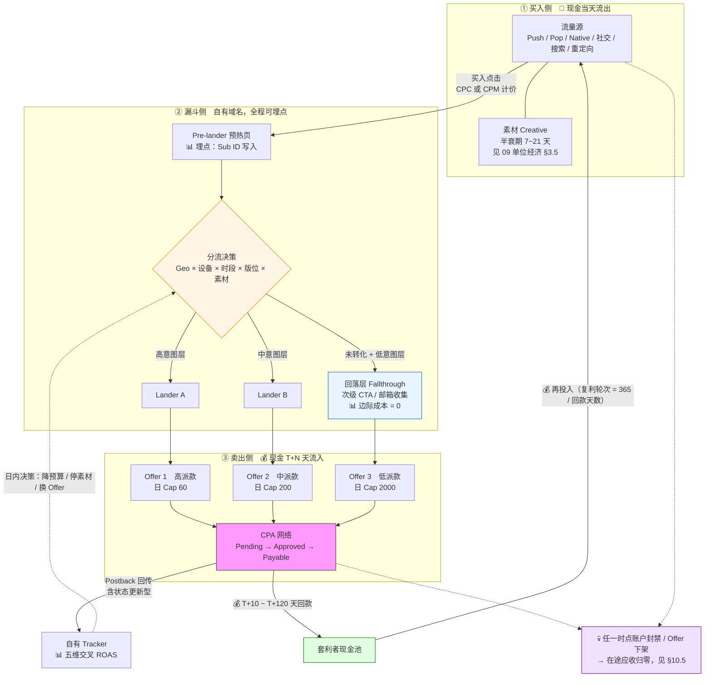
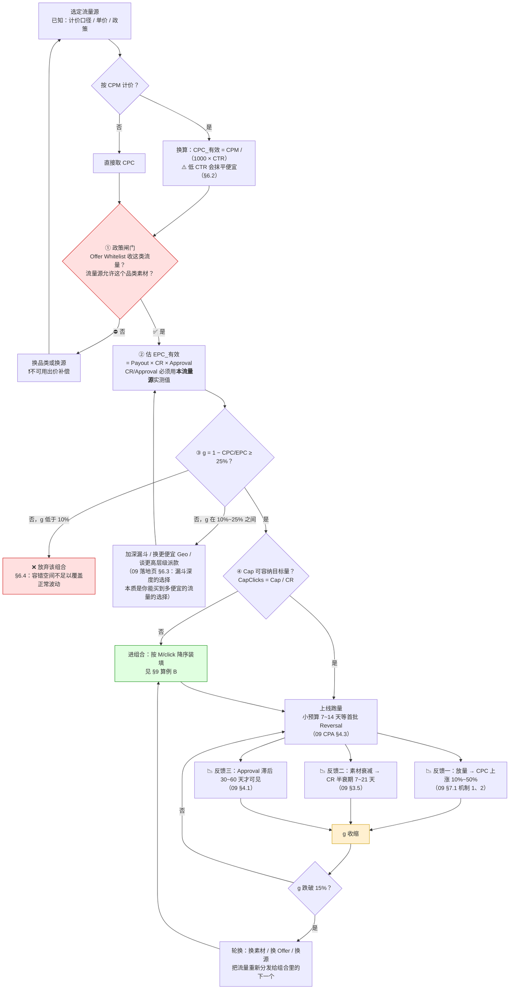
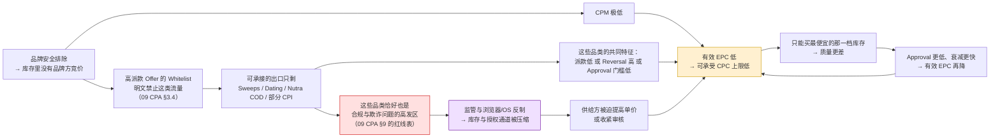
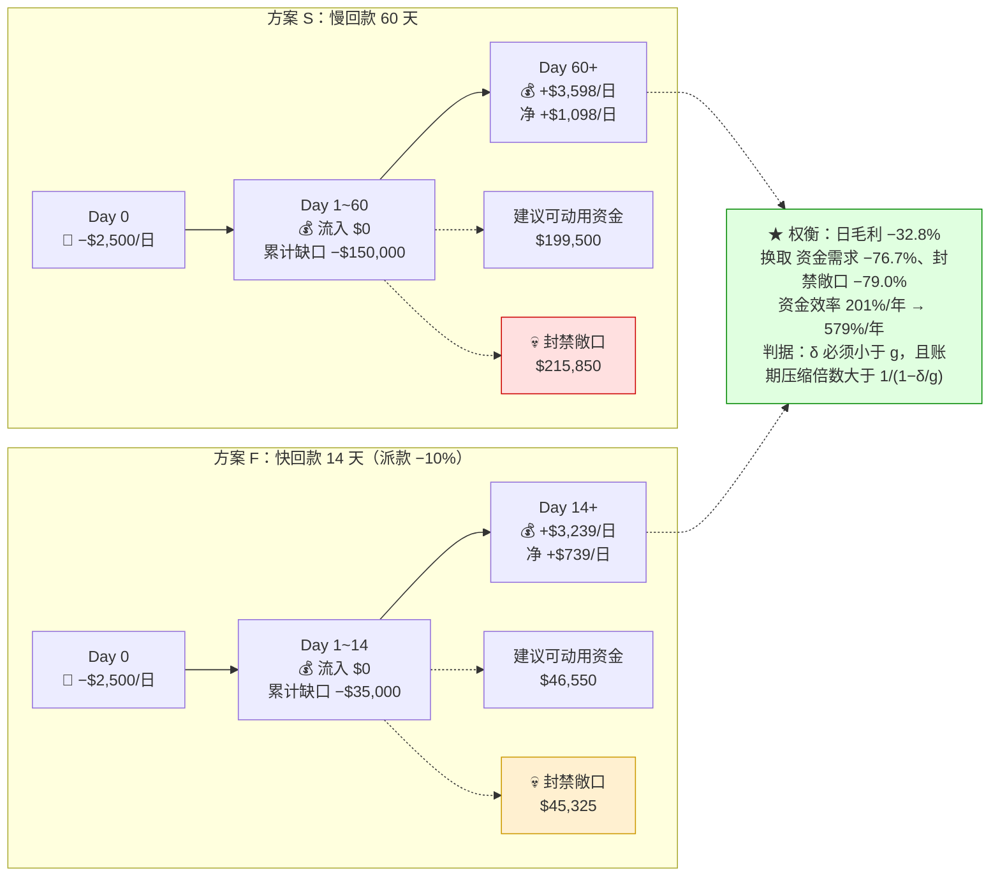

# 联盟套利漏斗

> **一句话定位**：本篇讲的是套利的第三种形态——**买方套利与联盟营销的交集**：用现金买入低价流量，经自有漏斗加热后，卖给出价最高的 CPA Offer 派款出口，赚的是「有效 EPC − 有效 CPC」这条极薄的差价带。它共用联盟的漏斗与追踪技术，但**动机方向、毛利结构、敏感度排序与生存周期全部相反**。
>
> **核心结论先行**：
> 1. **方向反转决定一切**：Affiliate 是"我有流量资产，找货来变现"；套利者是"我买流量，找最高派款的出口"。前者的约束是流量供给，后者的约束是**出口宽度与毛利率**。
> 2. **套利场景的毛利率 g 通常在 20%~40%，而 09 目录确立的联盟买量基准是 g = 88.5%。** 这一个数字差异把 09 的核心结论**整体反转**：在 g = 88.5% 时"CPC 是最不敏感的变量"（±20% → 毛利 −3%），在 g = 28.8% 时 **CPC 的敏感度升到 ∓49.5%，与收入侧变量只差 1.4 倍**。套利者必须盯出价，联盟玩家可以只盯转化率。
> 3. **由此推出本篇的统一解析式**（与 09 的 `|ΔM/M| = 0.2(1−g)/g` 同源）：**收入侧变量的容错空间恰好等于 g；成本侧变量的容错空间等于 g/(1−g) = ROAS − 1；单 Offer 超投的容忍倍数也等于 ROAS。** 09 §3.2 的三条盈亏平衡线与 §3.3 的超投亏损点，都能被这一个式子复现。
> 4. **组合优化在联盟场景是"优化项"，在套利场景是"生存项"**：ROAS 8.68 的漏斗可以粗放超投 8.68 倍才归零；ROAS 1.49 的漏斗超投 2.29 倍当日即亏（算例 B：−$880/日）。
> 5. **同样赚 $1,000/日毛利，套利漏斗的日消耗是联盟买量的 17.5 倍**（算例 C）。09 的 $45,000 垫资基准（日投 $500 × 90 天）在套利场景只够支撑 **约 20 天**的账期——这就是套利者被迫接受"派款低 5%~15% 换周结/日结"的根本原因。
> 6. **Push / Pop 的"便宜"是 CPM 口径的幻觉**：`有效 CPC = CPM / (1000 × CTR)`，低 CTR 会把便宜抹平甚至反转（§6.2 换算表）。
>
> **与 09 目录的分工**：本篇**只写套利者视角的增量**。联盟体系与四方模型、佣金模型与 Cookie Duration、漏斗各层的通用设计、追踪链路与 Postback、CPA 网络盘点与 Offer 条款、扣量识别、工具链与规模化路径——这些已在 [`../09_联盟营销Affiliate/`](../09_联盟营销Affiliate/) 的 11 篇里讲透，本篇一律**引用不重复**，每处引用都给出具体文件与章节号。
>
> **红线声明**：本篇立场是**认知与防守**（[`README.md`](./README.md) §立场与红线）。合法公开平台可点名（Meta / TikTok / Google Ads / Taboola / Outbrain）；**Push / Pop 流量的具体供应商、cloaker、反检测浏览器、具体 Offer 名称一律不点名**，只讲类别与经济学。**不写建站步骤、不写规避审核技巧、不写如何绕过平台风控。**
>
> **可信度标签**：`[标准]` 官方明文　`[政策]` 平台公开政策（标时点）　`[惯例]` 行业共识　`[推断]` 待验证推导
>
> 最后更新：2026-09-11

---

## 1. 本篇的边界：写什么、不写什么

### 1.1 与 09 目录的分工表（去重契约）

| 主题 | 已在哪里讲透 | 本篇做什么 |
|---|---|---|
| 联盟四方模型、角色诉求、风险分配 | [`../09_联盟营销Affiliate/Affiliate体系总览.md`](../09_联盟营销Affiliate/Affiliate体系总览.md) §2 | 不重复。只借用其"方向反转"论断（§4.1）作为本篇 §2 的起点 |
| 三种"联盟"的严格区分（Affiliate / CPA / Ad Network） | 同上 §3.1 | 不重复。本篇全程使用其术语口径 |
| 佣金模式、Cookie Duration、Override、结算与网络抽成 | [`../09_联盟营销Affiliate/联盟角色与佣金模型.md`](../09_联盟营销Affiliate/联盟角色与佣金模型.md) §2~§7 | 不重复。本篇只讨论 CPA 固定派款口径 |
| 漏斗各层作用、Pre-lander / Lander / Bridge / Advertorial 的区分、A/B 测试与最小样本量 | [`../09_联盟营销Affiliate/落地页与转化漏斗设计.md`](../09_联盟营销Affiliate/落地页与转化漏斗设计.md) §1~§7 | 不重复。本篇 §8 只写**套利特化的取向差异**，并复现其 §6.3 的结论在 CPA 低派款口径下依然成立 |
| 追踪链路、Postback 双向对接、Sub ID、17 个丢单点 | [`../09_联盟营销Affiliate/联盟追踪技术与Postback.md`](../09_联盟营销Affiliate/联盟追踪技术与Postback.md) §2~§8 | 不重复。本篇只指出**分流决策依赖 Sub ID 的五维交叉**这一条用途 |
| CPA 网络形态、Offer 十二大品类与派款量级、条款（Cap / Exclusive / Whitelist / Vertical）、Offer 生命周期、派款剥离层级 | [`../09_联盟营销Affiliate/CPA网络与Offer市场.md`](../09_联盟营销Affiliate/CPA网络与Offer市场.md) §1~§6 | 不重复。本篇 §5 的矩阵**直接使用其 §2.1 的品类与派款量级**作为列头 |
| 扣量的数学不可证明性、检测方法 | [`../09_联盟营销Affiliate/联盟反作弊与扣量.md`](../09_联盟营销Affiliate/联盟反作弊与扣量.md) §3 | 不重复。本篇 §12 只写**Offer 方如何用机制设计降低被套利的暴露面** |
| 单位经济公式体系、敏感性通式、Cap 锁死纵向放量、垫资矩阵、封禁敞口、S0~S5 规模化路径、工具链与团队 | [`../09_联盟营销Affiliate/Affiliate单位经济与规模化.md`](../09_联盟营销Affiliate/Affiliate单位经济与规模化.md) §1~§10 | **本篇的公式与算例全部挂在其骨架上**，只代入套利场景参数并推导新结论 |
| 邮件列表作为唯一"自有资产" | [`../09_联盟营销Affiliate/邮件营销与私域List.md`](../09_联盟营销Affiliate/邮件营销与私域List.md) §1、§3.4 | 不重复。本篇 §9.4 只把"回落层收邮箱"当作**残值变现的一条腿**，价值核算交给该篇 §8 |
| 套利通用毛利公式与敏感性 | [`套利单位经济与毛利模型.md`](./套利单位经济与毛利模型.md) | 本篇是该篇在**联盟出口**这一特例上的落地，不重推通用公式 |

### 1.2 本篇的五个增量（读完能拿到的新东西）

| # | 增量 | 所在章节 |
|---|---|---|
| 1 | **动机反转对照表**：方向差如何导致能力模型、风险结构、时间偏好、资产负债表结构全面不同 | §2 |
| 2 | **流量源 × Offer 品类套利矩阵**：哪种流量配哪类 Offer 才有正毛利，以及背后的四因子因果 | §5 |
| 3 | **容错空间解析式**：把 09 的三条盈亏平衡线、超投亏损点、敏感性通式统一成一个式子，并证明它在低 g 下反转 | §6 |
| 4 | **Push / Pop 的经济学与 CPM 幻觉**：为什么便宜、为什么质量差、为什么变现出口窄、为什么是欺诈高发区 | §7 |
| 5 | **组合优化与残值变现的算例**：Cap 存在时为什么组合是必需而非可选，回落层为什么按 EPC 而非毛利计贡献 | §9 |

---

## 2. 动机反转：从"有流量找货"到"买流量找出口"

[`../09_联盟营销Affiliate/Affiliate体系总览.md`](../09_联盟营销Affiliate/Affiliate体系总览.md) §4.1 已确立一条关键论断：**Affiliate 的受众筛选发生在投放之前**（用户带着意图来读内容），而程序化广告是"先有曝光再找人"。本篇把这条论断再推一步：

> **套利者是第三种方向——受众筛选发生在投放之后，且发生在自己花钱买来的流量上。**
> Affiliate 用内容**聚集**了对的人再找货；套利者用出价**买入**不知道是谁的人，再用漏斗把他们**筛成**某个 Offer 要的人。

这个差别不是修辞，它决定了下面 12 个维度的全部差异 `[推断]`：

| 维度 | 内容型 Affiliate | **联盟套利者** | 差异的根源 |
|---|---|---|---|
| **起点资产** | 流量资产（域名权重、SEO 排名、邮件列表、粉丝） | **现金 + 漏斗工程能力** | 一个从资产出发，一个从资金出发 |
| **决策顺序** | 先有受众 → 再选 Offer | **先选 Offer（看派款）→ 再去找能配得上的流量** | 出口决定入口 |
| **核心稀缺资源** | 优质流量的供给（内容产能、关键词库存） | **变现出口的宽度**（有多少 Offer 愿意接我的流量、Cap 多大） | 见 §7.4 的出口自选择闭环 |
| **核心能力** | 选题、E-E-A-T、内容生产、SEO | 出价与预算节奏、素材产能、**分流与漏斗工程**、现金管理 | 09 §9.1 的编制建议在套利场景要再往创意与工程倾斜 |
| **时间偏好** | 长期（内容可产生 2~5 年尾流） | **极短**（停投即停收，无尾流；素材半衰期 7~21 天） | 09 CPA §1.1 已确立"无尾流"；本篇强调它使**周转率成为唯一的增长杠杆** |
| **单位毛利率 g** | 高（免费流量的 CPC = 0 → g = 100%，约束在产能） | **低（20%~40%）** | 本篇全部结论的源头，见 §6 |
| **失败模式** | 渐进（算法更新有流量曲线可见，可逐月调整） | **断崖**（账户封禁、Offer 下架、Cap 突降，零前兆） | 09 §5.4、§12 误解 6 |
| **资产负债表** | 会**积累**（域名权重、列表、SOP 可估值可出售） | **不积累**（素材衰减、账户信誉归零、无自有受众） | 09 §11.2「海外推广者的规模化会积累资产负债表」在套利场景**不成立** |
| **对 Offer 的态度** | 选品（看佣金率、客单价、品牌匹配度） | **选出口**（看有效 EPC、Cap、回款速度、Whitelist 是否收我的流量） | Offer 是可替换的阀门，不是合作关系 |
| **对流量源的态度** | 流量源是命脉，要长期养 | **流量源是原料，随时可换** | 换源成本低于换品类成本 |
| **规模化的数学结构** | 内容型：对数（关键词枯竭）；买量型：加法 | **纯加法**，且加法项数量受 Cap 与出口宽度硬约束 | 09 §3.3 已确立加法结构；本篇 §9 深化到组合层 |
| **声誉的作用** | 是资产（信任直接转化为 CR 与 Bump 谈判力） | **接近于零**（一次性博弈，用户不会再来） | 这条决定了 §8.3 的道德风险结构 |

### 2.1 反转带来的三个非显然推论

**推论一：套利者的"选品"其实是"选流量的可承接性"** `[推断]`
内容型 Affiliate 问"我的受众会买什么"；套利者问"**我这个流量源允许我推什么、且哪个 Offer 的 Whitelist 收我这类流量**"。
所以套利者的第一道筛子不是派款高低，而是 [`../09_联盟营销Affiliate/CPA网络与Offer市场.md`](../09_联盟营销Affiliate/CPA网络与Offer市场.md) §3.4 的 **Traffic Source Whitelist**——大量高派款 Offer 明文禁止 Push / Pop / Incentivized 流量。§5 的矩阵因此必须先过"政策闸门"这一层，再算毛利。

**推论二：套利者对现金流的要求高一个数量级** `[推断]`
因为 g 低，同样的利润额需要**大得多的消耗量**（§10.4 给出精确倍数 17.5×）。所以 09 §4 的垫资矩阵在套利场景要整体右移——这不是"更谨慎"，是结构性放大。

**推论三：套利者无法用"分散"解决核心风险，只能用"周转"解决** `[推断]`
09 §10.2 的六维分散在套利场景有一条失效：**同一流量源上的多个 Offer 相关性 = 1**（09 §12 误解 4 已指出）。而套利者的收入几乎全部来自 1~2 个流量源，因为跨源的素材规格、竞价逻辑、漏斗参数都要重学一遍，学习成本在 g = 30% 的薄利下收不回来。
→ 所以套利者的真实对冲手段不是分散，是**把回款周期压到最短**（§10.3）与**把单次事故的绝对敞口压到最小**（余额低位、快提现）。

### 2.2 术语：政策套利

**政策套利**（Policy Arbitrage / Regulatory Arbitrage）
- 定义：利用不同平台、不同司法辖区或不同品类的**规则宽严差异**获取收益，而不是利用生产效率差异。
- 通俗解释：同一件商品在 A 市场禁卖、在 B 市场可卖，把货从 A 搬到 B 就能加价——加价部分不是你的劳动，是规则的差价。
- 易混提示：与**信息差套利**不同（信息差会被情报工具抹平，规则差不会）；与**定价机制套利**也不同（后者见 [`Prebid与HeaderBidding套利.md`](./Prebid与HeaderBidding套利.md)，赚的是拍卖机制的钱）。
- 在本篇的位置：§4 的第 ③ 问「差价从哪来」的四个来源之一，也是 §11 第 4 重挤压的作用对象。

---

## 3. 套利漏斗的完整链路：钱与数据的双向流

[`../09_联盟营销Affiliate/Affiliate体系总览.md`](../09_联盟营销Affiliate/Affiliate体系总览.md) §2.2 的资金流图是**以商家为中心**的；本篇重画一张**以套利者为中心**的图，因为套利者的关注点完全不同——他关心的是"现金哪天出去、哪天回来、中间被几个 Cap 卡住"。



**读图五条要点** `[推断]`：

1. **三个方框的现金时点完全不同**：①当天流出、②无现金、③ T+10~T+120 天流入。这个错位就是 §10 的全部内容。
2. **分流决策（菱形）是本篇相对 09 的唯一结构性新增**。09 的漏斗是**单出口串联**（Pre → Lander → Offer）；套利漏斗是**多出口并联 + 回落**，因为单一 Offer 的 Cap 会硬截断收入（09 §3.3）。
3. **回落层的边际成本是 0**——流量已经买过了。所以它的贡献应按**全额 EPC** 计入毛利，而不是 `EPC − CPC`。这是 §9.4 算例的关键口径，也是最容易被算错的地方。
4. **Postback 必须接收"状态更新型"回传**（Pending → Reversed），否则你看到的 ROAS 是未扣 Reversal 的假账。机制见 [`../09_联盟营销Affiliate/Affiliate单位经济与规模化.md`](../09_联盟营销Affiliate/Affiliate单位经济与规模化.md) §8.1，本篇不重复。
5. **反馈回路的时延不对称**：CPC 与 CR 是**日内可见**的，Approval Rate 是 **30~60 天后**才可见的（09 §4.1）。所以套利者的日内决策只能基于两个变量，而第三个变量的恶化要一个月后才知道——这是 §11 第 2 重挤压难以预防的技术原因。

### 3.1 与内容型漏斗的三处结构差异

| 结构项 | 内容型联盟漏斗 | **套利漏斗** | 为什么必须不同 |
|---|---|---|---|
| **出口数量** | 通常 1~3 个（内容与品类强绑定） | **同时 3~20 个在跑，池 40~60 个** | Cap 锁死纵向放量（09 §3.3），只能横向扩；池的深度还要覆盖测试损耗 |
| **流量分配** | 内容决定，用户自选路径 | **由分流规则主动分配**（按 Geo/设备/时段/版位/素材） | 同一批买入流量要按意图强度匹配到不同派款的出口，否则高派款 Offer 的 Approval 会崩 |
| **回落机制** | 少（内容是终点，外链是唯一出口） | **必备**（未转化流量占 96%~99%，必须有第二次变现机会） | g 只有 20%~40%，一次转化机会的期望值撑不起 CPC |

---

## 4. 5 问框架完整走查

[`README.md`](./README.md) §写作要点 1 规定所有流派用同一框架。以下逐问作答；**第 ⑤ 问的完整推导在 §11 独立成节**（框架要求）。

### ① 买什么流量？

| 流量源类别 | 计价口径 | 单价量级 `[惯例]` 2026-09 | 意图强度 | 可规模化程度 | 政策闸门（能推什么品类） | 详见 |
|---|---|---|---|---|---|---|
| **Push 通知广告** | 多为 CPM，部分 CPC | CPM 极低（个位数美元量级）；**有效 CPC 见 §6.2 换算表** | ★（近乎为零） | 很高（库存海量） | **最宽**（主流平台禁投的品类这里能跑） | §7 |
| **Pop / Popunder** | CPM | 同上，通常更低 | ★ | 很高 | **最宽** | §7 |
| **Native / 信息流** | CPC | 中低（T2 显著低于 T1） | ★★ | 高 | 中（有编辑政策与品类审核） | [`信息流套利-Taboola-Outbrain.md`](./信息流套利-Taboola-Outbrain.md) |
| **社交买量（Meta / TikTok）** | CPM / oCPM | 中高，且随竞争持续上行 | ★★~★★★（可靠定向补偿） | 很高 | **窄**：对 Nutra / Crypto / Adult / Dating / Sweeps 有明确限制或禁投（09 CPA §2.2 ①，`[政策]` 时点 2026-09，需以当期平台政策复核） | §5.4 |
| **搜索买量（Google Ads / Microsoft Ads）** | CPC | **最高**（交易词竞价激烈） | ★★★★★（用户主动表达意图） | 中（受关键词库存与质量分约束） | **最窄**（品牌词、金融、健康都有专门限制） | [`搜索套利与域名停放.md`](./搜索套利与域名停放.md) |
| **展示重定向** | CPM | 中 | ★★★~★★★★（已访问过，意图可推断） | 中（受隐私法规与 Cookie 限制挤压） | 中 | §5.4 |

> **口径警告**：上表的"单价量级"故意不给具体数字。原因是①各源的报价随 Geo、季节、库存周期波动可达 3~10 倍；②Push / Pop 的 CPM 报价与有效 CPC 之间隔着一个 CTR，直接比价会得出完全错误的结论（§6.2）。**任何具体单价都必须用自己的实测数据，本篇只提供换算方法。** 地域差价的结构见 [`../08_海外广告生态/海外流量Tier分层与地域特征.md`](../08_海外广告生态/海外流量Tier分层与地域特征.md)。

### ② 卖什么收益？

**本篇只讨论一个出口：CPA Offer 的固定派款（Payout）。** 这与本目录其他篇的出口不同：

| 出口类型 | 收益口径 | 量纲 | 本篇是否讨论 |
|---|---|---|---|
| **CPA Offer 派款** | 每个 Approved 转化固定金额 | $/转化 | ✅ 本篇主线 |
| 展示广告收入 | RPM / eCPM | $/千次展示 | ❌ 见 [`AdSense套利与MFA站.md`](./AdSense套利与MFA站.md)、[`信息流套利-Taboola-Outbrain.md`](./信息流套利-Taboola-Outbrain.md) |
| 搜索页广告分成 | RSOC / AFD 类 | $/千次搜索 | ❌ 见 [`搜索套利与域名停放.md`](./搜索套利与域名停放.md) |
| 自建产品 | LTV | $/用户 | ❌ 见 [`套利模式总览与分类.md`](./套利模式总览与分类.md) |

**量纲不可直接比较**：CPA 出口按**转化**计价，展示出口按**千次展示**计价。要横比必须统一到"每千次买入点击的收入"这个口径：

```
派款出口：  R_1000clicks = 1000 × CR_total × Approval × Payout
展示出口（按展示计价）：R_1000clicks = (落地页广告展示数 / 买入点击数) × RPM
展示出口（按点击计价，如 AFD / RSOC）：R_1000clicks = 1000 × CTR_广告位 × CPC_出口
```

这条换算是 [`套利单位经济与毛利模型.md`](./套利单位经济与毛利模型.md) 的主题，本篇只在 §15 追问 2 给出方向性结论。
**注意 RPM 口径陷阱**：分母是 PV 还是 session 可差 1.5~2.5 倍，T1 与 T3 可差 5~20 倍——比价前必须统一口径。

### ③ 差价从哪来？

`[推断]`　四个来源，按可持续性从低到高排：

| # | 差价来源 | 机制 | 可持续性 | 会被谁抹平 |
|---|---|---|---|---|
| 1 | **信息差** | 你不知道这个 Offer 的真实 Approval Rate，AM 也不知道你的流量真实质量 | **最低**（2~8 周） | 素材情报工具、AM 网络、玩家社区（09 CPA §5.1、§8.2） |
| 2 | **定价口径差** | 流量源按 CPM 卖、Offer 按 CPA 买，中间的风险由套利者承接 | 中 | 流量源转向 CPC/oCPM 计价、Offer 方转向 Rev Share |
| 3 | **政策套利** | 主流平台禁投的品类在宽松渠道有溢价（§2.2） | 中高 | 宽松渠道自身收紧政策、监管介入（§11 第 4 重） |
| 4 | **风险溢价** | 套利者承接了**广告主不愿承接的转化风险**与**流量源不愿承接的质量风险** | **最高** | 不会被抹平，但会被压缩到接近资金成本 |

> **本节的核心论点** `[推断]`：**联盟套利的差价主要不是"低买高卖"的价差，而是风险承接的报酬。**
> 广告主用固定 CPA 把"花了钱没转化"的风险外包出去（09 体系总览 §1.2 已确立这条风险转移方向）；流量源用 CPM 把"曝光了没人点"的风险外包出去。**套利者同时站在两个外包的接收端**，他赚的是这两份风险的溢价。
> 这个解释比"信息差"更有预测力：它说明为什么这个玩法**永远不会完全消失**（风险总要有人接），也说明为什么它的利润率**永远会被压到接近资金成本**（接风险的人一多，溢价就摊薄）。§11 的四重挤压本质是"压缩风险溢价"的四个方向。

### ④ 毛利结构？

```
【本篇口径：CPA 出口，净额 Payout】
  EPC_有效 = Payout × CR_total × Approval Rate
  每点击毛利 M = EPC_有效 − CPC_有效
  毛利率 g = M / EPC_有效 = 1 − CPC_有效 / EPC_有效
  ROAS = EPC_有效 / CPC_有效 = 1 / (1 − g)
  日毛利 = Σ_i min(Clicks_i, CapClicks_i) × M_i + 回落层收入 − 固定成本

  其中 CPC_有效 = CPM / (1000 × CTR)      ← 当流量源按 CPM 计价时必须先换算（§6.2）
       CapClicks_i = Cap_i / CR_i          ← Cap 折算成点击上限（09 §3.3 的推广）
```

- 与 09 §1.3 的口径声明一致：**CPA 的 Payout 已是净额**（网络抽成在上游剥离，09 CPA §6.2），所以公式里不再乘 `(1 − 网络抽成)`；CPS 出口才需要。
- 敏感性通式沿用 09 §5.1：收入侧 `|ΔM/M| = 0.2/g`，成本侧 `|ΔM/M| = 0.2(1−g)/g`，敏感度比 `1/(1−g)`。
- **本篇新增**：容错空间解析式与超投容忍倍数，见 §6.3。
- 完整算例见 §6（算例 A）、§9（算例 B）、§10（算例 C）。

### ⑤ 为什么会被消灭？

**摘要**：四重挤压同时作用于 g 的两个组成项——**流量源涨价与平台风控抬 CPC，Offer 方降派款与合规收紧压 EPC**。在 g = 28.8% 的基准上，三个各 10% 的温和扰动叠加就能把 g 打到 3.3%；同样三个扰动在 09 的 g = 88.5% 基准上只让 g 降到 84.3%，几乎无感。**套利不是被某一次打击消灭的，是被一系列 10% 级别的温和变化连续挤压到 g → 0 的。**

→ **完整推导见 §11。**

---

## 5. 流量源 × Offer 品类套利矩阵

### 5.1 判据：可行域条件

`[推断]`　一个「流量源 × 品类」组合有正毛利，必须同时满足三个条件：

```
【条件一：政策闸门】
  该品类的 Offer Whitelist 收这类流量　AND　该流量源的审核政策允许这个品类的素材
  → 任一不满足：不是"毛利低"，是"账户没了"。这一层必须先过，不能拿毛利去换。

【条件二：毛利可行域】
  Payout × CR(意图强度, 品类) × Approval(意图强度, 品类) > CPC_有效(源, Geo) / (1 − g_target)
  → g_target 建议 ≥ 25%。低于此值时 §6.4 的容错空间不足以覆盖任一变量的正常波动。

【条件三：Cap 可容纳】
  CapClicks = Cap / CR ≥ 你的日点击目标 × 分发比例
  → 不满足则该组合无法承载规模，只能作为组合中的一个填充项（§9）
```

**四因子的因果链**：`意图强度` 同时驱动 `CR` 与 `Approval`（意图强 → 转化多且有效），而 `意图强度` 与 `流量成本` 正相关（意图强的流量人人都要）。所以矩阵的本质是：

> **派款必须高到足以覆盖"意图强度 × 流量成本"这条正相关曲线，同时品类的 Approval 门槛必须低到允许冷流量通过。**
> 高派款品类（Finance / Lead Gen）通常 Approval 门槛也高 → 需要热流量 → 需要贵流量 → 毛利被吃掉；
> 低门槛品类（Sweeps / Dating 注册）Approval 宽松但派款低 → 只能靠量 → 需要极便宜的流量。
> **矩阵里能赚钱的格子，几乎都落在"便宜流量 × 低门槛品类"与"贵流量 × 高派款品类"这两个对角块上；中间地带（贵流量 × 低派款、便宜流量 × 高门槛）系统性地亏钱。**

### 5.2 矩阵表（毛利可行性）

图例：`✅` 结构性可行　`⚠️` 边缘（需极优执行或特定时点）　`❌` 结构性不可行　`⛔` 政策闸门直接封死（不进毛利计算）
品类与派款量级取自 [`../09_联盟营销Affiliate/CPA网络与Offer市场.md`](../09_联盟营销Affiliate/CPA网络与Offer市场.md) §2.1；意图强度与 CPC 量级为 `[惯例]` + `[推断]`，时点 2026-09，**非报价**。

| 流量源 \ Offer 品类 | Sweeps / Email Submit<br/>派款 $0.3~$5 | Dating 注册 / 付费<br/>$0.5~$80 | Nutra COD<br/>$15~$60 | App Install (CPI)<br/>$0.1~$8 | Lead Gen（家装/太阳能）<br/>$10~$100 | 订阅首单<br/>$10~$60 | Finance（贷款/开户）<br/>$5~$500 | 电商 CPA<br/>$5~$40 |
|---|---|---|---|---|---|---|---|---|
| **Push 通知** | ✅ 主力组合 | ✅ 主力组合 | ✅（**Approval 是命门**，COD 拒收率 30%~60%） | ⚠️ 派款低、留存判定易被拒 | ❌ 意图太弱，合格线索率极低 | ⚠️ | ⛔/❌ 多数金融 Offer 明文禁 Push | ❌ 派款不足以覆盖回落成本 |
| **Pop / Popunder** | ✅（但**合规暴露面最高**） | ✅ | ⚠️ 误点导致 Approval 崩塌 | ⚠️ | ❌ | ⚠️ | ⛔/❌ | ❌ |
| **Native / 信息流** | ⚠️ 派款太低，撑不起 Native 的 CPC | ✅ | ✅ **经典组合**（Advertorial 加热冷流量） | ⚠️ | ✅ **经典组合** | ✅ | ⚠️ 部分可做，合规审查严 | ⚠️ |
| **社交买量（Meta / TikTok）** | ⛔ 平台政策限制 | ⛔/⚠️ 多数受限 | ⛔ 健康类宣称红线 | ✅ **主流组合**（CPI 是社交买量的天然出口） | ✅（需资质与合规披露） | ✅ | ⚠️/⛔ 需牌照与专门审核 | ✅ |
| **搜索买量（Google / Microsoft）** | ❌ 派款 $0.3~$5 vs 交易词 CPC，数量级不匹配 | ❌ | ⛔/❌ 健康类限制 | ⚠️ 品牌词与品类词可行 | ✅ **意图最匹配**（用户已在找服务） | ✅ | ✅ **意图最匹配** | ✅ |
| **展示重定向** | ❌ | ⚠️ | ⚠️ | ✅（对已点击未安装者最有效） | ✅ **最佳组合之一**（已访问过表单页） | ✅ | ✅ | ✅ |

### 5.3 矩阵的四条读法

`[推断]`

1. **对角结构清晰可见**：左上（Push/Pop × Sweeps/Dating/Nutra）与右下（搜索/重定向 × Lead Gen/Finance）是两个可行块。中间地带系统亏损。
2. **⛔ 与 ❌ 必须分开**：⛔ 是**政策闸门**（09 CPA §2.2 ①、§3.4），踩了是账户损失；❌ 是**毛利不可行**，踩了只是亏钱。前者不可用出价补偿，后者可以（换 Geo、加深漏斗、换品类）。**把 ⛔ 当 ❌ 处理是新手最常见的致命错误。**
3. **社交与搜索买量做联盟套利，本质是在跟品牌广告主竞价**：它们的库存里有大量品牌方在出价，套利者能承受的 CPC 上限（= EPC_有效）通常低于品牌方的 LTV 承受力。所以这两个源上**只有高派款、高意图品类能活**（CPI、Lead Gen、Finance），低派款品类结构性出局。
4. **Push / Pop 的出口最窄**：能接它的品类只有 Sweeps / Dating / Nutra / 部分 CPI —— 全部是 Approval 门槛低、派款低或 Reversal 高的品类。§7.4 会证明这个"窄"不是巧合，是**自选择的结果**。

### 5.4 匹配决策与反馈回路



**这张图的两个非线性节点**：
- **GATE（政策闸门）是不可用出价补偿的硬节点**。它前面的所有毛利计算在这一层都可能作废。
- **GSHRINK（g 收缩）是三个反馈的汇合点**。注意 FB3 的时滞：Approval 的恶化要 30~60 天后才进入报表，所以**当你在报表里看到 g 收缩时，真实 g 已经更低了**。这是套利者"昨天还赚钱今天就亏"的技术解释。

---

## 6. 算例 A：低毛利场景的盈亏平衡与敏感性反转

### 6.1 基准设定

`[推断]`　**以下全部数字为假设值，用于展示计算结构与杠杆关系，不构成收益预测。** 参数区间取自 09 CPA §2.1（品类派款）、§7.2（漏斗各层 CR）、09 单位经济 §3.6（现实校准场景的 g 量级）。

```
场景 A1（主场景）：Push 流量 → 中派款 Offer（订阅首单 / Dating 付费 / 低档 Lead Gen 一档）

  Payout          $18.00     ← 09 CPA §2.1：订阅首单 $10~$60、Dating 付费 $20~$80 的下沿
  CR_total        1.20%      ← 冷流量 + 两页漏斗；区间 0.6%~2.5%
  Approval Rate   65%        ← 冷流量的 Approval 显著低于 09 基准的 75%；区间 50%~80%
  流量源报价      CPM $1.50   ← 区间 $0.3~$3.0（T2，[惯例] 2026-09，非报价）
  CTR             1.50%      ← 区间 0.3%~2.5%
  → CPC_有效 = 1.50 / (1000 × 0.015) = $0.100

  EPC_有效 = 18 × 0.012 × 0.65 = $0.1404
  每点击毛利 M = 0.1404 − 0.100 = $0.0404
  毛利率 g = 0.0404 / 0.1404 = 28.8%        ← 落在套利典型区间 20%~40%
  ROAS = 1.404
```

**日口径**（日预算 $2,500 → 25,000 clicks）：

| 项目 | 数值 | 计算 |
|---|---|---|
| 日点击 | 25,000 | $2,500 / $0.10 |
| 日转化（提交） | 300 | 25,000 × 1.2% |
| 日 Approved | 195 | 300 × 65% |
| 日收入 | $3,510 | 195 × $18 |
| 日流量成本 | $2,500 | — |
| **日毛利** | **$1,010** | 25,000 × $0.0404 |
| 毛利率 g | **28.8%** | 1,010 / 3,510 |

### 6.2 关键机制：CPM 幻觉

**有效 CPC**（Effective CPC）
- 定义：把按 CPM（或其他非点击口径）计价的流量，换算成"每一次真实到达点击"的成本。
- 通俗解释：广告主报的是"一千次曝光多少钱"，但你的收入是按点击算的——中间隔着一个点击率，点击率越低，每个点击越贵。
- 易混提示：与流量源后台显示的 "CPC" 不同。部分源的后台会用**宽松口径的点击**（含误触、含返回后的二次计数）来压低显示 CPC，实际有效 CPC 更高。判据见 09 落地页 §1.2 的 "平台报的点击数 ≠ 你页面收到的访问数，差 5%~15% 是常态"。

```
CPC_有效 = CPM / (1000 × CTR_真实到达)
```

`[推断]`　**换算表（美元）**——这张表是本篇最实用的一张，它解释了为什么"买最便宜的流量"经常是最贵的选择：

| CPM \ 真实 CTR | 0.3% | 0.6% | 1.0% | 1.5% | 2.5% |
|---|---|---|---|---|---|
| **$0.50** | $0.167 | $0.083 | $0.050 | $0.033 | $0.020 |
| **$1.00** | $0.333 | $0.167 | $0.100 | $0.067 | $0.040 |
| **$1.50** | $0.500 | $0.250 | $0.150 | **$0.100** ← A1 | $0.060 |
| **$2.00** | $0.667 | $0.333 | $0.200 | $0.133 | $0.080 |
| **$4.00** | $1.333 | $0.667 | $0.400 | $0.267 | $0.160 |

**三条读法**：

1. **CPM $0.50 + CTR 0.3% 的有效 CPC（$0.167）比 CPM $2.00 + CTR 2.5%（$0.080）贵一倍。** 报价便宜 4 倍的流量，实际点击成本贵 109%。**只比 CPM 是套利新手的第一大坑。**
2. **A1 场景的 EPC_有效 = $0.1404，对照上表**：CPM $1.50 时，CTR 必须 ≥ 1.1%（1.5/(1000×0.0011) ≈ $0.136 < $0.1404）才不亏。**CTR 从 1.5% 掉到 1.0%，有效 CPC 从 $0.100 涨到 $0.150，直接越过盈亏平衡线**——而这个 CTR 波动幅度在 Push 流量上属于日常。
3. **CTR 是成本侧变量，但它不在你的出价后台里**。你控制的是 CPM 出价与素材；CTR 由素材 × 受众疲劳 × 版位共同决定，且随素材衰减单调下降（09 §3.5）。**所以按 CPM 计价时，素材衰减会从两条路同时打击你：CR 下降压 EPC，CTR 下降抬有效 CPC。** 这是 CPM 计价流量特有的双重打击，CPC 计价下只有一条。

### 6.3 容错空间解析式（本篇的统一式）

`[推断]`　从 `M = R − C`、`g = M/R` 出发（R = EPC_有效，C = CPC_有效），可以直接解出**每个变量还能坏多少**：

```
【收入侧变量】（Payout、CR、Approval，三者都只进 R）
  相对下降 x 后：M' = R(1−x) − C = R(g − x)
  → M' = 0 当 x = g
  ★ 收入侧容错空间 = g

【成本侧变量】（CPC，只进 C）
  相对上升 y 后：M' = R − C(1+y) = R[1 − (1−g)(1+y)]
  → M' = 0 当 y = g/(1−g) = ROAS − 1
  ★ 成本侧容错空间 = g/(1−g) = ROAS − 1

【单 Offer 超投容忍倍数】（09 §3.3 的一般化）
  Cap 内点击 C₀，超投到 x·C₀：毛利 = C₀(EPC − x·CPC)
  → 归零当 x = EPC/CPC = ROAS
  ★ 超投容忍倍数 = ROAS = 1/(1−g)

【敏感度】（09 §5.1 通式，本篇直接沿用）
  收入侧 ±20% → |ΔM/M| = 0.2/g
  成本侧 ±20% → |ΔM/M| = 0.2(1−g)/g
  敏感度比     = 1/(1−g) = ROAS
```

**用这个式子反算 09 的两组基准，验证一致性**：

| 来源 | g | 收入侧容错 = g | 成本侧容错 = g/(1−g) | 超投容忍 = ROAS | 09 原文数值 | 是否复现 |
|---|---|---|---|---|---|---|
| 09 §3.1~§3.3 基准（Payout $45 / CPC $0.35 / CR 9% / Approval 75%） | 88.5% | **−88.5%** | **+770%** | **8.68×** | 盈亏平衡 CR 1.04%（−88%）、盈亏平衡 Approval 8.6%（−88.5%）、盈亏平衡 CPC $3.04（当前的 8.7 倍）、日消耗 $1,688 时毛利归零（= 8.68 × $194） | ✅ 四条全部复现 |
| 09 §3.6 现实校准（CPC $1.80 / CR 6.4%） | 16.7% | −16.7% | +20% | 1.20× | CPC +20% → 毛利归零 | ✅ |

→ **这个式子不是新模型，是 09 已确立数字的一般化。** 它的价值在于：把"能坏多少"从四个独立的盈亏平衡计算压缩成一个只依赖 g 的表达式，从而可以直接比较联盟场景与套利场景的**抗风险余量**。

### 6.4 敏感性对照：结论的完整反转

| 场景 | g | ROAS | **CPC ±20% → 毛利** | 收入侧 ±20% → 毛利 | 敏感度比 | 收入侧容错 | 成本侧容错 | 超投容忍倍数 |
|---|---|---|---|---|---|---|---|---|
| **09 §3.1 联盟买量基准** | 88.5% | 8.68 | **∓2.6%**（原文 −3%） | ∓22.6% | 8.68× | −88.5% | +770% | 8.68× |
| 套利 A2（略优：CR 1.6% / Approval 75% / CPC $0.130） | 39.8% | 1.66 | **∓30.2%** | ∓50.2% | 1.66× | −39.8% | +66.1% | 1.66× |
| **套利 A1（主场景）** | **28.8%** | **1.40** | **∓49.5%** | **∓69.5%** | **1.40×** | **−28.8%** | **+40.4%** | **1.40×** |
| 套利 A3（较差：CR 0.9% / Approval 55% / CPC $0.071） | 20.3% | 1.25 | **∓78.5%** | ∓98.5% | 1.25× | −20.3% | +25.5% | 1.25× |
| 09 §3.6 现实校准（T1 优质流量） | 16.7% | 1.20 | ∓100% | ∓120% | 1.20× | −16.7% | +20% | 1.20× |

**A1 的四条盈亏平衡线**（用 §6.3 的式子直接算，并与逐项求解交叉验证）：

| 求解目标 | 公式 | 数值 | 相对基准的变动 | 与容错式核对 |
|---|---|---|---|---|
| 盈亏平衡 CPC | `CPC_be = EPC_有效` | **$0.1404** | +40.4% | = g/(1−g) ✅ |
| 盈亏平衡 CR | `CPC / (Payout × Approval)` | **0.855%** | −28.8% | = g ✅ |
| 盈亏平衡 Approval | `CPC / (Payout × CR)` | **46.3%** | −28.8% | = g ✅ |
| 盈亏平衡 Payout | `CPC / (CR × Approval)` | **$12.82** | −28.8% | = g ✅ |

> ### ★ 算例 A 的核心结论（本篇最有价值的原创结论之一）
>
> **09 目录确立的"CPC 是最不敏感的变量、老手只盯 CR 与 Approval"这条建议，在联盟套利场景下失效，且方向反转。**
>
> - 在 g = 88.5% 时，敏感度比是 **8.7 倍**——盯 CR 的性价比压倒性地高于盯 CPC，所以 09 §9.1 推出"落地页工程师的价值数量级高于出价优化师"。
> - 在 g = 28.8% 时，敏感度比只有 **1.40 倍**——CPC 的敏感度（∓49.5%）已经与收入侧（∓69.5%）**同一量级**。
> - 更关键的是**动作的有效性反转**：在 g = 88.5% 时"降出价 20%"只能救回 2.6% 的毛利，是无效动作；在 g = 28.8% 时同样的动作能救回 **49.5%** 的毛利，是**最有效的单一动作**。
>
> **实操判据（本篇版，与 09 §5.1 的判据并列使用）**：
> - **g > 60%** → 盯 CR 与 Approval（09 的结论成立）
> - **30% < g < 60%** → 四个都盯，优先 CR
> - **g < 30%（套利常态）** → **CPC 与 CR 同等优先，且"降出价 / 换更便宜的源"是立即可用的止血动作**；同时必须承认 §6.3 的容错空间只有 28.8%，**任何单一变量的正常波动都足以打穿**——所以正确的结构性动作是 §9 的组合化与 §10 的加速周转，而不是继续优化单点。
>
> **推论**：这也解释了为什么套利团队的编制结构与联盟团队不同。09 §9.1 建议"创意 + 落地页工程 : 投放执行 ≈ 2:1 到 3:1"；在 g < 30% 的套利场景，敏感度比接近 1.4，投放执行（出价、预算节奏、源与 Geo 切换）的边际价值大幅上升，**合理配比接近 1:1**，且必须多一个 09 没有的岗位职能：**组合调度**（§9）。

### 6.5 A1 与 09 基准的差异归因（为什么 g 差 3 倍）

`[推断]`　把 A1（g = 28.8%）与 09 §3.1 基准（g = 88.5%）逐项对齐，差在四个地方：

| 变量 | 09 基准 | A1 | 倍数 | 差异来源 |
|---|---|---|---|---|
| Payout | $45 | $18 | 0.40× | 09 用的是 Lead Gen 高派款档；套利场景能接冷流量的品类派款普遍更低（§5.3 读法 1） |
| CR_total | 9.0% | 1.2% | 0.13× | **最大差异项**。09 的 9% 是"Pre-lander 40% → Lander 22.5%"的三页漏斗在 Native T2 上的乐观值；Push 冷流量 + 两页漏斗达不到 |
| Approval | 75% | 65% | 0.87× | 冷流量的无效转化比例更高 |
| CPC | $0.35 | $0.10 | 0.29× | Push 确实便宜——**但只便宜 3.5 倍，而 EPC 低 21.6 倍** |
| **EPC_有效** | **$3.0375** | **$0.1404** | **0.046×** | — |
| **g** | **88.5%** | **28.8%** | — | 分子分母同时缩小，但分母缩得少 |

> **一句话**：**流量便宜 3.5 倍，远远补不上收益低 21.6 倍。** 这就是"低价流量 = 高毛利"这个直觉错在哪里——毛利率取决于两者的**比值**，而不是任一方的绝对水平。
> 09 §3.2 已经指出其基准"好得不真实"（ROAS 8.68 在竞价市场里不可能长期公开存在）；A1 的 ROAS 1.40 才是**套利场景的常态**，而 09 §3.6 的 ROAS 1.20 是**买量联盟在 T1 优质流量上的常态**。两者的 g 落在同一区间（16.7%~28.8%），**这说明"买量做联盟"与"联盟套利"在单位经济上本来就是同一门生意的两个刻度，不是两门生意。** 区别只在于套利者更依赖低质低价流量、出口更窄、周转要求更高。

---

## 7. Push 与 Pop 流量的经济学专章

> **本节立场**：只讲**类别与经济学**，不点名任何具体供应商，不提供任何选型建议。这两类流量是欺诈与合规问题的高发区，本节同时服务防守方（§12）。IVT 的分类与检测见 [`../13_反作弊与流量质量/无效流量IVT-GIVT-SIVT.md`](../13_反作弊与流量质量/无效流量IVT-GIVT-SIVT.md) 与 [`../13_反作弊与流量质量/广告欺诈全景与分类.md`](../13_反作弊与流量质量/广告欺诈全景与分类.md)。

### 7.1 两类流量的机制定义

**Push 通知广告**（Push Notification Ads / Web Push Ads）
- 定义：通过浏览器或系统级通知通道投递的广告。前提是用户曾在某个站点上授予过通知权限，之后即使不访问该站点也能收到推送。
- 通俗解释：用户在某个免费小说站点了"允许通知"，从此每天收到几条与他当下意图毫无关系的广告——他早忘了自己点过什么。
- 易混提示：与 App 内推送（自有用户的 CRM 触达）不同，此处指**跨站的广告型通知**；与 SMS 营销也不同（后者受 TCPA 类法规直接约束，见 09 CPA §9）。

**Pop / Popunder**
- 定义：在用户与页面交互（点击任意位置）时打开的新窗口/新标签页广告。Popunder 特指打开后**藏在当前窗口之下**，用户关闭当前页才看到。
- 通俗解释：你点了一下播放按钮，页面下面悄悄多开了一个广告页，等你关掉视频才发现。
- 易混提示：与**插屏广告**（Interstitial，App 内、有明确关闭按钮、通常在自然断点）不同；与**重定向弹窗**（自有站内的挽留弹窗）也不同。

### 7.2 为什么极便宜：四个供给侧原因

`[推断]` + `[惯例]`

| # | 原因 | 机制 | 对价格的影响方向 |
|---|---|---|---|
| 1 | **供给是"历史授权的存量"** | 通知权限一旦被授予就长期有效，聚合方可以把海量长尾站点的通知位打包出售；库存近乎无限且**边际生产成本为零** | ↓↓ |
| 2 | **品牌广告主系统性缺席** | 品牌安全（Brand Safety）要求把广告投在可知的、正面的内容旁边；通知与弹窗**没有内容上下文**，品牌方一律排除 | ↓↓ **最主要原因** |
| 3 | **竞价稀薄** | 因为 2，参与竞价的需求方只剩效果类买家（套利者、部分 DTC、部分灰产品），竞价深度浅 | ↓ |
| 4 | **计量口径宽松** | 曝光与点击的定义由卖方决定（通知"送达"算不算曝光？误触算不算点击？），且缺乏第三方审计 | ↓（名义价格低，**真实单价被高估质量所掩盖**） |

**关键洞察** `[推断]`：**便宜的根源不是"效率高"，是"品牌方不来"。** 这条决定了 §7.4 的出口约束——品牌方不来的地方，品牌方的 Offer 也不会来。价格与出口宽度是**同一个原因**（品牌安全排除）的两个结果，所以它们不会独立变化。

### 7.3 为什么质量差：五个结构性原因

| # | 原因 | 表现 | 对漏斗的影响 |
|---|---|---|---|
| 1 | **非自愿触达** | 用户不记得授权过、当下没有任何相关意图 | 意图强度 ≈ 0，CR 只能靠 Pre-lander 硬加热 |
| 2 | **误触率高** | Pop 依赖"任意点击"触发；通知在移动端易被误划 | 到达的人里有相当比例是**根本没打算看广告**的，跳出率极高 |
| 3 | **受众结构偏 T3 与低价值设备** | 长尾站点的用户地域与设备分布天然偏向低 ARPU 市场 | Payout 低（09 CPA §2.3：T3 派款最低），且支付渗透率低 |
| 4 | **重复触达与疲劳** | 同一批用户被多个买家反复推送 | CTR 与 CR 同时随时间单调下降，衰减比 Native 更快（半衰期落在 09 §3.5 的 7 天下沿） |
| 5 | **无效流量比例高** | 机器人、域名欺骗、点击注入的藏身之处（GIVT/SIVT） | Approval Rate 被拉低；严重的会被 Offer 方判定为禁止流量而全额 Reversal |

**量化影响** `[推断]`：把 §6.1 的 A1 与 09 基准的 CR 对比（1.2% vs 9.0%，差 7.5 倍），其中相当大一部分归因于流量意图强度。**这不是漏斗做得差，是原料本身如此。** 09 落地页 §5.2 已确立"流量质量/温度是 CR 差异的最大变量，量级 5~10 倍"——A1 与 09 基准的 7.5 倍差距正好落在这个区间内，两者自洽 ✅。

### 7.4 变现出口为什么窄：一个自选择闭环

`[推断]`　这是本篇对这两类流量最重要的结构性判断：



**读图三条**：

1. **这是一个正反馈闭环**（F → G → H → F）：出口窄 → 出价能力弱 → 只能买更差的量 → EPC 更低 → 出口更窄。**闭环意味着一旦进入就很难靠优化爬出来**，只能换流量源类别。
2. **"能承接这类流量的品类"与"合规高发品类"高度重合**（I 节点）。这不是巧合：Approval 门槛低的品类，本身就是靠**宽松的用户承诺**换高转化率的，而宽松承诺与误导性宣称只有一线之隔（09 CPA §9、09 落地页 §8.4）。
3. **J/K 节点是 §11 的第 1 重与第 4 重挤压在这里的具体形态**：浏览器与 OS 对通知权限的克制化、监管对误导性商业行为的执法，都在压缩这个闭环的供给侧。
   > `[惯例]`（**时点 2026-09；本篇未核实具体版本号与生效日期，需以当期官方文档复核**）主流浏览器近年持续收紧通知权限的授予流程与展示形态（更克制的授权提示、通知折叠、对高投诉站点的静默处理）。**方向是确定的，具体阈值与时间表不在本篇的确认范围内。**

### 7.5 为什么仍然有人用：四条真实理由

`[惯例]`　不因质量差就否定其存在，否则无法解释这个市场：

| # | 理由 | 机制 | 成立的前提 |
|---|---|---|---|
| 1 | **绝对单价低到能覆盖极低的 CR** | 若有效 CPC 能压到 $0.02~$0.05，即使 CR 只有 0.5%，$3 派款的 Sweeps Offer 也能打平（EPC = 3 × 0.005 × 0.8 = $0.012 —— 打不平；但 $18 派款可以：18 × 0.005 × 0.65 = $0.0585 > $0.05） | **必须配中高派款 Offer**；配低派款品类必然亏（§6.2 换算表） |
| 2 | **能承载主流平台禁投的品类** | 政策套利（§2.2、§4 ③）：Meta / Google / TikTok 禁投的品类在这里没有闸门 | 这条同时是**最大的合规与声誉暴露面** |
| 3 | **放量速度极快、无账户学习期** | 相比社交买量的学习期与预算爬坡，这类源可以当天上量 | 适合**短周期测试**：用极低单价快速验证一个 Offer 的漏斗是否跑得通 |
| 4 | **漏斗加热能力的套利** | 09 落地页 §6.3 已证明"漏斗深度的选择本质是你能买到多便宜的流量的选择"——**漏斗工程能力强的人，能把别人打不平的流量打成正毛利** | 这是**真实的能力差**，不是运气；也是这个市场里唯一可持续的 alpha |

**理由 3 与 4 是本篇认为唯一"正当"的用法** `[推断]`：把这类流量当作**低成本的漏斗验证器**（花小钱快速试出哪个 Offer × 素材 × Geo 组合跑得通），跑通后迁移到质量更高的源上放量。理由 1 与 2 则系统性地把玩家推向 §7.4 的闭环与 §11 的四重挤压。

### 7.6 风险认知小结（防守方也读这一节）

| 风险类别 | 具体形态 | 谁承担 | 详见 |
|---|---|---|---|
| **计量风险** | 曝光/点击定义由卖方决定，无第三方审计 | 买方（套利者） | [`../13_反作弊与流量质量/无效流量IVT-GIVT-SIVT.md`](../13_反作弊与流量质量/无效流量IVT-GIVT-SIVT.md) |
| **无效流量风险** | 机器人、域名欺骗、点击注入 → Approval 崩塌、全额 Reversal | 买方 + Offer 方 | [`../13_反作弊与流量质量/广告欺诈全景与分类.md`](../13_反作弊与流量质量/广告欺诈全景与分类.md) |
| **合规风险** | 误导性通知（伪装成系统消息/私信提醒）、弹窗的欺骗性交互 | 买方 + 供给方 + **被牵连的媒体站点** | 09 CPA §9、09 落地页 §8.4 |
| **平台反制风险** | 浏览器/OS 收紧权限、广告拦截、应用商店政策 | 供给方 → 传导到买方的库存与单价 | §7.4 J/K 节点 |
| **声誉风险** | 媒体站点因承载这类广告被用户与广告主拉黑 | **供给方（媒体）** | §12.C |
| **账户风险** | 高派款 Offer 的 Whitelist 一旦收紧，全部转化 Reversal + 余额扣留 | 买方 | 09 CPA §3.4、§10.5 |

> **本节不提供任何规避上述风险的方法。** 提供即越线（[`README.md`](./README.md) 判定标准）。§12 从防守方视角给出机制设计。

---

## 8. 漏斗的套利特化设计

09 [`../09_联盟营销Affiliate/落地页与转化漏斗设计.md`](../09_联盟营销Affiliate/落地页与转化漏斗设计.md) §1~§7 已经把漏斗各层的作用、四类页面的严格区分、优化杠杆、转化率基准与 A/B 方法讲透。**本篇不重复，只写"目标函数不同导致的取向差异"。**

### 8.1 目标函数的根本差异

```
【内容型 Affiliate 的目标函数】
  max  Σ_t  LTV(用户_t) × 信任(站点)      s.t. 内容产能、算法风险
  → 优化的是「重复博弈」：同一个用户会回来，同一个域名会积累权重

【套利漏斗的目标函数】
  max  ( 单次会话内的即时转化收入 ) / ( 每千次点击的买入成本 )
  → 优化的是「一次性博弈」：这个用户不会回来，这个域名用完就换
```

**这个差异推导出下面所有取向差异** `[推断]`：

| 设计维度 | 内容型联盟漏斗 | **套利漏斗** | 取向差异的根源 |
|---|---|---|---|
| **页面数** | 内容页 → 外链 → 商家站（内容本身就是漏斗） | **越短越好**，通常 Pre-lander → Offer（09 落地页 §6.2 的方案 B/C） | 每多一跳就流失一次，而没有"下次再来"的机会补回 |
| **首要 KPI** | 外链 CTR × 商家 CR × **复访率** | **EPC_有效 / CPC**（单一比值） | 一次性博弈没有复访 |
| **信任元素** | 核心资产（作者署名、一手实测、E-E-A-T） | **装饰性**（够用即可，不投入建设） | 信任的回报周期长于素材半衰期 |
| **说服结构** | 教育 → 对比 → 推荐（长文） | **Hook → 痛点 → 紧迫 → CTA**（单屏可读完） | 会话时长以秒计 |
| **CTA 数量** | 分散在长文各处，随阅读节奏 | **首屏一个，重复出现，无其他出口** | 减少任何分流 |
| **加载速度权重** | 高（影响 SEO 与跳出） | **极高**（弱网 Geo 下 >5 秒首屏跳出率极高，09 落地页 §4.3；而这类流量的 Geo 结构偏 T3） | 流量便宜但到达率损失是纯浪费 |
| **时间压力 / 稀缺性话术** | 少用（伤信任、伤复访） | **高频使用**（提升即时 CR 最有效的杠杆之一） | ← **这正是 §8.3 的红线来源** |
| **品牌一致性** | 追求（站点人设统一） | 不追求（每个 Campaign 可以完全不同的视觉） | 域名是一次性容器 |
| **披露位置** | 显著、常驻（09 落地页 §8.1 FTC 披露） | 常被压到页脚或省略 | ← **合规风险项，非"优化项"** |
| **埋点目的** | 理解读者、优化选题 | **分流决策与日内 ROAS**（五维交叉，09 追踪 §2.3） | 数据服务于当天出价 |
| **A/B 判据** | CR + 停留 + 复访 | **EPC**（09 落地页 §7.4 已确立"用 EPC 而不是 CR 做判据"，套利场景这条更是唯一正确判据） | CR 高但 Approval 崩的版本必须淘汰 |
| **生命周期** | 页面可存活 2~5 年 | **与素材同寿：7~21 天** | 09 §3.5 |

### 8.2 一条反直觉的量化结论：缓冲层在低 g 下反而增利

09 落地页 §6.3 已用 CPS 口径证明"多一层页面有时反而更赚"（因为 Approval Rate 提升 + 可承受更便宜的流量）。**本节在 CPA 低派款口径下复现同一结论**，说明它不是口径巧合：

```
方案 X（极短路径 / 直链倾向）：
  CR_total 1.8%   Approval 45%   → EPC = 18 × 0.018 × 0.45 = $0.1458
方案 Y（加一层 Bridge / 合规缓冲，09 落地页 §2.3）：
  CR_total 1.2%   Approval 70%   → EPC = 18 × 0.012 × 0.70 = $0.1512

  CR 下降 33.3%，EPC 反而上升 3.7%
  在 CPC = $0.100 下：M_X = $0.0458，M_Y = $0.0512 → 毛利 +11.8%
```

**为什么** `[推断]`：Approval Rate 是**收入侧乘数**，在 g = 30% 附近的敏感度是 `0.2/g ≈ 67%`（§6.3）；而 CR 同样是收入侧乘数，敏感度相同。所以两者是**同一量级的可替代变量**，谁的绝对变动大谁占优。这里 Approval 提升 55.6%（45%→70%）而 CR 只降 33.3% → 净收益为正。

**推论**：**"去掉合规缓冲层换 CR"这笔交易，在低 g 场景下常常是亏的**，且亏在两处——毛利直接下降，同时账户存活率与 Offer 方关系（09 落地页 §1.3 的第三条收益："Bump 的谈判筹码正是我的流量通过率高、退款率低"）一起受损。

> **判据**：加一层是否值得，看的不是该层 CR，而是 `CR_new × Approval_new` 与 `CR_old × Approval_old` 的乘积比较（09 落地页 §2.2 已给出同一判据）。**在低 g 场景要把 Approval 的权重再调高一档**，因为它同时也是 §11 第 2 重挤压的作用点。

### 8.3 为什么这种取向天然更接近合规红线

`[推断]`　四条独立机制，任一条都足以把设计推向边界：

| # | 机制 | 具体形态 | 对应的红线条目 |
|---|---|---|---|
| 1 | **即时 CR 的最有效杠杆恰好是误导** | 倒计时、名额稀缺、"你已被选中"、伪装成系统/私信通知、伪造的评论与媒体报道 | 09 CPA §9（抽奖暗示、虚假证言）、09 落地页 §8.4（误导性倒计时、虚假库存、Testimonial） |
| 2 | **最短路径意味着去掉合规缓冲** | Bridge Page 的"你将离开本站"提示、affiliate disclosure、Cookie 同意弹层——这些都是**转化阻力**，在一次性博弈里没有回报 | 09 落地页 §2.3、§8.1、§8.3 |
| 3 | **冷流量需要更强的 Hook** | 意图为零的用户只有在"被强烈刺激"时才会继续；Hook 强度与真实性系统性地成反比 | 09 落地页 §3.1（Advertorial 合规边界） |
| 4 | **一次性博弈没有声誉约束** | 域名用完就换、用户不会回来 → 过度承诺的长期代价为零（对操作者而言），但**外部性由 Offer 方、媒体与用户承担** | 09 反作弊 §2.5（虚假宣称作为合规类欺诈） |

**机制 4 是最根本的** `[推断]`：内容型 Affiliate 之所以普遍更合规，不是因为从业者道德水平更高，而是因为**重复博弈让声誉有了现值**。套利漏斗把博弈改成一次性的，等于**移除了自我约束的经济基础**。这是一个结构问题，不是人的问题——与 09 反作弊 §1 结尾对"扣量为什么难治"的结构性解释同构。

**但也正因如此，§8.2 的结论才重要**：在低 g 场景，**合规缓冲层是有正毛利回报的投资**，不是纯粹的成本。这给了套利者一个"合规在商业上也划算"的理由——虽然它只在 Approval Rate 的提升足以覆盖 CR 损失时成立。

---

## 9. 多 Offer 组合与流量复用

09 [`../09_联盟营销Affiliate/Affiliate单位经济与规模化.md`](../09_联盟营销Affiliate/Affiliate单位经济与规模化.md) §3.3 已确立：**Cap 锁死纵向放量，规模化只能是横向的**。本节把这条从"要不要多做几个 Offer"深化到"**同一批流量怎么在多个 Offer 之间分配才最优**"。

### 9.1 为什么组合优化在套利场景是必需而非可选

用 §6.3 的超投容忍式 `x* = ROAS` 直接得出结论：

| 场景 | ROAS = 超投容忍倍数 | 超投后的实际结果 |
|---|---|---|
| 09 §3.1 联盟基准 | **8.68×** | 超投 2.6 倍（日消耗 $194 → $500）：毛利从 $1,493 降到 $1,187，**仍为正**（09 §3.3 表） |
| 套利 A1（单 Offer） | **1.40×** | 超投 1.4 倍即毛利归零；再往上每一元预算都是净亏 |
| 套利算例 B 的 O1 | **1.49×** | 超投 2.29 倍（25,000 clicks vs Cap 折算 10,909）→ **当日 −$880**（§9.2） |

> **结论**：**在 g = 88.5% 的联盟场景，"撞 Cap 后继续投"是一个损失利润的错误；在 g = 30% 的套利场景，它是当日即亏的错误。**
> 所以组合优化在联盟场景是**优化项**（不做也能赚，只是少赚），在套利场景是**生存项**（不做就亏）。这就是"Cap 的存在使组合优化成为必需"的精确含义。

### 9.2 算例 B：同一流量源跑 3 个 Offer 的组合优化

`[推断]`　**全部数字为假设值**，用于展示分配算法与量级关系。设定：单一流量源 × 单一 Geo × 一个 Campaign，日可购点击 25,000（CPC $0.10，日预算 $2,500，与算例 A1 同口径）。

| Offer | 品类 | Payout | CR（**本源实测**） | Approval | EPC_有效 | **M / click** | g | ROAS | 日 Cap（转化） | **Cap 折算点击上限** |
|---|---|---|---|---|---|---|---|---|---|---|
| **O1** | 高派款 Lead Gen | $45 | 0.55% | 60% | $0.1485 | **$0.0485** | 32.7% | 1.49 | 60 | **10,909** |
| **O2** | 中派款 订阅首单 | $18 | 1.20% | 65% | $0.1404 | **$0.0404** | 28.8% | 1.40 | 200 | **16,667** |
| **O3** | 低派款 Email Submit (DOI) | $3.0 | 4.50% | 80% | $0.1080 | **$0.0080** | 7.4% | 1.08 | 2,000 | **44,444** |

**分配算法（可整除背包的贪心解）** `[推断]`：

```
按 M/click 降序装填，逐个撞 Cap，剩余流量落到下一个：
  ① O1（M $0.0485）：装 10,909 clicks → 60 转化（撞 Cap）→ 毛利 10,909 × 0.0485 = $529.1
  ② 剩余 25,000 − 10,909 = 14,091 clicks
     O2（M $0.0404）：装 14,091 clicks → 169 转化（< Cap 200 ✓）→ 毛利 14,091 × 0.0404 = $569.3
  ③ O3：分配 0 clicks（流量已用尽）

  组合日收入 = 60 × 45 × 0.60 + 169.1 × 18 × 0.65 = $1,620 + $1,978 = $3,598
  组合日成本 = $2,500
  ★ 组合日毛利 = $1,098　　组合 g = 30.5%　　组合 ROAS = 1.439
```

**贪心最优性的前提（三条，现实中都会破）**：

| 前提 | 现实中的破坏方式 | 后果 |
|---|---|---|
| 点击可无限细分 | 实际按 Campaign / Ad Set 分配，粒度有限 | 分配只能近似最优 |
| 各 Offer 的 CR 不因分流而变 | 分流**不是随机的**：把高意图层给 O1 会同时抬高 O1 的 CR 并压低 O2 的 CR | 需要按 §9.3 的分层重估参数 |
| CPC 不因总消耗而变 | 放量抬 CPC 10%~50%（09 §7.1 机制 1） | 组合的 g 随规模单调收缩 |
| Cap 稳定 | Cap 常在放量后被临时下调或不告知（09 CPA §10.2） | 分配方案随时失效 |

→ **所以组合优化不是一次性求解，而是每周（或每半个素材半衰期）重算。**

**三种朴素策略的对照**：

| 策略 | 分配 | 日收入 | 日成本 | **日毛利** | 相对最优 |
|---|---|---|---|---|---|
| **① 贪心组合（最优）** | O1 10,909 + O2 14,091 | $3,598 | $2,500 | **+$1,098** | 基准 |
| **② 全押最高派款 O1** | O1 25,000（超投 2.29×） | $1,620（Cap 锁死，137 个转化只有 60 个计酬） | $2,500 | **−$880** | **−$1,978（−180%）** |
| **③ 三等分** | 各 8,333 | $3,308 | $2,500 | **+$808** | −$290（−26.4%） |
| **④ 按 Payout 降序但不看 Cap** | 与 ② 相同 | — | — | −$880 | 同 ② |

**策略 ③ 的明细**（说明"看起来公平"的分配为什么次优）：

| Offer | clicks | 转化 | 计酬转化 | 收入 | 毛利 |
|---|---|---|---|---|---|
| O1 | 8,333 | 45.8 | 45.8（未撞 Cap） | $1,237 | $404 |
| O2 | 8,333 | 100.0 | 100.0（未撞 Cap） | $1,170 | $337 |
| O3 | 8,333 | 375.0 | 375.0（未撞 Cap） | $900 | $67 |
| 合计 | 25,000 | — | — | **$3,308** | **$808** |

→ **把 8,333 次点击给了 M/click 只有 $0.008 的 O3，而 M/click $0.0485 的 O1 却没吃饱。** 等分策略的损失全部来自这个错配。

> ### ★ 算例 B 的核心结论
>
> 1. **组合优化的收益不是"多赚一点"，是"从亏损变成盈利"**：策略 ② 日亏 $880，策略 ① 日赚 $1,098，差额 $1,978 —— 是**同一批流量、同一个 CPC、同一组 Offer**下的差异，纯粹来自分配。
> 2. **分配的正确排序键是 `M/click = Payout × CR × Approval − CPC`，不是 Payout，也不是 EPC。** O1 的 Payout 是 O3 的 15 倍，但 M/click 只有 6 倍；若 O1 的 Approval 再低 10 个百分点（60% → 50%），M/click 掉到 $0.0240，排序就会被 O2 反超 —— **这就是"派款高的 Offer 优先"这条直觉的错误所在**（§14 误解 7）。
> 3. **Cap 把"纵向放量"变成"分配问题"**。09 §3.3 已经指出规模化只能是横向加法；本节进一步指出：**横向加法不是简单求和，而是一个受 Cap 约束的分配最优化**，且解随 CR、CPC、Cap 的漂移每周失效一次。

### 9.3 流量分层分发：不要随机分流

`[推断]`　随机分流（A/B 意义上的均匀分配）浪费了两个信息：**用户的可观测特征**与**各 Offer 的意图要求**。

| 分层维度 | 可观测性 | 与意图强度的相关性 | 分发含义 |
|---|---|---|---|
| **Geo（国家/地区）** | 高（IP） | **强**（购买力、支付渗透率、品类接受度） | 高派款 Offer 只接 T1/T2；T3 给低派款高 CR 的 Offer（09 CPA §2.3：T1 派款高 3~8 倍而 CPC 高 5~20 倍） |
| **设备 / OS / 浏览器** | 高（UA） | 中（桌面 CR 通常高于移动，09 落地页 §5.2：1.2~2 倍） | 桌面层给需要填长表单的 Lead Gen；移动层给一键注册类 |
| **时段** | 高 | 中（发薪日周期、晚间冲动消费） | 冲动型品类集中在晚间与周末 |
| **版位 / 素材** | 高（Sub ID） | **强**（不同 Hook 吸引不同意图的人） | 这是最强的一维：**同一素材在不同 Offer 上的 Approval 可以差 20 个百分点以上** |
| **Pre-lander 行为**（滚动深度、停留、是否点了次级 CTA） | 中（需自有埋点） | **最强**（唯一的行为型意图信号） | 深读者给高派款 Offer，跳出者直接进回落层 |

**分层的收益上限受两个约束** `[推断]`：

1. **Cap 约束**：分层把流量集中到高 M/click 的 Offer，会**更快撞 Cap**。所以分层与组合必须联合求解，不能分开做。
2. **样本量约束**：分层后每格的样本变小，CR 的估计噪声变大。09 落地页 §7.2 的最小样本量结论直接适用：**只有当某一层的 EPC 差异显著大于该层的统计噪声时，分层才有价值**。经验判据——层间 EPC 差异 < 20% 且单层日点击 < 500 时，不要分。

### 9.4 流量复用与残值变现：回落层

**回落层 / 残值变现**（Fallthrough / Residual Monetization）
- 定义：把在主 Offer 上**未转化**的流量，导向第二个变现出口，而不是让它离开。
- 通俗解释：客人没买主菜，至少让他留个电话、或者顺手买个便宜的。
- 易混提示：与**重定向**（Retargeting，事后再买一次曝光触达同一用户）不同——回落层是**同一次会话内的即时二次分发，不产生新的流量成本**；与 09 [`../09_联盟营销Affiliate/邮件营销与私域List.md`](../09_联盟营销Affiliate/邮件营销与私域List.md) §3.4 的"CPA 多级漏斗接口"是同一机制的两个方向（那里从列表视角讲，这里从流量成本视角讲）。

**关键口径**（§3 读图要点 3）：**回落层的边际成本为 0，所以它的贡献按全额 EPC 计入毛利，不是 `EPC − CPC`。**

```
【算例 B 的回落层】
  O1 的未转化流量 = 10,909 × (1 − 0.55%) = 10,849 clicks
  回落捕获率 r = 8%（区间 5%~15%，[推断]：取决于次级 CTA 的位置与诱因强度）
  → 进入 O3 漏斗的回落点击 = 10,849 × 8% = 868 clicks
  → O3 的 EPC = $0.108（已在 §9.2 算出，且此处 Approval 可能更高，因为回落用户已表达过兴趣）
  → 残值收入 = 868 × $0.108 = $93.7 / 日

  组合日毛利：$1,098 → $1,192　（+8.5%）
  放大关系：残值只让收入侧提升 2.6%（93.7 / 3,598），
           却让毛利提升 8.5%（93.7 / 1,098）—— 放大倍数 = 1/g = 1/0.305 = 3.3×
```

**若同时收邮箱**（09 邮件 §3.4 的接口）：

| 收益腿 | 计入方式 | 本篇是否量化 |
|---|---|---|
| 即时残值（第二个 Offer 的派款） | 全额 EPC × 回落点击 | ✅ 上表已算 |
| 列表资产（每个 email 的长期价值） | 按 09 邮件 §8.1 的公式体系单独核算 | ❌ **不计入，避免与 09 重复计算** |
| 重定向受众（Pixel 受众池） | 降低后续 Campaign 的 CPC | ❌ 不量化（依赖平台政策，且隐私法规持续挤压） |

> **注意一个反直觉的量级关系** `[推断]`：残值收入只占总收入的 **2.6%**（$93.7 / $3,598），但对毛利的贡献是 **+8.5%**（$93.7 / $1,098）——被放大了 **3.3 倍**。
> 原因是 §6.3 的敏感度式：**任何作用在收入侧的相对变化，对毛利的影响都要除以 g**。在 g = 30% 时放大 3.3 倍，在 g = 88.5% 时只放大 1.13 倍（同样 2.6% 的收入改进，在联盟基准下只带来 2.9% 的毛利改进）。
> → **这条推广为一个通用结论：低毛利结构下，一切"不增加流量成本的收入侧改进"的价值都被放大 1/g 倍。** 回落层、Sub ID 精细化、状态更新型 Postback 的正确接收（09 单位经济 §8.1 ③）、丢单率下降（09 追踪 §7）——全部属于这一类。**这是套利场景里唯一"越做越安全"的方向**，因为它们不抬 CPC、不撞 Cap、不增加封禁暴露面。

### 9.5 轮换节奏

| 触发条件 | 动作 | 依据 |
|---|---|---|
| 素材上线满 `T_half / 2`（3~10 天） | 预备下一批素材，开始小流量并行 | 09 §3.5：`CR(t) = CR₀ × 0.5^(t/T_half)` |
| 某 Offer 的 CR 跌破盈亏平衡 CR 的 1.5 倍 | 从组合中移除，把流量重分配给下一个 | §6.3 容错空间 = g，1.5 倍是缓冲 |
| 某 Offer 转化数达 Cap 的 80% | 自动暂停或降速（**不要依赖网络通知**） | 09 CPA §3.2、§10.2 |
| Approval Rate 按 Sub ID 分组后**均匀偏低** | 疑似系统性扣量 → 撤出该 Offer 并提现余额 | 09 反作弊 §3.2 方法三、09 CPA §10.3 |
| Approval Rate 只有**某一两个源**偏低 | 是自己的流量问题 → 换源或加深漏斗 | 同上 |
| 组合 g 整体跌破 15% | 停止优化单点，重做流量源结构 | §6.4 实操判据 |
| Offer 生命周期进入衰退期（AM 通知降派款 / 加 Cap） | 立即启动替代 Offer 的试跑（7~14 天） | 09 CPA §5.2 |

---

## 10. 算例 C：现金流结构——垫资周期与回款周期的错配

09 [`../09_联盟营销Affiliate/Affiliate单位经济与规模化.md`](../09_联盟营销Affiliate/Affiliate单位经济与规模化.md) §4 已给出完整的垫资矩阵、反解表、现金循环时间轴与封禁敞口公式。**本节不重推公式，只做三件事：① 换成套利场景参数；② 算出量级放大倍数；③ 推导"派款换回款速度"这笔交易的成立边界。**

### 10.1 各出口的回款周期对照

`[惯例]`　时点 2026-09，**区间非承诺**，实际以合约为准。审核期与账期口径见 09 §4.1、09 佣金模型 §6.1。

| 变现出口 | 回款链路 | 天数区间 | 套利者的可选性 |
|---|---|---|---|
| **CPA 网络 · 日结/周结** | 审核 3~14 天 + 账期 Net-7 | **10~21** | ✅ 可选，**代价派款低 5%~15%**（09 CPA §7.3） |
| **CPA 网络 · 月结** | 审核 7~30 天 + Net-30 | 37~60 | ✅ 默认 |
| **Nutra COD** | 签收 + 审核 21~60 天 + Net-15~30 | 36~90 | ⚠️ 品类决定，不可选 |
| **Trial / 订阅首单** | Reversal 窗口 30~60 天 + Net-30 | **60~120** | ⚠️ 最差，且 Reversal 率 50%~80%（09 佣金模型 §7.5：表面 EPC $6.00 → 有效 $2.40） |
| **Affiliate CPS（Net-30/60）** | 归因窗口 7~30 + 审核 30 + Net-30~60 | **67~150** | ❌ 套利场景不可承受 |
| **展示广告收入（月结类）** | 当月累计 + 次月支付 | 30~60 | `[政策]` 需以当期条款复核 |

**组合的平均回款天数按收入权重加权**：

```
D_avg = Σ_i (收入_i × D_i) / Σ_i 收入_i
```

`[推断]`　这是套利者相对单出口联盟玩家的**一个真实优势**：多 Offer 组合天然把回款日打散，形成 09 §6.3（S2 阶段）所说的**现金日历**。单出口玩家的现金流是脉冲式的（一个月一次大额到账），组合玩家接近连续到账——**同样的平均天数，连续到账的资金效率与抗冲击能力都更高**。

### 10.2 算例 C 主体：慢回款 vs 快回款

`[推断]`　沿用算例 B 的最优组合（日消耗 $2,500、日收入 $3,598、日毛利 $1,098、ROAS 1.439）。

| 项目 | **方案 S：慢回款（60 天）** | **方案 F：快回款（14 天，派款让渡 δ = 10%）** |
|---|---|---|
| Payout（O1 / O2） | $45 / $18 | $40.5 / $16.2 |
| EPC_有效（O1 / O2） | $0.1485 / $0.1404 | $0.13365 / $0.12636 |
| M/click（O1 / O2） | $0.0485 / $0.0404 | $0.03365 / $0.02636 |
| **日收入** | **$3,598** | **$3,239** |
| **日毛利** | **$1,098** | **$739** |
| 组合 g | 30.5% | 22.8% |
| 组合 ROAS | 1.439 | 1.295 |
| **裸垫资** = 日消耗 × D | $2,500 × 60 = **$150,000** | $2,500 × 14 = **$35,000** |
| **建议可动用资金**（× 1.33 缓冲，09 §4.2） | **$199,500** | **$46,550** |
| **资金效率** = 日毛利 / 建议资金 | 0.551% / 日 → **约 201% / 年** | 1.587% / 日 → **约 579% / 年** |
| **封禁敞口** = 日消耗 × D × ROAS（09 §4.5） | 2,500 × 60 × 1.439 = **$215,850** | 2,500 × 14 × 1.295 = **$45,325** |

**一致性校核**：日毛利下降 32.8%。用 §6.3 的收入侧敏感度式验证：`|ΔM/M| = δ/g = 0.10 / 0.305 = 32.8%` ✅ **精确吻合**（说明该式在组合层同样成立，因为所有 Offer 同比例让渡派款等价于对组合 R 做一次 −10% 扰动）。

### 10.3 "派款换回款速度"的成立边界

`[推断]`　09 CPA §7.3 给出的经验法则是「**对现金流紧张的玩家，快回款的低派款 Offer 优于慢回款的高派款 Offer**」。本节把它变成有边界的判据：

```
设派款让渡比例 δ，组合毛利率 g：
  新毛利 M' = M(1 − δ/g)

  ★ 硬约束：δ < g，否则 M' ≤ 0 —— 直接亏损
  ★ 资金效率比 = [M(1−δ/g) / D_fast] / [M / D_slow] = (1 − δ/g) × (D_slow / D_fast)
     > 1 的条件：D_slow / D_fast > 1 / (1 − δ/g)
```

| 组合 g | δ = 5% 时毛利损失 | δ = 10% 时毛利损失 | **δ = 10% 划算所需的账期压缩倍数** | 判读 |
|---|---|---|---|---|
| 88.5%（09 联盟基准） | −5.6% | −11.3% | > 1.13× | **几乎总是划算** |
| 40% | −12.5% | −25.0% | > 1.33× | 通常划算 |
| **30.5%（算例 B/C）** | −16.4% | **−32.8%** | > 1.49× | 划算（实际压缩 4.3×） |
| 20% | −25% | −50% | > 2.0× | 需大幅压缩才划算 |
| 10% | −50% | **−100%（归零）** | — | **δ = 10% 直接亏，不可行** |

**三条推论**：

1. **δ < g 是硬约束。** g = 10% 的漏斗连 5% 的派款让渡都承受不起（毛利 −50%），只能靠换 Offer 或换源把 g 抬起来——这与 §6.4 的"g < 30% 停止优化、重做漏斗"判据一致。
2. **在高 g 的联盟场景，这笔交易几乎总是划算的**（g = 88.5% 时让渡 10% 只损失 11.3% 毛利）；**在低 g 的套利场景要算过才算**（g = 30.5% 时损失 32.8%）。所以 09 的那条经验法则在套利场景**需要加一个前提**：账期压缩倍数必须 > 1/(1 − δ/g)。
3. **但封禁敞口这一项通常压倒毛利损失。** 方案 F 的敞口比方案 S 低 **79%**（$45,325 vs $215,850），而封禁是**100% 损失且不可观测**（09 §4.5、§5.4）。用 09 §5.4 的框架说：**用一个可观测、可计算、−32.8% 的确定损失，去换一个不可观测、概率不可估、−100% 的尾部风险，在低 g 场景下几乎总是正确的。**

### 10.4 量级放大：09 的 $45,000 基准在套利场景只够用 20 天

`[推断]`　这是本篇与 09 现金流的**唯一一处量级差异**，必须显式说明，否则两篇会被读成互相矛盾。

**同样赚 $1,000/日毛利，两个场景需要多大的日消耗？**

| 场景 | M/click | 需要的日点击 | CPC | **需要的日消耗** |
|---|---|---|---|---|
| 09 §3.1 联盟买量基准 | $2.6875 | 372 | $0.35 | **$130** |
| 本篇算例 B 套利组合 | $0.0439（加权） | 22,760 | $0.10 | **$2,276** |
| **倍数** | **61.2×** | — | **0.29×** | **17.5×** |

```
分解：消耗倍数 = (M/click 倍数) / (CPC 倍数) = 61.2 / 3.5 = 17.5

→ 09 的垫资基准：日投 $500 × 回款 90 天 = $45,000（09 §4.1，裸值）
→ 本篇等价基准：日投 $2,276 × 回款 90 天 = $204,840
→ 反过来：$45,000 的裸垫资，在套利场景（日消耗 $2,276）只能支撑 45,000 / 2,276 ≈ 19.8 天的账期
```



### 10.5 复利轮次与它的理论性质

沿用 09 §4.3 推论 2 的口径（"规模增长速度上限 = 每 (回款天数) 天翻 (ROAS−1) 倍"，**回款天数是复利的分母**），本篇取 `年增倍数 = ROAS^(365 / D)`：

| 方案 | ROAS | 每轮利润率 | 年轮次 = 365/D | **理论年增倍数** |
|---|---|---|---|---|
| S（60 天） | 1.439 | +43.9% | 6.08 | 约 **9×** |
| F（14 天） | 1.295 | +29.5% | 26.07 | 约 **850×** |

> ⚠️ **这两个数字都是理论上限，不是预测——850× 尤其不能当真。** 它假设了四件 09 CPA §7.3 已明确指出"现实中都不成立"的事：素材不衰减、Offer 不下架、账户不被封、Approval 稳定。本篇再补两条套利场景特有的打断因素：**① Cap 硬截断（§9.1，纵向不可能放量）；② 放量抬 CPC（09 §7.1 机制 1）。**
> **正确的读法是方向性的**：低毛利结构下，每轮利润率本来就薄（+29.5% vs +43.9%），**只能靠轮数补**，所以回款速度对套利的意义远大于对联盟的意义。这也解释了为什么这个行业里"日结网络"的存在本身就是一种基础设施。

### 10.6 一次账户封禁的损失敞口（套利口径）

沿用 09 §4.5 的公式与"能拿回多少"的分类表（判定违规 → 全额没收；风控误伤 → 30%~100% 损失，中位 50%~70%；网络倒闭 → 50%~100%），**本篇只补一条套利场景特有的量级差异**：

```
封禁敞口 = 日消耗 × 回款天数 × ROAS
  09 §4.5 示例：$1,000 × 75 × 2.0 = $150,000
  本篇方案 S ：$2,500 × 60 × 1.439 = $215,850   ← 日消耗高 2.5 倍、ROAS 低 28%，敞口反而高 44%
  本篇方案 F ：$2,500 × 14 × 1.295 = $45,325    ← 压回款天数是唯一有效的杠杆
```

`[推断]`　**关键判断**：**在低 ROAS 场景，敞口的主要驱动因子从 ROAS 变成了日消耗 × 回款天数。**
09 §4.5 的结论是"高 ROAS 不是安全的标志，是敞口放大的标志"；本篇的补充是——**套利者没有"高 ROAS"这个选项**（g 被竞争压在 20%~40%），所以他唯一能动的杠杆是**日消耗规模**与**回款天数**。而日消耗规模又由 §10.4 的 17.5 倍放大效应决定：想要同样的利润额，就必须接受更大的敞口。

> ### ★ 算例 C 的核心结论
> ① **同样 $45,000 的垫资，联盟买量能撑 90 天账期，套利漏斗只能撑约 20 天。** 差异全部来自 g：低毛利迫使日消耗放大 17.5 倍。
> ② **"派款换回款速度"的成立边界是 δ < g，且账期压缩倍数 > 1/(1−δ/g)。** 09 CPA §7.3 的经验法则在套利场景需要加这两个前提。
> ③ **但在低 g 场景，封禁敞口的改善（−79%）通常压倒毛利损失（−32.8%）**，因为前者是不可观测的 100% 损失，后者是可计算的确定损失（09 §5.4 的框架）。
> ④ **套利者唯一能主动压的敞口杠杆是回款天数**，ROAS 由市场决定、日消耗由利润目标决定。

---

## 11. 为什么会被消灭：四重挤压（5 问框架第 ⑤ 问）

[`README.md`](./README.md) §写作要点 1 指出第 ⑤ 问"最容易被忽略，但它是判断这个玩法还能活多久的唯一依据"。本节给出四重挤压的机制、作用点与叠加数学。

### 11.1 四重挤压的作用点

`g = 1 − CPC_有效 / EPC_有效`，四重挤压分别作用于分子与分母：

| # | 挤压 | 具体机制 | 作用点 | 可观测性 | 迁移难度 |
|---|---|---|---|---|---|
| **1** | **平台风控升级** | 账户关联识别（主体/支付/设备/素材指纹/落地页域名）、落地页持续复审、审核版本与线上版本一致性检测、新账户预算上限与学习期、通知与弹窗通道的浏览器/OS 反制 | **CPC ↑**（合规流量更贵）+ **EPC ↓**（可用库存变差） | ⚠️ 中（封号无前兆，但政策公告可见） | 中（换源要重学一套竞价逻辑与素材规格） |
| **2** | **Offer 方降低派款** | 广告主 LTV 测算收紧；归因口径从 Last Click 转向增量实验（09 体系总览 §7.2：真实增量常只有归因数字的 40%~70%）；Approval 标准收紧；Cap 下调；派款剥离链路上每一层都在压价（09 CPA §6.2） | **EPC ↓** | ❌ **低**（通常提前 0~30 天通知，甚至不通知） | **高**（换品类要重学选品、合规红线、竞对格局） |
| **3** | **流量源涨价** | CPM/CPC 通胀；库存向少数聚合方集中；竞价者增加；优质库存被程序化买方与品牌方抽走；反作弊成本转嫁到报价 | **CPC ↑** | ✅ **高**（实时可见） | 低（换源容易，但换到的源更贵或更差） |
| **4** | **合规收紧** | 隐私法规与同意要求抬高冷流量的可用性与成本；对误导性宣称、虚假证言、收入承诺的执法；对特定品类（健康、金融、加密、博彩）的禁投；"点击取消"类规则对 Trial 品类的直接打击 | **EPC ↓**（品类消失）+ **CPC ↑**（同意成本） | ⚠️ 中（立法与执法有公开进程，但生效与执行力度难判） | **最高**（政策转向不会逆转，09 §10.4 信号 3） |

### 11.2 叠加数学：三个 10% 的温和扰动就够了

`[推断]`　用算例 A1 的基准（EPC $0.1404、CPC $0.100、M $0.0404、g = 28.8%），假设四重挤压各带来一个**温和**的 10% 变化：

```
挤压 2（派款 −10%）：EPC × 0.90
挤压 1（Approval/CR 侧的质量收紧 −10%）：EPC × 0.90
挤压 3（流量涨价 +10%）：CPC × 1.10

  EPC' = 0.1404 × 0.81 = $0.11372
  CPC' = 0.100 × 1.10  = $0.11000
  M'   = $0.00372
  g'   = 3.3%        ROAS' = 1.034
```

**同样三个扰动，作用在 09 §3.1 的联盟基准（g = 88.5%）上**：

```
  EPC' = 3.0375 × 0.81 = $2.4604
  CPC' = 0.35 × 1.10   = $0.385
  M'   = $2.0754
  g'   = 84.3%         ROAS' = 6.39
```

| 基准 | 初始 g | 三个 10% 扰动后的 g | 毛利变化 | 是否仍可运营 |
|---|---|---|---|---|
| **套利 A1** | 28.8% | **3.3%** | **−90.8%** | ❌ 扣掉固定成本已亏；任一进一步扰动即负 |
| 09 联盟基准 | 88.5% | 84.3% | −22.8% | ✅ 几乎无感 |

> ### ★ 第 ⑤ 问的答案
>
> **套利漏斗不是被某一次打击消灭的，是被一系列 10% 级别的温和变化连续挤压到 g → 0 的。**
>
> 三个原因让这个结局几乎不可避免：
>
> 1. **数学上的不对称**：g 越低，同样的外部扰动对毛利的放大倍数越大（`ΔM/M = Δ/g`）。g = 28.8% 时放大 3.5 倍，g = 88.5% 时只放大 1.13 倍。**低毛利结构对系统性变化的敏感度天然高一个数量级。**
> 2. **迁移能力的不对称**：四重挤压里，第 2 与第 4 重的迁移难度最高（换品类要重学一切，政策转向不可逆）。而套利者的迁移能力恰恰最弱——它没有内容资产、没有邮件列表、没有域名权重、没有品牌（§2 对照表），**它唯一可迁移的是现金和漏斗代码**。
> 3. **挤压的同时性**：任何一重单独发生时，套利者可以迁移（换源、换品类、换漏斗）。**四重同时发生时无处可迁**——换源遇到源涨价，换品类遇到派款下调与合规禁投，加深漏斗遇到同意成本上升。而 2020 年以来的行业方向恰好是四重同时收紧。
>
> **但"被消灭"是结构性的，不是全量的** `[推断]`：§4 ③ 的论证指出，套利的差价本质是**风险承接的报酬**，而风险总要有人接。所以消失的是**特定的流量源 × 品类组合**（例如某一类通知流量配某一类抽奖 Offer），而不是"买量卖转化"这件事本身。玩家的应对不是"守住某个组合"，而是**保持组合的可替换速度**——这就是 09 CPA §5.2 那句「CPA 生意的持续性不来自某个 Offer，而来自能持续拿到早期 Offer 的关系网络」在套利场景的完整含义。

### 11.3 各流派的挤压暴露面对比

| 套利流派 | 挤压 1（风控） | 挤压 2（派款） | 挤压 3（涨价） | 挤压 4（合规） | 综合 | 详见 |
|---|---|---|---|---|---|---|
| **联盟套利漏斗（本篇）** | 高 | **高** | 中 | **高** | **收缩** | 本篇 |
| 信息流套利（Native → 展示/联盟） | 中 | 中 | 中 | 中 | 活跃但利润压缩 | [`信息流套利-Taboola-Outbrain.md`](./信息流套利-Taboola-Outbrain.md) |
| 搜索套利与域名停放 | 中 | 中 | 中 | 低~中 | 活跃 | [`搜索套利与域名停放.md`](./搜索套利与域名停放.md) |
| AdSense 套利 / MFA 站 | **极高**（政策明确打击） | 高 | 低 | 高 | **收缩~已消亡**（视具体形态） | [`AdSense套利与MFA站.md`](./AdSense套利与MFA站.md) |
| Prebid / Header Bidding 卖方套利 | 低 | 低 | 低 | 低（但受 SPO 与供应链透明度挤压） | 形态迁移中 | [`Prebid与HeaderBidding套利.md`](./Prebid与HeaderBidding套利.md) |

---

## 12. 如果你是 Offer 方 / 流量平台 / 广告主，怎么防

> [`README.md`](./README.md) §写作要点 4 规定这是必写章节，也是本研究立场（认知与防守）的正向价值所在。
> 本节只写**识别信号与机制设计**，不写任何可被套利方用于规避的内容。

### 12.A Offer 方（广告主 / CPA 网络）：怎么防被低质流量刷派款

**识别信号**（全部是防守方可自己观测的量）：

| # | 信号 | 观测方式 | 为什么它指向套利流量 |
|---|---|---|---|
| 1 | **Sub ID 高度集中** | 按 Sub ID 分组看转化分布，前 3 个 Sub ID 占比 >60% | 套利者用同一套漏斗跑量，Sub ID 结构规整；自然联盟推广者的分布更分散 |
| 2 | **同一落地页域名服务多个不相关 Offer** | 抓转化前的 Referer / 备案域名，做域名 → Offer 的多对多图谱 | 分流漏斗的标志（§3、§9）；内容型推广者的域名与品类强绑定 |
| 3 | **会话时长与页面深度异常短** | 转化前的行为日志：中位会话 <15 秒、页面深度 = 1 | 冷流量 + 最短路径设计（§8.1） |
| 4 | **转化时间分布出现尖峰** | 按小时/分钟画转化直方图 | 撞 Cap 前的集中提交、或自动化提交 |
| 5 | **设备 / 浏览器 / OS 分布畸形** | 与全体流量的自然分布对比 | 特定通知与弹窗通道的设备结构高度偏斜（§7.3 原因 3） |
| 6 | **IP 与 Geo 不一致 / 代理比例高** | IP 地理库 + 代理/数据中心 ASN 识别 | IVT 的常见特征，见 [`../13_反作弊与流量质量/无效流量IVT-GIVT-SIVT.md`](../13_反作弊与流量质量/无效流量IVT-GIVT-SIVT.md) |
| 7 | **CR 显著高于同品类均值，但后端质量指标显著低** | CR vs（留存 / 复购 / 客诉 / 拒付 / 线索可联系率） | 套利漏斗优化的是**通过审核的那一步**，不是真实价值 |
| 8 | **Approval Rate 提高后 CR 立刻下降** | 收紧审核标准，观察该推广者的 CR 反应 | 说明它在**对着审核标准优化**，而不是对着用户需求优化 |
| 9 | **新域名 + 无历史 + 高投放量** | 域名年龄、WHOIS、内容存量 | 一次性容器的特征（§8.1） |

**机制设计**（按有效性排序）：

| # | 机制 | 作用 | 成本 | 对合法推广者的伤害 |
|---|---|---|---|---|
| 1 | **Traffic Source Whitelist / Blacklist（按流量类别而非按推广者）** | 直接关掉 §5.2 矩阵里的 ⛔ 与 ❌ 组合 | 低 | 低（合法推广者多走 Native / 搜索 / 邮件） |
| 2 | **Vertical → Horizontal 派款改造**（只在真实价值点付费：付费、留存、合格线索可联系） | 把套利者优化的"通过审核"与广告主要的"真实价值"对齐 | 中（派款名义值上升，但只在有价值时付） | 低 |
| 3 | **质量分层定价**（按 Sub ID 的后端质量指标给不同派款档位） | 让高质量流量自动获得溢价，低质量流量无利可图 | 中（需要数据基建） | **正向**（奖励好推广者） |
| 4 | **审核期延长 + Clawback 条款** | 把 Reversal 风险还给提交方，直接打击 Trial / COD 类的账面高 EPC | 低 | 中（拉长所有人的账期，见 09 反作弊 §5.2 推广者应争取的对等条款） |
| 5 | **Pre-lander 备案与素材审批**（要求提交实际投放的页面与素材，并保留复审权） | 打掉"审核版与投放版不一致"的空间；**只讲检测方视角** | 中 | 中（增加合规推广者的流程成本） |
| 6 | **Cap 的动态化与透明化**（明确告知、按质量提 Cap） | 减少 §9 的组合博弈，同时把"提 Cap"变成质量奖励 | 低 | **正向** |
| 7 | **增量实验**（Geo Holdout / PSA）测量渠道真实贡献 | 09 体系总览 §7.2：能发现归因收入里有 30%~60% 不是增量 | 高（需要实验能力） | 低 |
| 8 | **唯一码 / Code-based Attribution 作为交叉校验** | 09 反作弊 §3.2、09 佣金模型 §5.4 | 低 | 低 |
| 9 | **结算延迟 + 审计权 + 数据回传要求** | 09 反作弊 §5.1 商家侧必备条款 | 低 | 中 |
| 10 | **Rev Share 替代固定 CPA**（把派款与后端 LTV 挂钩） | 结构性地消除"刷一个动作拿固定钱"的动机 | 高（需要 LTV 数据与信任） | 中（优质推广者喜欢，套利者不喜欢——**这正是筛选效果**） |

### 12.B 流量平台（Meta / TikTok / Google Ads / Taboola / Outbrain 等合法公开平台）

| # | 识别信号 | 机制设计 |
|---|---|---|
| 1 | **落地页域名年龄短、注册信息新、无内容存量** | 域名信誉分 + 新域名的预算与版位限制 |
| 2 | **跳转链过长**（点击 → 多层重定向 → 最终页），09 追踪 §3.3 已列出跳转链的风险 | 限制未申报的中间跳转；要求申报最终目的地 |
| 3 | **审核版本与线上版本内容不一致**（Cloaking 的检测方视角；09 落地页 §2.4 已给出 Bridge Page 与 Cloaking 的红线区分） | 审核后持续爬取 + 多地域/多 UA 采样比对 + 差异告警。**本节只讲检测，不讲实现** |
| 4 | **素材指纹高度重复**（跨账户的图像/文案哈希相似） | 素材指纹库 + 账户关联图谱 |
| 5 | **账户关联信号**（主体、支付、联系人、设备、IP、落地页域名共用） | 关联识别 + 实体级处置（而非单账户级） |
| 6 | **CTR/CVR 异常高但页面质量分低** | 把落地页体验分纳入竞价与投放资格（质量分机制的扩展） |
| 7 | **品类与素材的合规风险**（健康宣称、收益承诺、中奖暗示） | 品类前置审批 + 资质要求 + 敏感品类的版位隔离 |
| 8 | **新账户的异常放量** | 学习期预算上限 + 阶梯式解锁 |
| 9 | **广告透明度** | 公开广告库（部分平台已提供）→ 让被仿冒方与监管方可查 |

`[推断]`　**一条机制设计的取舍**：风控越严，中小合法广告主的投放门槛越高（资质、审核周期、账户信誉积累），这会把一部分需求**推向风控更宽松的渠道**——也就是 §7.4 闭环的供给侧来源。**所以"平台收紧"与"边缘渠道库存增加"是同一件事的两面**，这解释了为什么挤压 1 与挤压 3 常常同时发生（§11.1）。

### 12.C 媒体 / 发布方（承载这类广告的站点）

| 风险 | 机制 | 应对 |
|---|---|---|
| **广告收入 vs 用户体验的权衡** | 通知与弹窗类广告的单位收入低但填充率高，短期增收 | 用**长期指标**（回访率、直接流量占比、每会话页面数）评估，而不是只看 eCPM。见 [`../12_流量变现与商业化/`](../12_流量变现与商业化/) |
| **品牌广告主拉黑** | 品牌安全要求把承载过这类广告的域名列入排除名单 | 供应链透明度（ads.txt / sellers.json / SupplyChain Object）与 Reseller 白名单，见 [`Prebid与HeaderBidding套利.md`](./Prebid与HeaderBidding套利.md) |
| **浏览器与 OS 的反制** | 高投诉站点被静默处理、权限被撤销 | 通知权限的获取方式要可辩护（真实的用户价值场景），而非诱导 |
| **搜索与内容平台的降权** | 低质广告负载影响站点质量评估 | 广告负载与内容质量的比例管理，09 [`../09_联盟营销Affiliate/Niche站与内容站变现.md`](../09_联盟营销Affiliate/Niche站与内容站变现.md) §5.2 已给出"页面空间是零和"的论证 |

### 12.D 一句话的防守总纲

> **套利者赚的是"风险承接的报酬"（§4 ③）。防守的正确方向不是"堵住所有套利"（做不到，也不经济），而是"让承接的风险与真实的价值对齐"。**
> 三个最有效的杠杆都指向这一点：**① 派款结构从固定 CPA 转向与后端价值挂钩（Horizontal / Rev Share / 质量分层定价）；② 流量类别的 Whitelist 从"按推广者审批"改为"按流量特征自动判定"；③ 用增量实验而非归因报表来评估渠道价值。**
> 这三条同时也会奖励合法的内容型推广者——**一个好的防守机制应该是"筛选器"而不是"墙"。**

---

## 13. 国内 vs 海外

| 维度 | 海外 | 国内 |
|---|---|---|
| **联盟套利漏斗是否存在** | **成熟且活跃**（Push / Pop / Native / 社交 / 搜索 + CPA Offer 的完整生态） | **基本不存在这一形态**。效果广告走平台直投（巨量引擎 / 腾讯广告 / 百度营销），oCPX 已把"按转化付费"内化进平台，中间没有套利空间（09 CPA §11 已确立同一判断） |
| **CPA 网络** | 成熟，Offer 市场是完整产业（09 CPA 全篇） | 几乎没有对应物；近似形态是渠道代理的拉新任务、游戏联运（Rev Share）、任务平台 |
| **Push / Pop 库存** | 由独立的聚合方与长尾媒体构成，品牌方缺席（§7.2） | **结构不同**：系统级通知由手机厂商与应用商店控制，App 内推送受平台规则与工信部对 App 侵害用户权益的专项整治约束；不存在同形态的开放通知广告市场 `[政策]` 时点 2026-09，需以当期监管文件复核 |
| **可推品类** | Nutra / Sweeps / Dating / Crypto 等在宽松渠道可推 | **广告法 + 品类资质**双重限制：保健品需蓝帽子与广告审查、金融需牌照、抽奖类促销有明确规范；Nutra 与 Sweepstakes 形态几乎不存在（09 CPA §11） |
| **变现出口宽度** | 宽（多网络、多品类、多 Geo） | 窄（平台闭环内，出口由平台决定） |
| **g 的量级** | 20%~40%（本篇算例） | 无法直接比较：平台直投下广告主承担转化风险，不存在"买流量卖派款"的差价结构 |
| **垫资与账期** | 点击到收款 50~150 天（09 §4.1）；本篇套利口径 10~120 天 | 平台结算通常月结，约 30~60 天（09 §11.3）；**账期是国内体系的结构性优势** |
| **主要风险形态** | 账户封禁、Offer 下架、扣量、合规处罚（09 §10.1 的 14 项） | 平台政策一次性调整、资质与广告法处罚、账号关联封禁；**分散化几乎无效**（没有第二个平台可切，09 §11.1） |
| **近似形态** | — | ① 信息流代投（赚服务费差价，不赚转化差价）；② 游戏联运与公会（Rev Share）；③ 网赚/激励类 App（**在海外属禁止流量类型 Incentivized**，09 反作弊 §2.4）；④ 私域导购与返利（形态接近 Affiliate 而非套利） |
| **跨境暴露面** | 中国团队出海做买量套利的集中地（深圳 / 厦门 / 杭州，09 体系总览 §8.3） | 三个最常见的坑见 09 §11.4.1（收款与税务、支付通道与账号主体、本地化能力），本篇不重复；**套利场景要再加一条：低 g 意味着任何一次合规处罚都难以用后续利润弥补** |

`[推断]`　**一句话总结**：**国内没有"联盟套利漏斗"这个生态位，不是因为需求不存在，而是因为平台闭环把差价空间吃掉了**——oCPX 让广告主直接在平台内按转化出价，平台自己承接了"流量质量 → 转化"的匹配，中间商无处插脚。这与 09 §8.2 / §11.1 对"国内 Affiliate 生态为什么弱"的解释是**同一个制度性原因的另一个表现**。

---

## 14. 常见误解

**❌ 误解 1：Push / Pop 的 CPM 便宜，所以点击便宜。**
✅ 正确：`有效 CPC = CPM / (1000 × 真实 CTR)`（§6.2）。CPM $0.50 + CTR 0.3% 的有效 CPC 是 **$0.167**，比 CPM $2.00 + CTR 2.5% 的 **$0.080** 贵一倍。**报价便宜 4 倍，实际点击成本贵 109%。** 而且按 CPM 计价时，素材衰减会**双重打击**：CR 下降压 EPC，CTR 下降抬有效 CPC（§6.2 读法 3）。

**❌ 误解 2：联盟套利和"买量做联盟"是两门生意。**
✅ 正确：**是同一门生意的两个刻度。** 算例 A1（套利，g = 28.8%）与 09 §3.6 的现实校准（买量联盟 T1 优质流量，g = 16.7%）落在同一个 g 区间；而 09 §3.1 的 g = 88.5% 基准被其自己判定为"好得不真实"。**区别不在商业模式，在流量档位、出口宽度与周转要求。**

**❌ 误解 3：09 说"CPC 是最不敏感的变量，老手只盯 CR"，所以套利也不用盯出价。**
✅ 正确：**这条结论只在 g > 30% 时成立**（09 §5.1 已给出适用边界）。在 g = 28.8% 时，CPC ±20% 的毛利影响是 **∓49.5%**，与收入侧的 ∓69.5% 只差 1.4 倍；而且**动作有效性反转**——降出价 20% 在 g = 88.5% 时只救回 2.6% 毛利（无效动作），在 g = 28.8% 时救回 **49.5%**（最有效的单一动作）。见 §6.4。

**❌ 误解 4：把漏斗路径缩到最短，转化率最高，利润最大。**
✅ 正确：§8.2 的算例显示，加一层合规缓冲让 CR 从 1.8% 降到 1.2%（−33%），但 Approval 从 45% 升到 70%（+56%），**EPC 反而上升 3.7%，毛利上升 11.8%**。因为 Approval 与 CR 都是收入侧乘数，敏感度同为 `0.2/g`，谁变动大谁占优。判据是 `CR × Approval` 的乘积（09 落地页 §2.2 同一判据）。

**❌ 误解 5：多 Offer 组合主要是为了分散风险。**
✅ 正确：**在套利场景，它首先是填 Cap 的必要条件，分散只是副产品**（§9.1）。算例 B：全押最高派款 Offer 会因超投 2.29 倍（> ROAS 1.49）**当日亏 $880**，而组合分配赚 $1,098。而且 09 §12 误解 4 已指出：**同一流量源上的多个 Offer 相关性 = 1**，不构成真正的分散——流量源涨价或封号时一起死。

**❌ 误解 6：优先跑派款最高的 Offer。**
✅ 正确：排序键是 **`M/click = Payout × CR × Approval − CPC`**，不是 Payout（§9.2 结论 2）。反例：Offer X（Payout $60、CR 0.5%、Approval 40%）→ EPC $0.120；Offer Y（Payout $18、CR 2.2%、Approval 75%）→ EPC $0.297。**X 的派款是 Y 的 3.3 倍，EPC 只有 Y 的 40%。** 这与 09 体系总览 §9 误解 2（"佣金比例越高 Offer 越好"）是同一个错误的 CPA 版本。

**❌ 误解 7：流量便宜就能放量。**
✅ 正确：放量同时抬 CPC（09 §7.1 机制 1：+10%~50%）与压 CR（机制 2：−20%~50%），两者是**乘法打击**。在 g = 28.8% 时，CPC +30% 且 CR −30% → EPC 从 $0.1404 降到 $0.0983，CPC 从 $0.100 升到 $0.130，毛利从 +$0.0404 变成 **−$0.0317**（转亏）。**套利的规模化只能是横向的**（09 §3.3），纵向放量在数学上被封死两次：一次由 Cap，一次由竞价反馈。

**❌ 误解 8：快回款网络派款低 10%，不划算。**
✅ 正确：判据是 **δ < g** 且 **账期压缩倍数 > 1/(1 − δ/g)**（§10.3）。算例 C：g = 30.5%、δ = 10% → 毛利 −32.8%，但资金需求 −76.7%、封禁敞口 −79.0%、资金效率从 201%/年升到 579%/年。**不过 g < 10% 时这条不成立**（δ = 10% 直接归零），此时唯一正确的动作是重做漏斗或换源。

**❌ 误解 9：回落层收入占比才 2.6%，不值得做。**
✅ 正确：§9.4 的算例显示，残值收入占收入 **2.6%**、对毛利的贡献却是 **+8.5%**（放大 1/g = 3.3 倍）。因为任何作用在收入侧的相对变化，对毛利的影响都要除以 g（`ΔM/M = Δ_R/g`）；同样 2.6% 的收入改进在 09 的 g = 88.5% 基准下只带来 2.9% 的毛利改进。**推广为通用结论：低毛利结构下，一切"不增加流量成本的收入侧改进"的价值都被放大 1/g 倍**——回落层、Sub ID 精细化、状态更新型 Postback、降低丢单率，全属此类，且都不抬 CPC、不撞 Cap、不增加封禁暴露面。

**❌ 误解 10：套利被封号是运气差 / 平台误伤。**
✅ 正确：**是结构性的**（§7.4 的自选择闭环）：g 低 → 只能买最便宜的流量 → 最便宜的流量恰好是品牌方排除、风控最密集、合规暴露面最大的那一档 → 封禁概率系统性偏高。**这不是运气，是毛利结构决定的选择结果。** 想降低封禁率，唯一有效的路径是把 g 抬起来（换更贵的合规流量 + 更高派款的合规品类），而那等于退出套利。

**❌ 误解 11：这个玩法可以长期做，只要不断优化。**
✅ 正确：§11.2 的叠加数学显示，**三个各 10% 的温和扰动就能把 g 从 28.8% 打到 3.3%**，而同样的扰动在 g = 88.5% 的联盟场景只让 g 降到 84.3%。四重挤压（风控、派款、涨价、合规）中第 2 与第 4 重的迁移难度最高，而套利者**没有可迁移的资产**（无内容、无列表、无域名权重、无品牌）。09 §10.4 的退出信号在套利场景触发得更快。

**❌ 误解 12：套利者赚的是信息差。**
✅ 正确：信息差是**四个差价来源里可持续性最低的一个**（2~8 周，§4 ③），会被素材情报工具、AM 网络与玩家社区快速抹平（09 CPA §5.1、§8.2）。真正可持续的是**风险溢价**——承接广告主的转化风险与流量源的质量风险。这个解释更有预测力：它说明这个玩法**永远不会完全消失**（风险总要有人接），也说明利润率**永远会被压到接近资金成本**（接的人一多，溢价就摊薄）。

**❌ 误解 13（附加）：合规缓冲层是纯成本，能省则省。**
✅ 正确：§8.2 证明它在低 g 场景**有正毛利回报**（毛利 +11.8%），且同时改善账户存活率与 Offer 方关系（09 落地页 §1.3：Bump 的谈判筹码正是"我的流量通过率高、退款率低"）。更根本的是，套利漏斗之所以普遍更激进，不是因为从业者道德水平低，而是因为**一次性博弈移除了声誉的自我约束机制**（§8.3 机制 4）——这是结构问题，与 09 反作弊 §1 对"扣量为什么难治"的解释同构。

---

## 15. 延伸追问

1. **为什么 Native（Taboola / Outbrain）套利能活得比 Push / Pop 久？**
   → 三个原因（本篇口径）：① **出口更宽且档位更高**——§5.2 矩阵里 Native 行有 4 个 ✅，且覆盖了派款最高的 Lead Gen 与订阅品类；Push 行虽然也有 3 个 ✅，但**全部集中在派款最低或 Reversal 最高的品类**（Sweeps / Dating / Nutra），Pop 行只有 2 个。出口宽度不只是数量，更是**可承受 CPC 的上限**，直接决定 §7.4 闭环的强度；② **品牌广告主参与竞价**意味着库存有真实的内容上下文，Approval Rate 与账户存活率都更高；③ **政策暴露面更小**（有编辑政策与品类审核，反而降低了"一次性容器"的必要性）。完整链路见 [`信息流套利-Taboola-Outbrain.md`](./信息流套利-Taboola-Outbrain.md)。

2. **如果把变现出口从 CPA Offer 换成展示广告收入，单位经济怎么变？**
   → **量纲改变，必须先统一口径**（换算式见 §4 ②）：CPA 出口是 `$/转化`，展示出口是 `$/千次展示`，两者都要折算到"每千次买入点击的收入"才能比较。方向性结论 `[推断]`：展示出口的**单值低但无 Cap、Approval 风险为零、回款快**，所以在低 g 场景下常常是更稳的兜底出口；但它的 RPM 口径有陷阱（PV vs session 差 1.5~2.5 倍，T1/T3 差 5~20 倍），比价前必须统一口径。详见 [`AdSense套利与MFA站.md`](./AdSense套利与MFA站.md) 与 [`套利单位经济与毛利模型.md`](./套利单位经济与毛利模型.md)。

3. **套利者能不能转型成 Affiliate，把流量资产化？**
   → **技术上能，现金流上很难**（§2.1 推论三、§10.4）。转型需要沉淀列表 / 域名 / 品牌，而这些投入的回报周期（09 邮件 §8.5 的列表衰减、09 Niche 站 12~24 个月的内容建设期）**远长于套利者的垫资承受力**（$45,000 只够 20 天账期）。**唯一现实的桥是回落层的邮箱收集**（§9.4）：它在不增加流量成本的前提下积累自有资产，价值核算见 09 [`../09_联盟营销Affiliate/邮件营销与私域List.md`](../09_联盟营销Affiliate/邮件营销与私域List.md) §3.4、§8。但要清醒：09 邮件 §1.3 已论证"自有"是相对的（ESP 的 AUP 限制、送达率依赖收件方信誉）。

4. **Offer 方应该用固定 CPA 还是 Rev Share 来对冲套利者？**
   → **Rev Share（或 Horizontal 派款）在结构上更优**，因为它把派款与后端真实价值绑定，消除了"刷一个动作拿固定钱"的动机（§12.A 机制 10）。代价是：① 推广者要承担后端风险，会要求更高的名义派款；② 需要 LTV 数据与双方的信任基础；③ 口径与到账周期常不透明（09 CPA §3.1 Hybrid 的陷阱）。**折中方案是 Hybrid（固定 + Rev Share）+ 质量分层定价**，既保留推广者的现金流确定性，又让高质量流量获得溢价。计费模式的完整对照见 09 [`../09_联盟营销Affiliate/联盟角色与佣金模型.md`](../09_联盟营销Affiliate/联盟角色与佣金模型.md) §2.1~§2.3。

5. **四重挤压里哪一重最不可逆？**
   → **第 4 重（合规收紧）**。理由：09 §10.4 信号 3 已确立「政策转向不会逆转，适应能力再强也无法对抗规则消失」。挤压 1（风控）可以被更高质量的流量绕过，挤压 2（派款）可以换品类，挤压 3（涨价）可以换源，**只有挤压 4 会让整个品类消失**（如某类 Offer 被监管禁止）。而且它同时作用于 EPC 与 CPC 两侧（§11.1），是唯一"双向挤压"的一重。

---

## 16. 相关文档

**同目录**

- 本目录的立场、红线、5 问框架、玩法状态标注要求 → [`README.md`](./README.md)
- 套利的本质（信息差 + 定价差 + 流量质量差）与六大流派分类图谱 → [`套利模式总览与分类.md`](./套利模式总览与分类.md)
- **通用毛利公式、敏感性分析、盈亏平衡反推**（本篇 §6 的算例是其联盟出口特例）→ [`套利单位经济与毛利模型.md`](./套利单位经济与毛利模型.md)
- Native 买量 + Advertorial + 展示/联盟变现出口的完整链路 → [`信息流套利-Taboola-Outbrain.md`](./信息流套利-Taboola-Outbrain.md)
- 搜索买量与域名停放（RSOC / AFD / Parking）→ [`搜索套利与域名停放.md`](./搜索套利与域名停放.md)
- 展示收入出口的套利形态与平台识别（**风险认知向**）→ [`AdSense套利与MFA站.md`](./AdSense套利与MFA站.md)
- **卖方侧**套利：多 SSP 竞价、供应链透明度与 Reseller 白名单（§12.C 引用）→ [`Prebid与HeaderBidding套利.md`](./Prebid与HeaderBidding套利.md)
- 平台封禁逻辑、合规风险、退出不确定性（本篇 §11 的展开）→ [`套利风险-平台封禁与合规.md`](./套利风险-平台封禁与合规.md)

**09 目录（本篇的骨架来源，全部为引用不重复）**

- 四方模型、三种"联盟"的严格区分、受众筛选发生在投放之前（§4.1）、增量比与归因高估（§7.2）→ [`../09_联盟营销Affiliate/Affiliate体系总览.md`](../09_联盟营销Affiliate/Affiliate体系总览.md)
- 佣金模式、Cookie Duration、结算时间线（§6.1）、Trial Offer 陷阱（§7.5）、§8.3/§8.4 基准算例与敏感性 → [`../09_联盟营销Affiliate/联盟角色与佣金模型.md`](../09_联盟营销Affiliate/联盟角色与佣金模型.md)
- **Offer 十二大品类与派款量级（§2.1，本篇 §5.2 矩阵的列头来源）**、条款（§3）、Offer 生命周期（§5）、派款剥离层级（§6）、单位经济（§7）、合规红线（§9）、常见坑（§10）→ [`../09_联盟营销Affiliate/CPA网络与Offer市场.md`](../09_联盟营销Affiliate/CPA网络与Offer市场.md)
- **敏感性通式 `|ΔM/M| = 0.2(1−g)/g`（§5.1）、Cap 锁死纵向放量（§3.3）、素材衰减模型（§3.5）、现实校准场景（§3.6）、垫资矩阵与封禁敞口（§4）、S0~S5（§6）、规模不经济（§7）、风险矩阵与分散化（§10）** → [`../09_联盟营销Affiliate/Affiliate单位经济与规模化.md`](../09_联盟营销Affiliate/Affiliate单位经济与规模化.md)
- 漏斗各层作用（§1）、四类页面的严格区分（§2）、Advertorial 合规边界（§3）、转化率基准（§5.1）、漏斗数学与"多一层反而更赚"（§6.2~§6.4）、最小样本量（§7.2）、用 EPC 而非 CR 做判据（§7.4）、合规红线专章（§8）→ [`../09_联盟营销Affiliate/落地页与转化漏斗设计.md`](../09_联盟营销Affiliate/落地页与转化漏斗设计.md)
- Sub ID 命名规范（§2.3）、跳转链风险（§3.3）、Postback 三条路（§4）、17 个丢单点与可见性分布（§7）、自建点击日志（§8.2）→ [`../09_联盟营销Affiliate/联盟追踪技术与Postback.md`](../09_联盟营销Affiliate/联盟追踪技术与Postback.md)
- 双向欺诈框架（§1）、推广者侧作弊的可检测特征（§2）、扣量的数学不可证明性（§3.3）、防守方分层防御（§4）、合约设计（§5）→ [`../09_联盟营销Affiliate/联盟反作弊与扣量.md`](../09_联盟营销Affiliate/联盟反作弊与扣量.md)
- 列表作为唯一自有资产（§1）、与 CPA 多级漏斗的接口（§3.4）、列表经济学（§8）→ [`../09_联盟营销Affiliate/邮件营销与私域List.md`](../09_联盟营销Affiliate/邮件营销与私域List.md)
- 站点估值与尽调、Google 政策冲击、多条变现腿 → [`../09_联盟营销Affiliate/Niche站与内容站变现.md`](../09_联盟营销Affiliate/Niche站与内容站变现.md)

**其他目录**

- 流量 Tier 分层与地域差价（本篇 §5、§9.3 的 CPC/派款 Geo 差异来源）→ [`../08_海外广告生态/海外流量Tier分层与地域特征.md`](../08_海外广告生态/海外流量Tier分层与地域特征.md)
- 出价与预算策略（本篇 §6.4 的"降出价作为止血动作"的方法论）→ [`../11_广告投放实操/出价与预算策略.md`](../11_广告投放实操/出价与预算策略.md)
- 广告欺诈的全景分类 → [`../13_反作弊与流量质量/广告欺诈全景与分类.md`](../13_反作弊与流量质量/广告欺诈全景与分类.md)
- IVT / GIVT / SIVT 的定义与检测（§7.6、§12.A 的技术依据）→ [`../13_反作弊与流量质量/无效流量IVT-GIVT-SIVT.md`](../13_反作弊与流量质量/无效流量IVT-GIVT-SIVT.md)
- 变现出口侧的机制（§12.C 媒体视角）→ [`../12_流量变现与商业化/`](../12_流量变现与商业化/)
- 国内联盟与变现生态（本篇 §13 的对照来源）→ [`../14_国内市场与生态/国内联盟与变现生态.md`](../14_国内市场与生态/国内联盟与变现生态.md)
- 拍卖机制（差价的技术根源）→ [`../03_业务逻辑与商业模式/拍卖机制与竞价理论.md`](../03_业务逻辑与商业模式/拍卖机制与竞价理论.md)
- 案例拆解模板 → [`../00_研究方法与协作规范/案例拆解模板.md`](../00_研究方法与协作规范/案例拆解模板.md)

---

> **玩法状态**：**收缩（结构性），局部活跃**（判断时点：2026-09，依据：① §11.1 的四重挤压同时作用，且第 2 与第 4 重的迁移难度最高；② §11.2 的叠加数学显示三个各 10% 的温和扰动即可把 g 从 28.8% 压到 3.3%，而这类幅度的变化在 2020 年后的行业环境中属于常态而非极端；③ §7.4 的自选择闭环表明 Push / Pop 类通道的出口宽度受品牌安全排除的结构性约束，不会因执行优化而打开；④ **未消亡**的依据是 §4 ③——差价本质是风险承接的报酬，风险总要有人接，所以消失的是特定的「流量源 × 品类」组合而非模式本身。**此判断为 `[推断]`，非统计数据**：套利行业的规模没有公开权威口径，本判断基于机制推演与 09 目录已确立的行业观察，需按 [`../00_研究方法与协作规范/研究进度看板.md`](../00_研究方法与协作规范/研究进度看板.md) §六 失效复核清单定期重估。）
>
> **政策时点声明**：本文涉及的所有平台政策（Meta / TikTok / Google Ads / Taboola / Outbrain 的品类限制与账户政策）、浏览器与 OS 对通知/弹窗通道的处理、隐私法规与同意要求、各品类的监管态度，**均为写作时点（2026-09）的认知，且本篇未联网核实任何具体条款编号、阈值或生效日期**。凡引用 09 目录已标注的政策结论（如 Google 2024-03 Scaled Content Abuse、Amazon 2020-04 降佣），其时点以 09 原文为准；本篇自身提出的政策相关表述一律标 `[惯例]` 或 `[推断]` 并注明需复核。
> 三个算例（§6 算例 A、§9 算例 B、§10 算例 C）中的**全部数字为假设值**，用于展示计算结构、杠杆关系与约束形式，**不构成任何收益预测或投资建议**。算例的公式骨架与基准参数严格沿用 [`../09_联盟营销Affiliate/Affiliate单位经济与规模化.md`](../09_联盟营销Affiliate/Affiliate单位经济与规模化.md) §3、§4、§5，可直接对账。
> **本篇不提供任何建站步骤、规避审核技巧、绕过平台风控的方法，也不点名任何 Push / Pop 流量供应商、cloaker、反检测浏览器或具体 Offer。** 立场见 [`README.md`](./README.md) 与 [`../00_研究方法与协作规范/协作规则.md`](../00_研究方法与协作规范/协作规则.md) §5.1。
> **最后复核：2026-09-11**
